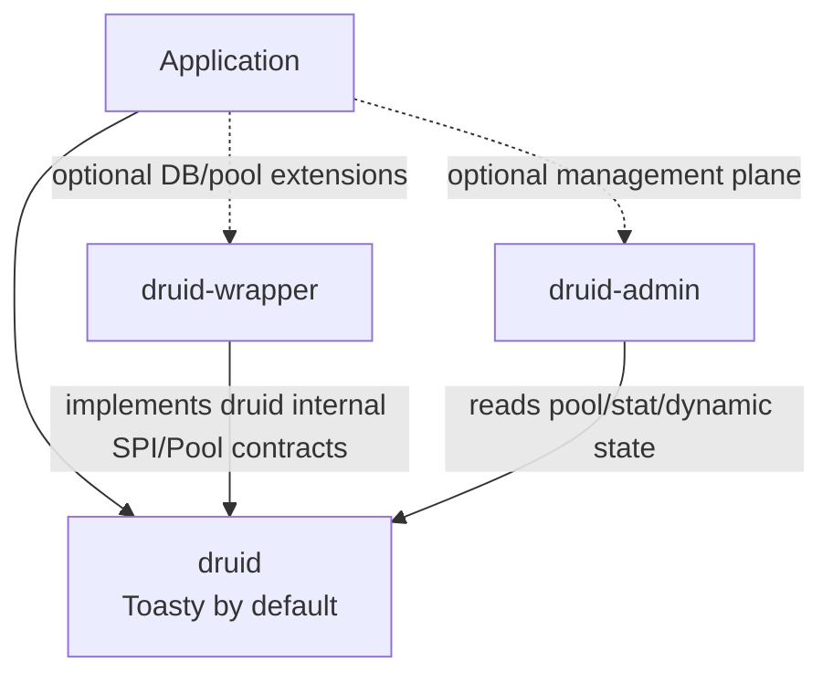
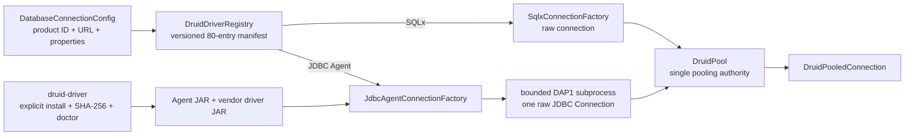

<a id="readme-top"></a>

<div align="center">

# druid-rust

**A planned, complete semantic migration of Alibaba Druid 1.2.28 to Rust**

[English](./README.md) | [简体中文](./README.zh-CN.md)

[Positioning](#1-project-positioning-and-status) ·
[Features](#2-features-and-maturity) ·
[Three-module architecture](#4-three-module-architecture) ·
[Examples](#6-executable-examples-and-call-paths) ·
[Migration roadmap](#11-migration-roadmap-and-phases) ·
[Contributing](#19-contributing-security-and-license)

</div>

---

> **Project status: semantic migration in progress**
>
> This repository is a buildable and tested Cargo workspace. It includes core,
> native-pool, SQL, Wall, statistics, dynamic data-source, built-in Toasty, and
> several direct-driver and external-pool bridge implementations. It does not yet
> implement all Druid semantics and has no stable public API. Any completion claim
> requires Java oracles, Rust contracts, and real-database evidence.
>
> This is not a line-by-line Java translation, but it is also not an
> architecture-inspired subset that silently drops functionality.

> **Last verified:** 2026-08-07.

## 1. Project Positioning and Status

**druid-rust is a workspace that migrates the observable behavior of Alibaba Druid
into the asynchronous Rust ecosystem.** Connection pooling,
Connection/Statement/ResultSet behavior, filters, SQL firewall, statistics, dynamic
data sources, administration, and wrappers are tracked in object and semantic ledgers.

Rust platform adaptation uses Toasty, Tokio, sqlparser, SQLx, RBDC, deadpool, bb8,
Axum, and related ecosystem components. Replacing a platform mechanism never removes
the obligation to migrate Druid result semantics.

### 1.1 What this project is

| Field | Value |
| :--- | :--- |
| Java baseline | Druid `1.2.28`, commit `33824c3dec1612711f9bb4e409319bcab2e4cd0e` |
| Product modules | `druid`, `druid-admin`, and `druid-wrapper`; no fourth module |
| Public connection | `DruidPooledConnection` |
| Internal physical SPI | `PhysicalConnection` / `PhysicalConnectionFactory` |
| Native pool | `DruidPool` |
| Built-in standard data source | Toasty 0.9, SQLite by default |
| Current version | `0.0.0-design` |
| MSRV | `1.95` |
| Default toolchain | `1.97.1` |
| Edition / Resolver | `2021` / `2` |
| Unsafe policy | `forbid` |
| Publication | Unpublished; every crate has `publish = false` |
| License | Apache-2.0 |

### 1.2 What this project is not

- **Not a line-by-line or layout-by-layout copy.** Java behavior is migrated through
  object and semantic ledgers; scheduling, ownership, and ecosystem adaptation use
  Rust mechanisms.
- **Not a feature-inspiration project.** When Rust lacks a direct platform object, the
  behavior must be represented through `ADAPTER`, `MERGE`, `SPLIT`, or `PROTOCOL`
  rather than removed.
- **The Druid governance layer is not a SQL generator.** Toasty is the built-in
  data-source/ORM entry point, while DruidPool, Filter, Stat, and recycling semantics
  remain owned by druid-rust.
- **Not a schema-migration tool.** Database version management belongs to the host
  application or a dedicated migration tool.
- **Not release-ready.** Multi-database matrices, complete Java differential tests,
  stable APIs, CI, coverage, and benchmarks remain open.

### 1.3 Status evidence

| Claim | Current value | Evidence |
| :--- | :--- | :--- |
| Workspace builds | Yes | `cargo check --workspace` |
| Workspace tests | New driver contracts pass; the full suite still has pre-existing core assertion failures | `cargo test --workspace` |
| Real SQLite | 21 cross-layer cases pass | Toasty, SQLx, bb8, deadpool, wrapper tests |
| Toasty feature graph | All features compose and compile | `cargo check -p druid --all-features` |
| Connection API | Implemented, unstable | `DruidPooledConnection → DruidConnectionHolder → PhysicalConnection` |
| Migration completion | Partial | module ledgers under `docs/druid*` |
| crates.io / docs.rs | Unpublished | `publish = false` |
| CI | Driver matrix configured; remote run pending | `.github/workflows/driver-matrix.yml` |
| Coverage | Historical snapshots exist; exit gate is open | migration roadmap §15 |
| Benchmarks | Not measured | no stable benchmark report |

## 2. Features and Maturity

### 2.1 Feature matrix

| Feature | Status | Owning module | Current boundary | Verification |
| :--- | :---: | :--- | :--- | :--- |
| Public `DruidPooledConnection` | 🚧 Partial | `druid` | Full JDBC breadth is incomplete | core/pool contracts |
| Internal `PhysicalConnection` SPI | 🚧 Partial | `druid` | metadata/LOB/vendor surface pending | physical contract |
| Druid native async pool | 🚧 Partial | `druid` | Full configuration and production matrix pending | lifecycle/concurrency/maintenance |
| PreparedStatement cache | 🚧 Partial | `druid` | Callable and driver matrices pending | Java oracle + Rust tests |
| SQL AST, Wall, and statistics | 🚧 Partial | `druid` | dialect/rule/layered-stat matrix incomplete | differential tests |
| Dynamic data-source switching | 🚧 Partial | `druid` | HA health and recovery pending | route/switch tests |
| Default Toasty integration | 🧪 Preview | `druid` | SQLite tested; other real DBs pending | real SQLite + all-features |
| SQLx/RBDC database operations | 🚧 Partial | `druid-wrapper` | real-database matrix pending | adapter contracts |
| 80 SQL database product catalog | 🧪 Preview | `druid-wrapper` | fixed 15/25/40 phases; catalog entries are not verified support | manifest/registry contracts |
| JDBC Agent long tail | 🧪 Preview | `druid-wrapper` + release asset | cross-language H2 contract works; vendor matrix pending | Rust/Java/H2 contract |
| Explicit driver install and diagnostics | 🧪 Preview | `druid-admin` | content-addressed JARs, SHA-256, doctor; no implicit download | installer contract |
| bb8/deadpool external pools | 🧪 Preview | `druid-wrapper` | must not nest DruidPool | real SQLite bridges |
| Java-compatible `/druid/*` Admin | 🗓️ Planned | `druid-admin` | only placeholder state/endpoint strings | migration ledger |
| Complete Java semantics | 🚧 Partial | workspace | P0–P10 are not closed | object/semantic ledgers |

### 2.2 Status legend

| Status | Definition |
| :--- | :--- |
| ✅ Stable | Public API, differential, real integration, docs, and compatibility commitments are complete |
| 🧪 Preview | Real implementation and tests exist, but API or database matrix may change |
| 🚧 Partial | Only the explicitly recorded semantic slices are available |
| 🗓️ Planned | No acceptable real implementation exists |
| ⛔ Unsupported | The platform cannot carry the capability and an alternative plus explicit error is recorded |

## 3. Rust Baseline and Platform Support

| Item | Value | Source |
| :--- | :--- | :--- |
| MSRV | `1.95` | workspace `rust-version`; required by Toasty 0.9 |
| Default toolchain | `1.97.1` | `rust-toolchain.toml` |
| Edition | `2021` | workspace package |
| Resolver | `2` | workspace |
| rustfmt | stable | toolchain component |
| Clippy | workspace `all + pedantic` | workspace lint |
| Async runtime | Tokio 1.x | workspace dependency |
| `no_std` / WASM | No commitment | database-driver and Tokio dependencies |

Stable Linux, macOS, and Windows support requires CI evidence. The current local
verification environment is not a cross-platform release commitment.

## 4. Three-Module Architecture

### 4.1 One-screen view

```text
[Downstream application]
        │
        ▼
┌──────────────────────────────────────────────────────────────┐
│ druid                                                        │
│ Complete Druid core semantic body                            │
│ Pool / SQL / Wall / Stat / Dynamic / JDBC platform objects  │
│ Toasty integrated by default                                 │
└──────────────────────────────────────────────────────────────┘
        ▲                                  ▲
        │                                  │
┌──────────────────────────┐  ┌───────────────────────────────┐
│ druid-wrapper            │  │ druid-admin                   │
│ SQLx / RBDC              │  │ Java Admin compatibility      │
│ bb8 / deadpool           │  │ discovery, aggregation, DTOs  │
│ DB operations and pools  │  │ routes and resources          │
└──────────────────────────┘  └───────────────────────────────┘
```

The connection boundary is fixed:

```text
DruidPooledConnection            public pooled connection
└── DruidConnectionHolder        Druid lifecycle authority
    └── PhysicalConnection       minimal internal SPI
        ├── ToastyConnectionAdapter
        ├── SqlxConnectionAdapter
        ├── RbdcConnectionAdapter
        └── other direct-driver adapters
```

bb8 and deadpool are `Pool` providers. They hold external leases through
`PhysicalConnectionLease`, do not implement `PhysicalConnectionFactory`, and must not
be nested inside `DruidPool`.

### 4.2 Module dependency graph



### 4.3 Module map

| Module | Java source | Responsibility | Default/optional |
| :--- | :---: | :--- | :--- |
| `druid` | Java `/core` | 1,644 core-object semantics; pool/sql/wall/stat/dynamic; Toasty by default | default |
| `druid-wrapper` | Java `/druid-wrapper` | SQLx, RBDC, bb8, deadpool, database-operation and connection-ecosystem adapters | optional |
| `druid-admin` | Java `/druid-admin` | discovery, monitoring aggregation, DTOs, routing, resources, management extensions | optional |

### 4.4 Completed Physical Consolidation

The workspace has physically converged to three crates. The former ten internal crates
were removed and moved into named internal directories:

| Removed former crate | Current module | Current internal directory |
| :--- | :--- | :--- |
| `druid-core`, `druid-pool`, `druid-sql`, `druid-stats`, `druid-dynamic` | `druid` | `crates/druid/src/{core,pool,sql,stats,dynamic}/` |
| `druid-toasty` | `druid` | `crates/druid/src/toasty/`, enabled by default |
| `druid-sqlx`, `druid-rbdc`, `druid-sqlx-bb8`, `druid-sqlx-deadpool` | `druid-wrapper` | `crates/druid-wrapper/src/rbdc/`、`crates/druid-wrapper/src/sqlx/{bb8,deadpool}/` |

- `cargo metadata` reports only `druid`, `druid-wrapper`, and `druid-admin` as workspace members.
- Internal directories do not own independent public APIs, versions, completion
  percentages, or release artifacts.
- Native and external pooling modes remain mutually exclusive after consolidation.
- `druid-wrapper` integrates through druid's internal SPI/Pool contracts and does not
  leak third-party types to applications.
- `druid-admin` depends only on druid's management read contracts.

## 5. Design Principles

| Principle | Engineering rule | Verification |
| :--- | :--- | :--- |
| Semantic migration | Java objects and methods enter object/semantic ledgers | Java/Rust differential |
| Type safety | Driver types remain inside adapters | compile/public API audit |
| Clear ownership | A holder owns one physical connection; a lease returns once | exactly-once tests |
| One pooling authority | Native and external modes are mutually exclusive | provider contract |
| Explicit errors | Unsupported capabilities return structured errors | error/capability tests |
| Safe defaults | Unknown schemes, invalid savepoints, and dirty transactions fail safely | negative-path tests |
| Evidence-driven | File existence or matching names do not establish completion | real DB + oracle |
| Evolvable | Built-in standard and extensions have separate boundaries | feature/API audit |

## 6. Executable Examples and Call Paths

The README no longer publishes non-compiling pseudo APIs. Executable usage for the
current revision lives in tests under the three product crates:

### 6.1 Built-in Toasty SQLite

- [`toasty_connection_adapter_test.rs`](crates/druid/tests/toasty_connection_adapter_test.rs)
  covers DDL/DML/query, six `Value` types, prepared execution, transactions,
  savepoints, generated keys, discard, and unknown URLs.
- [`sqlite_core_semantics_test.rs`](crates/druid/tests/sqlite_core_semantics_test.rs)
  covers the Toasty → DruidPool → DruidPooledConnection vertical path.

### 6.2 Native pool and connection lifecycle

- [`physical_connection_contract.rs`](crates/druid/tests/physical_connection_contract.rs)
  covers concurrent capacity, Filter dispatch, and exactly-once return.
- [`recycle_semantics_test.rs`](crates/druid/tests/recycle_semantics_test.rs)
  covers rollback, reset, validation, discard, and schema behavior.
- [`prepared_statement_semantics_test.rs`](crates/druid/tests/prepared_statement_semantics_test.rs)
  covers cache, LRU, in-use state, and connection lease boundaries.

### 6.3 Direct and external extensions

- [`sqlx_connection_adapter_test.rs`](crates/druid-wrapper/tests/sqlx_connection_adapter_test.rs)
- [`sqlx_bb8_pool_test.rs`](crates/druid-wrapper/tests/sqlx_bb8_pool_test.rs)
- [`sqlx_deadpool_pool_test.rs`](crates/druid-wrapper/tests/sqlx_deadpool_pool_test.rs)
- [`sqlite_wrapper_semantics_test.rs`](crates/druid-wrapper/tests/sqlite_wrapper_semantics_test.rs)

Until the API stabilizes, the README does not promise constructor signatures. Tests
are the executable examples for the current source revision.

### 6.4 80-database catalog and JDBC Agent

`druid-wrapper` ships a versioned, SQL-only catalog of exactly 80 database products
in fixed 15/25/40 delivery phases. Non-SQL products such as Redis, MongoDB, Kafka,
RabbitMQ, etcd, and ZooKeeper are deliberately excluded. `declared`, `experimental`,
`verified`, and `certified` are distinct evidence states; only the last two count as
public support. An 80-entry catalog is therefore not an “80 databases supported”
claim.



The core pool never downloads a driver. Downloads are explicit HTTPS administrative
operations and require a SHA-256 checksum; commercial drivers are supplied locally
by an authorized user. The Agent is spawned without a shell, uses bounded
length-prefixed DAP1 frames with request correlation and timeouts, and owns one raw
JDBC connection rather than another pool. `driver-matrix.yml` defines the H2 contract
for Linux, macOS, and Windows, but its first remote result is still pending; each vendor
also needs its own live evidence gate.

```bash
cargo run -p druid-admin --bin druid-driver -- catalog
cargo run -p druid-admin --bin druid-driver -- install-agent <root> <agent.jar> [sha256]
cargo run -p druid-admin --bin druid-driver -- install-file <root> h2 <h2.jar> [sha256]
cargo run -p druid-admin --bin druid-driver -- doctor <root> h2
```

## 7. Cargo Features

The Toasty feature contract is exposed directly by `druid`:

| Feature | Default | Capability | Boundary |
| :--- | :---: | :--- | :--- |
| `sqlite` | ✅ | Toasty SQLite driver | built-in real SQLite gate |
| `postgresql` | ❌ | Toasty PostgreSQL driver | real container pending |
| `mysql` | ❌ | Toasty MySQL driver | real container pending |
| `turso` | ❌ | Toasty Turso driver | real service pending |
| `dynamodb` | ❌ | Toasty DynamoDB driver | non-SQL; excluded from `PhysicalConnection` |

```bash
cargo check -p druid --all-features
```

SQLx/RBDC/bb8/deadpool features must likewise be unified under `druid-wrapper`, not
form independent version contracts in separately published crates. A new feature must
update the capability matrix, dependency tree, real integration tests, and release
notes.

## 8. Core API and Usage

The canonical object relationship is:

```text
DruidPool::get/get_timeout
    → DruidPooledConnection
        → DruidConnectionHolder
            → dyn PhysicalConnection
```

Core traits and objects:

| Object | Responsibility |
| :--- | :--- |
| `Pool` | Unified acquisition and state contract for native/external providers |
| `DruidPool` | Native pool implementation |
| `DruidPooledConnection` | Public facade, Filter dispatch, recycling |
| `DruidConnectionHolder` | Physical connection, state, timing, counters, prepared cache |
| `PhysicalConnection` | Minimal internal SPI for direct adapters |
| `PhysicalConnectionFactory` | Creates/validates unpooled connections in native mode |
| `PhysicalConnectionLease` | Holds and returns an external-pool object |
| `PhysicalConnectionCapabilities` | Declares advanced adapter capabilities |

The old `Connection`, `ConnectionFactory`, and `PooledConnection` names remain only as
migration compatibility re-exports and are not canonical for new code.

## 9. Backends, Formats, and Optional Engines

| Channel | Backend | Pool owner | Current evidence |
| :--- | :--- | :--- | :--- |
| Built-in Toasty | SQLite | DruidPool | real tests pass |
| Built-in Toasty | PostgreSQL/MySQL/Turso | DruidPool | features compile; real DB pending |
| Non-SQL Toasty | DynamoDB | n/a | SQL factory rejects it explicitly |
| Direct SQLx | SQLite | DruidPool | real tests pass |
| Direct SQLx | PostgreSQL/MySQL | DruidPool | real DB pending |
| Direct RBDC | RBDC driver ecosystem | DruidPool | trait contract; real DB pending |
| SQLx + bb8 | SQLite/SQLx drivers | bb8 | real SQLite bridge |
| SQLx + deadpool | SQLite/SQLx drivers | deadpool | real SQLite bridge |

Engine capabilities are not equal. Callers must inspect capabilities; unsupported
operations return explicit errors and never silently report success.

## 10. Concurrency, Memory, and Resource Model

- `DruidPooledConnection` provides exclusive mutable access for a lease.
- The same `DruidConnectionHolder` moves between the idle queue and active facade.
- Native open/active/idle/creating counters remain conserved and never exceed
  `max_open`.
- `DynamicDataSource` uses `ArcSwap<DataSourceGroup>`; switching affects later routes.
- A transaction connection never drifts because of dynamic switching.
- Explicit async close performs rollback, reset, and validation.
- `Drop` reuses only clean connections that require no async repair; dirty connections
  are discarded safely.
- External leases return to their original bb8/deadpool owner, never to DruidPool.
- Cancellation, panic, and recycle errors must not cause double returns or capacity
  leaks.

## 11. Migration Roadmap and Phases

The authoritative plan is the
[migration roadmap](docs/迁移总路线图.md):

| Phase | Object domain | Current status |
| :--- | :--- | :--- |
| P0 | Baseline, object governance, correctness triage | in progress |
| P1 | Internal SPI and real-database adapters | SQLite path implemented; matrix open |
| P2 | Connection-pool lifecycle | partial |
| P3 | Filter, Proxy, execution events | partial |
| P4 | SQL core and dialects | partial |
| P5 | Wall | partial |
| P6 | Stat, tracing, logging | partial |
| P7 | HA, dynamic data sources, recovery | partial |
| P8 | Admin, monitoring, framework integration | TODO |
| P9 | XA, distributed transactions, advanced compatibility | TODO |
| P10 | Full differential, performance, production release | TODO |

A crate's existence does not close a phase. Exit criteria require object, behavior,
error, real-integration, and production-property evidence.

## 12. Documentation Set

The root `docs/` directory maintains only:

| Document | Responsibility |
| :--- | :--- |
| [Architecture](docs/druid-rust-Architecture.zh_CN.md) | current/target architecture, invariants, ADRs |
| [Documentation index](docs/README.md) | roadmap, module ledgers, semantics, naming, connection design |

The three module directories are the authoritative object, semantic, and naming
ledgers. Project-level documents aggregate navigation and gates without copying a
second completion ledger. The README is the project entry point, not another roadmap.

## 13. Quality Gates

| Command / gate | Current result |
| :--- | :--- |
| `cargo fmt --all -- --check` | passes |
| `cargo test --workspace` | new driver contracts pass; existing callable/cache, pool-default, and filter-lifecycle assertions keep the full gate open |
| `cargo check -p druid --all-features` | passes |
| `cargo clippy --workspace --all-targets --no-deps -- -D warnings` | fails; pre-existing pedantic lint debt remains |
| `cargo llvm-cov` | historical snapshots exist; completion gate is open |
| `cargo audit` / `cargo deny` | not yet continuous CI gates |
| Full Java/Rust differential | incomplete |
| Real PostgreSQL/MySQL/Turso matrix | incomplete |

Recommended local commands:

```bash
cargo check --workspace
cargo test --workspace
cargo fmt --all -- --check
cargo check -p druid --all-features
cargo clippy -p druid --all-targets --no-deps -- -D warnings
```

## 14. Benchmark Surface

The following are measurement targets, not current performance claims:

| Scenario | Required measurement | Current state |
| :--- | :--- | :--- |
| `pool_acquire` | hot/cold acquisition, contention, timeout | no stable report |
| `recycle` | rollback, reset, validate, discard | no stable report |
| `prepared_cache` | hit/miss/LRU/concurrent in-use | no stable report |
| `sql_parse/wall` | multiple dialects, rules, complex SQL | no stable report |
| `sql_merge` | parameterization, fingerprint, histogram | no stable report |
| `dynamic_switch` | ArcSwap switching and routing | no stable report |

Performance results may be published only with hardware, toolchain, database versions,
dataset, and commit information.

## 15. Compatibility and Migration

| Topic | Rule |
| :--- | :--- |
| Java baseline | fixed at Druid 1.2.28; upgrades require a differential batch |
| SemVer | applies after `publish = false` is removed |
| MSRV | currently 1.95; changes update workspace, README, and release notes |
| Default features | changing a default feature is a compatibility event |
| Object naming | governed by the object-name consistency audit |
| Errors | preserve structured classification; strings alone are insufficient |
| Adapters | do not leak third-party types or silently reduce capabilities |
| Vendor patches | record source, change scope, and removal condition |

## 16. Troubleshooting

### Toasty and SQLx SQLite link conflict

Cargo can link only one `libsqlite3-sys`. The current vendor patch lets Toasty SQLite
and SQLx 0.8 share `libsqlite3-sys 0.30.1`.

```bash
cargo tree -i libsqlite3-sys
```

### Data disappears with `sqlite::memory:`

Each physical SQLite memory connection has an independent database.
`ToastyConnectionFactory` restores a maximum-connection limit of one for this URL.
Use a file database or an explicitly tested shared-cache URL when multiple connections
must share state.

### External-pool capacity doubles or connections do not return

Check whether a bb8/deadpool bridge was nested inside `DruidPool`. An external provider
returns the canonical `DruidPooledConnection` directly and
`PhysicalConnectionLease` returns the object to its original owner.

### Endpoint strings exist but Admin HTTP is unavailable

`druid-admin` remains a placeholder and has no real Axum Router or handlers. Endpoint
list tests do not establish a working HTTP service.

### `UnsupportedOperation`

Inspect `PhysicalConnectionCapabilities` first. An adapter must not emulate unsupported
capabilities with configuration or an in-memory flag.

## 17. crates.io Publication

No module is published. Only `druid`, `druid-wrapper`, and `druid-admin` may ultimately
be published. Minimum publication conditions:

- [ ] The target module has no false `DONE` states in object or semantic ledgers.
- [x] Its former transitional implementation crates have been consolidated and are
      not separate release artifacts.
- [ ] Default and optional features have real integration tests.
- [ ] `cargo publish --dry-run` passes.
- [ ] fmt, clippy, test, doc, audit, and deny run in CI.
- [ ] docs.rs builds the published feature matrix.
- [ ] MSRV passes in a clean environment.
- [ ] Public API, error, and configuration compatibility policies are frozen.
- [ ] License, vendor, and third-party NOTICE audits are complete.

## 18. Contribution Flow

- Locate the Java origin and current state in the object ledger before editing.
- Use CodeGraph to analyze objects, call paths, and affected tests.
- One `.rs` file represents one Java object or an explicit Rust-only object.
- Do not use `todo!()`, `unimplemented!()`, empty logic, or centralized `compat.rs`
  stubs as implementation.
- New objects and public methods use Chinese doc comments and identify Java origins.
- Update all migration ledgers for every new or changed
  `MERGE/SPLIT/ADAPTER/PROTOCOL` decision.
- Add a failing test first, implement, then run real-database or Java differential
  verification.
- Report commands, pass counts, open gates, and known warnings in the handoff.

## 19. Contributing, Security, and License

druid-rust is licensed under [Apache-2.0](LICENSE).

The name `druid-rust` identifies a Rust semantic migration of Alibaba Druid; it does
not represent an official Alibaba distribution. Publications and releases must retain
upstream attribution.

Ordinary logs must not expose database passwords, tokens, complete connection URLs,
raw SQL parameters, or other PII. A formal vulnerability-disclosure channel will be
established before the first release; do not publicly disclose unpatched issues before
then.

---

<div align="center">

[Back to top](#readme-top) ·
[Architecture](docs/druid-rust-Architecture.zh_CN.md) ·
[Documentation index](docs/README.md) ·
[Issues](https://github.com/easy-4-rust/druid-rust/issues)

</div>
