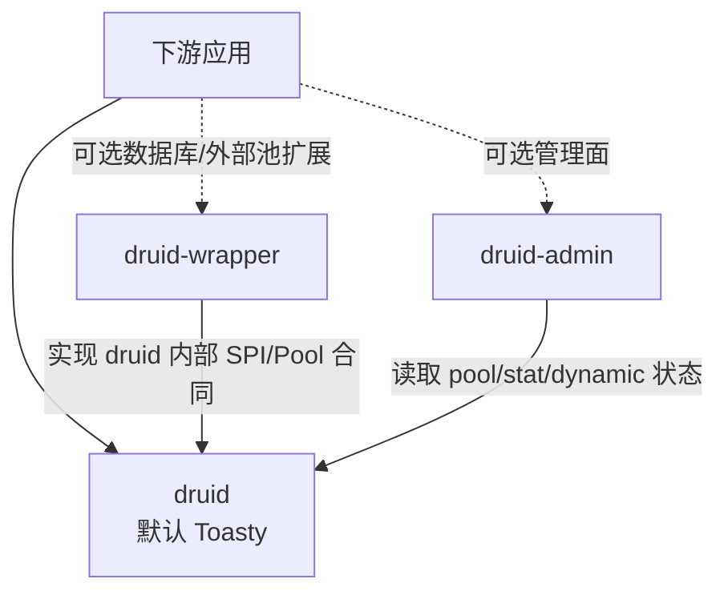
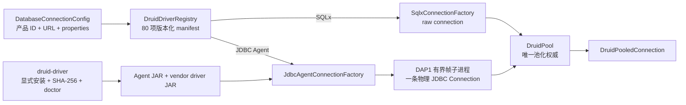

<a id="readme-top"></a>

<div align="center">

# druid-rust

**阿里 Druid 1.2.28 到 Rust 的规划式完整语义迁移**

[English](./README.md) | [简体中文](./README.zh-CN.md)

[定位与状态](#1-项目定位与状态) · [功能与成熟度](#2-功能与成熟度) ·
[三模块架构](#4-三模块架构) ·
[示例与调用路径](#6-可执行示例与调用路径) ·
[迁移路线](#11-迁移路线与阶段) ·
[贡献与许可证](#19-贡献安全与许可证)

</div>

---

> **项目状态：功能语义迁移进行中**
>
> 当前仓库是可构建、可测试的 Cargo workspace，已经包含 core、native pool、
> SQL、Wall、统计、动态数据源、Toasty 内置数据源和多种驱动/外部池桥接实现。
> 它尚未完成全部 Druid 语义迁移，也没有稳定公共 API。任何“完成”都必须有
> Java oracle、Rust contract 和真实数据库证据。
>
> 迁移不是 Java 源码逐行翻译，但也不是只借鉴架构模式后自行删减功能。

> **最后核验**：2026-08-07。

## 1. 项目定位与状态

**druid-rust 是把阿里 Druid 的可观察功能语义迁移到 Rust 异步生态的
workspace。** 连接池、Connection/Statement/ResultSet、过滤器链、SQL
防火墙、统计、动态数据源、管理面和 wrapper 都进入对象总账和语义契约表。

Rust 平台适配使用 Toasty、Tokio、sqlparser、SQLx、RBDC、deadpool、bb8、
Axum 等生态组件。组件替换只改变实现机制，不改变 Druid 结果语义的迁移责任。

### 1.1 是什么

| 字段 | 值 |
| :--- | :--- |
| Java 基线 | Druid `1.2.28`，提交 `33824c3dec1612711f9bb4e409319bcab2e4cd0e` |
| 产品模块 | `druid`、`druid-admin`、`druid-wrapper`，且只允许这三个 |
| 对外连接 | `DruidPooledConnection` |
| 内部物理 SPI | `PhysicalConnection` / `PhysicalConnectionFactory` |
| Native pool | `DruidPool` |
| 内置标准数据源 | Toasty 0.9，默认 SQLite |
| 当前版本 | `0.0.0-design` |
| MSRV | `1.95` |
| 默认工具链 | `1.97.1` |
| Edition / Resolver | `2021` / `2` |
| unsafe 策略 | `forbid` |
| 发布状态 | 未发布；每个 crate `publish = false` |
| 许可证 | Apache-2.0 |

### 1.2 不是什么

- **不是逐行、逐类布局复制。** Java 行为通过对象总账和语义契约迁移；
  调度、所有权和生态适配使用 Rust 机制实现。
- **不是功能借鉴项目。** Rust 中没有直接标准对象时，应通过
  `ADAPTER/MERGE/SPLIT/PROTOCOL` 迁移，而不是删去能力。
- **Druid 治理层不是 SQL 生成器。** Toasty 是内置标准数据源/ORM 入口，
  但 DruidPool、Filter、Stat 和回收语义仍由 druid-rust 掌握。
- **不是 Schema migration 工具。** 数据库版本管理由宿主应用或专用工具承担。
- **尚未达到发布标准。** 多数据库矩阵、完整 Java 差分、稳定 API、CI、
  覆盖率和基准仍未闭环。

### 1.3 状态证据

| 声明 | 当前值 | 证据 |
| :--- | :--- | :--- |
| workspace 可构建 | 是 | `cargo check --workspace` |
| 全 workspace 测试 | 新增驱动契约通过；全量仍有既存 core 断言失败 | `cargo test --workspace` |
| 真实 SQLite | 21 个跨内置/core/扩展用例通过 | Toasty、SQLx、bb8、deadpool、wrapper 测试 |
| Toasty feature 图 | 全部可组合编译 | `cargo check -p druid --all-features` |
| 连接 API | 已实现，尚不稳定 | `DruidPooledConnection → DruidConnectionHolder → PhysicalConnection` |
| 迁移完成度 | 部分 | `docs/druid*` 三模块对象与语义账本 |
| crates.io / docs.rs | 未发布 | `publish = false` |
| CI | 已配置驱动矩阵，等待远端执行 | `.github/workflows/driver-matrix.yml` |
| 覆盖率 | 有历史快照，未达到完成门禁 | 迁移路线图 §15 |
| 基准 | 未测量 | 无稳定 benchmark 报告 |

## 2. 功能与成熟度

### 2.1 功能矩阵

| 功能 | 状态 | 所属模块 | 当前边界 | 验证 |
| :--- | :---: | :--- | :--- | :--- |
| `DruidPooledConnection` 对外连接 | 🚧 部分 | `druid` | JDBC 全广度未完成 | core/pool contract |
| `PhysicalConnection` 内部 SPI | 🚧 部分 | `druid` | metadata/LOB/vendor 能力待扩 | physical contract |
| Druid native 异步连接池 | 🚧 部分 | `druid` | 完整配置和生产矩阵未完成 | 生命周期/并发/维护测试 |
| PreparedStatement cache | 🚧 部分 | `druid` | Callable/driver 全矩阵待补 | Java oracle + Rust 测试 |
| SQL AST、Wall 与统计 | 🚧 部分 | `druid` | Druid 方言、规则、分层统计未完成 | differential 测试 |
| 多数据源热切换 | 🚧 部分 | `druid` | HA 健康和恢复未完成 | route/switch 测试 |
| Toasty 默认集成 | 🧪 预览 | `druid` | SQLite 已测，其他数据库实测待补 | 真实 SQLite + all-features |
| SQLx/RBDC 数据库操作适配 | 🚧 部分 | `druid-wrapper` | 真实数据库矩阵未完成 | adapter contract |
| 80 个 SQL 数据库产品目录 | 🧪 预览 | `druid-wrapper` | 15/25/40 三阶段；目录不等于已验证支持 | manifest/registry contract |
| JDBC Agent 长尾驱动 | 🧪 预览 | `druid-wrapper` + release asset | H2 跨语言契约已接通；厂商实库矩阵待补 | Rust/Java/H2 contract |
| 驱动显式安装与诊断 | 🧪 预览 | `druid-admin` | JAR 内容寻址、SHA-256、doctor；无隐式下载 | installer contract |
| bb8/deadpool 外部池适配 | 🧪 预览 | `druid-wrapper` | 禁止嵌套 DruidPool | 真实 SQLite bridge |
| `/druid/*` Admin 兼容面 | 🗓️ 计划 | `druid-admin` | 只有占位 state/endpoint 字符串 | 迁移账本 |
| Java 全对象语义 | 🚧 部分 | workspace | P0–P10 未全部关闭 | 对象/语义总账 |

### 2.2 状态定义

| 状态 | 定义 |
| :--- | :--- |
| ✅ 稳定 | 公共 API、差分、真实集成、文档和兼容承诺齐全 |
| 🧪 预览 | 存在真实实现和测试，但 API 或数据库矩阵可能变化 |
| 🚧 部分 | 只有总账中明确列出的语义切片可用 |
| 🗓️ 计划 | 尚无可接受的真实实现 |
| ⛔ 不支持 | 平台确实无法承载，并已登记替代方案和明确错误 |

## 3. Rust 基线与平台支持

| 项目 | 值 | 来源 |
| :--- | :--- | :--- |
| MSRV | `1.95` | workspace `rust-version`；Toasty 0.9 最低要求 |
| 默认工具链 | `1.97.1` | `rust-toolchain.toml` |
| Edition | `2021` | workspace package |
| Resolver | `2` | workspace |
| rustfmt | stable | toolchain component |
| Clippy | workspace `all + pedantic` | workspace lint |
| async runtime | Tokio 1.x | workspace dependency |
| `no_std` / WASM | 不承诺 | 数据库 driver 和 Tokio 运行时依赖 |

Linux、macOS 和 Windows 的稳定支持矩阵需要 CI 证据。当前本地验证环境不能被
解释为跨平台发布承诺。

## 4. 三模块架构

### 4.1 一眼看懂

```text
[下游应用]
        │
        ▼
┌──────────────────────────────────────────────────────────────┐
│ druid                                                        │
│ Druid core 完整语义主体                                      │
│ Pool / SQL / Wall / Stat / Dynamic / JDBC 平台对象           │
│ 默认整合 Toasty                                              │
└──────────────────────────────────────────────────────────────┘
        ▲                                  ▲
        │                                  │
┌──────────────────────────┐  ┌───────────────────────────────┐
│ druid-wrapper            │  │ druid-admin                   │
│ SQLx / RBDC              │  │ Java Admin 兼容面             │
│ bb8 / deadpool           │  │ 监控、聚合、路由、DTO         │
│ 各数据库操作与池扩展封装 │  │                               │
└──────────────────────────┘  └───────────────────────────────┘
```

连接边界固定为：

```text
DruidPooledConnection            对外池化连接
└── DruidConnectionHolder        Druid 生命周期权威容器
    └── PhysicalConnection       内部最小 SPI
        ├── ToastyConnectionAdapter
        ├── SqlxConnectionAdapter
        ├── RbdcConnectionAdapter
        └── 其他直接驱动 Adapter
```

bb8/deadpool 是 `Pool` provider：它们通过 `PhysicalConnectionLease` 持有外部
租约，不实现 `PhysicalConnectionFactory`，也不能再嵌套到 `DruidPool`。

### 4.2 模块依赖图



### 4.3 Module Map

| 模块 | Java 来源 | 职责 | 默认/可选 |
| :--- | :---: | :--- | :--- |
| `druid` | Java `/core` | 1,644 个 core 对象语义；内含 pool/sql/wall/stat/dynamic；默认 Toasty | 默认 |
| `druid-wrapper` | Java `/druid-wrapper` | SQLx、RBDC、bb8、deadpool 和各种数据库操作/连接生态封装 | 可选 |
| `druid-admin` | Java `/druid-admin` | 服务发现、监控聚合、DTO、路由、资源和管理扩展 | 可选 |

### 4.4 已完成的物理归并

workspace 已物理收敛为三个 crate；原十个内部 crate 已删除并迁入具名内部目录：

| 已删除的原物理 crate | 当前模块 | 当前内部目录 |
| :--- | :--- | :--- |
| `druid-core`、`druid-pool`、`druid-sql`、`druid-stats`、`druid-dynamic` | `druid` | `crates/druid/src/{core,pool,sql,stats,dynamic}/` |
| `druid-toasty` | `druid` | `crates/druid/src/toasty/`，默认启用 |
| `druid-sqlx`、`druid-rbdc`、`druid-sqlx-bb8`、`druid-sqlx-deadpool` | `druid-wrapper` | `crates/druid-wrapper/src/rbdc/`、`crates/druid-wrapper/src/sqlx/{bb8,deadpool}/` |

- `cargo metadata` 的 workspace member 只有 `druid`、`druid-wrapper`、`druid-admin`。
- 内部目录不能独立形成公共 API、版本、完成率或发布物。
- Native 和 external pool 模式仍互斥，归并不改变连接所有权合同。
- `druid-wrapper` 只通过 `druid` 的内部 SPI/Pool 合同接入，不把第三方类型泄漏给应用。
- `druid-admin` 只依赖 `druid` 的管理读取合同。

## 5. 设计原则

| 原则 | 工程落地 | 验证手段 |
| :--- | :--- | :--- |
| 语义迁移 | Java 对象和方法进入对象/语义账本 | Java/Rust 差分 |
| 类型安全 | driver 类型只存在于 adapter 内部 | 编译和公共 API 审计 |
| 所有权清晰 | holder 拥有一条物理连接；租约只归还一次 | exactly-once 测试 |
| 单一池化权威 | native/external 两种模式互斥 | provider contract |
| 错误显式 | 不支持能力返回结构化错误 | error/capability 测试 |
| 默认安全 | 未知 scheme、非法 savepoint、脏事务安全失败 | 负面路径测试 |
| 证据驱动 | 文件存在或名称相同不构成完成 | 真实 DB + oracle |
| 可演进 | 内置标准和扩展分层 | feature/API 审计 |

## 6. 可执行示例与调用路径

README 不再保存无法编译的伪 API。当前可执行用法以三个 crate 内的测试文件为准：

### 6.1 Toasty 内置 SQLite

- [`toasty_connection_adapter_test.rs`](crates/druid/tests/toasty_connection_adapter_test.rs)
  覆盖建表、增删查、六类 `Value`、prepared、事务、savepoint、generated key、
  discard 和未知 URL。
- [`sqlite_core_semantics_test.rs`](crates/druid/tests/sqlite_core_semantics_test.rs)
  覆盖 Toasty → DruidPool → DruidPooledConnection 的纵向主链。

### 6.2 Native pool 与连接生命周期

- [`physical_connection_contract.rs`](crates/druid/tests/physical_connection_contract.rs)
  覆盖并发容量、Filter 和 exactly-once 归还。
- [`recycle_semantics_test.rs`](crates/druid/tests/recycle_semantics_test.rs)
  覆盖 rollback、状态复位、校验、discard 和 schema。
- [`prepared_statement_semantics_test.rs`](crates/druid/tests/prepared_statement_semantics_test.rs)
  覆盖缓存、LRU、in-use 和连接租约边界。

### 6.3 Direct 与 external 扩展

- [`sqlx_connection_adapter_test.rs`](crates/druid-wrapper/tests/sqlx_connection_adapter_test.rs)
- [`sqlx_bb8_pool_test.rs`](crates/druid-wrapper/tests/sqlx_bb8_pool_test.rs)
- [`sqlx_deadpool_pool_test.rs`](crates/druid-wrapper/tests/sqlx_deadpool_pool_test.rs)
- [`sqlite_wrapper_semantics_test.rs`](crates/druid-wrapper/tests/sqlite_wrapper_semantics_test.rs)

API 未稳定前，README 不承诺构造器签名；测试是当前源码版本的可执行示例。

### 6.4 80 数据库目录与 JDBC Agent

`druid-wrapper` 内置版本化 SQL-only 产品目录，共 80 项，交付阶段固定为
15/25/40。Redis、MongoDB、Kafka、RabbitMQ、etcd、ZooKeeper 等非 SQL
产品不会为了凑数进入目录。`declared`、`experimental`、`verified`、
`certified` 是不同证据等级；公开支持数量只统计后两级，当前不能把 80 项目录
写成“已支持 80 种数据库”。



关键边界：

- `database-drivers.manifest.json` 记录产品、Druid 方言、协议族、运行时、Wall
  等级、能力和阶段；重复 ID、未知字段、未知 `DbType` 会在启动前失败；
- Agent 由 Druid 启动且不经过 shell，DAP1 使用 4 字节长度前缀、协议版本、
  请求 ID、帧上限、超时和结构化 `SQLException`；
- Agent 内只有一条 raw JDBC Connection，不创建第二个连接池；
- 核心建池路径不访问网络。下载只能通过显式 HTTPS 管理命令触发，远程安装必须提供
  SHA-256；商业驱动使用调用方已获授权的本地 JAR；
- `driver-matrix.yml` 已编排 Linux、macOS、Windows 的 H2 Agent 契约，但首次
  远端结果仍待执行；真实厂商数据库还需逐项补
  DDL/DML/query/transaction/prepared/failure 证据。

```bash
cargo run -p druid-admin --bin druid-driver -- catalog
cargo run -p druid-admin --bin druid-driver -- install-agent <root> <agent.jar> [sha256]
cargo run -p druid-admin --bin druid-driver -- install-file <root> h2 <h2.jar> [sha256]
cargo run -p druid-admin --bin druid-driver -- doctor <root> h2
```

## 7. Cargo Features

Toasty feature 已由 `druid` 统一暴露：

| Feature | 默认 | 能力 | 边界 |
| :--- | :---: | :--- | :--- |
| `sqlite` | ✅ | Toasty SQLite driver | 内置真实 SQLite 门禁 |
| `postgresql` | ❌ | Toasty PostgreSQL driver | 真实容器待补 |
| `mysql` | ❌ | Toasty MySQL driver | 真实容器待补 |
| `turso` | ❌ | Toasty Turso driver | 真实服务待补 |
| `dynamodb` | ❌ | Toasty DynamoDB driver | 非 SQL，不进入 `PhysicalConnection` |

```bash
cargo check -p druid --all-features
```

`druid-wrapper` 的 SQLx/RBDC/bb8/deadpool feature 也必须在 wrapper 模块统一
定义，不能由多个独立发布 crate 各自形成版本合同。新增 feature 必须同步能力
矩阵、依赖树、真实集成测试和发布说明。

## 8. 核心 API 与用法

当前 canonical 对象关系：

```text
DruidPool::get/get_timeout
    → DruidPooledConnection
        → DruidConnectionHolder
            → dyn PhysicalConnection
```

核心 trait/对象：

| 对象 | 责任 |
| :--- | :--- |
| `Pool` | 统一 native/external provider 获取与状态合同 |
| `DruidPool` | Native pool 实现 |
| `DruidPooledConnection` | 对外连接 facade、Filter 和回收 |
| `DruidConnectionHolder` | 物理连接、状态、时间、计数和 prepared cache |
| `PhysicalConnection` | direct adapter 的内部最小 SPI |
| `PhysicalConnectionFactory` | Native 模式创建/校验未池化连接 |
| `PhysicalConnectionLease` | External 模式持有并归还外部池对象 |
| `PhysicalConnectionCapabilities` | Adapter 高级能力声明 |

旧 `Connection`、`ConnectionFactory`、`PooledConnection` 名称只保留迁移期兼容
重导出，不是新代码的 canonical 名称。

## 9. 后端、格式与可选引擎

| 通道 | 后端 | 池化归属 | 当前证据 |
| :--- | :--- | :--- | :--- |
| Toasty 内置 | SQLite | DruidPool | 真实测试通过 |
| Toasty 内置 | PostgreSQL/MySQL/Turso | DruidPool | feature 编译；实库待补 |
| Toasty 非 SQL | DynamoDB | 不适用 | SQL factory 明确拒绝 |
| SQLx direct | SQLite | DruidPool | 真实测试通过 |
| SQLx direct | PostgreSQL/MySQL | DruidPool | 实库待补 |
| RBDC direct | RBDC driver 生态 | DruidPool | trait contract；实库待补 |
| SQLx + bb8 | SQLite/SQLx driver | bb8 | 真实 SQLite bridge |
| SQLx + deadpool | SQLite/SQLx driver | deadpool | 真实 SQLite bridge |

多引擎能力不对等。上层必须读取 capability；不支持时返回明确错误，不得静默
伪造成功。

## 10. 并发、内存与资源模型

- `DruidPooledConnection` 对单个租约提供独占可变访问。
- `DruidConnectionHolder` 在 idle queue 与 active facade 之间移动同一所有权。
- native pool 的 open/active/idle/creating 计数必须守恒且不超过 `max_open`。
- `DynamicDataSource` 使用 `ArcSwap<DataSourceGroup>`；切换只影响后续路由。
- 事务连接不得因动态切换漂移。
- 显式异步 close 执行 rollback、状态复位和 validation。
- `Drop` 只复用无需异步修复的干净连接；脏连接安全淘汰。
- external lease 必须回到原 bb8/deadpool owner，不能交给 DruidPool。
- 取消、panic 和回收错误不得造成双重归还或容量泄漏。

## 11. 迁移路线与阶段

正式路线以[迁移总路线图](docs/迁移总路线图.md)为准：

| 阶段 | 对象域 | 当前 |
| :--- | :--- | :--- |
| P0 | 基线、对象治理、正确性止血 | 进行中 |
| P1 | 内部 SPI 与真实数据库适配 | SQLite 主链已落地；矩阵未完成 |
| P2 | 连接池生命周期 | 部分实现 |
| P3 | Filter、Proxy、执行事件 | 部分实现 |
| P4 | SQL 内核和方言 | 部分实现 |
| P5 | Wall | 部分实现 |
| P6 | Stat、Tracing、日志 | 部分实现 |
| P7 | HA、动态数据源和恢复 | 部分实现 |
| P8 | Admin、监控和框架集成 | TODO |
| P9 | XA、分布式事务和高级兼容 | TODO |
| P10 | 全量差分、性能和生产发布 | TODO |

阶段状态不能用“crate 已存在”替代。退出条件必须包含对象、行为、错误、真实集成
和生产属性证据。

## 12. 文档集合

根 `docs/` 只维护：

| 文档 | 责任 |
| :--- | :--- |
| [总体架构](docs/druid-rust-Architecture.zh_CN.md) | 当前/目标架构、不变量和 ADR |
| [文档总入口](docs/README.md) | 路线、三模块账本、语义、名称和连接专项设计 |

三个模块目录是对象、语义和名称状态的唯一权威账本。项目级文档只聚合导航与
统一门禁，不复制第二套完成率。README 是项目入口，不是另一套路线图。

## 13. 质量门禁

| 命令/门禁 | 当前结果 |
| :--- | :--- |
| `cargo fmt --all -- --check` | 通过 |
| `cargo test --workspace` | 新增驱动契约通过；既有 callable/cache、连接池默认值和 Filter 生命周期断言仍使全量门禁保持打开 |
| `cargo check -p druid --all-features` | 通过 |
| `cargo clippy --workspace --all-targets --no-deps -- -D warnings` | 未通过；存在归并前已有的 pedantic 告警债务 |
| `cargo llvm-cov` | 有历史快照；未达到完成门禁 |
| `cargo audit` / `cargo deny` | 尚未形成持续 CI 门禁 |
| Java/Rust 全差分 | 未完成 |
| PostgreSQL/MySQL/Turso 真实矩阵 | 未完成 |

推荐本地命令：

```bash
cargo check --workspace
cargo test --workspace
cargo fmt --all -- --check
cargo check -p druid --all-features
cargo clippy -p druid --all-targets --no-deps -- -D warnings
```

## 14. 基准矩阵

以下是待测目标，不是当前性能声明：

| 场景 | 需要测量 | 当前状态 |
| :--- | :--- | :--- |
| `pool_acquire` | 热/冷获取、竞争、超时 | 未形成稳定报告 |
| `recycle` | rollback、reset、validate、discard | 未形成稳定报告 |
| `prepared_cache` | hit/miss/LRU/并发 in-use | 未形成稳定报告 |
| `sql_parse/wall` | 多方言、多规则和复杂 SQL | 未形成稳定报告 |
| `sql_merge` | 参数化、指纹和直方图 | 未形成稳定报告 |
| `dynamic_switch` | ArcSwap 切换和路由 | 未形成稳定报告 |

性能结果只有在携带硬件、工具链、数据库版本、数据集和 commit 时才可发布。

## 15. 兼容与迁移

| 主题 | 规则 |
| :--- | :--- |
| Java 基线 | 固定 Druid 1.2.28；升级必须创建差异批次 |
| SemVer | 取消 `publish = false` 后遵循 SemVer |
| MSRV | 当前 1.95；变化必须更新 workspace、README 和发布说明 |
| 默认 feature | 改变默认 feature 视为兼容性事件 |
| 对象命名 | 由对象名称一致性检查约束 |
| 错误 | 保留结构化分类，禁止只返回字符串 |
| Adapter | 不泄漏第三方类型，不静默降低能力 |
| Vendor 补丁 | 必须记录来源、变更范围和移除条件 |

## 16. 故障排查

### Toasty 与 SQLx SQLite 链接冲突

Cargo 依赖图只能链接一个 `libsqlite3-sys`。当前 vendor 补丁让 Toasty SQLite
与 SQLx 0.8 共用 `libsqlite3-sys 0.30.1`。检查：

```bash
cargo tree -i libsqlite3-sys
```

### `sqlite::memory:` 数据消失

SQLite memory URL 每条物理连接是独立数据库。`ToastyConnectionFactory` 将其
最大连接数约束恢复为 1。需要多连接共享时使用文件数据库或支持共享缓存的明确
URL，并增加对应真实测试。

### 外部池出现容量翻倍或连接不归还

检查是否把 bb8/deadpool bridge 再放进 `DruidPool`。External provider 必须直接
返回 canonical `DruidPooledConnection`，并由 `PhysicalConnectionLease`
归还原 owner。

### Admin endpoint 字符串存在但 HTTP 不可访问

`druid-admin` 当前仍是占位实现，没有真实 Axum Router/handler。endpoint list
测试不代表 HTTP 服务完成。

### `UnsupportedOperation`

先检查 `PhysicalConnectionCapabilities`。适配器明确不支持的能力不应通过配置
或内存标志伪装成功。

## 17. crates.io 发布

当前没有模块发布。最终只能发布 `druid`、`druid-wrapper`、`druid-admin`。
发布前至少满足：

- [ ] 目标模块的对象与语义账本没有伪 DONE。
- [x] 原过渡实现 crate 已归并，不再形成独立发布物。
- [ ] 默认 feature 和可选 feature 均有真实集成测试。
- [ ] `cargo publish --dry-run` 通过。
- [ ] fmt、clippy、test、doc、audit、deny 进入 CI。
- [ ] docs.rs feature 矩阵构建成功。
- [ ] MSRV 在干净环境验证。
- [ ] 公共 API、错误和配置兼容策略冻结。
- [ ] license、vendor 和第三方 NOTICE 审计完成。

## 18. 贡献流程

- 修改前先在对象账本定位 Java 来源和当前状态。
- 使用 CodeGraph 分析对象、调用链和影响测试。
- 一个 `.rs` 文件只承载一个 Java 对象或明确的 Rust-only 对象。
- 禁止 `todo!()`、`unimplemented!()`、空逻辑和集中式 `compat.rs` 充数。
- 新对象和公开方法使用中文 doc 注释并标注 Java 来源。
- 新增或改变 `MERGE/SPLIT/ADAPTER/PROTOCOL` 必须更新四张迁移表。
- 新功能先建立失败测试，再实现，再执行真实数据库/Java 差分。
- 提审时报告执行过的命令、通过数、未关闭门禁和已知告警。

## 19. 贡献、安全与许可证

druid-rust 使用 [Apache-2.0](LICENSE) 许可证。

`druid-rust` 表示 Alibaba Druid 的 Rust 语义迁移，不表示 Alibaba 官方发行。
引用、发布和宣传时必须保留上游来源说明。

普通日志不得输出数据库密码、token、完整连接 URL、原始 SQL 参数或其他 PII。
正式漏洞披露渠道将在首次发布前建立；在此之前不要公开未修复的漏洞细节。

---

<div align="center">

[返回顶部](#readme-top) ·
[架构文档](docs/druid-rust-Architecture.zh_CN.md) ·
[文档总入口](docs/README.md) ·
[Issues](https://github.com/easy-4-rust/druid-rust/issues)

</div>
