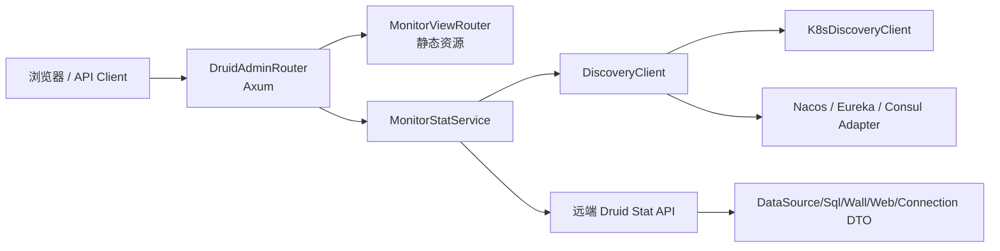
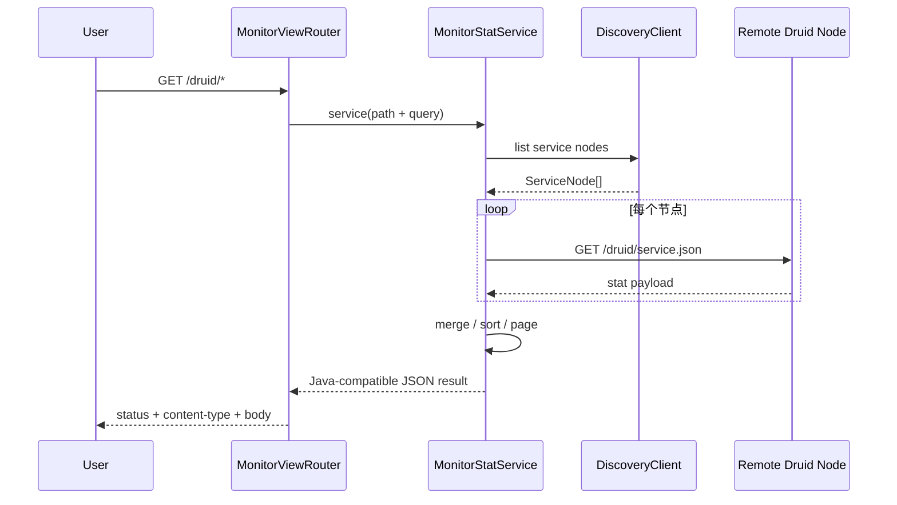

# Java `druid-admin` → Rust `druid-admin` 全量迁移路线图

> Java 基线：Druid `druid-admin`，13 个生产 Java 对象、静态资源和监控 SQL  
> Rust 目标：`crates/druid-admin`  
> 日期：2026-07-28

## 1. 目标

迁移 Java admin 的服务发现、远端 Druid Stat 聚合、DTO、排序/分页、Servlet
路由、静态资源和错误 JSON 语义。Axum 是协议实现方式，不是删除 Servlet
结果语义的理由。

## 2. 当前差距

| 维度 | Java | Rust 当前 | 状态 |
| :--- | :--- | :--- | :--- |
| 生产对象 | 13 | `AdminState` 1 个 | PARTIAL |
| HTTP 入口 | Spring Boot + Undertow + Servlet | endpoint 字符串 | MISSING |
| 服务发现 | K8s + Spring Cloud registries | 无 | MISSING |
| 聚合服务 | `MonitorStatService` 518 行 | 无 | MISSING |
| DTO | 7 个 | 无 | MISSING |
| 静态资源 | 完整 Druid monitor UI | 无 | MISSING |
| 监控 SQL | MySQL 查询模板 | 无 | MISSING |

旧根 `doc/9` 曾提出 `/druid/api/*`、统一 JSON 信封和四个 Rust DTO。
这些内容已归并到[语义迁移对照表](./语义迁移对照表.md)的 Rust-only 扩展账本。
它们不属于 Java parity 分母，也不能在 Java `/druid/*` 语义完成前替代主线。

## 3. 阶段

| 阶段 | 内容 | 验收 | 当前 |
| :--- | :--- | :--- | :--- |
| A0 | 13 对象账本、路由/DTO/资源清单 | 文件与资源分母冻结 | 完成文档 |
| A1 | DTO 与统一 JSON 结果 | serde snapshot 对照 Java | TODO |
| A2 | MonitorProperties/ServiceNode | 默认值、配置优先级 | TODO |
| A3 | HttpClient 与 DiscoveryClient SPI | timeout/error/取消 | TODO |
| A4 | K8s/Nacos/Eureka/Consul Adapter | fixture + 集成环境 | TODO |
| A5 | MonitorStatService | 聚合、排序、分页、参数、错误 | TODO |
| A6 | Axum Router 替代 Servlet | 路由/状态码/内容类型差分 | TODO |
| A7 | 静态资源与监控 SQL | 文件 hash、路由和模板输出 | TODO |
| A8 | tracing/metrics/security | 鉴权、SSRF、敏感数据、链路 | TODO |

## 4. 关键调用序列

## 5. 验收门禁

- 13/13 Java 对象有独立 Rust 文件或显式 ADAPTER 决策；
- 所有公开路径、参数名、默认排序、分页和 result code 快照一致；
- 静态资源和 SQL 模板不丢失；
- 网络失败、部分节点失败、空发现结果、非法参数均有差分用例；
- Axum router 使用真实 `tower::ServiceExt` 请求，不测试静态 endpoint 字符串；
- 当前 `AdminState`/`endpoint_list` 测试不构成完成证据。
