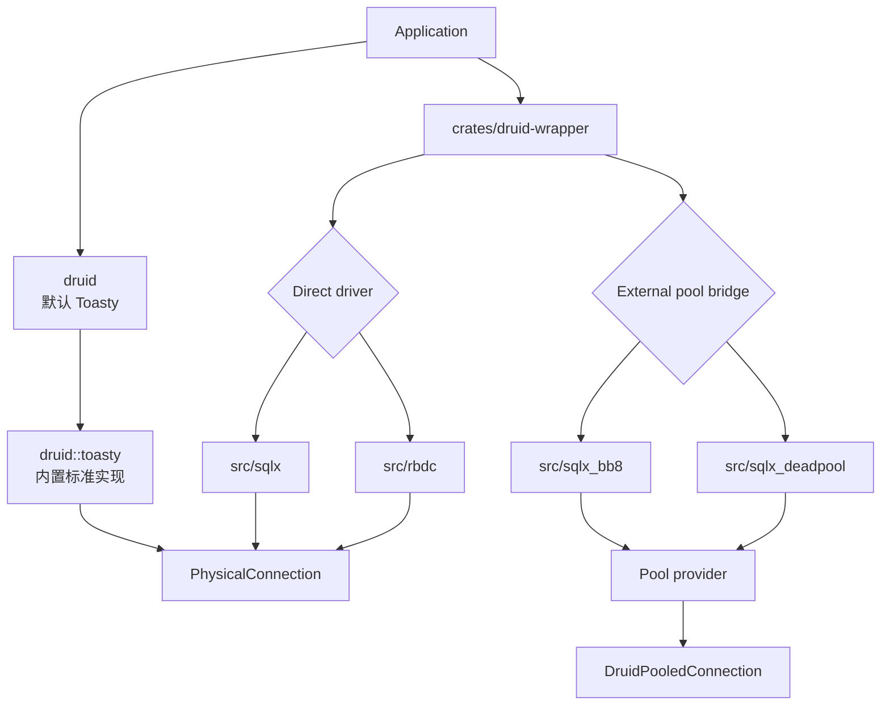

# Java `druid-wrapper` → Rust `druid-wrapper` 全量迁移路线图

> Java 基线：Druid 1.2.28 `/druid-wrapper`，13 个生产 Java 对象  
> Rust 目标：唯一 `crates/druid-wrapper` 模块，内部包含 RBDC、SQLx、bb8、deadpool
> 日期：2026-07-29

## 1. 模块职责

Java wrapper 通过 c3p0、DBCP/DBCP2、Proxool 的类型名和配置面把 Druid
`DataSource` 适配进其他连接池生态。Rust 对等模块负责可选数据库 Adapter 和
外部池适配；Toasty 标准实现归 `druid` 内置，不归 wrapper。direct adapter 与
external pool bridge 必须分层，禁止池中池。



## 2. 硬边界

- `SqlxConnectionAdapter`/`RbdcConnectionAdapter` 只包装一个物理连接，不持有 pool；
- `ToastyConnectionAdapter` 属于 `druid::toasty`，wrapper 不复制、不重命名；
- `SqlxBb8Pool`/`SqlxDeadpoolPool` 直接实现 `Pool`，不实现
  `PhysicalConnectionFactory`；
- 一个 lease 只归还原所有者一次；
- 公共 Druid API 不泄漏 SQLx/RBDC/bb8/deadpool具体类型；
- Java wrapper 的配置、factory、MBean 结果不能因生态不同而静默删除。

## 3. 当前状态

| 维度 | Java | Rust | 当前 |
| :--- | :--- | :--- | :--- |
| 生产对象 | 13 | Adapter 已物理归入 wrapper 内部目录；Java 对象语义仍未闭合 | PARTIAL |
| 内置标准 driver | JDBC driver connection | Toasty 0.9（归 `druid`） | SQLite 已证，多数据库 PARTIAL |
| direct driver 扩展 | JDBC DataSource wrapper | SQLx/RBDC | PARTIAL |
| external pool | c3p0/DBCP/Proxool facade | bb8/deadpool bridge | PARTIAL |
| 配置兼容 | 完整 properties | 构造器参数子集 | MISSING/PARTIAL |
| 管理统计 | MBean/properties | PoolState 子集 | PARTIAL |
| 真实 SQLite | Java wrapper 未专门限定 | SQLx direct/bb8/deadpool | 已有主链证据 |

## 4. 阶段路线

| 阶段 | 内容 | 验收 | 当前 |
| :--- | :--- | :--- | :--- |
| W0 | 物理 crate 归并为单一 `druid-wrapper` | 仅保留 wrapper 模块和内部目录 | DONE |
| W0-B | Toasty 内置、wrapper 扩展边界 | facade/类型归属/禁止 pool-in-pool | 已建立 |
| W1 | `DriverAdapter`/capability/error contract | direct adapter 统一测试 | PARTIAL |
| W2 | SQLx SQLite 完整类型/事务/prepared | 真实 SQLite | PARTIAL |
| W3 | RBDC SQLite 真实 driver | 非 mock RBDC SQLite | TODO |
| W4 | bb8/deadpool lease/timeout/broken/shutdown | 真实 SQLite | PARTIAL |
| W5 | Java c3p0/DBCP/DBCP2 factory/config 语义 | property fixture 差分 | TODO |
| W6 | ProxoolDataSource/Constants 配置面 | 逐字段默认值/单位/错误 | TODO |
| W7 | MBean/PoolState 协议映射 | 字段快照 | TODO |
| W8 | MySQL/PostgreSQL/vendor capability | container matrix | TODO |
| W9 | 覆盖率、文档、兼容迁移指南 | llvm-cov 100% | TODO |

## 5. SQLite 严格合同

当前 `sqlite_wrapper_semantics_test` 从 facade 验证：

- SQLx direct 创建真实 SQLite connection；
- DDL、参数绑定、查询和类型；
- SQLite CallableStatement capability 明确 unsupported；
- bb8/deadpool 真实 SQLite lease 执行并归还原外部池。

底层已有 SQLx 5 个、bb8 5 个、deadpool 5 个真实 SQLite 测试。新增聚合表达式
`COUNT(*)` 回归修复了按列声明类型误解码的问题。

SQLite 不覆盖 RBDC（当前仍是 trait fixture）、存储过程、XA 和 vendor 错误；
这些必须保留为未关闭门禁。

## 6. 验收命令

```bash
cargo test -p druid-wrapper --test sqlite_wrapper_semantics_test
cargo test -p druid-wrapper
cargo test --workspace
```

2026-07-29 三模块归并后实测：wrapper 的 2 个 SQLite 纵向用例、SQLx 的 5 个、
bb8 的 5 个、deadpool 的 5 个实库用例全部通过；加入 Toasty 内置标准实现后，
全 workspace 433/433 通过。
这组证据不覆盖 RBDC 真实 SQLite、Java wrapper 的 13 对象配置兼容面、
存储过程、XA 或 vendor 行为，因此模块状态仍为 `PARTIAL`。
