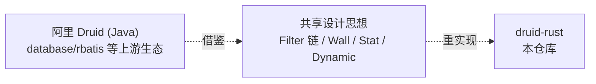

# druid-rust 命名与品牌说明

> **文档说明**：定义 druid-rust 的品牌口径、命名边界、与同名 Java 项目
> （阿里 Druid）的关系，避免读者误以为这是官方移植。
>
> **版本**：V1.0.0
> **最后更新**：2026-07-27

---

## 1. 文档信息

| 项目 | 内容 |
| :--- | :--- |
| 文档类型 | 命名与品牌说明 |
| 产品 | druid-rust |
| 版本 | V1.0.0 |
| 状态 | ✅ 待评审 |

### 1.1 关联文档

| 文档 | 关联说明 |
| :--- | :--- |
| [2、术语表](2、druid-rust-术语表与词汇表.md) | 术语统一 |
| [3、市场分析](3、druid-rust-市场与商业分析.md) | 竞品定位 |
| [6、版本规划](6、druid-rust-产品与版本规划.md) | 版本口径 |

---

## 2. 品牌定位

### 2.1 一句话定位

**druid-rust 是一个面向 Rust 后端服务的数据库连接治理中间件，工作名致敬
阿里 Druid (Java) 的设计思路，但并非官方移植。**

### 2.2 品牌家族关系

### 2.3 命名口径

| 维度 | 规则 |
| :--- | :--- |
| 仓库名 | `druid-rust`（带连字符） |
| crate 前缀 | `druid-`（连字符） |
| crate 内部模块 | `druid_*`（下划线） |
| 文档目录 | `druid-rust-<章节>.md` |
| 架构文档 | `druid-rust-Architecture.zh_CN.md` |
| 监控端点前缀 | `/druid/admin/*`、`/druid/api/*` |

## 3. 命名边界

### 3.1 不与同名项目抢名号

- 阿里 Druid (Java) 的 GitHub 仓库为 `alibaba/druid`，本仓库是
  `easy-4-rust/druid-rust`，命名上独立。
- 不声称是 Druid Java 的官方 Rust 移植。
- 不在文档中暗示"阿里官方支持"。
- 不使用 Druid Java 的 Logo 或商标。

### 3.2 与上游生态共存

- 计划通过 `druid-rbdc` 复用 [`rbdc`](https://github.com/rbatis/rbatis) 的
  connection 抽象（ADR-001）。
- 不与 [`sqlx`](https://github.com/launchbadge/sqlx)、
  [`deadpool`](https://github.com/bikeshedder/deadpool)、
  [`bb8`](https://github.com/djcouchy/bb8) 抢同一层抽象，而是把它们
  作为适配器宿主。
- 与 [`sqlparser-rs`](https://github.com/apache/datafusion-sqlparser-rs) 共存：
  复用其 AST，不重写 SQL 解析器。

### 3.3 内部命名一致性

- 所有领域 crate 使用 `druid-<domain>` 命名（`druid-core / druid-sql /
  druid-pool / druid-stats / druid-dynamic`）。
- 所有 adapter crate 使用 `druid-<driver>` 命名（`druid-rbdc /
  druid-sqlx-deadpool / druid-sqlx-bb8`）。
- 唯一治理面 crate 命名为 `druid-admin`。

## 4. 品牌使用规则

| 场景 | 允许 | 禁止 |
| :--- | :--- | :--- |
| 仓库标题 | `druid-rust` | 单独 `Druid` |
| README 首段 | "Inspired by Alibaba Druid (Java)" | "Official Rust port of Druid" |
| 监控端点 | `/druid/admin/*` | `/alibaba/*` |
| 文档命名 | `druid-rust-*.md` | `DruidRust*.md` |
| 内部代号 | `druid` | `Druid`（Java 同名） |

## 5. 一致性自检清单

- [ ] README 中提到 Druid Java 时使用 "inspired by" 而非 "port of"。
- [ ] 所有 crate `Cargo.toml` 的 `description` 不含 "official" 字样。
- [ ] 所有文档路径遵循 `druid-rust-*` 模式。
- [ ] 监控端点保留 `/druid/admin/*` 前缀。
- [ ] 不在 `Cargo.toml` 中声明与 Druid Java 项目的依赖关系。

---

**文档版本**：V1.0.0
**创建日期**：2026-07-27
**最后更新**：2026-07-27
**文档状态**：✅ 待评审