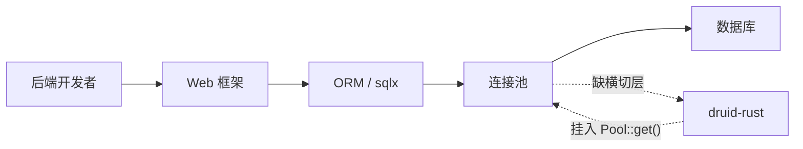

# druid-rust 市场与商业分析

> **文档说明**：分析 Rust 后端生态中数据库连接治理中间件的市场缺口、
> 竞品定位、商业模式与定价方向，作为产品决策的输入。
>
> **版本**：V1.0.0
> **最后更新**：2026-07-27

---

## 1. 文档信息

| 项目 | 内容 |
| :--- | :--- |
| 文档类型 | 市场与商业分析 |
| 产品 | druid-rust |
| 版本 | V1.0.0 |
| 状态 | ✅ 待评审 |

### 1.1 关联文档

| 文档 | 关联说明 |
| :--- | :--- |
| [1、命名与品牌](1、druid-rust-命名与品牌说明.md) | 品牌定位 |
| [4、可行性分析](4、druid-rust-技术与可行性分析.md) | 技术可行性 |
| [5、技术方案](5、druid-rust-技术方案与路线.md) | 技术路线 |
| [6、版本规划](6、druid-rust-产品与版本规划.md) | 版本节奏 |

---

## 2. 市场问题

### 2.1 当前痛点

| 痛点 | 影响 | 现有方案的不足 |
| :--- | :--- | :--- |
| Rust 后端缺少开箱即用的连接治理 | 项目必须自行组合 sqlx + 自写监控 + 自写池 | sqlx 仅提供池和驱动，无横切层 |
| 没有动态数据源切换原语 | 多租户 SaaS 切库需要侵入业务代码 | deadpool / bb8 都是单池抽象 |
| SQL 防火墙普遍缺失 | 误执行 `DROP TABLE` 只能依赖权限控制 | 没有基于 AST 的拦截 |
| 缺少 SQL 合并视角的统计 | 慢 SQL / Top SQL 只能临时拼脚本 | 缺乏参数化 + 指纹层 |

### 2.2 价值链

## 3. 市场规模

> **待确认**：以下数字均为占位估算，未引用第三方市场报告。在 Phase 1
> 完成后应由 `druid-rust-maintainers` 团队补一次结构化调研（survey +
> crates.io 下载量趋势）。

| 指标 | 估算 | 来源 / 状态 |
| :--- | :--- | :--- |
| TAM（全球 Rust 后端开发者） | 待确认 | TBD |
| SAM（Rust 数据库中间件市场） | 待确认 | TBD |
| SOM（druid-rust 1 年内目标） | 待确认 | TBD |
| crates.io `sqlx` 下载量 | 待确认 | TBD |
| crates.io `deadpool` 下载量 | 待确认 | TBD |

## 4. 竞品矩阵

| 能力 | druid-rust | `sqlx` | `deadpool` | `bb8` | `rbatis` / `rbdc` |
| :--- | :---: | :---: | :---: | :---: | :---: |
| 连接池 | 🗓️ | ✅ | ✅ | ✅ | ✅ |
| SQL 解析 / Wall | 🗓️ | ❌ | ❌ | ❌ | ❌ |
| SQL 合并 / 指纹 | 🗓️ | ❌ | ❌ | ❌ | ❌ |
| 多数据源热切换 | 🗓️ | ❌ | ❌ | ❌ | ❌ |
| Filter 链 / 装饰器 | 🗓️ | ❌ | ❌ | ❌ | ❌ |
| Prometheus 导出 | 🗓️ | ❌ | ❌ | ❌ | ❌ |
| 监控 HTTP 端点 | 🗓️ | ❌ | ❌ | ❌ | ❌ |
| Postgres | 🗓️ | ✅ | ✅ | ✅ | ✅ |
| MySQL | 🗓️ | ✅ | ✅ | ✅ | ✅ |
| MSSQL | 🗓️ | ✅ | ✅ | ✅ | ✅ |
| SQLite / DuckDB | ⛔ | ✅ | n/a | n/a | ✅ |

> 标记说明：✅ = 该竞品已实现；❌ = 该竞品不提供；🗓️ = druid-rust 设计目标；
> ⛔ = 明确不在 druid-rust 范围。druid-rust 自身当前为设计阶段，无任何能力标记为已实现。
> ⛔ = 明确不在范围内。

## 5. 商业模式

### 5.1 单轨模式

本项目**不采用**开源核心 + 商业插件的双轨模式；所有能力在 Apache-2.0
下开源。

### 5.2 商业化方向（待确认）

| 方向 | 说明 | 优先级 |
| :--- | :--- | :---: |
| 托管 SaaS 监控 | 集中托管 `druid-admin` 指标与告警 | P3 |
| 企业支持 | 商业 SLA、技术支持、定制开发 | P2 |
| 培训与认证 | 培训课程、最佳实践 | P3 |

> **待确认**：商业模式的具体形式由 maintainers 在 V2 之后决定。

## 6. 价值主张

| 价值 | 说明 | 受益方 |
| :--- | :--- | :--- |
| 横切层一体化 | 一处接入，多种关注 | 后端开发者 |
| driver 解耦 | 不锁定 sqlx / deadpool / bb8 | 架构师 |
| 默认安全 | Wall 默认 deny `DROP`/`TRUNCATE` | DBA / 安全 |
| 可观测性内置 | Prometheus 即装即用 | SRE |
| 热切换 | 多租户 SaaS 不停机切库 | 平台工程 |

## 7. 风险与对策

| 风险 | 影响 | 对策 |
| :--- | :--- | :--- |
| 上游 sqlx / deadpool / bb8 维护停滞 | 适配器失效 | 三个适配器并立，单一依赖不致命 |
| `rbdc` 协议演进 | `druid-rbdc` 需要跟进 | 退而不接 `druid-rbdc` |
| 市场规模被低估 | 投入产出比偏低 | 阶段式交付，避免过度工程 |
| 竞品快速跟进 | 差异化被稀释 | 先发优势 + 文档先行 |

## 8. 一致性自检清单

- [ ] 数字均有来源或显式标注 TBD。
- [ ] 竞品矩阵与每条能力的可验证证据对应。
- [ ] 商业模式与 [6、版本规划](6、druid-rust-产品与版本规划.md) 一致。
- [ ] 与 [1、命名与品牌](1、druid-rust-命名与品牌说明.md) 品牌口径一致。

---

**文档版本**：V1.0.0
**创建日期**：2026-07-27
**最后更新**：2026-07-27
**文档状态**：✅ 待评审