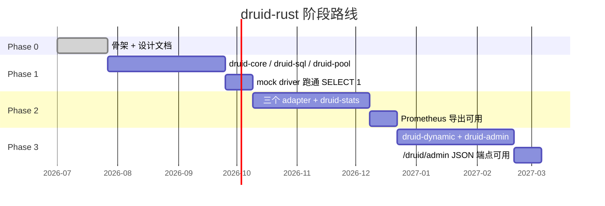

# druid-rust 技术方案与路线

> **文档说明**：定义 druid-rust 的技术栈选型、关键 ADR、阶段里程碑与
> 回滚点，作为实施阶段的输入。
>
> **版本**：V1.0.0
> **最后更新**：2026-07-27

---

## 1. 文档信息

| 项目 | 内容 |
| :--- | :--- |
| 文档类型 | 技术方案与路线 |
| 产品 | druid-rust |
| 版本 | V1.0.0 |
| 状态 | ✅ 待评审 |

### 1.1 关联文档

| 文档 | 关联说明 |
| :--- | :--- |
| [4、可行性分析](4、druid-rust-技术与可行性分析.md) | 可行性结论 |
| [6、版本规划](6、druid-rust-产品与版本规划.md) | 版本矩阵 |
| [架构文档 §6](../druid-rust-Architecture.zh_CN.md) | ADR 详细描述 |

---

## 2. 技术栈

| 维度 | 选型 | 版本 |
| :--- | :--- | :--- |
| 编程语言 | Rust | 1.75（MSRV） |
| Edition | 2021 | — |
| Workspace resolver | 2 | — |
| 异步运行时 | tokio | 1.40（features = "full"） |
| SQL 解析 | sqlparser-rs | 0.52 |
| 异步连接池 | sqlx | 0.8（default-features = false） |
| 通用池生态 | deadpool / bb8 | 0.12 / 0.8 |
| 数据库驱动（独立栈） | rbdc | 4.x（V2 引入） |
| 并发原语 | parking_lot / arc-swap / dashmap | 0.12 / 1 / 6 |
| 缓存 | moka | 0.12 |
| 可观测性 | tracing + metrics + prometheus | 0.1 / 0.23 / 0.13 |
| HTTP | axum + tower | 0.7 / 0.5 |
| 错误 | thiserror / anyhow | 1 / 1 |
| 序列化 | serde + serde_json | 1 / 1 |
| 时间 | chrono | 0.4 |
| 哈希 | xxhash-rust | 0.8 |
| 随机 | fastrand | 2 |

## 3. 关键 ADR

| ADR | 决策 | 反转条件 |
| :--- | :--- | :--- |
| `ADR-001` | 不依赖 sqlx 作为唯一 driver；保留三个适配器（rbdc / sqlx-deadpool / sqlx-bb8） | 出现必须统一的强证据 |
| `ADR-002` | SQL 解析走 sqlparser-rs AST，不走正则 | sqlparser-rs 维护停滞且无替代 |
| `ADR-003` | 横切层（Filter / Stats / Dynamic）作为装饰器挂在 `Connection` 上 | 出现不可拦截场景 |
| `ADR-004` | 多数据源切换走 `arc-swap` lock-free | 出现必须阻塞的切换（如事务内） |
| `ADR-005` | 不实现 Druid Java 的 SQL 注入正则检测 | 永不反转 |
| `ADR-006` | 监控导出走 Prometheus 文本格式，不内置 OpenTelemetry | 出现必须 OTel 的强约束 |

详细描述见 [架构文档 §6](../druid-rust-Architecture.zh_CN.md)。

## 4. 阶段路线

> 时间估计仅作占位；实际节奏由各阶段退出条件决定。

### 4.1 Phase 0（已完成）

| 交付 | 状态 |
| :--- | :--- |
| Cargo workspace 骨架（9 crate + 占位 `src/lib.rs`） | ✅ |
| `Cargo.toml` `[workspace.dependencies]` 锁定版本 | ✅ |
| `rust-toolchain.toml` 锁定 MSRV 1.75 | ✅ |
| 双语 README | ✅ |
| 架构文档 | ✅ |
| `doc/` root 10 + V1 7 | ✅ |

### 4.2 Phase 1

| 交付 | 退出条件 |
| :--- | :--- |
| `druid-core` 暴露完整 trait 面 | `cargo check` + trait 测试通过 |
| `druid-sql` sqlparser 适配 + Wall | `DROP TABLE` 测试抛 `WallViolation` |
| `druid-pool` 实现池调度 | 10000 acquire/release 循环无泄漏 |
| mock driver 端到端 | `SELECT 1` 返回 1 行 |

### 4.3 Phase 2

| 交付 | 退出条件 |
| :--- | :--- |
| `druid-rbdc` 适配 | `rbdc::Connection` 转 `druid_core::Connection` 跑通 |
| `druid-sqlx-deadpool` 适配 | Postgres / MySQL 至少一个 dialect 跑通 |
| `druid-sqlx-bb8` 适配 | 同上 |
| `druid-stats` SQL 合并 + Prometheus | `/metrics` 暴露 `druid_*` 指标 |

### 4.4 Phase 3

| 交付 | 退出条件 |
| :--- | :--- |
| `druid-dynamic` 多数据源 | 切换不丢请求测试通过 |
| `druid-admin` axum 端点 | `/druid/admin/api/datasources` 返回 JSON |

## 5. 回滚点

| 阶段 | 回滚点 | 触发 |
| :--- | :--- | :--- |
| Phase 1 | 删除 `druid-pool`，改用 `deadpool` 直用 | trait 设计阻塞 |
| Phase 1 | 删除 Wall，应用层手工拦截 | sqlparser-rs AST 不稳定 |
| Phase 2 | 不发 `druid-rbdc` | `rbdc` 维护停滞 |
| Phase 2 | 不发 `druid-sqlx-bb8` | bb8 维护停滞 |
| Phase 3 | 不发 `druid-admin` | axum 与 tokio 兼容破坏 |
| Phase 3 | `druid-dynamic` 退回 `RwLock<Arc<T>>` | ArcSwap 语义被证伪 |

## 6. 兼容性策略

| 维度 | 策略 |
| :--- | :--- |
| SemVer | 取消 `publish = false` 后遵循 SemVer |
| MSRV | Phase 1 后 MSRV 升级需要 minor 版本号变更 |
| 默认 features | 改变默认 feature 是破坏性变更 |
| trait 扩展 | 仅允许向后兼容的新增方法（默认实现） |

## 7. 一致性自检清单

- [ ] 技术栈与 [架构文档](../druid-rust-Architecture.zh_CN.md) §3 一致。
- [ ] ADR 与 [架构文档 §6](../druid-rust-Architecture.zh_CN.md) 描述一致。
- [ ] 阶段路线与 [6、版本规划](6、druid-rust-产品与版本规划.md) 节奏一致。
- [ ] 回滚点与 [4、可行性分析](4、druid-rust-技术与可行性分析.md) 风险登记对应。

---

**文档版本**：V1.0.0
**创建日期**：2026-07-27
**最后更新**：2026-07-27
**文档状态**：✅ 待评审