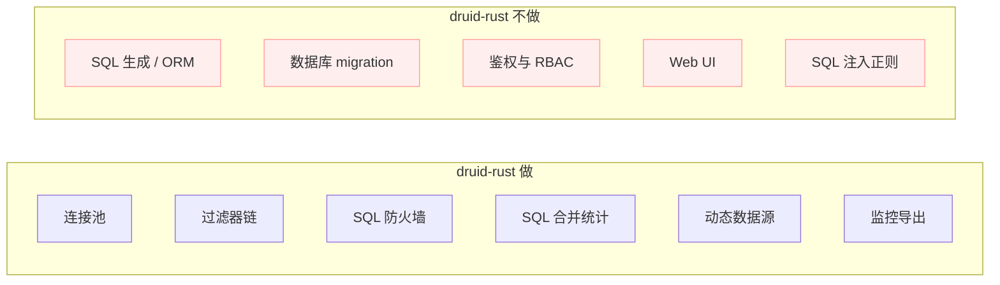

# druid-rust 产品与版本规划

> **文档说明**：定义 druid-rust 的产品定位、版本矩阵与发布策略，作为
> 研发与商业协同基线。
>
> **版本**：V1.0.0
> **最后更新**：2026-07-27

---

## 1. 文档信息

### 1.1 版本记录

| 版本 | 日期 | 作者 | 变更说明 |
| :--- | :--- | :--- | :--- |
| V1.0.0 | 2026-07-27 | druid-rust maintainers | 初始版本 |

### 1.2 关联文档

| 文档 | 关联说明 |
| :--- | :--- |
| [3、市场分析](3、druid-rust-市场与商业分析.md) | 商业输入 |
| [5、技术方案](5、druid-rust-技术方案与路线.md) | 技术节奏 |
| [10、功能菜单](10、druid-rust-功能菜单与版本规划.md) | 功能清单 |

---

## 2. 产品定位

### 2.1 一句话定位

**druid-rust 是面向 Rust 后端服务的数据库连接治理中间件，借鉴阿里 Druid
(Java) 的设计思路，提供横切过滤器链、SQL 防火墙、SQL 合并统计、动态
数据源切换与可观测性导出。**

### 2.2 核心价值主张

| 价值 | 说明 |
| :--- | :--- |
| 横切层一体化 | 一处接入，多种关注 |
| driver 解耦 | 不锁定 sqlx / deadpool / bb8 / rbdc |
| 默认安全 | Wall 默认 deny `DROP`/`TRUNCATE` |
| 可观测性内置 | Prometheus 即装即用 |
| 热切换 | 多租户 SaaS 不停机切库 |

### 2.3 产品边界

## 3. 版本体系

### 3.1 版本矩阵

| 版本 | 范围 | 状态 | 主要交付 | 退出条件 |
| :--- | :--- | :--- | :--- | :--- |
| Phase 0 | 占位骨架 | ✅ 已交付 | workspace + 设计文档 | `cargo check --workspace` |
| V1 | 核心闭环 | 🗓️ 计划 | `druid-core` + `druid-sql` + `druid-pool` + mock driver | `SELECT 1` + Wall 拦截 `DROP TABLE` |
| V2 | 适配 + 统计 | 🗓️ 计划 | 三个 adapter + `druid-stats` | Prometheus 导出可用 |
| V3 | 动态 + 治理 | 🗓️ 计划 | `druid-dynamic` + `druid-admin` | 热切换 + JSON 端点 |

### 3.2 版本发布策略

| 阶段 | 发布模式 | 频率 |
| :--- | :--- | :--- |
| Phase 0 | 文档先行 + 占位代码 | 一次性 |
| V1 | crates.io 预发（`0.1.0-alpha`） | 一次 |
| V2 | `0.2.0-beta` | 一次 |
| V3 | `1.0.0` GA | 一次 |

> **待确认**：版本号与发布频率由 maintainers 在每个阶段关闭前确认。

## 4. 商业模式

### 4.1 单轨模式

druid-rust **不采用**开源核心 + 商业插件的双轨模式；所有能力在
Apache-2.0 下开源。

### 4.2 商业化方向（占位）

| 方向 | 说明 | 优先级 |
| :--- | :--- | :---: |
| 企业支持 | 商业 SLA、技术支持、定制开发 | P2 |
| 培训 | 培训课程、最佳实践 | P3 |
| 托管 SaaS | 集中托管 `druid-admin` 监控与告警 | P3 |

> **待确认**：商业化形式由 maintainers 在 V2 后决定。

## 5. 成功指标

| 指标 | 目标 | 测量方式 |
| :--- | :--- | :--- |
| V1 端到端 | `SELECT 1` 通过；Wall 拦截 `DROP TABLE` | CI |
| V2 适配器 | 至少 1 个 driver 跑通冒烟测试 | CI |
| V3 治理面 | JSON 端点可用 + Prometheus 抓取通过 | CI |
| 文档完整 | root 10 + V1 7 + 架构 + 双语 README | 仓库 |

## 6. 一致性自检清单

- [ ] 版本矩阵与 [5、技术方案](5、druid-rust-技术方案与路线.md) §4 一致。
- [ ] 产品边界与 [架构文档 §2](../druid-rust-Architecture.zh_CN.md) 一致。
- [ ] 商业化方向与 [3、市场分析](3、druid-rust-市场与商业分析.md) §5 一致。
- [ ] 成功指标与 [架构文档 §23](../druid-rust-Architecture.zh_CN.md) 退出条件一致。

---

**文档版本**：V1.0.0
**创建日期**：2026-07-27
**最后更新**：2026-07-27
**文档状态**：✅ 待评审