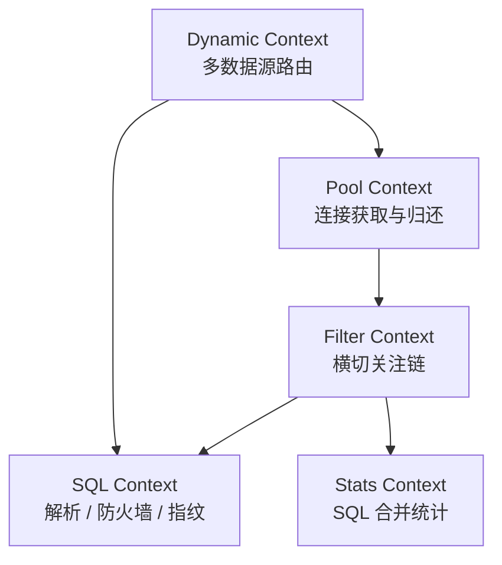

# druid-rust 领域模型设计

> **文档说明**：定义 druid-rust 的限界上下文、聚合、领域事件与规则。
>
> **版本**：V1.0.0
> **最后更新**：2026-07-27

---

## 1. 文档信息

| 项目 | 内容 |
| :--- | :--- |
| 文档类型 | 领域模型设计 |
| 产品 | druid-rust |
| 版本 | V1.0.0 |
| 状态 | ✅ 待评审 |

### 1.1 关联文档

| 文档 | 关联说明 |
| :--- | :--- |
| [2、术语表](2、druid-rust-术语表与词汇表.md) | 术语统一 |
| [6、版本规划](6、druid-rust-产品与版本规划.md) | 功能边界 |
| [架构文档 §8](../druid-rust-Architecture.zh_CN.md) | 组件映射 |

---

## 2. 限界上下文

druid-rust 在"数据库连接治理"这一通用子域内划分 4 个限界上下文：



| 上下文 | 职责 | 不负责 |
| :--- | :--- | :--- |
| Pool Context | 连接获取、归还、调度、泄漏检测 | SQL 内容解析 |
| Filter Context | 过滤器链装配与执行 | Wall 规则定义 |
| SQL Context | 解析、Wall、参数化、指纹 | 统计聚合 |
| Dynamic Context | 多数据源、读写分离、热切换 | 池内部调度 |
| Stats Context | SQL 合并、直方图、Prometheus 导出 | 决策路由 |

## 3. 聚合

### 3.1 `DataSource` 聚合（Dynamic Context）

| 属性 | 类型 | 说明 |
| :--- | :--- | :--- |
| `name` | `String` | 数据源名 |
| `version` | `u64` | 单调递增版本 |
| `master` | `Arc<dyn Pool>` | 主库 |
| `slaves` | `Vec<Arc<dyn Pool>>` | 从库列表 |
| `load_balancer` | `Arc<dyn LoadBalancer>` | 负载均衡策略 |
| `state` | `DataSourceState` | `Active` / `Switching` / `Disabled` |

不变量：

- `version` 单调递增。
- `master` 与 `slaves` 不为同一对象。
- `slaves` 为空时 `load_balancer` 不被调用。

事件：

- `DataSourceRegistered`
- `DataSourceSwitched { from: version, to: version }`
- `DataSourceDisabled { reason: String }`

### 3.2 `ConnectionHolder` 聚合（Pool Context）

| 属性 | 类型 | 说明 |
| :--- | :--- | :--- |
| `id` | `u64` | 全局唯一 |
| `created_at` | `Instant` | 创建时间 |
| `last_used` | `AtomicInstant` | 最后使用时间 |
| `use_count` | `AtomicU64` | 使用次数 |
| `state` | `AtomicU8` | `Idle` / `Active` / `Validating` / `Closed` |
| `last_sql_fingerprint` | `RwLock<u64>` | 最近一次 SQL 指纹 |

不变量：

- `state` 转换由 CAS 保护。
- `last_used` 在 `acquire` 与 `release` 时更新。

事件：

- `ConnectionAcquired { id, fingerprint? }`
- `ConnectionReleased { id, elapsed_ms, ok }`
- `ConnectionClosed { id, reason }`
- `ConnectionLeaked { id, held_for_ms }`

### 3.3 `MergedSqlStat` 聚合（Stats Context）

| 属性 | 类型 | 说明 |
| :--- | :--- | :--- |
| `sql` | `String` | 参数化后的 SQL 模板 |
| `fingerprint` | `u64` | 指纹 |
| `execute_count` | `AtomicU64` | 执行次数 |
| `total_time_ns` | `AtomicU64` | 累计耗时 |
| `max_time_ns` | `AtomicU64` | 最大耗时（CAS 更新） |
| `error_count` | `AtomicU64` | 错误次数 |
| `last_error` | `RwLock<Option<String>>` | 最近一次错误 |
| `histogram` | `Histogram` | 延迟直方图 |

不变量：

- `execute_count == error_count + success_count`（逻辑上）。
- `max_time_ns >= each_seen_time_ns`。
- 同一 `fingerprint` 仅存在一个聚合实例。

事件：

- `SqlRecorded { fingerprint, elapsed_ns, ok }`
- `SqlErrored { fingerprint, message }`

## 4. 领域服务

### 4.1 `WallChecker`（SQL Context）

输入：`&ParsedStmt`
输出：`Result<(), Vec<WallViolation>>`

规则集（默认 deny）：

- `DROP` 语句拒绝
- `TRUNCATE` 语句拒绝
- `UPDATE` 必须带 `WHERE`
- `DELETE` 必须带 `WHERE`
- 子查询深度 ≤ `max_subquery_depth`
- JOIN 数量 ≤ `max_join_tables`
- `WHERE` 字段不得在 `deny_columns` 列表
- 函数调用不在 `deny_functions` 列表

### 4.2 `SqlParameterizer`（SQL Context）

输入：`&str` SQL、`Value` 参数列表
输出：`ParameterizedSql { template, params }`

实现说明：基于 sqlparser-rs AST 遍历，遇到 `Expr::Value` 替换为
`Expr::Value(Value::Placeholder)`，同时记录原始字面量。

### 4.3 `SqlMerger`（Stats Context）

输入：`&str` SQL、`&[Value]`
输出：`Arc<MergedSqlStat>`

实现说明：`SqlParameterizer::parameterize` 后取模板的 `xxh3` 指纹，
在 `moka::sync::Cache` 命中或创建 `MergedSqlStat`。

### 4.4 `LoadBalancer`（Dynamic Context）

trait：

```rust
#[async_trait::async_trait]
pub trait LoadBalancer: Send + Sync {
    fn pick<'a>(&self, slaves: &'a [Arc<dyn Pool>]) -> &'a Arc<dyn Pool>;
}
```

内置实现：`RoundRobinLoadBalancer`、`RandomLoadBalancer`、
`WeightedLoadBalancer`。

## 5. 领域事件

| 事件 | 上下文 | 触发 | 消费方 |
| :--- | :--- | :--- | :--- |
| `DataSourceRegistered` | Dynamic | 注册新数据源 | admin |
| `DataSourceSwitched` | Dynamic | 热切换完成 | admin + 审计 |
| `DataSourceDisabled` | Dynamic | 数据源被禁用 | admin |
| `ConnectionAcquired` | Pool | pool.get() 返回 | stats |
| `ConnectionReleased` | Pool | PooledConnection drop | stats |
| `ConnectionLeaked` | Pool | 持有时长超阈值 | 告警 |
| `SqlRecorded` | Stats | filter 记录 SQL | admin |
| `SqlErrored` | Stats | SQL 执行错误 | admin |
| `WallViolation` | SQL | Wall 拒绝 SQL | admin |

## 6. 反腐败层

| 外部系统 | 接入层 | 转换 |
| :--- | :--- | :--- |
| `sqlx` Pool | `druid-sqlx-deadpool` / `druid-sqlx-bb8` | `sqlx::Connection` → `druid_core::Connection` |
| `rbdc::Connection` | `druid-rbdc` | 同上 |
| Prometheus 抓取 | `druid-admin` | `MergedSqlStat` → Prometheus text |

## 7. 上下文映射

| 上游 | 下游 | 关系 |
| :--- | :--- | :--- |
| Pool | Filter | `Open Host Service`（Filter 依赖 Pool 的 `Connection`） |
| SQL | Pool | `Conformist`（Pool 调用 SQL 的 fingerprint） |
| Dynamic | Pool | `Customer/Supplier`（Dynamic 路由到 Pool） |
| Stats | Filter | `Open Host Service`（Filter 写入 Stats） |
| admin | 所有 | `Anti-Corruption Layer` |

## 8. 一致性自检清单

- [ ] 所有聚合名称已在 [2、术语表](2、druid-rust-术语表与词汇表.md) 定义。
- [ ] 领域事件名与 [架构文档 §10](../druid-rust-Architecture.zh_CN.md) 主链步骤对齐。
- [ ] 上下文映射关系与 [架构文档 §7](../druid-rust-Architecture.zh_CN.md) 分层一致。
- [ ] Wall 默认规则与 [架构文档 §15](../druid-rust-Architecture.zh_CN.md) 一致。

---

**文档版本**：V1.0.0
**创建日期**：2026-07-27
**最后更新**：2026-07-27
**文档状态**：✅ 待评审