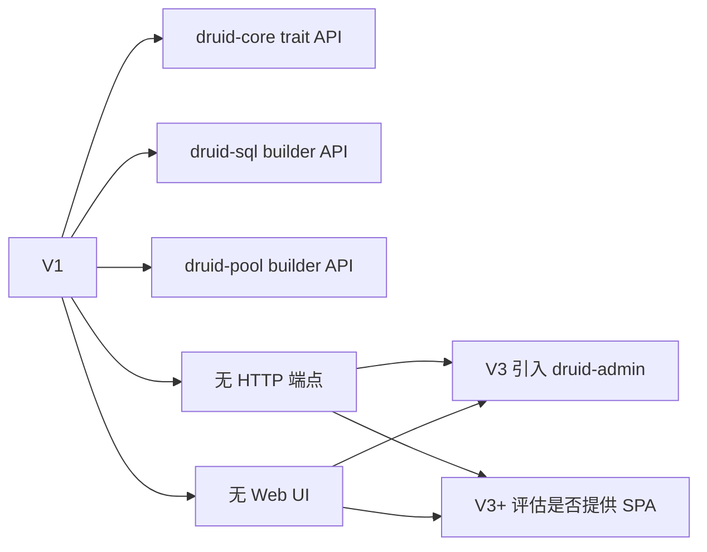

# druid-rust V1 UI 设计说明

> **文档说明**：V1 范围内 UI 设计说明。由于 V1 不包含任何 HTTP 端点
> 与 Web UI，本文件记录"V1 不含 UI、UI 设计从 V3 开始"的边界声明。
>
> **版本**：V1.0.0
> **最后更新**：2026-07-27

---

## 1. 文档信息

| 项目 | 内容 |
| :--- | :--- |
| 文档类型 | V1 UI 设计说明 |
| 产品 | druid-rust |
| 版本 | V1.0.0 |
| 状态 | ✅ 待评审 |

### 1.1 关联文档

| 文档 | 关联说明 |
| :--- | :--- |
| [V1/4、功能规划](4、druid-rust-功能与界面规划-V1.md) | 模块划分 |
| [9、视觉 DNA](../9、druid-rust-视觉与交互DNA规范.md) | JSON 信封 |
| [架构文档 §19](../../druid-rust-Architecture.zh_CN.md) | 运维端点 |

---

## 2. V1 UI 范围声明



**V1 不包含 UI 设计**，原因：

1. V1 范围内只有 `druid-core / druid-sql / druid-pool` 与 mock driver。
2. UI 端点（`druid-admin`）是 V3 计划项。
3. Web SPA 是 V3+ 评估项，不在 V1 范围。

## 3. V1 唯一"界面"

V1 与 V2 的"界面"是 **Rust trait API**：

```text
druid_core::Connection          // trait
druid_core::Driver              // trait
druid_core::Pool                // trait
druid_core::ConnectionFactory   // trait
druid_core::BeforeFilter        // trait
druid_core::AfterFilter         // trait

druid_sql::WallConfig           // 配置 builder
druid_sql::Wall                 // 运行时检查器

druid_pool::DruidPool           // 池实现
druid_pool::PooledConnection    // RAII 句柄
```

具体签名见 [V1/4、功能规划](4、druid-rust-功能与界面规划-V1.md) §3。

## 4. V3+ UI 路线占位

V3 引入 `druid-admin` 后：

- JSON API 形状见 [9、视觉 DNA](../9、druid-rust-视觉与交互DNA规范.md) §4
- 是否提供 Web SPA 由 maintainers 在 V3 评审时决定

## 5. V1 不做的 UI 决策

| 决策 | 选择 | 理由 |
| :--- | :--- | :--- |
| V1 是否提供 HTTP 端点 | ❌ 不提供 | 端点属于 V3 |
| V1 是否提供 Web UI | ❌ 不提供 | UI 属于 V3+ 评估 |
| V1 是否提供 CLI 工具 | ❌ 不提供 | 不在 [6、版本规划](../6、druid-rust-产品与版本规划.md) §3 |
| V1 是否捆绑静态资源 | ❌ 不提供 | 仓库体积与许可面 |

## 6. 一致性自检清单

- [ ] 本文件未声称 V1 提供任何 UI 能力。
- [ ] V3+ 引用与 [架构文档 §19](../../druid-rust-Architecture.zh_CN.md) 一致。
- [ ] 视觉 DNA 引用与 [9、视觉 DNA](../9、druid-rust-视觉与交互DNA规范.md) 一致。

---

**文档版本**：V1.0.0
**创建日期**：2026-07-27
**最后更新**：2026-07-27
**文档状态**：✅ 待评审