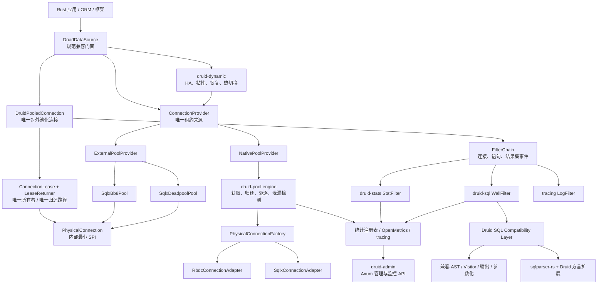
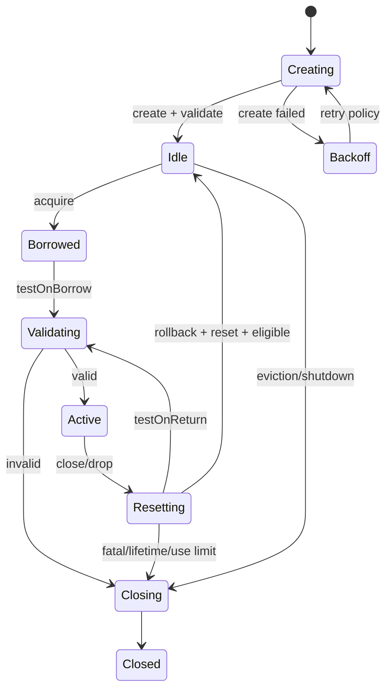
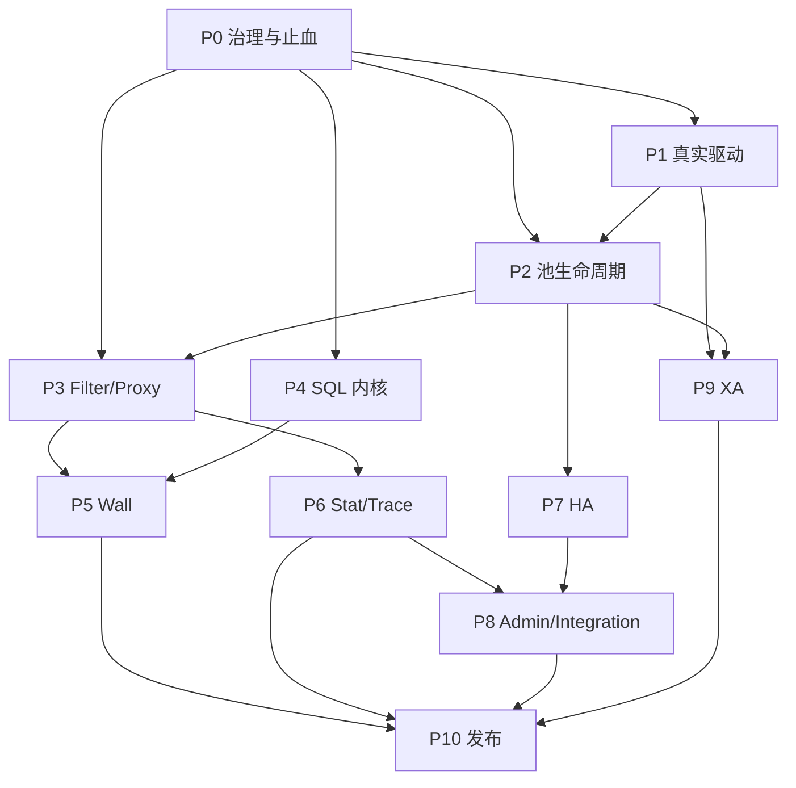

# Druid 1.2.28 → druid-rust 功能语义完整迁移路线图

> 本文是迁移执行基线，不是架构借鉴清单。迁移目标是 Druid 1.2.28 的功能语义完整落地到 Rust；实现不要求逐类照抄，但任何合并、拆分、适配或协议替换都必须可追溯、可测试、可验收。

## 1. 冻结基线

| 项目 | 冻结值 | 核验方式 |
| :--- | :--- | :--- |
| Java 源仓库 | `/Users/wandl/workspaces/workspace-github/druid` | 本地 Git + CodeGraph |
| Java 版本 | `1.2.28` | tag `1.2.28` |
| Java 提交 | `33824c3dec1612711f9bb4e409319bcab2e4cd0e` | `git rev-parse HEAD` |
| Java 主源码 | core 1,644 个 `.java`；全仓主源码 1,719 个 `.java` | `rg --files -g '**/src/main/java/**/*.java'` |
| Rust 源仓库 | `/Users/wandl/workspaces/workspace-github-easy-4-rust/druid-rust` | 本地 Git + CodeGraph |
| Rust 提交 | `f307f4edf1ca76170b91d775e4d8dcdb3ff2bd29` | 文档编制时基线 |
| Rust 当前规模 | 60 个 `.rs`、51 个非 `lib.rs/mod.rs` 文件、61 个公开类型 | 源码扫描 |
| Rust 当前测试 | `cargo +stable test --workspace` 通过，369 个测试属性 | 2026-07-28 实测 |
| Rust 工具链风险 | 仓库固定 1.75.0，依赖树含 edition 2024 manifest | P0 必须升级并锁定 |

基线升级必须新建差异批次：先对 Java 新提交运行 CodeGraph 影响分析，再把新增/变更对象写入[对象级对照表](./2、对象级对照表.md)和[语义迁移对照表](./3、语义迁移对照表.md)，禁止直接移动本基线。连接层的约束、对象边界和时序以[连接抽象与驱动适配架构](./5、连接抽象与驱动适配架构.md)为准。

## 2. “完整迁移”的定义

完成度按语义契约计算，不按 Rust 文件数或代码行数计算：

```text
语义完成率 = 已通过差分验收的语义契约数 / 基线语义契约总数
对象可追溯率 = 已登记 Java 对象数 / Java 基线对象总数
命名合规率 = 通过命名检查的迁移对象数 / 已落地迁移对象数
```

发布 `1.0-semantic-parity` 的硬条件：

1. 语义完成率为 100%，对象可追溯率为 100%。
2. Java 的成功结果、失败类型、状态变化、副作用、统计口径和安全判断均有 Rust 对应契约。
3. 非一对一迁移必须有 `MERGE`、`SPLIT`、`ADAPTER` 或 `PROTOCOL` 决策，并绑定测试。
4. 外部库只能承载实现，不能替代验收。使用 `sqlparser-rs` 仍需逐项证明 Druid 的方言、AST、输出、参数化、Visitor 和 Wall 语义。
5. 不允许以“Java/JDBC/Spring/JMX 特有”为由静默删除能力。应迁移为 Rust 生态中的等价结果；确实无意义的运行时机制需以 ADR 说明其业务结果如何被保留。
6. `todo!()`、`unimplemented!()`、空函数体、固定返回“未实现”均计为未迁移。

## 3. 非一对一迁移的合法形态

| 形态 | 含义 | 示例 | 验收要求 |
| :--- | :--- | :--- | :--- |
| `DIRECT` | 一个 Java 对象对应一个 Rust 对象 | `WallConfig` → `WallConfig` | 名称、字段默认值、方法语义差分通过 |
| `MERGE` | 多个 Java 对象由一个 Rust 枚举/组件承载 | 多个 `Violation` 实现 → `WallViolation` | 每个源对象都有独立枚举分支和用例 |
| `SPLIT` | 一个 Java 对象拆成多个 Rust 组件 | `DruidDataSource` → facade + pool engine + maintenance tasks | 对外行为由 canonical facade 汇总 |
| `ADAPTER` | Java 平台对象映射到 Rust 外部能力 | JDBC Connection → `PhysicalConnection` SPI + sqlx/rbdc adapter | 真实数据库契约测试，不接受 mock-only |
| `PROTOCOL` | 管理/集成协议替换，业务结果不变 | JMX → OpenMetrics + admin API | 指标、管理动作、权限、错误语义逐项对应 |
| `RUST_ONLY` | Rust 为实现迁移新增的内部对象 | `IdleQueue`、`SqlAstAdapter` | 必须标明承载哪些 Java 语义，不得成为逃逸层 |

`sqlparser-rs`、Tokio、Axum、Prometheus、ArcSwap 都是迁移实现材料，不是“不迁移”的理由。

## 4. 目标架构



原则是“外部兼容面稳定、内部实现 Rust 化”。`DruidDataSource`、`DruidPooledConnection`、`WallProvider`、`JdbcSqlStat` 等关键迁移对象保留可识别名称；调度器、队列、任务等内部对象可使用更符合 Rust 的名称。`DruidPooledConnection` 是唯一公开连接对象，`PhysicalConnection` 是内部最小 SPI；native pool 与外部池 bridge 只能二选一成为单次租约的 Provider，禁止池中池。详细设计见[连接抽象与驱动适配架构](./5、连接抽象与驱动适配架构.md)。

## 5. 当前基线结论

当前代码不是占位仓库，但也未达到语义闭环。CodeGraph 与源码核验得到以下阻断项：

| ID | 证据 | 影响 | 处置阶段 |
| :--- | :--- | :--- | :--- |
| B-01 | `DruidPool` 转为 `dyn Pool` 时使用空 return callback | `DynamicDataSource` 路径连接不归还，计数泄漏 | P0 |
| B-02 | `run_after_filter` 调用 async future 未 `.await` | 后置 Filter、SQL 统计实际不执行 | P0 |
| B-03 | `fetch()` 绕过 Filter | 查询不经过 Wall/Stat/Log | P0 |
| B-04 | after context 丢失参数、数据源名、开始时间和 fingerprint | 统计与审计数据错误 | P0 |
| B-05 | 三个 adapter 的 `create()` 固定返回“not yet implemented”，且 bb8/deadpool 被误建模为物理连接工厂 | 无真实数据库连接能力，补实现后还可能形成池中池 | P1 |
| B-06 | `min_idle`、`max_lifetime`、`idle_timeout`、`test_on_borrow` 等配置未闭环 | 与 Druid 池行为不一致 | P2 |
| B-07 | 扩容判断与 `total_count.fetch_add` 非原子预留 | 并发时可能突破 `max_active` | P2 |
| B-08 | `WallConfig` 多数字段未被规则引擎读取，`Wall` 未接入 Filter | 配置看似存在但无行为 | P5 |
| B-09 | admin 只有状态对象和 endpoint 字符串，无 Axum Router | 无监控管理面 | P8 |
| B-10 | 工具链固定 Rust 1.75.0 与当前依赖不兼容 | 默认构建不可复现 | P0 |

上表是制定路线图时的阻断基线，保留用于追踪缺陷来源。2026-07-28 当前关闭情况如下：

| 基线项 | 当前 | 证据 |
| :--- | :--- | :--- |
| B-01 | CLOSED | `Pool` 直接返回 canonical `DruidPooledConnection`，已删除空 callback 转换；Dynamic route 归还计数测试通过 |
| B-02 | CLOSED | after future 已显式 `.await` |
| B-03 | CLOSED | fetch 与 exec 共用 Filter before/after 主链 |
| B-04 | CLOSED | before/after 复用同一个 `ExecContext`，保留 params/dataSource/start/fingerprint |
| B-05 | CLOSED（能力矩阵继续 P1） | SQLx/RBDC direct adapter 已接通；bb8/deadpool 已改为 external `Pool` bridge，无固定未实现返回 |
| B-07 | CLOSED | CAS 原子容量预留，32 并发 gated contract 下 `max_open=2` 只创建 2 个物理连接 |
| B-06、B-08、B-09、B-10 | OPEN | 按原阶段继续迁移，不因连接主干完成而提前关闭 |

测试数量不能抵消上述阻断项。测试必须从“覆盖 Rust 自己写出的行为”升级为“以 Java Druid 为 oracle 的差分测试”。

## 6. 分阶段路线图

### P0：迁移治理与当前正确性止血

目标：建立可信基线，并修复会让后续验收失真的基础缺陷。

- 固定可构建 Rust MSRV/lockfile，CI 执行 fmt、clippy、test、doc、audit。
- 修复 B-01～B-04、B-07；把旧 pooled 实现收敛为唯一公开的 `DruidPooledConnection`，归还权固化为内部 `FnOnce`，外部池租约使用 `PhysicalConnectionLease`。
- 建立对象总账、语义契约 ID、命名检查和差分测试目录。
- 为 Java oracle 提供可重复运行的 fixture runner。

出口门禁：默认工具链全绿；所有取还连接路径计数守恒；Filter before/after 对 `exec`、`fetch`、错误路径都执行一次。

### P1：驱动 SPI 与真实数据库适配

目标：把 JDBC 的“获得物理连接并执行数据库操作”迁移为真实 Rust 能力，同时维持 Druid 对外池化连接语义。

- 建立对象安全、异步、最小化的 `PhysicalConnection` SPI，以及 native 专用 `PhysicalConnectionFactory`、统一 `Pool` Provider、external 专用 `PhysicalConnectionLease` 和 `DruidPooledConnection` 内部唯一 returner。
- 新增不携带外部 pool 的 `druid-sqlx` direct adapter；完成 `druid-rbdc` direct adapter。
- 把 bb8、deadpool 从 `ConnectionFactory` 改为 `ExternalPoolProvider` bridge；同一数据源禁止再叠加 native pool。
- 所有 direct/bridge adapter 完成连接创建或租借、验证、错误分类、状态复位和关闭/归还。
- 对齐 Connection、Statement、PreparedStatement、ResultSet、metadata、LOB 和事务结果语义。
- 建立 PostgreSQL、MySQL、SQLite 容器测试；方言能力扩展时追加对应数据库。

出口门禁：adapter 不含固定“未实现”返回；真实数据库完成 connect/exec/fetch/transaction/cancel/timeout/close 契约；native/bridge 均只返回 `DruidPooledConnection`，且每个租约恰好归还一次。

### P2：连接池生命周期完整迁移

目标：迁移 `DruidDataSource`、`DruidAbstractDataSource`、`DruidConnectionHolder`、`DruidPooledConnection` 的完整状态机。

- 初始化、创建/销毁任务、公平/非公平等待、超时、失败退避、容量预留。
- `min_idle`、`initial_size`、`max_active`、`max_wait`、keepAlive、驱逐和物理寿命。
- borrow/return 校验、rollback、状态 reset、schema 恢复、fatal error、discard。
- removeAbandoned、使用次数、密码版本、PS cache、关闭/禁用/重启/fill。
- vendor checker/sorter 的数据库错误矩阵。



出口门禁：并发压力下容量不越界、无丢连接、无双重归还；Java pool fixture 的状态和计数差分通过。

### P3：Filter、Proxy 与执行事件模型

目标：迁移 Druid FilterChain 的职责链语义，而非仅保留两个粗粒度 hook。

- 连接、statement、prepared/callable statement、result set、LOB、metadata 事件。
- Filter 初始化、销毁、排序、别名加载、短路、异常传播和反向 after 顺序。
- Proxy 属性、参数、执行类型、事务信息在 async context 中完整传播。
- 迁移 ConfigFilter、LogFilter、EncodingConvertFilter 的业务结果；实现方式可为 SecretProvider、tracing layer、driver codec。

出口门禁：每个 Java Filter hook 在对象账本中有事件映射；顺序、短路、异常、上下文差分通过。

### P4：SQL 内核与方言兼容层

目标：完整迁移 Druid SQL 的对外语义。`sqlparser-rs` 作为内核之一，不作为范围豁免。

- `DbType`、Lexer token/位置/注释、ParserFeature、多语句与 EOF 规则。
- `SQLStatementParser`、AST 类型族、Parent/Attribute 元数据、clone/equality。
- Visitor、output visitor、format、parameterize、restore、fingerprint、PagerUtils。
- schema repository、表/列解析、SQL transform/builder。
- 对 Druid 1.2.28 支持的每个方言建立能力矩阵：原生支持、扩展 parser、兼容 AST、需 fork 四种落点。

出口门禁：Druid SQL 测试语料按方言差分；parse→AST→output、parameterize、visitor 结果达到 100% 已登记契约。

### P5：Wall 防火墙

目标：在 P4 的兼容 AST 上迁移 WallProvider/Visitor/Filter 全部安全语义。

- 所有 WallConfig 默认值、allow/deny、恒真条件、变量、函数、schema、tenant、白名单。
- 各数据库 WallProvider、SPI 注册、缓存、统计、异常码、log/throw 策略。
- WallFilter 接入所有 SQL 执行入口，包括 batch、fetch、prepared 和错误路径。

出口门禁：每个 WallConfig 字段至少有开/关两组行为测试；Java/Rust 对同一 SQL 的放行、拒绝、错误码和统计一致。

### P6：统计、追踪与日志

目标：迁移 `Jdbc*Stat`、StatFilter、DruidStatManager 的统计口径。

- 执行次数/错误/运行中/并发峰值、耗时分布、慢 SQL、更新行/读取行、事务。
- SQL 参数化合并、最大值 CAS、reset、快照与排序。
- JMX 管理结果映射为 OpenMetrics、admin API 和 tracing；保留指标语义及 reset 操作。

出口门禁：固定时钟与并发场景下 Java/Rust 快照逐字段一致；高并发不丢计数。

### P7：HA、动态数据源与恢复

目标：迁移 HighAvailableDataSource 及节点选择、粘性、验证和恢复语义。

- named/random/sticky selector、读写路由、故障摘除、恢复探测。
- ZooKeeper/File node listener 的业务结果迁移为可插拔 Registry/Watcher SPI。
- 热切换时事务粘性、旧池排空、配置版本和回滚。

出口门禁：故障注入下无跨事务切换、无连接泄漏；节点事件和选择序列可重放。

### P8：管理、监控与框架集成

目标：迁移 support、starter、admin 模块提供的运维结果。

- Axum Router、静态资源、datasource/sql/wall/web/session API、认证和 allow/deny IP。
- Spring Boot starter 的配置绑定/自动装配结果迁移为 Rust config + feature + layer。
- Servlet/WebStatFilter 的请求、URI、session 统计迁移为 Tower middleware。
- JNDI/FactoryBean/MBean 映射为显式 builder、registry、admin protocol。

出口门禁：端点 schema、权限、reset 动作和指标与 Java 基线对照；不得只有 endpoint 名称。

### P9：XA、分布式事务与高级兼容

目标：迁移 XA/两阶段提交的行为，不因 Java API 形态不同而删除。

- `DruidXADataSource`、XAConnection/XAResource 状态机。
- Rust TransactionManager SPI 与数据库适配器能力探测。
- prepare/commit/rollback/recover、heuristic error、超时和幂等。

出口门禁：支持适配器完成 2PC 故障注入；不支持的数据库明确返回能力错误而非静默降级。

### P10：全量差分、性能与生产发布

- 对象总账和语义契约 100% 关闭。
- 混沌测试、loom 并发模型、长稳、泄漏、背压、取消安全。
- 与 Java Druid 同配置的吞吐、P99、内存和连接恢复基准。
- SemVer、迁移指南、兼容矩阵、SLO、告警、回滚和发布签名。

出口门禁：`1.0-semantic-parity` 发布检查全部通过。

## 7. 阶段依赖



P4 可以与 P1/P2 并行，但 Wall 必须等待 SQL 兼容层稳定；P10 不接受以时间换范围。

## 8. 阶段目标文件与工作量明细

以下表格保留原始 S1～S8 计划的文件粒度和工作量，用于排期参考；名称与范围已按完整语义迁移修订。工作量是初始估算，P0 完成差分语料和对象总账后必须重新估算，不能以估算到期为理由缩减范围。

### 8.1 Core SPI 与兼容类型（原 S1，初估 3 天）

| Rust 文件 | Java 来源 | 当前证据 | 修订目标 | 原估算 |
| :--- | :--- | :--- | :--- | :---: |
| `physical_connection.rs` | `java.sql.Connection` 平台能力映射 | 当前为宽泛 `connection.rs`/`Connection` trait，PARTIAL | 改为内部对象安全最小 SPI；补齐状态、事务、metadata、cancel | 0.5 天 |
| `driver.rs` | `java.sql.Driver`、`DruidDriver` | 已有 trait，adapter 未连通 | 完成 driver registry 与真实连接 | 0.25 天 |
| `pool.rs` | `javax.sql.DataSource`、`ManagedDataSource` | 已有 `Pool` trait，归还路径有缺陷 | 保留基础 SPI，canonical facade 在 pool crate | 0.5 天 |
| `druid_connection_holder.rs` | `DruidConnectionHolder` | 当前名为 `connection_holder.rs` | 独立 canonical 对象，补齐默认状态和 PS cache | 0.5 天 |
| `druid_pooled_connection.rs` | `DruidPooledConnection` | 唯一实现已合并，完整 Java 状态机仍缺 | 继续迁移 rollback/reset/discard 与 holder 状态 | 0.5 天 |
| `physical_connection_lease.rs` + `DruidPooledConnection` 内部 returner | `DruidPooledConnection.close/recycle` 所有权语义 | exactly-once 已完成；完整回收顺序仍缺 | 继续迁移 rollback/reset/discard 和受监管异步关闭 | 0.5 天 |
| `connection_provider.rs` | `DruidDataSource.getConnection` 底层来源 | 当前 native pool/adapter 边界混杂 | 统一 native/bridge 获取入口，禁止池中池 | 0.25 天 |
| `filter.rs` | `Filter` | 已拆成三个 trait | 补齐 100+ hook 的事件映射 | 0.5 天 |
| `filter_chain.rs`、`filter_chain_impl.rs` | `FilterChain`、`FilterChainImpl` | 只有简化 chain | 分文件实现动态游标和反向 after | 0.5 天 |
| `physical_connection_factory.rs` | 物理连接创建 | canonical trait 与 SQLx/RBDC 实现已存在 | 仅服务 native pool；继续补 inventory/registry | 0.25 天 |
| `error.rs` | SQLException 与 Druid 异常层级 | 已有 `DruidError` | 补齐错误码、source 和 context | 0.25 天 |
| `value.rs`、`jdbc_parameter.rs` | JDBC 类型与参数对象 | 只有通用 `Value` | 参数类型、null、LOB、OUT 参数 | 0.25 天 |
| `pool_state.rs` | MBean/Stat 快照 | 已有简化快照 | 字段逐项对齐 | 0.25 天 |
| `config.rs` | `DruidAbstractDataSource` 配置 | 字段子集 | 默认值、别名、校验全量对齐 | 0.25 天 |
| `exception_sorter/*.rs` | `ExceptionSorter` vendor 对象 | MySQL/PG/Null 合并实现 | 每个 Java 对象独立文件和矩阵 | 0.25 天 |
| `valid_connection_checker/*.rs` | checker 对象族 | 只有 Ping checker | vendor checker 全量迁移 | 0.25 天 |
| `wrapper_adapter.rs`、`poolable_wrapper.rs` | `WrapperAdapter`、`PoolableWrapper` | 只有通用 `Wrapper` | canonical 对象与 unwrap 语义 | 0.25 天 |

原验收“编译通过 + 每个 trait 一个 mock”保留为最低门槛，修订后的出口是：公开方法契约、错误和状态均完成 Java 差分。

### 8.2 Native Pool 调度器（原 S2，初估 5 天）

| Rust 文件 | Java 来源 | 当前证据 | 修订目标 | 原估算 |
| :--- | :--- | :--- | :--- | :---: |
| `druid_data_source.rs` | `DruidDataSource` | 当前只有 `DruidPool` | canonical facade 汇总全部公开行为 | 1 天 |
| `pool_inner.rs` | holder 数组、pooling/active 计数 | 已有队列和基础计数 | 原子容量、等待公平性、取消安全 | 1 天 |
| `druid_data_source_builder.rs` | factory + properties + setter | 当前有两个 builder | 去重、属性兼容和校验 | 0.5 天 |
| `destroy_connection_task.rs` | `DestroyConnectionThread/Task` | 无 | 驱逐、keepAlive、minIdle、关闭 | 0.5 天 |
| `create_connection_task.rs` | `CreateConnectionThread/Task` | 无 | 创建、退避、failFast、补池 | 0.5 天 |
| `remove_abandoned_task.rs` | `removeAbandoned` | 无 | 活跃连接追踪、超时与栈 | 0.5 天 |
| `prepared_statement_pool.rs` | `PreparedStatementPool` | 无 | LRU、容量、清理与统计 | 0.5 天 |
| `idle_queue.rs` | `DruidConnectionHolder[]` | 逻辑内嵌 `VecDeque` | 独立内部队列，验证顺序与时间 | 0.5 天 |

原验收“10,000 次 acquire/release 无泄漏”继续保留，并增加 loom 容量守恒、异步取消、不同 `Pool` 调用入口和长稳验收。

### 8.3 SQL 兼容层与 Wall（原 S3，原估 5 天，修订后需拆分重估）

| Rust 文件/目录 | Java 来源 | 修订目标 | 原估算 |
| :--- | :--- | :--- | :---: |
| `sql_utils.rs` | `SQLUtils` | 保留 parse/format/parameterize 公共入口 | 0.5 天 |
| `parser/` | `SQLParserUtils`、parser 对象族 | sqlparser-rs adapter + 方言扩展/fork | 原 0.5 天，需重估 |
| `ast/` | `SQLObject`、expr/statement 对象族 | compatibility AST 和 metadata | 原 1 天，需重估 |
| `visitor/` | Visitor、output、parameterized visitor | 完整 visit/endVisit/output 语义 | 新增范围 |
| `repository/`、`builder/` | SchemaRepository、SQLBuilder | schema resolve 与 AST transform | 新增范围 |
| `wall_config.rs` | `WallConfig` | 全字段默认值与行为接线 | 0.5 天 |
| `wall_provider.rs` | `WallProvider` | cache、SPI、统计、white/black list | 1 天 |
| `wall_filter.rs` | `WallFilter` | 接入 exec/fetch/batch/prepared 全路径 | 新增范围 |
| `wall_violation.rs` | Violation 对象族 | 每个源对象独立 variant/错误码 | 0.25 天 |
| `wall_rule/` | WallVisitor/Utils 与方言规则 | 各配置开关和方言 visitor | 0.5 天 |
| `parameterize.rs` | `SQLASTParameterizedVisitor` | AST 参数化、参数列表、merge | 0.5 天 |
| `fingerprint.rs` | `JdbcSqlStat` SQL key | 与 Java key 差分 | 0.25 天 |
| `injection_detector.rs` | Wall 注入规则 | AST 级注入检测 | 0.5 天 |

原 S3 只验收三条 DDL/DML 规则，现保留为冒烟用例；阶段完成必须覆盖 SQL 1,268 个对象账目与全部 Wall 配置契约。

### 8.4 Stat 与可观测性（原 S4，初估 4 天）

| Rust 文件 | Java 来源 | 当前证据 | 修订目标 | 原估算 |
| :--- | :--- | :--- | :--- | :---: |
| `jdbc_data_source_stat.rs` | `JdbcDataSourceStat` | `StatsCollector` 子集 | canonical 数据源统计 | 1 天 |
| `jdbc_sql_stat.rs` | `JdbcSqlStat` | `MergedSqlStat` 子集 | 全字段、running、rows、事务、reset | 1 天 |
| `histogram.rs` | hold/execute histogram | 无 | 桶边界和快照 | 0.5 天 |
| `druid_stat_service.rs` | `DruidStatService` | 无 | admin JSON + OpenMetrics | 0.5 天 |
| `slow_sql.rs` | `slowSqlMillis` | collector 中有阈值 | 参数、错误和日志语义 | 0.5 天 |
| `merge_stat_filter.rs` | `MergeStatFilter` | 合并在 `StatFilter` | 独立配置对象或显式 MERGE 账目 | 0.5 天 |
| `jdbc_connection_stat.rs`、`jdbc_statement_stat.rs`、`jdbc_result_set_stat.rs` | 分层统计 | 无 | 分层计数与快照 | 新增范围 |

### 8.5 Dynamic/HA（原 S5，初估 3 天）

| Rust 文件 | Java 来源 | 当前证据 | 修订目标 | 原估算 |
| :--- | :--- | :--- | :--- | :---: |
| `high_available_data_source.rs` | `HighAvailableDataSource` | `DynamicDataSource` 子集 | canonical facade、排空和回滚 | 1 天 |
| `data_source_group.rs` | HA 节点组 | 已有 | 版本、健康与连接排空 | 0.5 天 |
| `data_source_selector.rs` | selector SPI | 当前 `LoadBalancer` | canonical trait | 0.25 天 |
| `random_data_source_selector.rs` | 随机选择 | 当前 `RandomBalancer` | 健康、权重和恢复 | 0.5 天 |
| `round_robin_data_source_selector.rs` | Rust 扩展 | 已有 round-robin | 明确 RUST_ONLY | 0.25 天 |
| `sticky_random_data_source_selector.rs` | 粘性随机 | 无 | task-local 事务粘性 | 0.25 天 |
| `registry/`、`pool_updater.rs` | NodeListener/PoolUpdater | 无 | watcher、热更新与回滚 | 0.5 天 |

原“切换期间 1,000 RPS 错误率 < 1%”保留，并增加事务不跨节点、旧池排空和故障恢复事件序列。

### 8.6 Adapter（原 S6，保留原估算并按模式重估）

| Rust crate | 模式 | Java 语义 | 当前证据 | 原估算/处置 |
| :--- | :--- | :--- | :--- | :--- |
| `druid-sqlx`（新增） | Native direct | Driver/Connection/Statement/ResultSet | 已新增；SQLite 真实 connect/exec/fetch/transaction/savepoint 通过 | PostgreSQL/MySQL、cancel/metadata/LOB 继续 P1 |
| `druid-rbdc` | Native direct | Driver/Connection/Statement/ResultSet | 已实现真实 RBDC trait adapter/factory；契约测试通过 | 真实数据库 driver 矩阵继续 P1 |
| `druid-sqlx-deadpool` | External bridge | 外部池租约兼容 | `SqlxDeadpoolPool` 直接实现 core `Pool`，Object 归还 deadpool | broken lease/更多状态映射继续 P1 |
| `druid-sqlx-bb8` | External bridge | 外部池租约兼容 | `SqlxBb8Pool` 直接实现 core `Pool`，owned lease 归还 bb8 | broken lease/更多状态映射继续 P1 |

原验收 Postgres `SELECT 1` 和 Wall 拦截保留，但所有 adapter 都要完成真实数据库矩阵，不能只验收任意一个。direct adapter 执行 `PhysicalConnectionContract`；bridge adapter 执行 `ConnectionProviderContract` 和 exactly-once return，不得把外部 pool 对象塞入 native idle queue。

### 8.7 Admin 与集成（原 S7，初估 3 天）

| Rust 文件 | Java 来源 | 当前证据 | 修订目标 | 原估算 |
| :--- | :--- | :--- | :--- | :---: |
| `router.rs` | `StatViewServlet` URL 映射 | 无 Router | Axum Router、认证和 IP 规则 | 0.5 天 |
| `api_datasource.rs` | datasource JSON | 无 | schema 与 reset 动作 | 0.5 天 |
| `api_sql.rs` | SQL top/slow JSON | 无 | 查询、排序和分页 | 0.5 天 |
| `api_wall.rs` | Wall JSON | 无 | provider/stat/config | 0.25 天 |
| `api_active.rs` | active connection JSON | 无 | 连接信息和脱敏 | 0.25 天 |
| `prom_exporter.rs` | JMX/StatService 指标 | 无 | OpenMetrics 字段映射 | 0.5 天 |
| `index_html.rs` | `ResourceServlet` | 无 | 静态资源和安全头 | 0.5 天 |
| `web_stat_layer.rs` | `WebStatFilter` | 无 | URI/session/request 统计 | 新增范围 |
| `starter_config.rs` | Spring starter 配置 | 无 | serde 配置、features 与自动装配结果 | 新增范围 |

### 8.8 文档与注释（原 S8，初估 2 天）

- 所有对象头部中文 doc 注释，包含 Java FQCN、职责和映射形态。
- 所有公开方法保留 Java Javadoc 语义并写明参数、返回和错误。
- `lib.rs/mod.rs` 只做模块文档、声明和重导出。
- README、API、配置、错误、指标和兼容矩阵同步更新。
- 四份迁移文档由 CI 校验对象路径、契约 ID 和状态。

## 9. 工程、文件和测试规范

### 9.1 命名规则

| 项目 | 规范 |
| :--- | :--- |
| 目录/文件名 | snake_case，如 `druid_data_source.rs`、`wall_config.rs` |
| 直接迁移类型 | PascalCase 且保留 canonical 名，如 `DruidDataSource` |
| Rust 内部类型 | PascalCase，可使用 `PoolInner`、`IdleQueue` |
| 方法名 | snake_case，如 `get_connection`、`check_valid` |
| 参数名 | 与 Java 语义一致并转 snake_case，如 `max_active` |

### 9.2 文件模板

```rust
//! 连接池公开门面。
//!
//! 对应 Java: com.alibaba.druid.pool.DruidDataSource

/// Druid 数据源公开门面。
///
/// 负责初始化、获取/归还、维护、统计和关闭连接池。
/// 对应 Java: com.alibaba.druid.pool.DruidDataSource
pub struct DruidDataSource {
    /// Rust 化的内部调度引擎。
    engine: DruidPool,
}

impl DruidDataSource {
    /// 获取一个池化连接。
    ///
    /// 对应 Java: DruidDataSource#getConnection。
    pub async fn get_connection(&self) -> Result<DruidPooledConnection, DruidError> {
        self.engine.get_connection().await
    }
}
```

### 9.3 测试规范

- 保留原规范：每个核心 trait 至少一个 mock 实现测试。
- 保留原冒烟：Wall 覆盖 DROP/TRUNCATE/UPDATE/DELETE 无 WHERE。
- 保留原压力：池调度器覆盖 10,000 次 acquire/release。
- 保留原集成：适配器至少覆盖真实 PostgreSQL；修订为所有受支持 adapter 均覆盖。
- 新增 Java oracle：任何 `DONE/PASS` 必须有 Druid 1.2.28 差分证据。
- 新增并发与取消：loom、压力、长稳和故障注入。

## 10. SQL 迁移策略：保留原选型，修正范围结论

原文选择 `sqlparser-rs` 的技术方向保留，但“SQL parser 不移植”的结论废止。正确口径是：使用 `sqlparser-rs` 作为解析内核，对 Druid SQL 的公共 API 和语义做兼容迁移。

| 维度 | Druid SQL parser | sqlparser-rs | druid-rust 迁移责任 |
| :--- | :--- | :--- | :--- |
| 文件/对象 | 1,268 个 Java 文件 | 单一 Rust crate | 每个 Java 对象登记到 type/variant/adapter |
| 方言 | Druid 1.2.28 方言集合 | 上游支持子集 | 缺失方言扩展或 fork，禁止静默 Generic |
| AST | 72 expr + 283 statement 等 | enum AST | compatibility AST/metadata 保留源语义 |
| Visitor | visit/endVisit/output/parameterize | 上游遍历能力不同 | 自建兼容 Visitor |
| schema/builder | Druid repository/builder | 不完整 | 单独迁移，不能删掉 |

### 10.1 原映射关系的修订

| Druid Java SQL | 原计划 | 修订后的迁移落点 |
| :--- | :--- | :--- |
| `SQLStatementParser.parseStatement()` | `Parser::parse_sql()` | `SqlStatementParser` facade → sqlparser/扩展 |
| `SQLExprParser` | 不暴露 | `SqlExprParser` compatibility facade |
| `SQLASTVisitor.visit(stmt)` | 遍历 `Statement` | `SqlAstVisitor`，保持 visit/endVisit |
| `SQLASTOutputVisitor` | “不需要” | `SqlAstOutputVisitor`，对齐格式化输出 |
| `SchemaStatVisitor` | “不实现” | `SchemaStatVisitor`/repository 迁移 |
| `SQLBuilder` | “不实现” | AST builder/transform 模块 |
| `ExportParameterVisitor` | `Parameterizer` | compatibility parameterizer + 参数序列 |
| `WallProvider.check(sql)` | `Wall::check` | `WallProvider` facade + 方言 visitor |

### 10.2 方言能力分级

| 级别 | 条件 | 处理 |
| :--- | :--- | :--- |
| L1 原生等价 | 上游 AST/输出与 Java 差分一致 | 直接 adapter |
| L2 可扩展 | 上游允许 dialect/parser hook | 扩展实现 |
| L3 需兼容 AST | 上游 AST 表达不足 | sidecar/compatibility node |
| L4 需 fork | token/parser 无扩展点 | 维护受控 fork |

## 11. Filter 迁移策略：保留事件明细，不再假定两个 hook 足够

原文将 100+ hook 精简为 before/after 的方向保留为内部抽象，但所有 JDBC 事件必须显式映射。

| Druid Java hook | Rust 事件/方法 | 当前 | 完成条件 |
| :--- | :--- | :--- | :--- |
| `connection_prepareStatement` | `StatementEvent::PrepareStatement` + before | 事件存在，接线不全 | SQL/参数/连接身份完整 |
| `statement_executeQuery` | before + driver + after | `exec` 部分存在 | after 必须 await 且 exactly-once |
| `resultSet_next/close` | `ResultSetEvent` | enum 存在，未接驱动 | 行数和持有时间统计 |
| `connection_setAutoCommit` | `ConnectionEvent::SetAutoCommit` | enum 存在 | 代理状态与 Filter 顺序 |
| `connection_commit/rollback` | connection event | enum 存在 | 事务状态和错误 |
| lifecycle `init/destroy` | async lifecycle | 默认方法存在 | manager 顺序和错误 |

### 11.1 内置 Filter 保留清单

| Java Filter | Rust 目标 | 当前 |
| :--- | :--- | :--- |
| `StatFilter` | `druid_stats::StatFilter` | PARTIAL，后置调用链损坏 |
| `WallFilter` | `druid_sql::WallFilter` | MISSING |
| `LogFilter` / `Slf4jLogFilter` | tracing-backed `LogFilter` | MISSING |
| `CounterFilter` / `MergeStatFilter` | 独立对象或显式 MERGE | MISSING/PARTIAL |
| `ConfigFilter` | `ConfigFilter` + `SecretProvider` | MISSING |
| `EncodingConvertFilter` | driver codec filter | MISSING |
| `MySQL8DateTimeSqlTypeFilter` | MySQL adapter filter | MISSING |

## 12. 每阶段统一交付物

每个阶段必须同时提交：

1. 对象表状态变更，包含 Java FQCN、Rust 类型/文件、映射形态和 ADR。
2. 语义契约及 Java fixture、Rust 测试、差分报告。
3. 中文对象/公开方法 doc 注释，注明 Java 来源。
4. API/配置/错误/指标兼容说明。
5. 性能与并发证据；涉及安全规则时增加拒绝用例。
6. CodeGraph 影响分析和无孤立公开对象检查。

## 13. 风险与控制

| 风险 | 控制 |
| :--- | :--- |
| `sqlparser-rs` 方言覆盖不足 | 建立逐方言矩阵；扩展或 fork；不能降级成 GenericDialect 后宣称完成 |
| async Drop 无法执行异步 reset | 显式 close + 归还任务队列 + Drop 兜底；验证取消安全 |
| Filter 事件压缩导致信息损失 | 以 Java hook 清单驱动事件模型，不以当前 trait 反推需求 |
| 外部池 adapter 与 Druid 自研池职责重叠 | 明确 native-pool 与 bridge 两种模式，分别验收计数和生命周期 |
| JMX/Spring/JDBC 形态不同 | 迁移可观察结果和管理能力，使用 PROTOCOL/ADAPTER 决策 |
| 测试多但只验证当前实现 | Java oracle 差分用例为完成门禁，普通覆盖率仅作辅助 |
| 文档再次漂移 | CI 校验路径、类型、状态和契约 ID；代码变更必须同步四份文档 |

## 14. 预期成果与完成判定

| 维度 | 当前证据 | `1.0-semantic-parity` 目标 |
| :--- | :--- | :--- |
| Rust 源码 | 60 个 `.rs`、61 个公开类型 | 数量不设 KPI，对象追溯率 100% |
| 连接池 | 基础 acquire/release；归还和配置有阻断 | Druid 生命周期契约 100% |
| Filter | trait/事件模型存在；after/fetch 失效 | 全 hook 事件映射与内置 Filter |
| Wall | 小组规则可运行 | 全配置、方言、cache、stat、tenant |
| Stat | 基础 merge/collector | Java 快照逐字段一致 |
| Dynamic | ArcSwap 基础切换 | HA/粘性/恢复/排空完整 |
| Admin | 只有状态和端点字符串 | Router、页面、API、认证、IP、metrics |
| Adapter | 三个 create 未实现 | 真实数据库矩阵 |
| SQL | Wall 内直接使用 sqlparser 子集 | Druid SQL 公共语义完整迁移 |
| 对标度 | 不得用测试数推断 | 语义契约和对象账本均 100% |

“代码能编译”“有同名 struct”“用了功能相近的 crate”都不等于迁移完成。只有对象可追溯、语义契约差分通过、命名检查通过、真实集成与生产门禁通过，才能把状态标记为 `DONE`。

## 15. 覆盖率记录（保留原文信息并修订处置）

### 15.1 Trait 默认方法与源码行归属

原文记录 `connection.rs` 的 trait 默认方法、`ConnState::default()` 和 `ConnectionExt` 默认方法在 `cargo-llvm-cov` 中可能落到定义行而非具体 impl。该信息保留，但需在固定工具链上复测；行号会随源码变化，不能永久引用旧行号。

处置规则：

- 若执行证据存在而源码行仍显示未覆盖，记录为 `COVERAGE_TOOL_EXCEPTION`；
- 该异常只影响行覆盖统计，不豁免对应 Java 语义契约；
- `SparseConnExt` 等 mock 只能证明 trait 默认路径，不能替代真实驱动验收。

### 15.2 Adapter 原 21 行“豁免”

| Crate | 原记录 | 当前事实 | 修订处置 |
| :--- | :---: | :--- | :--- |
| `druid-rbdc` | 7 行未覆盖 | 固定未实现已删除；真实 RBDC trait 契约已接通 | 不豁免，继续补真实数据库与全分支覆盖 |
| `druid-sqlx-bb8` | 7 行未覆盖 | factory 角色已删除；bridge acquire/timeout/execute/return 已测 | 不豁免，继续补 broken lease 与全分支覆盖 |
| `druid-sqlx-deadpool` | 7 行未覆盖 | factory 角色已删除；bridge acquire/timeout/execute/return/shutdown 已测 | 不豁免，继续补 recycle error 与全分支覆盖 |

原文“薄包装、无需真实测试”的结论撤销。direct adapter 是物理能力入口，必须覆盖 create/validate/execute/close/error；bridge adapter 是租约入口，必须覆盖 acquire/validate/execute/return/error。

### 15.3 原分支覆盖缺口

| 文件/分支 | 原说明 | 修订要求 |
| :--- | :--- | :--- |
| `druid-pool/src/pooled_connection.rs` 无 filter 分支 | 测试执行但 llvm-cov 仍标缺口 | 复测并同时验证有/无 chain 的行为 |
| `druid-stats/src/merge.rs` CAS retry | 并发测试已执行 | 用确定性并发或 loom 保留证据 |

覆盖工具例外不得命名为 `JAVA_ONLY_EXEMPT`，因为它与 Java 对象迁移范围无关。

---

文档版本：v2.0

基线日期：2026-07-28

状态：迁移执行基线
