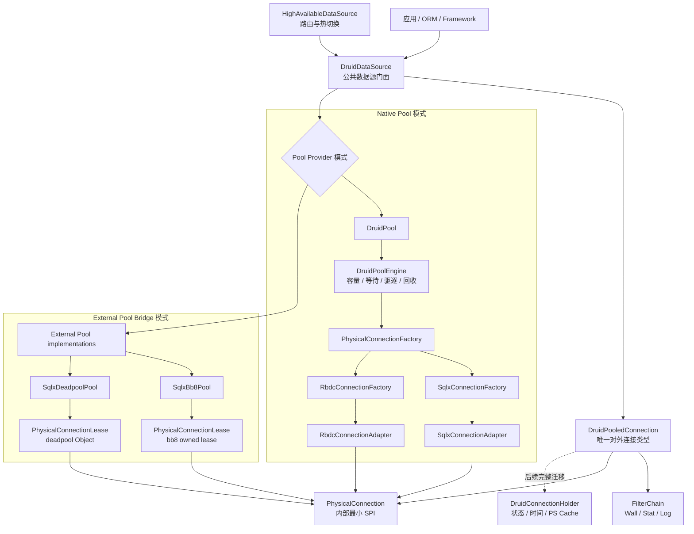
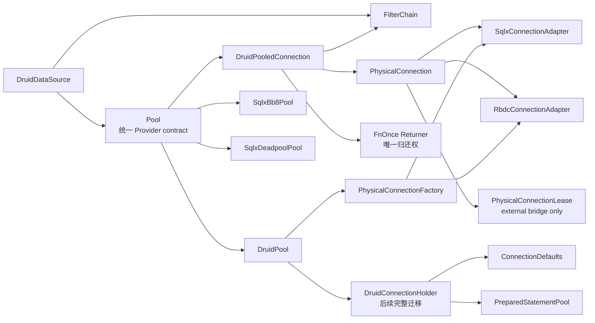
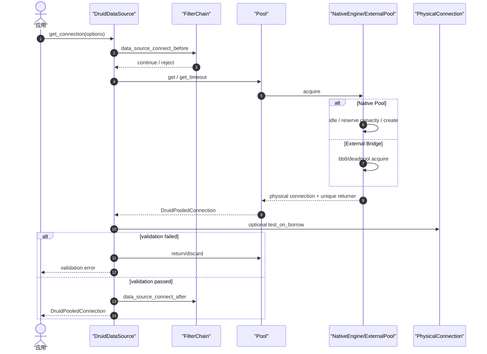
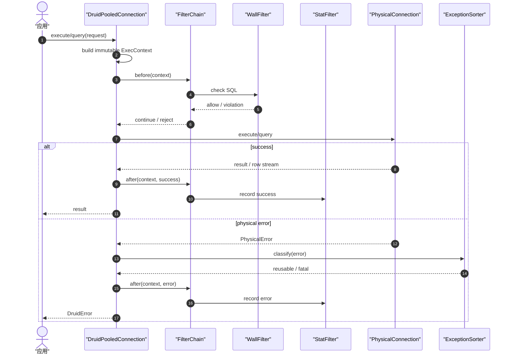
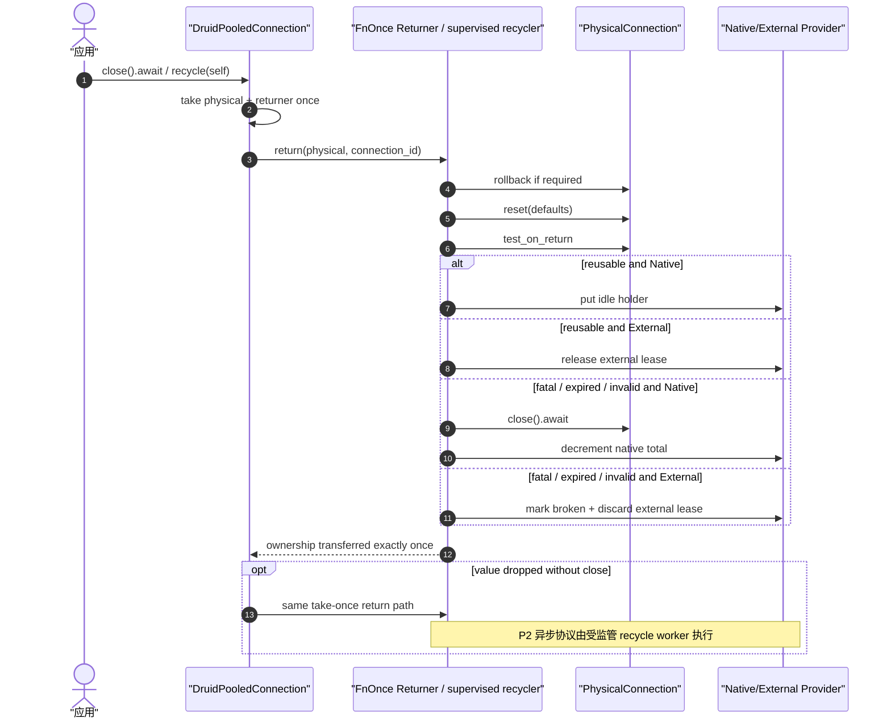
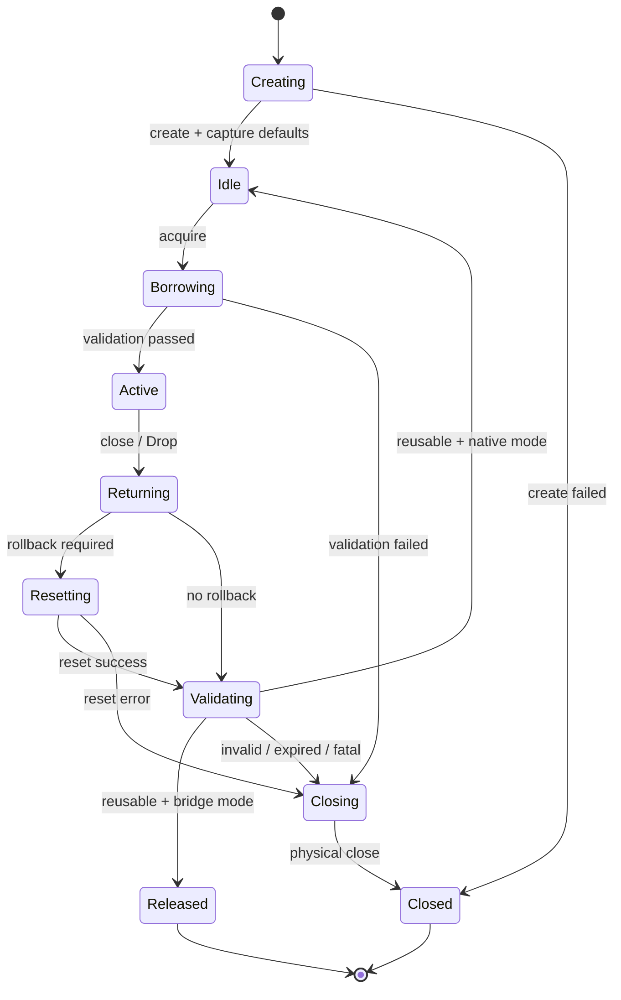
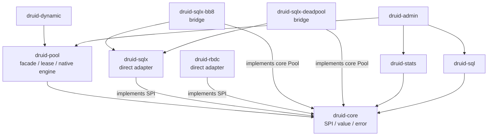

# druid-rust 连接抽象与驱动适配架构

> 核心决策：`DruidPooledConnection` 是对外稳定的 Druid 池化连接；`PhysicalConnection` 是 druid-rust 内部、对象安全、最小化的驱动 SPI；SQLx、RBDC 及其他驱动通过 Adapter 实现该 SPI。bb8/deadpool 作为外部连接池接入 Provider 层，禁止嵌套进入 native pool 形成双重池。

## 1. 设计目标

本设计解决以下问题：

1. `java.sql.Connection` 是 JDK/JDBC 标准对象，不作为 Druid 自身对象迁移。
2. `DruidPooledConnection`、`DruidConnectionHolder`、`ConnectionProxy` 等 Druid 对象继续进行完整语义迁移。
3. druid-rust 同时支持 SQLx、RBDC 和其他驱动，而不把任何一个 crate 的类型泄漏到 Druid 公共 API。
4. native Druid pool 和 bb8/deadpool bridge 使用同一个对外连接类型，但生命周期职责明确分离。
5. Filter、Wall、Stat、错误分类和连接状态复位位于稳定层，不在每个 adapter 重复实现。
6. 所有连接必须只有一个所有者、一个归还路径和一个计数来源。

### 1.1 CodeGraph 当前证据

本设计不是从类型名称推演，而是依据 Java 1.2.28 与当前 Rust 调用链确定切点：

| 证据 | CodeGraph 定位 | 架构结论 |
| :--- | :--- | :--- |
| Java `getConnection` 经 FilterChain 或 direct 路径进入 `getConnectionInternal`，最终构造 `DruidPooledConnection` | `DruidDataSource.java:1332-1353`、`:1543-1770` | `DruidPooledConnection` 必须保留为 canonical 对外连接 |
| Java pooled connection 同时持有 `conn` 与 `DruidConnectionHolder`，`close` 经 FilterChain 进入 datasource recycle | `DruidPooledConnection.java:43-49`、`:235-350` | 执行横切与回收语义属于 pooled facade/lease，不属于 driver adapter |
| Java holder 从 `PhysicalConnectionInfo` 取得物理连接，并保存默认 autoCommit/readOnly/isolation/holdability、时间和 PS cache | `DruidConnectionHolder.java:92-221`、`:317-333` | `DruidConnectionHolder` 必须位于 pooled 生命周期层，内部持有物理 SPI |
| Java FilterChain 的 connect 末端回到 `getConnectionDirect` | `FilterChainImpl.java:5066-5075` | Filter 应包围 facade 操作，不能下沉为某个驱动专用逻辑 |
| Rust 当前存在两套 pooled 句柄 | `druid-pool/src/pooled_connection.rs:12-83`、`druid-core/src/pooled_connection.rs:8-55` | 合并为唯一 `DruidPooledConnection` |
| Rust `into_core` 使用空 return callback | `druid-pool/src/pooled_connection.rs:72-75` | 删除转换逃逸路径，以 `DruidPooledConnection` 内部 `FnOnce` 固化归还权 |
| Rust `run_after_filter` 重建空上下文，`fetch` 完全绕过 Filter | `druid-pool/src/pooled_connection.rs:35-62` | Filter completion 必须由 pooled facade 统一管理 |
| Rust factory 返回 `Box<dyn Connection>`，三个 adapter 的 `create()` 均固定未实现 | `druid-core/src/connection_factory.rs:6-14`、`druid-rbdc/src/adapter.rs:22-32`、两个 SQLx bridge 的 `adapter.rs:19-28` | direct driver 改为 `PhysicalConnectionFactory`；bb8/deadpool 改为 Provider |
| Rust dynamic route 返回 `Arc<dyn Pool>` | `druid-dynamic/src/dynamic_datasource.rs:25-37` | HA 路由目标改为 Provider/facade，不能经空 callback 丢失归还语义 |

### 1.2 2026-07-28 实现快照

上表保留的是迁移前 CodeGraph 基线，用于说明设计为何这样切分；以下为当前源码状态，不能再把已经修复的基线缺陷当成现状：

| 边界 | 当前对象/文件 | 当前证据 | 状态 |
| :--- | :--- | :--- | :--- |
| 唯一对外连接 | `druid-core/src/druid_pooled_connection.rs` / `DruidPooledConnection` | native、`dyn Pool`、bb8、deadpool 均返回该类型；显式 close 与 Drop 共用 `FnOnce` 回收路径 | 已落地，完整 Java 状态复位仍在 P2 |
| 内部物理 SPI | `physical_connection.rs` / `PhysicalConnection` | `Connection` 只保留兼容重导出；默认不支持能力返回 `UnsupportedOperation` | 已落地 |
| native 物理工厂 | `physical_connection_factory.rs` / `PhysicalConnectionFactory` | `ConnectionFactory` 只保留兼容重导出；SQLx/RBDC factory 实现 canonical trait | 已落地 |
| SQLx direct | `druid-sqlx/src/sqlx_connection_adapter.rs` | 真实 SQLite connect/exec/fetch/transaction/savepoint/close 测试 | PARTIAL：PostgreSQL/MySQL、cancel/metadata/LOB 待补 |
| RBDC direct | `druid-rbdc/src/rbdc_connection_adapter.rs` | 真实 RBDC trait、参数/结果/事务/savepoint 契约测试 | PARTIAL：真实数据库 driver 矩阵待补 |
| bb8 bridge | `SqlxBb8Pool` + `SqlxBb8ConnectionManager` | 不实现 `PhysicalConnectionFactory`；owned lease 通过 `PhysicalConnectionLease` 归还 bb8 | 已落地，能力矩阵待扩展 |
| deadpool bridge | `SqlxDeadpoolPool` + `SqlxDeadpoolConnectionManager` | 不实现 `PhysicalConnectionFactory`；Object 通过 `PhysicalConnectionLease` 归还 deadpool | 已落地，能力矩阵待扩展 |
| Dynamic 租约 | `DynamicDataSource::route` → `Arc<dyn Pool>` | 路由后 acquire/drop 的 native active/idle/recycle 计数测试 | 已修复 |

当前连接主干严格采用下列关系；它是后续连接对象设计的硬约束：

```text
DruidPooledConnection                 对外池化连接
└── PhysicalConnection                druid-rust 内部最小 SPI
    ├── SqlxConnectionAdapter
    ├── RbdcConnectionAdapter
    └── 其他驱动 Adapter
```

外部池只增加透明租约层，不改变这条主干：

```text
DruidPooledConnection
└── PhysicalConnectionLease<bb8/deadpool lease>
    └── SqlxConnectionAdapter
```

## 2. 边界结论

| 对象 | 分类 | 是否计入 Druid 对象迁移率 | 职责 |
| :--- | :--- | :---: | :--- |
| `java.sql.Connection` | Java 平台标准 | 否 | Java 驱动连接标准 |
| `sqlx::Connection` | Rust 生态接口 | 否 | SQLx 驱动连接 |
| `rbdc::db::Connection` | Rust 生态接口 | 否 | RBDC 驱动连接 |
| `PhysicalConnection` | druid-rust 内部 SPI | 否，记为 RUST_ONLY/ADAPTER | 消除驱动差异 |
| `DruidPooledConnection` | Druid 迁移对象 | 是 | 对外池化连接与执行入口 |
| `DruidConnectionHolder` | Druid 迁移对象 | 是 | 物理连接、默认状态、时间和缓存 |
| `ConnectionProxy/Impl` | Druid 迁移对象 | 是 | Filter 上下文、属性和异常处理 |
| `DruidDataSource` | Druid 迁移对象 | 是 | 获取、归还、维护、配置和统计 |

对象账本必须把“Druid 对象迁移”和“平台依赖映射”分栏，不能把 `java.sql.*` 计入 1,719 个 Druid 生产对象的完成率。

## 3. 总体架构



### 3.1 不变式

- 应用永远只拿到 `DruidPooledConnection`。
- `DruidPooledConnection` 永远只持有一个 `Box<dyn PhysicalConnection>`；不得同时持有 native 与 external 两个来源。
- native 模式下该对象直接是 SQLx/RBDC 等 driver adapter；bridge 模式下是只拥有一次外部租约的 `PhysicalConnectionLease`。
- `DruidConnectionHolder` 完整迁移后保存默认状态、时间、useCount 与 PS cache，但不能成为第二个公开连接句柄。
- native 模式只有 `DruidPoolEngine` 管理空闲队列。
- bridge 模式只有 bb8/deadpool 管理空闲队列，Druid 不再维护第二个 idle queue。
- native 模式的 physical total/idle/active 以 Druid 为唯一数据源；bridge 模式的 physical total/idle 以外部池为唯一数据源，Druid 只统计自身 logical lease。
- `into_core()` 和空 return callback 被删除，不允许通过类型转换丢失归还语义。

## 4. 分层职责

| 层 | 核心对象 | 允许承担 | 禁止承担 |
| :--- | :--- | :--- | :--- |
| Public API | `DruidDataSource`、`DruidPooledConnection` | Druid API、事务、执行、close | 暴露 SQLx/RBDC 类型 |
| Cross-cutting | `FilterChain`、Wall、Stat、Log | before/after、上下文、统计、安全 | 直接管理物理连接 |
| Lease | `DruidPooledConnection` 的 `FnOnce` 回收权、`PhysicalConnectionLease` | 所有权、显式回收、Drop 兜底 | SQL 解析与业务规则 |
| Holder | `DruidConnectionHolder` | 默认状态、时间、useCount、PS cache | 决定 native/bridge 模式 |
| Provider | core `Pool` | acquire/recycle/state | 实现 SQL 操作 |
| Native Pool | `DruidPool` / 后续 `DruidPoolEngine` | 容量、等待、创建、驱逐 | 包装外部 Pool 再池化 |
| Driver SPI | `PhysicalConnection`、Factory | 驱动操作与状态复位 | Druid 统计、Wall 决策 |
| Adapter | SQLx/RBDC driver adapter、外部 lease bridge | 类型转换、错误归一、能力声明 | 静默伪造不支持能力 |

## 5. 核心对象模型



### 5.1 `DruidDataSource`

公开门面，保持 Druid 语义名称：

- 持有一个 `Arc<dyn Pool>`；该对象是 native `DruidPool` 或一个 external bridge，二者只能选一；
- 持有数据源级 `FilterChain`、配置、统计和状态；
- `get_connection()` 委托 `Pool` 并直接得到 `DruidPooledConnection`；
- native/bridge 模式由 builder 明确选择，运行中不可隐式切换；
- `close().await` 关闭 Provider 并等待 pending recycle 清空。

### 5.2 `DruidPooledConnection`

唯一公开连接句柄：

- 承载 `exec/query/prepare/transaction/metadata` 的 Druid 行为；
- 直接持有且只持有一个 `Option<Box<dyn PhysicalConnection>>`；
- 直接持有且只持有一个 `FnOnce` returner；
- 统一构造 `ExecContext`，执行 Filter before/after；
- 将底层错误交给 `ExceptionSorter`，决定连接是否可回收；
- `PhysicalConnection::close(&mut self).await`、`recycle(self)` 与 `Drop` 汇入同一个 take-once 回收入口；
- 当前 returner 只执行同步所有权转移；P2 的 rollback/reset/validate 必须由可监督 recycle worker 完成；
- 禁止存在第二种公共 `PooledConnection`。

### 5.3 `PhysicalConnectionLease`

只用于 external pool bridge 的透明所有权对象：

- 泛型持有 bb8 owned lease 或 deadpool Object；
- 实现 `PhysicalConnection` 并把全部操作委托给 lease 内部的 direct adapter；
- 自身不维护容量、等待队列或 idle queue；
- 析构时由外部池原生 lease 机制归还；
- native pool 不使用该对象，避免无意义的第二层 lease。

### 5.4 `DruidConnectionHolder`

保持 Java 对象名称和职责：

- 作为 native pool 的 holder/idle 元数据容器；物理连接借出后由
  `DruidPooledConnection` 独占，不能让 holder 与 pooled facade 同时拥有；
- 保存创建时间、最后活跃时间、使用次数、密码/配置版本；
- 保存借出前的 `ConnectionDefaults`；
- 保存 statement cache 与 FilterChain 可复用状态；
- 保存 discard/broken/active 等状态；
- 不持有具体 SQLx/RBDC 泛型。

## 6. `PhysicalConnection` SPI

### 6.1 设计约束

`PhysicalConnection` 必须：

- object-safe，可存入 `Box<dyn PhysicalConnection>`；
- `Send`，但默认不要求 `Sync`；
- 不包含泛型数据库类型；
- 不暴露 SQLx/RBDC 错误或 Row；
- 不使用默认 `Ok(())` 掩盖未支持能力；
- 支持借用连接的流式结果；
- 所有异步操作都可取消，并明确取消后的连接可复用性。

### 6.2 C7 目标接口草案

> 本节是流式 ResultSet、typed request/result 与 metadata 完成后的目标接口，
> 不是当前源码签名。当前已落地的 canonical 方法仍是
> `exec`、`fetch`、`begin`、`commit`、`rollback`、`ping`、`close` 及连接属性方法；
> C7 迁移时再有计划地演进为下述 `execute/query` 请求模型，不能把草案状态写成
> 已完成。

```rust
use futures_core::Stream;
use futures_util::future::BoxFuture;
use std::pin::Pin;
use std::time::Duration;

/// 物理行流，生命周期绑定到被借用的物理连接。
pub type PhysicalRowStream<'a> =
    Pin<Box<dyn Stream<Item = Result<SqlRow, PhysicalError>> + Send + 'a>>;

/// druid-rust 内部物理连接 SPI。
///
/// 这是 Rust 侧平台适配接口，不对应某个 Druid Java 对象。
pub trait PhysicalConnection: Send {
    /// 返回驱动标识。
    fn driver_kind(&self) -> DriverKind;

    /// 返回驱动能力快照。
    fn capabilities(&self) -> DriverCapabilities;

    /// 返回连接是否已关闭。
    fn is_closed(&self) -> bool;

    /// 执行非查询语句。
    fn execute<'a>(
        &'a mut self,
        request: ExecuteRequest,
    ) -> BoxFuture<'a, Result<ExecuteResult, PhysicalError>>;

    /// 执行查询并返回流式结果。
    fn query<'a>(
        &'a mut self,
        request: QueryRequest,
    ) -> BoxFuture<'a, Result<PhysicalRowStream<'a>, PhysicalError>>;

    /// 开始事务或保存点。
    fn begin<'a>(
        &'a mut self,
        options: TransactionOptions,
    ) -> BoxFuture<'a, Result<TransactionState, PhysicalError>>;

    /// 提交当前事务。
    fn commit<'a>(&'a mut self) -> BoxFuture<'a, Result<(), PhysicalError>>;

    /// 回滚当前事务。
    fn rollback<'a>(&'a mut self) -> BoxFuture<'a, Result<(), PhysicalError>>;

    /// 恢复连接默认状态。
    fn reset<'a>(
        &'a mut self,
        defaults: &'a ConnectionDefaults,
    ) -> BoxFuture<'a, Result<(), PhysicalError>>;

    /// 在指定超时内验证连接。
    fn ping<'a>(
        &'a mut self,
        timeout: Duration,
    ) -> BoxFuture<'a, Result<(), PhysicalError>>;

    /// 获取数据库元数据。
    fn metadata<'a>(
        &'a mut self,
    ) -> BoxFuture<'a, Result<ConnectionMetadata, PhysicalError>>;

    /// 显式关闭物理连接。
    fn close(self: Box<Self>) -> BoxFuture<'static, Result<(), PhysicalError>>;
}
```

接口使用显式 `BoxFuture`，而不是依赖泛型关联数据库类型，目的是保证动态分派、清楚表达借用生命周期，并避免 async trait 默认实现返回成功。

### 6.3 请求与结果模型

| 对象 | 关键字段 | 说明 |
| :--- | :--- | :--- |
| `ExecuteRequest` | sql、params、statement mode、timeout、fetch size | 拥有请求数据，避免 adapter 借用上层 context |
| `QueryRequest` | sql、params、statement mode、timeout、fetch size | 支持流式行 |
| `ExecuteResult` | rows affected、last insert id、warnings | 不泄漏驱动类型 |
| `SqlRow` | ordered values、column metadata | 对齐 ResultSet 语义 |
| `SqlValue` | typed value/NULL/LOB handle | 统一参数与返回值 |
| `ConnectionMetadata` | product、version、schema、capabilities | 迁移 DatabaseMetaData 结果 |
| `ConnectionDefaults` | autoCommit、readOnly、isolation、catalog、schema | recycle reset 基线 |

PreparedStatement 不直接暴露驱动 statement 类型。`DruidPooledPreparedStatement` 保存 SQL、参数和 logical cache key，调用 `PhysicalConnection::execute/query` 时通过 `StatementMode::Prepared` 请求 adapter 使用原生 prepared statement。

## 7. Factory 与 Provider

### 7.1 `PhysicalConnectionFactory`

只在 native pool 模式创建真正的物理连接：

```rust
/// 物理连接创建工厂。
#[async_trait::async_trait]
pub trait PhysicalConnectionFactory: Send + Sync {
    /// 创建原始物理连接。
    async fn create(&self) -> Result<Box<dyn PhysicalConnection>, DruidError>;
}
```

以上是当前已落地签名。C7 再把返回值有计划地扩展为
`PhysicalConnectionInfo`，以迁移 Java 同名对象中的连接、创建耗时、server
variables、global variables、驱动能力和连接元数据语义。

### 7.2 `Pool` Provider contract

当前 core `Pool` 已统一 native pool 与 external pool；不再另建一套
`ConnectionProvider` trait：

```rust
#[async_trait::async_trait]
pub trait Pool: Send + Sync {
    async fn get(&self) -> Result<DruidPooledConnection, DruidError>;
    async fn get_timeout(
        &self,
        timeout: Duration,
    ) -> Result<DruidPooledConnection, DruidError>;
    fn state(&self) -> PoolState;
    fn driver_name(&self) -> &str;
    fn name(&self) -> &str;
}
```

`DruidPool`、`SqlxBb8Pool`、`SqlxDeadpoolPool` 都实现此 contract。external
bridge 不能同时实现 `PhysicalConnectionFactory`。

### 7.3 唯一 Returner

```rust
type ReturnPhysicalConnection =
    Box<dyn FnOnce(Box<dyn PhysicalConnection>, u64) + Send>;
```

`DruidPooledConnection` 通过 `Option<ReturnPhysicalConnection>` + `take()`
保证至多执行一次。P2 若需要异步 rollback/reset/validate，returner 的实现
只负责把唯一所有权提交给受监管 recycle worker，不新增第二个公开 lease 类型。

## 8. 两种运行模式

### 8.1 Native Pool 模式

适用于实现 Druid 1.2.28 完整连接池语义：

```text
DruidDataSource
  → DruidPool
  → DruidPoolEngine
  → PhysicalConnectionFactory
  → SqlxConnectionAdapter / RbdcConnectionAdapter
```

职责：

- Druid 管理 maxActive、minIdle、maxWait、公平性和容量；
- Druid 管理 testOnBorrow/testOnReturn/testWhileIdle；
- Druid 管理 create/destroy、keepAlive、eviction、removeAbandoned；
- Druid 管理 holder、PS cache、计数与回收。

### 8.2 External Pool Bridge 模式

适用于已有 bb8/deadpool 的应用：

```text
DruidDataSource
  → SqlxBb8Pool / SqlxDeadpoolPool
  → PhysicalConnectionLease
  → SqlxConnectionAdapter
```

职责：

- 外部池管理 max size、idle queue、wait 和 pool recycle；
- Druid 管理 Wall、Stat、Log、SQL 参数化和 Druid API；
- Druid 仍在归还前执行 rollback/reset/validation；
- Druid 不再启动 create/destroy/eviction task；
- 不受外部池支持的 Druid 配置必须返回 `UnsupportedConfiguration`，禁止接受后不生效。

### 8.3 模式对比

| 能力 | Native Pool | External Bridge |
| :--- | :--- | :--- |
| Druid 语义对标主路径 | 是 | 否，属于兼容扩展 |
| 空闲队列所有者 | Druid | bb8/deadpool |
| 连接创建 | `PhysicalConnectionFactory` | 外部 `Manager` |
| maxActive/minIdle | Druid 配置 | 映射外部池配置 |
| eviction/keepAlive | Druid task | 外部 pool 能力 |
| Filter/Wall/Stat | Druid | Druid |
| 返回类型 | `DruidPooledConnection` | `DruidPooledConnection` |
| 语义完成判定 | Druid 全契约 | capability 范围内单独判定 |

## 9. Adapter 规划

| Crate | 模式 | 目标对象 | 底层对象 | 说明 |
| :--- | :--- | :--- | :--- | :--- |
| 新增 `druid-sqlx` | Native | `SqlxConnectionFactory`、`SqlxConnectionAdapter` | SQLx raw connection | 不使用 SQLx Pool |
| `druid-rbdc` | Native | `RbdcConnectionFactory`、`RbdcConnectionAdapter` | RBDC driver/connection | 加入真实 rbdc 依赖 |
| `druid-sqlx-bb8` | Bridge | `SqlxBb8Pool`、`SqlxBb8ConnectionManager`、`PhysicalConnectionLease` | bb8 pool owned lease | 已移除 native factory 角色 |
| `druid-sqlx-deadpool` | Bridge | `SqlxDeadpoolPool`、`SqlxDeadpoolConnectionManager`、`PhysicalConnectionLease` | deadpool Object | 已移除 native factory 角色 |
| 未来 driver | Native/Bridge | 独立 factory/provider + adapter | driver-specific | 通过 contract suite |

迁移前基线中三个 adapter 的 `create()` 固定返回未实现。当前 SQLx/RBDC 已成为 direct adapter；bb8/deadpool 已从 `ConnectionFactory` 角色移出并直接实现 `Pool`。兼容名称 `SqlxBb8Adapter`/`SqlxDeadpoolAdapter` 只是 deprecated 重导出，不再定义第二套对象或 factory 行为。

## 10. 获取连接时序



## 11. SQL 执行时序



`ExecContext` 在 before/after 之间是同一个上下文对象，必须保留 SQL、参数、数据源、开始时间、fingerprint、connection id、statement id 和 transaction id。当前 after 重建空上下文的做法被删除。

### 11.1 取消安全

Rust future 可能在任意 `.await` 点被取消，不能假设错误分支一定执行。每次 execute/query 在 before 成功后创建 `FilterCompletionGuard`：

- success/error 显式完成 guard，并同步提交唯一 after outcome；
- future 被 drop 时，guard 提交 `Cancelled` outcome，确保 before/after 配对；
- driver 支持 cancel 时触发 adapter cancel token；
- driver 无法证明取消后协议状态可复用时，holder 直接标记 broken；
- cancellation outcome 进入有界、可监控的 filter completion 队列；队列不可用时至少同步更新丢失事件指标并将连接失效；
- 行流提前 drop 由 `DruidResultSet` completion guard 记录 fetch/close，并按 adapter capability 决定 validate 或 discard。

guard 只负责完成事件与连接可复用性标记，不在 `Drop` 中执行异步 Filter 或启动游离任务。

## 12. 归还连接时序



## 13. Holder 状态机



合法状态转换必须由单一原子状态控制。重复 close、Drop 与显式 close 竞争、shutdown 与 recycle 竞争都只能完成一次。

## 14. 异步 Drop 与回收协议

Rust `Drop` 不能 `.await`，因此采用“多入口、同一 take-once 所有权协议”：

1. `PhysicalConnection::close(&mut self).await`：业务代码的异步关闭入口。
2. `DruidPooledConnection::recycle(self)`：显式同步所有权归还入口。
3. `Drop`：兜底调用同一个 `recycle_once`。

兜底规则：

- P2 recycle queue 已关闭时，returner 必须保留或明确 discard 所有权，不能静默丢失；
- native adapter 的 Drop 必须使 raw connection 不可再借出；bridge adapter 必须先把外部 lease 标为 broken/invalidate，再释放，禁止未 reset 的连接回到外部 idle queue；
- `discard_now` 只做非阻塞失效与资源释放，并记录 forced-discard 指标，不能宣称已完成协议级 async close；
- datasource `close().await` 必须停止借出、等待 pending leases、排空 recycle queue、关闭 idle physical connections；
- 超时后进入 forced shutdown，并记录未归还 connection id；
- 不在 `Drop` 中启动不可追踪的 Tokio task。

## 15. 错误模型

### 15.1 `PhysicalError`

| 字段 | 说明 |
| :--- | :--- |
| `kind` | connection/auth/timeout/cancel/syntax/constraint/protocol/unsupported |
| `message` | 脱敏后的稳定消息 |
| `sql_state` | 数据库 SQLState |
| `vendor_code` | vendor error code |
| `transient` | 是否可重试 |
| `connection_fatal` | adapter 的初步判断 |
| `source` | 原始错误链，不暴露到序列化 API |

### 15.2 错误路径

```text
SQLx/RBDC error
  → Adapter 归一为 PhysicalError
  → ExceptionSorter 按 DbType/sql_state/vendor_code 复核
  → DruidPooledConnection 标记 holder reusable 或 broken
  → Filter after / Stat 记录
  → 转换为 DruidError 返回调用者
```

禁止：

- adapter 直接返回字符串后丢失 SQLState；
- 默认把所有错误视为可复用；
- 仅按错误消息文本判断 fatal；
- unsupported 操作返回 `Ok(())`。

## 16. 能力模型

```rust
bitflags::bitflags! {
    /// 物理驱动能力。
    pub struct DriverCapabilities: u64 {
        const TRANSACTIONS = 1 << 0;
        const SAVEPOINTS = 1 << 1;
        const PREPARED_STATEMENTS = 1 << 2;
        const CALLABLE_STATEMENTS = 1 << 3;
        const STREAMING_ROWS = 1 << 4;
        const LOB = 1 << 5;
        const METADATA = 1 << 6;
        const QUERY_CANCEL = 1 << 7;
        const CONNECTION_RESET = 1 << 8;
        const XA = 1 << 9;
    }
}
```

能力规则：

- builder 在启动时校验配置所需能力；
- 缺失能力返回结构化 `UnsupportedCapability`；
- bridge 模式同时报告 driver capability 与 external pool capability；
- capability 只能降低功能可用范围，不能把未支持项计为 Druid 语义完成；
- XA 使用单独 `XaConnectionProvider` 扩展，不污染基础连接 SPI。

## 17. Filter、Wall 与 Stat 的放置

横切逻辑统一位于 `DruidPooledConnection`：

| 行为 | 所在层 | 原因 |
| :--- | :--- | :--- |
| SQL Wall | pooled connection before | 所有 adapter 行为一致 |
| SQL 参数化/fingerprint | pooled connection context | Stat key 稳定 |
| 执行时间和错误统计 | pooled connection after | 覆盖成功、失败和取消 |
| 物理 connect/close 统计 | Provider/Factory | 只有该层知道物理生命周期 |
| result set fetch/close | `DruidResultSet` wrapper | 保留流式行和持有时长 |
| connection reset | `DruidPooledConnection` 唯一 returner / supervised recycler | 归还协议的一部分 |
| fatal error 分类 | pooled connection + sorter | 需要 DbType 与 driver error |

Adapter 只负责调用底层 crate、转换值/行/错误和声明能力，不直接依赖 Wall 或 Stat crate。

### 17.1 指标所有权

| 指标 | Native Pool | External Bridge |
| :--- | :--- | :--- |
| logical acquire/active/close | Druid | Druid |
| physical create/close/total | Druid Factory/PoolEngine | bb8/deadpool；Druid 只透传可获得的快照 |
| physical idle/waiters | Druid PoolEngine | bb8/deadpool |
| SQL/transaction/Filter | Druid | Druid |
| adapter error/capability | Druid adapter | Druid bridge adapter |

同名指标只能有一个权威来源。bridge 模式不允许用 logical lease 数伪造 external physical total/idle；外部池不暴露的指标应标记 unavailable，而不是填 0。

## 18. 配置模型

```rust
/// 数据源底层模式。
pub enum ProviderConfig {
    /// Druid 原生连接池。
    Native {
        pool: NativePoolConfig,
        factory: PhysicalFactoryConfig,
    },
    /// 外部连接池桥接。
    External {
        provider: ExternalPoolConfig,
    },
}
```

规则：

- `ProviderConfig` 必须显式选择，禁止根据依赖是否存在自动推断；
- native 模式接受完整 Druid pool 配置；
- external 模式将可映射配置交给外部池，无法映射的配置启动失败；
- 配置快照带 version，holder 归还时检查版本；
- secret 变更导致旧 holder discard；
- 动态配置变更必须提供 apply/rollback 结果。

## 19. Crate 与文件布局

```text
crates/
├── druid-core/src/
│   ├── physical_connection.rs
│   ├── physical_connection_factory.rs
│   ├── physical_connection_info.rs
│   ├── physical_error.rs
│   ├── driver_kind.rs
│   ├── driver_capabilities.rs
│   ├── execute_request.rs
│   ├── execute_result.rs
│   ├── query_request.rs
│   ├── physical_row_stream.rs
│   ├── sql_row.rs
│   ├── sql_value.rs
│   ├── connection_defaults.rs
│   ├── connection_metadata.rs
│   ├── transaction_options.rs
│   └── transaction_state.rs
├── druid-pool/src/
│   ├── druid_data_source.rs
│   ├── druid_pooled_connection.rs
│   ├── druid_connection_holder.rs
│   ├── connection_lease.rs
│   ├── connection_provider.rs
│   ├── lease_returner.rs
│   ├── pending_recycle.rs
│   ├── recycle_outcome.rs
│   ├── return_reason.rs
│   ├── acquire_options.rs
│   ├── provider_state.rs
│   ├── provider_config.rs
│   ├── filter_completion_guard.rs
│   ├── native_pool_provider.rs
│   ├── external_pool_provider.rs
│   ├── druid_pool_engine.rs
│   └── recycle_worker.rs
├── druid-sqlx/src/
│   ├── sqlx_connection_factory.rs
│   ├── sqlx_connection_adapter.rs
│   ├── sqlx_error_adapter.rs
│   └── sqlx_value_adapter.rs
├── druid-rbdc/src/
│   ├── rbdc_connection_factory.rs
│   ├── rbdc_connection_adapter.rs
│   ├── rbdc_error_adapter.rs
│   └── rbdc_value_adapter.rs
├── druid-sqlx-bb8/src/
│   ├── sqlx_bb8_connection_manager.rs
│   └── sqlx_bb8_pool.rs
└── druid-sqlx-deadpool/src/
    ├── sqlx_deadpool_connection_manager.rs
    └── sqlx_deadpool_pool.rs
```

每个 `.rs` 文件只定义一个主要对象；`lib.rs/mod.rs` 只声明与重导出。

## 20. 依赖方向



实际 Cargo 依赖必须保持无环：

- `druid-core` 不依赖任何 driver、pool、Wall 或 Stat crate；
- native driver adapter 依赖 `druid-core`；
- 当前 `Pool` trait 位于 `druid-core`，bridge 只依赖 `druid-core`、`druid-sqlx` 与对应外部池 crate；
- `druid-pool` 不反向依赖具体 adapter；
- 通过应用 builder 注入 factory/provider。

## 21. 契约测试

### 21.1 `PhysicalConnectionContract`

每个 direct adapter 必须执行同一套测试：

- connect/ping/close；
- execute/query/stream early-drop；
- transaction commit/rollback/savepoint；
- state set/reset；
- prepared mode 和 statement cache；
- metadata；
- timeout/cancel；
- SQLState/vendor error 映射；
- fatal error 后不可回池；
- capability 与实际行为一致。

### 21.2 `PoolProviderContract`

native 和 bridge provider 均需执行：

- acquire timeout；
- close 后拒绝 acquire；
- lease exactly-once return；
- explicit close 与 Drop；
- validation failure；
- provider shutdown 与 pending lease；
- active/idle/total 计数守恒；
- Filter/Wall/Stat 对所有模式一致。

### 21.3 模式特有测试

| 模式 | 必测场景 |
| :--- | :--- |
| Native | maxActive 原子容量、minIdle、eviction、keepAlive、removeAbandoned |
| bb8 bridge | bb8 owns idle queue、Druid 不二次入池、owned lease return |
| deadpool bridge | Object drop/recycle、manager error、pool shutdown |
| Dynamic | route 后仍返回同一 `DruidPooledConnection`、切换与旧 lease 回收 |

## 22. 迁移步骤

| 阶段 | 改动 | 兼容策略 | 出口 | 当前 |
| :--- | :--- | :--- | :--- | :--- |
| C0 | 新增架构类型和 contract tests | 旧 `Connection` 暂保留兼容重导出 | 类型编译、无行为变化 | DONE |
| C1 | `Connection` adapter 到 `PhysicalConnection` | 旧名称只做 alias | core 测试通过 | DONE |
| C2 | 把唯一回收权固化在 `DruidPooledConnection`；外部租约使用 `PhysicalConnectionLease` | `PooledConnection` 仅为 alias | exactly-once return | DONE（状态 reset 仍属 P2） |
| C3 | 合并两套 pooled connection | 删除 `into_core` 空 callback | DynamicDataSource 不泄漏 | DONE |
| C4 | `DruidPool` 降为 `DruidPoolEngine` | 新增 `DruidDataSource` facade | native pool contract | TODO |
| C5 | 新增 `druid-sqlx`、完成 rbdc direct | 真实数据库 feature gate | direct adapter contract | PARTIAL |
| C6 | bb8/deadpool 移到 bridge Provider | 禁止作为 native factory | 无双重池 | DONE |
| C7 | 流式 ResultSet、prepared、metadata、capability | 分能力启用 | JDBC 依赖语义闭环 | TODO |
| C8 | 删除 deprecated 旧抽象 | migration guide | 架构收口 | TODO |

## 23. 架构验收门禁

1. 公共 API 中不出现 SQLx/RBDC/bb8/deadpool 类型。
2. 不存在 `DruidPoolConnection` 与 core `PooledConnection` 两套公共所有权对象。
3. 不存在空 return callback。
4. native 和 bridge 模式不会同时持有同一连接。
5. Drop 不启动不可追踪 task，shutdown 能等待 recycle worker。
6. 所有 adapter 通过统一契约测试和真实数据库测试。
7. 不支持能力返回结构化错误，不能静默成功。
8. Filter before/after 对 exec/query/错误/取消 exactly-once。
9. `DruidConnectionHolder` 的状态、时间、useCount、默认值与回收结果可观测。
10. DynamicDataSource 路由后的返回类型仍为 `DruidPooledConnection`。

## 24. ADR 决策

| ADR | 决策 | 状态 |
| :--- | :--- | :--- |
| ADR-CONN-001 | `DruidPooledConnection` 为唯一公共连接 | ACCEPTED |
| ADR-CONN-002 | `PhysicalConnection` 为内部 object-safe SPI | ACCEPTED |
| ADR-CONN-003 | direct driver 使用 Factory，external pool 使用 Provider | ACCEPTED |
| ADR-CONN-004 | 禁止 pool-in-pool | ACCEPTED |
| ADR-CONN-005 | 显式 async close + Drop enqueue | ACCEPTED |
| ADR-CONN-006 | driver capability 启动校验，unsupported 不静默 | ACCEPTED |
| ADR-CONN-007 | `java.sql.*` 归入平台依赖映射，不计 Druid 对象完成率 | ACCEPTED |

---

文档版本：v1.0

基线日期：2026-07-28

状态：架构设计基线
