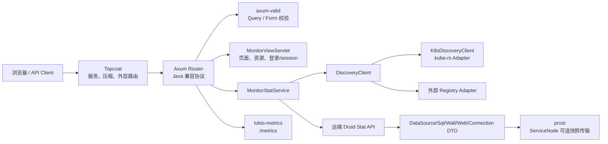
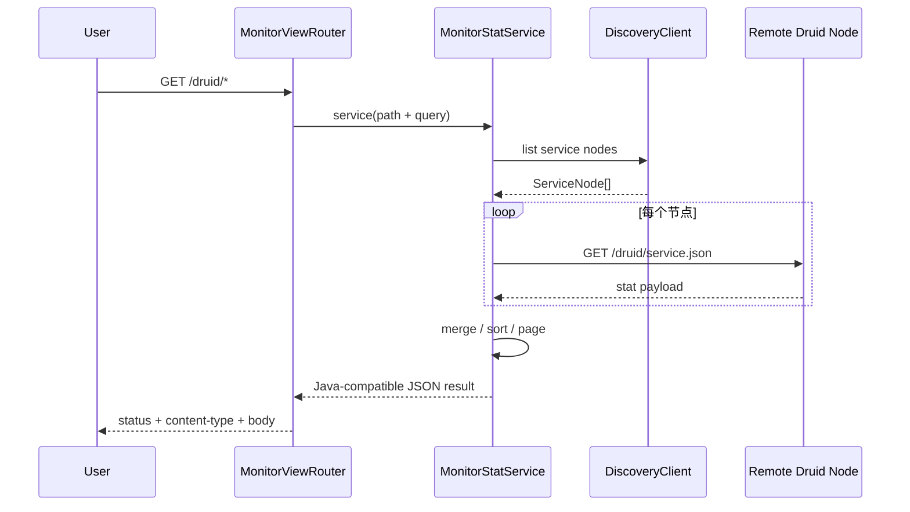

# Java `druid-admin` → Rust `druid-admin` 全量迁移路线图

> Java 基线：Druid `druid-admin`，13 个生产 Java 对象、静态资源和监控 SQL  
> Rust 目标：`crates/druid-admin`  
> 更新：2026-07-29
> 当前口径：生产代码已完成首轮整批迁移并通过模块级编译，统一 Java
> oracle、真实 HTTP/SQLite、Tower 路由和覆盖率验证尚未执行，因此不得标记
> `PASS`。

模块账本：[对象级对照表](./对象级对照表.md) ·
[语义迁移对照表](./语义迁移对照表.md) ·
[对象名称一致性检查](./对象名称一致性检查.md)

## 1. 目标

迁移 Java admin 的服务发现、远端 Druid Stat 聚合、DTO、排序/分页、Servlet
路由、静态资源和错误 JSON 语义。Axum 是协议实现方式，不是删除 Servlet
结果语义的理由。

Toasty 是 `druid` 的内置数据源实现，不进入 `druid-admin` 的持久层。
`druid-admin` 只消费 `druid` 暴露的统计协议，避免管理面反向绑定 ORM。

### 1.1 技术栈采用账本

| 组件 | 锁定版本 | 在 `druid-admin` 中的职责 | 当前采用状态 |
| :--- | :--- | :--- | :--- |
| Axum | 0.8.9 | Java Servlet 协议路由、handler、middleware | DEPENDENCY_DECLARED / IMPLEMENTED_UNVERIFIED |
| axum-valid | 0.25.0 | Form/Query/JSON 边界校验 | DEPENDENCY_DECLARED / IMPLEMENTED_UNVERIFIED |
| Tokio | 1.53.1 | async runtime、任务与关停基础 | DEPENDENCY_DECLARED / IMPLEMENTED_UNVERIFIED |
| tokio-metrics | 0.5.1 | 管理任务累计指标与 `/metrics` | DEPENDENCY_DECLARED / IMPLEMENTED_UNVERIFIED |
| Topcoat | 0.5.0 | 外层 server、压缩、路由和 Axum Tower 挂载 | DEPENDENCY_DECLARED / IMPLEMENTED_UNVERIFIED |
| prost | 0.14.4 | `ServiceNode` 的可选二进制快照协议 | DEPENDENCY_DECLARED / IMPLEMENTED_UNVERIFIED |
| Toasty | 0.9.0 | 不在 admin 持久化；由 `druid` 默认数据源消费 | OUT_OF_MODULE |

## 2. 当前实现与剩余验证

| 维度 | Java | Rust 当前 | 状态 |
| :--- | :--- | :--- | :--- |
| 生产对象 | 13 | 13/13 canonical 对象均有独立 Rust 文件；另有明确登记的 Rust Adapter | IMPLEMENTED_UNVERIFIED |
| HTTP 入口 | Spring Boot + Undertow + Servlet | Topcoat 外层服务 + Axum `Router`/Tower service | IMPLEMENTED_UNVERIFIED |
| 参数校验 | Servlet 参数解析 | axum-valid Form/Query + Java raw URL parser | IMPLEMENTED_UNVERIFIED |
| 服务发现 | K8s + Spring Cloud `DiscoveryClient` | `DiscoveryClient` SPI + kube-rs 生产 Adapter + static Adapter | IMPLEMENTED_UNVERIFIED |
| 聚合服务 | `MonitorStatService` 518 行 | URL 分派、发现、远端请求、合并、排序、分页、降级 | IMPLEMENTED_UNVERIFIED |
| DTO | 6 个顶层 DTO 及内部 Bean | 6/6 serde DTO；`ServiceNode` 同时支持 prost | IMPLEMENTED_UNVERIFIED |
| 静态资源 | 完整 Druid monitor UI | HTML/CSS/JS 25/25 原文件迁入并由 Topcoat/Axum 暴露 | IMPLEMENTED_UNVERIFIED |
| 监控 SQL | 8 个 MySQL DDL 模板 | `resources/support/monitor/mysql/*.sql` 8/8 | IMPLEMENTED_UNVERIFIED |
| 运行时/指标 | Servlet 容器线程与统计 | Tokio + tokio-metrics `/metrics` | IMPLEMENTED_UNVERIFIED |

旧根 `doc/9` 曾提出 `/druid/api/*`、统一 JSON 信封和四个 Rust DTO。
这些内容已归并到[语义迁移对照表](./语义迁移对照表.md)的 Rust-only 扩展账本。
它们不属于 Java parity 分母，也不能在 Java `/druid/*` 语义完成前替代主线。

## 3. 阶段

| 阶段 | 内容 | 验收 | 当前 |
| :--- | :--- | :--- | :--- |
| A0 | 13 对象账本、路由/DTO/资源清单 | 文件与资源分母冻结 | IMPLEMENTED_UNVERIFIED |
| A1 | DTO 与 Java JSON 结果 | serde snapshot 对照 Java | IMPLEMENTED_UNVERIFIED |
| A2 | MonitorProperties/ServiceNode | 默认值、配置优先级、prost round-trip | IMPLEMENTED_UNVERIFIED |
| A3 | HttpClient 与 DiscoveryClient SPI | timeout/error/取消 | IMPLEMENTED_UNVERIFIED |
| A4 | kube-rs 与注册中心 SPI | fixture + 集成环境 | IMPLEMENTED_UNVERIFIED |
| A5 | MonitorStatService | 聚合、排序、分页、参数、错误 | IMPLEMENTED_UNVERIFIED |
| A6 | Topcoat + Axum 替代 Servlet | 路由/状态码/内容类型差分 | IMPLEMENTED_UNVERIFIED |
| A7 | 原 UI 25 份资源与 8 份监控 SQL | 源文件逐字节/忽略空白对照已完成；运行路由待统一验证 | IMPLEMENTED_UNVERIFIED |
| A8 | tracing/metrics/login/session | 鉴权、SSRF、敏感数据、链路 | IMPLEMENTED_UNVERIFIED |
| A9 | 统一验证 | Java fixture + Tower + HTTP 故障 + workspace coverage | TODO |

## 4. 关键调用序列

## 5. 验收门禁

- 13/13 Java 对象有独立 Rust 文件或显式 ADAPTER 决策；
- 所有公开路径、参数名、默认排序、分页和 result code 快照一致；
- 静态资源和 SQL 模板不丢失；
- 网络失败、部分节点失败、空发现结果、非法参数均有差分用例；
- Axum router 使用真实 `tower::ServiceExt` 请求，不测试静态 endpoint 字符串；
- `cargo check -p druid-admin --all-targets` 只构成 V1 编译证据；
- 当前 `AdminState`/`endpoint_list` 浅层测试仍不构成语义完成证据；
- 按“先完整迁移、后统一验证”的执行顺序，所有运行时条目在最终验证前保持
  `IMPLEMENTED_UNVERIFIED` 或 `PARTIAL`。
