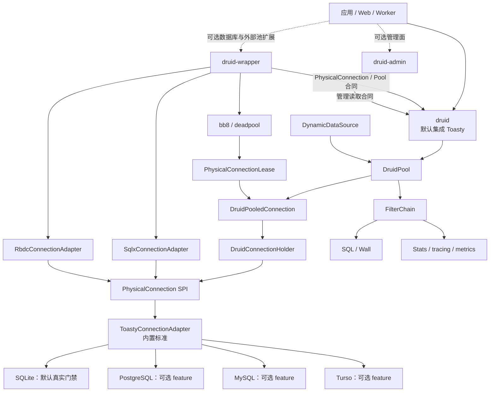
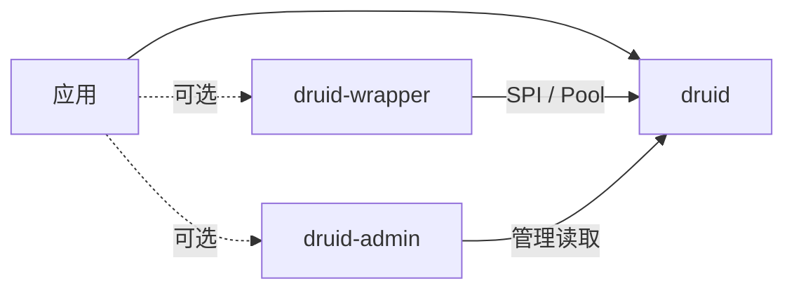
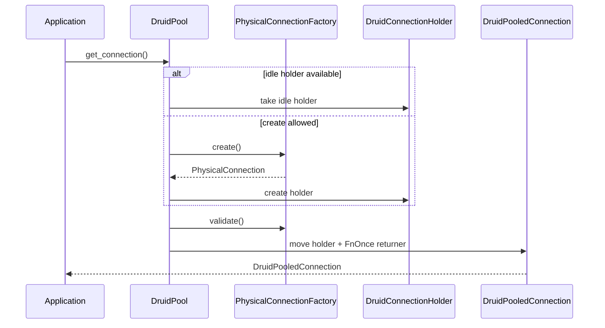
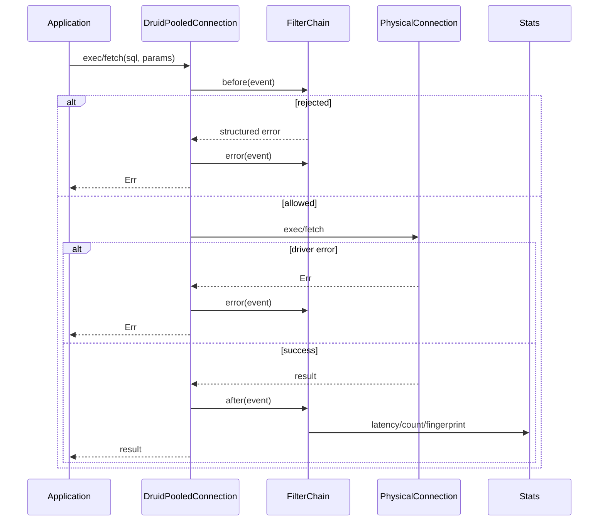
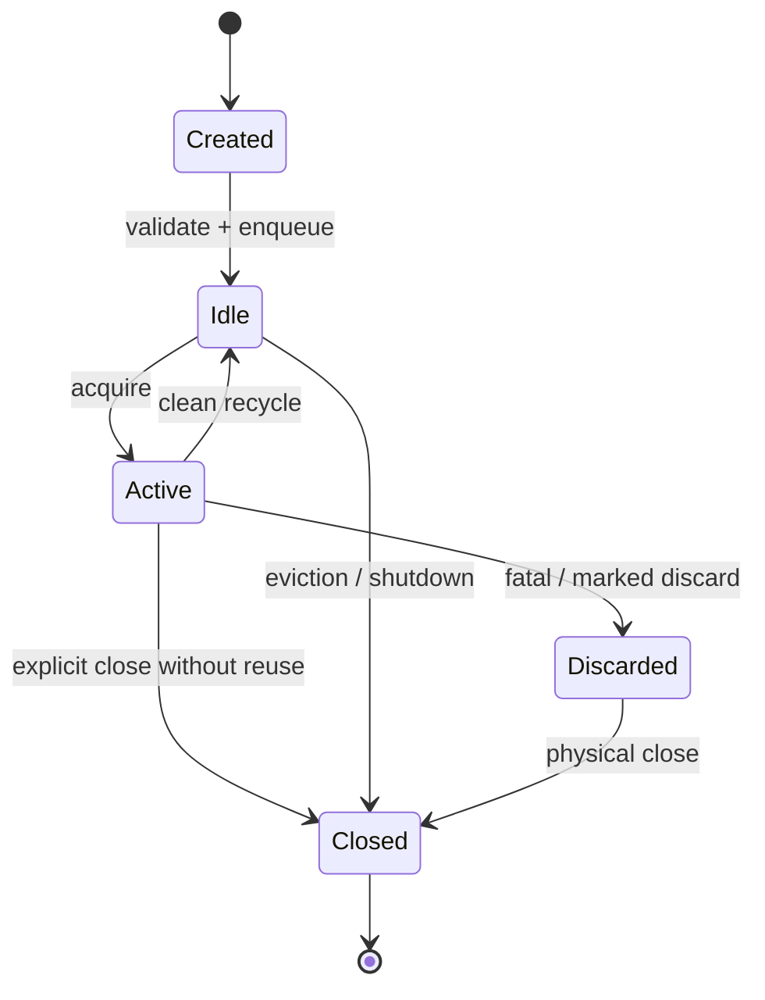
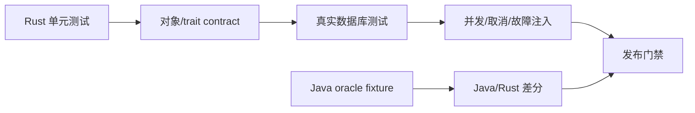

# druid-rust 架构设计文档

> 本文是 druid-rust 的唯一总体架构基线。项目目标是把 Alibaba Druid
> 1.2.28 的功能语义有规划地迁移到 Rust，不是借鉴、重新想象或按文件机械翻译。
> 对象完成度、语义完成度和命名检查分别以 `docs/druid`、
> `docs/druid-admin`、`docs/druid-wrapper` 下的模块账本为准。

| 字段 | 当前值 |
| :--- | :--- |
| 架构版本 | `V2.0.0-MIGRATION` |
| Java 基线 | Druid `1.2.28`，提交 `33824c3dec1612711f9bb4e409319bcab2e4cd0e` |
| Rust 基线 | 当前工作区 HEAD |
| Rust MSRV | `1.95` |
| 默认工具链 | `1.97.1` |
| 文档状态 | 执行中；不得理解为完整迁移已经完成 |
| 事实核验日期 | 2026-07-29 |

## 1. 文档责任与阅读路径

根 `docs/` 维护项目级架构与治理入口，三个模块目录维护各自迁移账本：

| 权威来源 | 责任 |
| :--- | :--- |
| 本文 | 当前架构、目标架构、不变量、模块边界和 ADR |
| [文档总入口](./README.md) | 总路线、模块账本导航和全 workspace 门禁 |
| [连接专项架构](./连接抽象与驱动适配架构.md) | 跨 `druid`/`druid-wrapper` 的连接对象、所有权和驱动边界 |
| [`druid`](./druid/迁移路线图.md) | Java core 对象、语义和命名账本 |
| [`druid-admin`](./druid-admin/迁移路线图.md) | Java admin 对象、语义和命名账本 |
| [`druid-wrapper`](./druid-wrapper/迁移路线图.md) | Java wrapper 与 Rust 扩展适配账本 |

`druid`、`druid-admin` 和 `druid-wrapper` 三个目录分别是所属对象、语义和
名称状态的唯一权威账本。项目级文档只聚合导航、架构和统一门禁，不形成第二套
完成率。README 只承担项目入口，不维护独立路线图。

状态含义：

| 状态 | 定义 |
| :--- | :--- |
| `DONE` | Java/Rust 对象可追溯，行为差分和真实集成门禁已通过 |
| `PARTIAL` | 存在真实实现，但公开语义、错误分支或数据库矩阵未闭合 |
| `TODO` | 尚无可接受实现 |
| `RUST_ONLY` | Rust 生态扩展，不计入 Java parity 分母 |
| `ADAPTER` | 用 Rust 生态协议承载 Java 结果语义 |

## 2. 项目定位与边界

`druid-rust` 是面向 Rust 应用的数据库连接治理框架。应用只获取
`DruidPooledConnection`；池化、连接回收、SQL 事件、统计、动态路由和驱动差异
由内部对象协作完成。

项目名称表示对 Alibaba Druid 语义的 Rust 迁移，不表示 Alibaba 官方 Rust
发行版。许可证和上游来源必须在发布物中明确。

系统负责：

- Druid 连接池生命周期与配置语义；
- `Connection`、PreparedStatement、CallableStatement 和事务结果语义；
- Filter、Wall、Stat、SQL parser/visitor/output 等对象域；
- HA、动态数据源、管理面和 wrapper 语义；
- Rust driver/ORM 与 Druid 内部连接 SPI 的适配；
- Java oracle、Rust contract、真实数据库和生产属性门禁。

系统不负责：

- 数据库 wire protocol 的重新实现；
- 应用 Schema migration；
- 替代数据库权限、网络隔离和凭据管理；
- 用名称相似或 crate 功能相近代替 Druid 行为迁移。

## 3. 总体架构



最重要的架构不变量：

1. 应用只依赖 `DruidPooledConnection`，不直接依赖 Toasty、SQLx 或 RBDC 类型。
2. `DruidConnectionHolder` 是 Druid 内部连接生命周期的唯一权威容器。
3. 每个 holder 同一时刻最多拥有一个 `PhysicalConnection`。
4. Native 模式只有 `DruidPool` 一个连接池。
5. 外部池模式只持有 bb8/deadpool lease，不再嵌套进 `DruidPool`。
6. 每个连接租约只能归还一次；正常回收、淘汰和回收错误必须显式区分。
7. Adapter 不支持的能力返回结构化 `UnsupportedOperation`，不得静默成功。
8. 产品和发布边界只有 `druid`、`druid-wrapper`、`druid-admin` 三个模块。
9. Toasty 属于 `druid` 默认实现；其他数据库操作适配统一属于 `druid-wrapper`。

## 4. 三模块职责与收敛

| 模块 | Java 来源 | 职责 | 当前状态 |
| :--- | :--- | :--- | :--- |
| `druid` | `/core` | 连接池、SQL、Wall、Stat、Dynamic、JDBC 平台对象、内部 SPI；默认 Toasty | PARTIAL |
| `druid-wrapper` | `/druid-wrapper` | SQLx、RBDC、bb8、deadpool 及各种数据库操作/连接生态封装 | PARTIAL |
| `druid-admin` | `/druid-admin` | 服务发现、监控聚合、DTO、路由、资源和管理扩展 | IMPLEMENTED_UNVERIFIED；功能 UI PARTIAL |

依赖方向：



原 13 个 workspace crate 已在 2026-07-29 物理收敛为三个：

| 已删除的原物理实现 | 当前模块 | 当前目录 |
| :--- | :--- | :--- |
| `druid-core`、`druid-pool`、`druid-sql`、`druid-stats`、`druid-dynamic` | `druid` | `crates/druid/src/{core,pool,sql,stats,dynamic}/` |
| `druid-toasty` | `druid` | `crates/druid/src/toasty/` |
| `druid-sqlx`、`druid-rbdc`、`druid-sqlx-bb8`、`druid-sqlx-deadpool` | `druid-wrapper` | `crates/druid-wrapper/src/rbdc/`、`crates/druid-wrapper/src/sqlx/{bb8,deadpool}/` |

`cargo metadata` 只返回 `druid`、`druid-wrapper`、`druid-admin` 三个 workspace
member。内部目录不得独立发布、独立维护版本或单独计算完成率。

## 5. 连接对象模型

```text
DruidPooledConnection            对外池化连接
└── DruidConnectionHolder        Druid 生命周期容器
    └── PhysicalConnection       内部最小 SPI
        ├── ToastyConnectionAdapter
        ├── SqlxConnectionAdapter
        ├── RbdcConnectionAdapter
        └── 其他直接驱动 Adapter
```

### 5.1 `DruidPooledConnection`

- 对应用暴露连接、PreparedStatement、CallableStatement 和事务方法；
- 通过 FilterChain 执行 before/after/error 事件；
- 持有一次性 return callback；
- 显式 `close/recycle` 负责异步复位和校验；
- `Drop` 只安全归还无需异步修复的干净连接；
- 归还后不得继续访问物理连接。

### 5.2 `DruidConnectionHolder`

- 拥有物理连接；
- 保存创建、最近活动、执行、保活和校验时间；
- 保存 use count、状态、discard、schema 和密码版本；
- 拥有 PreparedStatementPool；
- 是 native idle queue 与对外连接之间移动的同一个对象。

### 5.3 `PhysicalConnection`

SPI 按能力逐步覆盖：

- `exec/fetch` 与 Druid `Value/Row/ExecResult`；
- prepare、prepared execute 和 prepared close；
- begin、commit、rollback 和 savepoint；
- ping、close、abort、discard；
- auto-commit、read-only、isolation、holdability、catalog、schema；
- warnings、client info、network timeout、type map 和 vendor capability。

兼容文件中的旧 `Connection`/`ConnectionFactory` 名称只能作为迁移期重导出，
canonical 名称是 `PhysicalConnection`/`PhysicalConnectionFactory`。

## 6. 两种池化模式

### 6.1 Native Pool



Native 模式中 `PhysicalConnectionFactory` 只能创建未池化的物理连接。

### 6.2 External Pool Bridge

bb8/deadpool 已经管理连接容量和回收，因此它们实现 `Pool` provider，而不是
`PhysicalConnectionFactory`。`PhysicalConnectionLease` 持有外部池对象及其
归还逻辑，再统一包装为 `DruidPooledConnection`。

任何获取路径必须在 native 和 external provider 中二选一，禁止 pool-in-pool。

## 7. Toasty 内置标准数据源

Toasty 是 `druid` 模块内部的默认 ORM/driver 入口，其他连接生态属于
`druid-wrapper`。Toasty 源码与 feature 已归入 `druid::toasty`，不形成独立模块
或发布物。Toasty Adapter 不创建 `toasty::Db`，因为 `Db` 自身包含连接池，直接
调用 Toasty `Driver::connect` 获取单条 raw connection，让 DruidPool 独占容量、
回收、Filter 和统计职责。

| feature | 定位 | 当前证据 |
| :--- | :--- | :--- |
| `sqlite`（default） | 内置默认 SQL 数据源 | 真实 SQLite contract |
| `postgresql` | 内置可选 SQL 数据源 | feature 编译通过；真实容器待补 |
| `mysql` | 内置可选 SQL 数据源 | feature 编译通过；真实容器待补 |
| `turso` | 内置可选 SQL 数据源 | feature 编译通过；真实服务门禁待补 |

Toasty 的 DynamoDB 等非 SQL provider 不暴露为 Druid feature，也不进入
`PhysicalConnection` 与数据库支持计数。

SQLite 与 SQLx 同时启用时必须只有一个 `libsqlite3-sys` 链接版本。当前
`vendor/toasty-driver-sqlite` 保留 Toasty 0.9.0 源码，只把 `rusqlite` 固定到
与 SQLx 0.8 共用的兼容版本；补丁来源和移除条件写在 vendor README。

专项设计见
[`docs/druid/Toasty-内置数据源标准实现.md`](./druid/Toasty-内置数据源标准实现.md)。

## 8. SQL 执行、Filter 与统计



Filter、Wall 和 Stat 是 Java Druid 的独立对象域，不能合并成两个简化 hook
后宣称完成。每个 Java hook、短路顺序、异常路径和统计字段都必须进入语义账本。

SQL parser 采用 `sqlparser` 只是 Rust 实现策略。Druid 自有 AST、visitor、
方言输出、parameterize 和 Wall 行为仍需由 Java corpus 差分验证。

## 9. 事务、状态和一致性

连接至少维护以下逻辑状态：



事务不变量：

- 未提交事务在回收前必须 rollback 或淘汰；
- auto-commit、read-only、isolation、holdability、catalog 和 schema 按配置复位；
- savepoint ID/名称和错误必须稳定；
- adapter 不支持的隔离级别或 read-only 必须明确失败；
- 事务内不得因动态路由切换到其他物理连接。

## 10. 并发、取消与资源所有权

- 共享注册表使用 `Arc`、`RwLock`、`DashMap` 或 `ArcSwap`；
- 单连接可变操作由租约独占，不把 driver connection 复制给多个任务；
- native pool 容量由 open/active/idle/creating 等计数共同约束；
- 取消不得造成双重归还、计数泄漏或脏事务复用；
- 维护任务关闭后必须停止创建、保活和淘汰循环；
- 高并发下最大连接数不能越界。

`DynamicDataSource` 已使用 `ArcSwap<DataSourceGroup>` 热切换节点组。切换只影响
后续路由，已取得的事务连接继续绑定原物理连接。

## 11. 错误模型与能力协商

`DruidError` 是对外错误入口，至少区分：

- 配置、初始化和获取超时；
- SQL parser、Wall 和参数错误；
- 驱动错误、连接关闭和不支持操作；
- fatal、transient、recoverable 和 discard 决策；
- prepared/callable、事务和保存点错误；
- 外部 provider 获取/归还错误。

不得通过字符串猜测全部 vendor 语义。SQLState、vendor code 和 driver
capability 需要保留结构化字段，并由对应真实数据库测试验证。

`PhysicalConnectionCapabilities` 是适配器的能力声明。上层在调用高级能力前
检查 capability；不支持时返回确定错误，禁止无声降级。

## 12. 配置、安全与秘密

配置优先级和字段兼容必须以 Java Druid 的公开配置语义为基线。Rust 新增配置
需要登记为 `RUST_ONLY`，不得与 Java 同名字段产生不同含义。

安全规则：

- URL、密码、token 和 SQL 参数不得写入普通日志；
- Admin API 默认不暴露原始参数、凭据、内部错误栈和 PII；
- Wall 是纵深防御，不替代数据库最小权限；
- Adapter 只接受明确支持的 URL scheme，未知 scheme 不回退；
- TLS、证书和 cloud credential 由具体 driver/平台管理；
- DynamoDB 不得通过 SQL SPI 绕过能力边界。

## 13. 可观测性与管理面

观测对象分为：

| 层级 | 指标 |
| :--- | :--- |
| Pool | open、active、idle、creating、wait、timeout、discard |
| Connection | create/borrow/held/execute/validate/keep-alive 时间 |
| Statement | execute/error/result rows、prepared cache hit/miss |
| SQL | 指纹、执行次数、总/最大耗时、直方图、慢 SQL |
| Wall | 放行、拒绝、规则和数据源 |
| Dynamic | 节点选择、切换版本和失败 |

日志使用 `tracing`，指标适配 `metrics`/Prometheus。指标标签必须有界，禁止把
原始 SQL、用户 ID 或请求 ID直接作为高基数 label。

`druid-admin` 已采用 Topcoat 外层服务 + Axum/Tower 协议路由：
axum-valid 负责边界参数校验，Tokio 负责运行时，tokio-metrics 暴露任务指标，
prost 为 `ServiceNode` 提供可选快照传输；远端统计仍通过 Java-compatible JSON
协议聚合。Toasty 只属于 `druid` 默认数据源实现，不进入管理端。

13 个 Java canonical 对象已有独立 Rust 实现并通过模块级编译，但 Java oracle、
真实 Tower/HTTP 故障测试与统一覆盖率尚未执行，所以状态是
`IMPLEMENTED_UNVERIFIED`；Java 管理端 25 份 HTML/CSS/JS 原资源已逐字节迁入，
但运行路由仍待统一验证。Java 兼容面与可选 `/druid/api/*` Rust 扩展分别记账。

## 14. 部署、升级与回滚

druid-rust 默认作为库嵌入应用进程。`druid-admin` 已有可启动的 Topcoat
服务对象，但只有通过统一协议、安全与故障验证后才可进入独立或 sidecar
生产部署门禁。

升级要求：

- Cargo feature 和 MSRV 变化进入发布说明；
- 配置字段、错误枚举和公共类型遵循 SemVer；
- driver 升级运行对应数据库 contract；
- 连接池/holder 状态变化运行并发、取消、关闭和故障注入；
- Toasty SQLite vendor 补丁移除前验证 SQLx 共存依赖图；
- 回滚不得复用由新版本留下但旧版本无法解释的连接状态。

## 15. 测试与验收



测试证据分层：

1. Java 上游测试与固定 fixture；
2. Rust 单对象、状态机和错误分支；
3. `PhysicalConnectionContract` 和 `PoolProviderContract`；
4. SQLite/PostgreSQL/MySQL/Turso 等真实数据库；
5. Java/Rust 差分；
6. 并发压力、取消、超时、故障注入和性能；
7. fmt、clippy、doc、dependency、license 和安全门禁。

2026-07-29 三模块归并后已记录证据：

- `cargo test --workspace --all-targets`：453/453；
- Toasty/core/SQLx/bb8/deadpool/wrapper：21 个真实 SQLite 用例；
- `cargo check -p druid --all-features` 通过；
- `cargo metadata` 只包含三个 workspace member。

这些证据只证明对应切片。PostgreSQL/MySQL/Turso 真实矩阵、Java 全对象差分、
全工作区覆盖率及 clippy 告警仍是未关闭门禁。

## 16. 迁移治理

完整迁移不得按 Rust 文件数计算。每个 Java 对象必须出现于对象账本，并选择：

- `DIRECT`：同名或语义等价对象；
- `MERGE`：多个 Java 对象由一个 Rust 对象承载；
- `SPLIT`：一个 Java 对象拆为多个 Rust 对象；
- `ADAPTER`：平台对象由 Rust 生态协议承载；
- `PROTOCOL`：对象行为转为 trait/事件/消息协议；
- `UNSUPPORTED`：仅在 Java 能力本身依赖不可用平台时登记，并给出替代与门禁。

`MERGE/SPLIT/ADAPTER/PROTOCOL` 都必须同时记录名称映射、行为映射、错误映射和
测试证据。没有真实逻辑的同名 struct、空 trait、`todo!()` 或 mock 冒烟测试
不计入完成。

路线和总账：

- [迁移总路线图](./迁移总路线图.md)
- [`druid` 对象、语义和名称账本](./druid/迁移路线图.md)
- [`druid-admin` 对象、语义和名称账本](./druid-admin/迁移路线图.md)
- [`druid-wrapper` 对象、语义和名称账本](./druid-wrapper/迁移路线图.md)
- [连接抽象与驱动适配架构](./连接抽象与驱动适配架构.md)

## 17. ADR

| ADR | 决策 | 状态 |
| :--- | :--- | :--- |
| ADR-001 | `DruidPooledConnection` 是唯一对外连接 | 已确认 |
| ADR-002 | `PhysicalConnection` 是内部最小 SPI | 已确认 |
| ADR-003 | `DruidConnectionHolder` 是生命周期权威容器 | 已确认 |
| ADR-004 | Native 与 external pool 模式互斥 | 已确认 |
| ADR-005 | Toasty 是内置标准，SQLx/RBDC 是扩展 | 已确认 |
| ADR-006 | Toasty 使用 raw driver connection，禁止 pool-in-pool | 已确认 |
| ADR-007 | DynamoDB 不进入 SQL `PhysicalConnection` | 已确认 |
| ADR-008 | SQL parser 实现可用 sqlparser，但结果语义必须对齐 Druid | 已确认 |
| ADR-009 | DynamicDataSource 使用 ArcSwap，事务租约不随切换漂移 | 已确认 |
| ADR-010 | Admin 的 Java 兼容面与 Rust-only API 分账 | 已确认 |
| ADR-011 | 完成状态由差分和真实门禁决定，不由文件/方法计数决定 | 已确认 |
| ADR-012 | 产品、文档和发布边界只有 `druid`、`druid-wrapper`、`druid-admin` | 已确认 |
| ADR-013 | 现有内部 crate 必须归并为三模块目录，facade 重导出不等于完成归并 | SUPERSEDED_BY ADR-CRATE-001 |
| ADR-CRATE-001 | 五 Crate 目标拓扑：`druid-core`、`druid`（facade）、`druid-wrapper`、`druid-metrics`、`druid-admin`；当前源码仍为三 crate，批准目标为五 crate | ACCEPTED |
| ADR-METRICS-001 | 统计 registry、sampler、timeline、Prometheus model 和 gRPC protocol/runtime 从 `druid` core 移入独立 `druid-metrics` crate | ACCEPTED |
| ADR-TRANSPORT-001 | 管理面 ingest repository、REST、认证、兼容静态 UI 和独立 binary 从 `druid-admin` 拆分出独立传输层职责 | ACCEPTED |
| ADR-ADMIN-001 | `druid-admin` 只消费 `druid-metrics` 协议，不反向依赖 `druid-wrapper`；管理统计归属 Metrics，HTTP/REST service 归属 Admin | ACCEPTED |

### 五 Crate 目标依赖图

> 以下为已批准的五 Crate 目标拓扑。当前源码仍为三 Crate，源码迁移按
> `docs/superpowers/plans/` 下的专项计划执行。

```text
druid-core ──> druid-wrapper
druid-core ──> druid-metrics
druid-core ──> druid (facade)
druid-metrics ──> druid-admin
druid-admin -X-> druid-wrapper（禁止反向依赖）
```

`druid`（facade）可选依赖 `druid-metrics` 和 `druid-wrapper`，Cargo 方向不会
形成循环。`druid-core` 是无具体驱动和无管理传输的核心；`druid` 是稳定门面；
Wrapper 和 Metrics 分别从 Core 向上扩展；Admin 只消费 Metrics 协议。

ADR 反转必须同步修改源码、架构、对象账本、语义账本、测试和发布说明。

## 18. 术语

| 术语 | 含义 |
| :--- | :--- |
| `DruidPooledConnection` | 应用持有的池化连接 facade |
| `DruidConnectionHolder` | Druid 内部物理连接生命周期容器 |
| `PhysicalConnection` | driver/ORM adapter 实现的内部连接 SPI |
| `PhysicalConnectionFactory` | Native 模式中创建和校验未池化物理连接的工厂 |
| `PhysicalConnectionLease` | External 模式中持有并归还外部池对象的租约 |
| Native pool | 由 `DruidPool` 独占池化职责 |
| External pool | 由 bb8/deadpool 独占池化职责 |
| semantic parity | Java 与 Rust 的可观察行为、错误、状态和副作用一致 |
| Java oracle | 从 Java Druid 固定版本运行得到的对照结果 |
| Rust-only | Rust 生态新增能力，不计入 Java 迁移完成率 |
