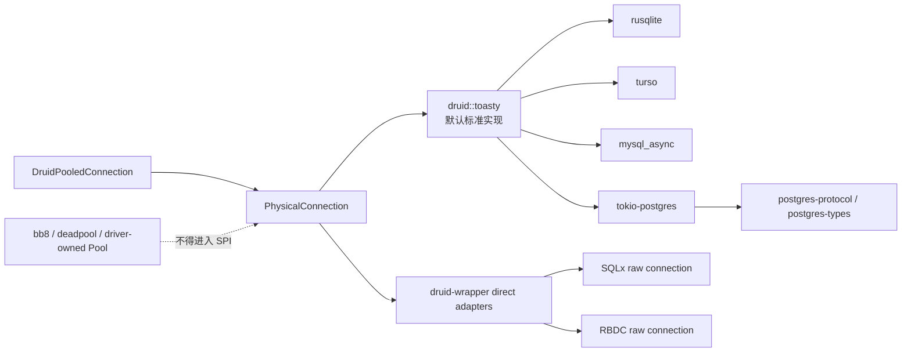
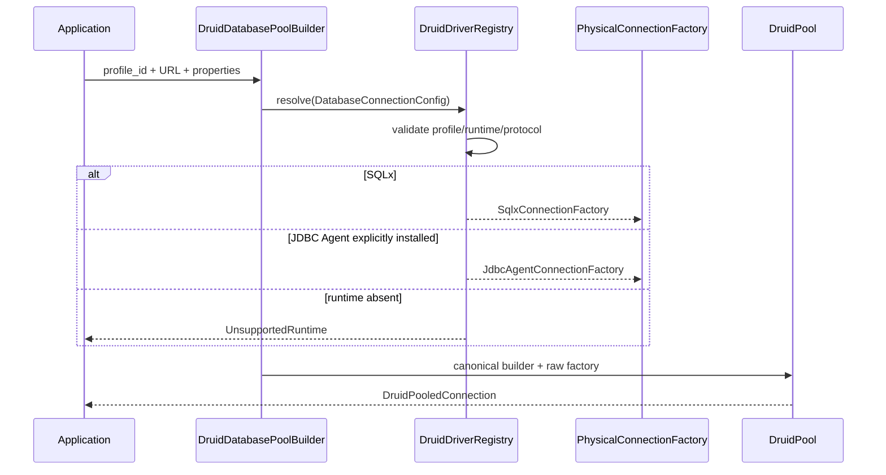

# `druid-rust` 数据库驱动集成矩阵

> 基线日期：2026-08-07
> 目标：区分“数据库驱动”“协议/类型库”“ORM”“连接池”，并为
> `PhysicalConnectionFactory -> PhysicalConnection` 的真实集成建立验收门。  
> 状态约束：依赖可编译不等于运行时已集成；未经过真实服务器验证的对象只能标
> `COMPILE_VERIFIED` 或 `PLANNED`。

## 1. 统一边界

硬约束：

- `PhysicalConnectionFactory#create` 每次必须创建一个未池化物理连接；
- `mysql_async::Pool`、Neo4j `Driver` 等自带 pool 不能再进入 Druid native
  pool，否则形成 pool-in-pool；
- `postgres-protocol` 和 `postgres-types` 是协议/类型组件，不是可建立连接的
  driver；PostgreSQL 的实际连接层是 `tokio-postgres`；
- DynamoDB、MongoDB、Scylla/Cassandra、Neo4j、SurrealDB 不具备 JDBC SQL
  `Connection/Statement/PreparedStatement/ResultSet` 合同，不能伪装成
  `PhysicalConnection`。如需支持，应建立独立非 SQL 数据源 SPI。

## 2. 当前内置 Toasty 依赖闭包

以下版本来自当前 `Cargo.lock`，不是建议版本。

| Toasty driver | 实际底层 | 当前锁定版本 | Druid SQL 状态 | 证据 |
| :--- | :--- | :--- | :--- | :--- |
| `toasty-driver-sqlite` 0.9.0 | `rusqlite` | 0.32.1 | `RUNTIME_VERIFIED`（SQLite） | 真实 SQLite 主链 |
| `toasty-driver-turso` 0.9.0 | `turso` | 0.7.1 | `COMPILE_VERIFIED` | `cargo check -p druid --all-features --all-targets` |
| `toasty-driver-mysql` 0.9.0 | `mysql_async` | 0.37.0 | `COMPILE_VERIFIED` | 同上；真实 MySQL 未执行 |
| `toasty-driver-postgresql` 0.9.0 | `tokio-postgres` | 0.7.18 | `COMPILE_VERIFIED` | 同上；真实 PostgreSQL 未执行 |
| PostgreSQL 内部协议 | `postgres-protocol` / `postgres-types` | 0.6.12 / 0.2.14 | `TRANSITIVE_COMPONENT` | 不能单独登记为 driver |
| `toasty-driver-dynamodb` 0.9.0 | `aws-sdk-dynamodb` | 1.119.0 | `NON_SQL_REJECTED` | capability.sql=false；SQL factory 在 AWS 初始化前拒绝 |

依赖闭包已用 `cargo tree -p druid --all-features -i <crate>` 反向核验：
`postgres-protocol -> postgres-types/tokio-postgres ->
toasty-driver-postgresql`，其余四条分别为底层 driver ->
`toasty-driver-* -> toasty -> druid`。这项证据只证明依赖身份与版本，不替代
真实数据库连接测试。

### 2.1 `rusqlite` 版本说明

用户收集的 `rusqlite` 0.40.1 是可评估的新版本，但当前工程不能直接把 Toasty
SQLite 升至该版本。SQLx 0.8.6 使用的 `libsqlite3-sys` 与 rusqlite 0.40.x
使用不同 `links=sqlite3` 版本，Cargo 禁止同一依赖图链接两份 SQLite C
库。当前 `vendor/toasty-driver-sqlite` 只把 Toasty 0.9.0 的 rusqlite 约束
降到 API 兼容的 0.32.1，使 Toasty 与 SQLx SQLite 能在同一 workspace 共存。

升级门禁：

1. SQLx 与 rusqlite 收敛到同一 `libsqlite3-sys`；
2. 删除本地 patch 后 `cargo tree -d` 不出现两份 `links=sqlite3`；
3. Toasty/SQLx 两条真实 SQLite 主链同时通过；
4. bundled/system SQLite 两种链接方式至少各验证一次。

## 3. 已有扩展

| 扩展 | 数据库 | 是否 raw connection | 当前 |
| :--- | :--- | :--- | :--- |
| SQLx 0.8.6 | SQLite、PostgreSQL、MySQL | 是；`AnyConnection` | SQLite `RUNTIME_VERIFIED`，其余待真实服务器 |
| RBDC 4.9.10 | 由具体 RBDC driver 决定 | 是 | SPI 严格 fixture；SQLite 隔离预言机，组合实库待闭合 |
| bb8 | SQLx 外部池 | 否，外部 lease | 只能实现 `Pool`，禁止实现 native factory |
| deadpool | SQLx 外部池 | 否，外部 Object lease | 同上 |

### 3.1 80 项 SQL-only 产品目录

当前权威清单是
`crates/druid-wrapper/assets/database-drivers.manifest.json`，schemaVersion=1，
catalogVersion=`2026.08.1`。加载路径为
`DriverManifest::builtin -> DriverManifest::from_json ->
DatabaseProfile::from_record -> DruidDriverRegistry::from_manifest`。清单加载会拒绝
未知字段、重复 ID、非法阶段和 Druid 不认识的 `DbType`。

| 阶段 | 数量 | 产品 ID |
| :---: | ---: | :--- |
| 1 | 15 | mysql、mariadb、tidb、oceanbase-mysql、polardb-mysql、tdsql-mysql、greatsql、doris、starrocks、postgresql、cockroachdb、redshift、opengauss、sqlite、duckdb |
| 2 | 25 | selectdb、goldendb、drds、polardb-x、analyticdb-mysql、manticore-search、yugabytedb、greenplum、cloudberry、gaussdb、kingbase、highgo、uxdb、vastbase、edb、hologres、kwdb、questdb、timescaledb、cratedb、rqlite、turso、cloudflare-d1、h2、hsqldb |
| 3 | 40 | access、derby、firebird、oracle、oceanbase-oracle、dameng、yashandb、gbase8a、gbase8s、xugudb、oscar、sundb、iris、sap-hana、db2、informix、db2-for-i、sap-maxdb、sqlserver、azure-sql、azure-synapse、sybase-ase、clickhouse、databend、databricks-sql、snowflake、teradata、vertica、exasol、trino、prestosql、hive、spark-sql、bigquery、kylin、phoenix、impala、athena、maxcompute、tdengine |

该数字是产品目录规模，不是支持数量。计数函数只接受 `verified` 或
`certified`；当前内置清单仍是 `declared/experimental`，所以公开支持计数为
0。SQLite 的本地运行测试和 H2 Agent 契约已存在，但升级为 `verified` 仍需
Linux/macOS/Windows CI 结果全部稳定并保存发布证据。

### 3.2 Druid 主导的解析与建池链

JDBC Agent 不是第四个 Rust crate，也不是第二个连接池。Rust wrapper 的
`JdbcAgentConnection` 实现 canonical `PhysicalConnection`；Java release asset
`agents/jdbc-agent` 以共享进程承载隔离 JDBC session。JSON-RPC 2.0 NDJSON 使用
有界行、ready/handshake、协议版本、请求关联、超时、类型化标量和结构化
SQLException；相同运行时身份复用 Agent，最后一个 session 关闭后按空闲 TTL
回收。当前实现覆盖 connect、query、update、prepared 参数、generic execute、
transaction、ping、close、autoCommit、readOnly 与 isolation；LOB、metadata、cancel、savepoint 与
多结果仍保持未声明能力。

### 3.3 显式驱动供应链

`druid-admin` 的 `druid-driver` 命令负责显式安装；核心建池永不下载。安装器
校验产品必须是 `jdbc_agent` 模式、JAR/ZIP 魔数、256 MiB 上限和可选/必填
SHA-256，并按 `profile/objects/<sha256>/...` 内容寻址保存。activation 是只追加
元数据，解析时再次计算 SHA-256，因此工件被修改后会失败关闭。远程 HTTPS URL 安装
强制要求 checksum；商业驱动只允许用户提供已获授权的本地工件。

## 4. 新增原生驱动候选

| 数据库/协议 | Rust 实现 | 类型 | 建议优先级 | 集成判定 |
| :--- | :--- | :--- | :--- | :--- |
| PostgreSQL | `tokio-postgres` | 原生异步 driver | P1 | Toasty 已使用；只有 Toasty capability 缺口才增加 direct adapter |
| MySQL/MariaDB/TiDB | `mysql_async` | 原生 Tokio driver，包含自有 Pool | P1 | direct adapter 必须持有 `Conn`，不能持有 `Pool` |
| Turso/SQLite | `turso` | 原生异步 SQLite-compatible driver | P1 | Toasty 已使用；补真实本地/远程 Turso |
| SQL Server | `tiberius` | 纯 Rust、异步 TDS driver | P1 | 新建 direct adapter；Tokio TCP/TLS 由 factory 管理 |
| Oracle | `oracle_rs` | 纯 Rust Tokio TNS，较新 | P2/实验 | 先做 capability/错误/类型矩阵，不提前作为默认 |
| Oracle | `sibyl` | OCI 同步/异步 driver | P2 | 需要 Oracle Client；以 optional feature 隔离系统依赖 |
| ClickHouse | 官方 `clickhouse` | HTTP、RowBinary typed client | P2 | SQL/事务/JDBC ResultSet 能力不完整，建立受限 capability |
| ClickHouse | `klickhouse` | native protocol async | P3 | 与官方实现对比后只保留一个 direct adapter |
| DuckDB | `duckdb` | 同步嵌入式 FFI driver | P2 | `duckdb-native` 已实现未池化 Adapter、blocking worker、prepare cache、强类型与事务；等待五目标完整故障合同后才能 Verified |
| Firebird | `rsfbclient` | native 或 pure-Rust，同步 | P2 | direct adapter 需 blocking worker；真实 Firebird server |
| ODBC | `odbc-api` | ODBC 3.80 FFI | P2 fallback | 覆盖 DB2/Informix/厂商库；系统 driver manager 是部署前置 |
| ADBC | `adbc_driver_manager` | Arrow Database Connectivity FFI | P3 analytics | 面向列式/分析结果，不替代 JDBC 通用路径 |
| Scylla/Cassandra | `scylla` | 原生异步 CQL driver | 独立 SPI | 不映射 `PhysicalConnection` |
| MongoDB | 官方 `mongodb` | async document driver | 独立 SPI | 不映射 JDBC SQL |
| Neo4j | `neo4j`/`neo4rs` | Bolt driver，通常自带 pool | 独立 SPI | 不允许 pool-in-pool |
| SurrealDB | `surrealdb` | remote/embedded SDK | 独立 SPI | 非 JDBC 合同 |

## 5. 统一验证等级

| 等级 | 证明内容 | 必须证据 |
| :--- | :--- | :--- |
| D0 `DISCOVERED` | 找到维护中的实现 | 官方仓库、crate、API 文档 |
| D1 `COMPILE_VERIFIED` | feature 依赖闭包可构建 | `cargo check --all-features --all-targets` |
| D2 `ADAPTER_CONTRACT` | raw connection 满足最小 SPI | create/ping/close、tx、prepared、result metadata、错误 |
| D3 `RUNTIME_VERIFIED` | 对真实数据库运行 | 独立实例/容器；DDL/DML/query/tx/prepared/stream |
| D4 `JAVA_DIFFERENTIAL` | 与 Java Druid 同结果 | 同 schema、SQL、错误、时序、统计快照 |
| D5 `PRODUCTION_READY` | 可上线 | TLS、认证、取消、超时、故障恢复、压力与泄漏 |

禁止规则：

- D1 不能写成“已集成”；
- SQLite D3 不能外推 PostgreSQL/MySQL；
- ORM CRUD 测试不能替代 raw `PhysicalConnection` 合同；
- protocol/types crate 的编译不能替代 driver 连接测试。

## 6. 下一轮真实集成矩阵

| 批次 | 运行环境 | 验证对象 | 必测 |
| :--- | :--- | :--- | :--- |
| DB-I1 | 本地文件 + 内存 | Toasty SQLite、SQLx SQLite | 两条主链、链接冲突、metadata、错误、取消 |
| DB-I2 | 本地 Turso + 远程测试库 | Toasty Turso | URL/auth、事务、prepared、断线 |
| DB-I3 | PostgreSQL 容器 | Toasty + SQLx | 参数类型、RETURNING、多结果限制、SQLState、cancel |
| DB-I4 | MySQL 容器 | Toasty + SQLx | server error code、generated keys、datetime、batch |
| DB-I5 | SQL Server 容器 | Tiberius direct adapter | TDS 类型、事务、prepared/RPC、错误分类 |
| DB-I6 | 可选外部环境 | Oracle/Firebird/ODBC | 系统库隔离、类型、错误、回收 |

每个环境必须复用同一 `DriverConformanceSuite`，并把不支持能力登记为显式
`UnsupportedOperation`，不能返回空成功值。

当前 `JdbcUtils` 已补充 `firebird://...` 的 Rust DSN 识别，并增加
`tiberius`、`sibyl`、`rsfbclient`、Turso/libSQL、DuckDB、ODBC/ADBC 的
driver identity 分类。ClickHouse 官方 client 使用普通 `http://` URL，
Tiberius 使用 ADO.NET connection string；二者都不能仅凭通用前缀安全推断，
因此没有加入会误判其他 HTTP/键值配置的 URL 规则。

## 7. 官方资料

- [rusqlite](https://github.com/rusqlite/rusqlite)
- [Turso](https://github.com/tursodatabase/turso)
- [mysql_async](https://github.com/blackbeam/mysql_async)
- [rust-postgres / tokio-postgres](https://github.com/rust-postgres/rust-postgres)
- [AWS SDK for Rust](https://github.com/awslabs/aws-sdk-rust)
- [Tiberius](https://github.com/prisma/tiberius)
- [Sibyl](https://github.com/quietboil/sibyl)
- [oracle_rs](https://docs.rs/oracle_rs/latest/oracle_rs/)
- [ClickHouse Rust client](https://github.com/ClickHouse/clickhouse-rs)
- [duckdb-rs](https://github.com/duckdb/duckdb-rs)
- [rsfbclient](https://github.com/fernandobatels/rsfbclient)
- [odbc-api](https://github.com/pacman82/odbc-api)
- [ADBC Driver Manager](https://docs.rs/adbc_driver_manager/latest/adbc_driver_manager/)
- [Scylla Rust Driver](https://github.com/scylladb/scylla-rust-driver)
- [MongoDB Rust Driver](https://github.com/mongodb/mongo-rust-driver)
