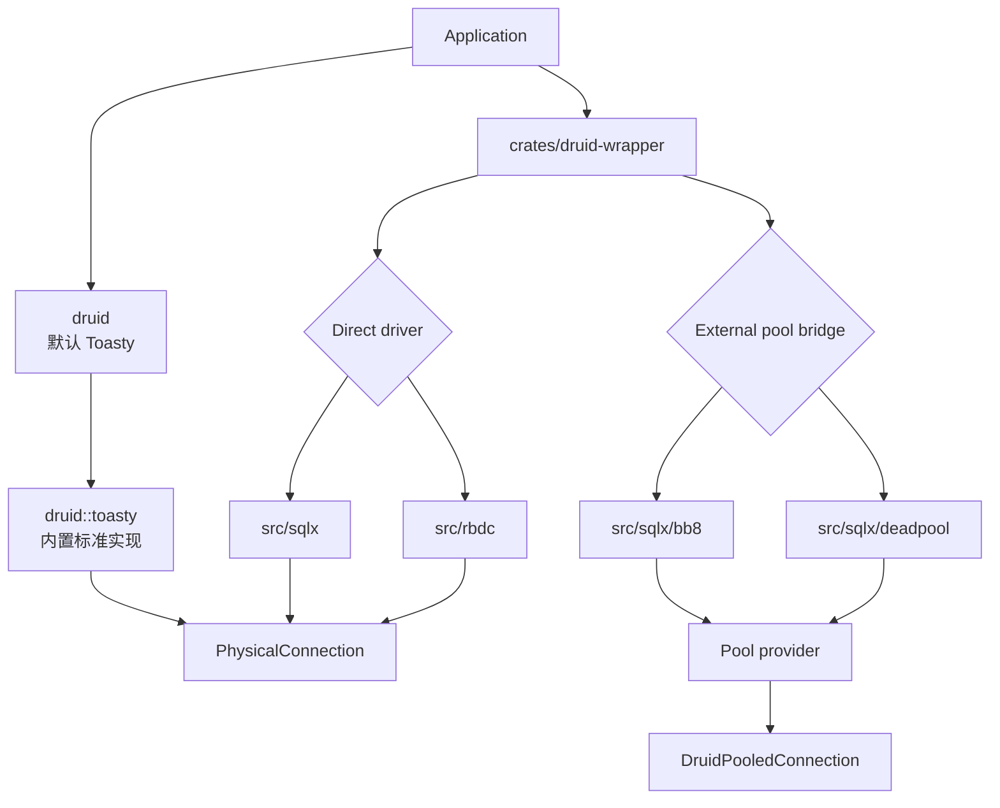
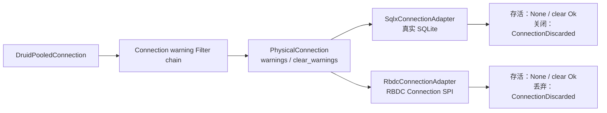
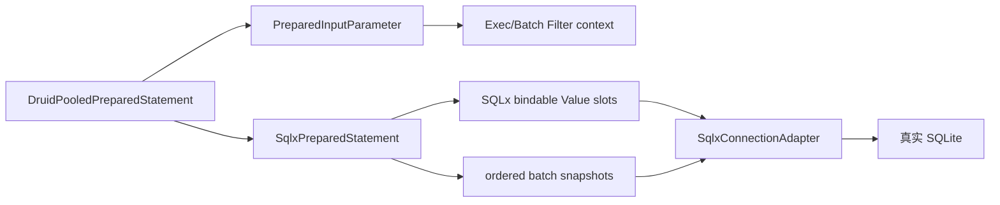

# Java `druid-wrapper` → Rust `druid-wrapper` 全量迁移路线图

> Java 基线：Druid 1.2.28 `/druid-wrapper`，13 个生产 Java 对象  
> Rust 目标：唯一 `crates/druid-wrapper` 模块，内部包含 RBDC、SQLx、bb8、deadpool
> Java SHA：`33824c3dec1612711f9bb4e409319bcab2e4cd0e`
> Rust HEAD：`08e684f583cf64a076da26373d715f6f6c231303`（审计包含当前未提交迁移工作树）
> 最后审计：2026-07-30；文档状态：PARTIAL/IMPLEMENTED_UNVERIFIED

模块账本：[对象级对照表](./对象级对照表.md) ·
[语义迁移对照表](./语义迁移对照表.md) ·
[对象名称一致性检查](./对象名称一致性检查.md) ·
[数据库驱动集成矩阵](./数据库驱动集成矩阵.md)

## 1. 模块职责

Java wrapper 通过 c3p0、DBCP/DBCP2、Proxool 的类型名和配置面把 Druid
`DataSource` 适配进其他连接池生态。Rust 对等模块负责可选数据库 Adapter 和
外部池适配；Toasty 标准实现归 `druid` 内置，不归 wrapper。direct adapter 与
external pool bridge 必须分层，禁止池中池。



## 2. 硬边界

- `SqlxConnectionAdapter`/`RbdcConnectionAdapter` 只包装一个物理连接，不持有 pool；
- `ToastyConnectionAdapter` 属于 `druid::toasty`，wrapper 不复制、不重命名；
- `SqlxBb8Pool`/`SqlxDeadpoolPool` 直接实现 `Pool`，不实现
  `PhysicalConnectionFactory`；
- 一个 lease 只归还原所有者一次；
- 公共 Druid API 不泄漏 SQLx/RBDC/bb8/deadpool具体类型；
- Java wrapper 的配置、factory、MBean 结果不能因生态不同而静默删除。

## 3. 当前状态

| 维度 | Java | Rust | 当前 |
| :--- | :--- | :--- | :--- |
| 生产对象 | 13 | Adapter 已物理归入 wrapper 内部目录；Java 对象语义仍未闭合 | PARTIAL |
| 内置标准 driver | JDBC driver connection | Toasty 0.9（归 `druid`） | SQLite 已证，多数据库 PARTIAL |
| direct driver 扩展 | JDBC DataSource wrapper | SQLx/RBDC | PARTIAL |
| external pool | c3p0/DBCP/Proxool facade | bb8/deadpool bridge | PARTIAL |
| 配置兼容 | 完整 properties | 构造器参数子集 | MISSING/PARTIAL |
| 管理统计 | MBean/properties | PoolState 子集 | PARTIAL |
| 真实 SQLite | Java wrapper 未专门限定 | SQLx direct/bb8/deadpool | 已有主链证据 |

## 4. 阶段路线

| 阶段 | 内容 | 验收 | 当前 |
| :--- | :--- | :--- | :--- |
| W0 | 物理 crate 归并为单一 `druid-wrapper` | 仅保留 wrapper 模块和内部目录 | DONE |
| W0-B | Toasty 内置、wrapper 扩展边界 | facade/类型归属/禁止 pool-in-pool | 已建立 |
| W1 | `DriverAdapter`/capability/error contract | direct adapter 统一测试 | PARTIAL |
| W2 | SQLx SQLite 完整类型/事务/prepared/metadata | 真实 SQLite + Java differential | PARTIAL/IMPLEMENTED_UNVERIFIED |
| W3 | RBDC SQLite 真实 driver | 非 mock RBDC SQLite | PARTIAL：严格 Adapter SPI 与隔离真实驱动值合同分别通过；同进程端到端受 `links=sqlite3` 冲突阻塞 |
| W4 | bb8/deadpool lease/timeout/broken/shutdown | 真实 SQLite | PARTIAL |
| W5 | Java c3p0/DBCP/DBCP2 factory/config 语义 | property fixture 差分 | TODO |
| W6 | ProxoolDataSource/Constants 配置面 | 逐字段默认值/单位/错误 | TODO |
| W7 | MBean/PoolState 协议映射 | 字段快照 | TODO |
| W8 | 多数据库 driver capability | 见数据库驱动集成矩阵 D0-D5 | PARTIAL：Toasty 全 feature D1；SQLite D3 |
| W9 | 覆盖率、文档、兼容迁移指南 | llvm-cov 100% | TODO |

### W1-R1：SQLx/RBDC SQLWarning Adapter 合同

`PhysicalConnection::warnings/clear_warnings` 已在两个 direct Adapter 中闭合：



SQLx 与 RBDC 的公开 Connection SPI 都不暴露 JDBC warning 链，因此返回
`None` 是驱动能力的精确表示，不是默认 stub；`clear_warnings` capability
同步标记为 true。SQLx 使用真实内存 SQLite 验证，RBDC 使用公开 trait fixture
验证存活、丢弃和错误边界。Druid/xerial SQLite 的 Java oracle 继续作为池化
门面语义基线。

### W2-R1：SQLx Prepared 资源 setter 与真实 SQLite batch

`SqlxPreparedStatement` 不再只是 SQL token。它在 `PhysicalPreparedStatement`
边界保存 1-based 参数槽和物理 batch 值快照；stream/reader/URL/RowId 等资源
在 setter 调用内转换，所以负长度、提前 EOF 和游标推进不会延迟到 execute。
池化层仍保存原始 `PreparedInputParameter`，Filter 不会只看到降级后的
`Value`。



`SqlxConnectionAdapter` 已覆盖 parameter-aware update/query/generic execute 与
batch；generic execute 使用真实 prepared statement metadata 判断是否产生行集，
不再把 SELECT 当作零行更新。真实 SQLite 验证：

- binary stream 与 character reader 的显式长度、setter 阶段错误和剩余游标；
- URL、RowId、Blob/Clob/NClob stream/reader；
- query、update、generic SELECT 与 ResultSet 生命周期；
- 两组 `add_bound_batch` 的顺序、物理快照和 Filter descriptor sets。

本切片只关闭 SQLx SQLite。SQLx Any/PostgreSQL/MySQL、Blob/Clob/SQLXML 对象错误
矩阵、RBDC 真实驱动和 vendor 行为仍为 `PARTIAL`。

### W2-R2：SQLx SQLite DatabaseMetaData 真实查询与能力矩阵

`SqlxDatabaseMetaData` 现在借用当前 `SqliteConnection`，不创建第二连接或内部
pool。它在 `PhysicalDatabaseMetaData` 的 173 个方法中显式覆盖 160 个：

- 从当前连接查询 SQLite product version、read-only 状态和版本门控能力；
- 按 Xerial 3.51.1.0/JDBC 可观察合同报告 identifier、SQL keyword、事务、
  grammar、result-set、最大值和其他 scalar capability；
- `getTables/getColumns/getPrimaryKeys/getIndexInfo` 使用
  `sqlite_schema`、`pragma_table_xinfo`、`pragma_index_list/info` 返回真实行；
- `getImportedKeys/getExportedKeys/getCrossReference` 使用
  `pragma_foreign_key_list`，保留规则码、约束名、主键名、1-based `KEY_SEQ`
  及历史排序；
- SQLite 不支持的 procedures、privileges、UDT、super type/table、attributes
  等查询返回带 JDBC 精确列标签的空结果集，而不是无列空数组。

未覆盖的 13 项保持显式 `UnsupportedOperation`：SQLx 不公开 driver
major/minor，JDBC major/minor 属于 JVM 合同，其余 RowId/JDBC4 查询在固定
Xerial oracle 中本来也抛 `SQLFeatureNotSupportedException`。Connection
metadata Filter 已由 core around-chain 接入；SQLx Any vendor 实现和
Java/SQLite 统一差分尚未执行，所以
本切片只能标记 `IMPLEMENTED_UNVERIFIED`。

### W8-R1：驱动类型纠正与依赖闭包

当前 Toasty PostgreSQL 的真实连接层是 `tokio-postgres`；用户列出的
`postgres-protocol` 与 `postgres-types` 是它使用的协议/类型组件，不能单独
登记为数据库驱动。MySQL、Turso、DynamoDB 分别由 `mysql_async`、`turso`、
`aws-sdk-dynamodb` 承担。DynamoDB capability 为非 SQL，不进入
`PhysicalConnection`。

2026-07-29 已执行：

```bash
cargo check -p druid --all-features --all-targets
```

SQLite/Turso/MySQL/PostgreSQL/DynamoDB feature 依赖闭包编译通过，只证明 D1。
除 SQLite 外尚无真实服务证据，状态不得提升到 D3。新增 Tiberius、Oracle、
ClickHouse、DuckDB、Firebird、ODBC/ADBC 等候选及其隔离规则见
[数据库驱动集成矩阵](./数据库驱动集成矩阵.md)。

### W3-R1：RBDC Prepared 资源参数与隔离真实 SQLite

`RbdcPreparedStatement` 已从 SQL token 升级为物理 Prepared 对象，保存 1-based
参数槽与 `addBatch` 时值快照。SQLx/RBDC 共用
`PreparedParameterMaterializer` 和 `PreparedParameterState`，但各 Adapter
仍持有自己的具名物理 statement，不以一个 `compat.rs` 冒充多个对象。

严格 RBDC SPI fixture 覆盖资源 setter 时机、错误、query/update、批次值与顺序；
隔离工程使用真实 `rbdc-sqlite 4.9.5` 内存库完成参数化 BLOB/TEXT/URL/RowId
插入和查询回读。由于主 workspace 现有 SQLx/Toasty SQLite 与
`rbdc-sqlite` 依赖不同版本且都声明 `links=sqlite3`，Cargo 不允许把两者放入同一
依赖图。因此 W3 保持 `PARTIAL`，不能把两条独立证据写成 Adapter 端到端 PASS。

后续 C2-R38 又补齐 Blob/Clob/NClob/SQLXML 对象与 `setObject` 动态分派，
包括超长、驱动读取失败、非法 UTF-16/ASCII 和 Ref/Array unsupported 的 setter
错误时序。RBDC 合同现为 8/8；全 workspace 526/526。全仓覆盖率为 Regions
86.26%、Functions 88.50%、Lines 89.38%，仍未达到 100%。

## 5. SQLite 严格合同

当前 `sqlite_wrapper_semantics_test` 从 facade 验证：

- SQLx direct 创建真实 SQLite connection；
- DDL、参数绑定、查询和类型；
- SQLWarning 初始为空、clear 成功，关闭后拒绝 warning 操作；
- SQLite CallableStatement capability 明确 unsupported；
- bb8/deadpool 真实 SQLite lease 执行并归还原外部池。

底层已有 SQLx、bb8、deadpool 真实 SQLite 测试；SQLx direct 当前 6/6，
并覆盖 warning/clear。新增聚合表达式 `COUNT(*)` 回归修复了按列声明类型误解码
的问题。

SQLite 主 workspace 不直接覆盖 RBDC 真实驱动；当前是严格 trait fixture 加隔离
真实 `rbdc-sqlite` 值合同。两者之间的单进程端到端、存储过程、XA 和 vendor
错误必须保留为未关闭门禁。

## 6. 验收命令

```bash
cargo test -p druid-wrapper --test sqlite_wrapper_semantics_test
cargo test -p druid-wrapper
cargo test --workspace
```

2026-07-29 三模块归并后实测：wrapper 的 2 个 SQLite 纵向用例、SQLx 的 5 个、
bb8 的 5 个、deadpool 的 5 个实库用例全部通过；加入 Toasty 内置标准实现后，
全 workspace 全目标 453/453 通过。
随后 W3-R1/C2-R38 验收中，SQLx direct 真实 SQLite 为 6/6，RBDC Adapter
合同为 8/8，隔离真实 `rbdc-sqlite` 预言机通过，全 workspace 为 526/526；
cargo-llvm-cov 为 Regions 86.26%（16,360/18,966）、Functions 88.50%
（2,277/2,573）、Lines 89.38%（14,281/15,977），尚未达到 100%。
这组证据不覆盖 RBDC Adapter 与真实 SQLite 的单进程端到端、Java wrapper 的 13 对象配置兼容面、
存储过程、XA 或 vendor 行为，因此模块状态仍为 `PARTIAL`。
