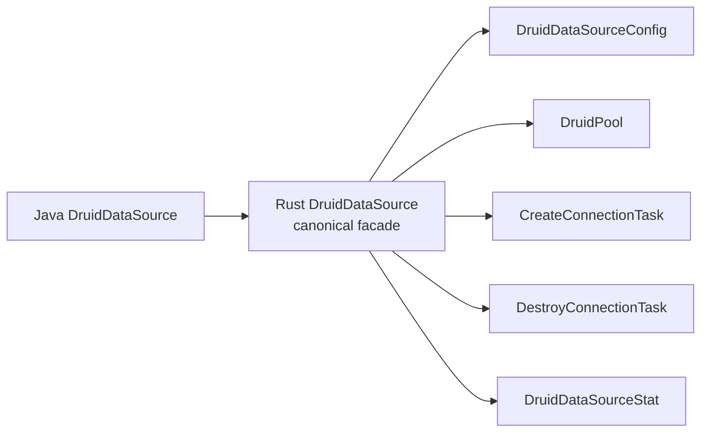

# Java Druid core → Rust `druid` 对象名称一致性检查

> 检查日期：2026-07-30
> Java baseline：`33824c3dec1612711f9bb4e409319bcab2e4cd0e`
> Rust baseline：`2c7bf3bea6f9e94f4583a85794df519c4435a425` + 当前 dirty migration worktree
> 文档状态：`PARTIAL`

## 1. 基线

| 项目 | 数值 |
| :--- | ---: |
| Java core 生产对象 | 1,644 |
| Rust `druid` 模块入口 | `crates/druid/src/lib.rs` |
| Rust 内部 core/pool/sql/stats/dynamic 源码 | 已归 `crates/druid/src/*` |
| Rust 内置 Toasty 源码 | 已归 `crates/druid/src/toasty` |
| 语义状态 | PARTIAL |

文件数不等于完成率；只有 Java 对象逐项进入对象账本并关闭方法契约才计为完成。
来源审计也不等于同名类型生成：SLF4J、Log4j、Log4j2、Commons Logging、
Logback、JMX MBean 等 JVM 专属对象只登记为 `NOT_APPLICABLE/EXCLUDED`，
不参与 Rust 名称一致性缺口、应实现对象数或完成率计算。Rust 日志 API 统一使用
`tracing`，只迁移 Druid 的事件时机、级别、字段、过滤和脱敏语义。

## 2. 命名规则

| Java | Rust |
| :--- | :--- |
| `DruidPooledConnection` | `DruidPooledConnection` / `druid_pooled_connection.rs` |
| `PreparedStatementPool` | `PreparedStatementPool` / `prepared_statement_pool.rs` |
| `SQLUtils` | `SqlUtils` / `sql_utils.rs` |
| `JDBC4ValidConnectionChecker` | `Jdbc4ValidConnectionChecker` |
| `prepareCall` | `prepare_call` |
| `maxActive` | `max_active` |

## 3. 已保留 canonical 名称

| Java 对象 | Rust | 名称 | 语义 |
| :--- | :--- | :--- | :--- |
| `DruidConnectionHolder` | 同名独立文件 | PASS | PARTIAL |
| `DruidPooledConnection` | 同名独立文件 | PASS | PARTIAL |
| `PoolableWrapper` | 同名独立文件 | PASS | DONE（对象本身的 unwrap/isWrapperFor 分支） |
| `WrapperAdapter` | 同名独立文件 | PASS | DONE |
| `PreparedStatementHolder` | 同名独立文件 | PASS | PARTIAL |
| `PreparedStatementPool` | 同名独立文件 | PASS | PARTIAL |
| `DruidPooledPreparedStatement` | 同名独立文件；同文件 `DruidPooledPreparedStatementHandle` 是 Rust 共享身份表示 | PASS | PARTIAL：48 个 JDBC setter 重载、持久参数槽、绑定执行、generic execute、有序描述符 batch、顺序多结果、generated keys、getter fatal sorter、继承 SQLWarning/Statement 属性、五属性关闭恢复、共享 ResultSet trace 与 Prepared 动态身份已落；canonical query 直接包装物理 ResultSet；Toasty/SQLx SQLite 资源执行与 RBDC 严格 SPI 已接，多数据库待补 |
| `PreparedInputParameter` | Rust 支撑对象；独立 `prepared_input_parameter.rs` | PASS | 不冒充 Java 对象；集中表达 Java setter overload 的输入联合类型；`RustValue` 明确标识原 Rust 显式 batch 扩展 |
| `ToastyPreparedStatement` | Toasty 平台 Adapter 对象；独立 `toasty_prepared_statement.rs` | PASS | 不冒充 Druid Java 对象；填补 Toasty raw SQL 没有独立 PreparedStatement 参数槽的差异，在物理 setter 时点物化并保存驱动值 |
| `DruidPooledCallableStatement` | 同名独立文件；同文件 `DruidPooledCallableStatementHandle` 表示 ResultSet 返回的同一共享对象 | PASS | Java 本类 116 个公开声明及继承结果入口均可追踪；callable/Prepared/raw unwrap、强生命周期和关闭级联已验证；真实存储过程 driver 证据仍是 PARTIAL |
| `DruidPooledStatement` | 同名独立文件 | PASS | PARTIAL：canonical 对象、三种创建入口、query/update、JDBC `int[]` batch/部分失败、四种 execute、顺序多结果、generated keys、SQLWarning、属性/close/unwrap 与 ResultSet trace 已落；SQLx/RBDC Connection warning Adapter 已闭合，原生多结果待补 |
| `DruidPooledResultSet` | 同名独立文件 | PASS | PARTIAL：完整 getter/update/metadata/Wrapper 基础上，next/close/warning、18 个标量 getter、16 个 decimal/temporal getter、六个 plain/map/typed object、26 个 stream/resource getter、26 个 navigation/property 调用、两条 NString、getMetaData、getStatement、七个 row-mutation、28 个基础列 update setter、四个 `updateObject` 重载、14 个资源对象 setter、12 个 LOB stream/Reader setter、22 个 ASCII/Binary/Character/NCharacter stream setter及两个 NString setter 同步 Filter around-chain；`ResultSetStatement` 保留普通/Prepared/Callable 动态身份，row-mutation、基础/object/resource/LOB/stream/NString setter 保留默认末端、全方法短路、参数身份、共享游标、错误分类和 capability error，`JdbcOpaqueObject` 可恢复 vendor 具体对象；`is_closed_with_connection` 与内部 `is_closed` 职责分离；StatFilter、custom typed object 单次物理读取、默认 SPI 精确能力错误及 185 个 ResultSet 精确委托已验证，ResultSet update setter Filter 子域已闭合；Statement/PreparedStatement canonical query 保留同一物理 ResultSet，SQLx SQLite 与 RBDC SPI driver label 已测；Toasty eager/raw SQL alias 缺失、RBDC 空结果 descriptor、嵌套 ResultSet/Clob object 自动代理、SQL read length、custom conversion、streaming 与多数据库待补 |
| `FilterAdapter` | 同名独立 `filter_adapter.rs` | PASS | PARTIAL：Java 491 个公开方法；生命周期/属性配置默认空语义、精确自身 Wrapper、SQL before/after 与当前 185 个 ResultSet hook 默认继续链已由三账本和真实 Toasty SQLite 验证；未迁移调用族不能因对象文件存在而计作完成 |
| `FilterEventAdapter` | 同名独立 `filter_event_adapter.rs` | PASS | PARTIAL：物理 connect 已进入直接/后台 creator 并保留真实 ID、正向 before 与反向 after；dataSource get 已为有位置 around-chain；当前调用链可承载的 create/prepare/call、execute/query/update/batch、error 与 ResultSet open 已迁移；`FilterEventListener` 是 Rust 对 protected override 的组合式承载，不冒充额外 Java 对象。StatementProxy/具体 DataSource 身份、downstream-before 局部错误展开及完整 Java 错误矩阵仍开放 |
| `FilterManager` | 同名独立 `filter_manager.rs` | PASS | PARTIAL：Java bundled alias、properties 后者覆盖、UTF-16 名称边界、加载/缺失/构造失败及类名去重已迁移；显式工厂、Factory `setFilters` 与 inventory AutoLoad 已装配。JVM 自动 ClassLoader 扫描及未迁移 alias 行为保持开放 |
| `WallConfig` | 同名独立文件 | PASS | PARTIAL/IMPLEMENTED_UNVERIFIED：updateCheckColumns、动态 handler 与 doPrivilegedAllow 已接；完整 Java 字段/规则仍开放 |
| `StatFilter` | 同名独立文件 | PASS | PARTIAL：SQL execute/update、普通与 PreparedStatement generic execute、普通与 PreparedStatement batch、活动事务 commit/rollback、ResultSet、pool get/release 与真实 physical connect/close 已接；LOB 与统一差分待补 |

## 4. 需要 canonical facade/迁名

| Java 对象 | 当前 Rust | 问题 | 目标 |
| :--- | :--- | :--- | :--- |
| Java `/core` artifact | 唯一 `druid` crate | PASS | 已归并到 `crates/druid/src/*` |
| `DruidDataSource` | `DruidDataSource` facade + `DruidPool` engine | canonical 名称和文件已建立；fatal 状态与 resetStatEnable/resetCount 仍由同一 datasource engine 持有，没有拆出伪 Java 对象 | 继续关闭 `restart(Properties)`、完整字段、XA 与统一证据 |
| `DruidAbstractDataSource` | `PoolConfig`/`PoolInnerConfig`/`DruidPoolBuilder` | 有规划的 SPLIT；配置运行主链已建立 | 继续补剩余字段并保持映射表 |
| `JdbcSqlStat` | `MergedSqlStat` | 名称丢失 | canonical `JdbcSqlStat` |
| `JdbcDataSourceStat` | `JdbcDataSourceStat` / `jdbc_data_source_stat.rs`；`StatsCollector` 是兼容 type alias | canonical 对象已恢复；分层字段仍 PARTIAL | 继续关闭完整字段和统一差分，最终删除误导性 alias |
| `HighAvailableDataSource` | `dynamic/high_available_data_source.rs` / `HighAvailableDataSource` | canonical 名称与基本 HA facade 已恢复；PARTIAL/IMPLEMENTED_UNVERIFIED | 继续补 node/update/recovery/close |
| `SQLUtils` | 无 | 公共入口缺失 | `SqlUtils` |
| `DbType` | `sql/db_type.rs` / `DbType` | canonical 名称已恢复；语义为 PARTIAL/IMPLEMENTED_UNVERIFIED | 全枚举 Java 差分后升级；log4jdbc 明确 NOT_APPLICABLE |

## 5. Rust 平台适配名称

这些对象允许没有 Java Druid 同名对象，但必须登记来源：

| Rust 对象 | 来源 | 判断 |
| :--- | :--- | :--- |
| `PhysicalConnection` | `java.sql.Connection` | 合法内部 SPI |
| `DruidError::BatchUpdateException` | `java.sql.BatchUpdateException` | 合法平台错误映射；保留部分 `int[]` 与原始 cause，不冒充 Druid 自有对象 |
| `PhysicalStatement` | `java.sql.Statement` | 合法内部 SPI；属性/批次/生命周期与 SQL 执行连接职责分离 |
| `PhysicalResultSet`/`RowSetResultSet` | `java.sql.ResultSet` | 合法内部 SPI 与 eager Adapter；canonical Statement/PreparedStatement 必须持有 `Arc<dyn PhysicalResultSet>`，不得用 `Vec<Row>` 冒充完整 ResultSet；未支持的方法保留逐方法精确 operation，typed object 保持一次底层读取和底层错误优先级；plain/map/typed object 及 String/Boolean/Long/Int/Short/Byte/Double/Float/Bytes 均保留 index/label 独立物理重载 |
| `ResultSetUpdate` | `java.sql.ResultSet#updateXxx` 重载族 | 合法 Rust 平台描述符；独立文件保留 setter 类型、null、流句柄及 int/long/未指定长度身份，不计作 Java 对象迁移数 |
| `ResultSetMetaData` | `java.sql.ResultSetMetaData` | canonical 双后端平台对象；Java 标准 getter、physical 逐调用错误时机及 Wrapper 身份已闭合，真实 driver descriptor 供给另行验收 |
| `ResultSetStatement` | `java.sql.ResultSet#getStatement()` 返回的 `Statement` 动态对象 | 合法 ADAPTER；独立文件中的三分支拥有型共享句柄，保留普通/Prepared/Callable 身份及同一生命周期，不冒充新的 Java 对象 |
| `PhysicalResultSetMetaData` | `java.sql.ResultSetMetaData` driver 实例 | 合法内部 SPI；独立文件保存真实 metadata 对象身份，每个 getter 必须逐次委托，不得 eager snapshot |
| `ResultSetColumnMeta`/`ResultSetColumnType`/`ResultSetNullability` | `ResultSetMetaData` 单列返回字段与 `java.sql.Types`/可空常量 | 合法独立 Rust descriptor；不得把 unknown nullability 压成 bool，也不得猜 schema/table/catalog |
| `PhysicalPreparedStatement` | `java.sql.PreparedStatement` | 合法内部 SPI |
| `PhysicalCallableStatement` | `java.sql.CallableStatement` | 合法内部 SPI |
| `ToastyConnectionFactory` | Toasty `Driver` | 合法内置标准实现；每次创建 raw connection，不持有 Toasty pool |
| `ToastyConnectionAdapter` | Toasty `Connection` | 合法内置 Adapter；源码必须位于 `druid::toasty` 并随 `druid` 发布 |
| `CallableInputParameter` | `CallableStatement` 命名 setter 重载 | 合法内部 SPI；保留 setter 身份及 sqlType/typeName/scale |
| `JdbcObject`（兼容 alias `CallableOutputValue`） | JDBC `getObject/updateObject` 通用值域 | canonical 平台对象；保留标量、Decimal、日期时间、资源与 vendor custom 身份，不再以 Callable 专属名称定义实现 |
| `JdbcTargetType`（兼容 alias `CallableTargetType`） | JDBC typed `getObject(..., Class<T>)` | canonical 平台目标类型；保留标准目标与 vendor 类名 |
| `JdbcTypeMap`（兼容 alias `CallableTypeMap`） | JDBC `Map<String, Class<?>>` | canonical 平台类型映射；ResultSet/Callable/Array/Ref 共用 |
| `JdbcOpaqueObject`/`PhysicalJdbcOpaqueObject` | JDBC vendor custom `Object` | 合法平台 Adapter；保留 `Arc` 引用身份、类名和受控 downcast |
| `JdbcCalendar`/`JdbcCalendarArgument`（兼容别名 `CallableCalendar*`） | `java.util.Calendar` 日期时间重载 | 合法 canonical 内部 SPI；保留时区和重载/null 身份，Callable 与 ResultSet 共用 |
| `JdbcBlob`/`PhysicalBlob` | `java.sql.Blob` | 合法平台 Adapter；11 个 JDBC 操作，不计入 Druid 对象分母 |
| `JdbcClob`/`PhysicalClob` | `java.sql.Clob` | 合法平台 Adapter；13 个 JDBC 操作，不计入 Druid 对象分母 |
| `JdbcNClob`/`PhysicalNClob` | `java.sql.NClob` | 合法平台 Adapter；保留 `NClob extends Clob` 身份 |
| `JavaString` | `java.lang.String` | 合法平台值对象；用 UTF-16 code unit 无损保留 surrogate |
| `JdbcReader`/`JdbcWriter` | `java.io.Reader/Writer` | 合法平台 Adapter；共享游标/关闭状态，不静默物化 |
| `JdbcInputStream`/`JdbcOutputStream` | `java.io.InputStream/OutputStream` | 合法平台 Adapter；共享游标/关闭状态，不得用 Vec 代替资源句柄 |
| `SqlxConnectionAdapter` | Rust SQLx 生态 | 归 `druid-wrapper`，可选扩展 |
| `RbdcConnectionAdapter` | Rust RBDC 生态 | 归 `druid-wrapper`，可选扩展 |

名称和归属结论：`Toasty*` 是 Rust 平台标准实现名称，不冒充 Java Druid 对象；
`Sqlx*`/`Rbdc*` 是扩展名称。三者都只能实现 `PhysicalConnection` 边界，不能
取代 `DruidPooledConnection`。

模块名称结论：这里只允许 `druid`、`druid-admin`、`druid-wrapper` 三个产品
模块。`druid-core`、`druid-pool`、`druid-toasty` 等名称只能标注历史归并来源，
不能出现在最终公共包名、发布清单或完成度统计中。

## 6. 方法名称检查

| Java 方法 | Rust canonical | 当前 |
| :--- | :--- | :--- |
| `getConnection()` | `get_connection().await` | facade 待补；engine 有 `get()` |
| `prepareStatement(...)` | `prepare_statement*().await` | PARTIAL |
| `prepareCall(...)` | `prepare_call*().await` | PARTIAL |
| `createStatement(...)` | `create_statement*().await` | PARTIAL：三个创建重载及查询 ResultSet trace 已迁移，Statement 剩余多结果/generated keys 待补 |
| `next()/previous()/close()` | `DruidPooledResultSet::next/previous/close_with_connection` | PARTIAL：next/close 的 Filter position 游标、短路、错误展开、成功计数、fetch peak、显式/Statement 级联关闭已一致；previous Filter 待接 |
| `getObject(int/String, Class<T>)` | `object_typed/object_typed_by_label` + `JdbcTargetType` | 已下沉真实 SPI；SQLite 标量 index conversion、资源分派、custom unsupported 与 index/label 目标身份已验证；Toasty 真实 label metadata 待补 |
| `getObject(int/String, Map<String,Class<?>>)` | `object_with_type_map/object_by_label_with_type_map` | index/label 与可空 Map 原样委托，参数身份及真实 SQLite unsupported/异常计数已闭合 |
| `getString/getBoolean/getByte/getShort/getInt/getLong/getFloat/getDouble/getBytes` | 同语义 snake_case API | PARTIAL：index/label 基础族已落；LOB/Array/Ref 等方法族待补 |
| `getAsciiStream/getUnicodeStream/getBinaryStream/getCharacterStream/getNCharacterStream` | 同语义 snake_case API | index/label getter 已落，eager Adapter 返回共享状态资源句柄；ASCII/Binary/Character/NCharacter update 的无长度/int/long 合法重载已闭合 |
| `Connection/Statement/PreparedStatement/ResultSet#getWarnings/clearWarnings` | 各池化 facade 的 `warnings/clear_warnings` | 四类对象均已落结构化 warning 与可改写/短路的 Filter around-chain；Connection getter 不进 sorter、clear 进入 sorter 的非对称时机已验证；Toasty/SQLx SQLite 与 RBDC 公开 SPI Adapter 已闭合 |
| `ResultSet#getCursorName/getMetaData` | `cursor_name/meta_data` | 已落完整 JDBC metadata getter、physical 逐调用错误时机及 Wrapper 身份；Toasty 真实 driver label/origin/type descriptor 供给待补 |
| `getRef/getBlob/getClob/getArray/getURL/getRowId/getNClob/getSQLXML(int/String)` | `reference/blob/clob/array/url/row_id/n_clob/sql_xml` + `*_by_label` | 16 个重载名称与 index/label 身份已闭合；真实 SQLite 明确 unsupported |
| `updateObject(int/String,Object[,scaleOrLength])` | `update_object*` / `update_object_by_label*` | 四重载名称和参数维度独立保留；Filter 可观察 plain/scaleOrLength 与 index/label，SQL NULL、负 scale 和 `JdbcOpaqueObject` vendor 具体身份已验证 |
| `updateRef/updateBlob/updateClob/updateArray/updateRowId/updateNClob/updateSQLXML(int/String,对象)` | `update_*` + `update_*_by_label` | 14 个对象型重载、Java null、RowId 值和精确 FilterChain 名称均已闭合；链内拥有型资源 Clone 保持共享物理句柄，末端才转回借用 |
| `updateBlob(InputStream)`、`updateClob/updateNClob(Reader)` | `update_*_stream/reader*` | index/label、无长度/long 长度共 12 重载名称一一对应；四层 Filter 精确入口已闭合，拥有型 Clone 共享游标/关闭状态，默认链不预读，原始 long 不校正 |
| `setNull(String,int[,String])` | `set_named_null*` | 名称/参数已一致；真实 driver 未验证 |
| `setObject(String,Object[,int[,int]])` | `set_named_object*` | 三重载元数据已保留；真实 driver 未验证 |
| `getByte/getShort/getFloat(int/String)` | `get_byte/get_short/get_float` 与 `get_named_*` | 已落物理 SPI；真实 driver 未验证 |
| `set/get BigDecimal` | `set_named_big_decimal` / `get_*_big_decimal*` | Callable setter/getter 与 ResultSet 四重载保留强类型及 scale；Toasty/SQLx/RBDC SQLite 边界已验证 |
| `set/get Date/Time/Timestamp(...[,Calendar])` | 同名 snake_case API + `JdbcCalendarArgument` | Calendar 三态及纳秒时间已保留；ResultSet 12 个重载的 raw SPI 参数身份和三个 Adapter 边界已验证 |
| `getClob/getNClob(int/String)` | `get_clob/get_named_clob/get_n_clob/get_named_n_clob` | 名称和 index/name 重载一致；资源 SPI 已测，真实 callable driver 未验证 |
| `setClob/setNClob(String,对象/Reader[,long])` | `set_named_clob*` / `set_named_n_clob*` | 对象、null、Reader 和长度重载身份已保留 |
| `get/setCharacterStream`、`get/setNCharacterStream` | 同语义 snake_case API | `Reader` 资源及 `int/long/unspecified` 长度重载已保留 |
| `recycle()` | `close().await` / `recycle()` | PARTIAL |
| `shrink(...)` | `shrink().await` / `shrink_check_time(bool).await` / `shrink_with_options(bool, bool).await` | PARTIAL/IMPLEMENTED_UNVERIFIED |
| `removeAbandoned()` | `remove_abandoned()` | IMPLEMENTED_UNVERIFIED：同步扫描 weak active lease、running 跳过与超时失效 |

名称检查通过不代表语义完成；本模块仍未达到 1,644/1,644。

<!-- GLOBAL_NAMING_LEDGER_MERGE_START -->
## 归并自原全局名称总账的详细审计

> 本节承接原全局名称总账中属于 Java `/core` 和 Rust `druid` 的 canonical、MERGE、SPLIT、ADAPTER 与方法命名记录。

#### 4. 当前 canonical 名称审计

##### 4.1 名称已保留但语义仍需验收

| Java 对象 | 当前 Rust 类型/文件 | 名称 | 语义状态 |
| :--- | :--- | :--- | :--- |
| `WallConfig` | `WallConfig` / `wall_config.rs` | 通过 | PARTIAL |
| `StatFilter` | `StatFilter` / `stat_filter.rs` | 通过 | PARTIAL：本轮已接 SQL/活动事务全局事件，完整对象族仍开放 |
| `ExceptionSorter` | `ExceptionSorter` / `exception_sorter.rs` | 通过 | PARTIAL |
| `MySqlExceptionSorter` | `MySqlExceptionSorter` / `my_sql_exception_sorter.rs` | 通过 | DONE |
| `PGExceptionSorter` | `PgExceptionSorter` / `pg_exception_sorter.rs` | Rust acronym 惯例映射通过 | DONE |
| `NullExceptionSorter` | `NullExceptionSorter` / `null_exception_sorter.rs` | 通过 | DONE |
| `DB2ExceptionSorter` | `Db2ExceptionSorter` / `db2_exception_sorter.rs` | Rust acronym 惯例映射通过 | DONE |
| `InformixExceptionSorter` | `InformixExceptionSorter` / `informix_exception_sorter.rs` | 通过 | DONE |
| `SybaseExceptionSorter` | `SybaseExceptionSorter` / `sybase_exception_sorter.rs` | 通过 | DONE |
| `AbstractOracleExceptionSorter` | `AbstractOracleExceptionSorter` / `abstract_oracle_exception_sorter.rs` | 抽象继承按状态组合映射，名称通过 | DONE |
| `OracleExceptionSorter` | `OracleExceptionSorter` / `oracle_exception_sorter.rs` | 通过 | DONE |
| `OceanBaseOracleExceptionSorter` | `OceanBaseOracleExceptionSorter` / `ocean_base_oracle_exception_sorter.rs` | 通过 | DONE |
| `PhoenixExceptionSorter` | `PhoenixExceptionSorter` / `phoenix_exception_sorter.rs` | 通过 | DONE |
| `MockExceptionSorter` | `MockExceptionSorter` / `mock_exception_sorter.rs` | 通过 | DONE |
| `ValidConnectionChecker` | `ValidConnectionChecker` / `valid_connection_checker.rs` | 通过 | PARTIAL |
| `[Rust internal] PhysicalConnectionFactory` | `PhysicalConnectionFactory` / `physical_connection_factory.rs` | canonical 名称已收敛；旧 `ConnectionFactory` 仅兼容重导出 | 通过；只表达 raw driver create/validate/close，`create_info_with_properties` 接单次最终属性；不迁移 JDBC DriverManager，deprecated alias 待 C8 删除 |
| `DruidConnectionHolder` | `DruidConnectionHolder` / `druid_connection_holder.rs` | 通过；旧 `ConnectionHolder` 仅兼容重导出 | PARTIAL：PS cache 主链已落地；listener/trace、连接变量和运行时密码版本失效待补 |
| `PreparedStatementHolder` | `PreparedStatementHolder` / `prepared_statement_holder.rs` | 通过 | PARTIAL：字段/计数迁移完成，Oracle 驱动行为待补 |
| `PreparedStatementPool` | `PreparedStatementPool` / `prepared_statement_pool.rs` | 通过 | PARTIAL：LRU/容量/share/清理/统计完成，Oracle/listener/trace 待补 |
| `DruidPooledPreparedStatement` | `DruidPooledPreparedStatement` + `DruidPooledPreparedStatementHandle` / `druid_pooled_prepared_statement.rs` | 通过；handle 是同一 Java 对象的 Rust 共享身份，不计独立 Java 对象 | PARTIAL：缓存、48 个 setter 重载与参数状态、绑定执行、有序描述符 batch、generic execute、多结果/generated keys/getter sorter、继承属性及关闭恢复、共享 result-set trace 与 Prepared 动态身份完成；Toasty SQLite 资源主链完成，SQLx/RBDC 资源与原生多数据库 generic/batch 待补 |
| `DruidPooledCallableStatement` | `DruidPooledCallableStatement` + 同文件共享身份 handle / `druid_pooled_callable_statement.rs` | 通过 | 本类 115 个 Java 方法及继承结果入口均可追踪；ResultSet trace 可恢复 callable 具体身份；真实存储过程 Adapter 仍为 PARTIAL |
| `PoolConfig` | `PoolConfig` / `config.rs` | Rust 内部名 | PARTIAL |

名称合格不代表迁移完成。例如 `WallConfig` 有约 46 个字段，但当前规则引擎只读取其中一部分。

##### 4.2 当前应迁名或增加 canonical facade

| Java canonical 对象 | 当前 Rust 对象 | 问题 | 目标 |
| :--- | :--- | :--- | :--- |
| `DruidDataSource` | `DruidDataSource` + 内部 `DruidPool` | canonical 对外身份已恢复 | facade 保持唯一对外数据源对象 |
| `DruidAbstractDataSource` | `PoolConfig`、`PoolInnerConfig`、`DruidPoolBuilder` | 有规划的配置职责拆分，字段映射仍 PARTIAL | 用四表保持 Java 字段/默认值/运行读取一一可追踪 |
| `DruidPooledConnection` | `DruidPooledConnection`；`PooledConnection` 仅兼容重导出 | 名称已合并；回收、statement/schema 与 fatal 数据源回调主序列已接，统一差分仍待补 | 保持唯一 canonical 实现 |
| `—（JDBC 平台能力）` | `PhysicalConnection`；`Connection` 仅兼容重导出 | 对外/对内身份已拆开 | 保持内部最小 SPI |
| `—（物理创建能力）` | `PhysicalConnectionFactory`；`ConnectionFactory` 仅兼容重导出 | native factory 与 external pool 已拆开 | C8 删除旧 alias |
| `—（DataSource 来源职责）` | core `Pool`；实现为 `DruidPool` / `SqlxBb8Pool` / `SqlxDeadpoolPool` | canonical `DruidDataSource` facade 与 external provider 类型边界已建立 | facade 配置只选择一个 `Pool` |
| `—（close/recycle 所有权）` | `DruidPooledConnection` 内部三参数 `FnOnce` + `ConnectionRecycleDisposition`；native 脏 Drop 进入 `ConnectionCloseWorker`；external 使用 `PhysicalConnectionLease` | exactly-once、显式回收、fatal 即时 discard 和 native 受监管销毁已建立 | P2 继续补 external shutdown 与统一差分 |
| `DruidDataSource#handleFatalError` 内部协作 | crate-private `FatalErrorHandler` / `fatal_error_handler.rs` | RUST_SUPPORT/PROTOCOL：只解除 core→pool 反向依赖，不形成公开类型或额外数据源对象；状态仍在 `PoolInner` | 保持 crate-private，文档计入 DruidDataSource 语义而非 Java 对象分母 |
| `WallProvider` | `Wall` | Provider 生命周期/cache/SPI 不可见 | `WallProvider` facade，`WallEngine` 内部 |
| `WallCheckResult` | `Result<Vec<WallViolation>, _>` | 结果对象字段丢失 | `WallCheckResult` |
| `JdbcSqlStat` | `MergedSqlStat` | 名称只表达 merge，丢失统计对象身份 | `JdbcSqlStat`；merger 内部化 |
| `JdbcDataSourceStat` | `JdbcDataSourceStat`；`StatsCollector` 仅兼容 alias | 已拆出 canonical 对象并组合 Connection/Statement/ResultSet/SQL 统计 | C8 删除旧 alias |
| `HighAvailableDataSource` | 同名 canonical facade；`DynamicDataSource` 仅 Rust 读写分离扩展 | 已纠正，不再由 ArcSwap facade 冒充 Java HA；PARTIAL/IMPLEMENTED_UNVERIFIED | File node/update/close 已接；ZooKeeper 与最终差分仍缺 |
| `DataSourceSelector` | `dynamic/selector/data_source_selector.rs` / 同名 trait；`LoadBalancer` 仅 Rust 扩展 | 已纠正；PARTIAL | validate/recover 生命周期 |
| `RandomDataSourceSelector` | `dynamic/selector/random_data_source_selector.rs` / 同名对象；`RandomBalancer` 仅 Rust 扩展 | 已纠正；PARTIAL | 后台验证与恢复 |
| `StatementExecuteType` | `core/statement_execute_type.rs` / `StatementExecuteType` | MATCH/IMPLEMENTED_UNVERIFIED | 已纠正旧 `StatementType` 误映射；后者是另一种对象分类语义 |
| `PoolableWrapper` | `PoolableWrapper` / `poolable_wrapper.rs` | 已纠正：不再与平台 `Wrapper` trait 混为一个对象 | 保持独立 canonical 对象；生产 Proxy 对象另行迁移 |
| `SQLUtils` | 无 | 公共兼容入口缺失 | `SqlUtils` |
| `DbType` | `DbType` / `db_type.rs` | PASS：对象名与独立文件一致 | 严格解析/mask/hash 已落；全枚举差分待最终阶段 |
| `JdbcUtils` | `JdbcUtils` / `jdbc_utils.rs` | PASS：canonical 对象与独立文件已存在 | Java JDBC 兼容入口与 Rust infer 入口已分名；对象语义仍 PARTIAL，便捷执行/DDL/统一差分待补 |

##### 4.3 曾被旧文档误标、现按当前源码持续复核的对象

| 对象 | 应有文件 | 当前 |
| :--- | :--- | :--- |
| `FilterChainImpl` | `core/filter_chain_impl.rs` / `FilterChainImpl` | MATCH/PARTIAL：canonical 对象已存在；已迁移调用族进入同一实现，Java 全方法面仍开放 |
| `AutoLoad` | `core/auto_load.rs` / `AutoLoad` | MATCH/PROTOCOL/IMPLEMENTED_UNVERIFIED：名称与 `value()` 保留；Java annotation/ServiceLoader 映射为 inventory 元数据，不制造注解伪类型 |
| `StatFilterMBean` | `stats/stat_filter.rs` 的管理方法 | MERGED/PROTOCOL/IMPLEMENTED_UNVERIFIED：Rust 无 JMX；有效属性/操作合并进 `StatFilter`，不制造 MBean marker trait |
| `StatFilterContextListenerAdapter` | `stat_filter_context_listener_adapter.rs` | PASS；独立具体对象显式实现 14 个 Java 空回调，未由 Listener trait 冒充 |
| `FilterManager` | `filter_manager.rs` | PASS/PARTIAL；独立对象、Java 资源、Factory setFilters/config 生命周期与 inventory AutoLoad 已接；跨 crate provider 和完整 alias 行为待验证 |
| `WallFilter` | `sql/wall_filter.rs` | MATCH/PARTIAL：独立对象和 FilterManager 生产装配已存在；tenant SELECT/UPDATE/INSERT 改写、普通/addBatch/prepare 物理接线、ResultSet metadata/隐藏列/next 回调、Connection metadata 与 privileged 绕过已接，完整 hook/规则未闭合 |
| `DruidDataSourceStatValue` | `stats/druid_data_source_stat_value.rs` | MATCH/PARTIAL/IMPLEMENTED_UNVERIFIED：独立不可变对象已接入真实池/执行/事务/等待/PS/SQL 区间来源；query/login timeout、SQL 容量淘汰 skip，以及 ResultSet/Callable 直接和适用 `getObject` 间接 Blob/Clob/NClob 路径已进入生产统计；最终并发差分仍开放 |
| `JdbcSqlStatValue` | `stats/jdbc_sql_stat_value.rs` | MATCH/PARTIAL：核心管理字段已实现，Java 完整字段未闭合 |
| `DruidStatService` | `stats/druid_stat_service.rs` | MATCH/PARTIAL：核心 JSON 路由、Java query/exact-prefix 分派、typed MapComparator/分页和 SQL detail 已实现；reset-all 与 log-and-reset 已分离，basic 的 Java 兼容 null 键、Rust runtime 字段及已注册数据源 driver labels 已明确；locale/schema/非法分页、未实例化驱动/web/spring 分支未闭合 |
| `DruidDataSourceStatManager` | `stats/druid_data_source_stat_manager.rs` | MATCH/PARTIAL：显式注册表、逐数据源 reset 和 manager 独立 resetCount 已实现，JMX/OpenType 为宿主替换边界 |
| `StatViewServlet` 的协议替代 | `stat_view_router.rs` | MISSING |
| `EvictionRunner`/维护任务 | 对应明确 Java 任务对象的文件 | MISSING |
| `LeakDetector` | `leak_detector.rs` | MISSING |

不存在的文件或类型必须标 `MISSING`，不能用路线图中的目标路径标 `DONE`。

#### 5. 非一对一名称登记

##### 5.1 MERGE

```text
Java FQCN A ─┐
Java FQCN B ─┼─> RustType::VariantA / VariantB
Java FQCN C ─┘
```

要求：

- 每个源对象有稳定对象 ID；
- variant 名尽量保留 canonical token；
- 每个 variant 有独立 doc 注释和差分用例；
- 合并后的 Rust 文件不能同时定义无关 Java 对象。

适合的例子是多个 violation 实现合并为 `WallViolation` enum，不适合把所有 vendor checker 堆进一个文件。

##### 5.2 SPLIT



要求 facade 保留源对象的公开行为，内部对象使用 Rust 风格名称并注明承载的 Java 方法。

##### 5.3 ADAPTER/PROTOCOL

Java API 名称可以不直接暴露，但登记必须包含三层：

| 层 | 示例 |
| :--- | :--- |
| 源对象 | `StatViewServlet` |
| Rust 协议对象 | `StatViewRouter` |
| 等价结果 | 路由、JSON、静态资源、登录、allow/deny IP、reset |

仅写“JMX → metrics”“Spring → config”“JDBC → sqlx”不合格，因为这没有说明属性、动作和错误如何对应。

#### 6. 当前 Rust-only 名称检查

| Rust 对象 | 来源 | 是否允许 | 约束 |
| :--- | :--- | :--- | :--- |
| `DruidPool`、`PoolInner` | `DruidDataSource` 内部调度 | 允许 | 不替代 canonical facade |
| `PoolConfigBuilder`、`DruidPoolBuilder` | datasource setters/factory | 允许但需去重 | 字段契约唯一来源 |
| `PhysicalConnection` | JDBC 平台连接能力 | 允许且要求迁名 | 内部最小 SPI，不与 `DruidPooledConnection` 竞争公开身份 |
| `PhysicalCallableStatement` | JDBC CallableStatement 平台能力 | 允许 | 最小驱动句柄 SPI；不支持能力必须显式报错 |
| `CallableInputParameter`、`JdbcObject`（兼容 alias `CallableOutputValue`）、`JdbcCalendar`（兼容 alias `CallableCalendar`）、`CallableParameter`、`CallableOutParameter` | CallableStatement 参数/返回值重载 | 允许 | canonical 通用平台对象使用 `Jdbc*` 名称；保留 setter/返回类型、Calendar、index/name/sqlType/scale/typeName/LOB/Reader 精确长度，不冒充 Druid 对象 |
| `JdbcBlob`、`PhysicalBlob`、`JdbcInputStream`、`JdbcOutputStream` | JDBC Blob / Java IO 平台资源 | 允许 | 完整资源句柄 SPI，不冒充 Druid `BlobProxy`，不静默物化 |
| `JdbcClob`、`PhysicalClob`、`JdbcNClob`、`PhysicalNClob` | JDBC Clob/NClob 平台资源 | 允许 | Clob 13 方法、NClob 继承身份；不冒充 Druid Proxy |
| `JdbcReader`、`JdbcWriter`、`JavaString` | Java Reader/Writer/String 平台资源 | 允许 | UTF-16 无损边界与共享资源生命周期 |
| `PhysicalConnectionFactory` | driver 创建能力 | 允许且要求迁名 | 只创建 raw connection，不从外部 pool acquire |
| `ConnectionProvider` | datasource acquire 来源选择 | 允许 | native/bridge 单选，返回统一 lease |
| `ConnectionLease`、`LeaseReturner` | close/recycle 所有权 | 允许 | exactly-once return，失败可监控 |
| `ConnectionDefaults` | `DruidConnectionHolder` 默认状态字段和 `reset()` | 允许 | 已作为 canonical holder 的内部值对象；不能替代 PS cache 等剩余职责 |
| `ConnectionRecycleDisposition` | `DruidDataSource.recycle` 的最终分支 | 允许 | 仅承载 reusable/discard/recycle-error 处置 |
| `ToastyConnectionFactory`、`ToastyConnectionAdapter` | Rust 内置标准数据源 | 允许 | 已归 `druid::toasty`；不冒充 Java 对象，不持有 Toasty pool |
| `ExecContext` | Proxy/Filter 参数集合 | 允许 | 不得丢参数、数据源、时间、fingerprint |
| `BeforeFilter`、`AfterFilter`、`ExtendedFilter` | `Filter` 拆分 | 允许 | hook 覆盖率 100% |
| `SqlMerger`、`ParameterizedSql` | parameterized visitor/stat key | 允许 | P4 后基于兼容 AST |
| `DataSourceGroup`、`SqlHint` | HA/selector | 允许 | 绑定具体 Java 对象与契约 |

#### 7. 方法名称与语义一致性

| Java 方法 | Rust canonical 方法 | 当前判断 |
| :--- | :--- | :--- |
| `init()` | `init().await` | PARTIAL/IMPLEMENTED_UNVERIFIED：幂等、Filter 生命周期、sync/async initialSize、initExceptionThrow 两分支与 worker 启动顺序已接；中断/错误差分待补 |
| `getConnection()` / `getConnection(long)` | `get_connection().await` / `get_connection_with_max_wait(max_wait).await` | MATCH/PARTIAL/IMPLEMENTED_UNVERIFIED：canonical facade 与可修改 maxWait/短路的外层 dataSource_getConnection 有位置链已接；具体 DataSource 全 API 身份待补 |
| `getConnectionDirect()` | `get_connection_direct(max_wait).await` | MATCH/IMPLEMENTED_UNVERIFIED：独立 direct 入口已落；物理 connection_connect Filter 不被绕过 |
| `dataSource_releaseConnection()` / `dataSource_recycle()` | `BeforeFilter::data_source_release_connection` + `DataSourceReleaseConnectionFilterChain::data_source_recycle` | MATCH/PARTIAL/IMPLEMENTED_UNVERIFIED：显式 close 有位置包围、短路所有权、末端前后错误状态已接；Drop 为 Rust 所有权扩展 |
| `FilterChainImpl` 内部 dataSource/physical 调用游标 | `DataSourceGetConnectionFilterChain` + `DataSourceReleaseConnectionFilterChain` + `DataSourceConnectionProvider` + `PhysicalConnectionConnectFilterChain/Result` + `PhysicalConnectionCloseFilterChain/Context`（同 `filter_chain_impl.rs`） | RUST_SUPPORT/PROTOCOL：支撑 Java chain position、异步 raw connect/close 与 core→pool 依赖倒置，不计新增 Java 对象，也不冒充 JDBC 或日志框架类型 |
| `recycle()` | `DruidPooledConnection::close().await` + `recycle()` / provider return | PARTIAL：显式 close 已完成 rollback/reset/testOnReturn/处置；同步 recycle/Drop 对脏连接直接淘汰 |
| `prepareCall(String)` | `prepare_call().await` | PARTIAL：入口、完整 key、缓存和标量 callable wrapper 已迁移；真实 Adapter 待补 |
| `prepareCall(String,int,int,int)` | `prepare_call_with_holdability().await` | PARTIAL：`Precall2` 全字段 key 已验证 |
| `prepareCall(String,int,int)` | `prepare_call_with_result_set().await` | PARTIAL：`Precall3` 全字段 key 已验证 |
| `setNull(String,int[,String])` | `set_named_null*` + `CallableInputParameter::Null` | PARTIAL：重载参数无损；真实 driver 待验收 |
| `setObject(String,Object[,int[,int]])` | `set_named_object*` + `CallableInputParameter::Object` | PARTIAL：`targetSqlType/scale` 无损；真实 driver 待验收 |
| `set/get BigDecimal` | `set_named_big_decimal` / `get_*_big_decimal*` | PARTIAL：任意精度与 scale 无损；真实 driver 待验收 |
| `set/get Date/Time/Timestamp(...[,Calendar])` | 同名 snake_case API + `CallableCalendarArgument` | PARTIAL：Calendar 三态与纳秒时间无损；真实 driver 待验收 |
| `getBlob(int/String)` / `setBlob(String,Blob/InputStream[,long])` | `get*_blob` / `set_named_blob*` + 资源 SPI | PARTIAL：5 个自有入口、对象身份、null/length/流不预读已测；真实 callable driver 待验收 |
| `getClob/getNClob(int/String)` / `setClob/setNClob(String,对象/Reader[,long])` | `get/set_named_*clob*` + 资源 SPI | PARTIAL：对象、null、Reader、index/name、long 重载已测；真实 callable driver 待验收 |
| `get/setCharacterStream` / `get/setNCharacterStream` | 同语义 snake_case API + `JdbcCharacterLength` | PARTIAL：无长度、int、long descriptor 与 Reader 不预读已测；真实 callable driver 待验收 |
| `getByte/getShort/getFloat(int/String)` | `get_*` + `get_named_*` → `PhysicalCallableStatement` | PARTIAL：测试驱动已验证；真实 driver 待验收 |
| `discardConnection(Connection/DruidConnectionHolder)` | `DruidDataSource::discard_connection(Option<&mut DruidPooledConnection>)` + `DruidPooledConnection::discard_connection()` | IMPLEMENTED_UNVERIFIED：null=false、一次性 holder 处置、active/discard/close 计数、boolean refill signal 与受监管 minIdle creator 已接 |
| `testConnectionInternal()` | `PoolInner::test_connection_internal().await` | IMPLEMENTED_UNVERIFIED：closed/checker/validationQuery/no-query 与吞掉全部错误为 false 已接；成功清除 onFatalError 但保留历史；JVM JdbcSqlStat ThreadLocal 清空/恢复不适用 |
| `shrink()` / `shrink(boolean)` / `shrink(boolean, boolean)` | `shrink().await` / `shrink_check_time(bool).await` / `shrink_with_options(bool, bool).await` | IMPLEMENTED_UNVERIFIED：显式/后台入口、时间/keepAlive 主分支、fatal 前连接强制重验及失败补池已接；统一组合差分待补 |
| `removeAbandoned()` | `DruidDataSource::remove_abandoned()` / `DruidPool::remove_abandoned()` | IMPLEMENTED_UNVERIFIED：Java 同步返回计数；Rust 不伪装 async，跨线程物理 close 由 owner 后续操作/Drop 完成 |
| `tryGetConnection()` | `try_get_connection().await` | IMPLEMENTED_UNVERIFIED：poolingCount 为零直接 `None`，不 init/建连；非零进入普通 get |
| `isFull()` | `is_full()` | IMPLEMENTED_UNVERIFIED：active + pooling 与 maxActive 比较 |
| `fill()` / `fill(int)` | `fill().await` / `fill_to(i32).await` | IMPLEMENTED_UNVERIFIED：无参目标 maxActive，显式目标截断 maxActive；保留 Java 负数 `IllegalArgumentException` 语义为 typed `InvalidArgument`，不以 usize 静默缩小输入域 |
| `restart()` | `DruidDataSource::restart().await` / `DruidPool::restart().await` | IMPLEMENTED_UNVERIFIED：activeCount 非零独立错误、close/reset/enable=true/inited=false、下一次访问惰性 init、generation 隔离旧 future |
| `restart(Properties)` | 尚无无损 Rust 入口 | MISSING：必须先完成运行期 properties 全量配置与校验，不能把参数静默丢弃后复用无参 restart |
| Java `CreateConnectionThread` / `emptySignal(fillCount)` | `ConnectionCreateWorker` / `connection_create_worker.rs` | PROTOCOL/RUST_EXTENSION/IMPLEMENTED_UNVERIFIED：每池唯一受监管 worker，discard 后补 minIdle，close/restart 可等待退出 |
| `createError/lastCreateError/failContinuous` | `PoolInner` 内部 `CreateFailureState` | MERGED/IMPLEMENTED_UNVERIFIED：状态归属 canonical DruidDataSource engine，不制造公开 `CreateFailureState` 对象；facade 只暴露 Java getter 语义 | 统一 Java 多等待者与恢复差分后升级 |
| `GetConnectionTimeoutException` | `DruidError::GetConnectionTimeout` | MERGED/IMPLEMENTED_UNVERIFIED：canonical 错误身份与字段独立于 Rust 外部池的 `AcquireTimeout`；timeout 不进入逻辑 connectErrorCount | 统一 Java message/cause/notFull retry/counter 差分后升级 |
| `DataSourceClosedException` | `DruidError::DataSourceClosed { close_time_millis }` | MERGED/IMPLEMENTED_UNVERIFIED：保留 Druid 错误身份、关闭时刻和消息；不建立 Java SQLException 类层级，也不与外部池 `PoolClosed` 混同 | 统一 Java 时区消息与关闭竞态差分后升级 |
| `DataSourceDisableException` | `DruidError::DataSourceDisabled` | MERGED/IMPLEMENTED_UNVERIFIED：入口禁用和等待中被 close/disable 唤醒均保留独立分类；不制造 Java 异常类 | 统一 Java 等待唤醒与 connectErrorCount 差分后升级 |
| `parseStatements()` | `SqlUtils::parse_statements()` | MATCH/PARTIAL/IMPLEMENTED_UNVERIFIED：sqlparser 方言 Adapter、多语句和完整输入错误已接；Java feature/comment/AST 类型与统一差分待补 |
| `toSQLString()` | `SqlUtils::to_sql_string()` | MATCH/PARTIAL/IMPLEMENTED_UNVERIFIED：statement 列表以 `;\n` 输出并进入 Wall/Stat service；Java visitor 格式细节待补 |
| `parameterize()` | `SqlUtils::parameterize()` / `stats::parameterize()` | MATCH/PARTIAL/IMPLEMENTED_UNVERIFIED：字符串、数字、前缀 literal、quoted identifier、注释和 placeholder 词法状态机已接；完整方言 AST 参数列表语义待补 |
| `check()` | `check()` | PARTIAL |
| `clearProviderCache()` | `WallFilter::clear_provider_cache()` | MATCH/IMPLEMENTED_UNVERIFIED：只清白/黑 SQL 判定 cache，不误清累计计数和表/函数统计；Rust 无独立 mergedSqlCache，参数化键已在同一 cache |
| `DruidConnectionHolder#reset()` | `DruidConnectionHolder::reset()`（分阶段委托 `ConnectionDefaults::reset_state()`） | PARTIAL/IMPLEMENTED_UNVERIFIED：readOnly、holdability、isolation、autoCommit、Connection/Statement listener 清理、statement trace 强引用统一关闭、warnings 的顺序已迁移；MySQL-family initSchema 恢复及 schema 变化清 cache 已接；差分证据仍缺 |

`get()`、`close()`/Drop 等惯用 Rust API 可以作为便捷别名，但迁移 facade 应提供含义清晰、可追溯的 canonical 方法。

##### 8.1 连接池与 HA 原计划对象（30 个）

| Java 对象 | 原计划文件 | 当前名称状态 | 修订目标 |
| :--- | :--- | :--- | :--- |
| `DruidDataSource` | `druid_data_source.rs` + `druid_pool.rs` | MATCH/SPLIT/PARTIAL | canonical facade 已建，engine 不替代源对象身份 |
| `DruidAbstractDataSource` | `config.rs` | SPLIT/PARTIAL | 配置对象按 facade/builder/runtime 分层，剩余字段继续迁移 |
| `DruidConnectionHolder` | `druid_connection_holder.rs` | MATCH/PARTIAL | canonical 类型、PS cache、ConnectionEventListener、StatementEventListener、普通/Prepared/Callable statement trace、凭据版本淘汰及 MySQL session/global variables 采集主链已落实；继续补最终差分与多驱动证据 |
| `DruidPooledConnection` | `druid_pooled_connection.rs` | MATCH/PARTIAL | 唯一实现已合并；完整 Java 状态机继续迁移 |
| `DruidDataSourceStatLogger` | `DataSourceStatSink` / `data_source_stat_sink.rs` | PROTOCOL/MERGED/IMPLEMENTED_UNVERIFIED | 保留可替换统计输出端；明确是 Rust sink，不要求 Java logger SPI 同名 |
| `DruidDataSourceStatLoggerAdapter` | Rust trait 默认方法/组合 | NOT_APPLICABLE | Java 便利基类不迁移 |
| `DruidDataSourceStatLoggerImpl` | `TracingDataSourceStatSink` / `tracing_data_source_stat_sink.rs` | PROTOCOL/MERGED/IMPLEMENTED_UNVERIFIED | 迁移结构化字段、周期发布和错误隔离，不创建 SLF4J 风格实现对象 |
| Java `setStatLoggerClassName/setLoggerName/setLogger(Log)` | 无 Rust API | NOT_APPLICABLE | JVM 反射和 Java logging backend 选择不得泄漏到 Rust；原生配置使用 `stat_sink(Arc<dyn DataSourceStatSink>)` |
| `PhysicalConnectionInfo` | `core/physical_connection_info.rs` | MATCH/PARTIAL | Java inner type 因跨 factory/holder 独立引用而落为独立文件；阶段时序、变量与连接所有权已接 |
| `DruidDataSourceStatValue` | `stats/druid_data_source_stat_value.rs` | MATCH/PARTIAL | `PoolState` 仅为早期 Rust 即时状态视图；canonical Java 区间对象已独立并由 `stat_value_and_reset()` 生产 |
| `ExceptionSorter` | `exception_sorter.rs` | MATCH/DONE | trait 与 11 个 vendor/abstract 对象完整独立，池化接线缺口归 `DruidPooledConnection` |
| `ValidConnectionChecker` | `valid_connection_checker.rs` | MATCH/PARTIAL | 语义差分 |
| `ValidConnectionCheckerAdapter` | `core/valid_connection_checker_adapter.rs` | MATCH/IMPLEMENTED_UNVERIFIED | 独立 adapter，raw query/首行/timeout 已实现 |
| `JDBC4ValidConnectionChecker` | `core/jdbc4_valid_connection_checker.rs` | IDIOMATIC/IMPLEMENTED_UNVERIFIED | Rust acronym 命名为 `Jdbc4ValidConnectionChecker`，语义映射至 `ping` |
| `PoolableWrapper` | `poolable_wrapper.rs` | MATCH/DONE | 独立 canonical 对象；null/self/raw/statement/proxy 委托顺序已验证 |
| `WrapperAdapter` | `wrapper_adapter.rs` | MATCH/DONE | 独立文件；默认 wrapper 行为已验证 |
| `PreparedStatementHolder` | `statement_cache.rs` | MATCH/PARTIAL | 已纠正为独立 `prepared_statement_holder.rs` |
| `PreparedStatementPool` | `statement_cache.rs` | MATCH/PARTIAL | 已纠正为独立 `prepared_statement_pool.rs` |
| `HighAvailableDataSource` | `dynamic/high_available_data_source.rs` | MATCH/PARTIAL/IMPLEMENTED_UNVERIFIED | canonical facade、File node/update、配置复制及子池关闭已建立；ZooKeeper/统一验证待补 |
| `DataSourceSelector` | `dynamic/selector/data_source_selector.rs` | MATCH/PARTIAL/IMPLEMENTED_UNVERIFIED | 独立 trait，不再混同 LoadBalancer |
| `DataSourceSelectorEnum` | `dynamic/selector/data_source_selector_enum.rs` | MATCH/IMPLEMENTED_UNVERIFIED | 三种精确配置名 |
| `NamedDataSourceSelector` | `dynamic/selector/named_data_source_selector.rs` | MATCH/PARTIAL/IMPLEMENTED_UNVERIFIED | task/thread execution key Adapter |
| `RandomDataSourceSelector` | `dynamic/selector/random_data_source_selector.rs` | MATCH/PARTIAL/IMPLEMENTED_UNVERIFIED | 随机、blacklist、busy fallback 已接 |
| `RandomDataSourceValidateFilter` | `dynamic/selector/random_data_source_validate_filter.rs` | MATCH/IMPLEMENTED_UNVERIFIED | 独立 Filter + `haRandomValidator` 工厂；成功执行记录 static success time |
| `StickyRandomDataSourceSelector` | `dynamic/selector/sticky_random_data_source_selector.rs` | MATCH/PARTIAL/IMPLEMENTED_UNVERIFIED | task sticky、过期与容量门禁已接 |
| `DataSourceCreator` | `dynamic/data_source_creator.rs` | MATCH/PARTIAL/IMPLEMENTED_UNVERIFIED | Toasty 默认 child factory 已接；wrapper vendor factory 扩展点待补 |
| `PropertiesUtils` | `dynamic/properties_utils.rs` | MATCH/IMPLEMENTED_UNVERIFIED | Java properties 解析与节点名/prefix 规则 |
| `NodeEvent` | `dynamic/node/node_event.rs` | MATCH/IMPLEMENTED_UNVERIFIED | 独立对象，不与 listener 合并 |
| `NodeEventTypeEnum` | `dynamic/node/node_event_type_enum.rs` | MATCH/IMPLEMENTED_UNVERIFIED | Rust variant `Add/Delete` 符合语言惯例，外部语义仍为 ADD/DELETE |
| `NodeListener` | `dynamic/node/node_listener.rs` | MATCH/PROTOCOL/IMPLEMENTED_UNVERIFIED | Java Observable 映射为 typed PoolUpdater observer |
| `FileNodeListener` | `dynamic/node/file_node_listener.rs` | MATCH/IMPLEMENTED_UNVERIFIED | 独立对象 |
| `PoolUpdater` | `dynamic/node/pool_updater.rs` | MATCH/IMPLEMENTED_UNVERIFIED | 独立对象及两阶段摘除协议 |
| `ZookeeperNodeInfo` | `dynamic/node/zookeeper_node_info.rs` | MATCH/IMPLEMENTED_UNVERIFIED | Java 名称拼写原样保留为 `Zookeeper`，不擅自改为 `ZooKeeper` |
| `ZookeeperNodeListener` | `dynamic/node/zookeeper_node_listener.rs` | MATCH/PARTIAL/IMPLEMENTED_UNVERIFIED | Curator 实现映射为 Rust async `zookeeper-client` |
| `ZookeeperNodeRegister` | `dynamic/node/zookeeper_node_register.rs` | MATCH/PARTIAL/IMPLEMENTED_UNVERIFIED | Curator GroupMember 映射为 ephemeral znode 生命周期 |
| `JdbcStatContext` | `stats/jdbc_stat_context.rs` | MATCH/IMPLEMENTED_UNVERIFIED | Java ThreadLocal 宿主映射到 JdbcStatManager task/thread context map |
| `JdbcTraceManager` | `stats/jdbc_trace_manager.rs` | MATCH/IMPLEMENTED_UNVERIFIED | 保留 deprecated singleton；空 MBean NOT_APPLICABLE |
| `TableStat` | `stats/table_stat.rs` | MATCH/IMPLEMENTED_UNVERIFIED | Java inner `Name/Relationship/Condition/Column/Mode` 与主对象同文件，符合内部类规则 |
| `AbstractOracleExceptionSorter` | `abstract_oracle_exception_sorter.rs` | MATCH/DONE | Java 抽象父类状态以 Rust 组合对象迁移 |
| `OracleExceptionSorter` | `oracle_exception_sorter.rs` | MATCH/DONE | 独立文件与完整 error matrix |
| `MySqlExceptionSorter` | `my_sql_exception_sorter.rs` | MATCH/DONE | 保持独立对象与 Java error matrix |
| `PGExceptionSorter` | `pg_exception_sorter.rs` | IDIOMATIC/DONE | Java `PG` → Rust `Pg`，语义与文件均独立 |
| `NullExceptionSorter` | `null_exception_sorter.rs` | MATCH/DONE | 共享实例与 no-op 配置已保留 |
| `DB2ExceptionSorter` | `db2_exception_sorter.rs` | IDIOMATIC/DONE | Java `DB2` → Rust `Db2` |
| `InformixExceptionSorter` | `informix_exception_sorter.rs` | MATCH/DONE | 保持独立对象 |
| `SybaseExceptionSorter` | `sybase_exception_sorter.rs` | MATCH/DONE | 保持独立对象 |
| `OceanBaseOracleExceptionSorter` | `ocean_base_oracle_exception_sorter.rs` | MATCH/DONE | 独立对象，复用抽象 Oracle 状态但不合并判定逻辑 |
| `PhoenixExceptionSorter` | `phoenix_exception_sorter.rs` | MATCH/DONE | 独立对象 |
| `MockExceptionSorter` | `mock_exception_sorter.rs` | MATCH/DONE | 独立对象，`instanceof` 通过可赋值类型链保留 |
| `OracleValidConnectionChecker` | `core/oracle_valid_connection_checker.rs` | MATCH/PARTIAL | 独立文件并已生产选择；原生 Oracle ping 与真实数据库证据待补 |
| `MySqlValidConnectionChecker` | `core/my_sql_valid_connection_checker.rs` | MATCH/PARTIAL | 独立文件并已生产选择；原生 MySQL ping 与真实数据库证据待补 |

##### 8.2 Filter 原计划对象（8 个）

| Java 对象 | 原计划文件 | 当前名称状态 | 修订目标 |
| :--- | :--- | :--- | :--- |
| `Filter` | `filter.rs` | SPLIT/PARTIAL | canonical 账目绑定三个 trait |
| `FilterChain` | `filter_chain.rs` | MATCH/PARTIAL | 完整 chain |
| `FilterChainImpl` | `core/filter_chain_impl.rs` | MATCH/PARTIAL | canonical 对象已建立并吸收已验证子链；继续扩展未迁移 hook，不再新建并行实现 |
| `FilterManager` | `filter_manager.rs` | MATCH/PARTIAL | alias/resource/load/dedupe/failure 已落地；继续接 DruidDataSource `setFilters` 与其余 Filter 工厂 |
| `StatFilter` | `stats/stat_filter.rs` | MATCH/PARTIAL/IMPLEMENTED_UNVERIFIED | query/update/generic execute、普通与 PreparedStatement batch、running/concurrent、活动事务、ResultSet fetch/hold、读取量、数据源/SQL 双层 LOB open、pool get/release 与真实 physical connect/close 生产链已接；连接栈映射为 Rust Backtrace，不迁移 JVM Exception；完整字段及统一差分待补 |
| `WallFilter` | `sql/wall_filter.rs` | MATCH/PARTIAL | 同名独立对象和内置 alias 工厂已存在；tenant AST/普通 Statement/addBatch/prepare/ResultSet 生产链已接，完整 Java hook/规则仍开放 |
| `WallVisitorUtils` | `sql/wall_visitor_utils.rs` / `WallVisitorUtils` | MATCH/PARTIAL/IMPLEMENTED_UNVERIFIED | 同名独立对象已承载 active tenant 公共改写算法；其余 Java static 检查方法不得用该切片冒充完成 |
| `WallConfig.TenantCallBack` | `sql/tenant_call_back.rs` / `TenantCallBack` | MATCH/IMPLEMENTED_UNVERIFIED | Java 嵌套接口以独立 Rust trait 保存对象名和四个回调；不使用 Java ThreadLocal |
| `TenantCallBack.StatementType` | `sql/tenant_call_back.rs` / `TenantStatementType` | QUALIFIED_RENAME/IMPLEMENTED_UNVERIFIED | 根模块已有 JDBC `StatementType`，故增加 `Tenant` 限定避免冲突；四个 variant 逐项一致 |
| `LogFilter` | `core/log_filter.rs` | MATCH/PARTIAL | canonical tracing backend、Java 默认开关、七个 properties 键、连接/Statement/ResultSet 事件和管理配置方法已落位；SQL/batch、Statement 创建/关闭、connection 事务、pool 获取归还、真实 physical connect/close 及 ResultSet 已携带 proxy ID；只迁移 Druid 事件语义，不迁移 Log4j/SLF4J 对象，完整列值与 executable SQL 格式仍开放 |
| `LogFilterMBean` | `core/log_filter.rs` 的显式管理方法 | MERGED/PROTOCOL | Rust 无 JMX MBean；管理合同合并进线程安全 `LogFilter` API，不制造空 marker trait |
| `Slf4jLogFilter`、`Log4jFilter`、`Log4j2Filter`、`CommonsLogFilter` | 无独立 Rust 对象 | NOT_APPLICABLE | Rust 无 SLF4J/Log4j/Commons Logging；旧配置迁移时统一把 `log4j/log4j2/slf4j/commonLogging` 改为 Druid Filter 短名 `log`，其运行时后端为 `tracing`，不注册 Java 类名；`log4jdbc` 也不进入 `DbType`，只允许 URL 迁移器识别后归一化到真实数据库 |
| `Log4jFilterMBean`、`Log4j2FilterMBean`、`CommonsLogFilterMBean` | 无独立 Rust 对象 | NOT_APPLICABLE | Java 日志实现和 JMX 空扩展接口不进入 Rust 对象清单 |
| `ConnectionProxy/Impl` | `DruidPooledConnection` + `proxy_attributes.rs` + `transaction_info.rs` | MERGED/PARTIAL | 不复制 Java JDBC 继承层；连接 ID、raw/unwrap、attributes、连接时间/关闭/验证、活动事务、逻辑驱动 properties 和连接事件身份已合并；Adapter vendor properties 真实应用仍开放 |
| `com.alibaba.druid.util.TransactionInfo` / proxy 兼容子类 | `core/transaction_info.rs` / `TransactionInfo` | DIRECT/MERGED/PARTIAL | 有逻辑的 util 对象保持同名独立文件；无新增行为的 proxy 兼容子类合并，不制造空继承类型 |
| `StatementProxy/Impl` | `DruidPooledStatement` | MERGED/PARTIAL | Statement ID、attributes、最近执行状态与 Filter 执行身份已合并 |
| `PreparedStatementProxy/Impl` | `DruidPooledPreparedStatement` | MERGED/PARTIAL | 参数、JdbcParameter 0-based 视图、继承身份和执行状态已合并 |
| `JdbcParameter` / 内部 `TYPE` | `core/jdbc_parameter.rs` | MATCH/IMPLEMENTED_UNVERIFIED | trait + 同文件内部常量容器 |
| `JdbcParameterImpl` | `core/jdbc_parameter_impl.rs` | MATCH/IMPLEMENTED_UNVERIFIED | 通用参数真实逻辑 |
| `JdbcParameterInt` | `core/jdbc_parameter_int.rs` | MATCH/IMPLEMENTED_UNVERIFIED | INTEGER 值类型 |
| `JdbcParameterLong` | `core/jdbc_parameter_long.rs` | MATCH/IMPLEMENTED_UNVERIFIED | BIGINT 值类型 |
| `JdbcParameterString` | `core/jdbc_parameter_string.rs` | MATCH/IMPLEMENTED_UNVERIFIED | VARCHAR/empty/null |
| `JdbcParameterDecimal` | `core/jdbc_parameter_decimal.rs` | MATCH/IMPLEMENTED_UNVERIFIED | DECIMAL/null/0/10 |
| `JdbcParameterDate` | `core/jdbc_parameter_date.rs` | MATCH/IMPLEMENTED_UNVERIFIED | DATE |
| `JdbcParameterTimestamp` | `core/jdbc_parameter_timestamp.rs` | MATCH/IMPLEMENTED_UNVERIFIED | TIMESTAMP |
| `JdbcParameterNull` | `core/jdbc_parameter_null.rs` | MATCH/IMPLEMENTED_UNVERIFIED | typed null/TINYINT 历史分支 |
| `DataSourceProxy` | `pool/data_source_proxy.rs` + `DruidDataSource` | MERGED/PROTOCOL/IMPLEMENTED_UNVERIFIED | 同名 trait 由 canonical 数据源实现，不创建并行池 |
| `DataSourceProxyImpl` | `DruidDataSource` + `DruidPool` | MERGED/PARTIAL | connect、stats、URL、Filter、properties、五组 ID 已合并；管理细节仍开放 |
| `DataSourceProxyConfig` | `DruidPoolBuilder` + `PoolInnerConfig` | ADAPTER/PARTIAL | name/driver/URL/Filter 已接；JMX 与 credential callback 尚缺 |
| `ResultSetMetaDataProxy` | `core/result_set_meta_data_proxy.rs` | MATCH/IMPLEMENTED_UNVERIFIED | metadata/raw/ResultSet 身份合同；Rust ResultSet ID 替代强自引用 |
| `ResultSetMetaDataProxyImpl` | `core/result_set_meta_data_proxy_impl.rs` | MATCH/PARTIAL/IMPLEMENTED_UNVERIFIED | ID/attributes/raw unwrap/21 列方法平台委托已接；专用 Filter 链待补 |
| `DatabaseMetaDataProxyImpl` | `core/database_meta_data_proxy_impl.rs` + `physical_database_meta_data.rs` | PASS/PARTIAL/IMPLEMENTED_UNVERIFIED | canonical 文件和类型已建立；173 直接方法、连接 ID 适配、三个历史委托分支、Connection Filter around-chain/Wall privileged 及 Toasty/SQLx/RBDC 生产入口已接；SQLx SQLite 160/173 已实现。13 个平台/driver 边界、Any vendor 覆盖与统一差分仍缺；`raw/raw_mut` 是借用型 SPI 的安全 unwrap，具体 Java driver class downcast 为 JAVA_ONLY_EXEMPT；六字段 `MetaData` DTO 明确不是此对象 |
| `CallableStatementProxy/Impl` | `DruidPooledCallableStatement` | MERGED/PARTIAL | callable 参数与继承身份已合并；真实 driver 仍开放 |
| `ResultSetProxy/Impl` | `DruidPooledResultSet` + `ResultSetFilterContext` | MERGED/PARTIAL | ResultSet ID、attributes、construct/游标/关闭/读取、双向列映射、hidden columns 与三层 Filter 身份已合并；Wall tenant 自动生产仍开放 |
| `WrapperProxy/Impl` | `Wrapper` + `ProxyAttributes` + 池化门面 | MERGED/PARTIAL | 不建立伪继承对象；id/raw/unwrap/惰性 attributes 按具体门面承载 |
| `CounterFilter` | 不适用 | NOT_IN_JAVA_PRODUCTION_BASELINE | Java production filter 包没有该对象；仅有 `CounterFilterTest`，且测试实例实际为 `StatFilter`，不得虚构迁移对象 |
| `MergeStatFilter` | `stats/merge_stat_filter.rs` | MATCH/IMPLEMENTED_UNVERIFIED | 独立对象强制 merge，未与普通 `StatFilter` 合并充数 |
| `EncodingConvertFilter` | `core/filter/encoding/encoding_convert_filter.rs` | MATCH/PARTIAL | ResultSet/value 转码已落位，SQL/参数生产链待补 |
| `CharsetConvert` | `core/filter/encoding/charset_convert.rs` | MATCH/IMPLEMENTED_UNVERIFIED | replacement 转码语义已落位 |
| `CharsetParameter` | `core/filter/encoding/charset_parameter.rs` | MATCH/IMPLEMENTED_UNVERIFIED | deprecated bean 的双属性对象已落位 |
| `MySQL8DateTimeSqlTypeFilter` | `core/filter/mysql8datetime/my_sql8_date_time_sql_type_filter.rs` | MATCH/PARTIAL | 值/metadata 包装及 alias 工厂已落位，真实 MySQL fixture 待补 |
| `MySQL8DateTimeResultSetMetaData` | `core/filter/mysql8datetime/my_sql8_date_time_result_set_meta_data.rs` | MATCH/IMPLEMENTED_UNVERIFIED | 独立 metadata wrapper 已落位 |
| `ConfigFilter` | `core/filter/config/config_filter.rs` / `ConfigFilter` | MATCH/PARTIAL/IMPLEMENTED_UNVERIFIED | 对象名称保持一致；JVM system properties/classpath 仅在边界映射为显式属性表/资源根，未改名为泛化 SecretProvider |
| `ConfigTools` | `core/filter/config/config_tools.rs` / `ConfigTools` | MATCH/IMPLEMENTED_UNVERIFIED | 对象名称与旧密文 API 保持一致并标 deprecated；不是新安全协议 |

##### 8.3 Wall 原计划对象（15 个）

| Java 对象 | 原计划文件 | 当前名称状态 | 修订目标 |
| :--- | :--- | :--- | :--- |
| `WallProvider` | `wall.rs` | RENAME/PARTIAL | `WallProvider` facade |
| `WallConfig` | `wall_config.rs` | MATCH/PARTIAL | 字段行为全接线 |
| `WallVisitor` | `wall.rs` | MISSING | 独立 visitor |
| `WallVisitorBase` | `wall.rs` | MISSING | compatibility base |
| `WallCheckResult` | `sql/wall_check_result.rs` | MATCH/PARTIAL | 独立结果对象已存在；完整 Java AST/统计字段待补 |
| `Violation`（原表误写 `WallViolation`） | `wall_violation.rs` | MERGE/PARTIAL | `WallViolation` enum variants |
| `WallSqlStat` | `sql/wall_sql_stat.rs` | MATCH/PARTIAL | 独立文件和核心原子统计已存在 |
| `WallSqlStatValue` | `sql/wall_sql_stat_value.rs` | MATCH/PARTIAL | 独立快照已存在 |
| `WallTableStat` | `sql/wall_table_stat.rs` | MATCH/PARTIAL | 表级操作、影响行数与直方图已存在 |
| `WallTableStatValue` | `sql/wall_table_stat_value.rs` | MATCH/PARTIAL | 独立快照已存在 |
| `WallFunctionStat` | `sql/wall_function_stat.rs` | MATCH/IMPLEMENTED_UNVERIFIED | 独立原子统计已存在 |
| `WallFunctionStatValue` | `sql/wall_function_stat_value.rs` | MATCH/IMPLEMENTED_UNVERIFIED | 独立快照已存在 |
| `WallDenyStat` | `sql/wall_deny_stat.rs` | MATCH/IMPLEMENTED_UNVERIFIED | deny/lastTime/resetCount 已存在 |
| `WallProviderStatValue` | `sql/wall_provider_stat_value.rs` | MATCH/IMPLEMENTED_UNVERIFIED | canonical provider 快照、toMap、管理面与多数据源递归聚合已存在；Java live diff 待补 |
| `WallUpdateCheckHandler` | `sql/wall_update_check_handler.rs` | MATCH/PARTIAL/IMPLEMENTED_UNVERIFIED | 独立 trait 与动态配置/执行链已存在；统一 Java/SQLite 差分待补 |
| `WallUpdateCheckItem` | `sql/wall_update_check_item.rs` | MATCH/PARTIAL/IMPLEMENTED_UNVERIFIED | 独立对象、AST 提取、1-based 参数身份、字面量/Prepared 求值已接入 `WallCheckResult`/`WallContext`/`WallFilter`；复杂方言差分待补 |

##### 8.4 Stat 原计划对象（12 个）

| Java 对象 | 原计划文件 | 当前名称状态 | 修订目标 |
| :--- | :--- | :--- | :--- |
| `JdbcSqlStat` | `stats/jdbc_sql_stat.rs` | MATCH/PARTIAL/IMPLEMENTED_UNVERIFIED | 独立对象已存在；成功/错误、running/concurrent、事务、时间/histogram、batch、update/fetch、ResultSet hold/read/stream/LOB 已接真实链；管理 ID 与内部 cache fingerprint 已分离 |
| `JdbcSqlStatValue` | `stats/jdbc_sql_stat_value.rs` | MATCH/IMPLEMENTED_UNVERIFIED | Java `getData()` 的 41 键均已建模；ID 为递增对象身份，HASH 为 Java UTF-16 FNV-1a signed long，时间与管理身份已接生产；JVM stack/file 等平台字段保持 null，完整 Java JSON 差分待补 |
| `JdbcDataSourceStat` | `jdbc_data_source_stat.rs` / `JdbcDataSourceStat` | MATCH/PARTIAL | canonical 对象、独立 resetStatEnable 已落；完整字段待补 |
| `JdbcConnectionStat` | `stats/jdbc_connection_stat.rs` | MATCH/PARTIAL/IMPLEMENTED_UNVERIFIED | active/connecting 峰值、connect/error/close/transaction、耗时 min/max/total、七档存活直方图及内部 Entry 已独立并接入物理连接生命周期；完整诊断栈与统一差分待补 |
| `JdbcStatementStat` | `stats/jdbc_statement_stat.rs` | MATCH/PARTIAL/IMPLEMENTED_UNVERIFIED | create/prepare/call/close、running/concurrent、execute/error/time 与五档直方图已独立并接入执行/语句生命周期；隐式清理全分支与统一差分待补 |
| `JdbcResultSetStat` | `jdbc_result_set_stat.rs` | PASS/PARTIAL | 同名独立对象及 StatFilter→ResultSet open/close/fetch/hold 已接；SQL 级与管理面未完成 |
| `StatFilterContext` | `stat_filter_context.rs` | PASS/PARTIAL | 同名独立对象已迁移；SQL execute/update、活动事务 commit/rollback 与 ResultSet 事件族已接生产链 |
| `StatFilterContextListener` | `stat_filter_context_listener.rs` | PASS | 同名独立 trait，14 个方法与错误传播已迁移 |
| `StatFilterContextListenerAdapter` | `stat_filter_context_listener_adapter.rs` | PASS/BEHAVIOR_VERIFIED | 独立具体对象及 14 个显式空回调已迁移并测试 |
| `JdbcStatManager` | `stats/jdbc_stat_manager.rs` | MATCH/PARTIAL/IMPLEMENTED_UNVERIFIED | 独立单例、1001 起 SQL ID、全局 Connection/Statement/ResultSet、resetCount 与已注册 datasource JDBC reset 已接；Context/JMX 待补 |
| `DruidStatService` | `stats/druid_stat_service.rs` | MATCH/PARTIAL | service/protocol 对象已存在，URL/query/sort/page/detail 与 reset-all/log-and-reset 主分支已按 Java 分离；locale/schema/异常、web/spring 分支待补 |
| `DruidDataSourceStatManager` | `stats/druid_data_source_stat_manager.rs` | MATCH/PARTIAL | canonical 显式 Arc registry、reset 与独立 resetCount 已存在 |
| `DruidStatManagerFacade` | `stats/druid_stat_manager_facade.rs` | MATCH/PARTIAL/IMPLEMENTED_UNVERIFIED | canonical facade、name/id 查询、分层 reset/logStats、数据源/SQL/Wall/连接、SQL 列表过滤、Wall 递归聚合、已注册 driver labels 及真实 StartTime/Rust runtime 边界已存在；全局未实例化 Drivers 与 web/spring 聚合待补 |
| `DataSourceMonitorable` | `stats/data_source_monitorable.rs` | MATCH/PARTIAL | canonical trait 与 DruidDataSource 实现已存在；driver label、removeAbandoned、pool/JDBC 双 reset 与 logStats 已显式化 |
| `TableStat` | `table_stat.rs` | MISSING | 独立对象 |
<!-- GLOBAL_NAMING_LEDGER_MERGE_END -->
