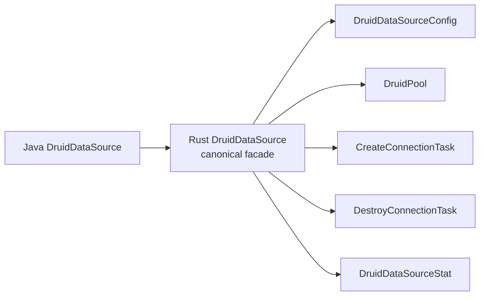

# Java Druid core → Rust `druid` 对象名称一致性检查

> 检查日期：2026-07-29
> Java baseline：`33824c3dec1612711f9bb4e409319bcab2e4cd0e`  
> Rust baseline：`5c29f2c0d7b35e70471ddb96eaffe47c8830d959` + 当前 dirty migration worktree  
> 文档状态：`PARTIAL`

## 1. 基线

| 项目 | 数值 |
| :--- | ---: |
| Java core 生产对象 | 1,644 |
| Rust `druid` 模块入口 | `crates/druid/src/lib.rs` |
| Rust 内部 core/pool/sql/stats/dynamic 源码 | 已归 `crates/druid/src/*` |
| Rust 内置 Toasty 源码 | 已归 `crates/druid/src/toasty` |
| 语义状态 | PARTIAL |

文件数不等于完成率；只有 Java 对象逐项进入对象账本并关闭方法契约才计为完成。

## 2. 命名规则

| Java | Rust |
| :--- | :--- |
| `DruidPooledConnection` | `DruidPooledConnection` / `druid_pooled_connection.rs` |
| `PreparedStatementPool` | `PreparedStatementPool` / `prepared_statement_pool.rs` |
| `SQLUtils` | `SqlUtils` / `sql_utils.rs` |
| `JDBC4ValidConnectionChecker` | `Jdbc4ValidConnectionChecker` |
| `prepareCall` | `prepare_call` |
| `maxActive` | `max_active` |

## 3. 已保留 canonical 名称

| Java 对象 | Rust | 名称 | 语义 |
| :--- | :--- | :--- | :--- |
| `DruidConnectionHolder` | 同名独立文件 | PASS | PARTIAL |
| `DruidPooledConnection` | 同名独立文件 | PASS | PARTIAL |
| `PoolableWrapper` | 同名独立文件 | PASS | DONE（对象本身的 unwrap/isWrapperFor 分支） |
| `WrapperAdapter` | 同名独立文件 | PASS | DONE |
| `PreparedStatementHolder` | 同名独立文件 | PASS | PARTIAL |
| `PreparedStatementPool` | 同名独立文件 | PASS | PARTIAL |
| `DruidPooledPreparedStatement` | 同名独立文件；同文件 `DruidPooledPreparedStatementHandle` 是 Rust 共享身份表示 | PASS | PARTIAL：48 个 JDBC setter 重载、持久参数槽、绑定执行、generic execute、有序描述符 batch、顺序多结果、generated keys、getter fatal sorter、继承 SQLWarning/Statement 属性、五属性关闭恢复、共享 ResultSet trace 与 Prepared 动态身份已落；canonical query 直接包装物理 ResultSet；Toasty/SQLx SQLite 资源执行与 RBDC 严格 SPI 已接，多数据库待补 |
| `PreparedInputParameter` | Rust 支撑对象；独立 `prepared_input_parameter.rs` | PASS | 不冒充 Java 对象；集中表达 Java setter overload 的输入联合类型；`RustValue` 明确标识原 Rust 显式 batch 扩展 |
| `ToastyPreparedStatement` | Toasty 平台 Adapter 对象；独立 `toasty_prepared_statement.rs` | PASS | 不冒充 Druid Java 对象；填补 Toasty raw SQL 没有独立 PreparedStatement 参数槽的差异，在物理 setter 时点物化并保存驱动值 |
| `DruidPooledCallableStatement` | 同名独立文件；同文件 `DruidPooledCallableStatementHandle` 表示 ResultSet 返回的同一共享对象 | PASS | Java 本类 116 个公开声明及继承结果入口均可追踪；callable/Prepared/raw unwrap、强生命周期和关闭级联已验证；真实存储过程 driver 证据仍是 PARTIAL |
| `DruidPooledStatement` | 同名独立文件 | PASS | PARTIAL：canonical 对象、三种创建入口、query/update、JDBC `int[]` batch/部分失败、四种 execute、顺序多结果、generated keys、SQLWarning、属性/close/unwrap 与 ResultSet trace 已落；SQLx/RBDC Connection warning Adapter 已闭合，原生多结果待补 |
| `DruidPooledResultSet` | 同名独立文件 | PASS | PARTIAL：完整 getter/update/metadata/Wrapper 基础上，next/close/warning、18 个标量 getter、16 个 decimal/temporal getter、六个 plain/map/typed object、26 个 stream/resource getter、26 个 navigation/property 调用、两条 NString、getMetaData、getStatement、七个 row-mutation、28 个基础列 update setter、四个 `updateObject` 重载、14 个资源对象 setter、12 个 LOB stream/Reader setter、22 个 ASCII/Binary/Character/NCharacter stream setter及两个 NString setter 同步 Filter around-chain；`ResultSetStatement` 保留普通/Prepared/Callable 动态身份，row-mutation、基础/object/resource/LOB/stream/NString setter 保留默认末端、全方法短路、参数身份、共享游标、错误分类和 capability error，`JdbcOpaqueObject` 可恢复 vendor 具体对象；`is_closed_with_connection` 与内部 `is_closed` 职责分离；StatFilter、custom typed object 单次物理读取、默认 SPI 精确能力错误及 185 个 ResultSet 精确委托已验证，ResultSet update setter Filter 子域已闭合；Statement/PreparedStatement canonical query 保留同一物理 ResultSet，SQLx SQLite 与 RBDC SPI driver label 已测；Toasty eager/raw SQL alias 缺失、RBDC 空结果 descriptor、嵌套 ResultSet/Clob object 自动代理、SQL read length、custom conversion、streaming 与多数据库待补 |
| `FilterAdapter` | 同名独立 `filter_adapter.rs` | PASS | PARTIAL：Java 491 个公开方法；生命周期/属性配置默认空语义、精确自身 Wrapper、SQL before/after 与当前 185 个 ResultSet hook 默认继续链已由三账本和真实 Toasty SQLite 验证；未迁移调用族不能因对象文件存在而计作完成 |
| `FilterEventAdapter` | 同名独立 `filter_event_adapter.rs` | PASS | PARTIAL：Java 32 个公开事件入口与 13 个模板 hook 中，当前调用链可承载的 create/prepare/call、execute/query/update/batch、error 与 ResultSet open 已迁移；`FilterEventListener` 是 Rust 对 protected override 的组合式承载，不冒充额外 Java 对象。StatementProxy 身份、connect 生产接线、downstream-before 局部错误展开及完整 Java 错误矩阵仍开放 |
| `FilterManager` | 同名独立 `filter_manager.rs` | PASS | PARTIAL：Java bundled alias、properties 后者覆盖、UTF-16 名称边界、加载/缺失/构造失败及类名去重已迁移；显式工厂是 Rust 对反射构造的机制替换。自动 classloader 发现、DataSource `setFilters` 装配和未迁移 alias 实现保持开放 |
| `WallConfig` | 同名独立文件 | PASS | PARTIAL |
| `StatFilter` | 同名独立文件 | PASS | PARTIAL：SQL execute/update、普通与 PreparedStatement generic execute、普通与 PreparedStatement batch、活动事务 commit/rollback 与 ResultSet 已接；pool/physical/LOB 待补 |

## 4. 需要 canonical facade/迁名

| Java 对象 | 当前 Rust | 问题 | 目标 |
| :--- | :--- | :--- | :--- |
| Java `/core` artifact | 唯一 `druid` crate | PASS | 已归并到 `crates/druid/src/*` |
| `DruidDataSource` | `DruidDataSource` facade + `DruidPool` engine | canonical 名称和文件已建立 | 继续关闭完整字段、fatal/XA 与统一证据 |
| `DruidAbstractDataSource` | `PoolConfig`/`PoolInnerConfig`/`DruidPoolBuilder` | 有规划的 SPLIT；配置运行主链已建立 | 继续补剩余字段并保持映射表 |
| `JdbcSqlStat` | `MergedSqlStat` | 名称丢失 | canonical `JdbcSqlStat` |
| `JdbcDataSourceStat` | `StatsCollector` | 多职责合并 | 独立对象 |
| `HighAvailableDataSource` | `DynamicDataSource` | canonical 名称缺失 | facade + selector |
| `SQLUtils` | 无 | 公共入口缺失 | `SqlUtils` |
| `DbType` | 无 | 方言身份缺失 | `DbType` |

## 5. Rust 平台适配名称

这些对象允许没有 Java Druid 同名对象，但必须登记来源：

| Rust 对象 | 来源 | 判断 |
| :--- | :--- | :--- |
| `PhysicalConnection` | `java.sql.Connection` | 合法内部 SPI |
| `DruidError::BatchUpdateException` | `java.sql.BatchUpdateException` | 合法平台错误映射；保留部分 `int[]` 与原始 cause，不冒充 Druid 自有对象 |
| `PhysicalStatement` | `java.sql.Statement` | 合法内部 SPI；属性/批次/生命周期与 SQL 执行连接职责分离 |
| `PhysicalResultSet`/`RowSetResultSet` | `java.sql.ResultSet` | 合法内部 SPI 与 eager Adapter；canonical Statement/PreparedStatement 必须持有 `Arc<dyn PhysicalResultSet>`，不得用 `Vec<Row>` 冒充完整 ResultSet；未支持的方法保留逐方法精确 operation，typed object 保持一次底层读取和底层错误优先级；plain/map/typed object 及 String/Boolean/Long/Int/Short/Byte/Double/Float/Bytes 均保留 index/label 独立物理重载 |
| `ResultSetUpdate` | `java.sql.ResultSet#updateXxx` 重载族 | 合法 Rust 平台描述符；独立文件保留 setter 类型、null、流句柄及 int/long/未指定长度身份，不计作 Java 对象迁移数 |
| `ResultSetMetaData` | `java.sql.ResultSetMetaData` | canonical 双后端平台对象；Java 标准 getter、physical 逐调用错误时机及 Wrapper 身份已闭合，真实 driver descriptor 供给另行验收 |
| `ResultSetStatement` | `java.sql.ResultSet#getStatement()` 返回的 `Statement` 动态对象 | 合法 ADAPTER；独立文件中的三分支拥有型共享句柄，保留普通/Prepared/Callable 身份及同一生命周期，不冒充新的 Java 对象 |
| `PhysicalResultSetMetaData` | `java.sql.ResultSetMetaData` driver 实例 | 合法内部 SPI；独立文件保存真实 metadata 对象身份，每个 getter 必须逐次委托，不得 eager snapshot |
| `ResultSetColumnMeta`/`ResultSetColumnType`/`ResultSetNullability` | `ResultSetMetaData` 单列返回字段与 `java.sql.Types`/可空常量 | 合法独立 Rust descriptor；不得把 unknown nullability 压成 bool，也不得猜 schema/table/catalog |
| `PhysicalPreparedStatement` | `java.sql.PreparedStatement` | 合法内部 SPI |
| `PhysicalCallableStatement` | `java.sql.CallableStatement` | 合法内部 SPI |
| `ToastyConnectionFactory` | Toasty `Driver` | 合法内置标准实现；每次创建 raw connection，不持有 Toasty pool |
| `ToastyConnectionAdapter` | Toasty `Connection` | 合法内置 Adapter；源码必须位于 `druid::toasty` 并随 `druid` 发布 |
| `CallableInputParameter` | `CallableStatement` 命名 setter 重载 | 合法内部 SPI；保留 setter 身份及 sqlType/typeName/scale |
| `JdbcObject`（兼容 alias `CallableOutputValue`） | JDBC `getObject/updateObject` 通用值域 | canonical 平台对象；保留标量、Decimal、日期时间、资源与 vendor custom 身份，不再以 Callable 专属名称定义实现 |
| `JdbcTargetType`（兼容 alias `CallableTargetType`） | JDBC typed `getObject(..., Class<T>)` | canonical 平台目标类型；保留标准目标与 vendor 类名 |
| `JdbcTypeMap`（兼容 alias `CallableTypeMap`） | JDBC `Map<String, Class<?>>` | canonical 平台类型映射；ResultSet/Callable/Array/Ref 共用 |
| `JdbcOpaqueObject`/`PhysicalJdbcOpaqueObject` | JDBC vendor custom `Object` | 合法平台 Adapter；保留 `Arc` 引用身份、类名和受控 downcast |
| `JdbcCalendar`/`JdbcCalendarArgument`（兼容别名 `CallableCalendar*`） | `java.util.Calendar` 日期时间重载 | 合法 canonical 内部 SPI；保留时区和重载/null 身份，Callable 与 ResultSet 共用 |
| `JdbcBlob`/`PhysicalBlob` | `java.sql.Blob` | 合法平台 Adapter；11 个 JDBC 操作，不计入 Druid 对象分母 |
| `JdbcClob`/`PhysicalClob` | `java.sql.Clob` | 合法平台 Adapter；13 个 JDBC 操作，不计入 Druid 对象分母 |
| `JdbcNClob`/`PhysicalNClob` | `java.sql.NClob` | 合法平台 Adapter；保留 `NClob extends Clob` 身份 |
| `JavaString` | `java.lang.String` | 合法平台值对象；用 UTF-16 code unit 无损保留 surrogate |
| `JdbcReader`/`JdbcWriter` | `java.io.Reader/Writer` | 合法平台 Adapter；共享游标/关闭状态，不静默物化 |
| `JdbcInputStream`/`JdbcOutputStream` | `java.io.InputStream/OutputStream` | 合法平台 Adapter；共享游标/关闭状态，不得用 Vec 代替资源句柄 |
| `SqlxConnectionAdapter` | Rust SQLx 生态 | 归 `druid-wrapper`，可选扩展 |
| `RbdcConnectionAdapter` | Rust RBDC 生态 | 归 `druid-wrapper`，可选扩展 |

名称和归属结论：`Toasty*` 是 Rust 平台标准实现名称，不冒充 Java Druid 对象；
`Sqlx*`/`Rbdc*` 是扩展名称。三者都只能实现 `PhysicalConnection` 边界，不能
取代 `DruidPooledConnection`。

模块名称结论：这里只允许 `druid`、`druid-admin`、`druid-wrapper` 三个产品
模块。`druid-core`、`druid-pool`、`druid-toasty` 等名称只能标注历史归并来源，
不能出现在最终公共包名、发布清单或完成度统计中。

## 6. 方法名称检查

| Java 方法 | Rust canonical | 当前 |
| :--- | :--- | :--- |
| `getConnection()` | `get_connection().await` | facade 待补；engine 有 `get()` |
| `prepareStatement(...)` | `prepare_statement*().await` | PARTIAL |
| `prepareCall(...)` | `prepare_call*().await` | PARTIAL |
| `createStatement(...)` | `create_statement*().await` | PARTIAL：三个创建重载及查询 ResultSet trace 已迁移，Statement 剩余多结果/generated keys 待补 |
| `next()/previous()/close()` | `DruidPooledResultSet::next/previous/close_with_connection` | PARTIAL：next/close 的 Filter position 游标、短路、错误展开、成功计数、fetch peak、显式/Statement 级联关闭已一致；previous Filter 待接 |
| `getObject(int/String, Class<T>)` | `object_typed/object_typed_by_label` + `JdbcTargetType` | 已下沉真实 SPI；SQLite 标量 index conversion、资源分派、custom unsupported 与 index/label 目标身份已验证；Toasty 真实 label metadata 待补 |
| `getObject(int/String, Map<String,Class<?>>)` | `object_with_type_map/object_by_label_with_type_map` | index/label 与可空 Map 原样委托，参数身份及真实 SQLite unsupported/异常计数已闭合 |
| `getString/getBoolean/getByte/getShort/getInt/getLong/getFloat/getDouble/getBytes` | 同语义 snake_case API | PARTIAL：index/label 基础族已落；LOB/Array/Ref 等方法族待补 |
| `getAsciiStream/getUnicodeStream/getBinaryStream/getCharacterStream/getNCharacterStream` | 同语义 snake_case API | index/label getter 已落，eager Adapter 返回共享状态资源句柄；ASCII/Binary/Character/NCharacter update 的无长度/int/long 合法重载已闭合 |
| `Connection/Statement/PreparedStatement/ResultSet#getWarnings/clearWarnings` | 各池化 facade 的 `warnings/clear_warnings` | 四类对象均已落结构化 warning 与可改写/短路的 Filter around-chain；Connection getter 不进 sorter、clear 进入 sorter 的非对称时机已验证；Toasty/SQLx SQLite 与 RBDC 公开 SPI Adapter 已闭合 |
| `ResultSet#getCursorName/getMetaData` | `cursor_name/meta_data` | 已落完整 JDBC metadata getter、physical 逐调用错误时机及 Wrapper 身份；Toasty 真实 driver label/origin/type descriptor 供给待补 |
| `getRef/getBlob/getClob/getArray/getURL/getRowId/getNClob/getSQLXML(int/String)` | `reference/blob/clob/array/url/row_id/n_clob/sql_xml` + `*_by_label` | 16 个重载名称与 index/label 身份已闭合；真实 SQLite 明确 unsupported |
| `updateObject(int/String,Object[,scaleOrLength])` | `update_object*` / `update_object_by_label*` | 四重载名称和参数维度独立保留；Filter 可观察 plain/scaleOrLength 与 index/label，SQL NULL、负 scale 和 `JdbcOpaqueObject` vendor 具体身份已验证 |
| `updateRef/updateBlob/updateClob/updateArray/updateRowId/updateNClob/updateSQLXML(int/String,对象)` | `update_*` + `update_*_by_label` | 14 个对象型重载、Java null、RowId 值和精确 FilterChain 名称均已闭合；链内拥有型资源 Clone 保持共享物理句柄，末端才转回借用 |
| `updateBlob(InputStream)`、`updateClob/updateNClob(Reader)` | `update_*_stream/reader*` | index/label、无长度/long 长度共 12 重载名称一一对应；四层 Filter 精确入口已闭合，拥有型 Clone 共享游标/关闭状态，默认链不预读，原始 long 不校正 |
| `setNull(String,int[,String])` | `set_named_null*` | 名称/参数已一致；真实 driver 未验证 |
| `setObject(String,Object[,int[,int]])` | `set_named_object*` | 三重载元数据已保留；真实 driver 未验证 |
| `getByte/getShort/getFloat(int/String)` | `get_byte/get_short/get_float` 与 `get_named_*` | 已落物理 SPI；真实 driver 未验证 |
| `set/get BigDecimal` | `set_named_big_decimal` / `get_*_big_decimal*` | Callable setter/getter 与 ResultSet 四重载保留强类型及 scale；Toasty/SQLx/RBDC SQLite 边界已验证 |
| `set/get Date/Time/Timestamp(...[,Calendar])` | 同名 snake_case API + `JdbcCalendarArgument` | Calendar 三态及纳秒时间已保留；ResultSet 12 个重载的 raw SPI 参数身份和三个 Adapter 边界已验证 |
| `getClob/getNClob(int/String)` | `get_clob/get_named_clob/get_n_clob/get_named_n_clob` | 名称和 index/name 重载一致；资源 SPI 已测，真实 callable driver 未验证 |
| `setClob/setNClob(String,对象/Reader[,long])` | `set_named_clob*` / `set_named_n_clob*` | 对象、null、Reader 和长度重载身份已保留 |
| `get/setCharacterStream`、`get/setNCharacterStream` | 同语义 snake_case API | `Reader` 资源及 `int/long/unspecified` 长度重载已保留 |
| `recycle()` | `close().await` / `recycle()` | PARTIAL |
| `shrink(...)` | `shrink*().await` | PARTIAL |
| `removeAbandoned()` | `remove_abandoned().await` | MISSING |

名称检查通过不代表语义完成；本模块仍未达到 1,644/1,644。

<!-- GLOBAL_NAMING_LEDGER_MERGE_START -->
## 归并自原全局名称总账的详细审计

> 本节承接原全局名称总账中属于 Java `/core` 和 Rust `druid` 的 canonical、MERGE、SPLIT、ADAPTER 与方法命名记录。

#### 4. 当前 canonical 名称审计

##### 4.1 名称已保留但语义仍需验收

| Java 对象 | 当前 Rust 类型/文件 | 名称 | 语义状态 |
| :--- | :--- | :--- | :--- |
| `WallConfig` | `WallConfig` / `wall_config.rs` | 通过 | PARTIAL |
| `StatFilter` | `StatFilter` / `stat_filter.rs` | 通过 | PARTIAL：本轮已接 SQL/活动事务全局事件，完整对象族仍开放 |
| `ExceptionSorter` | `ExceptionSorter` / `exception_sorter.rs` | 通过 | PARTIAL |
| `MySqlExceptionSorter` | `MySqlExceptionSorter` / `my_sql_exception_sorter.rs` | 通过 | DONE |
| `PGExceptionSorter` | `PgExceptionSorter` / `pg_exception_sorter.rs` | Rust acronym 惯例映射通过 | DONE |
| `NullExceptionSorter` | `NullExceptionSorter` / `null_exception_sorter.rs` | 通过 | DONE |
| `DB2ExceptionSorter` | `Db2ExceptionSorter` / `db2_exception_sorter.rs` | Rust acronym 惯例映射通过 | DONE |
| `InformixExceptionSorter` | `InformixExceptionSorter` / `informix_exception_sorter.rs` | 通过 | DONE |
| `SybaseExceptionSorter` | `SybaseExceptionSorter` / `sybase_exception_sorter.rs` | 通过 | DONE |
| `AbstractOracleExceptionSorter` | `AbstractOracleExceptionSorter` / `abstract_oracle_exception_sorter.rs` | 抽象继承按状态组合映射，名称通过 | DONE |
| `OracleExceptionSorter` | `OracleExceptionSorter` / `oracle_exception_sorter.rs` | 通过 | DONE |
| `OceanBaseOracleExceptionSorter` | `OceanBaseOracleExceptionSorter` / `ocean_base_oracle_exception_sorter.rs` | 通过 | DONE |
| `PhoenixExceptionSorter` | `PhoenixExceptionSorter` / `phoenix_exception_sorter.rs` | 通过 | DONE |
| `MockExceptionSorter` | `MockExceptionSorter` / `mock_exception_sorter.rs` | 通过 | DONE |
| `ValidConnectionChecker` | `ValidConnectionChecker` / `valid_connection_checker.rs` | 通过 | PARTIAL |
| `[Rust internal] PhysicalConnectionFactory` | `PhysicalConnectionFactory` / `physical_connection_factory.rs` | canonical 名称已收敛；旧 `ConnectionFactory` 仅兼容重导出 | 通过；deprecated alias 待 C8 删除 |
| `DruidConnectionHolder` | `DruidConnectionHolder` / `druid_connection_holder.rs` | 通过；旧 `ConnectionHolder` 仅兼容重导出 | PARTIAL：PS cache 主链已落地；listener/trace、连接变量和运行时密码版本失效待补 |
| `PreparedStatementHolder` | `PreparedStatementHolder` / `prepared_statement_holder.rs` | 通过 | PARTIAL：字段/计数迁移完成，Oracle 驱动行为待补 |
| `PreparedStatementPool` | `PreparedStatementPool` / `prepared_statement_pool.rs` | 通过 | PARTIAL：LRU/容量/share/清理/统计完成，Oracle/listener/trace 待补 |
| `DruidPooledPreparedStatement` | `DruidPooledPreparedStatement` + `DruidPooledPreparedStatementHandle` / `druid_pooled_prepared_statement.rs` | 通过；handle 是同一 Java 对象的 Rust 共享身份，不计独立 Java 对象 | PARTIAL：缓存、48 个 setter 重载与参数状态、绑定执行、有序描述符 batch、generic execute、多结果/generated keys/getter sorter、继承属性及关闭恢复、共享 result-set trace 与 Prepared 动态身份完成；Toasty SQLite 资源主链完成，SQLx/RBDC 资源与原生多数据库 generic/batch 待补 |
| `DruidPooledCallableStatement` | `DruidPooledCallableStatement` + 同文件共享身份 handle / `druid_pooled_callable_statement.rs` | 通过 | 本类 115 个 Java 方法及继承结果入口均可追踪；ResultSet trace 可恢复 callable 具体身份；真实存储过程 Adapter 仍为 PARTIAL |
| `PoolConfig` | `PoolConfig` / `config.rs` | Rust 内部名 | PARTIAL |

名称合格不代表迁移完成。例如 `WallConfig` 有约 46 个字段，但当前规则引擎只读取其中一部分。

##### 4.2 当前应迁名或增加 canonical facade

| Java canonical 对象 | 当前 Rust 对象 | 问题 | 目标 |
| :--- | :--- | :--- | :--- |
| `DruidDataSource` | `DruidDataSource` + 内部 `DruidPool` | canonical 对外身份已恢复 | facade 保持唯一对外数据源对象 |
| `DruidAbstractDataSource` | `PoolConfig`、`PoolInnerConfig`、`DruidPoolBuilder` | 有规划的配置职责拆分，字段映射仍 PARTIAL | 用四表保持 Java 字段/默认值/运行读取一一可追踪 |
| `DruidPooledConnection` | `DruidPooledConnection`；`PooledConnection` 仅兼容重导出 | 名称已合并；回收主序列已迁移，statement/schema/fatal 分支仍待补 | 保持唯一 canonical 实现 |
| `—（JDBC 平台能力）` | `PhysicalConnection`；`Connection` 仅兼容重导出 | 对外/对内身份已拆开 | 保持内部最小 SPI |
| `—（物理创建能力）` | `PhysicalConnectionFactory`；`ConnectionFactory` 仅兼容重导出 | native factory 与 external pool 已拆开 | C8 删除旧 alias |
| `—（DataSource 来源职责）` | core `Pool`；实现为 `DruidPool` / `SqlxBb8Pool` / `SqlxDeadpoolPool` | 类型边界已可见，canonical `DruidDataSource` facade 待建 | facade 配置只选择一个 `Pool` |
| `—（close/recycle 所有权）` | `DruidPooledConnection` 内部三参数 `FnOnce` + `ConnectionRecycleDisposition`；external 使用 `PhysicalConnectionLease` | exactly-once 与显式 rollback/reset/testOnReturn/处置顺序已有契约 | P2 补 statement/schema/fatal、受监管销毁和 shutdown |
| `WallProvider` | `Wall` | Provider 生命周期/cache/SPI 不可见 | `WallProvider` facade，`WallEngine` 内部 |
| `WallCheckResult` | `Result<Vec<WallViolation>, _>` | 结果对象字段丢失 | `WallCheckResult` |
| `JdbcSqlStat` | `MergedSqlStat` | 名称只表达 merge，丢失统计对象身份 | `JdbcSqlStat`；merger 内部化 |
| `JdbcDataSourceStat` | `StatsCollector` | 多源对象混合 | 拆出 `JdbcDataSourceStat` |
| `HighAvailableDataSource` | `DynamicDataSource` | canonical HA 行为不可见 | `HighAvailableDataSource` facade |
| `DataSourceSelector` | `LoadBalancer` | 选择契约被泛化 | canonical trait + balancer adapter |
| `RandomDataSourceSelector` | `RandomBalancer` | 源对象不可追溯 | canonical selector |
| `StatementExecuteType` | `StatementType` | 语义词被缩短 | `StatementExecuteType` |
| `PoolableWrapper` | `PoolableWrapper` / `poolable_wrapper.rs` | 已纠正：不再与平台 `Wrapper` trait 混为一个对象 | 保持独立 canonical 对象；生产 Proxy 对象另行迁移 |
| `SQLUtils` | 无 | 公共兼容入口缺失 | `SqlUtils` |
| `DbType` | 无 | 方言身份缺失 | `DbType` |

##### 4.3 当前不存在但旧文档误标已完成的对象

| 对象 | 应有文件 | 当前 |
| :--- | :--- | :--- |
| `FilterChainImpl` | `filter_chain_impl.rs` | MISSING；`ResultSetFilterChain` 只覆盖 next/close 子链，不冒充 canonical 对象 |
| `StatFilterContextListenerAdapter` | `stat_filter_context_listener_adapter.rs` | PASS；独立具体对象显式实现 14 个 Java 空回调，未由 Listener trait 冒充 |
| `FilterManager` | `filter_manager.rs` | PASS/PARTIAL；独立对象与 Java 资源已落地，显式工厂替代反射；自动数据源配置接线待补 |
| `WallFilter` | `wall_filter.rs` | MISSING |
| `DruidDataSourceStatValue` | `druid_data_source_stat_value.rs` | MISSING |
| `JdbcSqlStatValue` | `jdbc_sql_stat_value.rs` | MISSING |
| `DruidStatService` | `druid_stat_service.rs` | MISSING |
| `DruidDataSourceStatManager` | `druid_data_source_stat_manager.rs` | MISSING |
| `StatViewServlet` 的协议替代 | `stat_view_router.rs` | MISSING |
| `EvictionRunner`/维护任务 | 对应明确 Java 任务对象的文件 | MISSING |
| `LeakDetector` | `leak_detector.rs` | MISSING |

不存在的文件或类型必须标 `MISSING`，不能用路线图中的目标路径标 `DONE`。

#### 5. 非一对一名称登记

##### 5.1 MERGE

```text
Java FQCN A ─┐
Java FQCN B ─┼─> RustType::VariantA / VariantB
Java FQCN C ─┘
```

要求：

- 每个源对象有稳定对象 ID；
- variant 名尽量保留 canonical token；
- 每个 variant 有独立 doc 注释和差分用例；
- 合并后的 Rust 文件不能同时定义无关 Java 对象。

适合的例子是多个 violation 实现合并为 `WallViolation` enum，不适合把所有 vendor checker 堆进一个文件。

##### 5.2 SPLIT



要求 facade 保留源对象的公开行为，内部对象使用 Rust 风格名称并注明承载的 Java 方法。

##### 5.3 ADAPTER/PROTOCOL

Java API 名称可以不直接暴露，但登记必须包含三层：

| 层 | 示例 |
| :--- | :--- |
| 源对象 | `StatViewServlet` |
| Rust 协议对象 | `StatViewRouter` |
| 等价结果 | 路由、JSON、静态资源、登录、allow/deny IP、reset |

仅写“JMX → metrics”“Spring → config”“JDBC → sqlx”不合格，因为这没有说明属性、动作和错误如何对应。

#### 6. 当前 Rust-only 名称检查

| Rust 对象 | 来源 | 是否允许 | 约束 |
| :--- | :--- | :--- | :--- |
| `DruidPool`、`PoolInner` | `DruidDataSource` 内部调度 | 允许 | 不替代 canonical facade |
| `PoolConfigBuilder`、`DruidPoolBuilder` | datasource setters/factory | 允许但需去重 | 字段契约唯一来源 |
| `PhysicalConnection` | JDBC 平台连接能力 | 允许且要求迁名 | 内部最小 SPI，不与 `DruidPooledConnection` 竞争公开身份 |
| `PhysicalCallableStatement` | JDBC CallableStatement 平台能力 | 允许 | 最小驱动句柄 SPI；不支持能力必须显式报错 |
| `CallableInputParameter`、`JdbcObject`（兼容 alias `CallableOutputValue`）、`JdbcCalendar`（兼容 alias `CallableCalendar`）、`CallableParameter`、`CallableOutParameter` | CallableStatement 参数/返回值重载 | 允许 | canonical 通用平台对象使用 `Jdbc*` 名称；保留 setter/返回类型、Calendar、index/name/sqlType/scale/typeName/LOB/Reader 精确长度，不冒充 Druid 对象 |
| `JdbcBlob`、`PhysicalBlob`、`JdbcInputStream`、`JdbcOutputStream` | JDBC Blob / Java IO 平台资源 | 允许 | 完整资源句柄 SPI，不冒充 Druid `BlobProxy`，不静默物化 |
| `JdbcClob`、`PhysicalClob`、`JdbcNClob`、`PhysicalNClob` | JDBC Clob/NClob 平台资源 | 允许 | Clob 13 方法、NClob 继承身份；不冒充 Druid Proxy |
| `JdbcReader`、`JdbcWriter`、`JavaString` | Java Reader/Writer/String 平台资源 | 允许 | UTF-16 无损边界与共享资源生命周期 |
| `PhysicalConnectionFactory` | driver 创建能力 | 允许且要求迁名 | 只创建 raw connection，不从外部 pool acquire |
| `ConnectionProvider` | datasource acquire 来源选择 | 允许 | native/bridge 单选，返回统一 lease |
| `ConnectionLease`、`LeaseReturner` | close/recycle 所有权 | 允许 | exactly-once return，失败可监控 |
| `ConnectionDefaults` | `DruidConnectionHolder` 默认状态字段和 `reset()` | 允许 | 已作为 canonical holder 的内部值对象；不能替代 PS cache 等剩余职责 |
| `ConnectionRecycleDisposition` | `DruidDataSource.recycle` 的最终分支 | 允许 | 仅承载 reusable/discard/recycle-error 处置 |
| `ToastyConnectionFactory`、`ToastyConnectionAdapter` | Rust 内置标准数据源 | 允许 | 已归 `druid::toasty`；不冒充 Java 对象，不持有 Toasty pool |
| `ExecContext` | Proxy/Filter 参数集合 | 允许 | 不得丢参数、数据源、时间、fingerprint |
| `BeforeFilter`、`AfterFilter`、`ExtendedFilter` | `Filter` 拆分 | 允许 | hook 覆盖率 100% |
| `SqlMerger`、`ParameterizedSql` | parameterized visitor/stat key | 允许 | P4 后基于兼容 AST |
| `DataSourceGroup`、`SqlHint` | HA/selector | 允许 | 绑定具体 Java 对象与契约 |

#### 7. 方法名称与语义一致性

| Java 方法 | Rust canonical 方法 | 当前判断 |
| :--- | :--- | :--- |
| `init()` | `init().await` | MISSING |
| `getConnection()` | `get_connection().await` | 当前只有 `get()`，需 facade |
| `getConnectionDirect()` | `get_connection_direct().await` | MISSING |
| `recycle()` | `DruidPooledConnection::close().await` + `recycle()` / provider return | PARTIAL：显式 close 已完成 rollback/reset/testOnReturn/处置；同步 recycle/Drop 对脏连接直接淘汰 |
| `prepareCall(String)` | `prepare_call().await` | PARTIAL：入口、完整 key、缓存和标量 callable wrapper 已迁移；真实 Adapter 待补 |
| `prepareCall(String,int,int,int)` | `prepare_call_with_holdability().await` | PARTIAL：`Precall2` 全字段 key 已验证 |
| `prepareCall(String,int,int)` | `prepare_call_with_result_set().await` | PARTIAL：`Precall3` 全字段 key 已验证 |
| `setNull(String,int[,String])` | `set_named_null*` + `CallableInputParameter::Null` | PARTIAL：重载参数无损；真实 driver 待验收 |
| `setObject(String,Object[,int[,int]])` | `set_named_object*` + `CallableInputParameter::Object` | PARTIAL：`targetSqlType/scale` 无损；真实 driver 待验收 |
| `set/get BigDecimal` | `set_named_big_decimal` / `get_*_big_decimal*` | PARTIAL：任意精度与 scale 无损；真实 driver 待验收 |
| `set/get Date/Time/Timestamp(...[,Calendar])` | 同名 snake_case API + `CallableCalendarArgument` | PARTIAL：Calendar 三态与纳秒时间无损；真实 driver 待验收 |
| `getBlob(int/String)` / `setBlob(String,Blob/InputStream[,long])` | `get*_blob` / `set_named_blob*` + 资源 SPI | PARTIAL：5 个自有入口、对象身份、null/length/流不预读已测；真实 callable driver 待验收 |
| `getClob/getNClob(int/String)` / `setClob/setNClob(String,对象/Reader[,long])` | `get/set_named_*clob*` + 资源 SPI | PARTIAL：对象、null、Reader、index/name、long 重载已测；真实 callable driver 待验收 |
| `get/setCharacterStream` / `get/setNCharacterStream` | 同语义 snake_case API + `JdbcCharacterLength` | PARTIAL：无长度、int、long descriptor 与 Reader 不预读已测；真实 callable driver 待验收 |
| `getByte/getShort/getFloat(int/String)` | `get_*` + `get_named_*` → `PhysicalCallableStatement` | PARTIAL：测试驱动已验证；真实 driver 待验收 |
| `discardConnection()` | `discard_connection()` | PARTIAL |
| `testConnectionInternal()` | `test_connection_internal().await` | MISSING |
| `shrink()` / `shrink(boolean)` / `shrink(boolean, boolean)` | `shrink().await` / `shrink_check_time(bool).await` / `shrink_with_options(bool, bool).await` | PARTIAL：显式维护入口和主分支已迁移；后台 DestroyTask 与失败后补池待补 |
| `removeAbandoned()` | `remove_abandoned().await` | MISSING |
| `fill()` | `fill().await` | MISSING |
| `restart()` | `restart().await` | MISSING |
| `parseStatements()` | `parse_statements()` | MISSING |
| `toSQLString()` | `to_sql_string()` | MISSING |
| `parameterize()` | `parameterize()` | PARTIAL，算法不等价 |
| `check()` | `check()` | PARTIAL |
| `clearProviderCache()` | `clear_provider_cache()` | MISSING |
| `DruidConnectionHolder#reset()` | `DruidConnectionHolder::reset()`（内部委托 `ConnectionDefaults::reset()`） | PARTIAL：属性与 warnings 顺序、MySQL-family initSchema 恢复及 schema 变化清 cache 已迁移；listener/statement trace 未完成 |

`get()`、`close()`/Drop 等惯用 Rust API 可以作为便捷别名，但迁移 facade 应提供含义清晰、可追溯的 canonical 方法。

##### 8.1 连接池与 HA 原计划对象（30 个）

| Java 对象 | 原计划文件 | 当前名称状态 | 修订目标 |
| :--- | :--- | :--- | :--- |
| `DruidDataSource` | `druid_data_source.rs` + `druid_pool.rs` | MATCH/SPLIT/PARTIAL | canonical facade 已建，engine 不替代源对象身份 |
| `DruidAbstractDataSource` | `config.rs` | SPLIT/PARTIAL | 配置对象按 facade/builder/runtime 分层，剩余字段继续迁移 |
| `DruidConnectionHolder` | `druid_connection_holder.rs` | MATCH/PARTIAL | canonical 类型和文件及 PS cache 主链已落实；继续补 listener/trace、变量与动态版本失效 |
| `DruidPooledConnection` | `druid_pooled_connection.rs` | MATCH/PARTIAL | 唯一实现已合并；完整 Java 状态机继续迁移 |
| `DruidDataSourceStatLogger` | `collector.rs` | MISSING | 独立同名文件 |
| `DruidDataSourceStatLoggerAdapter` | `collector.rs` | MISSING | 独立同名文件 |
| `DruidDataSourceStatLoggerImpl` | `collector.rs` | MISSING | tracing 实现 |
| `DruidDataSourceStatValue` | `pool_state.rs` | MISSING | 独立快照 |
| `ExceptionSorter` | `exception_sorter.rs` | MATCH/DONE | trait 与 11 个 vendor/abstract 对象完整独立，池化接线缺口归 `DruidPooledConnection` |
| `ValidConnectionChecker` | `valid_connection_checker.rs` | MATCH/PARTIAL | 语义差分 |
| `ValidConnectionCheckerAdapter` | 合并文件 | MISSING | 独立文件 |
| `JDBC4ValidConnectionChecker` | 合并文件 | MISSING | `Jdbc4ValidConnectionChecker` |
| `PoolableWrapper` | `poolable_wrapper.rs` | MATCH/DONE | 独立 canonical 对象；null/self/raw/statement/proxy 委托顺序已验证 |
| `WrapperAdapter` | `wrapper_adapter.rs` | MATCH/DONE | 独立文件；默认 wrapper 行为已验证 |
| `PreparedStatementHolder` | `statement_cache.rs` | MATCH/PARTIAL | 已纠正为独立 `prepared_statement_holder.rs` |
| `PreparedStatementPool` | `statement_cache.rs` | MATCH/PARTIAL | 已纠正为独立 `prepared_statement_pool.rs` |
| `HighAvailableDataSource` | `dynamic_datasource.rs` | RENAME | canonical facade |
| `DataSourceSelector` | `load_balancer.rs` | RENAME | canonical trait |
| `DataSourceSelectorEnum` | `load_balancer.rs` | MISSING | 同名 enum |
| `NamedDataSourceSelector` | `load_balancer.rs` | MISSING | 同名对象 |
| `RandomDataSourceSelector` | `random.rs` | RENAME | canonical selector |
| `RandomDataSourceValidateFilter` | `load_balancer.rs` | MISSING | 同名对象 |
| `StickyRandomDataSourceSelector` | `load_balancer.rs` | MISSING | 同名对象 |
| `PoolUpdater` | `registry.rs` | MISSING | 同名对象 |
| `AbstractOracleExceptionSorter` | `abstract_oracle_exception_sorter.rs` | MATCH/DONE | Java 抽象父类状态以 Rust 组合对象迁移 |
| `OracleExceptionSorter` | `oracle_exception_sorter.rs` | MATCH/DONE | 独立文件与完整 error matrix |
| `MySqlExceptionSorter` | `my_sql_exception_sorter.rs` | MATCH/DONE | 保持独立对象与 Java error matrix |
| `PGExceptionSorter` | `pg_exception_sorter.rs` | IDIOMATIC/DONE | Java `PG` → Rust `Pg`，语义与文件均独立 |
| `NullExceptionSorter` | `null_exception_sorter.rs` | MATCH/DONE | 共享实例与 no-op 配置已保留 |
| `DB2ExceptionSorter` | `db2_exception_sorter.rs` | IDIOMATIC/DONE | Java `DB2` → Rust `Db2` |
| `InformixExceptionSorter` | `informix_exception_sorter.rs` | MATCH/DONE | 保持独立对象 |
| `SybaseExceptionSorter` | `sybase_exception_sorter.rs` | MATCH/DONE | 保持独立对象 |
| `OceanBaseOracleExceptionSorter` | `ocean_base_oracle_exception_sorter.rs` | MATCH/DONE | 独立对象，复用抽象 Oracle 状态但不合并判定逻辑 |
| `PhoenixExceptionSorter` | `phoenix_exception_sorter.rs` | MATCH/DONE | 独立对象 |
| `MockExceptionSorter` | `mock_exception_sorter.rs` | MATCH/DONE | 独立对象，`instanceof` 通过可赋值类型链保留 |
| `OracleValidConnectionChecker` | 合并文件 | MISSING | 独立文件 |
| `MySqlValidConnectionChecker` | 合并文件 | MISSING | 独立文件 |

##### 8.2 Filter 原计划对象（8 个）

| Java 对象 | 原计划文件 | 当前名称状态 | 修订目标 |
| :--- | :--- | :--- | :--- |
| `Filter` | `filter.rs` | SPLIT/PARTIAL | canonical 账目绑定三个 trait |
| `FilterChain` | `filter_chain.rs` | MATCH/PARTIAL | 完整 chain |
| `FilterChainImpl` | `filter_chain.rs` | MISSING canonical；ResultSet 子链 PARTIAL | 新建 `filter_chain_impl.rs` 并吸收已验证子链 |
| `FilterManager` | `filter_manager.rs` | MATCH/PARTIAL | alias/resource/load/dedupe/failure 已落地；继续接 DruidDataSource `setFilters` 与其余 Filter 工厂 |
| `StatFilter` | `stat_filter.rs` | MATCH/PARTIAL | SQL execute/update、普通与 PreparedStatement batch、活动事务 commit/rollback 与 ResultSet 生产链已接；generic execute/pool/physical/LOB 待补 |
| `WallFilter` | `wall_filter.rs` | MISSING | 同名对象 |
| `LogFilter` | `log_filter.rs` | MISSING | tracing backend |
| `CounterFilter` | `counter.rs` | MISSING | 同名对象 |

##### 8.3 Wall 原计划对象（15 个）

| Java 对象 | 原计划文件 | 当前名称状态 | 修订目标 |
| :--- | :--- | :--- | :--- |
| `WallProvider` | `wall.rs` | RENAME/PARTIAL | `WallProvider` facade |
| `WallConfig` | `wall_config.rs` | MATCH/PARTIAL | 字段行为全接线 |
| `WallVisitor` | `wall.rs` | MISSING | 独立 visitor |
| `WallVisitorBase` | `wall.rs` | MISSING | compatibility base |
| `WallCheckResult` | `wall_violation.rs` | MISSING | 独立结果对象 |
| `Violation`（原表误写 `WallViolation`） | `wall_violation.rs` | MERGE/PARTIAL | `WallViolation` enum variants |
| `WallSqlStat` | `wall_stat.rs` | MISSING | 独立文件 |
| `WallSqlStatValue` | `wall_stat.rs` | MISSING | 独立文件 |
| `WallTableStat` | `wall_stat.rs` | MISSING | 独立文件 |
| `WallTableStatValue` | `wall_stat.rs` | MISSING | 独立文件 |
| `WallFunctionStat` | `wall_stat.rs` | MISSING | 独立文件 |
| `WallFunctionStatValue` | `wall_stat.rs` | MISSING | 独立文件 |
| `WallDenyStat` | `wall_stat.rs` | MISSING | 独立文件 |
| `WallUpdateCheckHandler` | `wall_config.rs` | MISSING | 独立文件 |
| `WallUpdateCheckItem` | `wall_config.rs` | MISSING | 独立文件 |

##### 8.4 Stat 原计划对象（12 个）

| Java 对象 | 原计划文件 | 当前名称状态 | 修订目标 |
| :--- | :--- | :--- | :--- |
| `JdbcSqlStat` | `merge.rs` | RENAME/PARTIAL | canonical 对象 |
| `JdbcSqlStatValue` | `merge.rs` | MISSING | 独立快照 |
| `JdbcDataSourceStat` | `collector.rs` | RENAME/PARTIAL | canonical 对象 |
| `JdbcConnectionStat` | `collector.rs` | MISSING | 独立对象 |
| `JdbcStatementStat` | `collector.rs` | MISSING | 独立对象 |
| `JdbcResultSetStat` | `jdbc_result_set_stat.rs` | PASS/PARTIAL | 同名独立对象及 StatFilter→ResultSet open/close/fetch/hold 已接；SQL 级与管理面未完成 |
| `StatFilterContext` | `stat_filter_context.rs` | PASS/PARTIAL | 同名独立对象已迁移；SQL execute/update、活动事务 commit/rollback 与 ResultSet 事件族已接生产链 |
| `StatFilterContextListener` | `stat_filter_context_listener.rs` | PASS | 同名独立 trait，14 个方法与错误传播已迁移 |
| `StatFilterContextListenerAdapter` | `stat_filter_context_listener_adapter.rs` | PASS/BEHAVIOR_VERIFIED | 独立具体对象及 14 个显式空回调已迁移并测试 |
| `JdbcStatManager` | `collector.rs` | MISSING | 独立对象 |
| `DruidStatService` | `api_sql.rs` | MISSING | service/protocol 对象 |
| `DruidDataSourceStatManager` | `registry.rs` | MISSING | canonical manager |
| `DruidStatManagerFacade` | `registry.rs` | MISSING | canonical facade |
| `DataSourceMonitorable` | `pool.rs` | MISSING | canonical trait |
| `TableStat` | `table_stat.rs` | MISSING | 独立对象 |
<!-- GLOBAL_NAMING_LEDGER_MERGE_END -->
