# Java Druid core → Rust `druid` 全量迁移路线图

> 基线：Java Druid 1.2.28，commit `33824c3dec1612711f9bb4e409319bcab2e4cd0e`  
> 目标：唯一 `crates/druid` 模块；core/pool/sql/stats/dynamic/toasty 均为内部目录
> 日期：2026-07-29

模块账本：[对象级对照表](./对象级对照表.md) ·
[语义迁移对照表](./语义迁移对照表.md) ·
[对象名称一致性检查](./对象名称一致性检查.md) ·
[Toasty 内置标准实现](./Toasty-内置数据源标准实现.md)

## 1. 总目标

`crates/druid` 对应 Java `/core` 模块。迁移目标是 1,644 个 Java 生产对象的
功能语义完全迁移，不是把原 `druid-core` 仅做包装或重导出后宣称完成。职责拆分只能发生在
`crates/druid/src/` 的内部目录中，不能继续形成独立 crate、版本或发布边界。
`druid` 是 Java core 模块唯一的源码、发布与验收边界，并默认整合 Toasty。

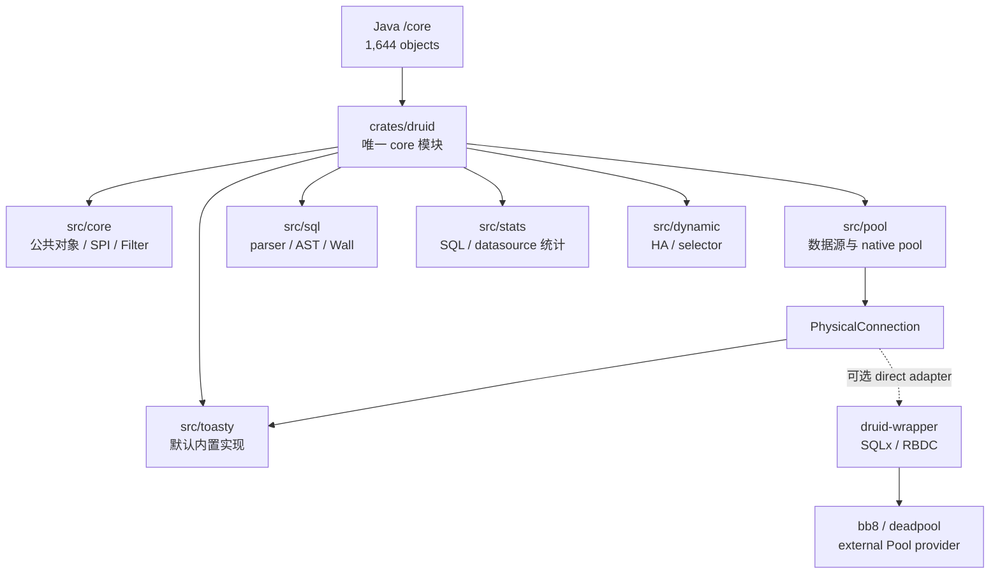

## 2. 迁移原则

1. Java 对象、方法、重载、默认值、错误、状态、副作用和并发行为全部入账。
2. 一个 `.rs` 生产文件只承载一个 Java 对象；`lib.rs`/`mod.rs` 只声明和重导出。
3. Java 平台标准 `java.sql.*` 迁移为最小内部 SPI，不计入 Druid 对象分母。
4. Toasty 是内置数据源标准实现；SQLx、RBDC 是 wrapper 扩展。它们都只是
   `PhysicalConnection` 的平台实现，不能代替 Druid 领域语义验收。
5. SQLite 只验收其真实支持的能力；存储过程、XA、vendor 行为需对应真实数据库。
6. mock 只用于故障注入，不替代真实数据库纵向合同。

## 3. 当前基线

| 维度 | Java core | Rust 当前 | 判断 |
| :--- | ---: | ---: | :--- |
| 生产对象/文件 | 1,644 | 已物理归并到 `crates/druid/src/*`；对象语义总账仍未闭合 | PARTIAL |
| Pool 主链 | 完整 | native acquire/recycle、部分维护、PS cache | PARTIAL |
| SQL/AST/方言 | 1,268 个对象 | sqlparser-rs facade + 少量 Wall 规则 | PARTIAL |
| Filter/Proxy | 94 个左右对象族 | 粗粒度 FilterChain | PARTIAL |
| Stat | 完整 SQL/datasource/web/spring 统计 | merge/stat filter 子集 | PARTIAL |
| 真实数据库 | JDBC 多驱动 | Toasty SQLite 内置主链 + SQLx 扩展主链；其他数据库矩阵未闭合 | PARTIAL |

## 4. 阶段路线

| 阶段 | 范围 | 退出门禁 | 当前 |
| :--- | :--- | :--- | :--- |
| C0 | 三模块边界、对象总账、CodeGraph 基线 | 1,644 分母冻结；core 内部实现归并进 `crates/druid` | DONE |
| C1 | PhysicalConnection、Toasty 内置标准、错误、typed values | 内置与每个扩展 Adapter 执行统一 contract | PARTIAL |
| C2 | DruidDataSource、holder、pooled connection、维护任务 | Java acquire/recycle/shrink/fill 差分 | PARTIAL |
| C3 | Statement/Prepared/Callable/ResultSet/LOB/metadata | 全方法矩阵 + 真实数据库 | PARTIAL |
| C4 | Filter/Proxy 调用链 | 每个 Java hook 有事件和顺序测试 | PARTIAL |
| C5 | SQL parser、AST、Visitor、输出、参数化 | 逐方言 corpus 差分 | PARTIAL |
| C6 | WallProvider/WallConfig/规则 | 全字段开关与 violation 差分 | PARTIAL |
| C7 | Stat/JMX 结果迁移 | 指标字段、聚合、reset、并发一致 | PARTIAL |
| C8 | HA/XA/vendor/support/util | 故障注入与真实驱动矩阵 | PARTIAL |
| C9 | 文档、注释、兼容面、覆盖率 | workspace + llvm-cov 100% | 未完成 |

### C3-R2：Callable 输入重载无损化

CodeGraph 与源码盘点冻结 `DruidPooledCallableStatement` 的 116 个 Java 公开声明
（构造器 + 115 个方法）；C3-R5 时 Rust 累计提供 94 个公开入口，后续 C3-R6
已补齐 115 个 Java 方法对应入口，另有 5 个 Rust 生命周期/扩展方法。API 数量闭合
仍不能替代真实存储过程 driver 的语义证据。第一批新增
`CallableInputParameter`，把 `setNull` 的 `sqlType/typeName`、`setObject` 的
`targetSqlType/scale` 以及 Boolean/Byte/Short/Int/Long/Float/Double/String/
NString/Bytes 的具体 setter 身份完整传到 `PhysicalCallableStatement`。

标量 index/name getter 同样下沉到物理 SPI，池化对象只负责 open 检查、错误计数与
缓存淘汰。当前证据仍是测试驱动 E1/E2 子集；支持存储过程的真实数据库 E7 尚未建立。

### C3-R3：Callable Decimal 与日期时间强类型化

第二批新增 `CallableOutputValue`、`CallableCalendar` 与 Calendar 重载参数账本。
`BigDecimal` 使用 `bigdecimal::BigDecimal` 保留任意精度和 scale；
Date/Time/Timestamp 使用 `chrono` 强类型并保留 Timestamp 纳秒。Calendar 不能
只保存当前 UTC offset，而是保留时区标识，并区分未调用 Calendar 重载、显式
传 null、传实际 Calendar 三种状态。

这批关闭 22 个 Rust 公开入口，但仍是物理测试驱动证据。SQLite 没有存储过程，
只能严格验证 `UnsupportedOperation`，不能充当 Callable E7；本阶段的 URL、
Array/Ref/RowId/SQLXML、
流、完整 `getObject`/ResultSet trace 和支持存储过程的真实 Adapter
继续开放，其中 Blob 与 Clob/NClob/字符流子集由后续 C3-R4/C3-R5 关闭实现面。

### C3-R4：Callable Blob 资源语义切片

第三批按 Java 的 5 个自有 Blob 入口新增 `get_blob/get_named_blob`、
`set_named_blob`、`set_named_blob_stream` 和
`set_named_blob_stream_with_length`。`CallableInputParameter` 用独立 variant
区分 Blob 对象、Blob 输入流、Java null、未指定长度与显式 `long` 长度；
池化 setter 不读取输入流，所有错误继续进入 prepared statement 的异常淘汰主链。

`JdbcBlob` 不是 `Vec<u8>` 别名，而是持有 `PhysicalBlob` 的资源句柄。
`PhysicalBlob` 覆盖 `java.sql.Blob` 的 11 个操作签名，位置和长度保留 Java
有符号类型；`JdbcInputStream/JdbcOutputStream` 的 Clone 共享游标和关闭状态。
Rust core 资源契约 2/2、pool Callable 契约 2/2 与 Java Callable oracle
101/101 已通过。SQLite 真实 BLOB/Prepared 路径通过，但 SQLite 无存储过程，
因此本切片仍是 `IMPLEMENTED_UNVERIFIED`，不能升级为 Callable E7。

### C3-R5：Callable Clob/NClob 与字符流资源语义切片

第四批严格对照 Java 自有的 19 个入口，新增 `getClob/getNClob/
getCharacterStream/getNCharacterStream` 的 index/name getter，以及命名
`setClob/setNClob/setCharacterStream/setNCharacterStream` 的对象、Reader、
无长度、`int` 长度和 `long` 长度重载。该切片当时把 Rust 公开入口由 75
增至 94；后续 C3-R6 已完成剩余方法入口，历史阶段数值保留用于追踪。

资源边界采用 `JdbcClob + PhysicalClob`、`JdbcNClob + PhysicalNClob`、
`JdbcReader/JdbcWriter`，不是用 `String` 假装 JDBC 资源。`PhysicalClob`
覆盖 `java.sql.Clob` 的 13 个操作；`JavaString` 使用 UTF-16 code unit 保存
Java `String`，能够无损表达未配对 surrogate。Reader/Writer Clone 共享游标或
关闭状态，setter 不预读 Reader；`JdbcCharacterLength` 明确区分无长度、
`int` 和 `long` 重载，负长度也原样交给驱动。

Java `PoolableCallableStatementTest` 与连接 oracle 合计 101/101、Rust core
Clob 资源 2/2、pool Callable 2/2、SQLite SQLx 5/5、wrapper 2/2 均通过。
SQLite 的 TEXT/BLOB/Prepared 路径是实库证据，但 SQLite 不支持存储过程，
所以这 19 个入口仍标 `IMPLEMENTED_UNVERIFIED`，不得升级为 Callable E7。

## 5. SQLite 严格真实测试矩阵

| 能力 | SQLite 验收 | 当前证据 |
| :--- | :--- | :--- |
| connect/ping/close | 必测 | Toasty 内置 contract + SQLx 扩展 contract |
| DDL/DML/查询/参数绑定 | 必测真实结果 | `toasty_connection_adapter_test` + `sqlite_core_semantics_test` |
| 类型 | NULL/INTEGER/REAL/TEXT/BLOB/BOOLEAN/表达式列 | Toasty raw BOOLEAN 如实按 SQLite INTEGER；SQLx 保留声明类型能力 |
| transaction/savepoint | commit/rollback/savepoint | Toasty 3 个 contract + core 纵向测试 + SQLx 扩展 |
| PreparedStatement | prepare、真实执行、缓存复用、错误关闭 | 已测 |
| acquire/recycle | native、bb8、deadpool | 已测 |
| CallableStatement | 必须返回 unsupported | 已测；SQLite 无存储过程 |
| XA/vendor SQLState | SQLite 不具备 | 转入对应真实数据库门禁 |
| Wrapper/unwrap | 自身、`PhysicalConnection` 接口、具体 SQLite Adapter | Java `PoolableWrapperTest` + `ConnectionTest4` 34/34；Rust wrapper 3/3；真实 SQLite wrapper 3/3 |

## 6. 核心调用链

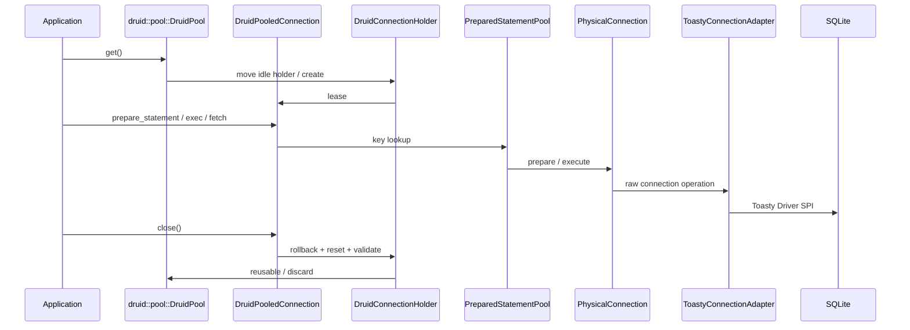

## 7. 验收命令

```bash
./mvnw -pl core -DskipTests=false test
cargo test -p druid --test sqlite_core_semantics_test
cargo test -p druid --test toasty_connection_adapter_test
cargo test -p druid --test wrapper_semantics_test
cargo test -p druid-wrapper --test sqlite_wrapper_semantics_test
cargo test --workspace
cargo llvm-cov --workspace --summary-only
python3 ~/.agents/skills/rust-java-migration/scripts/audit_migration_layout.py \
  --rust-root /Users/wandl/workspaces/workspace-github-easy-4-rust/druid-rust
```

当前全仓覆盖率不是 100%，因此 core 迁移状态保持 `PARTIAL`。

### C1-R2：WrapperAdapter / PoolableWrapper 无损迁移

原 `wrapper.rs` 把 `WrapperAdapter` 与 `PoolableWrapper` 两个 Java 对象压成一个
始终返回 `false` 的字符串判断 trait，既丢失对象边界，也没有实现
`unwrap(Class<T>)`。本切片把平台协议、两个 Druid 对象拆为
`wrapper.rs`、`wrapper_adapter.rs`、`poolable_wrapper.rs` 三个文件：

- `Option<TypeId>` 对应 Java 可空 `Class<?>`；`None` 保留 null 行为。
- `Unwrapped` 显式区分具体运行时对象和 `dyn PhysicalConnection` 接口，避免把
  具体 Adapter 下转冒充 `Connection.class`。
- `PoolableWrapper` 保留空 wrapper、自身、底层对象、
  `DruidStatementConnection#getConnection()` 优先分支及 `WrapperProxy`
  最终委托顺序。
- `DruidPooledConnection` 接入同一协议，可解包自身、内部连接 SPI 和真实
  `SqlxConnectionAdapter`；连接归还后不再暴露已经移出的物理对象。

证据：Java `PoolableWrapperTest` 2/2、`ConnectionTest4` 32/32；
Rust `wrapper_semantics_test` 3/3；真实 SQLite
`sqlite_wrapper_semantics_test` 3/3。这里关闭的是 Wrapper 对象语义，
`WrapperProxy/Impl` 的 attributes/FilterChain 与 metadata 仍保持未完成。
本切片三个生产文件的 Regions/Functions/Lines 均为 100%；实现后 workspace
覆盖率为 Regions 86.95%、Functions 89.64%、Lines 89.84%，全局门禁仍未关闭。

### C3-R7：Prepared/Callable Wrapper 统一

删除 Rust 自造且与 Java 不等价的 `CallableStatementUnwrapTarget` /
`CallableStatementUnwrapped` 双枚举，Prepared 与 Callable 都统一实现
`Wrapper`。`Unwrapped` 现在分别表达具体 raw 对象、`PhysicalPreparedStatement`
和 `PhysicalCallableStatement` 接口：

- 未知类型返回 `None`，对应 Java null，不再错误地返回
  `UnsupportedOperation`。
- Callable 同时可按 CallableStatement、PreparedStatement 和具体驱动类型解包。
- Prepared 可按 PreparedStatement 和具体驱动类型解包。
- 逻辑 statement 关闭后仍保留 raw 类型身份，与 Java PS cache 复用语义一致。

Java `DruidPooledCallableStatementTest`、`CallableStatmentTest`、
`PoolablePreparedStatementTest` 共 28/28 通过；Rust prepared 6/6、callable
2/2 通过；统一协议的真实 SQLite wrapper 3/3 通过。再次执行
`cargo llvm-cov --workspace --summary-only` 后，workspace 覆盖率为 Regions
87.21%（7,170/8,222）、Functions 89.71%（1,090/1,215）、Lines 89.95%
（6,283/6,985），仍有 702 行未覆盖。`wrapper.rs`、
`wrapper_adapter.rs`、`poolable_wrapper.rs` 的 Regions/Functions/Lines 均为
100%；全仓 100% 门禁仍未关闭。ResultSet wrapper 与生产 Proxy/FilterChain
仍按独立账目迁移。

### C2-R8：ExceptionSorter 平台异常与首批 vendor 对象

原 `exception_sorter.rs` 同时定义 trait、MySQL、PG、Null 三个 Java 对象，
且输入被压缩为 `(error_code, message)`，无法表达 Java `SQLException` 的
SQLState、`SQLRecoverableException`、具体异常类名和 cause 链。本切片新增
`SqlException` 平台值对象，并将三个 sorter 拆到各自独立文件：

- MySQL 完整保留 recoverable、SQLState `08`、19 个 fatal error code、
  OceanBase `-9000..=-8000`、`CommunicationsException` 类名、streaming/
  connection 消息，以及最多 5 层 cause 的 socket/communications 判定。
- PostgreSQL 只按 recoverable 或 SQLState `08` 判定；删除旧实现对 `57001`
  数字码和消息文本的错误近似。
- Null 保留共享实例、永不 fatal 与可空 Properties no-op 配置。

DB2、Informix、Sybase 随后按相同协议拆为独立对象，完整保留 recoverable、
SQLState、各自 error code 和可空消息规则。Java vendor oracle 合计 18/18，
Rust `exception_sorter_semantics_test` 6/6 通过；新增的 `SqlException` 与六个
sorter 文件 Regions/Functions/Lines 均为 100%。全仓覆盖率更新为 Regions
87.43%（7,315/8,367）、Functions 89.94%（1,117/1,242）、Lines 90.10%
（6,392/7,094），仍缺 702 行。Oracle、Phoenix、Mock、OceanBase sorter 以及
holder discard 接线仍按后续对象切片迁移，因此
`CORE-CONN-007`/`SEM-CONN-009` 保持 `PARTIAL`。

### C2-R9：Oracle/Phoenix/Mock sorter 与 fatal-discard 主链

本切片继续逐对象迁移剩余五个 Java 对象：
`AbstractOracleExceptionSorter`、`OracleExceptionSorter`、
`OceanBaseOracleExceptionSorter`、`PhoenixExceptionSorter` 和
`MockExceptionSorter`。Oracle 抽象父类没有被合并进具体 sorter，而是成为
独立状态对象，由两个具体对象组合；`SqlException` 新增可赋值类型链，以保留
Mock sorter 的 Java `instanceof` 子类语义。

Oracle/OceanBase 的 recoverable、SQLState、49 个固定 error code、TNS 区间、
正负码、用户配置追加/替换、20000..20999 消息排除及 OceanBase 扩展消息均已
逐分支断言。固定 Java SHA 上的 `OracleExceptionSorter_userDefined`、
`OracleExceptionSorter_userDefined_1`、`OracleExceptionSorterTest`、
`OceanBaseOracleExceptionSorterTest`、`ExceptionSorterTest` 合计 5/5；
连同 C2-R8，vendor Java oracle 为 23/23。Rust
`exception_sorter_semantics_test` 为 10/10。

`DruidError::SqlException` 现可把 Adapter 的结构化数据库错误送入
`DruidPooledConnection#handle_exception`；fatal 命中会同步标记 holder 与
物理 Adapter，exec/fetch/prepared 路径最终只能以 `Discard` 回收。真实
SQLite SQLx 测试已验证 `DatabaseError → SqlException → sorter → Discard`
完整链路。仍未闭合的是所有 Connection 操作的统一错误入口、RBDC/Toasty 的
vendor code/SQLState 提取、ConnectionEventListener 和错误/fatal 统计，因此
`CORE-CONN-007`/`SEM-CONN-009` 继续如实保持 `PARTIAL`。

完整 workspace 覆盖率为 Regions 87.65%（7,657/8,736）、Functions 90.31%
（1,156/1,280）、Lines 90.34%（6,661/7,373），仍有 712 行未覆盖。新增的
abstract/Mock/Phoenix/`SqlException` 文件 Regions/Functions/Lines 均为
100%；Oracle 与 OceanBase 文件 Functions/Lines 为 100%，Regions 分别为
98.46%/98.67%。这说明本切片对象行已覆盖，但全仓 100% 门禁仍远未关闭。

### C2-R10：全 Connection 操作异常入口与 Adapter 结构化错误

Java `DruidPooledConnection` 不只在 execute/query 处理 `SQLException`：
prepare、PreparedStatement close、begin/commit/rollback、savepoint、abort、
ping、auto-commit/read-only/isolation/holdability、warning、catalog 和 schema
操作也必须进入 `handleException`。本切片在 Rust 池化连接内收敛
`classify_result`，并让上述 23 条物理连接操作路径以及 filter 前置错误都经过
同一分类入口。Rust `pooled_connection_exception_paths_test` 逐路径创建独立连接，
验证原始 `SqlException` 返回值不被替换，且 fatal 命中同步标记 holder 与物理
Adapter discard。

固定 Java 基线执行全部
`OracleExceptionSorterTest*`、`OracleExceptionSorter_userDefined*` 和
`OceanBaseOracleExceptionSorterTest`，结果 53/53 通过；这组 oracle 同时覆盖
Connection 与 Statement 异常导致连接丢弃的参考行为。Rust 侧本切片只完成
`PhysicalConnection` 已公开操作的统一入口；Java Statement 全方法族仍按
`CORE-CONN-003` 独立迁移，不能由这 53 个 Java 测试反推为 Rust 已完成。

Adapter 边界不再把所有数据库错误降级成 `DriverError(String)`：

- Toasty `DriverOperationFailed` 映射为 `SqlException`，真实 SQLite 语法错误
  已验证；`ConnectionLost` 继续映射为强制丢弃。
- RBDC 4.9 的公开错误类型只有 `rbs::Error::E(String)`，因此保留消息和
  `rbdc::Error` 运行时身份，vendor code/SQLState 如实为未知值，未伪造解析。
- SQLx 继续保留其公开的 database code/SQLState/message；三类 Adapter 的信息
  上限不同，后续多数据库矩阵必须分别验收。

三 crate workspace 全目标 451/451 通过，真实 SQLite 的 Toasty 结构化错误与
SQLx fatal-discard 回归均通过。覆盖率为 Regions 87.80%（7,707/8,778）、
Functions 91.33%（1,170/1,281）、Lines 90.49%（6,687/7,390），仍有 703 行
未覆盖。ConnectionEventListener、错误/fatal 统计、Statement 全操作以及
Toasty/RBDC 上游未公开的 vendor 字段仍未闭合，故
`CORE-CONN-007`/`SEM-CONN-009` 保持 `PARTIAL`，全仓 100% 门禁继续未关闭。

### C2-R11：PreparedStatement 关闭清理异常

Java `DruidPooledConnection#closePoolableStatement` 在缓存归还前调用物理语句的
`clearParameters` 和 `clearBatch`；任一步抛出 `SQLException` 都必须进入连接
sorter，fatal 时丢弃连接，异常语句也不得重新进入 cache。Rust 新增
`DruidPooledPreparedStatement#close_with_connection`：显式验证同一租约，
依 Java 顺序执行两步清理，并用连接统一分类入口原样返回结构化错误。

Rust 分别注入 `clearParameters` 与 `clearBatch` 的 MySQL fatal error，2/2
验证 holder/物理 Adapter discard、异常 statement cache 淘汰和 pool
`discard_count`。全 workspace 全目标更新为 453/453。覆盖率为 Regions
87.82%（7,737/8,810）、Functions 91.42%（1,172/1,282）、Lines 90.52%
（6,713/7,416），未覆盖行仍为 703。无连接参数的兼容 `close`、尚未建立的
`DruidPooledStatement` 约 50 方法、result-set trace 与属性恢复仍使
`CORE-CONN-003` 保持 `PARTIAL`。

### C2-R12：普通 Statement 对象边界与 SQLite 纵向链路

纠正旧 `ConnectionExt#create_statement` 返回 `PhysicalConnection` 的对象边界：
新增独立 `physical_statement.rs`，以 `PhysicalStatement` 表达
`java.sql.Statement` 的属性、批次和资源生命周期；SQL 仍由创建它的
`PhysicalConnection` 执行，Adapter 不持有第二连接或第二连接池租约。

新增 canonical `druid_pooled_statement.rs`，并在 `DruidPooledConnection`
建立 `create_statement`、`create_statement_with_result_set`、
`create_statement_with_holdability` 三个 Java 重载入口。当前已经闭合：

- 同租约身份校验，连接归还后旧 Statement 不能污染下一租约；
- 真实 Toasty SQLite query、update、generated-id `ExecResult` 与 batch；
- max field/rows、query timeout、fetch direction/size、cursor、escape、
  poolable、close-on-completion 与幂等 close；
- self、`dyn PhysicalStatement` 和具体 `SqlTextStatement` 解包。

Java 参考仓库运行 `ConnectionTest4` 32/32、两个 recycle 类 3/3，共 35/35；
Rust 新增真实 SQLite/生命周期测试 5/5，全 workspace 更新为 458/458。
覆盖率为 Regions 88.14%（8,342/9,465）、Functions 91.93%
（1,265/1,376）、Lines 90.91%（7,250/7,975），仍缺 725 行。

本切片不把对象创建等同于全对象完成：Java `execute` 四重载及多结果状态、
`getResultSet/getGeneratedKeys` 的 `DruidPooledResultSet` trace、SQLWarning、
Filter statement 事件和统计尚未迁移，因此 `CORE-CONN-010` 为 `PARTIAL`，
全仓 100% 门禁继续未关闭。

### C2-R13：DruidPooledResultSet 只读游标与 trace 主链

新增 canonical `druid_pooled_result_set.rs`，并把 `java.sql.ResultSet`
平台能力落到独立 `PhysicalResultSet` SPI 与 `RowSetResultSet` eager Adapter。
这不是把 `Vec<Row>` 改名充数：当前纵向链路已经闭合以下可观察语义：

- `DruidPooledStatement#executeQuery` 返回持有同一 Statement 身份的池化结果集；
- `next/previous` 只在成功移动时维护 `cursorIndex`，历史
  `fetchRowCount` 峰值在 ResultSet close 或 Statement 级联 close 时回写；
- Statement trace 使用弱物理引用与共享关闭状态，避免引用环，同时保证级联
  close 会关闭包装对象，而不只是关闭 raw SPI；
- 1-based 列索引、SQL NULL/`wasNull`、基础布尔/整数/浮点/字符串/BLOB
  getter、index/label 重载、ASCII/Unicode/binary/character/NCharacter getter、
  只读滚动游标、warning、metadata、fetch 属性及 type/concurrency/holdability；
- self/`dyn PhysicalResultSet` unwrap、同租约校验、关闭后拒绝和物理错误统一
  进入连接 sorter/Statement 异常计数；
- Java 当前 mock 对 typed `getObject(int/String, Class<T>)` 的
  `SQLFeatureNotSupportedException` 被保留为明确 unsupported。

Java `DruidPooledResultSetTest` 4/4 与 `ResultSetTest2` 36/36 通过；Rust
ResultSet 6/6，其中真实 Toasty SQLite 验证 DDL/DML/query、
NULL/INTEGER/REAL/TEXT/BLOB、流 getter、错误与生命周期。全 workspace 为
464/464。布局审计为
`scanned=102 errors=0 warnings=0 allowed=0 semantic_parity_proven=false`。

覆盖率为 Regions 85.37%（9,624/11,273）、Functions 88.86%
（1,436/1,616）、Lines 87.82%（8,221/9,361），仍缺 1,140 行。分母增加是
因为保留了 ResultSet 的完整 SPI 能力边界和明确 unsupported 默认分支；不能
删除未覆盖的真实分支来美化百分比。Java 对象 192 个公开方法中的 scalar
update、LOB/Array/Ref/RowId/SQLXML、Calendar/Map、stream update、
完整 metadata 与 Filter/统计事件仍未迁移，
所以 `DruidPooledResultSet`、C3 和全仓 100% 门禁均保持 `PARTIAL`。

### C2-R14：ResultSet 强类型值与内置/扩展 Adapter 纵向闭环

以 Java `DruidPooledResultSet` 的 16 个强类型 getter 重载为冻结范围，新增
`JdbcCalendar`/`JdbcCalendarArgument` canonical 对象，并把
`BigDecimal`、`Date`、`Time`、`Timestamp` 纳入 core `Value` 与结果集
metadata。池化门面不自行猜测重载：index/label、deprecated scale、无
Calendar 重载、显式 null Calendar 和具体时区标识均原样下沉到
`PhysicalResultSet`，物理错误仍统一经过 Statement `checkException` 路径。

同一类型身份已同步到三个数据源边界：

- 内置 Toasty SQLite 使用声明列类型恢复 `NUMERIC/DECIMAL` 与
  `DATE/TIME/DATETIME/TIMESTAMP`，不再把强类型静默压成字符串；
- SQLx SQLite 使用 chrono 原生绑定；SQLite NUMERIC affinity 若实际存为
  REAL，则 Adapter 如实返回 `Float`，随后由 JDBC `getBigDecimal` 语义转换，
  不伪造驱动返回类型；
- RBDC 使用 `Decimal/Date/Time/DateTime` extension 保留边界类型；
- SQLx `Any` 没有统一强类型 encoder 的路径明确返回
  `UnsupportedOperation`，避免跨数据库错误绑定。

Toasty 0.9 SQLite vendor compatibility patch 同时移除了强类型路径中的
`todo!`、生产 `unwrap/assert/unreachable`，改为结构化 driver error；其独立
unit/doc tests 4/4 通过。Java oracle 为 `DruidPooledResultSetTest`、
`ResultSetTest`、`DruidPooledResultSetTest2` 合计 54/54；Rust ResultSet
9/9、Toasty 5/5、SQLx SQLite 5/5、RBDC 5/5，且全 workspace 测试通过。
布局审计为
`scanned=118 errors=0 warnings=0 allowed=0 semantic_parity_proven=false`。

`cargo llvm-cov --workspace --summary-only` 的当前实测为 Regions 83.69%
（10,092/12,059）、Functions 87.22%（1,474/1,690）、Lines 86.73%
（8,629/9,949）。新增强类型与三 Adapter 失败分支扩大了真实分母；距离
100% 仍有 1,320 行，不能把本切片写成整体完成。下一批继续闭合 ResultSet
的 LOB/Array/Ref/RowId/SQLXML/URL 与 update 方法族。

### C2-R15：ResultSet 资源 getter 与对象型 update 重载

继续冻结 Java `DruidPooledResultSet` 的资源对象方法，新增并验证：

- `getRef/getBlob/getClob/getArray/getURL/getRowId/getNClob/getSQLXML`
  的 index/label 共 16 个重载；
- `updateRef/updateBlob/updateClob/updateArray/updateRowId/updateNClob/
  updateSQLXML` 的对象型 index/label 共 14 个重载；
- Java null 以 `Option<&Jdbc*>` 原样进入物理 SPI，不用空字节、空字符串或
  默认资源对象替代；
- 每个方法均独立保留 index/label 委托身份，异常继续增加 Statement
  `exceptionCount` 并进入连接异常分类。

真实 Toasty SQLite 行集没有 JDBC LOB/Ref/Array/RowId/SQLXML 资源句柄，也
不是可更新游标，因此 30 个入口逐一返回明确 `UnsupportedOperation`；测试随后
继续读取同一游标，证明非 fatal 能力错误未错误丢弃连接。测试替身另外验证全部
参数原样进入 `PhysicalResultSet`。这属于 Druid wrapper 的等价委托和真实
Adapter 能力边界，不把 SQLite 不具备的 JDBC 能力伪装成成功。

全 workspace 470/470 通过。最新
`cargo llvm-cov --workspace --summary-only` 为 Regions 84.15%
（10,528/12,511）、Functions 87.76%（1,548/1,764）、Lines 87.37%
（9,133/10,453），仍缺 1,320 行。Reader/InputStream 型 LOB update、
scalar/stream update、Map `getObject`、完整 metadata/Filter/统计仍未闭合，
所以 ResultSet 与 100% 门禁保持 `PARTIAL`。

### C2-R16：ResultSet LOB 流式 update 重载

补齐 Java `updateBlob(InputStream)`、`updateClob(Reader)`、
`updateNClob(Reader)` 的 index/label、无长度/long 长度共 12 个重载。
`JdbcStreamLength` 与 `JdbcCharacterLength` 区分 `Unspecified` 和
`Long(length)`，null 流/Reader 原样下沉，池化层不预读、不校正长度。

参数身份测试覆盖全部 12 个入口；真实 Toasty SQLite 对 12 个不可更新游标
路径返回明确 unsupported，累计 42 个资源 getter/update 能力错误后同一游标
仍可继续读取。全 workspace 470/470 通过。最新覆盖率为 Regions 84.38%
（10,714/12,697）、Functions 87.96%（1,578/1,794）、Lines 87.70%
（9,415/10,735），未覆盖行仍为 1,320。scalar/character/binary stream update、
Map `getObject`、完整 metadata/Filter/统计仍未闭合。

### C2-R17：ResultSet 标量/流 update 与 Map getObject 重载

冻结并迁移 Java `DruidPooledResultSet` 的剩余 56 个标量/流更新重载：

- `updateNull`，13 个标量 `updateXxx`，两种 `updateObject` 与
  `updateNString`，均保留 index/label 两套入口；
- ASCII/Binary stream 的无长度、`int`、`long` 重载，Character stream 的
  无长度、`int`、`long` 重载，以及 NCharacter stream 的无长度、`long`
  重载；
- 独立 `ResultSetUpdate` 描述符保留 setter 类型、Java `null`、原始负长度和
  `int/long/未指定` 重载身份；`JdbcInputStream`/`JdbcReader` Clone 只共享
  句柄，不提前读取或关闭；
- `getObject(int/String, Map<String, Class<?>>)` 两个重载直接下沉到
  `PhysicalResultSet`，并区分 index/label 与 `Some/None` Map。

参数身份测试逐一覆盖 58 个入口。真实 Toasty SQLite 逐一返回明确
`UnsupportedOperation`，58 次错误全部增加同一 Statement 的
`exceptionCount` 并进入连接异常分类；随后同一结果集仍能读取下一行，证明
非 fatal 能力错误没有破坏游标或流句柄。Java 三组 ResultSet oracle 54/54，
Rust ResultSet 12/12，全 workspace 473/473 通过；布局审计为
`scanned=119 errors=0 warnings=0 allowed=0 semantic_parity_proven=false`。

最新 `cargo llvm-cov --workspace --summary-only` 为 Regions 84.66%
（10,958/12,943）、Functions 88.18%（1,612/1,828）、Lines 88.14%
（9,808/11,128），仍有 1,320 行未覆盖。完整 ResultSet metadata、
typed `getObject` 的真实驱动转换、Filter/统计、streaming 与多数据库矩阵仍
开放；`updateObject` 当前承载已迁移的 `Value` 类型，任意 vendor custom
object 仍需独立不透明句柄。因此 ResultSet 和全仓 100% 门禁保持 `PARTIAL`。

### C2-R18：typed getObject 与 JDBC Object 平台对象

本切片把此前仅有方法名称、但固定返回 unsupported 的
`getObject(int/String, Class<T>)` 改为真实 `PhysicalResultSet` SPI：

- `JdbcTargetType` 无损表达 Java `Class<T>` 目标，index/label 两个重载均把
  原始目标类型下沉到物理结果集；默认实现覆盖 String、Boolean、Byte、Short、
  Integer、Long、Float、Double、BigDecimal、Date、Time、Timestamp、Bytes
  与 SQL NULL；
- Blob、Clob、NClob、Array、Ref、RowId、SQLXML、URL 目标委派相应资源
  getter，不把资源静默物化为字符串或字节；
- 新增 `JdbcOpaqueObject`/`PhysicalJdbcOpaqueObject`，以 `Arc` 保留
  driver/vendor 自定义对象的引用身份、类名和受控 downcast；
  `ResultSetUpdate::Object` 及 `updateObject` 不再限制为 `Value`；
- 通用平台名称统一为 `JdbcObject`、`JdbcTargetType`、`JdbcTypeMap`。
  `CallableOutputValue`、`CallableTargetType`、`CallableTypeMap` 仅保留兼容
  alias，不再作为 canonical 名称。

真实 Toasty SQLite 验证 13 个标准标量目标、SQL NULL、byte 越界错误和
custom unsupported；目标类型身份测试验证 index/label 原样委托，资源测试
验证八种默认 getter 分派。Toasty 当前 fetch API 未保留列标签元数据，因此
真实 SQLite 只验证 index typed overload；label 身份已由原始 SPI probe
闭合，真实 label 集成仍是公开缺口。

证据：Java 三组 ResultSet oracle 54/54、Rust ResultSet 16/16、全 workspace
477/477、普通 `cargo clippy --workspace --all-targets` 退出码 0；严格
`-D warnings` 仍受全仓 324 个既有 lint 债务阻塞。布局审计为
`scanned=120 errors=0 warnings=0 allowed=0 semantic_parity_proven=false`。
覆盖率为 Regions 84.21%（11,180/13,277）、Functions 87.82%
（1,636/1,863）、Lines 87.87%（9,930/11,301），仍有 1,371 行未覆盖。
完整 metadata、真实 label metadata、Filter/统计、streaming 和多数据库矩阵
仍开放，因此 ResultSet 与全仓 100% 门禁继续保持 `PARTIAL`。

### C2-R19：ResultSetMetaData 标准列契约

`java.sql.ResultSetMetaData` 不再压缩为 label/type/nullable 三字段对象：

- `ResultSetColumnType` 独立映射当前可无损区分的 `java.sql.Types` 数值、
  标准类型名、默认 Java class name 与 signed 语义；
- `ResultSetNullability` 独立保留 `columnNoNulls`、`columnNullable`、
  `columnNullableUnknown` 三态，避免用 bool 丢失 unknown；
- `ResultSetColumnMeta` 独立保存 label/name、schema/table/catalog、
  vendor type/class、display size/precision/scale，以及 autoIncrement、
  caseSensitive、searchable、currency、signed、readOnly/writable/
  definitelyWritable；
- `ResultSetMetaData` 对外补齐上述 Java 标准 getter，并统一执行 1-based
  下标验证。RowSet 默认只填充它确实知道的字段，未知 origin/shape 为空或零，
  不从 SQL 文本猜测。

Toasty 0.9 `Response` 只提供值流，没有公开列名和 origin descriptor，因此
真实 SQLite 仍只能验证运行时类型和 eager RowSet 默认 metadata；schema、
table、catalog、真实 label/type name 必须等待 Adapter 上游提供 descriptor。

证据：Rust ResultSet 17/17、全 workspace 478/478、普通 Clippy 退出码 0；
布局审计 `scanned=123 errors=0 warnings=0 allowed=0`。覆盖率为 Regions
84.33%（11,395/13,512）、Functions 88.01%（1,666/1,893）、Lines 88.05%
（10,101/11,472），仍有 1,371 行未覆盖。三个新 descriptor 文件行覆盖
100%，`ResultSetMetaData` 方法行覆盖 100%；真实驱动 metadata 供给、
Wrapper、Filter/统计、streaming 和多数据库仍为 `PARTIAL`。

### C2-R20：ResultSetMetaData 物理对象身份与错误时机

CodeGraph 复核确认，Java `DruidPooledResultSet#getMetaData()` 直接返回底层
driver 的 `ResultSetMetaData`，不会提前复制列描述。因此物理 metadata 的每个
getter 必须在调用时委托，driver 错误也必须在对应 getter 调用时发生，不能被
eager snapshot 吞掉或提前触发。

本切片新增独立 `PhysicalResultSetMetaData` SPI，并将 canonical
`ResultSetMetaData` 改为双后端句柄：

- eager `ResultSetColumnMeta` 后端继续服务 `RowSetResultSet`；
- physical 后端以共享句柄保存真实 driver metadata，全部标准 getter 逐次委托；
- `Wrapper` 同时保留 `ResultSetMetaData` 自身、`dyn
  PhysicalResultSetMetaData` 接口和具体 driver metadata 对象身份；
- `getColumnCount` 与其他 getter 一样返回结构化错误，保持 Java
  `SQLException` 时机；物理句柄 clone 共享同一对象，不复制 driver 状态。

证据：Java 三组 ResultSet oracle 54/54；Rust ResultSet 18/18；全 workspace
479/479；普通 Clippy 退出码 0。布局审计
`scanned=124 errors=0 warnings=0 allowed=0 semantic_parity_proven=false`。
覆盖率为 Regions 84.35%（11,560/13,705）、Functions 88.02%
（1,675/1,903）、Lines 87.98%（10,207/11,602），仍有 1,395 行未覆盖。

Toasty 0.9 仍未公开列名/origin descriptor，所以真实 SQLite 当前只能走
eager 运行时 metadata，不能冒充已具备真实 driver descriptor。Filter/统计、
streaming、多数据库和全仓覆盖率 100% 仍开放，整体状态保持 `PARTIAL`。

### C2-R21：JdbcResultSetStat 独立统计对象

CodeGraph 冻结 `JdbcResultSetStat` 全字段与 `StatFilter#resultSet_close` 调用链
后，新增同名独立 Rust 对象，完整保留 opening/open/error、存活纳秒
total/max/min、最近打开/错误时间、fetch row 和 close counter。并发峰值沿用
Java CAS 更新，错误对象保留结构化 `DruidError`。

本对象还刻意保留两个容易被误修的 Java 行为：`reset()` 不清零当前
`openingCount`；`aliveNanoMin` 从 0 开始且仅在新值更小时更新，所以正耗时
关闭后最小值仍为 0。Java 原类 JShell oracle 与 Rust 状态序列一致，并补充
16 线程并发峰值/关闭守恒测试。

证据：Java oracle 1/1、Rust 对象测试 2/2、全 workspace 481/481、普通
Clippy 退出码 0；布局审计
`scanned=125 errors=0 warnings=0 allowed=0 semantic_parity_proven=false`。
覆盖率为 Regions 84.51%（11,765/13,922）、Functions 88.17%
（1,700/1,928）、Lines 88.04%（10,341/11,746），仍有 1,405 行未覆盖。

当前仅完成统计对象本身；`StatFilter → ResultSetProxy → physical ResultSet`
的 open/close/error 接线、SQL 级 hold/read length 统计与管理面尚未迁移，
所以统计链路和整体状态均保持 `PARTIAL`。

### C2-R22：ResultSet 同步 FilterChain 与统计纵向接线

Java `ResultSetProxyImpl` 的 `resultSet_*` 是同步 around-chain：Filter 能在
委托前后执行、短路或改写结果，并非只读事件通知。本切片新增独立
`ResultSetFilter`、`ResultSetFilterChain` 与 `ResultSetFilterContext`：

- 每次 `next/close` 都从 chain 位置 0 开始，Filter 按注册顺序进入、按调用栈
  逆序退出；`resultSetOpenAfter` 按逆序执行；
- `next` 可短路而不调用物理 ResultSet；下游错误不会执行上游 after 代码；
- context 保留 Java `constructNano`、`fetchRowCount`、`closeCount` 时机；
- 连接创建 Statement 时传递同一 FilterChain，显式关闭与 Statement trace
  级联关闭均经过同一结果集链；
- `StatFilter` 在 open 时调用 `beforeOpen`，close 时严格在物理 close 前提交
  hold/fetch/close。下游 close 失败时这些统计不回滚，而代理 closeCount 只有
  成功后才增加；
- `JdbcResultSetStat#error()` 没有被 Java 当前 StatFilter ResultSet 链调用，
  Rust 不擅自把所有 getter 错误计入该字段。

Java oracle 覆盖池化 Statement/ResultSet、LogFilter 与 StatFilter，共 95/95；
Rust 新链路 4/4，包含顺序、短路、错误展开、默认委托与真实 Toasty SQLite
显式/Statement 级联关闭。全 workspace 485/485，普通 Clippy 退出码 0；
布局审计
`scanned=128 errors=0 warnings=0 allowed=0 semantic_parity_proven=false`。

覆盖率为 Regions 84.78%（11,967/14,116）、Functions 88.46%
（1,732/1,958）、Lines 88.23%（10,480/11,878），仍有 1,398 行未覆盖。
三个新增 ResultSet Filter 文件和 `StatFilter` 均达到行/函数/Regions 100%。
完整 ResultSet getter/update Filter 方法族、SQL 级 hold/read length 统计、
`StatFilterContext` 监听器、完整 `FilterChainImpl`、多数据库与全仓 100%
仍为 `PARTIAL`。

### C2-R23：StatFilterContext / Listener 与 ResultSet 全局事件

本切片新增同名独立 `StatFilterContext` 与 `StatFilterContextListener`，并以
CodeGraph 和 Java JShell oracle 冻结真实行为：

- context 是进程级单例；listener 允许同一实例重复注册，删除只移除第一个
  相同实例；
- 写操作复制并替换列表，但 Java 分发使用反复求值的 `size()/get(i)` 下标
  循环，并非 iterator 固定快照；因此回调中追加 listener 会参与当前轮分发；
- 14 个事件方法全部迁移，可空 `Throwable` 映射为
  `Option<&DruidError>`；首个 listener 异常立即中止后续 listener 和当前调用；
- `StatFilter` 的 ResultSet open 在本地 `beforeOpen/setConstructNano` 后触发
  全局 open；close 严格按“全局结果集统计 → context fetch → 物理 close →
  context close”执行，物理 close 失败时不发送 context close；
- ResultSet open listener 失败会从池化 Statement API 原样返回，且已发生的
  `beforeOpen` 不回滚，与 Java unchecked exception 时序一致。

Java 既有 ResultSet/Statement/Filter oracle 95/95；JShell 动态追加、重复注册
与首次删除 oracle 3/3。Rust 新 context 测试 3/3，覆盖全部事件、动态增补、
异常短路和真实 Toasty SQLite；全 workspace 488/488，普通 Clippy 退出码
0；布局审计
`scanned=130 errors=0 warnings=0 allowed=0 semantic_parity_proven=false`。

覆盖率为 Regions 84.98%（12,151/14,299）、Functions 88.67%
（1,769/1,995）、Lines 88.37%（10,615/12,012），仍有 1,397 行未覆盖。

`StatFilterContextListenerAdapter` 仍是明确的独立缺口；commit/rollback、
pool/physical connection、SQL execute 与 LOB 事件虽已具备 context 分发方法，
尚未全部接入生产调用链。完整 `FilterChainImpl`、多数据库与全仓覆盖率 100%
仍开放，整体保持 `PARTIAL`。

### C2-R24：ListenerAdapter 与 SQL/事务全局事件时序

本切片先以 CodeGraph 冻结 `StatFilter`、`DruidPooledConnection` 和
`StatFilterContextListenerAdapter` 的 Java 调用路径，再按对象与行为迁移：

- 新增独立具体对象 `StatFilterContextListenerAdapter`，显式实现 14 个无操作
  回调，不能以 Listener trait 的默认方法冒充；
- `ExecContext` 增加 `in_transaction` 与 query/update 操作类型；
  `StatFilter` 在物理 SQL 前发送 execute before，在本地统计完成后依次发送
  update count 和 execute after；
- `FilterChain::add_filter` 将同一个 Java 风格 Filter 实例注册到 SQL、
  connection 和 ResultSet 三类 hook，避免调用方漏接其中一族；
- after 按反向顺序首错中止并传播。before listener 失败时 SQL 尚未执行；
  after listener 失败可覆盖成功返回，但 SQL 副作用已经发生；
- commit/rollback 只在物理操作成功后发送全局事件；listener 失败可以覆盖
  返回，但事务副作用已经发生；保存点 rollback 不发送全局 rollback。

Java Maven 扩展 oracle 97/97；真实 MockDriver JShell oracle 同时验证
auto-commit、事务 execute/update/after、commit、rollback 与 SQL 错误顺序。
Rust 全 workspace 489/489，包含真实 SQLite 的 SQL、完整事务、保存点及四类
listener 失败边界；普通 Clippy 退出码 0（仓库既有 warnings 未清零），格式检查
通过。布局审计
`scanned=131 errors=0 warnings=0 allowed=0 semantic_parity_proven=false`。

覆盖率为 Regions 85.09%（12,250/14,396）、Functions 88.70%
（1,789/2,017）、Lines 88.45%（10,704/12,102），仍有 1,398 行未覆盖；
新增 Adapter 行/函数/Regions 均为 100%。

本轮只关闭已接入口的精确时序。Java batch 的单次 before/after 与
`int[]` update count、generic execute、pool connect/close、physical
connect/close、LOB 事件、无活动事务时 pooled rollback 边界及完整
`FilterChainImpl` 仍开放，整体保持 `PARTIAL`。

### C2-R25：普通 Statement batch 精确 Filter/统计语义

本切片用 CodeGraph 冻结
`DruidPooledStatement → StatementProxyImpl → FilterChainImpl →
FilterEventAdapter → StatFilter` 的 batch 纵向链，并以 Java MockDriver JShell
补足运行时 oracle。迁移结果：

- `PhysicalConnection::exec_batch` 形成一次物理 batch 边界，返回 JDBC
  `Vec<i32>`，允许 `SUCCESS_NO_INFO=-2` 与 `EXECUTE_FAILED=-3`；
- `DruidError::BatchUpdateException` 保存失败前的部分 `int[]` 和原始 SQL
  cause，fatal sorter 递归检查 cause；
- `BatchExecContext` 保存原始 SQL 列表、`"\n;\n"` 合并 SQL、数据源、事务态
  和开始时间；Filter 链只执行一次 before 与一次反向 after；
- `StatFilter` 成功时逐项发送 update count。普通 Statement 的 Java
  `lastExecuteSql` 在成功 batch 后仍为 null，因此 after SQL 用
  `Option<&str>::None` 精确保留；失败时 after 使用合并 SQL 和
  `BatchUpdateException`；
- 多元素 batch 后 `getUpdateCount()` 为 `-1`，单元素时设置该唯一计数；
  batch 不被隐式清空；
- batch count/size total 已进入 `StatsCollector`。after listener 失败会覆盖
  返回值，但真实 SQLite 的全部物理副作用已经发生。

Java 扩展 Maven oracle 100/100；JShell oracle 得到成功 `[1,-2]`、部分失败
`[1]`，事件严格为
`before(merged) → update:1 → update:-2 → after(null,null)` 和
`before(merged) → after(merged,BatchUpdateException)`。Rust workspace
491/491，真实 SQLite 验证成功、部分失败、nullable SQL、单/多元素
updateCount 与 listener 覆盖时序；普通 Clippy 退出码 0（既有 warnings
未清零），格式与 diff 检查通过。布局审计
`scanned=131 errors=0 warnings=0 allowed=0 semantic_parity_proven=false`。

覆盖率为 Regions 85.21%（12,385/14,534）、Functions 88.80%
（1,807/2,035）、Lines 88.54%（10,804/12,203），仍有 1,399 行未覆盖。
本轮新增生产行已覆盖；全仓 100% 门禁仍未关闭。

PreparedStatement 参数快照 batch、driver 原生 batch 覆盖、多数据库
`-2/-3` 返回、generic execute、pool/physical/LOB 事件、完整
`FilterChainImpl` 和覆盖率 100% 继续开放，整体保持 `PARTIAL`。

### C2-R26：PreparedStatement 参数快照 batch 精确语义

本切片先用 CodeGraph 冻结
`DruidPooledPreparedStatement → PreparedStatementProxyImpl →
StatementProxyImpl#executeBatch → FilterChainImpl →
FilterEventAdapter → StatFilter` 的完整调用链，再用 Druid +
xerial SQLite JShell 获取运行时 oracle。源码和运行时共同确认：

- `addBatch()` 由物理 PreparedStatement 在调用时保存参数快照；
  `clearParameters()` 不影响已经加入的批次；
- PreparedStatement 的 `getBatchSql()` 固定返回预编译 SQL，但继承的
  `batchSqlList` 从未加入参数批次，因此 StatFilter 的 batch size 精确为 0；
- PreparedStatement 覆盖 `getLastExecuteSql()`，成功和失败 after 回调都使用
  固定预编译 SQL，与普通 Statement 成功 after 的 `null` 不同；
- xerial SQLite 在成功和驱动失败后均消费批次，before Filter 短路则尚未进入
  驱动，不得消费；成功逐项发送 update count。

Rust 迁移新增 `BatchExecKind::PreparedStatement` 和
`BatchExecContext.parameter_sets`，`DruidPooledPreparedStatement` 提供
`add_batch/clear_parameters/clear_batch/execute_batch/batch_size`，
`PhysicalConnection::exec_prepared_batch` 提供可由 SQLx/RBDC 等 Adapter
覆盖的原生边界；默认实现复用同一物理 PreparedStatement 顺序执行，失败用
`BatchUpdateException` 保存已完成计数和结构化 cause。外部池
`PhysicalConnectionLease` 透明委托该能力。

Java xerial SQLite oracle 精确得到：

- success `[1,1]`，参数行 `[1:first,2:second]`；
- 执行后 repeat `[]`，单项 clear 后 `[1]`；
- 冲突错误 `SQLiteException`，错误后 repeat `[]`；
- SQL stat batch size `0:0`；
- 每次 Filter 事件均为固定 prepared SQL，成功逐项 update 后 after。

Java Prepared/Filter Maven 目标用例 10/10；Rust workspace 494/494。真实
Toasty SQLite 验证参数快照、clearParameters 独立性、执行后消费、部分成功
计数、before 短路重试、固定 SQL after 和 Java 零 batch-size；普通 Clippy
退出码 0（仓库既有 warnings 未清零），格式和 diff 检查通过。布局审计继续为
`scanned=131 errors=0 warnings=0 allowed=0 semantic_parity_proven=false`。

覆盖率为 Regions 85.31%（12,544/14,704）、Functions 88.82%
（1,819/2,048）、Lines 88.64%（10,920/12,320），仍有 1,400 行未覆盖。
`PhysicalPreparedStatement` 与 `PhysicalConnectionLease` 当前均为
行/函数/Regions 100%；全仓 100% 门禁尚未关闭。

SQLx/RBDC/PostgreSQL/MySQL 原生 prepared batch、`-2/-3` 驱动矩阵、完整
JDBC setter 状态、generic execute、pool/physical/LOB、完整
`FilterChainImpl` 和全仓覆盖率 100% 继续开放，整体保持 `PARTIAL`。

### C2-R27：普通 Statement generic execute、多结果与 generated keys

本切片先用 CodeGraph 冻结
`DruidPooledStatement → StatementProxyImpl → FilterChainImpl →
FilterEventAdapter → StatFilter` 的普通 `execute` 纵向链，再用 Druid +
xerial SQLite 运行时 oracle 校准 getter、推进和异常发生时机。迁移后的状态机：

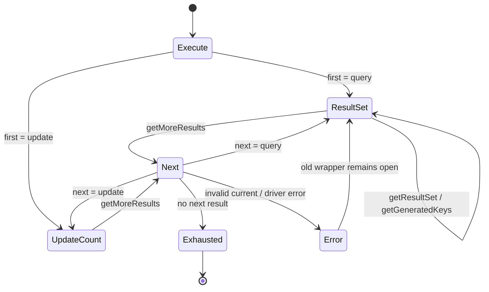

`DruidPooledStatement` 现在提供 plain、auto-generated-keys、column-indexes 和
column-names 四种 execute 入口；`StatementExecuteResult` 保存有序的 query /
update 结果，`PhysicalStatement` getter/推进钩子保留 Java 的驱动错误时机。
成功推进只逻辑关闭旧的池化 ResultSet wrapper，不额外发显式 close hook；
推进失败保持旧 wrapper 开放。generic DML 的 StatFilter 只累加 SQL 级
update count，不错误发送全局 update-count listener。

Toasty SQLite 使用 `RawSqlRet::Infer`，由 prepared statement 的
`column_count` 判断 query/update，不靠 SQL 前缀猜测；普通与
`RETURN_GENERATED_KEYS` INSERT 均返回真实 `last_insert_rowid`。列索引/列名
选择在 Toasty SQLite 明确返回 unsupported，与 xerial SQLite oracle 一致。
mock 物理连接另行验证 query → update → query 顺序多结果与重载参数原样传递。

Java Maven 定向用例 42/42；xerial SQLite JShell 验证 SELECT、INSERT、
generated keys、成功/失败 `getMoreResults` 及 wrapper 关闭边界。Rust
workspace 497/497，真实 SQLite 和 mock 多结果测试通过；普通 Clippy 退出码
0（既有 warnings 未清零），格式检查通过。布局审计仍为
`scanned=131 errors=0 warnings=0 allowed=0 semantic_parity_proven=false`。

覆盖率为 Regions 85.64%（12,920/15,087）、Functions 88.96%
（1,853/2,083）、Lines 88.92%（11,213/12,610）。其中
`physical_statement.rs` 和 `physical_connection_lease.rs` 行/函数/Regions
均为 100%；`druid_pooled_statement.rs` 为 Functions 100%、Lines 99.35%。

PreparedStatement generic execute、SQLWarning、SQLx/RBDC/PostgreSQL/MySQL
原生多结果与 generated-key 矩阵、完整 FilterChainImpl 和全仓覆盖率 100%
继续开放，整体保持 `PARTIAL`。

### C2-R28：PreparedStatement generic execute、多结果与 generated keys

本切片用 CodeGraph 逐层冻结
`DruidPooledPreparedStatement → PreparedStatementProxyImpl →
FilterChainImpl → FilterEventAdapter → StatFilter`，并用 Druid +
xerial SQLite 运行时 oracle 校准 PreparedStatement 独有的 generated-key
重载差异。PreparedStatement 现在复用 Statement 状态机，但仍通过同一个
物理 prepared handle 执行固定 SQL 与参数：

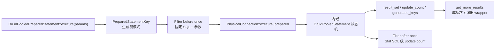

`PreparedStatementKey` 的 auto-generated-keys、column-indexes 和
column-names 模式会原样进入物理 SPI；与普通 Statement 不同，xerial
SQLite 接受 PreparedStatement 的列索引/列名重载。Toasty SQLite 因此对
PreparedStatement 三种生成键模式均返回真实 `last_insert_rowid`，而普通
Statement 的列选择器仍保持驱动一致的 unsupported。默认物理 SPI 不猜测 SQL，
没有 generic execute 能力的 Adapter 明确返回 unsupported。

成功 `getMoreResults` 关闭旧的池化 ResultSet wrapper；非法 current 或驱动
getter/推进失败时保持旧 wrapper 状态，并由连接 exception sorter 决定物理连接
是否丢弃。Filter 的 before/after/error 各执行一次，事件中固定 SQL、参数和
`ExecOperation::Execute` 均与 Java 一致；generic DML 仅增加 SQL 级 update
count，不发送错误的全局 update-count 事件。

Java Prepared/Filter Maven 定向用例 46/46；Druid + xerial SQLite oracle
验证 SELECT、INSERT、四种生成键入口、成功推进及非法 current 的 wrapper
边界。Rust workspace 覆盖执行了 500/500 个测试；真实 Toasty SQLite 覆盖
SELECT/INSERT/生成键，mock 覆盖 query → update → query 多结果与四条物理
getter 错误分类路径。普通 Clippy 退出码 0（仓库既有 warnings 未清零），格式、
diff 和布局检查通过；布局审计仍为
`scanned=131 errors=0 warnings=0 allowed=0 semantic_parity_proven=false`。

| 指标 | 覆盖 | 已覆盖/总量 |
| :--- | ---: | ---: |
| Regions | 85.94% | 13,266 / 15,436 |
| Functions | 89.15% | 1,882 / 2,111 |
| Lines | 89.24% | 11,469 / 12,852 |

本切片结束时尚未完成的 `DruidPooledResultSet#getStatement()` Prepared
动态身份已由 C2-R31 闭合；SQLx/RBDC/PostgreSQL/MySQL 原生多结果/
generated-key 矩阵、完整 FilterChainImpl 和全仓覆盖率 100% 继续开放，
整体保持 `PARTIAL`。

### C2-R29：Connection/Statement/PreparedStatement/ResultSet SQLWarning

本切片用 CodeGraph 对照 Java 的 `DruidPooledConnection`、
`DruidPooledStatement`、`DruidPooledResultSet` 与
`FilterChainImpl` 六条 warning 路径，把 SQLWarning 作为连接抽象的正式能力
迁入 Rust，而不是在池化门面中固定返回空值：

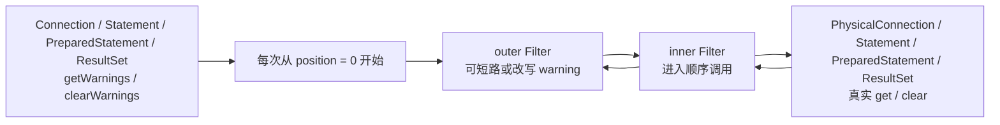

`ConnectionWarningFilterChain`、`StatementWarningFilterChain` 和
`ResultSetFilterChain` 都按 Java 的位置化 around-chain 进入与逆序展开；
PreparedStatement 使用自己的物理 prepared handle，但复用 Statement Filter
方法族。`SqlWarning` 保留 message、SQLState、vendor code 与 next-warning
链。异常时序也按 Java 保留：Connection getter 的底层错误原样返回，不进入
sorter；Connection clear 以及 Statement、PreparedStatement、ResultSet 的
getter/clear 都进入异常分类。

Druid + xerial SQLite oracle 验证四类对象初始 warning 均为空、clear 均成功；
双层 Filter 的返回改写和完整调用顺序与 Rust 一致。Java Maven 定向用例
120/120；Rust workspace 覆盖执行 506/506 个测试，真实 Toasty SQLite 覆盖
四类对象，mock 覆盖短路、改写、物理终点和 fatal sorter。

| 指标 | 覆盖 | 已覆盖/总量 |
| :--- | ---: | ---: |
| Regions | 86.21% | 13,598 / 15,774 |
| Functions | 89.42% | 1,943 / 2,173 |
| Lines | 89.49% | 11,762 / 13,144 |

普通 Clippy、格式、diff 和布局门禁在本切片验收时执行；当时开放的
SQLx/RBDC Connection warning Adapter 已由 C2-R30 闭合。其余
FilterChainImpl 方法族和全仓覆盖率 100% 继续开放，整体保持 `PARTIAL`。

### C2-R30：SQLx/RBDC Connection warning Adapter

本切片把 C2-R29 已建立的 warning SPI 落到 `druid-wrapper` 两个 direct
Adapter。SQLx 和 RBDC 的公开 Connection SPI 都没有 JDBC warning 读取入口，
所以存活连接返回 `None` 是经能力审计后的真实结果，不是默认 stub：

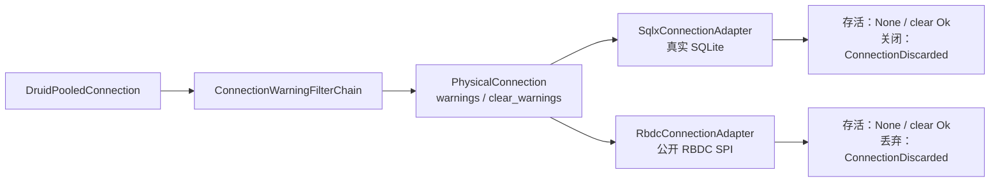

两个 Adapter 的 `clear_warnings` capability 均更新为 true；关闭或丢弃连接
不会错误返回成功。SQLx direct 真实 SQLite 聚合测试 5/5，RBDC Adapter 合同
6/6；全 workspace 精确执行 507/507 个测试。普通 Clippy、格式和布局门禁通过，
布局仍为 `scanned=131 errors=0 warnings=0`。

| 指标 | 覆盖 | 已覆盖/总量 |
| :--- | ---: | ---: |
| Regions | 86.25% | 13,612 / 15,782 |
| Functions | 89.53% | 1,949 / 2,177 |
| Lines | 89.61% | 11,786 / 13,152 |

RBDC 真实 SQLite driver、SQLx/RBDC Statement/PreparedStatement 原生多结果与
generated-key 矩阵、剩余 Filter 方法族和全仓覆盖率 100% 继续开放。

### C2-R31：ResultSet#getStatement Prepared 动态身份

Java 的 `DruidPooledResultSet` 直接持有创建它的
`DruidPooledPreparedStatement`，所以 `getStatement()` 必须返回同一对象，而
不是只有同一个物理 SQL。Rust 通过共享生命周期和具体身份句柄迁移该语义：

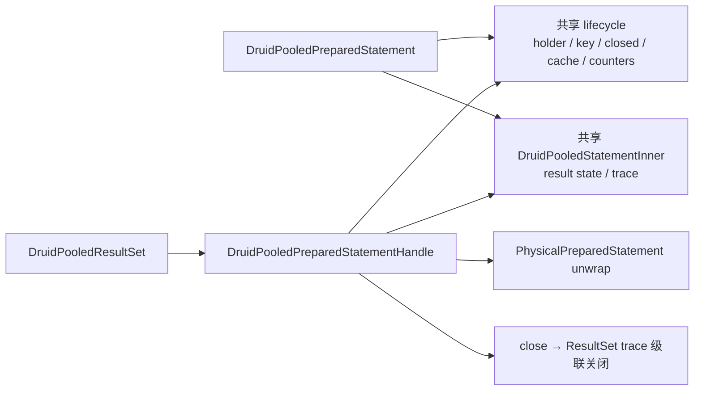

query、generic current ResultSet 和 generated keys 都携带该句柄；普通
Statement ResultSet 明确返回 `None`。原 Prepared 局部变量先 Drop 时，ResultSet
的强句柄会延迟物理语句回收；从 ResultSet 取得的句柄关闭语句时会执行
clear-parameters/clear-batch、缓存归还/淘汰和 ResultSet 级联关闭。

Druid+xerial SQLite oracle 证明引用相等、具体类型、ResultSet 关闭后身份保持及
Statement 关闭级联四项均为 true。Rust Toasty SQLite 验证同一 key/物理 unwrap/
强生命周期/关闭级联；定向测试 18/18 + 16/16，全 workspace 510/510。普通
Clippy、格式和布局门禁通过，布局为 `scanned=131 errors=0 warnings=0`。

| 指标 | 覆盖 | 已覆盖/总量 |
| :--- | ---: | ---: |
| Regions | 86.44% | 13,772 / 15,933 |
| Functions | 89.79% | 1,971 / 2,195 |
| Lines | 89.76% | 11,939 / 13,301 |

CallableStatement ResultSet 的具体动态身份由 C2-R32 闭合；Prepared JDBC
setter/完整属性、多数据库原生执行矩阵、剩余 Filter 方法族和全仓覆盖率 100%
继续开放。

### C2-R32：ResultSet#getStatement Callable 动态身份

Java `DruidPooledCallableStatement` 继承 `DruidPooledPreparedStatement`，继承的
query/current/generated-keys 创建 `DruidPooledResultSet` 时传入的 `this` 仍是
原 callable 对象。因此 Rust 不能只返回 Prepared 句柄：

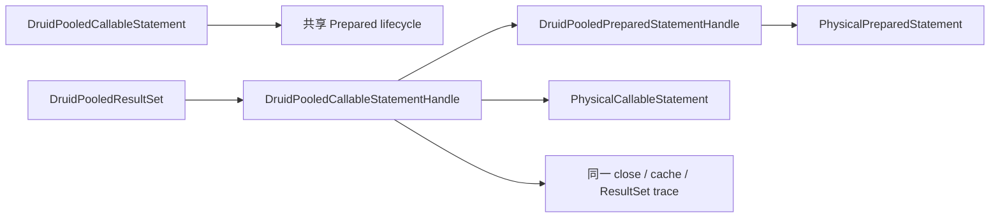

`fetch_result_set`、generic `execute/result_set/update_count`、generated keys 和
more-results 继承入口均落在 callable facade；结果集同时暴露
`callable_statement()` 与继承的 `prepared_statement()`。句柄支持
Callable/Prepared/raw concrete 三层 unwrap、强生命周期和重复关闭幂等。

SQLite 不实现 JDBC CallableStatement，不能伪造“真实 SQLite 存储过程”证据；
本切片以 Java CodeGraph 继承/构造调用链为 oracle，并使用真实 callable 物理 SPI
测试双验证动态分派、顺序多结果和生命周期。定向测试 4/4 + 16/16 + 18/18，
全 workspace 512/512 通过；普通 Clippy、格式和布局门禁通过。

| 指标 | 覆盖 | 已覆盖/总量 |
| :--- | ---: | ---: |
| Regions | 86.45% | 13,887 / 16,063 |
| Functions | 89.73% | 1,992 / 2,220 |
| Lines | 89.74% | 12,050 / 13,428 |

真实 PostgreSQL/MySQL 存储过程 Adapter、Prepared JDBC setter/完整属性、
多数据库原生执行矩阵、剩余 Filter 方法族和全仓覆盖率 100% 继续开放。

### C2-R33：PreparedStatement setter 与持久绑定参数

Java `DruidPooledPreparedStatement` 的 `setXxx` 不是一次执行参数的便利函数：
它在 setter 调用时检查开放状态、立即调用物理 statement，并把异常交给
`checkException`；后续无参 `executeQuery/executeUpdate/execute/addBatch` 使用
statement 内当前参数状态。Rust 现按同一生命周期迁移：

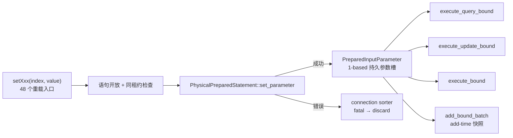

`PreparedInputParameter` 保留 Boolean/Byte/Short/Int/Long/Float/Double 的调用类型，
nullable Decimal/String/NString/Bytes，Date/Time/Timestamp 的 Calendar 三态，
`setNull` 的 typeName 重载差异，`setObject` 的 targetSqlType/scale，以及
Stream/Reader 的 int/long/无长度和 LOB/Array/Ref/URL/RowId/SQLXML 资源身份。
池化层不预读流，也不以 String/Bytes 冒充资源。重复 setter 覆盖槽位，执行前
拒绝参数空洞；物理 `clearParameters` 成功后才清空逻辑状态，已加入 batch 的
快照不受影响。

真实 Toasty SQLite 已验证 15 列标量/null 的 update 与强类型读回、绑定 query、
generic execute 和两组 add-time batch 快照；SQLite 自身把 BOOLEAN 读成 INTEGER，
把 NUMERIC 的无意义尾零规范化，但执行前的 Rust 描述符仍保留 Bool 和原始
BigDecimal。物理 setter 注入 MySQL fatal 异常时，错误在 setter 调用点返回且
连接立即 discard。资源描述符执行当前显式返回
`prepared_parameter_requires_native_adapter`，并证明流未被预读；这项不会被
登记为 Adapter 原生绑定完成。

定向 Prepared 测试 19/19、全 workspace 515/515、普通 Clippy、格式和布局门禁
通过；布局为
`scanned=132 errors=0 warnings=0 allowed=0 semantic_parity_proven=false`。

| 指标 | 覆盖 | 已覆盖/总量 |
| :--- | ---: | ---: |
| Regions | 86.84% | 14,402 / 16,584 |
| Functions | 90.00% | 2,052 / 2,280 |
| Lines | 90.21% | 12,720 / 14,100 |

本批新增 `PreparedInputParameter` 的 Regions/Functions/Lines 均为 100%。

本切片关闭“无 Prepared setter 状态”的缺口，但 `CORE-CONN-003`、
`CORE-CONN-013` 与 `SEM-CONN-005` 保持 `PARTIAL`：Toasty/SQLx/RBDC 的
LOB/stream/resource 原生绑定、PostgreSQL/MySQL/Turso 矩阵和全仓覆盖率
100% 仍开放。继承 Statement 属性与关闭恢复由后续 C2-R34 关闭。

### C2-R34：PreparedStatement 继承属性与缓存回收恢复

Java `PreparedStatement` 继承 `Statement`，不能让 Rust 的
`DruidPooledPreparedStatement` 只保存一个与真实 prepared handle 无关的
`SqlTextStatement`。本切片把继承能力下沉到 `PhysicalPreparedStatement`，
再用内部 `PreparedStatementPhysicalStatement` 组成 `DruidPooledStatement`
基类视图。该视图逻辑关闭时不会关闭待放回缓存的物理句柄，物理句柄仍由
`PreparedStatementHolder/Pool` 独占管理。

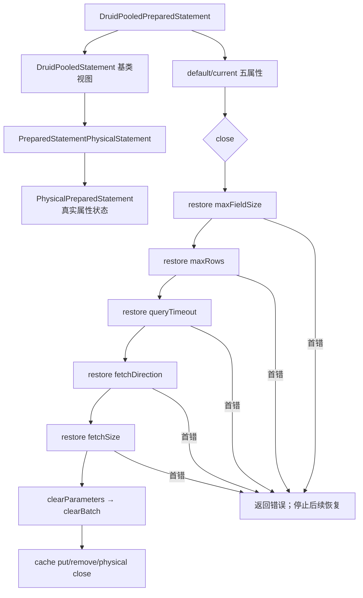

构造 pooled wrapper 时分别读取 `maxFieldSize/maxRows/queryTimeout/
fetchDirection/fetchSize`；每个 getter 的失败独立吞掉并保留 Java int 零值。
五个 setter 与 Java 一致，在调用物理 setter 前更新 current。关闭时只恢复
发生变化的属性，严格保持上述顺序；任一恢复错误立即中止，尚未执行
`clearParameters/clearBatch`，并增加 exceptionCount。调用者修复/重试成功后，
该句柄也因已有异常而进入缓存删除分支，不能污染下一次租约。Drop 无连接上下文
时仍尝试恢复；失败则直接标记异常并禁止回缓存，但不会伪造 ExceptionSorter
已经执行。

证据：

- Java 源码审计：
  `DruidPooledPreparedStatement` 构造器、五个 setter、`close()`，
  `DruidPooledConnection#closePoolableStatement`；
- Rust 故障注入验证初始化 getter 顺序、五属性恢复顺序、首错停止、重试及
  exceptionCount 淘汰；
- 真实 Toasty SQLite 验证结果集创建参数、全部继承属性、poolable 规则、
  closeOnCompletion、缓存恢复和恢复后的真实查询；
- SQLx prepared handle 使用 Adapter 自己的 Statement 状态，不再由池化 wrapper
  伪造属性。

定向 Prepared 测试 21/21、全 workspace 517/517、普通 Clippy、格式和布局门禁
通过；普通 Clippy 仍有既存 pedantic warnings，未宣称 `-D warnings`。
布局为
`scanned=133 errors=0 warnings=0 allowed=0 semantic_parity_proven=false`。

| 指标 | 覆盖 | 已覆盖/总量 |
| :--- | ---: | ---: |
| Regions | 86.49% | 14,864 / 17,186 |
| Functions | 89.25% | 2,126 / 2,382 |
| Lines | 89.83% | 13,145 / 14,633 |

本切片关闭 `SEM-CONN-015`，但不关闭整体 `CORE-CONN-003`：
LOB/stream/resource 原生参数执行边界、SQLx/RBDC 多数据库 generic/batch、
无连接参数 close 的 ExceptionSorter 以及全仓覆盖率 100% 仍开放。

### C2-R35：Prepared 资源 setter、Filter 与批处理物理闭环

Java Druid 的 setter 主链是“检查逻辑状态 → 调用物理 PreparedStatement →
`checkException` → 保存代理参数状态”。因此资源描述符不能只在 execute 时才由
连接层读取，否则负长度、提前 EOF 和流游标推进时点都会改变。本切片增加
`ToastyPreparedStatement`，把 Toasty raw SQL API 缺失的物理参数槽补在 Adapter
内部，而不是塞进池化门面。

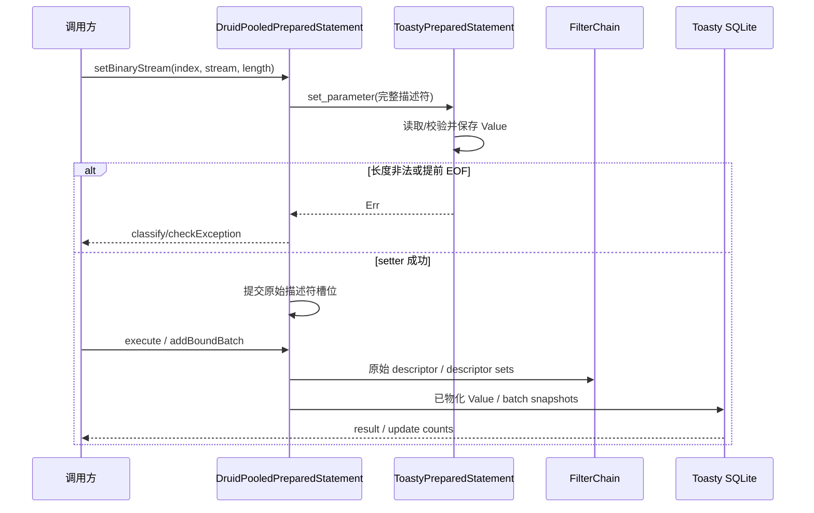

`ExecContext.prepared_parameters` 与
`BatchExecContext.prepared_parameter_sets` 保存完整 setter 身份；原
`params/parameter_sets` 只作为标量兼容视图。`PhysicalConnection` 新增
parameter-aware query/update/generic/batch 入口，lease 完整转发。
`add_bound_batch` 保存有序描述符，同时让物理句柄保存 setter 阶段已物化的值，
所以执行不会二次读取同一流。原 Rust `add_batch(Vec<Value>)` 以明确的
`RustValue` 分支进入同一有序协议，不伪装成 Java setter。

证据包括：

- Java xerial SQLite 3.49.1.0 JShell：binary stream 显式长度在 setter 时读取；
  提前 EOF 与负长度也在 setter 报错；
- 真实 Toasty SQLite：ASCII/Binary/Character/NCharacter、Blob stream、
  Clob/NClob reader、URL、RowId、null Blob 的 update/query/generic execute；
- 显式长度只消费声明区间，execute 不二次读取剩余游标；
- 两组资源参数 `add_bound_batch` 按顺序执行，Filter 一次看到两组完整描述符；
- 全 workspace 518/518；普通 Clippy 退出 0，但既存 pedantic warnings 未清零；
  布局 `scanned=134 errors=0 warnings=0 allowed=0
  semantic_parity_proven=false`。

| 指标 | 覆盖 | 已覆盖/总量 |
| :--- | ---: | ---: |
| Regions | 85.92% | 15,569 / 18,121 |
| Functions | 88.48% | 2,190 / 2,475 |
| Lines | 89.25% | 13,670 / 15,316 |

本批新增 `ToastyPreparedStatement` 的 Functions/Lines 为 100%，Regions 为
97.45%；剩余 region 是编译器分支计数，不把它伪写成 100%。

`SEM-CONN-016` 对 Toasty SQLite 标为 PASS，对全 Adapter 仍为 PARTIAL。
SQLx/RBDC 的资源绑定、PostgreSQL/MySQL/Turso 真实矩阵、xerial 字符流特有行为
以及全仓覆盖率 100% 继续开放。

### C1-R1：Toasty 内置数据源标准化

Toasty 标准数据源已物理归入 `druid/src/toasty`，并由 `druid` 默认启用。
Factory 使用 Toasty 0.9
`Connect/Driver/Connection/Capability`，但不创建 `toasty::Db`；Druid native
pool 是唯一连接池。SQLite 默认启用，PostgreSQL/MySQL/Turso 按 feature 扩展，
DynamoDB 只属于 Toasty ORM，不满足 Druid SQL `PhysicalConnection`。

真实 SQLite 3 个 direct contract 和 1 个 core 纵向 contract 已通过；SQLx、
bb8、deadpool、wrapper 共 17 个扩展回归仍通过。Toasty 0.9 与 SQLx 0.8 的
`libsqlite3-sys` links 冲突通过显式 vendor compatibility patch 统一，补丁删除
条件和风险登记在[Toasty 内置数据源标准实现](./Toasty-内置数据源标准实现.md)。

2026-07-28 C3-R5 全量实测：workspace 428/428；Regions 87.25%
（6,111/7,004）、Functions 89.96%（905/1,006）、Lines 90.22%
（5,334/5,912）。本批新增 `JdbcClob`、`JdbcNClob`、`JdbcReader`、
`JavaString`、`JdbcWriter` 行/函数/Regions 均为 100%。SQLite 证据
只关闭其能力矩阵中的项目，不关闭存储过程、XA、vendor 方言和 1,644 对象总账。

### C2-R39：ResultSet 默认能力与 typed object 单次读取

对照 Java `DruidPooledResultSet#getObject(int, Class<T>)` 的一次物理委托语义，
使用原子计数探针验证 Rust custom typed object 只读取一次物理列。另以最小
`SparsePhysicalResultSet` 冻结导航、fetch、cursor、metadata、warning 和
update 默认方法的精确 `UnsupportedOperation.operation`，并验证非法列索引和
底层读取错误优先于 custom target unsupported。

Rust 新增 4 个 ResultSet 合同测试，全 workspace 530/530；普通 Clippy
退出 0，严格 `-D warnings` 仍被全仓 418 项既有告警阻断；布局
`scanned=137 errors=0 warnings=0 allowed=0
semantic_parity_proven=false`。

| 指标 | 覆盖 | 已覆盖/总量 |
| :--- | ---: | ---: |
| Regions | 86.77% | 16,456 / 18,966 |
| Functions | 89.74% | 2,309 / 2,573 |
| Lines | 90.39% | 14,441 / 15,977 |

`jdbc_result_set.rs` 未覆盖行由 311 降至 151；真实 driver custom target
conversion、其余 Filter 方法族、streaming、多数据库矩阵和全仓 100% 门禁仍
保持 `PARTIAL`。

### C2-R40：ResultSet 标量 getter 同名物理重载

Java `DruidPooledResultSet` 的 `getObject(String)` 和 9 族标量 index/label
getter 均直接委托 raw `ResultSet` 后执行 `checkException`。Rust 已在
`PhysicalResultSet` 增加 19 条对应入口，并把池化门面的本地 `Value` 转换改为
同名物理委托；真实 driver 可以分别覆盖标签解析与 vendor 转换，eager Adapter
仍使用经过完整分支验证的默认实现。

自定义探针证明 19 条重载没有退化为 `findColumn + value`；失败的 label getter
进入 Statement exception count。`RowSetResultSet` 另验证 NULL、全部 Value
类别、窄化溢出、非法 UTF-8/数值/日期时间、两种 timestamp 格式及
binary/character stream 转换。

全 workspace 534/534；普通 Clippy 退出 0；布局
`scanned=137 errors=0 warnings=0 allowed=0
semantic_parity_proven=false`。

| 指标 | 覆盖 | 已覆盖/总量 |
| :--- | ---: | ---: |
| Regions | 89.41% | 17,072 / 19,095 |
| Functions | 91.61% | 2,369 / 2,586 |
| Lines | 92.53% | 14,817 / 16,014 |

`DruidPooledResultSet` Lines 99.73%，`PhysicalResultSet`/`RowSetResultSet`
所在文件 Lines 98.63%。真实多数据库标量重载、vendor custom conversion、
其余 Filter 方法族和全仓 100% 门禁继续保持 `PARTIAL`。

### C2-R41：Statement/PreparedStatement 物理 ResultSet 身份与列标签

Java `DruidPooledStatement#executeQuery` 和
`DruidPooledPreparedStatement#executeQuery` 都直接包装驱动返回的
`java.sql.ResultSet`。此前 Rust 普通查询及 Prepared canonical query 会先取得
`Vec<Row>`，再构造 `RowSetResultSet`；这会丢失驱动 ResultSet 身份、别名标签、
空结果 metadata 和 vendor getter 覆盖。

本切片新增并贯通以下内部 SPI：

- `PhysicalConnection::fetch_result_set`；
- `fetch_prepared_result_set`；
- `fetch_prepared_parameters_result_set`；
- `PhysicalConnectionLease`、`DruidPooledConnection` Filter 路径及
  `DruidPooledStatement` 共享状态的逐层透明委托。

SQLx Adapter 从真实 SQLite statement/row metadata 保留列标签；prepared
statement 的列描述来自已 prepare 的原生 handle，因此即使返回零行仍能保留
descriptor。RBDC Adapter 从 `Row::meta_data()` 保留标签。Toasty 仍明确使用
`RowSetResultSet` eager Adapter，但资源参数继续在物理 setter 时点物化，没有
退化为 `scalar_value()`。

证据：

- SQLx 真实 SQLite 普通零行及 prepared query 验证别名
  `empty_identifier`、`binary_value/character_value`、大小写不敏感
  `findColumn` 与 label getter；
- RBDC 严格 SPI 验证六列 driver label 原样穿过池化层；
- 默认 SPI 与 `PhysicalConnectionLease` 验证 prepared ResultSet 包装及委托；
- 全 workspace 534/534；普通 Clippy 退出 0；布局
  `scanned=137 errors=0 warnings=0 allowed=0
  semantic_parity_proven=false`。

| 指标 | 覆盖 | 已覆盖/总量 |
| :--- | ---: | ---: |
| Regions | 89.11% | 17,460 / 19,594 |
| Functions | 91.55% | 2,405 / 2,627 |
| Lines | 92.33% | 15,105 / 16,360 |

`DruidPooledResultSet` Lines 99.89%，`DruidPooledStatement` Lines 99.56%，
`jdbc_result_set.rs` Lines 98.65%。SQLx 普通零行 descriptor 已通过原生 prepare
handle 闭合；RBDC 零行仍受上游 stream SPI 限制；Toasty 仍是 eager；
PostgreSQL/MySQL/Turso 及全仓 100% 门禁继续保持 `PARTIAL`。

### C2-R42：ResultSet 18 个标量 getter 进入 FilterChain

逐项冻结 Java `FilterChain` 与 `FilterChainImpl` 的
String/Boolean/Byte/Short/Int/Long/Float/Double/Bytes 九族 index/label
签名后，Rust 在以下四层建立完全一致的 18 条入口：

- `ResultSetFilter` 默认继续到下一节点；
- `ResultSetFilterChain` 使用单调递增 position 动态派发，末端调用
  `PhysicalResultSet` 的精确重载；
- `FilterChain` 每次公开调用都从 position 0 建立子链；
- `DruidPooledResultSet` 完成 open/lease 检查后进入 Filter，成功返回或错误均在
  Java 对应调用点执行连接异常分类。

测试分别证明：

- 两层 Filter 按注册顺序进入、逆序取得并改写返回值；
- 18 个 index/label 重载均保持原参数身份，不退化为 `findColumn + value`；
- Filter 可短路物理调用；Filter 抛出的 `DriverError` 计入 Statement
  exception count；
- 默认 Filter 全量穿透物理探针；
- Toasty 真实 SQLite `SELECT 1 AS value` 经 StatFilter/ResultSet Filter 取得
  实际整数值。

全 workspace 538/538；普通 Clippy 退出 0（既有 pedantic warning 仍开放）；
布局审计为
`scanned=137 errors=0 warnings=0 allowed=0 semantic_parity_proven=false`；
`docs/migration` 保持不存在。

| 指标 | 覆盖 | 已覆盖/总量 |
| :--- | ---: | ---: |
| Regions | 89.23% | 17,678 / 19,812 |
| Functions | 91.68% | 2,447 / 2,669 |
| Lines | 92.42% | 15,291 / 16,546 |

本切片关闭 `CORE-FLT-007` / `SEM-FLT-024`，但只覆盖标量 getter 子族。
object/map/typed、decimal/temporal/calendar、stream/resource、navigation/property、
metadata 与 update 的 Filter 方法族，以及 canonical `FilterChainImpl`、真实多数据库
和全仓覆盖率 100% 均继续开放，因此 `CORE-CONN-005` 与 Filter 总体仍为
`PARTIAL`。

### C2-R43：ResultSet Decimal/Temporal/Calendar FilterChain

Java `FilterChain`/`FilterChainImpl` 对 BigDecimal 提供无 scale 与显式 scale
四个重载，对 Date/Time/Timestamp 各提供 index/label × 无 Calendar/Calendar
四个重载。本切片逐条迁移全部 16 条，而不是将其压缩为一个通用值回调：

- `ResultSetFilter` 暴露 16 个稳定 snake_case 方法；
- `ResultSetFilterChain` 保持 position 游标，末端调用
  `PhysicalResultSet` 的精确重载；
- `FilterChain` 每次从 position 0 建立 around-chain；
- `DruidPooledResultSet` 区分无 Calendar、显式 null Calendar 与具体时区，
  并在 Filter/物理错误处执行原有异常分类。

验证覆盖默认委托、短路、返回改写、scale 参数、`Specified(None)`、
`Asia/Shanghai`/`UTC` Calendar 身份以及 Filter `DriverError`。真实 Toasty
SQLite 对 Decimal/Date/Time/Timestamp 的 index 读取通过；其 eager raw-SQL
结果不保留 alias，因此本切片没有用 Toasty 声称 label E7，label 重载由精确
物理探针与 Filter 参数身份测试证明。

全 workspace 539/539；Clippy 退出 0；布局
`scanned=137 errors=0 warnings=0 allowed=0
semantic_parity_proven=false`；`docs/migration` 不存在。

| 指标 | 覆盖 | 已覆盖/总量 |
| :--- | ---: | ---: |
| Regions | 89.41% | 18,011 / 20,145 |
| Functions | 91.82% | 2,491 / 2,713 |
| Lines | 92.57% | 15,632 / 16,887 |

本切片关闭 `CORE-FLT-008` / `SEM-FLT-025`。ResultSet object/map/typed、
stream/resource、navigation/property、metadata/update Filter 方法族，
canonical `FilterChainImpl`、Toasty alias/streaming、多数据库矩阵与全仓覆盖率
100% 继续开放。

### C2-R44：ResultSet Object 六重载 FilterChain

Java `FilterChain`/`FilterChainImpl` 分别声明并逐层分派以下六条重载：

- `getObject(int)` / `getObject(String)`；
- `getObject(int, Map)` / `getObject(String, Map)`；
- `getObject(int, Class<T>)` / `getObject(String, Class<T>)`。

Rust 已在 `ResultSetFilter`、有位置 `ResultSetFilterChain`、公开
`FilterChain` 和 `DruidPooledResultSet` 四层建立六条精确入口。标签入口末端
调用物理标签重载，不退化成 `findColumn + index`；`None`、空
`JdbcTypeMap`、有内容的 Map 以及 `JdbcTargetType::Custom` 类名均保持身份。
Filter 可以短路或改写结果，Filter/物理 `DriverError` 都在池化调用点进入
Statement 异常分类。

#### 迁移测试三账本

| 账本 | 来源/风险 | 验证 | 证据 | 当前 |
| :--- | :--- | :--- | :--- | :--- |
| `SOURCE_PARITY` | Java `FilterChain.java` 六签名及 `FilterChainImpl` 六条 position/末端 raw 重载；Java 对嵌套 ResultSet/Clob 还会包装代理 | Rust 精确方法清单、默认穿透物理探针；嵌套资源包装仍单独开放 | `V0_STATIC` + `V1_RUST_LOCAL`，不是 live differential | 六重载分派 PASS；嵌套资源 PARTIAL |
| `RUST_OBLIGATION` | trait-object 动态派发、每次 position 归零、`Option<&JdbcTypeMap>`、borrowed target type 与错误分类 | pass-through、short-circuit、null/empty/populated Map、custom target、Filter error count | `V1_RUST_LOCAL` | PASS |
| `VALUE_ADD` | 防止池化门面绕过 Filter、防止标签重载折叠、防止 null Map 与空 Map 混淆 | 真实 Toasty SQLite plain object 与 typed Long 经 StatFilter/ResultSet Filter；全 workspace 回归 | `V5_HOST` | SQLite PASS；多数据库开放 |

静态迁移测试审计报告为 Java core 475 个测试方法、Rust druid 502 个测试函数、
144 个需人工复核信号。该报告是启发式清单，不把测试数量解释为覆盖等价。

验收：

- 定向 `result_set_filter_semantics_test` 7/7；
- 全 workspace 540/540；
- Clippy 退出 0，既有 pedantic warning 债务仍存在；
- 布局 `scanned=137 errors=0 warnings=0 allowed=0
  semantic_parity_proven=false`；
- Regions 89.53%（18,248/20,382）；
- Functions 91.91%（2,521/2,743）；
- Lines 92.66%（15,851/17,106）；
- `result_set_filter.rs` 与 `result_set_filter_chain.rs` 行/函数/Regions 均
  100%；`docs/migration` 保持不存在。

本切片关闭 `CORE-FLT-009` / `SEM-FLT-026`。Java 末端对嵌套
`ResultSet`/`Clob` 的自动代理、stream/resource/navigation/property/metadata/
update Filter 方法族、canonical `FilterChainImpl`、Toasty alias/streaming、
多数据库矩阵与全仓 100% 覆盖率继续保持 `PARTIAL`。
