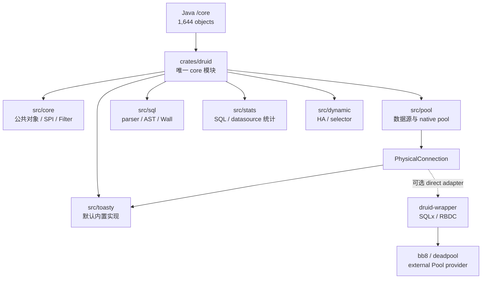
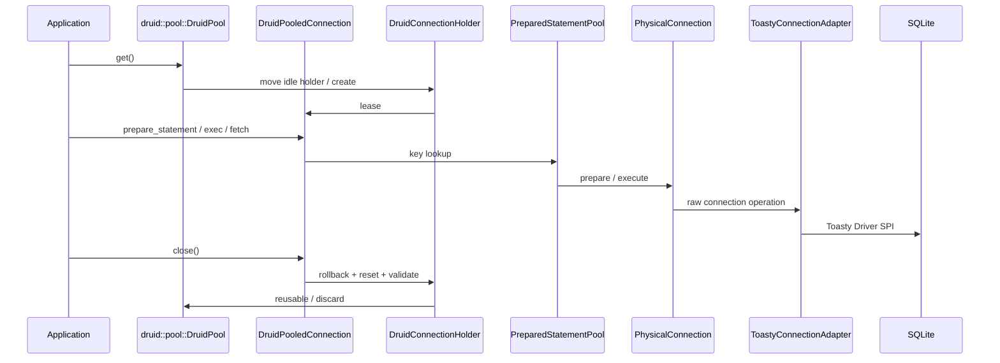

# Java Druid core → Rust `druid` 全量迁移路线图

> 基线：Java Druid 1.2.28，commit `33824c3dec1612711f9bb4e409319bcab2e4cd0e`  
> 目标：唯一 `crates/druid` 模块；core/pool/sql/stats/dynamic/toasty 均为内部目录
> 日期：2026-07-29

## 1. 总目标

`crates/druid` 对应 Java `/core` 模块。迁移目标是 1,644 个 Java 生产对象的
功能语义完全迁移，不是把原 `druid-core` 仅做包装或重导出后宣称完成。职责拆分只能发生在
`crates/druid/src/` 的内部目录中，不能继续形成独立 crate、版本或发布边界。
`druid` 是 Java core 模块唯一的源码、发布与验收边界，并默认整合 Toasty。



## 2. 迁移原则

1. Java 对象、方法、重载、默认值、错误、状态、副作用和并发行为全部入账。
2. 一个 `.rs` 生产文件只承载一个 Java 对象；`lib.rs`/`mod.rs` 只声明和重导出。
3. Java 平台标准 `java.sql.*` 迁移为最小内部 SPI，不计入 Druid 对象分母。
4. Toasty 是内置数据源标准实现；SQLx、RBDC 是 wrapper 扩展。它们都只是
   `PhysicalConnection` 的平台实现，不能代替 Druid 领域语义验收。
5. SQLite 只验收其真实支持的能力；存储过程、XA、vendor 行为需对应真实数据库。
6. mock 只用于故障注入，不替代真实数据库纵向合同。

## 3. 当前基线

| 维度 | Java core | Rust 当前 | 判断 |
| :--- | ---: | ---: | :--- |
| 生产对象/文件 | 1,644 | 已物理归并到 `crates/druid/src/*`；对象语义总账仍未闭合 | PARTIAL |
| Pool 主链 | 完整 | native acquire/recycle、部分维护、PS cache | PARTIAL |
| SQL/AST/方言 | 1,268 个对象 | sqlparser-rs facade + 少量 Wall 规则 | PARTIAL |
| Filter/Proxy | 94 个左右对象族 | 粗粒度 FilterChain | PARTIAL |
| Stat | 完整 SQL/datasource/web/spring 统计 | merge/stat filter 子集 | PARTIAL |
| 真实数据库 | JDBC 多驱动 | Toasty SQLite 内置主链 + SQLx 扩展主链；其他数据库矩阵未闭合 | PARTIAL |

## 4. 阶段路线

| 阶段 | 范围 | 退出门禁 | 当前 |
| :--- | :--- | :--- | :--- |
| C0 | 三模块边界、对象总账、CodeGraph 基线 | 1,644 分母冻结；core 内部实现归并进 `crates/druid` | DONE |
| C1 | PhysicalConnection、Toasty 内置标准、错误、typed values | 内置与每个扩展 Adapter 执行统一 contract | PARTIAL |
| C2 | DruidDataSource、holder、pooled connection、维护任务 | Java acquire/recycle/shrink/fill 差分 | PARTIAL |
| C3 | Statement/Prepared/Callable/ResultSet/LOB/metadata | 全方法矩阵 + 真实数据库 | PARTIAL |
| C4 | Filter/Proxy 调用链 | 每个 Java hook 有事件和顺序测试 | PARTIAL |
| C5 | SQL parser、AST、Visitor、输出、参数化 | 逐方言 corpus 差分 | PARTIAL |
| C6 | WallProvider/WallConfig/规则 | 全字段开关与 violation 差分 | PARTIAL |
| C7 | Stat/JMX 结果迁移 | 指标字段、聚合、reset、并发一致 | PARTIAL |
| C8 | HA/XA/vendor/support/util | 故障注入与真实驱动矩阵 | PARTIAL |
| C9 | 文档、注释、兼容面、覆盖率 | workspace + llvm-cov 100% | 未完成 |

### C3-R2：Callable 输入重载无损化

CodeGraph 与源码盘点冻结 `DruidPooledCallableStatement` 的 116 个 Java 公开声明
（构造器 + 115 个方法）；C3-R5 时 Rust 累计提供 94 个公开入口，后续 C3-R6
已补齐 115 个 Java 方法对应入口，另有 5 个 Rust 生命周期/扩展方法。API 数量闭合
仍不能替代真实存储过程 driver 的语义证据。第一批新增
`CallableInputParameter`，把 `setNull` 的 `sqlType/typeName`、`setObject` 的
`targetSqlType/scale` 以及 Boolean/Byte/Short/Int/Long/Float/Double/String/
NString/Bytes 的具体 setter 身份完整传到 `PhysicalCallableStatement`。

标量 index/name getter 同样下沉到物理 SPI，池化对象只负责 open 检查、错误计数与
缓存淘汰。当前证据仍是测试驱动 E1/E2 子集；支持存储过程的真实数据库 E7 尚未建立。

### C3-R3：Callable Decimal 与日期时间强类型化

第二批新增 `CallableOutputValue`、`CallableCalendar` 与 Calendar 重载参数账本。
`BigDecimal` 使用 `bigdecimal::BigDecimal` 保留任意精度和 scale；
Date/Time/Timestamp 使用 `chrono` 强类型并保留 Timestamp 纳秒。Calendar 不能
只保存当前 UTC offset，而是保留时区标识，并区分未调用 Calendar 重载、显式
传 null、传实际 Calendar 三种状态。

这批关闭 22 个 Rust 公开入口，但仍是物理测试驱动证据。SQLite 没有存储过程，
只能严格验证 `UnsupportedOperation`，不能充当 Callable E7；本阶段的 URL、
Array/Ref/RowId/SQLXML、
流、完整 `getObject`/ResultSet trace、unwrap 和支持存储过程的真实 Adapter
继续开放，其中 Blob 与 Clob/NClob/字符流子集由后续 C3-R4/C3-R5 关闭实现面。

### C3-R4：Callable Blob 资源语义切片

第三批按 Java 的 5 个自有 Blob 入口新增 `get_blob/get_named_blob`、
`set_named_blob`、`set_named_blob_stream` 和
`set_named_blob_stream_with_length`。`CallableInputParameter` 用独立 variant
区分 Blob 对象、Blob 输入流、Java null、未指定长度与显式 `long` 长度；
池化 setter 不读取输入流，所有错误继续进入 prepared statement 的异常淘汰主链。

`JdbcBlob` 不是 `Vec<u8>` 别名，而是持有 `PhysicalBlob` 的资源句柄。
`PhysicalBlob` 覆盖 `java.sql.Blob` 的 11 个操作签名，位置和长度保留 Java
有符号类型；`JdbcInputStream/JdbcOutputStream` 的 Clone 共享游标和关闭状态。
Rust core 资源契约 2/2、pool Callable 契约 2/2 与 Java Callable oracle
101/101 已通过。SQLite 真实 BLOB/Prepared 路径通过，但 SQLite 无存储过程，
因此本切片仍是 `IMPLEMENTED_UNVERIFIED`，不能升级为 Callable E7。

### C3-R5：Callable Clob/NClob 与字符流资源语义切片

第四批严格对照 Java 自有的 19 个入口，新增 `getClob/getNClob/
getCharacterStream/getNCharacterStream` 的 index/name getter，以及命名
`setClob/setNClob/setCharacterStream/setNCharacterStream` 的对象、Reader、
无长度、`int` 长度和 `long` 长度重载。该切片当时把 Rust 公开入口由 75
增至 94；后续 C3-R6 已完成剩余方法入口，历史阶段数值保留用于追踪。

资源边界采用 `JdbcClob + PhysicalClob`、`JdbcNClob + PhysicalNClob`、
`JdbcReader/JdbcWriter`，不是用 `String` 假装 JDBC 资源。`PhysicalClob`
覆盖 `java.sql.Clob` 的 13 个操作；`JavaString` 使用 UTF-16 code unit 保存
Java `String`，能够无损表达未配对 surrogate。Reader/Writer Clone 共享游标或
关闭状态，setter 不预读 Reader；`JdbcCharacterLength` 明确区分无长度、
`int` 和 `long` 重载，负长度也原样交给驱动。

Java `PoolableCallableStatementTest` 与连接 oracle 合计 101/101、Rust core
Clob 资源 2/2、pool Callable 2/2、SQLite SQLx 5/5、wrapper 2/2 均通过。
SQLite 的 TEXT/BLOB/Prepared 路径是实库证据，但 SQLite 不支持存储过程，
所以这 19 个入口仍标 `IMPLEMENTED_UNVERIFIED`，不得升级为 Callable E7。

## 5. SQLite 严格真实测试矩阵

| 能力 | SQLite 验收 | 当前证据 |
| :--- | :--- | :--- |
| connect/ping/close | 必测 | Toasty 内置 contract + SQLx 扩展 contract |
| DDL/DML/查询/参数绑定 | 必测真实结果 | `toasty_connection_adapter_test` + `sqlite_core_semantics_test` |
| 类型 | NULL/INTEGER/REAL/TEXT/BLOB/BOOLEAN/表达式列 | Toasty raw BOOLEAN 如实按 SQLite INTEGER；SQLx 保留声明类型能力 |
| transaction/savepoint | commit/rollback/savepoint | Toasty 3 个 contract + core 纵向测试 + SQLx 扩展 |
| PreparedStatement | prepare、真实执行、缓存复用、错误关闭 | 已测 |
| acquire/recycle | native、bb8、deadpool | 已测 |
| CallableStatement | 必须返回 unsupported | 已测；SQLite 无存储过程 |
| XA/vendor SQLState | SQLite 不具备 | 转入对应真实数据库门禁 |

## 6. 核心调用链



## 7. 验收命令

```bash
./mvnw -pl core -DskipTests=false test
cargo test -p druid --test sqlite_core_semantics_test
cargo test -p druid --test toasty_connection_adapter_test
cargo test --workspace
cargo llvm-cov --workspace --summary-only
python3 ~/.agents/skills/rust-java-migration/scripts/audit_migration_layout.py \
  --rust-root /Users/wandl/workspaces/workspace-github-easy-4-rust/druid-rust
```

当前全仓覆盖率不是 100%，因此 core 迁移状态保持 `PARTIAL`。

### C1-R1：Toasty 内置数据源标准化

Toasty 标准数据源已物理归入 `druid/src/toasty`，并由 `druid` 默认启用。
Factory 使用 Toasty 0.9
`Connect/Driver/Connection/Capability`，但不创建 `toasty::Db`；Druid native
pool 是唯一连接池。SQLite 默认启用，PostgreSQL/MySQL/Turso 按 feature 扩展，
DynamoDB 只属于 Toasty ORM，不满足 Druid SQL `PhysicalConnection`。

真实 SQLite 3 个 direct contract 和 1 个 core 纵向 contract 已通过；SQLx、
bb8、deadpool、wrapper 共 17 个扩展回归仍通过。Toasty 0.9 与 SQLx 0.8 的
`libsqlite3-sys` links 冲突通过显式 vendor compatibility patch 统一，补丁删除
条件和风险登记在 `../Toasty-内置数据源标准实现.md`。

2026-07-28 C3-R5 全量实测：workspace 428/428；Regions 87.25%
（6,111/7,004）、Functions 89.96%（905/1,006）、Lines 90.22%
（5,334/5,912）。本批新增 `JdbcClob`、`JdbcNClob`、`JdbcReader`、
`JavaString`、`JdbcWriter` 行/函数/Regions 均为 100%。SQLite 证据
只关闭其能力矩阵中的项目，不关闭存储过程、XA、vendor 方言和 1,644 对象总账。
