# Java Druid core → Rust `druid` 全量迁移路线图

> 基线：Java Druid 1.2.28，commit `33824c3dec1612711f9bb4e409319bcab2e4cd0e`  
> Rust baseline：`2c7bf3bea6f9e94f4583a85794df519c4435a425` + 当前 dirty migration worktree
> 目标：唯一 `crates/druid` 模块；core/pool/sql/stats/dynamic/toasty 均为内部目录
> 日期：2026-07-30

模块账本：[对象级对照表](./对象级对照表.md) ·
[语义迁移对照表](./语义迁移对照表.md) ·
[对象名称一致性检查](./对象名称一致性检查.md) ·
[Toasty 内置标准实现](./Toasty-内置数据源标准实现.md)

## 1. 总目标

`crates/druid` 对应 Java `/core` 模块。迁移目标是 1,644 个 Java 生产对象的
功能语义完全迁移，不是把原 `druid-core` 仅做包装或重导出后宣称完成。职责拆分只能发生在
`crates/druid/src/` 的内部目录中，不能继续形成独立 crate、版本或发布边界。
`druid` 是 Java core 模块唯一的源码、发布与验收边界，并默认整合 Toasty。

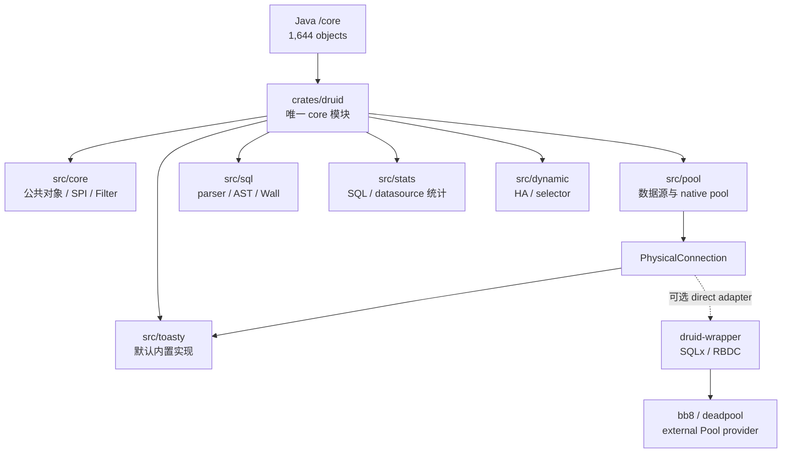

## 2. 迁移原则

1. Java 对象、方法、重载、默认值、错误、状态、副作用和并发行为全部入账。
2. 一个 `.rs` 生产文件只承载一个 Java 对象；`lib.rs`/`mod.rs` 只声明和重导出。
3. Java 平台标准 `java.sql.*` 迁移为最小内部 SPI，不计入 Druid 对象分母。
4. Toasty 是内置数据源标准实现；SQLx、RBDC 是 wrapper 扩展。它们都只是
   `PhysicalConnection` 的平台实现，不能代替 Druid 领域语义验收。
5. SQLite 只验收其真实支持的能力；存储过程、XA、vendor 行为需对应真实数据库。
6. mock 只用于故障注入，不替代真实数据库纵向合同。

### 2.1 日志平台边界

“语义迁移”不等于复制 Java 技术栈。`SLF4J`、`Log4j`、`Log4j2`、
`Commons Logging`、`Logback` 及其 MBean/桥接对象均是 JVM 日志生态，
Rust 产品代码不创建同名类型、不引入同名依赖、不注册同名 Filter alias，也不把
它们计入 Rust 实现完成率。它们只在 Java 来源审计中登记为
`NOT_APPLICABLE/EXCLUDED`，用于证明没有遗漏判断。

Rust 的原生日志与追踪边界统一为 `tracing`；迁移范围仅包括 Druid 自身可观察的
事件语义，例如事件发生时机、级别、结构化字段、SQL/参数脱敏、过滤开关和错误
关联。`LogFilter` 这个 Druid 领域 Filter 可以保留，但其后端只能是
`tracing`，不能衍生 `Slf4jLogFilter`、`Log4jFilter` 等 Rust 对象。
`log4jdbc` 同样不是 Rust 驱动或日志标准，仅作为旧 JDBC URL 的离线兼容输入。

## 3. 当前基线

| 维度 | Java core | Rust 当前 | 判断 |
| :--- | ---: | ---: | :--- |
| 生产对象/文件 | 1,644 | 已物理归并到 `crates/druid/src/*`；对象语义总账仍未闭合 | PARTIAL |
| Pool 主链 | 完整 | native acquire/recycle、部分维护、PS cache | PARTIAL |
| SQL/AST/方言 | 1,268 个对象 | sqlparser-rs facade + 少量 Wall 规则 | PARTIAL |
| Filter/Proxy | 94 个左右对象族 | 粗粒度 FilterChain | PARTIAL |
| Stat | 完整 SQL/datasource/web/spring 统计 | merge/stat filter 子集 | PARTIAL |
| 真实数据库 | JDBC 多驱动 | Toasty SQLite 内置主链 + SQLx 扩展主链；其他数据库矩阵未闭合 | PARTIAL |

## 4. 阶段路线

| 阶段 | 范围 | 退出门禁 | 当前 |
| :--- | :--- | :--- | :--- |
| C0 | 三模块边界、对象总账、CodeGraph 基线 | 1,644 分母冻结；core 内部实现归并进 `crates/druid` | DONE |
| C1 | PhysicalConnection、Toasty 内置标准、错误、typed values | 内置与每个扩展 Adapter 执行统一 contract | PARTIAL |
| C2 | DruidDataSource、holder、pooled connection、维护任务 | Java acquire/recycle/shrink/fill 差分 | PARTIAL |
| C3 | Statement/Prepared/Callable/ResultSet/LOB/metadata | 全方法矩阵 + 真实数据库 | PARTIAL |
| C4 | Filter/Proxy 调用链 | 每个 Java hook 有事件和顺序测试 | PARTIAL |
| C5 | SQL parser、AST、Visitor、输出、参数化 | 逐方言 corpus 差分 | PARTIAL |
| C6 | WallProvider/WallConfig/规则 | 全字段开关与 violation 差分 | PARTIAL |
| C7 | Stat/JMX 结果迁移 | 指标字段、聚合、reset、并发一致 | PARTIAL |
| C8 | HA/XA/vendor/support/util | 故障注入与真实驱动矩阵 | PARTIAL |
| C9 | 文档、注释、兼容面、覆盖率 | workspace + llvm-cov 100% | 未完成 |

### C2-R4：连接池重试、等待与取消安全

本批次按 Java `DruidDataSource` 的 creator/waiter/shrink/close 生命周期统一迁移：

- `maxWait=-1` 使用 `Duration::MAX` 表达无限等待，避免 `Instant` 溢出；
- `maxWaitThreadCount` 使用 RAII wait registration，超时或 future 取消均减计数；
- `connectionErrorRetryAttempts`、`timeBetweenConnectErrorMillis`、
  `breakAfterAcquireFailure`、`failFast` 已进入 canonical 获取连接状态机；
- 创建预留、borrow validation、shrink/keepAlive 临时候选和 close idle 批次均由
  RAII 托底，取消不会留下池账本之外的 holder；
- 脏 Drop 不再 `tokio::spawn` 不可追踪任务，而是向每池唯一
  `ConnectionCloseWorker` 入队；`DruidPool` 持有 JoinHandle，closed 且
  最后一个 active lease 归还后按 FIFO 关闭并退出；
- keepAlive 校验失败后补齐 `minIdle`，`maxIdle` 只保留 deprecated 配置身份，
  不再错误限制 Java `putLast`；
- build 阶段执行 `maxActive/minIdle/initialSize`、最小/最大驱逐时间以及
  keepAlive 周期关系校验。

当前证据为源码静态追踪与
`cargo check -p druid -p druid-admin -p druid-wrapper --all-targets`
通过，标记 `IMPLEMENTED_UNVERIFIED` / `V0_STATIC`，不是 Java 差分或 SQLite
运行证据。公平锁切换、fatalError 的统一行为差分、活跃租约强制 shutdown
仍保持开放；fatalError 生产状态机已在 C2-R65.39 接入。

### C3-R2：Callable 输入重载无损化

CodeGraph 与源码盘点冻结 `DruidPooledCallableStatement` 的 116 个 Java 公开声明
（构造器 + 115 个方法）；C3-R5 时 Rust 累计提供 94 个公开入口，后续 C3-R6
已补齐 115 个 Java 方法对应入口，另有 5 个 Rust 生命周期/扩展方法。API 数量闭合
仍不能替代真实存储过程 driver 的语义证据。第一批新增
`CallableInputParameter`，把 `setNull` 的 `sqlType/typeName`、`setObject` 的
`targetSqlType/scale` 以及 Boolean/Byte/Short/Int/Long/Float/Double/String/
NString/Bytes 的具体 setter 身份完整传到 `PhysicalCallableStatement`。

标量 index/name getter 同样下沉到物理 SPI，池化对象只负责 open 检查、错误计数与
缓存淘汰。当前证据仍是测试驱动 E1/E2 子集；支持存储过程的真实数据库 E7 尚未建立。

### C3-R3：Callable Decimal 与日期时间强类型化

第二批新增 `CallableOutputValue`、`CallableCalendar` 与 Calendar 重载参数账本。
`BigDecimal` 使用 `bigdecimal::BigDecimal` 保留任意精度和 scale；
Date/Time/Timestamp 使用 `chrono` 强类型并保留 Timestamp 纳秒。Calendar 不能
只保存当前 UTC offset，而是保留时区标识，并区分未调用 Calendar 重载、显式
传 null、传实际 Calendar 三种状态。

这批关闭 22 个 Rust 公开入口，但仍是物理测试驱动证据。SQLite 没有存储过程，
只能严格验证 `UnsupportedOperation`，不能充当 Callable E7；本阶段的 URL、
Array/Ref/RowId/SQLXML、
流、完整 `getObject`/ResultSet trace 和支持存储过程的真实 Adapter
继续开放，其中 Blob 与 Clob/NClob/字符流子集由后续 C3-R4/C3-R5 关闭实现面。

### C3-R4：Callable Blob 资源语义切片

第三批按 Java 的 5 个自有 Blob 入口新增 `get_blob/get_named_blob`、
`set_named_blob`、`set_named_blob_stream` 和
`set_named_blob_stream_with_length`。`CallableInputParameter` 用独立 variant
区分 Blob 对象、Blob 输入流、Java null、未指定长度与显式 `long` 长度；
池化 setter 不读取输入流，所有错误继续进入 prepared statement 的异常淘汰主链。

`JdbcBlob` 不是 `Vec<u8>` 别名，而是持有 `PhysicalBlob` 的资源句柄。
`PhysicalBlob` 覆盖 `java.sql.Blob` 的 11 个操作签名，位置和长度保留 Java
有符号类型；`RdbcInputStream/RdbcOutputStream` 的 Clone 共享游标和关闭状态。
Rust core 资源契约 2/2、pool Callable 契约 2/2 与 Java Callable oracle
101/101 已通过。SQLite 真实 BLOB/Prepared 路径通过，但 SQLite 无存储过程，
因此本切片仍是 `IMPLEMENTED_UNVERIFIED`，不能升级为 Callable E7。

### C3-R5：Callable Clob/NClob 与字符流资源语义切片

第四批严格对照 Java 自有的 19 个入口，新增 `getClob/getNClob/
getCharacterStream/getNCharacterStream` 的 index/name getter，以及命名
`setClob/setNClob/setCharacterStream/setNCharacterStream` 的对象、Reader、
无长度、`int` 长度和 `long` 长度重载。该切片当时把 Rust 公开入口由 75
增至 94；后续 C3-R6 已完成剩余方法入口，历史阶段数值保留用于追踪。

资源边界采用 `JdbcClob + PhysicalClob`、`JdbcNClob + PhysicalNClob`、
`RdbcReader/RdbcWriter`，不是用 `String` 假装 JDBC 资源。`PhysicalClob`
覆盖 `java.sql.Clob` 的 13 个操作；`RdbcString` 使用 UTF-16 code unit 保存
Java `String`，能够无损表达未配对 surrogate。Reader/Writer Clone 共享游标或
关闭状态，setter 不预读 Reader；`JdbcCharacterLength` 明确区分无长度、
`int` 和 `long` 重载，负长度也原样交给驱动。

Java `PoolableCallableStatementTest` 与连接 oracle 合计 101/101、Rust core
Clob 资源 2/2、pool Callable 2/2、SQLite SQLx 5/5、wrapper 2/2 均通过。
SQLite 的 TEXT/BLOB/Prepared 路径是实库证据，但 SQLite 不支持存储过程，
所以这 19 个入口仍标 `IMPLEMENTED_UNVERIFIED`，不得升级为 Callable E7。

## 5. SQLite 严格真实测试矩阵

| 能力 | SQLite 验收 | 当前证据 |
| :--- | :--- | :--- |
| connect/ping/close | 必测 | Toasty 内置 contract + SQLx 扩展 contract |
| DDL/DML/查询/参数绑定 | 必测真实结果 | `toasty_connection_adapter_test` + `sqlite_core_semantics_test` |
| 类型 | NULL/INTEGER/REAL/TEXT/BLOB/BOOLEAN/表达式列 | Toasty raw BOOLEAN 如实按 SQLite INTEGER；SQLx 保留声明类型能力 |
| transaction/savepoint | commit/rollback/savepoint | Toasty 3 个 contract + core 纵向测试 + SQLx 扩展 |
| PreparedStatement | prepare、真实执行、缓存复用、错误关闭 | 已测 |
| acquire/recycle | native、bb8、deadpool | 已测 |
| CallableStatement | 必须返回 unsupported | 已测；SQLite 无存储过程 |
| XA/vendor SQLState | SQLite 不具备 | 转入对应真实数据库门禁 |
| Wrapper/unwrap | 自身、`PhysicalConnection` 接口、具体 SQLite Adapter | Java `PoolableWrapperTest` + `ConnectionTest4` 34/34；Rust wrapper 3/3；真实 SQLite wrapper 3/3 |

## 6. 核心调用链

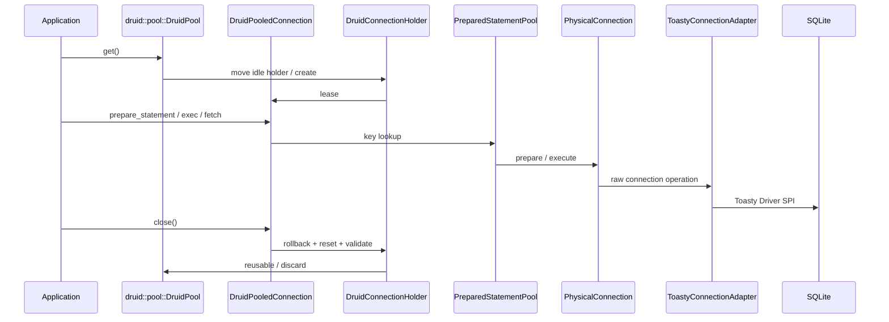

## 7. 验收命令

```bash
./mvnw -pl core -DskipTests=false test
cargo test -p druid --test sqlite_core_semantics_test
cargo test -p druid --test toasty_connection_adapter_test
cargo test -p druid --test wrapper_semantics_test
cargo test -p druid-wrapper --test sqlite_wrapper_semantics_test
cargo test --workspace
cargo llvm-cov --workspace --summary-only
python3 ~/.agents/skills/rust-java-migration/scripts/audit_migration_layout.py \
  --rust-root /Users/wandl/workspaces/workspace-github-easy-4-rust/druid-rust
```

当前全仓覆盖率不是 100%，因此 core 迁移状态保持 `PARTIAL`。

### C1-R2：WrapperAdapter / PoolableWrapper 无损迁移

原 `wrapper.rs` 把 `WrapperAdapter` 与 `PoolableWrapper` 两个 Java 对象压成一个
始终返回 `false` 的字符串判断 trait，既丢失对象边界，也没有实现
`unwrap(Class<T>)`。本切片把平台协议、两个 Druid 对象拆为
`wrapper.rs`、`wrapper_adapter.rs`、`poolable_wrapper.rs` 三个文件：

- `Option<TypeId>` 对应 Java 可空 `Class<?>`；`None` 保留 null 行为。
- `Unwrapped` 显式区分具体运行时对象和 `dyn PhysicalConnection` 接口，避免把
  具体 Adapter 下转冒充 `Connection.class`。
- `PoolableWrapper` 保留空 wrapper、自身、底层对象、
  `DruidStatementConnection#getConnection()` 优先分支及 `WrapperProxy`
  最终委托顺序。
- `DruidPooledConnection` 接入同一协议，可解包自身、内部连接 SPI 和真实
  `SqlxConnectionAdapter`；连接归还后不再暴露已经移出的物理对象。

证据：Java `PoolableWrapperTest` 2/2、`ConnectionTest4` 32/32；
Rust `wrapper_semantics_test` 3/3；真实 SQLite
`sqlite_wrapper_semantics_test` 3/3。这里关闭的是 Wrapper 对象语义，
后续 C2-R65.18 已把 WrapperProxy 的 ID/raw/unwrap/惰性 attributes 合并进
池化门面；各具体 Proxy 的连接元数据、事件身份和 hidden columns 仍保持未完成。
本切片三个生产文件的 Regions/Functions/Lines 均为 100%；实现后 workspace
覆盖率为 Regions 86.95%、Functions 89.64%、Lines 89.84%，全局门禁仍未关闭。

### C3-R7：Prepared/Callable Wrapper 统一

删除 Rust 自造且与 Java 不等价的 `CallableStatementUnwrapTarget` /
`CallableStatementUnwrapped` 双枚举，Prepared 与 Callable 都统一实现
`Wrapper`。`Unwrapped` 现在分别表达具体 raw 对象、`PhysicalPreparedStatement`
和 `PhysicalCallableStatement` 接口：

- 未知类型返回 `None`，对应 Java null，不再错误地返回
  `UnsupportedOperation`。
- Callable 同时可按 CallableStatement、PreparedStatement 和具体驱动类型解包。
- Prepared 可按 PreparedStatement 和具体驱动类型解包。
- 逻辑 statement 关闭后仍保留 raw 类型身份，与 Java PS cache 复用语义一致。

Java `DruidPooledCallableStatementTest`、`CallableStatmentTest`、
`PoolablePreparedStatementTest` 共 28/28 通过；Rust prepared 6/6、callable
2/2 通过；统一协议的真实 SQLite wrapper 3/3 通过。再次执行
`cargo llvm-cov --workspace --summary-only` 后，workspace 覆盖率为 Regions
87.21%（7,170/8,222）、Functions 89.71%（1,090/1,215）、Lines 89.95%
（6,283/6,985），仍有 702 行未覆盖。`wrapper.rs`、
`wrapper_adapter.rs`、`poolable_wrapper.rs` 的 Regions/Functions/Lines 均为
100%；全仓 100% 门禁仍未关闭。ResultSet wrapper 与生产 Proxy/FilterChain
仍按独立账目迁移。

### C2-R8：ExceptionSorter 平台异常与首批 vendor 对象

原 `exception_sorter.rs` 同时定义 trait、MySQL、PG、Null 三个 Java 对象，
且输入被压缩为 `(error_code, message)`，无法表达 Java `SQLException` 的
SQLState、`SQLRecoverableException`、具体异常类名和 cause 链。本切片新增
`SqlException` 平台值对象，并将三个 sorter 拆到各自独立文件：

- MySQL 完整保留 recoverable、SQLState `08`、19 个 fatal error code、
  OceanBase `-9000..=-8000`、`CommunicationsException` 类名、streaming/
  connection 消息，以及最多 5 层 cause 的 socket/communications 判定。
- PostgreSQL 只按 recoverable 或 SQLState `08` 判定；删除旧实现对 `57001`
  数字码和消息文本的错误近似。
- Null 保留共享实例、永不 fatal 与可空 Properties no-op 配置。

DB2、Informix、Sybase 随后按相同协议拆为独立对象，完整保留 recoverable、
SQLState、各自 error code 和可空消息规则。Java vendor oracle 合计 18/18，
Rust `exception_sorter_semantics_test` 6/6 通过；新增的 `SqlException` 与六个
sorter 文件 Regions/Functions/Lines 均为 100%。全仓覆盖率更新为 Regions
87.43%（7,315/8,367）、Functions 89.94%（1,117/1,242）、Lines 90.10%
（6,392/7,094），仍缺 702 行。Oracle、Phoenix、Mock、OceanBase sorter 以及
holder discard 接线仍按后续对象切片迁移，因此
`CORE-CONN-007`/`SEM-CONN-009` 保持 `PARTIAL`。

### C2-R9：Oracle/Phoenix/Mock sorter 与 fatal-discard 主链

本切片继续逐对象迁移剩余五个 Java 对象：
`AbstractOracleExceptionSorter`、`OracleExceptionSorter`、
`OceanBaseOracleExceptionSorter`、`PhoenixExceptionSorter` 和
`MockExceptionSorter`。Oracle 抽象父类没有被合并进具体 sorter，而是成为
独立状态对象，由两个具体对象组合；`SqlException` 新增可赋值类型链，以保留
Mock sorter 的 Java `instanceof` 子类语义。

Oracle/OceanBase 的 recoverable、SQLState、49 个固定 error code、TNS 区间、
正负码、用户配置追加/替换、20000..20999 消息排除及 OceanBase 扩展消息均已
逐分支断言。固定 Java SHA 上的 `OracleExceptionSorter_userDefined`、
`OracleExceptionSorter_userDefined_1`、`OracleExceptionSorterTest`、
`OceanBaseOracleExceptionSorterTest`、`ExceptionSorterTest` 合计 5/5；
连同 C2-R8，vendor Java oracle 为 23/23。Rust
`exception_sorter_semantics_test` 为 10/10。

`DruidError::SqlException` 现可把 Adapter 的结构化数据库错误送入
`DruidPooledConnection#handle_exception`；fatal 命中会同步标记 holder 与
物理 Adapter，exec/fetch/prepared 路径最终只能以 `Discard` 回收。真实
SQLite SQLx 测试已验证 `DatabaseError → SqlException → sorter → Discard`
完整链路。本段当时仍未闭合所有 Connection 操作的统一错误入口、
RBDC/Toasty 的 vendor code/SQLState 提取、ConnectionEventListener 和
错误/fatal 统计；后续 C2-R10 已收敛 Connection 错误入口，C2-R65 已接
ConnectionEventListener，vendor 字段与错误/fatal 统计仍保持 `PARTIAL`。

完整 workspace 覆盖率为 Regions 87.65%（7,657/8,736）、Functions 90.31%
（1,156/1,280）、Lines 90.34%（6,661/7,373），仍有 712 行未覆盖。新增的
abstract/Mock/Phoenix/`SqlException` 文件 Regions/Functions/Lines 均为
100%；Oracle 与 OceanBase 文件 Functions/Lines 为 100%，Regions 分别为
98.46%/98.67%。这说明本切片对象行已覆盖，但全仓 100% 门禁仍远未关闭。

### C2-R10：全 Connection 操作异常入口与 Adapter 结构化错误

Java `DruidPooledConnection` 不只在 execute/query 处理 `SQLException`：
prepare、PreparedStatement close、begin/commit/rollback、savepoint、abort、
ping、auto-commit/read-only/isolation/holdability、warning、catalog 和 schema
操作也必须进入 `handleException`。本切片在 Rust 池化连接内收敛
`classify_result`，并让上述 23 条物理连接操作路径以及 filter 前置错误都经过
同一分类入口。Rust `pooled_connection_exception_paths_test` 逐路径创建独立连接，
验证原始 `SqlException` 返回值不被替换，且 fatal 命中同步标记 holder 与物理
Adapter discard。

固定 Java 基线执行全部
`OracleExceptionSorterTest*`、`OracleExceptionSorter_userDefined*` 和
`OceanBaseOracleExceptionSorterTest`，结果 53/53 通过；这组 oracle 同时覆盖
Connection 与 Statement 异常导致连接丢弃的参考行为。Rust 侧本切片只完成
`PhysicalConnection` 已公开操作的统一入口；Java Statement 全方法族仍按
`CORE-CONN-003` 独立迁移，不能由这 53 个 Java 测试反推为 Rust 已完成。

Adapter 边界不再把所有数据库错误降级成 `DriverError(String)`：

- Toasty `DriverOperationFailed` 映射为 `SqlException`，真实 SQLite 语法错误
  已验证；`ConnectionLost` 继续映射为强制丢弃。
- RBDC 4.9 的公开错误类型只有 `rbs::Error::E(String)`，因此保留消息和
  `rbdc::Error` 运行时身份，vendor code/SQLState 如实为未知值，未伪造解析。
- SQLx 继续保留其公开的 database code/SQLState/message；三类 Adapter 的信息
  上限不同，后续多数据库矩阵必须分别验收。

三 crate workspace 全目标 451/451 通过，真实 SQLite 的 Toasty 结构化错误与
SQLx fatal-discard 回归均通过。覆盖率为 Regions 87.80%（7,707/8,778）、
Functions 91.33%（1,170/1,281）、Lines 90.49%（6,687/7,390），仍有 703 行
未覆盖。本段当时未闭合 ConnectionEventListener；该项已由 C2-R65 补齐生产
接线。错误/fatal 统计、Statement 全操作以及 Toasty/RBDC 上游未公开的
vendor 字段仍未闭合，故
`CORE-CONN-007`/`SEM-CONN-009` 保持 `PARTIAL`，全仓 100% 门禁继续未关闭。

### C2-R11：PreparedStatement 关闭清理异常

Java `DruidPooledConnection#closePoolableStatement` 在缓存归还前调用物理语句的
`clearParameters` 和 `clearBatch`；任一步抛出 `SQLException` 都必须进入连接
sorter，fatal 时丢弃连接，异常语句也不得重新进入 cache。Rust 新增
`DruidPooledPreparedStatement#close_with_connection`：显式验证同一租约，
依 Java 顺序执行两步清理，并用连接统一分类入口原样返回结构化错误。

Rust 分别注入 `clearParameters` 与 `clearBatch` 的 MySQL fatal error，2/2
验证 holder/物理 Adapter discard、异常 statement cache 淘汰和 pool
`discard_count`。全 workspace 全目标更新为 453/453。覆盖率为 Regions
87.82%（7,737/8,810）、Functions 91.42%（1,172/1,282）、Lines 90.52%
（6,713/7,416），未覆盖行仍为 703。无连接参数的兼容 `close`、尚未建立的
`DruidPooledStatement` 约 50 方法、result-set trace 与属性恢复仍使
`CORE-CONN-003` 保持 `PARTIAL`。

### C2-R12：普通 Statement 对象边界与 SQLite 纵向链路

纠正旧 `ConnectionExt#create_statement` 返回 `PhysicalConnection` 的对象边界：
新增独立 `physical_statement.rs`，以 `PhysicalStatement` 表达
`java.sql.Statement` 的属性、批次和资源生命周期；SQL 仍由创建它的
`PhysicalConnection` 执行，Adapter 不持有第二连接或第二连接池租约。

新增 canonical `druid_pooled_statement.rs`，并在 `DruidPooledConnection`
建立 `create_statement`、`create_statement_with_result_set`、
`create_statement_with_holdability` 三个 Java 重载入口。当前已经闭合：

- 同租约身份校验，连接归还后旧 Statement 不能污染下一租约；
- 真实 Toasty SQLite query、update、generated-id `ExecResult` 与 batch；
- max field/rows、query timeout、fetch direction/size、cursor、escape、
  poolable、close-on-completion 与幂等 close；
- self、`dyn PhysicalStatement` 和具体 `SqlTextStatement` 解包。

Java 参考仓库运行 `ConnectionTest4` 32/32、两个 recycle 类 3/3，共 35/35；
Rust 新增真实 SQLite/生命周期测试 5/5，全 workspace 更新为 458/458。
覆盖率为 Regions 88.14%（8,342/9,465）、Functions 91.93%
（1,265/1,376）、Lines 90.91%（7,250/7,975），仍缺 725 行。

本切片不把对象创建等同于全对象完成：Java `execute` 四重载及多结果状态、
`getResultSet/getGeneratedKeys` 的 `DruidPooledResultSet` trace、SQLWarning、
Filter statement 事件和统计尚未迁移，因此 `CORE-CONN-010` 为 `PARTIAL`，
全仓 100% 门禁继续未关闭。

### C2-R13：DruidPooledResultSet 只读游标与 trace 主链

新增 canonical `druid_pooled_result_set.rs`，并把 `java.sql.ResultSet`
平台能力落到独立 `PhysicalResultSet` SPI 与 `RowSetResultSet` eager Adapter。
这不是把 `Vec<Row>` 改名充数：当前纵向链路已经闭合以下可观察语义：

- `DruidPooledStatement#executeQuery` 返回持有同一 Statement 身份的池化结果集；
- `next/previous` 只在成功移动时维护 `cursorIndex`，历史
  `fetchRowCount` 峰值在 ResultSet close 或 Statement 级联 close 时回写；
- Statement trace 使用弱物理引用与共享关闭状态，避免引用环，同时保证级联
  close 会关闭包装对象，而不只是关闭 raw SPI；
- 1-based 列索引、SQL NULL/`wasNull`、基础布尔/整数/浮点/字符串/BLOB
  getter、index/label 重载、ASCII/Unicode/binary/character/NCharacter getter、
  只读滚动游标、warning、metadata、fetch 属性及 type/concurrency/holdability；
- self/`dyn PhysicalResultSet` unwrap、同租约校验、关闭后拒绝和物理错误统一
  进入连接 sorter/Statement 异常计数；
- Java 当前 mock 对 typed `getObject(int/String, Class<T>)` 的
  `SQLFeatureNotSupportedException` 被保留为明确 unsupported。

Java `DruidPooledResultSetTest` 4/4 与 `ResultSetTest2` 36/36 通过；Rust
ResultSet 6/6，其中真实 Toasty SQLite 验证 DDL/DML/query、
NULL/INTEGER/REAL/TEXT/BLOB、流 getter、错误与生命周期。全 workspace 为
464/464。布局审计为
`scanned=102 errors=0 warnings=0 allowed=0 semantic_parity_proven=false`。

覆盖率为 Regions 85.37%（9,624/11,273）、Functions 88.86%
（1,436/1,616）、Lines 87.82%（8,221/9,361），仍缺 1,140 行。分母增加是
因为保留了 ResultSet 的完整 SPI 能力边界和明确 unsupported 默认分支；不能
删除未覆盖的真实分支来美化百分比。Java 对象 192 个公开方法中的 scalar
update、LOB/Array/Ref/RowId/SQLXML、Calendar/Map、stream update、
完整 metadata 与 Filter/统计事件仍未迁移，
所以 `DruidPooledResultSet`、C3 和全仓 100% 门禁均保持 `PARTIAL`。

### C2-R14：ResultSet 强类型值与内置/扩展 Adapter 纵向闭环

以 Java `DruidPooledResultSet` 的 16 个强类型 getter 重载为冻结范围，新增
`JdbcCalendar`/`JdbcCalendarArgument` canonical 对象，并把
`BigDecimal`、`Date`、`Time`、`Timestamp` 纳入 core `Value` 与结果集
metadata。池化门面不自行猜测重载：index/label、deprecated scale、无
Calendar 重载、显式 null Calendar 和具体时区标识均原样下沉到
`PhysicalResultSet`，物理错误仍统一经过 Statement `checkException` 路径。

同一类型身份已同步到三个数据源边界：

- 内置 Toasty SQLite 使用声明列类型恢复 `NUMERIC/DECIMAL` 与
  `DATE/TIME/DATETIME/TIMESTAMP`，不再把强类型静默压成字符串；
- SQLx SQLite 使用 chrono 原生绑定；SQLite NUMERIC affinity 若实际存为
  REAL，则 Adapter 如实返回 `Float`，随后由 JDBC `getBigDecimal` 语义转换，
  不伪造驱动返回类型；
- RBDC 使用 `Decimal/Date/Time/DateTime` extension 保留边界类型；
- SQLx `Any` 没有统一强类型 encoder 的路径明确返回
  `UnsupportedOperation`，避免跨数据库错误绑定。

Toasty 0.9 SQLite vendor compatibility patch 同时移除了强类型路径中的
`todo!`、生产 `unwrap/assert/unreachable`，改为结构化 driver error；其独立
unit/doc tests 4/4 通过。Java oracle 为 `DruidPooledResultSetTest`、
`ResultSetTest`、`DruidPooledResultSetTest2` 合计 54/54；Rust ResultSet
9/9、Toasty 5/5、SQLx SQLite 5/5、RBDC 5/5，且全 workspace 测试通过。
布局审计为
`scanned=118 errors=0 warnings=0 allowed=0 semantic_parity_proven=false`。

`cargo llvm-cov --workspace --summary-only` 的当前实测为 Regions 83.69%
（10,092/12,059）、Functions 87.22%（1,474/1,690）、Lines 86.73%
（8,629/9,949）。新增强类型与三 Adapter 失败分支扩大了真实分母；距离
100% 仍有 1,320 行，不能把本切片写成整体完成。下一批继续闭合 ResultSet
的 LOB/Array/Ref/RowId/SQLXML/URL 与 update 方法族。

### C2-R15：ResultSet 资源 getter 与对象型 update 重载

继续冻结 Java `DruidPooledResultSet` 的资源对象方法，新增并验证：

- `getRef/getBlob/getClob/getArray/getURL/getRowId/getNClob/getSQLXML`
  的 index/label 共 16 个重载；
- `updateRef/updateBlob/updateClob/updateArray/updateRowId/updateNClob/
  updateSQLXML` 的对象型 index/label 共 14 个重载；
- Java null 以 `Option<&Jdbc*>` 原样进入物理 SPI，不用空字节、空字符串或
  默认资源对象替代；
- 每个方法均独立保留 index/label 委托身份，异常继续增加 Statement
  `exceptionCount` 并进入连接异常分类。

真实 Toasty SQLite 行集没有 JDBC LOB/Ref/Array/RowId/SQLXML 资源句柄，也
不是可更新游标，因此 30 个入口逐一返回明确 `UnsupportedOperation`；测试随后
继续读取同一游标，证明非 fatal 能力错误未错误丢弃连接。测试替身另外验证全部
参数原样进入 `PhysicalResultSet`。这属于 Druid wrapper 的等价委托和真实
Adapter 能力边界，不把 SQLite 不具备的 JDBC 能力伪装成成功。

全 workspace 470/470 通过。最新
`cargo llvm-cov --workspace --summary-only` 为 Regions 84.15%
（10,528/12,511）、Functions 87.76%（1,548/1,764）、Lines 87.37%
（9,133/10,453），仍缺 1,320 行。Reader/InputStream 型 LOB update、
scalar/stream update、Map `getObject`、完整 metadata/Filter/统计仍未闭合，
所以 ResultSet 与 100% 门禁保持 `PARTIAL`。

### C2-R16：ResultSet LOB 流式 update 重载

补齐 Java `updateBlob(InputStream)`、`updateClob(Reader)`、
`updateNClob(Reader)` 的 index/label、无长度/long 长度共 12 个重载。
`JdbcStreamLength` 与 `JdbcCharacterLength` 区分 `Unspecified` 和
`Long(length)`，null 流/Reader 原样下沉，池化层不预读、不校正长度。

参数身份测试覆盖全部 12 个入口；真实 Toasty SQLite 对 12 个不可更新游标
路径返回明确 unsupported，累计 42 个资源 getter/update 能力错误后同一游标
仍可继续读取。全 workspace 470/470 通过。最新覆盖率为 Regions 84.38%
（10,714/12,697）、Functions 87.96%（1,578/1,794）、Lines 87.70%
（9,415/10,735），未覆盖行仍为 1,320。scalar/character/binary stream update、
Map `getObject`、完整 metadata/Filter/统计仍未闭合。

### C2-R17：ResultSet 标量/流 update 与 Map getObject 重载

冻结并迁移 Java `DruidPooledResultSet` 的剩余 56 个标量/流更新重载：

- `updateNull`，13 个标量 `updateXxx`，两种 `updateObject` 与
  `updateNString`，均保留 index/label 两套入口；
- ASCII/Binary stream 的无长度、`int`、`long` 重载，Character stream 的
  无长度、`int`、`long` 重载，以及 NCharacter stream 的无长度、`long`
  重载；
- 独立 `ResultSetUpdate` 描述符保留 setter 类型、Java `null`、原始负长度和
  `int/long/未指定` 重载身份；`RdbcInputStream`/`RdbcReader` Clone 只共享
  句柄，不提前读取或关闭；
- `getObject(int/String, Map<String, Class<?>>)` 两个重载直接下沉到
  `PhysicalResultSet`，并区分 index/label 与 `Some/None` Map。

参数身份测试逐一覆盖 58 个入口。真实 Toasty SQLite 逐一返回明确
`UnsupportedOperation`，58 次错误全部增加同一 Statement 的
`exceptionCount` 并进入连接异常分类；随后同一结果集仍能读取下一行，证明
非 fatal 能力错误没有破坏游标或流句柄。Java 三组 ResultSet oracle 54/54，
Rust ResultSet 12/12，全 workspace 473/473 通过；布局审计为
`scanned=119 errors=0 warnings=0 allowed=0 semantic_parity_proven=false`。

最新 `cargo llvm-cov --workspace --summary-only` 为 Regions 84.66%
（10,958/12,943）、Functions 88.18%（1,612/1,828）、Lines 88.14%
（9,808/11,128），仍有 1,320 行未覆盖。完整 ResultSet metadata、
typed `getObject` 的真实驱动转换、Filter/统计、streaming 与多数据库矩阵仍
开放；`updateObject` 当前承载已迁移的 `Value` 类型，任意 vendor custom
object 仍需独立不透明句柄。因此 ResultSet 和全仓 100% 门禁保持 `PARTIAL`。

### C2-R18：typed getObject 与 JDBC Object 平台对象

本切片把此前仅有方法名称、但固定返回 unsupported 的
`getObject(int/String, Class<T>)` 改为真实 `PhysicalResultSet` SPI：

- `JdbcTargetType` 无损表达 Java `Class<T>` 目标，index/label 两个重载均把
  原始目标类型下沉到物理结果集；默认实现覆盖 String、Boolean、Byte、Short、
  Integer、Long、Float、Double、BigDecimal、Date、Time、Timestamp、Bytes
  与 SQL NULL；
- Blob、Clob、NClob、Array、Ref、RowId、SQLXML、URL 目标委派相应资源
  getter，不把资源静默物化为字符串或字节；
- 新增 `JdbcOpaqueObject`/`PhysicalJdbcOpaqueObject`，以 `Arc` 保留
  driver/vendor 自定义对象的引用身份、类名和受控 downcast；
  `ResultSetUpdate::Object` 及 `updateObject` 不再限制为 `Value`；
- 通用平台名称统一为 `JdbcObject`、`JdbcTargetType`、`JdbcTypeMap`。
  `CallableOutputValue`、`CallableTargetType`、`CallableTypeMap` 仅保留兼容
  alias，不再作为 canonical 名称。

真实 Toasty SQLite 验证 13 个标准标量目标、SQL NULL、byte 越界错误和
custom unsupported；目标类型身份测试验证 index/label 原样委托，资源测试
验证八种默认 getter 分派。Toasty 当前 fetch API 未保留列标签元数据，因此
真实 SQLite 只验证 index typed overload；label 身份已由原始 SPI probe
闭合，真实 label 集成仍是公开缺口。

证据：Java 三组 ResultSet oracle 54/54、Rust ResultSet 16/16、全 workspace
477/477、普通 `cargo clippy --workspace --all-targets` 退出码 0；严格
`-D warnings` 仍受全仓 324 个既有 lint 债务阻塞。布局审计为
`scanned=120 errors=0 warnings=0 allowed=0 semantic_parity_proven=false`。
覆盖率为 Regions 84.21%（11,180/13,277）、Functions 87.82%
（1,636/1,863）、Lines 87.87%（9,930/11,301），仍有 1,371 行未覆盖。
完整 metadata、真实 label metadata、Filter/统计、streaming 和多数据库矩阵
仍开放，因此 ResultSet 与全仓 100% 门禁继续保持 `PARTIAL`。

### C2-R19：ResultSetMetaData 标准列契约

`java.sql.ResultSetMetaData` 不再压缩为 label/type/nullable 三字段对象：

- `ResultSetColumnType` 独立映射当前可无损区分的 `java.sql.Types` 数值、
  标准类型名、默认 Java class name 与 signed 语义；
- `ResultSetNullability` 独立保留 `columnNoNulls`、`columnNullable`、
  `columnNullableUnknown` 三态，避免用 bool 丢失 unknown；
- `ResultSetColumnMeta` 独立保存 label/name、schema/table/catalog、
  vendor type/class、display size/precision/scale，以及 autoIncrement、
  caseSensitive、searchable、currency、signed、readOnly/writable/
  definitelyWritable；
- `ResultSetMetaData` 对外补齐上述 Java 标准 getter，并统一执行 1-based
  下标验证。RowSet 默认只填充它确实知道的字段，未知 origin/shape 为空或零，
  不从 SQL 文本猜测。

Toasty 0.9 `Response` 只提供值流，没有公开列名和 origin descriptor，因此
真实 SQLite 仍只能验证运行时类型和 eager RowSet 默认 metadata；schema、
table、catalog、真实 label/type name 必须等待 Adapter 上游提供 descriptor。

证据：Rust ResultSet 17/17、全 workspace 478/478、普通 Clippy 退出码 0；
布局审计 `scanned=123 errors=0 warnings=0 allowed=0`。覆盖率为 Regions
84.33%（11,395/13,512）、Functions 88.01%（1,666/1,893）、Lines 88.05%
（10,101/11,472），仍有 1,371 行未覆盖。三个新 descriptor 文件行覆盖
100%，`ResultSetMetaData` 方法行覆盖 100%；真实驱动 metadata 供给、
Wrapper、Filter/统计、streaming 和多数据库仍为 `PARTIAL`。

### C2-R20：ResultSetMetaData 物理对象身份与错误时机

CodeGraph 复核确认，Java `DruidPooledResultSet#getMetaData()` 直接返回底层
driver 的 `ResultSetMetaData`，不会提前复制列描述。因此物理 metadata 的每个
getter 必须在调用时委托，driver 错误也必须在对应 getter 调用时发生，不能被
eager snapshot 吞掉或提前触发。

本切片新增独立 `PhysicalResultSetMetaData` SPI，并将 canonical
`ResultSetMetaData` 改为双后端句柄：

- eager `ResultSetColumnMeta` 后端继续服务 `RowSetResultSet`；
- physical 后端以共享句柄保存真实 driver metadata，全部标准 getter 逐次委托；
- `Wrapper` 同时保留 `ResultSetMetaData` 自身、`dyn
  PhysicalResultSetMetaData` 接口和具体 driver metadata 对象身份；
- `getColumnCount` 与其他 getter 一样返回结构化错误，保持 Java
  `SQLException` 时机；物理句柄 clone 共享同一对象，不复制 driver 状态。

证据：Java 三组 ResultSet oracle 54/54；Rust ResultSet 18/18；全 workspace
479/479；普通 Clippy 退出码 0。布局审计
`scanned=124 errors=0 warnings=0 allowed=0 semantic_parity_proven=false`。
覆盖率为 Regions 84.35%（11,560/13,705）、Functions 88.02%
（1,675/1,903）、Lines 87.98%（10,207/11,602），仍有 1,395 行未覆盖。

Toasty 0.9 仍未公开列名/origin descriptor，所以真实 SQLite 当前只能走
eager 运行时 metadata，不能冒充已具备真实 driver descriptor。Filter/统计、
streaming、多数据库和全仓覆盖率 100% 仍开放，整体状态保持 `PARTIAL`。

### C2-R21：JdbcResultSetStat 独立统计对象

CodeGraph 冻结 `JdbcResultSetStat` 全字段与 `StatFilter#resultSet_close` 调用链
后，新增同名独立 Rust 对象，完整保留 opening/open/error、存活纳秒
total/max/min、最近打开/错误时间、fetch row 和 close counter。并发峰值沿用
Java CAS 更新，错误对象保留结构化 `DruidError`。

本对象还刻意保留两个容易被误修的 Java 行为：`reset()` 不清零当前
`openingCount`；`aliveNanoMin` 从 0 开始且仅在新值更小时更新，所以正耗时
关闭后最小值仍为 0。Java 原类 JShell oracle 与 Rust 状态序列一致，并补充
16 线程并发峰值/关闭守恒测试。

证据：Java oracle 1/1、Rust 对象测试 2/2、全 workspace 481/481、普通
Clippy 退出码 0；布局审计
`scanned=125 errors=0 warnings=0 allowed=0 semantic_parity_proven=false`。
覆盖率为 Regions 84.51%（11,765/13,922）、Functions 88.17%
（1,700/1,928）、Lines 88.04%（10,341/11,746），仍有 1,405 行未覆盖。

当前仅完成统计对象本身；`StatFilter → ResultSetProxy → physical ResultSet`
的 open/close/error 接线、SQL 级 hold/read length 统计与管理面尚未迁移，
所以统计链路和整体状态均保持 `PARTIAL`。

### C2-R22：ResultSet 同步 FilterChain 与统计纵向接线

Java `ResultSetProxyImpl` 的 `resultSet_*` 是同步 around-chain：Filter 能在
委托前后执行、短路或改写结果，并非只读事件通知。本切片新增独立
`ResultSetFilter`、`ResultSetFilterChain` 与 `ResultSetFilterContext`：

- 每次 `next/close` 都从 chain 位置 0 开始，Filter 按注册顺序进入、按调用栈
  逆序退出；`resultSetOpenAfter` 按逆序执行；
- `next` 可短路而不调用物理 ResultSet；下游错误不会执行上游 after 代码；
- context 保留 Java `constructNano`、`fetchRowCount`、`closeCount` 时机；
- 连接创建 Statement 时传递同一 FilterChain，显式关闭与 Statement trace
  级联关闭均经过同一结果集链；
- `StatFilter` 在 open 时调用 `beforeOpen`，close 时严格在物理 close 前提交
  hold/fetch/close。下游 close 失败时这些统计不回滚，而代理 closeCount 只有
  成功后才增加；
- `JdbcResultSetStat#error()` 没有被 Java 当前 StatFilter ResultSet 链调用，
  Rust 不擅自把所有 getter 错误计入该字段。

Java oracle 覆盖池化 Statement/ResultSet、LogFilter 与 StatFilter，共 95/95；
Rust 新链路 4/4，包含顺序、短路、错误展开、默认委托与真实 Toasty SQLite
显式/Statement 级联关闭。全 workspace 485/485，普通 Clippy 退出码 0；
布局审计
`scanned=128 errors=0 warnings=0 allowed=0 semantic_parity_proven=false`。

覆盖率为 Regions 84.78%（11,967/14,116）、Functions 88.46%
（1,732/1,958）、Lines 88.23%（10,480/11,878），仍有 1,398 行未覆盖。
三个新增 ResultSet Filter 文件和 `StatFilter` 均达到行/函数/Regions 100%。
完整 ResultSet getter/update Filter 方法族、SQL 级 hold/read length 统计、
`StatFilterContext` 监听器、完整 `FilterChainImpl`、多数据库与全仓 100%
仍为 `PARTIAL`。

### C2-R23：StatFilterContext / Listener 与 ResultSet 全局事件

本切片新增同名独立 `StatFilterContext` 与 `StatFilterContextListener`，并以
CodeGraph 和 Java JShell oracle 冻结真实行为：

- context 是进程级单例；listener 允许同一实例重复注册，删除只移除第一个
  相同实例；
- 写操作复制并替换列表，但 Java 分发使用反复求值的 `size()/get(i)` 下标
  循环，并非 iterator 固定快照；因此回调中追加 listener 会参与当前轮分发；
- 14 个事件方法全部迁移，可空 `Throwable` 映射为
  `Option<&DruidError>`；首个 listener 异常立即中止后续 listener 和当前调用；
- `StatFilter` 的 ResultSet open 在本地 `beforeOpen/setConstructNano` 后触发
  全局 open；close 严格按“全局结果集统计 → context fetch → 物理 close →
  context close”执行，物理 close 失败时不发送 context close；
- ResultSet open listener 失败会从池化 Statement API 原样返回，且已发生的
  `beforeOpen` 不回滚，与 Java unchecked exception 时序一致。

Java 既有 ResultSet/Statement/Filter oracle 95/95；JShell 动态追加、重复注册
与首次删除 oracle 3/3。Rust 新 context 测试 3/3，覆盖全部事件、动态增补、
异常短路和真实 Toasty SQLite；全 workspace 488/488，普通 Clippy 退出码
0；布局审计
`scanned=130 errors=0 warnings=0 allowed=0 semantic_parity_proven=false`。

覆盖率为 Regions 84.98%（12,151/14,299）、Functions 88.67%
（1,769/1,995）、Lines 88.37%（10,615/12,012），仍有 1,397 行未覆盖。

`StatFilterContextListenerAdapter` 仍是明确的独立缺口；commit/rollback、
pool/physical connection、SQL execute 与 LOB 事件虽已具备 context 分发方法，
尚未全部接入生产调用链。完整 `FilterChainImpl`、多数据库与全仓覆盖率 100%
仍开放，整体保持 `PARTIAL`。

### C2-R24：ListenerAdapter 与 SQL/事务全局事件时序

本切片先以 CodeGraph 冻结 `StatFilter`、`DruidPooledConnection` 和
`StatFilterContextListenerAdapter` 的 Java 调用路径，再按对象与行为迁移：

- 新增独立具体对象 `StatFilterContextListenerAdapter`，显式实现 14 个无操作
  回调，不能以 Listener trait 的默认方法冒充；
- `ExecContext` 增加 `in_transaction` 与 query/update 操作类型；
  `StatFilter` 在物理 SQL 前发送 execute before，在本地统计完成后依次发送
  update count 和 execute after；
- `FilterChain::add_filter` 将同一个 Java 风格 Filter 实例注册到 SQL、
  connection 和 ResultSet 三类 hook，避免调用方漏接其中一族；
- after 按反向顺序首错中止并传播。before listener 失败时 SQL 尚未执行；
  after listener 失败可覆盖成功返回，但 SQL 副作用已经发生；
- commit/rollback 只在物理操作成功后发送全局事件；listener 失败可以覆盖
  返回，但事务副作用已经发生；保存点 rollback 不发送全局 rollback。

Java Maven 扩展 oracle 97/97；真实 MockDriver JShell oracle 同时验证
auto-commit、事务 execute/update/after、commit、rollback 与 SQL 错误顺序。
Rust 全 workspace 489/489，包含真实 SQLite 的 SQL、完整事务、保存点及四类
listener 失败边界；普通 Clippy 退出码 0（仓库既有 warnings 未清零），格式检查
通过。布局审计
`scanned=131 errors=0 warnings=0 allowed=0 semantic_parity_proven=false`。

覆盖率为 Regions 85.09%（12,250/14,396）、Functions 88.70%
（1,789/2,017）、Lines 88.45%（10,704/12,102），仍有 1,398 行未覆盖；
新增 Adapter 行/函数/Regions 均为 100%。

本轮只关闭已接入口的精确时序。Java batch 的单次 before/after 与
`int[]` update count、generic execute、pool connect/close、physical
connect/close、LOB 事件、无活动事务时 pooled rollback 边界及完整
`FilterChainImpl` 仍开放，整体保持 `PARTIAL`。

### C2-R25：普通 Statement batch 精确 Filter/统计语义

本切片用 CodeGraph 冻结
`DruidPooledStatement → StatementProxyImpl → FilterChainImpl →
FilterEventAdapter → StatFilter` 的 batch 纵向链，并以 Java MockDriver JShell
补足运行时 oracle。迁移结果：

- `PhysicalConnection::exec_batch` 形成一次物理 batch 边界，返回 JDBC
  `Vec<i32>`，允许 `SUCCESS_NO_INFO=-2` 与 `EXECUTE_FAILED=-3`；
- `DruidError::BatchUpdateException` 保存失败前的部分 `int[]` 和原始 SQL
  cause，fatal sorter 递归检查 cause；
- `BatchExecContext` 保存原始 SQL 列表、`"\n;\n"` 合并 SQL、数据源、事务态
  和开始时间；Filter 链只执行一次 before 与一次反向 after；
- `StatFilter` 成功时逐项发送 update count。普通 Statement 的 Java
  `lastExecuteSql` 在成功 batch 后仍为 null，因此 after SQL 用
  `Option<&str>::None` 精确保留；失败时 after 使用合并 SQL 和
  `BatchUpdateException`；
- 多元素 batch 后 `getUpdateCount()` 为 `-1`，单元素时设置该唯一计数；
  batch 不被隐式清空；
- batch count/size total 已进入 `StatsCollector`。after listener 失败会覆盖
  返回值，但真实 SQLite 的全部物理副作用已经发生。

Java 扩展 Maven oracle 100/100；JShell oracle 得到成功 `[1,-2]`、部分失败
`[1]`，事件严格为
`before(merged) → update:1 → update:-2 → after(null,null)` 和
`before(merged) → after(merged,BatchUpdateException)`。Rust workspace
491/491，真实 SQLite 验证成功、部分失败、nullable SQL、单/多元素
updateCount 与 listener 覆盖时序；普通 Clippy 退出码 0（既有 warnings
未清零），格式与 diff 检查通过。布局审计
`scanned=131 errors=0 warnings=0 allowed=0 semantic_parity_proven=false`。

覆盖率为 Regions 85.21%（12,385/14,534）、Functions 88.80%
（1,807/2,035）、Lines 88.54%（10,804/12,203），仍有 1,399 行未覆盖。
本轮新增生产行已覆盖；全仓 100% 门禁仍未关闭。

PreparedStatement 参数快照 batch、driver 原生 batch 覆盖、多数据库
`-2/-3` 返回、generic execute、pool/physical/LOB 事件、完整
`FilterChainImpl` 和覆盖率 100% 继续开放，整体保持 `PARTIAL`。

### C2-R26：PreparedStatement 参数快照 batch 精确语义

本切片先用 CodeGraph 冻结
`DruidPooledPreparedStatement → PreparedStatementProxyImpl →
StatementProxyImpl#executeBatch → FilterChainImpl →
FilterEventAdapter → StatFilter` 的完整调用链，再用 Druid +
xerial SQLite JShell 获取运行时 oracle。源码和运行时共同确认：

- `addBatch()` 由物理 PreparedStatement 在调用时保存参数快照；
  `clearParameters()` 不影响已经加入的批次；
- PreparedStatement 的 `getBatchSql()` 固定返回预编译 SQL，但继承的
  `batchSqlList` 从未加入参数批次，因此 StatFilter 的 batch size 精确为 0；
- PreparedStatement 覆盖 `getLastExecuteSql()`，成功和失败 after 回调都使用
  固定预编译 SQL，与普通 Statement 成功 after 的 `null` 不同；
- xerial SQLite 在成功和驱动失败后均消费批次，before Filter 短路则尚未进入
  驱动，不得消费；成功逐项发送 update count。

Rust 迁移新增 `BatchExecKind::PreparedStatement` 和
`BatchExecContext.parameter_sets`，`DruidPooledPreparedStatement` 提供
`add_batch/clear_parameters/clear_batch/execute_batch/batch_size`，
`PhysicalConnection::exec_prepared_batch` 提供可由 SQLx/RBDC 等 Adapter
覆盖的原生边界；默认实现复用同一物理 PreparedStatement 顺序执行，失败用
`BatchUpdateException` 保存已完成计数和结构化 cause。外部池
`PhysicalConnectionLease` 透明委托该能力。

Java xerial SQLite oracle 精确得到：

- success `[1,1]`，参数行 `[1:first,2:second]`；
- 执行后 repeat `[]`，单项 clear 后 `[1]`；
- 冲突错误 `SQLiteException`，错误后 repeat `[]`；
- SQL stat batch size `0:0`；
- 每次 Filter 事件均为固定 prepared SQL，成功逐项 update 后 after。

Java Prepared/Filter Maven 目标用例 10/10；Rust workspace 494/494。真实
Toasty SQLite 验证参数快照、clearParameters 独立性、执行后消费、部分成功
计数、before 短路重试、固定 SQL after 和 Java 零 batch-size；普通 Clippy
退出码 0（仓库既有 warnings 未清零），格式和 diff 检查通过。布局审计继续为
`scanned=131 errors=0 warnings=0 allowed=0 semantic_parity_proven=false`。

覆盖率为 Regions 85.31%（12,544/14,704）、Functions 88.82%
（1,819/2,048）、Lines 88.64%（10,920/12,320），仍有 1,400 行未覆盖。
`PhysicalPreparedStatement` 与 `PhysicalConnectionLease` 当前均为
行/函数/Regions 100%；全仓 100% 门禁尚未关闭。

SQLx/RBDC/PostgreSQL/MySQL 原生 prepared batch、`-2/-3` 驱动矩阵、完整
JDBC setter 状态、generic execute、pool/physical/LOB、完整
`FilterChainImpl` 和全仓覆盖率 100% 继续开放，整体保持 `PARTIAL`。

### C2-R27：普通 Statement generic execute、多结果与 generated keys

本切片先用 CodeGraph 冻结
`DruidPooledStatement → StatementProxyImpl → FilterChainImpl →
FilterEventAdapter → StatFilter` 的普通 `execute` 纵向链，再用 Druid +
xerial SQLite 运行时 oracle 校准 getter、推进和异常发生时机。迁移后的状态机：

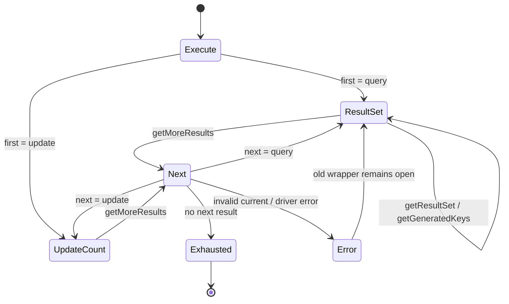

`DruidPooledStatement` 现在提供 plain、auto-generated-keys、column-indexes 和
column-names 四种 execute 入口；`StatementExecuteResult` 保存有序的 query /
update 结果，`PhysicalStatement` getter/推进钩子保留 Java 的驱动错误时机。
成功推进只逻辑关闭旧的池化 ResultSet wrapper，不额外发显式 close hook；
推进失败保持旧 wrapper 开放。generic DML 的 StatFilter 只累加 SQL 级
update count，不错误发送全局 update-count listener。

Toasty SQLite 使用 `RawSqlRet::Infer`，由 prepared statement 的
`column_count` 判断 query/update，不靠 SQL 前缀猜测；普通与
`RETURN_GENERATED_KEYS` INSERT 均返回真实 `last_insert_rowid`。列索引/列名
选择在 Toasty SQLite 明确返回 unsupported，与 xerial SQLite oracle 一致。
mock 物理连接另行验证 query → update → query 顺序多结果与重载参数原样传递。

Java Maven 定向用例 42/42；xerial SQLite JShell 验证 SELECT、INSERT、
generated keys、成功/失败 `getMoreResults` 及 wrapper 关闭边界。Rust
workspace 497/497，真实 SQLite 和 mock 多结果测试通过；普通 Clippy 退出码
0（既有 warnings 未清零），格式检查通过。布局审计仍为
`scanned=131 errors=0 warnings=0 allowed=0 semantic_parity_proven=false`。

覆盖率为 Regions 85.64%（12,920/15,087）、Functions 88.96%
（1,853/2,083）、Lines 88.92%（11,213/12,610）。其中
`physical_statement.rs` 和 `physical_connection_lease.rs` 行/函数/Regions
均为 100%；`druid_pooled_statement.rs` 为 Functions 100%、Lines 99.35%。

PreparedStatement generic execute、SQLWarning、SQLx/RBDC/PostgreSQL/MySQL
原生多结果与 generated-key 矩阵、完整 FilterChainImpl 和全仓覆盖率 100%
继续开放，整体保持 `PARTIAL`。

### C2-R28：PreparedStatement generic execute、多结果与 generated keys

本切片用 CodeGraph 逐层冻结
`DruidPooledPreparedStatement → PreparedStatementProxyImpl →
FilterChainImpl → FilterEventAdapter → StatFilter`，并用 Druid +
xerial SQLite 运行时 oracle 校准 PreparedStatement 独有的 generated-key
重载差异。PreparedStatement 现在复用 Statement 状态机，但仍通过同一个
物理 prepared handle 执行固定 SQL 与参数：

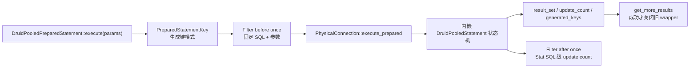

`PreparedStatementKey` 的 auto-generated-keys、column-indexes 和
column-names 模式会原样进入物理 SPI；与普通 Statement 不同，xerial
SQLite 接受 PreparedStatement 的列索引/列名重载。Toasty SQLite 因此对
PreparedStatement 三种生成键模式均返回真实 `last_insert_rowid`，而普通
Statement 的列选择器仍保持驱动一致的 unsupported。默认物理 SPI 不猜测 SQL，
没有 generic execute 能力的 Adapter 明确返回 unsupported。

成功 `getMoreResults` 关闭旧的池化 ResultSet wrapper；非法 current 或驱动
getter/推进失败时保持旧 wrapper 状态，并由连接 exception sorter 决定物理连接
是否丢弃。Filter 的 before/after/error 各执行一次，事件中固定 SQL、参数和
`ExecOperation::Execute` 均与 Java 一致；generic DML 仅增加 SQL 级 update
count，不发送错误的全局 update-count 事件。

Java Prepared/Filter Maven 定向用例 46/46；Druid + xerial SQLite oracle
验证 SELECT、INSERT、四种生成键入口、成功推进及非法 current 的 wrapper
边界。Rust workspace 覆盖执行了 500/500 个测试；真实 Toasty SQLite 覆盖
SELECT/INSERT/生成键，mock 覆盖 query → update → query 多结果与四条物理
getter 错误分类路径。普通 Clippy 退出码 0（仓库既有 warnings 未清零），格式、
diff 和布局检查通过；布局审计仍为
`scanned=131 errors=0 warnings=0 allowed=0 semantic_parity_proven=false`。

| 指标 | 覆盖 | 已覆盖/总量 |
| :--- | ---: | ---: |
| Regions | 85.94% | 13,266 / 15,436 |
| Functions | 89.15% | 1,882 / 2,111 |
| Lines | 89.24% | 11,469 / 12,852 |

本切片结束时尚未完成的 `DruidPooledResultSet#getStatement()` Prepared
动态身份已由 C2-R31 闭合；SQLx/RBDC/PostgreSQL/MySQL 原生多结果/
generated-key 矩阵、完整 FilterChainImpl 和全仓覆盖率 100% 继续开放，
整体保持 `PARTIAL`。

### C2-R29：Connection/Statement/PreparedStatement/ResultSet SQLWarning

本切片用 CodeGraph 对照 Java 的 `DruidPooledConnection`、
`DruidPooledStatement`、`DruidPooledResultSet` 与
`FilterChainImpl` 六条 warning 路径，把 SQLWarning 作为连接抽象的正式能力
迁入 Rust，而不是在池化门面中固定返回空值：

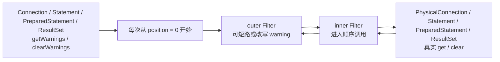

`ConnectionWarningFilterChain`、`StatementWarningFilterChain` 和
`ResultSetFilterChain` 都按 Java 的位置化 around-chain 进入与逆序展开；
PreparedStatement 使用自己的物理 prepared handle，但复用 Statement Filter
方法族。`SqlWarning` 保留 message、SQLState、vendor code 与 next-warning
链。异常时序也按 Java 保留：Connection getter 的底层错误原样返回，不进入
sorter；Connection clear 以及 Statement、PreparedStatement、ResultSet 的
getter/clear 都进入异常分类。

Druid + xerial SQLite oracle 验证四类对象初始 warning 均为空、clear 均成功；
双层 Filter 的返回改写和完整调用顺序与 Rust 一致。Java Maven 定向用例
120/120；Rust workspace 覆盖执行 506/506 个测试，真实 Toasty SQLite 覆盖
四类对象，mock 覆盖短路、改写、物理终点和 fatal sorter。

| 指标 | 覆盖 | 已覆盖/总量 |
| :--- | ---: | ---: |
| Regions | 86.21% | 13,598 / 15,774 |
| Functions | 89.42% | 1,943 / 2,173 |
| Lines | 89.49% | 11,762 / 13,144 |

普通 Clippy、格式、diff 和布局门禁在本切片验收时执行；当时开放的
SQLx/RBDC Connection warning Adapter 已由 C2-R30 闭合。其余
FilterChainImpl 方法族和全仓覆盖率 100% 继续开放，整体保持 `PARTIAL`。

### C2-R30：SQLx/RBDC Connection warning Adapter

本切片把 C2-R29 已建立的 warning SPI 落到 `druid-wrapper` 两个 direct
Adapter。SQLx 和 RBDC 的公开 Connection SPI 都没有 JDBC warning 读取入口，
所以存活连接返回 `None` 是经能力审计后的真实结果，不是默认 stub：

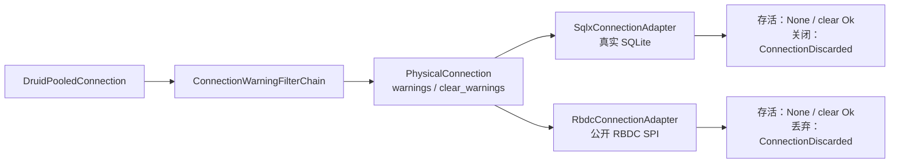

两个 Adapter 的 `clear_warnings` capability 均更新为 true；关闭或丢弃连接
不会错误返回成功。SQLx direct 真实 SQLite 聚合测试 5/5，RBDC Adapter 合同
6/6；全 workspace 精确执行 507/507 个测试。普通 Clippy、格式和布局门禁通过，
布局仍为 `scanned=131 errors=0 warnings=0`。

| 指标 | 覆盖 | 已覆盖/总量 |
| :--- | ---: | ---: |
| Regions | 86.25% | 13,612 / 15,782 |
| Functions | 89.53% | 1,949 / 2,177 |
| Lines | 89.61% | 11,786 / 13,152 |

RBDC 真实 SQLite driver、SQLx/RBDC Statement/PreparedStatement 原生多结果与
generated-key 矩阵、剩余 Filter 方法族和全仓覆盖率 100% 继续开放。

### C2-R31：ResultSet#getStatement Prepared 动态身份

Java 的 `DruidPooledResultSet` 直接持有创建它的
`DruidPooledPreparedStatement`，所以 `getStatement()` 必须返回同一对象，而
不是只有同一个物理 SQL。Rust 通过共享生命周期和具体身份句柄迁移该语义：

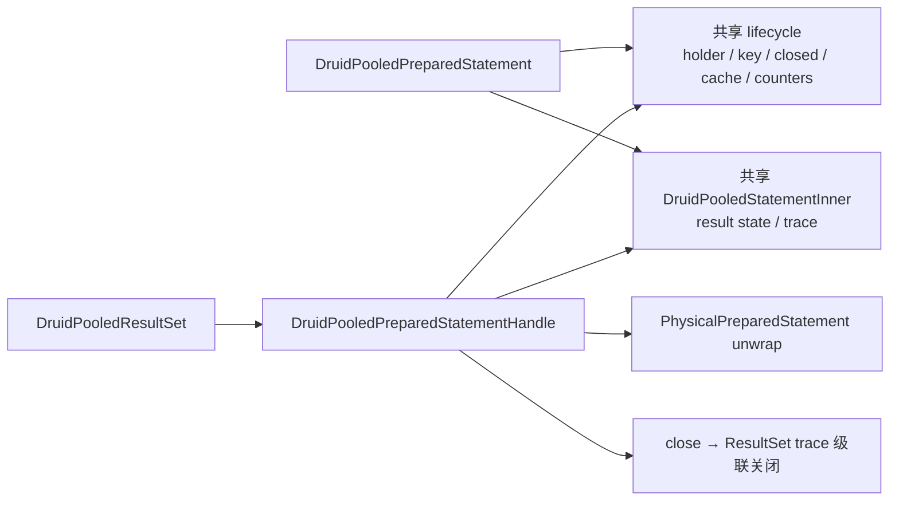

query、generic current ResultSet 和 generated keys 都携带该句柄；普通
Statement ResultSet 明确返回 `None`。原 Prepared 局部变量先 Drop 时，ResultSet
的强句柄会延迟物理语句回收；从 ResultSet 取得的句柄关闭语句时会执行
clear-parameters/clear-batch、缓存归还/淘汰和 ResultSet 级联关闭。

Druid+xerial SQLite oracle 证明引用相等、具体类型、ResultSet 关闭后身份保持及
Statement 关闭级联四项均为 true。Rust Toasty SQLite 验证同一 key/物理 unwrap/
强生命周期/关闭级联；定向测试 18/18 + 16/16，全 workspace 510/510。普通
Clippy、格式和布局门禁通过，布局为 `scanned=131 errors=0 warnings=0`。

| 指标 | 覆盖 | 已覆盖/总量 |
| :--- | ---: | ---: |
| Regions | 86.44% | 13,772 / 15,933 |
| Functions | 89.79% | 1,971 / 2,195 |
| Lines | 89.76% | 11,939 / 13,301 |

CallableStatement ResultSet 的具体动态身份由 C2-R32 闭合；Prepared JDBC
setter/完整属性、多数据库原生执行矩阵、剩余 Filter 方法族和全仓覆盖率 100%
继续开放。

### C2-R32：ResultSet#getStatement Callable 动态身份

Java `DruidPooledCallableStatement` 继承 `DruidPooledPreparedStatement`，继承的
query/current/generated-keys 创建 `DruidPooledResultSet` 时传入的 `this` 仍是
原 callable 对象。因此 Rust 不能只返回 Prepared 句柄：

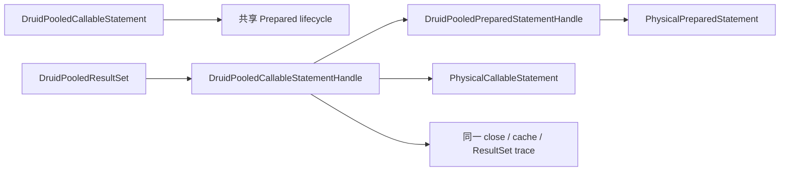

`fetch_result_set`、generic `execute/result_set/update_count`、generated keys 和
more-results 继承入口均落在 callable facade；结果集同时暴露
`callable_statement()` 与继承的 `prepared_statement()`。句柄支持
Callable/Prepared/raw concrete 三层 unwrap、强生命周期和重复关闭幂等。

SQLite 不实现 JDBC CallableStatement，不能伪造“真实 SQLite 存储过程”证据；
本切片以 Java CodeGraph 继承/构造调用链为 oracle，并使用真实 callable 物理 SPI
测试双验证动态分派、顺序多结果和生命周期。定向测试 4/4 + 16/16 + 18/18，
全 workspace 512/512 通过；普通 Clippy、格式和布局门禁通过。

| 指标 | 覆盖 | 已覆盖/总量 |
| :--- | ---: | ---: |
| Regions | 86.45% | 13,887 / 16,063 |
| Functions | 89.73% | 1,992 / 2,220 |
| Lines | 89.74% | 12,050 / 13,428 |

真实 PostgreSQL/MySQL 存储过程 Adapter、Prepared JDBC setter/完整属性、
多数据库原生执行矩阵、剩余 Filter 方法族和全仓覆盖率 100% 继续开放。

### C2-R33：PreparedStatement setter 与持久绑定参数

Java `DruidPooledPreparedStatement` 的 `setXxx` 不是一次执行参数的便利函数：
它在 setter 调用时检查开放状态、立即调用物理 statement，并把异常交给
`checkException`；后续无参 `executeQuery/executeUpdate/execute/addBatch` 使用
statement 内当前参数状态。Rust 现按同一生命周期迁移：

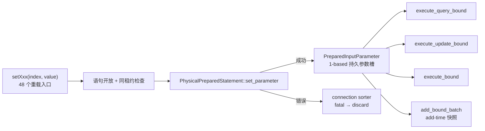

`PreparedInputParameter` 保留 Boolean/Byte/Short/Int/Long/Float/Double 的调用类型，
nullable Decimal/String/NString/Bytes，Date/Time/Timestamp 的 Calendar 三态，
`setNull` 的 typeName 重载差异，`setObject` 的 targetSqlType/scale，以及
Stream/Reader 的 int/long/无长度和 LOB/Array/Ref/URL/RowId/SQLXML 资源身份。
池化层不预读流，也不以 String/Bytes 冒充资源。重复 setter 覆盖槽位，执行前
拒绝参数空洞；物理 `clearParameters` 成功后才清空逻辑状态，已加入 batch 的
快照不受影响。

真实 Toasty SQLite 已验证 15 列标量/null 的 update 与强类型读回、绑定 query、
generic execute 和两组 add-time batch 快照；SQLite 自身把 BOOLEAN 读成 INTEGER，
把 NUMERIC 的无意义尾零规范化，但执行前的 Rust 描述符仍保留 Bool 和原始
BigDecimal。物理 setter 注入 MySQL fatal 异常时，错误在 setter 调用点返回且
连接立即 discard。资源描述符执行当前显式返回
`prepared_parameter_requires_native_adapter`，并证明流未被预读；这项不会被
登记为 Adapter 原生绑定完成。

定向 Prepared 测试 19/19、全 workspace 515/515、普通 Clippy、格式和布局门禁
通过；布局为
`scanned=132 errors=0 warnings=0 allowed=0 semantic_parity_proven=false`。

| 指标 | 覆盖 | 已覆盖/总量 |
| :--- | ---: | ---: |
| Regions | 86.84% | 14,402 / 16,584 |
| Functions | 90.00% | 2,052 / 2,280 |
| Lines | 90.21% | 12,720 / 14,100 |

本批新增 `PreparedInputParameter` 的 Regions/Functions/Lines 均为 100%。

本切片关闭“无 Prepared setter 状态”的缺口，但 `CORE-CONN-003`、
`CORE-CONN-013` 与 `SEM-CONN-005` 保持 `PARTIAL`：Toasty/SQLx/RBDC 的
LOB/stream/resource 原生绑定、PostgreSQL/MySQL/Turso 矩阵和全仓覆盖率
100% 仍开放。继承 Statement 属性与关闭恢复由后续 C2-R34 关闭。

### C2-R34：PreparedStatement 继承属性与缓存回收恢复

Java `PreparedStatement` 继承 `Statement`，不能让 Rust 的
`DruidPooledPreparedStatement` 只保存一个与真实 prepared handle 无关的
`SqlTextStatement`。本切片把继承能力下沉到 `PhysicalPreparedStatement`，
再用内部 `PreparedStatementPhysicalStatement` 组成 `DruidPooledStatement`
基类视图。该视图逻辑关闭时不会关闭待放回缓存的物理句柄，物理句柄仍由
`PreparedStatementHolder/Pool` 独占管理。

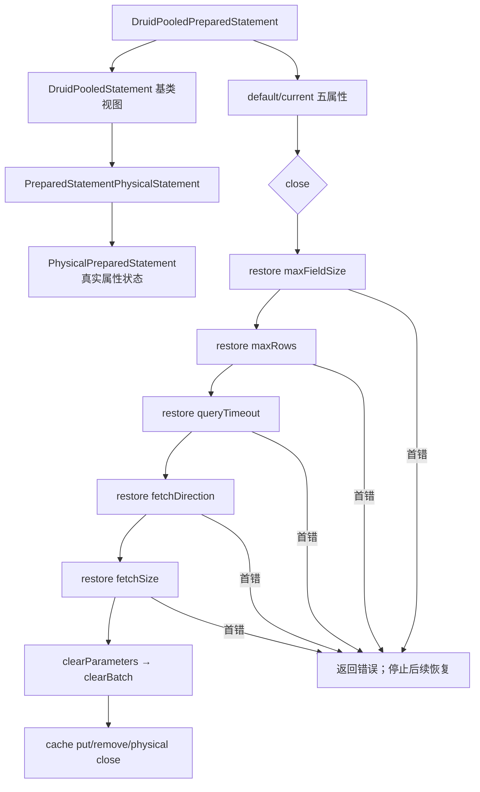

构造 pooled wrapper 时分别读取 `maxFieldSize/maxRows/queryTimeout/
fetchDirection/fetchSize`；每个 getter 的失败独立吞掉并保留 Java int 零值。
五个 setter 与 Java 一致，在调用物理 setter 前更新 current。关闭时只恢复
发生变化的属性，严格保持上述顺序；任一恢复错误立即中止，尚未执行
`clearParameters/clearBatch`，并增加 exceptionCount。调用者修复/重试成功后，
该句柄也因已有异常而进入缓存删除分支，不能污染下一次租约。Drop 无连接上下文
时仍尝试恢复；失败则直接标记异常并禁止回缓存，但不会伪造 ExceptionSorter
已经执行。

证据：

- Java 源码审计：
  `DruidPooledPreparedStatement` 构造器、五个 setter、`close()`，
  `DruidPooledConnection#closePoolableStatement`；
- Rust 故障注入验证初始化 getter 顺序、五属性恢复顺序、首错停止、重试及
  exceptionCount 淘汰；
- 真实 Toasty SQLite 验证结果集创建参数、全部继承属性、poolable 规则、
  closeOnCompletion、缓存恢复和恢复后的真实查询；
- SQLx prepared handle 使用 Adapter 自己的 Statement 状态，不再由池化 wrapper
  伪造属性。

定向 Prepared 测试 21/21、全 workspace 517/517、普通 Clippy、格式和布局门禁
通过；普通 Clippy 仍有既存 pedantic warnings，未宣称 `-D warnings`。
布局为
`scanned=133 errors=0 warnings=0 allowed=0 semantic_parity_proven=false`。

| 指标 | 覆盖 | 已覆盖/总量 |
| :--- | ---: | ---: |
| Regions | 86.49% | 14,864 / 17,186 |
| Functions | 89.25% | 2,126 / 2,382 |
| Lines | 89.83% | 13,145 / 14,633 |

本切片关闭 `SEM-CONN-015`，但不关闭整体 `CORE-CONN-003`：
LOB/stream/resource 原生参数执行边界、SQLx/RBDC 多数据库 generic/batch、
无连接参数 close 的 ExceptionSorter 以及全仓覆盖率 100% 仍开放。

### C2-R35：Prepared 资源 setter、Filter 与批处理物理闭环

Java Druid 的 setter 主链是“检查逻辑状态 → 调用物理 PreparedStatement →
`checkException` → 保存代理参数状态”。因此资源描述符不能只在 execute 时才由
连接层读取，否则负长度、提前 EOF 和流游标推进时点都会改变。本切片增加
`ToastyPreparedStatement`，把 Toasty raw SQL API 缺失的物理参数槽补在 Adapter
内部，而不是塞进池化门面。

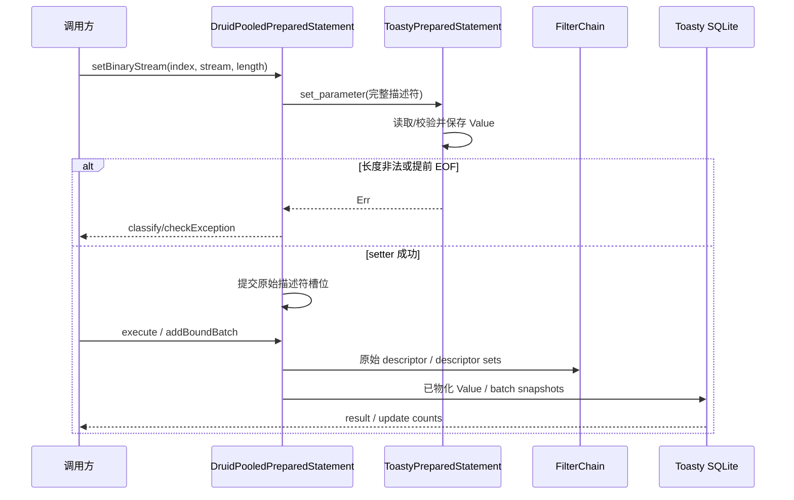

`ExecContext.prepared_parameters` 与
`BatchExecContext.prepared_parameter_sets` 保存完整 setter 身份；原
`params/parameter_sets` 只作为标量兼容视图。`PhysicalConnection` 新增
parameter-aware query/update/generic/batch 入口，lease 完整转发。
`add_bound_batch` 保存有序描述符，同时让物理句柄保存 setter 阶段已物化的值，
所以执行不会二次读取同一流。原 Rust `add_batch(Vec<Value>)` 以明确的
`RustValue` 分支进入同一有序协议，不伪装成 Java setter。

证据包括：

- Java xerial SQLite 3.49.1.0 JShell：binary stream 显式长度在 setter 时读取；
  提前 EOF 与负长度也在 setter 报错；
- 真实 Toasty SQLite：ASCII/Binary/Character/NCharacter、Blob stream、
  Clob/NClob reader、URL、RowId、null Blob 的 update/query/generic execute；
- 显式长度只消费声明区间，execute 不二次读取剩余游标；
- 两组资源参数 `add_bound_batch` 按顺序执行，Filter 一次看到两组完整描述符；
- 全 workspace 518/518；普通 Clippy 退出 0，但既存 pedantic warnings 未清零；
  布局 `scanned=134 errors=0 warnings=0 allowed=0
  semantic_parity_proven=false`。

| 指标 | 覆盖 | 已覆盖/总量 |
| :--- | ---: | ---: |
| Regions | 85.92% | 15,569 / 18,121 |
| Functions | 88.48% | 2,190 / 2,475 |
| Lines | 89.25% | 13,670 / 15,316 |

本批新增 `ToastyPreparedStatement` 的 Functions/Lines 为 100%，Regions 为
97.45%；剩余 region 是编译器分支计数，不把它伪写成 100%。

`SEM-CONN-016` 对 Toasty SQLite 标为 PASS，对全 Adapter 仍为 PARTIAL。
SQLx/RBDC 的资源绑定、PostgreSQL/MySQL/Turso 真实矩阵、xerial 字符流特有行为
以及全仓覆盖率 100% 继续开放。

### C1-R1：Toasty 内置数据源标准化

Toasty 标准数据源已物理归入 `druid/src/toasty`，并由 `druid` 默认启用。
Factory 使用 Toasty 0.9
`Connect/Driver/Connection/Capability`，但不创建 `toasty::Db`；Druid native
pool 是唯一连接池。SQLite 默认启用，PostgreSQL/MySQL/Turso 按 feature 扩展，
DynamoDB 只属于 Toasty ORM，不满足 Druid SQL `PhysicalConnection`。

真实 SQLite 3 个 direct contract 和 1 个 core 纵向 contract 已通过；SQLx、
bb8、deadpool、wrapper 共 17 个扩展回归仍通过。Toasty 0.9 与 SQLx 0.8 的
`libsqlite3-sys` links 冲突通过显式 vendor compatibility patch 统一，补丁删除
条件和风险登记在[Toasty 内置数据源标准实现](./Toasty-内置数据源标准实现.md)。

2026-07-28 C3-R5 全量实测：workspace 428/428；Regions 87.25%
（6,111/7,004）、Functions 89.96%（905/1,006）、Lines 90.22%
（5,334/5,912）。本批新增 `JdbcClob`、`JdbcNClob`、`RdbcReader`、
`RdbcString`、`RdbcWriter` 行/函数/Regions 均为 100%。SQLite 证据
只关闭其能力矩阵中的项目，不关闭存储过程、XA、vendor 方言和 1,644 对象总账。

### C2-R39：ResultSet 默认能力与 typed object 单次读取

对照 Java `DruidPooledResultSet#getObject(int, Class<T>)` 的一次物理委托语义，
使用原子计数探针验证 Rust custom typed object 只读取一次物理列。另以最小
`SparsePhysicalResultSet` 冻结导航、fetch、cursor、metadata、warning 和
update 默认方法的精确 `UnsupportedOperation.operation`，并验证非法列索引和
底层读取错误优先于 custom target unsupported。

Rust 新增 4 个 ResultSet 合同测试，全 workspace 530/530；普通 Clippy
退出 0，严格 `-D warnings` 仍被全仓 418 项既有告警阻断；布局
`scanned=137 errors=0 warnings=0 allowed=0
semantic_parity_proven=false`。

| 指标 | 覆盖 | 已覆盖/总量 |
| :--- | ---: | ---: |
| Regions | 86.77% | 16,456 / 18,966 |
| Functions | 89.74% | 2,309 / 2,573 |
| Lines | 90.39% | 14,441 / 15,977 |

`jdbc_result_set.rs` 未覆盖行由 311 降至 151；真实 driver custom target
conversion、其余 Filter 方法族、streaming、多数据库矩阵和全仓 100% 门禁仍
保持 `PARTIAL`。

### C2-R40：ResultSet 标量 getter 同名物理重载

Java `DruidPooledResultSet` 的 `getObject(String)` 和 9 族标量 index/label
getter 均直接委托 raw `ResultSet` 后执行 `checkException`。Rust 已在
`PhysicalResultSet` 增加 19 条对应入口，并把池化门面的本地 `Value` 转换改为
同名物理委托；真实 driver 可以分别覆盖标签解析与 vendor 转换，eager Adapter
仍使用经过完整分支验证的默认实现。

自定义探针证明 19 条重载没有退化为 `findColumn + value`；失败的 label getter
进入 Statement exception count。`RowSetResultSet` 另验证 NULL、全部 Value
类别、窄化溢出、非法 UTF-8/数值/日期时间、两种 timestamp 格式及
binary/character stream 转换。

全 workspace 534/534；普通 Clippy 退出 0；布局
`scanned=137 errors=0 warnings=0 allowed=0
semantic_parity_proven=false`。

| 指标 | 覆盖 | 已覆盖/总量 |
| :--- | ---: | ---: |
| Regions | 89.41% | 17,072 / 19,095 |
| Functions | 91.61% | 2,369 / 2,586 |
| Lines | 92.53% | 14,817 / 16,014 |

`DruidPooledResultSet` Lines 99.73%，`PhysicalResultSet`/`RowSetResultSet`
所在文件 Lines 98.63%。真实多数据库标量重载、vendor custom conversion、
其余 Filter 方法族和全仓 100% 门禁继续保持 `PARTIAL`。

### C2-R41：Statement/PreparedStatement 物理 ResultSet 身份与列标签

Java `DruidPooledStatement#executeQuery` 和
`DruidPooledPreparedStatement#executeQuery` 都直接包装驱动返回的
`java.sql.ResultSet`。此前 Rust 普通查询及 Prepared canonical query 会先取得
`Vec<Row>`，再构造 `RowSetResultSet`；这会丢失驱动 ResultSet 身份、别名标签、
空结果 metadata 和 vendor getter 覆盖。

本切片新增并贯通以下内部 SPI：

- `PhysicalConnection::fetch_result_set`；
- `fetch_prepared_result_set`；
- `fetch_prepared_parameters_result_set`；
- `PhysicalConnectionLease`、`DruidPooledConnection` Filter 路径及
  `DruidPooledStatement` 共享状态的逐层透明委托。

SQLx Adapter 从真实 SQLite statement/row metadata 保留列标签；prepared
statement 的列描述来自已 prepare 的原生 handle，因此即使返回零行仍能保留
descriptor。RBDC Adapter 从 `Row::meta_data()` 保留标签。Toasty 仍明确使用
`RowSetResultSet` eager Adapter，但资源参数继续在物理 setter 时点物化，没有
退化为 `scalar_value()`。

证据：

- SQLx 真实 SQLite 普通零行及 prepared query 验证别名
  `empty_identifier`、`binary_value/character_value`、大小写不敏感
  `findColumn` 与 label getter；
- RBDC 严格 SPI 验证六列 driver label 原样穿过池化层；
- 默认 SPI 与 `PhysicalConnectionLease` 验证 prepared ResultSet 包装及委托；
- 全 workspace 534/534；普通 Clippy 退出 0；布局
  `scanned=137 errors=0 warnings=0 allowed=0
  semantic_parity_proven=false`。

| 指标 | 覆盖 | 已覆盖/总量 |
| :--- | ---: | ---: |
| Regions | 89.11% | 17,460 / 19,594 |
| Functions | 91.55% | 2,405 / 2,627 |
| Lines | 92.33% | 15,105 / 16,360 |

`DruidPooledResultSet` Lines 99.89%，`DruidPooledStatement` Lines 99.56%，
`jdbc_result_set.rs` Lines 98.65%。SQLx 普通零行 descriptor 已通过原生 prepare
handle 闭合；RBDC 零行仍受上游 stream SPI 限制；Toasty 仍是 eager；
PostgreSQL/MySQL/Turso 及全仓 100% 门禁继续保持 `PARTIAL`。

### C2-R42：ResultSet 18 个标量 getter 进入 FilterChain

逐项冻结 Java `FilterChain` 与 `FilterChainImpl` 的
String/Boolean/Byte/Short/Int/Long/Float/Double/Bytes 九族 index/label
签名后，Rust 在以下四层建立完全一致的 18 条入口：

- `ResultSetFilter` 默认继续到下一节点；
- `ResultSetFilterChain` 使用单调递增 position 动态派发，末端调用
  `PhysicalResultSet` 的精确重载；
- `FilterChain` 每次公开调用都从 position 0 建立子链；
- `DruidPooledResultSet` 完成 open/lease 检查后进入 Filter，成功返回或错误均在
  Java 对应调用点执行连接异常分类。

测试分别证明：

- 两层 Filter 按注册顺序进入、逆序取得并改写返回值；
- 18 个 index/label 重载均保持原参数身份，不退化为 `findColumn + value`；
- Filter 可短路物理调用；Filter 抛出的 `DriverError` 计入 Statement
  exception count；
- 默认 Filter 全量穿透物理探针；
- Toasty 真实 SQLite `SELECT 1 AS value` 经 StatFilter/ResultSet Filter 取得
  实际整数值。

全 workspace 538/538；普通 Clippy 退出 0（既有 pedantic warning 仍开放）；
布局审计为
`scanned=137 errors=0 warnings=0 allowed=0 semantic_parity_proven=false`；
`docs/migration` 保持不存在。

| 指标 | 覆盖 | 已覆盖/总量 |
| :--- | ---: | ---: |
| Regions | 89.23% | 17,678 / 19,812 |
| Functions | 91.68% | 2,447 / 2,669 |
| Lines | 92.42% | 15,291 / 16,546 |

本切片关闭 `CORE-FLT-007` / `SEM-FLT-024`，但只覆盖标量 getter 子族。
object/map/typed、decimal/temporal/calendar、stream/resource、navigation/property、
metadata 与 update 的 Filter 方法族，以及 canonical `FilterChainImpl`、真实多数据库
和全仓覆盖率 100% 均继续开放，因此 `CORE-CONN-005` 与 Filter 总体仍为
`PARTIAL`。

### C2-R43：ResultSet Decimal/Temporal/Calendar FilterChain

Java `FilterChain`/`FilterChainImpl` 对 BigDecimal 提供无 scale 与显式 scale
四个重载，对 Date/Time/Timestamp 各提供 index/label × 无 Calendar/Calendar
四个重载。本切片逐条迁移全部 16 条，而不是将其压缩为一个通用值回调：

- `ResultSetFilter` 暴露 16 个稳定 snake_case 方法；
- `ResultSetFilterChain` 保持 position 游标，末端调用
  `PhysicalResultSet` 的精确重载；
- `FilterChain` 每次从 position 0 建立 around-chain；
- `DruidPooledResultSet` 区分无 Calendar、显式 null Calendar 与具体时区，
  并在 Filter/物理错误处执行原有异常分类。

验证覆盖默认委托、短路、返回改写、scale 参数、`Specified(None)`、
`Asia/Shanghai`/`UTC` Calendar 身份以及 Filter `DriverError`。真实 Toasty
SQLite 对 Decimal/Date/Time/Timestamp 的 index 读取通过；其 eager raw-SQL
结果不保留 alias，因此本切片没有用 Toasty 声称 label E7，label 重载由精确
物理探针与 Filter 参数身份测试证明。

全 workspace 539/539；Clippy 退出 0；布局
`scanned=137 errors=0 warnings=0 allowed=0
semantic_parity_proven=false`；`docs/migration` 不存在。

| 指标 | 覆盖 | 已覆盖/总量 |
| :--- | ---: | ---: |
| Regions | 89.41% | 18,011 / 20,145 |
| Functions | 91.82% | 2,491 / 2,713 |
| Lines | 92.57% | 15,632 / 16,887 |

本切片关闭 `CORE-FLT-008` / `SEM-FLT-025`。ResultSet object/map/typed、
stream/resource、navigation/property、metadata/update Filter 方法族，
canonical `FilterChainImpl`、Toasty alias/streaming、多数据库矩阵与全仓覆盖率
100% 继续开放。

### C2-R44：ResultSet Object 六重载 FilterChain

Java `FilterChain`/`FilterChainImpl` 分别声明并逐层分派以下六条重载：

- `getObject(int)` / `getObject(String)`；
- `getObject(int, Map)` / `getObject(String, Map)`；
- `getObject(int, Class<T>)` / `getObject(String, Class<T>)`。

Rust 已在 `ResultSetFilter`、有位置 `ResultSetFilterChain`、公开
`FilterChain` 和 `DruidPooledResultSet` 四层建立六条精确入口。标签入口末端
调用物理标签重载，不退化成 `findColumn + index`；`None`、空
`JdbcTypeMap`、有内容的 Map 以及 `JdbcTargetType::Custom` 类名均保持身份。
Filter 可以短路或改写结果，Filter/物理 `DriverError` 都在池化调用点进入
Statement 异常分类。

#### 迁移测试三账本

| 账本 | 来源/风险 | 验证 | 证据 | 当前 |
| :--- | :--- | :--- | :--- | :--- |
| `SOURCE_PARITY` | Java `FilterChain.java` 六签名及 `FilterChainImpl` 六条 position/末端 raw 重载；Java 对嵌套 ResultSet/Clob 还会包装代理 | Rust 精确方法清单、默认穿透物理探针；嵌套资源包装仍单独开放 | `V0_STATIC` + `V1_RUST_LOCAL`，不是 live differential | 六重载分派 PASS；嵌套资源 PARTIAL |
| `RUST_OBLIGATION` | trait-object 动态派发、每次 position 归零、`Option<&JdbcTypeMap>`、borrowed target type 与错误分类 | pass-through、short-circuit、null/empty/populated Map、custom target、Filter error count | `V1_RUST_LOCAL` | PASS |
| `VALUE_ADD` | 防止池化门面绕过 Filter、防止标签重载折叠、防止 null Map 与空 Map 混淆 | 真实 Toasty SQLite plain object 与 typed Long 经 StatFilter/ResultSet Filter；全 workspace 回归 | `V5_HOST` | SQLite PASS；多数据库开放 |

静态迁移测试审计报告为 Java core 475 个测试方法、Rust druid 502 个测试函数、
144 个需人工复核信号。该报告是启发式清单，不把测试数量解释为覆盖等价。

验收：

- 定向 `result_set_filter_semantics_test` 7/7；
- 全 workspace 540/540；
- Clippy 退出 0，既有 pedantic warning 债务仍存在；
- 布局 `scanned=137 errors=0 warnings=0 allowed=0
  semantic_parity_proven=false`；
- Regions 89.53%（18,248/20,382）；
- Functions 91.91%（2,521/2,743）；
- Lines 92.66%（15,851/17,106）；
- `result_set_filter.rs` 与 `result_set_filter_chain.rs` 行/函数/Regions 均
  100%；`docs/migration` 保持不存在。

本切片关闭 `CORE-FLT-009` / `SEM-FLT-026`。Java 末端对嵌套
`ResultSet`/`Clob` 的自动代理、stream/resource/navigation/property/metadata/
update Filter 方法族、canonical `FilterChainImpl`、Toasty alias/streaming、
多数据库矩阵与全仓 100% 覆盖率继续保持 `PARTIAL`。

### C2-R45：ResultSet Stream/Resource 26 重载 FilterChain

以 Java `Filter.java`、`FilterChain.java`、`FilterChainImpl.java` 的
`getRef/getBlob/getClob/getArray/getURL/getRowId/getNClob/getSQLXML` 与
`getAsciiStream/getUnicodeStream/getBinaryStream/getCharacterStream/
getNCharacterStream` 为冻结范围，共 13 族 index/label 26 条重载。

Rust 已在 `ResultSetFilter`、有位置 `ResultSetFilterChain`、公开
`FilterChain` 与 `DruidPooledResultSet` 四层建立全部精确入口；末端逐项调用
`PhysicalResultSet` 同重载。此前池化层把流标签入口折叠为
`findColumn + index`、把 NCharacterStream 折叠为 CharacterStream，本切片
补齐五类流的标签 SPI 及 NCharacterStream index/label SPI，因而 Filter 和
驱动都能观察原始重载身份。`RdbcInputStream`/`RdbcReader` 仍按 Java 引用语义
共享游标和关闭状态，Filter 可短路返回 `None`、真实句柄或错误。

#### 迁移测试三账本

| 账本 | 来源/风险 | 验证 | 证据 | 当前 |
| :--- | :--- | :--- | :--- | :--- |
| `SOURCE_PARITY` | Java 三层 26 条签名、position 动态分派、末端 raw ResultSet 同重载；资源返回允许 null | 逐签名清单、默认 Filter 穿透、精确物理探针记录 26 条调用 | `V0_STATIC` + `V1_RUST_LOCAL`；未运行 Java live differential | 26 重载分派 PASS |
| `RUST_OBLIGATION` | trait-object 动态派发、每次 position 归零、资源 Clone 共享生命周期、Filter error 分类 | 全重载短路、index/label 参数身份、InputStream/Reader 共享游标、SQLXML DriverError 计数 | `V1_RUST_LOCAL` | PASS |
| `VALUE_ADD` | 防止门面绕过 Filter、防止标签折叠、防止资源提前物化 | 真实 Toasty SQLite `X'010203'` binary stream 与中文 NCharacterStream 读取；全 workspace 回归 | `V5_HOST` | SQLite index PASS；Toasty alias 仍开放 |

Toasty 当前 raw-SQL 行集未暴露 SQL alias，因此真实主机证据使用 JDBC 1-based
索引；标签入口由精确物理探针验证，不把这一 Adapter 限制冒充 Filter 失败或
label 主机等价。Ref/Blob/Clob/Array/URL/RowId/NClob/SQLXML 的实际数据库支持
仍由各驱动 Adapter 决定，本切片证明的是 Druid Filter/池化层不再截断这些资源。

静态迁移测试审计为 Java core 475 个测试方法、Rust druid 504 个测试函数、
144 个需人工复核信号；它只是测试账本入口，不是数量等价证明。

验收：

- 定向 `result_set_filter_semantics_test` 9/9；
- 全 workspace 542/542；
- Clippy 退出 0，既有 pedantic warning 债务仍存在；
- 布局 `scanned=137 errors=0 warnings=0 allowed=0
  semantic_parity_proven=false`；
- Regions 89.61%（18,604/20,761）；
- Functions 91.89%（2,585/2,813）；
- Lines 92.55%（16,139/17,438）；
- `result_set_filter.rs` 与 `result_set_filter_chain.rs` 的
  Regions/Functions/Lines 均为 100%；`docs/migration` 保持不存在。

本切片关闭 `CORE-FLT-010` / `SEM-FLT-027`。嵌套 ResultSet/Clob object 自动
代理、navigation/property/metadata/update Filter、canonical
`FilterChainImpl`、Toasty alias/streaming、多数据库矩阵与全仓 100% 覆盖率
继续保持 `PARTIAL`。

### C2-R46：ResultSet Navigation/Property 26 调用 FilterChain

Java `FilterChain`/`FilterChainImpl` 中与游标及属性直接相关的冻结范围为：

- `wasNull/findColumn`；
- `previous/first/last/beforeFirst/afterLast/absolute/relative/getRow`；
- `isBeforeFirst/isAfterLast/isFirst/isLast/isClosed`；
- `get/setFetchDirection`、`get/setFetchSize`；
- `getType/getConcurrency/getHoldability/getCursorName`；
- `rowUpdated/rowInserted/rowDeleted`。

共 26 个调用已在 `ResultSetFilter`、`ResultSetFilterChain`、`FilterChain` 和
`DruidPooledResultSet` 四层逐方法接通。Java `isClosed()` 可由 Filter 抛出
SQLException，而 Rust 原 `is_closed() -> bool` 被内部生命周期大量使用；本切片
没有把错误语义删掉，而是新增
`is_closed_with_connection() -> Result<bool, DruidError>` 作为对外 JDBC/Filter
入口，原方法仅保留无失败的内部关闭标记观察。

#### 迁移测试三账本

| 账本 | 来源/风险 | 验证 | 证据 | 当前 |
| :--- | :--- | :--- | :--- | :--- |
| `SOURCE_PARITY` | Java 三层 26 个调用、position 分派、int/label 参数和可失败 isClosed | 逐方法清单；默认 Filter 对精确物理 SPI 的 25 个可记录调用及 isClosed 状态穿透 | `V0_STATIC` + `V1_RUST_LOCAL`；不是 live differential | 26 调用分派 PASS |
| `RUST_OBLIGATION` | trait-object 动态派发、每次 position 归零、内部无失败关闭检查与外部可失败调用分离、错误计数 | 全方法短路/改写、absolute/relative/fetch 参数、findColumn 标签、DriverError、关闭状态 | `V1_RUST_LOCAL` | PASS |
| `VALUE_ADD` | 防止池化门面绕过 Filter；验证 RowSet 游标变迁与读取一致 | 真实 Toasty SQLite before→next→last→previous→after→before 状态机和行值读取 | `V5_HOST` | SQLite PASS；多数据库开放 |

静态测试审计为 Java core 475 个测试方法、Rust druid 506 个测试函数、
144 个需人工复核信号；数量不作为语义等价证据。

验收：

- 定向 `result_set_filter_semantics_test` 11/11；
- 全 workspace 544/544；
- Clippy 退出 0，既有 pedantic warning 债务仍存在；
- 布局 `scanned=137 errors=0 warnings=0 allowed=0
  semantic_parity_proven=false`；
- Regions 89.71%（18,934/21,105）；
- Functions 92.00%（2,635/2,864）；
- Lines 92.60%（16,287/17,588）；
- `result_set_filter.rs` 与 `result_set_filter_chain.rs` 的
  Regions/Functions/Lines 均为 100%；`docs/migration` 保持不存在。

本切片关闭 `CORE-FLT-011` / `SEM-FLT-028`。ResultSet NString 独立重载、
metadata/getStatement、update/row mutation Filter、嵌套 ResultSet/Clob 自动
代理、canonical `FilterChainImpl`、Toasty alias/streaming、多数据库矩阵与
全仓 100% 覆盖率继续保持 `PARTIAL`。

### C2-R47：ResultSet NString 独立双重载 FilterChain

Java 把 `getNString(int)` 与 `getNString(String)` 作为独立 Filter 方法；Rust
虽统一使用 Unicode `String`，但此前 `DruidPooledResultSet::n_string*` 直接
调用普通 `string*`，导致 Filter 和驱动只能观察到 `getString`。本切片新增
`PhysicalResultSet::n_string/n_string_by_label`，并在四层 Filter 路径建立两条
独立入口，不改变值表示但完整保留方法语义。

#### 迁移测试三账本

| 账本 | 来源/风险 | 验证 | 证据 | 当前 |
| :--- | :--- | :--- | :--- | :--- |
| `SOURCE_PARITY` | Java Filter/FilterChain/FilterChainImpl 两签名及 raw NString 末端 | 精确物理探针分别记录 index/label NString | `V0_STATIC` + `V1_RUST_LOCAL`；不是 live differential | 两重载 PASS |
| `RUST_OBLIGATION` | 共用 Rust String 时仍保持方法身份、null/Unicode、标签与错误分类 | 短路改写中文值、label DriverError 与 Statement exception count | `V1_RUST_LOCAL` | PASS |
| `VALUE_ADD` | 防止未来 Adapter 把 national-character 规则误并入普通字符串 | 真实 Toasty SQLite 中文值经独立 NString index 入口读取 | `V5_HOST` | SQLite PASS；驱动特有 NCHAR 矩阵开放 |

静态测试审计为 Java core 475 个测试方法、Rust druid 507 个测试函数、
144 个需人工复核信号。验收：

- 定向 `result_set_filter_semantics_test` 12/12；
- 全 workspace 545/545；
- Clippy 退出 0，既有 pedantic warning 债务仍存在；
- 布局仍为 `scanned=137 errors=0 warnings=0 allowed=0
  semantic_parity_proven=false`；
- Regions 89.73%（18,976/21,149）；
- Functions 92.02%（2,641/2,870）；
- Lines 92.61%（16,313/17,614）；
- 两个 ResultSet Filter 文件 Regions/Functions/Lines 均 100%；
  `docs/migration` 保持不存在。

本切片关闭 `CORE-FLT-012` / `SEM-FLT-029`。metadata/getStatement、
update/row mutation Filter、嵌套 ResultSet/Clob 自动代理、canonical
`FilterChainImpl`、多数据库与全仓 100% 仍保持 `PARTIAL`。

### C2-R48：ResultSet Metadata 平台句柄 FilterChain

Java `resultSet_getMetaData` 可被 Filter 包围、替换返回对象或抛错。Rust
`ResultSetMetaData` 不是列字段快照的单一 DTO：它可持有
`Arc<dyn PhysicalResultSetMetaData>`，因此能够无损返回 driver metadata SPI
及 Wrapper 身份。本切片在四层建立 `result_set_get_meta_data`，默认末端调用
`PhysicalResultSet::meta_data()`，池化调用点继续执行异常分类。

#### 迁移测试三账本

| 账本 | 来源/风险 | 验证 | 证据 | 当前 |
| :--- | :--- | :--- | :--- | :--- |
| `SOURCE_PARITY` | Java Filter/FilterChain/FilterChainImpl 单签名及 raw metadata 末端 | 默认 Filter 精确物理调用与拥有后端的平台对象 | `V0_STATIC` + `V1_RUST_LOCAL`；不是 live differential | PASS |
| `RUST_OBLIGATION` | trait-object metadata 后端、Filter 替代对象、错误分类 | 空 metadata 短路、DriverError、Statement exception count | `V1_RUST_LOCAL` | PASS |
| `VALUE_ADD` | 防止 metadata 被复制成丢失 Wrapper/driver 行为的字段快照 | 真实 Toasty SQLite 两列 metadata 经默认 Filter 返回并读取列数 | `V5_HOST` | SQLite PASS；真实 driver Wrapper 已由既有 metadata 测试覆盖 |

`getStatement` 没有在本切片冒充完成：它必须同时返回普通、
PreparedStatement、CallableStatement 的同一动态逻辑对象，目前 Rust 三类句柄
尚无统一的可替换平台对象枚举，该项继续独立设计。

静态测试审计为 Java core 475 个测试方法、Rust druid 508 个测试函数、
144 个需人工复核信号。验收：

- 定向 `result_set_filter_semantics_test` 13/13；
- 全 workspace 546/546；
- Clippy 退出 0，既有 pedantic warning 债务仍存在；
- 布局 `scanned=137 errors=0 warnings=0 allowed=0
  semantic_parity_proven=false`；
- Regions 89.74%（19,006/21,179）；
- Functions 92.03%（2,646/2,875）；
- Lines 92.62%（16,335/17,636）；
- 两个 ResultSet Filter 文件 Regions/Functions/Lines 均 100%；
  `docs/migration` 保持不存在。

本切片关闭 `CORE-FLT-013` / `SEM-FLT-030`。getStatement 动态对象句柄、
update/row mutation Filter、嵌套 ResultSet/Clob 自动代理、canonical
`FilterChainImpl`、多数据库与全仓 100% 继续保持 `PARTIAL`。

### C2-R49：ResultSet Statement 动态平台句柄 FilterChain

Java `ResultSet#getStatement()` 的静态返回类型虽然是 `Statement`，运行时对象
必须仍然可能是普通 `Statement`、`PreparedStatement` 或
`CallableStatement`，而且必须与创建结果集的对象保持同一逻辑身份。本切片
新增独立 `ResultSetStatement` 平台对象，以三个拥有型共享句柄表达动态类型；
Clone 只增加共享引用，不复制状态、不生成第二个逻辑 Statement，也不改变
Prepared 缓存归还所有权。四层 `result_set_get_statement` 从 position 0
进入 Filter，允许默认继续、短路替换或返回错误；池化入口仍将错误记入创建
结果集的原 Statement。

#### 迁移测试三账本

| 账本 | 来源/风险 | 验证 | 证据 | 当前 |
| :--- | :--- | :--- | :--- | :--- |
| `SOURCE_PARITY` | Java Filter/FilterChain/FilterChainImpl 的 getStatement 签名、raw 末端与动态类型 | 普通 Statement 默认穿透；Prepared/Callable 返回原对象身份并保留继承关系；关闭状态共享 | `V0_STATIC` + `V2_MIRRORED`；不是 live differential | PASS |
| `RUST_OBLIGATION` | Rust 不能返回借用期短于 ResultSet 的 trait 引用；Clone 不能复制逻辑对象或缓存所有权 | 三分支拥有型共享句柄、普通替代对象短路、原 Statement DriverError 计数；新平台文件全指标覆盖 | `V1_RUST_LOCAL` | PASS |
| `VALUE_ADD` | 防止统一枚举退化成字段快照，或只保留最小 Statement 接口而丢失 Prepared/Callable 能力 | `pooled_statement`、`prepared_statement`、`callable_statement` 与共享关闭状态逐分支验证 | `V5_HOST`（普通 Statement 为真实 Toasty SQLite）；Prepared/Callable 为现有严格主机/协议测试 | SQLite PASS；真实存储过程仍由 Callable Adapter 账目追踪 |

静态测试审计为 Java core 475 个测试方法、Rust druid 509 个测试函数、
144 个需人工复核信号。验收：

- 定向 ResultSet/Prepared/Callable 三组测试 40/40；
- 全 workspace 547/547；
- 普通 `cargo clippy --workspace --all-targets --all-features` 退出 0，既有
  pedantic warning 债务仍存在；`-D warnings` 被既有 421 个错误阻断，本切片
  不把全仓历史 lint 债务冒充为已关闭；
- 布局 `scanned=138 errors=0 warnings=0 allowed=0
  semantic_parity_proven=false`；
- Regions 89.81%（19,112/21,280）；
- Functions 92.14%（2,660/2,887）；
- Lines 92.69%（16,429/17,724）；
- `result_set_statement.rs`、`result_set_filter.rs` 与
  `result_set_filter_chain.rs`
  Regions/Functions/Lines 均 100%；`docs/migration` 保持不存在。

本切片关闭 `CORE-FLT-014` / `SEM-FLT-031`。ResultSet update/row mutation
Filter、嵌套 ResultSet/Clob 自动代理、canonical `FilterChainImpl`、真实
Callable driver、多数据库与全仓 100% 继续保持 `PARTIAL`。

### C2-R50：ResultSet Row-Mutation 无参方法族 FilterChain

审计基线为 Java `33824c3dec1612711f9bb4e409319bcab2e4cd0e`、Rust
`5c29f2c0d7b35e70471ddb96eaffe47c8830d959` 加当前未提交迁移工作树。
两仓均无 `.codegraph/`，本切片使用 Java `Filter`、`FilterChain`、
`FilterChainImpl`、`ResultSetProxyImpl` 的精确签名/调用点和执行测试作为
替代证据，不声称具有动态调用图证据。当前 `docs` 目录也不存在任何
`*-技术要求.md`；本轮实际核对的是三模块四表、总路线图及架构文档，该文档
缺口保持显式，不能将不存在的技术要求文件描述为已审阅。

Java 的 `insertRow`、`updateRow`、`deleteRow`、`refreshRow`、
`cancelRowUpdates`、`moveToInsertRow`、`moveToCurrentRow` 每次都新建
FilterChain，从 position 0 分派，末端调用 raw ResultSet 同名方法。Rust
此前已有完整 `PhysicalResultSet` SPI 和池化方法，但七个池化入口通过
`delegate_unit` 直达物理对象，绕过 Filter。本切片在
`ResultSetFilter`、`ResultSetFilterChain`、`FilterChain` 与
`DruidPooledResultSet` 四层建立精确入口。

#### 迁移测试三账本

| 账本 | 来源/风险 | 验证 | 证据 | 当前 |
| :--- | :--- | :--- | :--- | :--- |
| `SOURCE_PARITY` | Java 四层七签名、position 0 重置、raw 同名末端和 Filter 短路 | 默认 Filter 逐方法物理调用日志；池化七方法全部短路且物理对象不执行 | `V0_STATIC` + `V2_MIRRORED`；不是 live differential | PASS |
| `RUST_OBLIGATION` | Rust 宏生成入口可能错配方法；Filter 错误必须在原 Statement 分类 | 七个不同 operation 名称；`refreshRow` DriverError 精确值与 Statement exception count | `V1_RUST_LOCAL` | PASS |
| `VALUE_ADD` | Toasty eager RowSet 只读，Filter 接线不得把七种后端能力错误折叠成统一错误 | 真实 Toasty SQLite ResultSet 经默认 Filter 分别返回七个 `UnsupportedOperation.operation`，结果集保持开放 | `V5_HOST` | SQLite PASS；可更新游标真实驱动仍待多数据库 Adapter |

静态测试审计为 Java core 475 个测试方法、Rust druid 511 个测试函数、
144 个需人工复核信号。验收：

- 定向 `result_set_filter_semantics_test` 16/16；
- 全 workspace 549/549；
- 普通 `cargo clippy --workspace --all-targets --all-features` 退出 0，
  既有 pedantic warning 债务仍存在；严格 `-D warnings` 仍未关闭；
- 布局 `scanned=138 errors=0 warnings=0 allowed=0
  semantic_parity_proven=false`；
- Regions 89.82%（19,199/21,374）；
- Functions 92.16%（2,667/2,894）；
- Lines 92.70%（16,456/17,751）；
- `result_set_filter.rs` 与 `result_set_filter_chain.rs`
  Regions/Functions/Lines 均 100%；`docs/migration` 保持不存在。

本切片关闭 `CORE-FLT-015` / `SEM-FLT-032`。ResultSet 列 update setter
Filter、嵌套 ResultSet/Clob 自动代理、canonical `FilterChainImpl`、真实
可更新游标、多数据库与全仓 100% 继续保持 `PARTIAL`。

### C2-R51：ResultSet 基础列 Update Setter FilterChain

Java `Filter`、`FilterChain`、`FilterChainImpl` 与 `ResultSetProxyImpl`
分别暴露 `updateNull`，以及 Boolean/Byte/Short/Int/Long/Float/Double/
BigDecimal/String/Bytes/Date/Time/Timestamp 的 index/label 重载，共 28 个
独立调用。Rust 原有 `ResultSetUpdate` 已能在物理 SPI 保存类型和值，但
`DruidPooledResultSet` 仍通过通用 helper 直接调用物理对象，Filter 无法观察
具体 setter。本切片在 `ResultSetFilter`、`ResultSetFilterChain`、
`FilterChain` 与 `DruidPooledResultSet` 四层补齐 28 个精确入口；只有调用链
末端才把类型化参数编码为 `ResultSetUpdate`，因此 Filter API 不会退化为
单一通用 update。

#### 迁移测试三账本

| 账本 | 来源/风险 | 验证 | 证据 | 当前 |
| :--- | :--- | :--- | :--- | :--- |
| `SOURCE_PARITY` | Java 四层 28 签名、每次 position 0、index/label 与 nullable/数值宽度/时间类型身份 | 默认 Filter 逐项到达精确物理 descriptor；真实池化 ResultSet 的 28 个入口全部可独立短路 | `V0_STATIC` + `V2_MIRRORED`；不是 live differential | PASS |
| `RUST_OBLIGATION` | 宏生成方法可能错配 variant 或标签；Filter 错误必须在原 Statement 分类 | 精确物理调用日志验证 `ResultSetUpdate` variant/参数；失败标签重载返回原 DriverError，exception count 只增一次且不触达物理 RowSet | `V1_RUST_LOCAL` | PASS |
| `VALUE_ADD` | Toasty SQLite RowSet 只读，新增 Filter 不得吞掉或改写物理能力边界 | 默认 Filter 下 28 个真实 SQLite 调用分别保持 index/label 的 `UnsupportedOperation.operation`，结果集仍可关闭 | `V5_HOST` | SQLite PASS；可更新游标与多数据库 Adapter 待补 |

静态测试审计为 Java core 475 个测试方法、Rust druid 513 个测试函数、
144 个需人工复核信号。验收：

- 定向 `result_set_filter_semantics_test` 18/18，其中新增测试 2/2；
- 全 workspace 551/551；
- 普通 `cargo clippy --workspace --all-targets` 退出 0，既有 pedantic
  warning 债务仍存在；严格 `-D warnings` 仍未关闭；
- 布局 `scanned=138 errors=0 warnings=0 allowed=0
  semantic_parity_proven=false`；
- Regions 89.90%（19,377/21,554）；
- Functions 92.20%（2,685/2,912）；
- Lines 92.78%（16,623/17,917）；
- `result_set_filter.rs` 与 `result_set_filter_chain.rs`
  Regions/Functions/Lines 均 100%；`docs/migration` 保持不存在；
- `docs` 下仍不存在任何 `*-技术要求.md`，因此没有虚构读取或验收该类文档。

本切片关闭 `CORE-FLT-016` / `SEM-FLT-033`。ResultSet 的精确 Filter 调用
累计 131 个。其余 object/stream/LOB update setter Filter、嵌套
ResultSet/Clob 自动代理、canonical `FilterChainImpl`、真实可更新游标、
多数据库与全仓 100% 继续保持 `PARTIAL`。

### C2-R52：ResultSet updateObject 四重载 FilterChain

Java `Filter`、`FilterChain`、`FilterChainImpl` 与 `ResultSetProxyImpl`
分别保留 `updateObject(int/String, Object)` 和
`updateObject(int/String, Object, int scaleOrLength)` 四个重载。Rust 此前
虽然用 `ResultSetUpdate::Object` 与 `ObjectWithScaleOrLength` 保存了物理
descriptor，但 `DruidPooledResultSet` 仍经通用 helper 直达物理 ResultSet，
Filter 无法区分四个 Java 调用。本切片在 `ResultSetFilter`、
`ResultSetFilterChain`、`FilterChain` 与 `DruidPooledResultSet` 四层补齐
四条精确入口；仅末端编码 descriptor，Filter 仍能观察 index/label、
plain/scaleOrLength、SQL NULL 和具体 object 身份。

`JdbcObject::Custom(JdbcOpaqueObject)` 不被转换成字符串或仅保留类名：测试将
vendor 对象穿过池化 Filter 后下转回 `FilterVendorObjectProbe`，同时验证
class name 和字段值。因此这里迁移的是 JDBC `Object` 的开放身份语义，而不是
只覆盖 Toasty 当前认识的标量集合。

#### 迁移测试三账本

| 账本 | 来源/风险 | 验证 | 证据 | 当前 |
| :--- | :--- | :--- | :--- | :--- |
| `SOURCE_PARITY` | Java 四层四重载、每次 position 0、raw 精确末端；plain 与 scaleOrLength 不得合并 | 默认 Filter 的四种调用分别产生 `Object` / `ObjectWithScaleOrLength` descriptor，index/label 与 scale 值保持不变；池化四重载可独立短路 | `V0_STATIC` + `V2_MIRRORED`；不是 live differential | PASS |
| `RUST_OBLIGATION` | trait object 可能丢失 vendor 具体类型；SQL NULL、负 scale 和 Filter 错误分类可能被 helper 改写 | `JdbcOpaqueObject` 穿链后成功下转原类型；SQL NULL 与 `-3` 原样保留；失败标签返回原 `DriverError`，原 Statement exception count 只增加一次 | `V1_RUST_LOCAL` | PASS |
| `VALUE_ADD` | Toasty SQLite RowSet 只读，精确 Filter 不得吞掉或统一化后端能力边界 | 默认 Filter 下真实 Toasty SQLite 的 plain/scaleOrLength × index/label 四调用分别保持 `result_set_update_value` / `_by_label` capability error，游标仍可关闭 | `V5_HOST` | SQLite PASS；可更新游标和多数据库 Adapter 待补 |

审计基线仍为 Java `33824c3dec1612711f9bb4e409319bcab2e4cd0e`、Rust
`5c29f2c0d7b35e70471ddb96eaffe47c8830d959` 加当前未提交迁移工作树。两仓
均无 `.codegraph/`，故使用 Java 四层精确源码签名、调用点和执行测试作为
替代证据，不声称具有动态调用图证据。静态测试审计为 Java core 475 个测试
方法、Rust druid 515 个测试函数、144 个需人工复核信号。验收：

- 新增 object update 定向测试 2/2，全 workspace 553/553；
- 普通 `cargo clippy --workspace --all-targets` 退出 0，但仓库既有 pedantic
  warning 未清零；严格 `-D warnings` 仍未关闭；
- 布局 `scanned=138 errors=0 warnings=0 allowed=0
  semantic_parity_proven=false`；
- Regions 89.96%（19,557/21,740）；
- Functions 92.24%（2,697/2,924）；
- Lines 92.85%（16,812/18,107）；
- `result_set_filter.rs` 与 `result_set_filter_chain.rs`
  Regions/Functions/Lines 均为 100%；`druid_pooled_result_set.rs` Lines
  99.89%；
- `docs/migration` 保持不存在；`docs` 下仍无任何 `*-技术要求.md`，没有虚构
  读取或验收不存在的文档。

本切片关闭 `CORE-FLT-017` / `SEM-FLT-034`，ResultSet 精确 Filter 调用累计
135 个。其余 stream/LOB/resource update setter Filter、嵌套
ResultSet/Clob 自动代理、canonical `FilterChainImpl`、真实可更新游标、
多数据库和全仓覆盖率 100% 继续保持 `PARTIAL`。

### C2-R53：ResultSet 资源对象 Update Setter FilterChain

Java `Filter`、`FilterChain`、`FilterChainImpl` 与 `ResultSetProxyImpl`
分别为 `updateRef/updateBlob/updateClob/updateArray/updateRowId/
updateNClob/updateSQLXML` 保留 index/label 重载，共 14 个独立调用。Rust
此前已有七类独立 JDBC 平台对象、完整 `PhysicalResultSet` SPI 和池化公开
方法，但 14 个池化入口全部经 `delegate_unit` 直达物理对象，Filter 无法
观察、短路或分类这些方法。

本切片在 `ResultSetFilter`、有位置 `ResultSetFilterChain`、公开
`FilterChain` 与 `DruidPooledResultSet` 四层建立 14 条精确入口。Filter
边界使用拥有型 `Option<JdbcX>`，避免借用跨动态调用链失效；这些类型的 Clone
共享同一物理资源而不预读 Blob/Clob/Array 等内容，只有链末端才通过
`Option<&JdbcX>` 调用原物理 SPI。`None` 对应 Java null，`JdbcRowId` 继续以
字节值表达 Java RowId equality，而不是被折叠成通用 object descriptor。

#### 迁移测试三账本

| 账本 | 来源/风险 | 验证 | 证据 | 当前 |
| :--- | :--- | :--- | :--- | :--- |
| `SOURCE_PARITY` | Java 四层 14 签名、position 0、raw 同名末端和 nullable 资源参数 | 默认 Filter 分别触达 14 个精确物理方法；池化 14 个入口均可独立短路，index/label 与 null 身份不合并 | `V0_STATIC` + `V2_MIRRORED`；不是 live differential | PASS |
| `RUST_OBLIGATION` | 动态链不能持有短生命周期借用；Clone 不能复制资源内容；错误必须回到原 Statement | Filter 边界采用拥有型资源句柄，RowId 字节穿链不变；失败 SQLXML 标签返回原 `DriverError`，exception count 只增加一次且不触达物理 RowSet | `V1_RUST_LOCAL` | PASS |
| `VALUE_ADD` | Toasty SQLite RowSet 只读，新增 Filter 不得把七类型 × 两定位方式统一成通用错误 | 默认 Filter 下真实 Toasty SQLite 保留 14 个不同 `UnsupportedOperation.operation`；完成后结果集仍可关闭 | `V5_HOST` | SQLite PASS；可更新游标与多数据库 Adapter 待补 |

审计基线仍为 Java `33824c3dec1612711f9bb4e409319bcab2e4cd0e`、Rust
`5c29f2c0d7b35e70471ddb96eaffe47c8830d959` 加当前未提交迁移工作树。两仓
均无 `.codegraph/`，本切片使用 Java 四层精确签名、实现末端和调用点作为
`V0_STATIC`，不声称具有动态调用图或 live differential 证据。静态测试审计
为 Java core 475 个测试方法、Rust druid 517 个测试函数、144 个需人工复核
信号。验收：

- 新增 resource update 定向测试 2/2，全 workspace 555/555；
- 普通 `cargo clippy --workspace --all-targets` 退出 0，但仓库既有 pedantic
  warning 未清零；严格 `-D warnings` 仍未关闭；
- 布局 `scanned=138 errors=0 warnings=0 allowed=0
  semantic_parity_proven=false`；
- Regions 89.92%（19,489/21,674）；
- Functions 92.18%（2,677/2,904）；
- Lines 92.82%（16,750/18,045）；
- `result_set_filter.rs` 与 `result_set_filter_chain.rs`
  Regions/Functions/Lines 均为 100%；`druid_pooled_result_set.rs` Lines
  99.88%；
- 本切片以宏生成同形的 14 条公开方法，减少重复生产代码，因此 llvm-cov
  的总 region/function/line 分母与 C2-R52 不同；这里报告实际新运行结果，
  不把分母变化描述为覆盖率提升；
- `docs/migration` 保持不存在；`docs` 下仍无任何 `*-技术要求.md`，没有虚构
  读取或验收不存在的文档。

本切片关闭 `CORE-FLT-018` / `SEM-FLT-035`，ResultSet 精确 Filter 调用累计
149 个。其余 InputStream/Reader LOB setter 与标量/字符/二进制流 setter 的
Filter、嵌套 ResultSet/Clob 自动代理、canonical `FilterChainImpl`、真实
可更新游标、多数据库和全仓覆盖率 100% 继续保持 `PARTIAL`。

### C2-R54：ResultSet LOB InputStream/Reader Update Setter FilterChain

Java `Filter`、`FilterChain`、`FilterChainImpl` 与 `ResultSetProxyImpl`
分别保留以下 12 个调用：

- `updateBlob(int/String, InputStream)` 与
  `updateBlob(int/String, InputStream, long)`；
- `updateClob(int/String, Reader)` 与
  `updateClob(int/String, Reader, long)`；
- `updateNClob(int/String, Reader)` 与
  `updateNClob(int/String, Reader, long)`。

Rust 此前已经在 `DruidPooledResultSet` 与 `PhysicalResultSet` 保留这 12 个
公开重载及 `JdbcStreamLength/JdbcCharacterLength` descriptor，但池化方法经
私有 helper 直达物理 ResultSet，Filter 无法观察或短路。本切片在
`ResultSetFilter`、有位置 `ResultSetFilterChain`、公开 `FilterChain` 和
`DruidPooledResultSet` 四层补齐 12 条精确入口。无长度与 long 版本在 Filter
边界仍为不同方法，只在默认末端分别编码为 `Unspecified` 和 `Long(length)`。

Filter 参数使用拥有型 `Option<RdbcInputStream/RdbcReader>` 解决动态链借用
生命周期；Clone 共享同一游标和关闭状态，不复制或提前读取内容。Java null、
负长度及 `i64::MAX` 均原样穿透，不增加 Java 未有的池化层校验。

#### 迁移测试三账本

| 账本 | 来源/风险 | 验证 | 证据 | 当前 |
| :--- | :--- | :--- | :--- | :--- |
| `SOURCE_PARITY` | Java 四层 12 签名、每次 position 0、raw 同名末端；无长度与 long 不得合并 | 默认 Filter 的 12 个入口分别产生 index/label 与 `Unspecified/Long` 精确物理日志；池化 12 入口均可独立短路 | `V0_STATIC` + `V2_MIRRORED`；不是 live differential | PASS |
| `RUST_OBLIGATION` | 动态 trait 链不能悬垂借用；Clone 不得复制流；负数/极大 long 和错误分类不得被 helper 改写 | 短路 Filter 读取一个 byte/code unit 后，调用方句柄从下一位置继续；`-17`/`i64::MAX`、nullable 保持不变；失败标签只使原 Statement exception count 增加一次 | `V1_RUST_LOCAL` | PASS |
| `VALUE_ADD` | Toasty SQLite RowSet 只读，新增 Filter 不能吞掉或统一化 12 个 Java 入口的物理能力错误 | 默认 Filter 下真实 Toasty SQLite 逐项返回 Blob/Clob/NClob × index/label 的精确 SPI `UnsupportedOperation`，共 12 次；结果集仍可关闭 | `V5_HOST` | SQLite PASS；可更新游标与多数据库 Adapter 待补 |

审计基线仍为 Java `33824c3dec1612711f9bb4e409319bcab2e4cd0e`、Rust
`5c29f2c0d7b35e70471ddb96eaffe47c8830d959` 加当前未提交迁移工作树。两仓
均无 `.codegraph/`，因此本切片仅以 Java 四层精确源码签名、调用点和末端作为
`V0_STATIC`，不声称具有 CodeGraph 动态调用或 Java live differential 证据。
静态测试审计为 Java core 475 个测试方法、Rust druid 519 个测试函数、
144 个需人工复核信号。验收：

- 新增 LOB stream update 定向测试 2/2，全 workspace 557/557；
- 普通 `cargo clippy --workspace --all-targets` 退出 0，但仓库既有 pedantic
  warning 未清零；严格 `-D warnings` 仍未关闭；
- 布局 `scanned=138 errors=0 warnings=0 allowed=0
  semantic_parity_proven=false`；
- Regions 89.97%（19,709/21,906）；
- Functions 92.20%（2,683/2,910）；
- Lines 92.88%（16,983/18,284）；
- `result_set_filter.rs` 与 `result_set_filter_chain.rs`
  Regions/Functions/Lines 均为 100%；`filter_chain.rs` Lines 100%，
  `druid_pooled_result_set.rs` Lines 99.65%；
- `docs/migration` 保持不存在；`docs` 下仍无任何 `*-技术要求.md`，没有虚构
  读取或验收不存在的文档。

本切片关闭 `CORE-FLT-019` / `SEM-FLT-036`，ResultSet 精确 Filter 调用累计
161 个。其余标量/字符/二进制流 setter Filter、嵌套 ResultSet/Clob 自动代理、
canonical `FilterChainImpl`、真实可更新游标、SQL 级 read length、streaming、
多数据库和全仓覆盖率 100% 继续保持 `PARTIAL`。

### C2-R55：ResultSet ASCII/Binary/Character/NCharacter Stream Update Setter FilterChain

Java `Filter`、`FilterChain`、`FilterChainImpl` 与 `ResultSetProxyImpl` 实际
保留 22 个而不是按笼统族数推算的 28/56 个调用：

- `updateAsciiStream`、`updateBinaryStream`、`updateCharacterStream` 分别为
  index/label × 无长度/int/long，共 18 个；
- `updateNCharacterStream` 只有 index/label × 无长度/long，共四个，不存在
  Java int 长度重载。

Rust 此前已有全部 22 个公开池化方法和
`ResultSetUpdate::{AsciiStream,BinaryStream,CharacterStream,NCharacterStream}`
物理描述符，但公开方法经通用 `update_value/update_value_by_label` 直达物理
ResultSet，Filter 无法辨别具体 Java 重载。本切片在 `ResultSetFilter`、有位置
`ResultSetFilterChain`、公开 `FilterChain` 与 `DruidPooledResultSet` 四层
补齐 22 条精确入口。物理 SPI 仍保持最小通用 update 方法，只在默认链末端将
具体重载编码为 `Unspecified/Int/Long`，没有为迁移数量制造 22 个冗余物理方法。

Filter 边界使用拥有型 `Option<RdbcInputStream/RdbcReader>`；Clone 与调用方
共享同一游标和关闭状态。Java null、负长度、`i32::MIN/MAX`、`i64::MAX`
均原样传递，不做预读、截断或校正。

#### 迁移测试三账本

| 账本 | 来源/风险 | 验证 | 证据 | 当前 |
| :--- | :--- | :--- | :--- | :--- |
| `SOURCE_PARITY` | Java 四层 22 签名、每次 position 0、无长度/int/long 重载不能合并；NCharacter 不得虚构 int 版本 | 默认 Filter 的 22 个入口分别生成 index/label、variant 与 `Unspecified/Int/Long` 精确物理描述符；池化 22 入口均可独立短路 | `V0_STATIC` + `V2_MIRRORED`；不是 live differential | PASS |
| `RUST_OBLIGATION` | 动态 trait 链需拥有跨层资源；Clone 不得复制流；int/long 边界和错误分类不能被通用 helper 改写 | 四族 plain index 短路各读取一个 byte/code unit，调用方从下一位置继续；nullable、负数、`i32::MIN/MAX`、`i64::MAX` 保持；失败标签只使原 Statement exception count 增加一次 | `V1_RUST_LOCAL` | PASS |
| `VALUE_ADD` | Toasty SQLite RowSet 只读，新增精确 Filter 不能吞掉现有 generic update capability error | 默认 Filter 下真实 Toasty SQLite 的 22 个入口按 index/label 返回 `result_set_update_value` / `result_set_update_value_by_label`，共 22 次；结果集仍可关闭 | `V5_HOST` | SQLite PASS；可更新游标与多数据库 Adapter 待补 |

审计基线仍为 Java `33824c3dec1612711f9bb4e409319bcab2e4cd0e`、Rust
`5c29f2c0d7b35e70471ddb96eaffe47c8830d959` 加当前未提交迁移工作树。两仓
均无 `.codegraph/`，因此本切片以 Java 四层精确源码签名、调用点与 raw 末端
作为 `V0_STATIC`，不声称具有 CodeGraph 动态调用或 Java live differential
证据。验收：

- 新增 stream update 定向测试 2/2，全 workspace 559/559；
- 静态测试审计为 Java core 475 个测试方法、Rust druid 521 个测试函数、
  144 个需人工复核信号；
- `cargo clippy --workspace --all-targets --all-features -- -W
  clippy::pedantic` 退出 0，但既有 pedantic warning 未清零，严格
  `-D warnings` 未关闭；
- 布局 `scanned=138 errors=0 warnings=0 allowed=0
  semantic_parity_proven=false`；
- Regions 90.11%（20,171/22,384）；
- Functions 92.26%（2,705/2,932）；
- Lines 93.05%（17,419/18,720）；
- `result_set_filter.rs` 与 `result_set_filter_chain.rs`
  Regions/Functions/Lines 均为 100%；`filter_chain.rs` Lines 100%，
  `druid_pooled_result_set.rs` Lines 99.67%；
- `docs/migration` 保持不存在；`docs` 下仍无任何 `*-技术要求.md`，没有虚构
  读取或验收不存在的文档。

本切片关闭 `CORE-FLT-020` / `SEM-FLT-037`，ResultSet 精确 Filter 调用累计
183 个。ResultSet update setter Filter 当前明确剩余 `updateNString`
index/label 两条；嵌套 ResultSet/Clob 自动代理、canonical `FilterChainImpl`、
真实可更新游标、SQL 级 read length、streaming、多数据库和全仓覆盖率 100%
继续保持 `PARTIAL`。

### C2-R56：ResultSet updateNString 独立双重载 FilterChain

Java 的 `Filter`、`FilterChain`、`FilterChainImpl` 与 `ResultSetProxyImpl`
分别保留 `updateNString(int, String)` 和 `updateNString(String, String)`，
默认链末端调用 raw ResultSet 的同名重载。虽然 Rust 的普通 String 与 NString
都用 `Option<String>` 表示，NString 的 national-character 操作身份仍不能折叠
到 `updateString`。本切片在 `ResultSetFilter`、`ResultSetFilterChain`、
`FilterChain` 与 `DruidPooledResultSet` 四层增加两个精确入口；物理最小 SPI
继续使用 `update_value/update_value_by_label`，但默认末端固定编码
`ResultSetUpdate::NString`。

| 台账 | 来源/风险 | Rust 证据 | 级别 | 结果 |
| :--- | :--- | :--- | :--- | :--- |
| `SOURCE_PARITY` | Java 四层两签名、每次从 position 0 进入链、index/label 与 NString operation 身份不得合并 | 默认 Filter 分别记录 `NString` index/label descriptor；池化两入口均可独立短路 | `V0_STATIC` + `V2_MIRRORED`；不是 live differential | PASS |
| `RUST_OBLIGATION` | 同一 Rust 值类型容易误用普通 String helper；nullable、Unicode、错误计数及链位置必须保持 | `None` 与中文值保持；index/label 短路日志精确；失败标签只使原 Statement exception count 增加一次 | `V1_RUST_LOCAL` | PASS |
| `VALUE_ADD` | Toasty SQLite RowSet 只读，新增 Filter 不能吞掉现有 generic update capability error | 默认 Filter 下真实 Toasty SQLite 的 index/label 两入口分别返回 `result_set_update_value` 与 `result_set_update_value_by_label`，结果集仍可关闭 | `V5_HOST` | SQLite PASS；可更新游标与多数据库 Adapter 待补 |

审计基线仍为 Java `33824c3dec1612711f9bb4e409319bcab2e4cd0e`、Rust
`5c29f2c0d7b35e70471ddb96eaffe47c8830d959` 加当前未提交迁移工作树。两仓
均无 `.codegraph/`，因此本切片只把 Java 精确签名、调用点和 raw 末端记为
`V0_STATIC`。本轮执行证据：

- 新增 NString update 定向测试 2/2，全 workspace 561/561；
- 静态测试审计为 Java core 475 个测试方法、Rust druid 523 个测试函数、
  144 个需人工复核信号；
- `cargo clippy --workspace --all-targets --all-features -- -W
  clippy::pedantic` 退出 0，但既有 pedantic warning 未清零，严格
  `-D warnings` 未关闭；
- 布局 `scanned=138 errors=0 warnings=0 allowed=0
  semantic_parity_proven=false`；
- Regions 90.10%（20,123/22,335）；
- Functions 92.24%（2,698/2,925）；
- Lines 93.03%（17,369/18,670）；
- `docs/migration` 保持不存在；`docs` 下仍无任何 `*-技术要求.md`，没有虚构
  读取或验收不存在的文档。

本切片关闭 `CORE-FLT-021` / `SEM-FLT-038`，ResultSet 精确 Filter 调用累计
185 个，ResultSet update setter Filter 子域完成逐项迁移。它不等于完整
ResultSet、完整 Filter 或完整 druid-core 已完成：嵌套 ResultSet/Clob 自动代理、
canonical `FilterChainImpl`、真实可更新游标、SQL 级 read length、streaming、
多数据库、全仓覆盖率 100% 以及 Java live differential 仍保持 `PARTIAL`。

### C2-R57：canonical FilterAdapter 默认适配对象

Java `FilterAdapter` 是 2,891 行、491 个公开方法的抽象默认适配器：
`init/destroy/configFromProperties` 默认无副作用，`isWrapperFor/unwrap`
只识别运行时自身 class，其余 JDBC hook 均继续调用同名 `FilterChain`。Rust
不能靠继承复制该机制，也不能只把名字登记在 trait 上充数。本切片建立独立
`filter_adapter.rs`，以组合方式实现 SQL before/after 默认放行、Extended
配置和类型令牌、精确自身 Wrapper，以及当前 185 个 ResultSet hook 的逐方法
默认继续链；通过 `FilterChain::add_filter` 同时注册三个已迁移调用视图。

| 台账 | 来源/风险 | Rust 证据 | 级别 | 结果 |
| :--- | :--- | :--- | :--- | :--- |
| `SOURCE_PARITY` | Java 生命周期/配置空语义、自身 class Wrapper、其余方法继续同名 chain；Java 仓无对应可执行测试 | `FilterAdapter` init/destroy/config、None/foreign/self Wrapper 与完整类型令牌精确断言 | `V0_STATIC` + `V1_RUST_LOCAL`；不是 mirrored/differential | 已迁移对象边界 PASS |
| `RUST_OBLIGATION` | Java 单对象被 Rust 拆成多个 trait，调用方可能漏注册 after 或 ResultSet；Rust `Any/TypeId` 必须保持自身类型身份 | `add_filter` 后 before/after/result_set 均为 1；两个 trait 视图名称一致；unwrap 返回同一引用 | `V1_RUST_LOCAL` | PASS |
| `VALUE_ADD` | 默认 Adapter 若返回常量、提前结束或吞错，会破坏真实驱动行为 | 真实 Toasty SQLite 查询、Unicode NString getter 穿透；只读 `updateNString` 的原 capability error 保持并只计数一次 | `V5_HOST` | SQLite PASS；其他 Adapter 与未迁移 hook 开放 |

审计基线仍为 Java `33824c3dec1612711f9bb4e409319bcab2e4cd0e`、Rust
`5c29f2c0d7b35e70471ddb96eaffe47c8830d959` 加当前未提交迁移工作树。两仓
均无 `.codegraph/`，Java 491 方法与委托关系仅记为 `V0_STATIC`。验收：

- FilterAdapter 定向测试 2/2，全 workspace 563/563；
- 静态测试审计为 Java core 475 个测试方法、Rust druid 525 个测试函数、
  144 个需人工复核信号；
- `cargo check --workspace --all-targets --all-features`、格式检查通过；
- `cargo clippy --workspace --all-targets --all-features -- -W
  clippy::pedantic` 退出 0，但既有 pedantic warning 未清零，严格
  `-D warnings` 未关闭；
- 布局 `scanned=139 errors=0 warnings=0 allowed=0
  semantic_parity_proven=false`；
- Regions 90.10%（20,142/22,354）；
- Functions 92.26%（2,705/2,932）；
- Lines 93.04%（17,388/18,689）；
- 新增 `filter_adapter.rs` Regions/Functions/Lines 均为 100%；
- `docs/migration` 保持不存在；`docs` 下仍无任何 `*-技术要求.md`，没有虚构
  读取或验收不存在的文档。

本切片新增 `CORE-FLT-022` / `SEM-FLT-039`，使 `FilterAdapter` 从
`MISSING` 提升为 `PARTIAL`，没有把 Java 491 方法整体冒充完成。未迁移的
CallableStatement、Connection、Statement、Clob、DataSource 与 metadata
精确 hook、canonical `FilterChainImpl`、完整 384 hook、Java live
differential、多数据库和生产 rollout/rollback 仍保持开放。

### C2-R58：canonical FilterEventAdapter 事件模板对象

Java `FilterEventAdapter.java` 共 541 行，声明 32 个公开构造/连接/Statement/
PreparedStatement 事件入口和 13 个 protected 模板 hook。它不是普通事件监听器：
Statement create/prepare/call 只在成功后触发 after；execute/query/update/batch
执行 before→downstream→成功 after，异常时执行 error-after 后重新抛出；
error-after 自身抛错时替换原异常；query 成功还要求 query-after 先于
resultSetOpen-after。本切片建立独立 `filter_event_adapter.rs`，以公开组合式
`FilterEventListener` 替代 Java protected override，并在 `FilterChain` 增加
inner→outer 的 `after_statement_event`，将 create/prepare/call 成功事件接入
`DruidPooledConnection`。

| 台账 | 来源/风险 | Rust 证据 | 级别 | 结果 |
| :--- | :--- | :--- | :--- | :--- |
| `SOURCE_PARITY` | Java 32 个公开入口、13 个模板 hook、成功/异常分叉、error-after 替换原错及 query-after→open 顺序 | 默认模板全矩阵、双 adapter 创建事件反向展开、成功回调失败和 error-after 替换原错 | `V0_STATIC` + `V1_RUST_LOCAL`；不是 mirrored/live differential | 当前可表达对象边界 PASS；完整 Java 对象 PARTIAL |
| `RUST_OBLIGATION` | Java 继承改组合后必须保持同一 listener 实例、精确类型令牌、JDBC int 更新计数范围和回调错误分类 | `FilterEventAdapter<L>` 同时实现 before/after/result-set/extended/wrapper；默认 listener 逐入口无副作用；`u64` 溢出明确返回范围错误 | `V1_RUST_LOCAL` | PASS |
| `VALUE_ADD` | 真实驱动中 generic execute/query/update/batch、prepared SQL、ResultSet open 与错误路径不能被事件层改写 | Toasty SQLite 建表、插入、查询、ResultSet、generic query/update、batch、prepared update 与非法 SQL；精确断言 query 成功和失败事件序列 | `V5_HOST` | SQLite PASS；多数据库 Adapter 待补 |

审计基线仍为 Java `33824c3dec1612711f9bb4e409319bcab2e4cd0e`、Rust
`5c29f2c0d7b35e70471ddb96eaffe47c8830d959` 加当前未提交迁移工作树。两仓
均无 `.codegraph/`，因此 Java 方法、调用点与异常分支只记为 `V0_STATIC`。
本轮执行证据：

- `filter_event_adapter_semantics_test` 定向测试 5/5，全 workspace 568/568；
- 静态测试审计为 Java core 475 个测试方法、Rust druid 530 个测试函数、
  145 个需人工复核信号；数量不是语义等价证明；
- `cargo check --workspace --all-targets --all-features`、格式检查和
  `git diff --check` 通过；
- `cargo clippy --workspace --all-targets --all-features -- -W
  clippy::pedantic` 退出 0，但仓库既有 pedantic warning 未清零，严格
  `-D warnings` 未关闭；
- 布局 `scanned=140 errors=0 warnings=0 allowed=0
  semantic_parity_proven=false`；
- Regions 90.12%（20,263/22,485）；
- Functions 92.34%（2,738/2,965）；
- Lines 93.06%（17,490/18,794）；
- 新增 `filter_event_adapter.rs` Regions/Functions/Lines 均为 100%；
- `docs/migration` 保持不存在；`docs` 下仍无任何 `*-技术要求.md`，没有虚构
  读取或验收不存在的文档。

本切片新增 `CORE-FLT-023` / `SEM-FLT-040`，使 `FilterEventAdapter` 从
`MISSING` 提升为 `PARTIAL`。当前 `ExecContext` 不携带 Java
`StatementProxy` 实例身份；`ConnectionEvent::Connect` 尚未接入数据源创建
生产路径；扁平 before/after 列表也不能复现 later/downstream before 失败时，
只对已进入 adapter 执行 error-after 的 Java 嵌套展开；Java
`JdbcFilterEventAdapterTest` 约 45 个错误分支尚未逐项镜像。这些缺口以及
canonical `FilterChainImpl`、完整 Filter hook、多数据库和 Java live
differential 继续保持 `PARTIAL`。

### C2-R59：canonical FilterManager alias 与显式工厂管理

Java `FilterManager.java` 共 170 行，通过三个 `ClassLoader` 顺序合并
`META-INF/druid-filter.properties`，从 `druid.filters.` 键建立 alias，再用
`Class#newInstance()` 构造 Filter。其边界并非普通字符串映射：alias 大小写
敏感；未知名称只有 Java UTF-16 长度 `<128` 时才按类名回退；逗号展开不 trim；
已有 Filter 用实际类名 `equalsIgnoreCase` 去重；找不到类只记录并继续，而构造
失败包装为 `SQLException`。本切片建立独立 `filter_manager.rs` 和原始 bundled
resource，以显式 property sources 替代 ClassLoader，以 `register_filter`
工厂替代反射，并让 `FilterChain` 保存 Java 类名以承载准确去重。

| 台账 | 来源/风险 | Rust 证据 | 级别 | 结果 |
| :--- | :--- | :--- | :--- | :--- |
| `SOURCE_PARITY` | `FilterManagerTest` 的 stat alias/构造失败、default/stat 与重复 alias；Java loadFilter 分支 | 除 Java 日志框架 alias 外的 bundled alias、缺失继续、构造失败完整消息、alias/直接标识符及大小写去重 | `V0_STATIC` + `V2_MIRRORED`；不是 live differential | PARTIAL：Java 日志实现 alias 不进入 Rust；Druid 配置统一使用 Filter 短名 `log`，运行时由 `tracing` 承载 |
| `RUST_OBLIGATION` | ClassLoader/反射改为显式 source/factory 后，资源覆盖、properties 转义、UTF-16 长度、同实例三 trait 视图和锁边界不得丢失 | 后者覆盖、续行、全部字符 escape、surrogate pair、非法 Unicode、128 UTF-16 边界、动态三视图计数与工厂覆盖错误 | `V1_RUST_LOCAL` | PASS |
| `VALUE_ADD` | alias 解析若只在单元层成功，不能证明实例进入池化生产链 | `stat` 与 `default` 解析为同一类并去重；真实 Toasty SQLite DDL/insert/query/ResultSet 使同一 `StatFilter` 记录 open/fetch/close | `V5_HOST` | SQLite PASS；其他 alias/Adapter 待补 |

审计基线仍为 Java `33824c3dec1612711f9bb4e409319bcab2e4cd0e`、Rust
`5c29f2c0d7b35e70471ddb96eaffe47c8830d959` 加当前未提交迁移工作树。两仓
均无 `.codegraph/`，因此 Java 方法、ClassLoader 调用点和测试路径只记为
`V0_STATIC`。本轮执行证据：

- `filter_manager_semantics_test` 定向测试 5/5，全 workspace 573/573；
- Java 源侧 `./mvnw -pl core
  -Dtest=FilterManagerTest,DruidLoaderUtilsTest test` 为 4/4；Rust 测试仍只标
  `V2_MIRRORED`，两边没有共享 comparator，故不是 live differential；
- 静态测试审计为 Java core 475 个测试方法、Rust druid 535 个测试函数、
  145 个需人工复核信号；数量不是语义等价证明；
- `cargo check --workspace --all-targets --all-features`、格式检查和
  `git diff --check` 通过；
- `cargo clippy --workspace --all-targets --all-features -- -W
  clippy::pedantic` 退出 0；新 `filter_manager.rs` 无自身 pedantic warning，
  但仓库既有 warning 未清零，严格 `-D warnings` 未关闭；
- 布局 `scanned=141 errors=0 warnings=0 allowed=0
  semantic_parity_proven=false`；
- Regions 90.24%（20,621/22,852）；
- Functions 92.41%（2,765/2,992）；
- Lines 93.13%（17,734/19,042）；
- 新增 `filter_manager.rs` Regions 97.34%（329/338）、Functions 100%
  （23/23）、Lines 98.21%（220/224）；
- `docs/migration` 保持不存在；`docs` 下仍无任何 `*-技术要求.md`，没有虚构
  读取或验收不存在的文档。

本切片新增 `CORE-FLT-024` / `SEM-FLT-041`，使 `FilterManager` 从
`MISSING` 提升为 `PARTIAL`。Java 本对象并不执行 Filter init/destroy 或排序，
旧表中的该描述已纠正；这些生命周期由 DataSource 承担。后续批次已经接通
`DruidPoolBuilder#setFilters`、Factory properties、canonical Filter 工厂和
inventory `AutoLoad`；本段只保留当时的证据历史。Java 三 ClassLoader 自动
资源扫描、完整 Filter hook、canonical 5,287 行 `FilterChainImpl` 的全部约
498 个 public/protected 方法以及尚未迁移的 alias 对象继续保持 `PARTIAL`。

### C2-R60：MergeStat 与编码/日期兼容 Filter 批量迁移

本批次以 Java production source 为对象基线，同时核对
`MergeStatFilter`、`StatFilter`、`EncodingConvertFilter`、`CharsetConvert`、
`CharsetParameter`、`MySQL8DateTimeSqlTypeFilter` 和
`MySQL8DateTimeResultSetMetaData`。原账目中的 `CounterFilter` 是误报：
Java production filter 包没有该对象，仅存在 `CounterFilterTest`，而测试实际
构造的是 `StatFilter`，因此修订为 `NOT_IN_JAVA_PRODUCTION_BASELINE`。

`MergeStatFilter` 现为独立 canonical 对象并强制 `merge_sql=true`，普通
`StatFilter` 默认保留 raw SQL；统计 key 的选择进入 `SqlMerger`、
`JdbcDataSourceStat` 与生产 FilterManager 的 `mergeStat` alias，而不再把
`stat` 与 `mergeStat` 两个名称装成相同行为。编码子域建立三个独立对象，
使用 replacement 语义承载 Java 字符集往返，并覆盖 ResultSet string、
object、type-map 和 Reader 结果。MySQL 8 子域建立 Filter 与 metadata wrapper，
只把 `java.time.LocalDateTime` 的 class name 改为
`java.sql.Timestamp`，其余 metadata 委托保持不变；Rust 物理值已经使用
`Value::Timestamp` 表达旧 JDBC 读取语义。

| 台账 | 来源/风险 | Rust 证据 | 级别 | 结果 |
| :--- | :--- | :--- | :--- | :--- |
| `SOURCE_PARITY` | merge 开关若全局生效会破坏普通 stat 的 SQL key；编码必须保留替换字符而不是静默丢字节；MySQL metadata 只能改目标 class | 独立 `MergeStatFilter`、带 merge 参数的统计入口、三个 encoding 对象、两个 mysql8datetime 对象 | `V0_STATIC` + `V1_RUST_LOCAL` | `IMPLEMENTED_UNVERIFIED/PARTIAL` |
| `RUST_OBLIGATION` | Rust `encoding_rs` 与 Java Charset 的错误输入策略、拥有型 Reader、metadata wrapper 的后端身份必须明确 | replacement 转换、Reader 重建、metadata Deref 委托及 physical backend/wrapper 保留 | `V1_RUST_LOCAL` | 编译门禁 PASS；行为统一验证待做 |
| `VALUE_ADD` | alias 存在不能证明编码/日期对象进入真实 driver 调用 | 当时 mergeStat 与 mysql8DateTime 已进生产装配；encoding 后由 C2-R65.58 补入 alias/属性/SQL/Clob 生产链，Prepared/Callable 参数仍缺 | `V1_RUST_LOCAL` | PARTIAL |

两仓仍无 `.codegraph/`，本批 Java 来源核对只记 `V0_STATIC`。本阶段遵循
“先完成批量语义迁移、最后统一测试”，没有运行定向测试或重跑覆盖率；仅执行
`cargo check -p druid --all-features --all-targets`、格式与 diff 门禁。
本批当时的 `EncodingConvertFilter` 尚不能改写 SQL/参数；后续 C2-R65.58
已经利用可变 SQL context 补齐 execute/prepare/addBatch 与 Clob，但
Prepared/Callable 参数描述符和真实编码 fixture 仍未闭合。mysql8DateTime
真实 MySQL 8 fixture 同样未闭合，因此两个对象均不得标为 `DONE`。

### C2-R61：日志语义边界：只迁移 Druid 行为，不迁移 Java 日志生态

Java `filter/logging` production 基线包含九个对象：`LogFilter`、
`LogFilterMBean`、`Slf4jLogFilter`、`Log4jFilter`、`Log4jFilterMBean`、
`Log4j2Filter`、`Log4j2FilterMBean`、`CommonsLogFilter` 和
`CommonsLogFilterMBean`。其中只有 `LogFilter` 所表达的 SQL、连接、Statement
和 ResultSet 事件过滤属于 Druid 的产品语义。其余对象属于 Java 日志门面、
日志实现选择或 JMX 宿主边界：Rust 生态没有 SLF4J、Log4j 或 Java MBean，
它们明确标记为 `NOT_APPLICABLE` 或 `PROTOCOL/MERGED`，不能为了对象计数制造
伪类型，也不进入“一对象一文件”的迁移待办。

canonical `LogFilter` 只保留 Druid 可观察的事件开关、七个
`configFromProperties` 键的兼容解析、SQL format option、
execute/query/update/batch 分支、连接事件和 ResultSet open/next/close 日志。
Rust 内置 `druid-filter.properties` 只提供 Druid Filter 配置短名 `log`，并构造
tracing-backed `LogFilter`。旧配置中的
`log4j/log4j2/slf4j/commonLogging` 是迁移输入：升级时统一转换为 `log`，
不会把 Java 日志类名注册进 Rust 运行时。
MBean 中仍有产品意义的开关合并为线程安全管理 API，空扩展接口不产生 Rust
marker。Rust 原生调用方统一使用 `tracing`/`tracing-subscriber`。Java
`dataSourceLoggerName`、`statLoggerClassName` 等只属于离线配置迁移器的输入，
不进入 `LogFilter` 或 `PoolConfig` 公共对象；Rust 原生 API 和内部字段统一
使用 `*_category`。同理，`log4jdbc` 不是数据库类型，也不属于 Rust
驱动矩阵：`DbType` 不包含该 variant；旧 `jdbc:log4jdbc:<vendor>:` 只在 JDBC
URL 迁移解析器中被剥离包装前缀并归一化为真实 vendor。

| 台账 | 来源/风险 | Rust 证据 | 级别 | 结果 |
| :--- | :--- | :--- | :--- | :--- |
| `SOURCE_PARITY` | Java 默认开关、七个 properties 键和日志事件必须保留；Java backend alias 与空 MBean marker 不属于 Rust 运行时 | canonical `log_filter.rs` + Druid Filter 短名 `log` 的工厂映射，运行时后端为 `tracing` | `V0_STATIC` + `V1_RUST_LOCAL` | `IMPLEMENTED_UNVERIFIED/PARTIAL` |
| `RUST_OBLIGATION` | tracing 统一后端须保持线程安全配置、operation 分支、错误/结果事件，并避免 Java 框架泄漏到 Rust API | AtomicBool/RwLock 配置、单一 tracing backend、显式 `PROTOCOL/MERGED` 台账、无 wildcard import | `V1_RUST_LOCAL` | `cargo check -p druid --all-features --all-targets` PASS |
| `VALUE_ADD` | Rust 调用方只面对一个日志标准，旧 Java 配置必须显式迁移 | Druid Filter 短名 `log` 构造 tracing-backed `LogFilter`；旧四种 alias 有确定的 `→ log` 配置转换规则 | `V1_RUST_LOCAL` | 生产装配已落位，统一 tracing capture/真实 SQLite 待最终阶段 |

两仓均无 `.codegraph/`，因此本批 Java 方法体和调用路径只记 `V0_STATIC`。
遵循批量迁移方法，本轮没有运行定向测试或覆盖率。后续 C2-R65.18 已把
connection/statement ID 接入 SQL/batch 上下文，并把 connection/statement/
resultSet ID 接入 ResultSet 上下文；C2-R65.22 又把 Statement 创建以及
connection commit/rollback/close 事件接入真实身份，C2-R65.27 再闭合
Statement close 身份。ResultSet metadata/列值仍未进入日志。当前仍没有 Java
`SQLUtils.format(sql, dbType, parameters, option)` 的精确可执行 SQL 插值；
tracing subscriber 的动态 level 也尚未进入配置判断，所以日志对象族保持
`PARTIAL`，不得标记 `BEHAVIOR_VERIFIED`。

### C2-R62：ConfigFilter 与 ConfigTools 初始化合同迁移

本批次对照 Java `ConfigFilter.java`、`ConfigTools.java` 及
`ConfigFilterTest`、`ConfigFilterTest1..6`、`ConfigToolsTest`。迁移保留
canonical 名称，没有把对象改写成泛化的 `SecretProvider`。Rust 以
`ConfigFilter` 承载下载、解析、属性优先级和错误合同，以 deprecated
`ConfigTools` 专门读取 Java Druid 历史 RSA 密文；secret manager 只能作为
新系统的宿主扩展，不能替代旧配置兼容入口。

`ConfigTools` 保留默认 512-bit 密钥、PKCS#8 私钥、X.509/SPKI 公钥、标准
Base64、keypair、证书/公钥文件读取，以及 Java 非典型的 RSA
private-encrypt/public-recover PKCS#1 v1.5 type-1 块。该算法只为读取存量密文，
不推荐成为新安全协议。`ConfigFilter` 保留以下可观察顺序：

1. `config.file` 使用 connection property，缺失后才读 system property；
2. `config.decrypt` 使用 connection、配置文件、system 的顺序；
3. 密文使用配置文件、connection、数据源属性的顺序；
4. 公钥使用配置文件、connection、system 的顺序；
5. 远程配置最后覆盖原数据源属性。

Rust 没有 JVM system properties/classpath，因此将它们有规划地映射为显式
system-property 表与 classpath roots；默认入口只读取三个同名进程环境变量。
HTTP(S) 使用 rustls-backed `reqwest`，XML 使用 `quick-xml`，普通 properties
仍按 Java `Properties.load(InputStream)` 的 ISO-8859-1 和 Unicode escape
语义解析。`DruidDataSourceFactory::resolve_config_properties` 在 Toasty 或
扩展 `PhysicalConnectionFactory` 构造前执行，避免先创建 driver 再加载 URL/
凭据；`config` alias 同时注册为真实 canonical Filter 对象。

| 台账 | 来源/风险 | Rust 证据 | 级别 | 结果 |
| :--- | :--- | :--- | :--- | :--- |
| `SOURCE_PARITY` | 三组优先级、空值回退、Java properties/XML、四种位置分支、默认/自定义密钥和错误消息不得被“更安全的新协议”替换 | `config_filter.rs`、`config_tools.rs` 与 `DruidDataSourceFactory` 前置解析入口 | `V0_STATIC` + `V1_RUST_LOCAL` | `IMPLEMENTED_UNVERIFIED/PARTIAL` |
| `RUST_OBLIGATION` | JVM system/classpath、同步 URL stream 和 JCE 私钥加密没有 Rust 一对一平台对象 | 显式属性表/资源根、async rustls HTTP、手工 type-1 RSA compatibility block；canonical API 名称保持 | `V1_RUST_LOCAL` | `cargo check -p druid --all-features --all-targets` PASS |
| `VALUE_ADD` | 外部 SQLx/RBDC adapter 必须在构造连接 factory 前得到远程 URL/凭据，不能形成 pool-in-pool | public `resolve_config_properties` + 内置 Toasty 自动路径 + `config` FilterManager 工厂 | `V1_RUST_LOCAL` | 生产装配已落位，外部 adapter/真实 SQLite 与 HTTP fixture 待最终统一验证 |

两仓仍无 `.codegraph/`，因此本批 Java 方法体与测试路径只记 `V0_STATIC`。
遵循“先完成批量语义迁移、最后统一测试”，本批未运行定向行为测试或覆盖率；
仅执行格式、`cargo check -p druid --all-features --all-targets` 和 diff 门禁。
在 Java/Rust 共享密文向量、HTTP/XML、系统属性桥、真实 SQLite/扩展 driver
与失败分支统一通过前，`ConfigFilter`/`ConfigTools` 不得标为
`BEHAVIOR_VERIFIED` 或 `DONE`。

### C2-R63：AutoLoad ServiceLoader 合同向 inventory 迁移

Java `AutoLoad` 是运行时 type annotation，仅包含默认 `true` 的 `value`；
`DruidDataSource#initFromSPIServiceLoader` 遍历 `ServiceLoader<Filter>`，
筛掉无注解或 `value=false` 的 provider，并在显式 Filter 已完成 `init` 后把
自动 provider 追加进链。Rust 不复制 annotation/classpath，而建立同名
`AutoLoad` inventory 元数据，由扩展 crate 提交稳定类名与注册函数。

inventory 本身不保证迭代顺序，因此 Rust 增加显式 `order` 承载 Java
provider-file 顺序；相同 order 再按类名确定化，避免链接顺序改变 Filter 行为。
`DruidPoolBuilder` 保留 Java 的追加时序，`druid.loadSpifilterSkip` 进入
`DruidDataSourceFactory`。自动 provider 仍复用 canonical `FilterManager` 和
`FilterChainImpl`，没有第二套 plugin chain。

| 台账 | 来源/风险 | Rust 证据 | 级别 | 结果 |
| :--- | :--- | :--- | :--- | :--- |
| `SOURCE_PARITY` | value=false 必须跳过；显式 Filter init 与 auto append 的顺序不可交换；skip 开关必须阻止发现 | `auto_load.rs` + builder 构建顺序 + Factory 属性 | `V0_STATIC` + `V1_RUST_LOCAL` | `IMPLEMENTED_UNVERIFIED` |
| `RUST_OBLIGATION` | inventory 无顺序、无 Java annotation、下游 provider 不能修改核心清单 | 显式 order/类名 tie-break、注册函数、`inventory::collect!` | `V1_RUST_LOCAL` | 编译门禁 PASS |
| `VALUE_ADD` | 自动 Filter 不得形成独立 chain 或绕过类名去重/错误合同 | provider 先向同一 FilterManager 注册，再由同一 `load_filter` 加入 canonical chain | `V1_RUST_LOCAL` | 跨 crate provider 与行为测试留到统一验证 |

两仓仍无 `.codegraph/`，本批只记录 Java 源码与调用时序的 `V0_STATIC`。遵循
批量迁移方法，本轮未运行定向测试；仅执行格式、druid 全 feature/all-target
编译和 diff 门禁。跨 crate submit、value/skip/order、构造失败与生命周期时序
尚未统一验证，因此不标 `BEHAVIOR_VERIFIED`。

### C2-R64：Filter 配置生命周期与 StatFilterMBean 有效合同

源码复核发现，Rust 先前虽有若干 `config_from_properties` 风格方法，但
canonical FilterChain 未保存并调用该生命周期，导致日志与统计配置只是孤立
API。本批在 `BeforeFilter` 增加共享引用配置合同，由 `FilterChainImpl` 对显式
Filter 按注册顺序应用 connection properties，再应用对象明确读取的 system
properties，最后执行 init。自动 inventory provider 仍按 Java 历史顺序在 init
后追加，不回溯配置或初始化。

`StatFilterMBean` 的有效合同合并进 canonical `StatFilter`：`mergeSql`、
`logSlowSql`、`slowSqlMillis` 的 getter/setter 和 SQL merge 操作全部保留；
Rust 无 JMX，因此不创建 MBean trait。慢 SQL 阈值使用 `AtomicI64` 保存 Java
`long`，负数不被擅自纠正；日志级别保留 ERROR/WARN/INFO/DEBUG 并映射 tracing。
`LogFilter` 同时恢复 Java“构造器先读 system、数据源 init 再由 connection
properties 覆盖”的顺序。

| 台账 | 来源/风险 | Rust 证据 | 级别 | 结果 |
| :--- | :--- | :--- | :--- | :--- |
| `SOURCE_PARITY` | Filter 配置若未进生产链，七个日志键和四个 Stat 键均是死 API；Stat system 配置必须后覆盖 connection | BeforeFilter 双阶段配置、FilterChain 顺序、Factory connection parser/system bridge | `V0_STATIC` + `V1_RUST_LOCAL` | `IMPLEMENTED_UNVERIFIED/PARTIAL` |
| `RUST_OBLIGATION` | Filter 由 Arc 共享，动态配置需线程安全；Java long 负阈值不能压成 Duration；JMX 不应成为 Rust 伪类型 | AtomicBool/AtomicI64/RwLock、tracing level、MBean `PROTOCOL/MERGED` | `V1_RUST_LOCAL` | 编译门禁 PASS |
| `VALUE_ADD` | 动态阈值必须同时影响 slow count 与可选日志，且不能让 collector 固定阈值覆盖管理值 | `record_sql_with_merge_and_slow_millis` + StatFilter 日志分支 | `V1_RUST_LOCAL` | 生产接线完成，统一行为验证待做 |

两仓无 `.codegraph/`，本批 Java 配置顺序和 MBean 方法只记 `V0_STATIC`。
遵循批量迁移方法，没有运行定向测试；格式、druid 全 feature/all-target 编译和
diff 门禁通过。慢 SQL 参数文本、方言 parameterize、动态并发配置和错误分支尚未
统一差分，所以 StatFilter 仍为 `PARTIAL`。

### C2-R65：Pool/Checker/Wall/Stat 台账复核与 PhysicalConnectionInfo 主链

本批先纠正对象表中“源码存在但仍标 MISSING”的陈旧状态。核验标准不是文件名，
而是同时检查真实方法体和生产装配：

- `ConnectionEventListener` 已由 holder 保存线程安全 listener 列表，
  `DruidPooledConnection` 提供对象身份增删、关闭一次通知、错误通知和回收清理；
- `StatementEventListener` 作为 Rust 最小 JDBC 平台 SPI 进入独立文件及 holder/
  pooled connection 的增删、reset/recycle 清理；Java Druid core 未发布两个
  Statement 回调，Rust 不额外制造事件副作用；
- `ManagedDataSource` 的 enable/ObjectName 合同已由 canonical
  `DruidDataSource` 实现，JMX `ObjectName` 只在 Rust 管理边界映射为字符串；
- JDBC4、通用及 MySQL/Oracle/PostgreSQL/SQL Server/OceanBase checker
  均有真实实现并由 native pool 按 dbType/driver 自动选择；
- `WallFilter`/`WallProvider`、Wall 原子统计对象、`JdbcSqlStatValue`、
  `DruidDataSourceStatManager`、`DruidStatManagerFacade` 和
  `DruidStatService` 均已进入生产代码，但完整方言/字段/web-spring 分支未闭合，
  所以统一只提升为 `PARTIAL/IMPLEMENTED_UNVERIFIED`；
- SLF4J、Log4j、Java logging support 和 JMX MBean 类型明确属于
  `NOT_APPLICABLE`/`PROTOCOL` 边界，不再作为 Rust 待补对象。

真正缺失的 `DruidAbstractDataSource.PhysicalConnectionInfo` 已建立独立 Rust
对象。虽然 Java 中它是 inner class，但它被 factory、data source 和 holder
跨对象引用，因此独立文件比塞回 `config.rs` 更符合现有所有权边界。native
pool 现在执行：

```text
PhysicalConnectionFactory::create_info
  -> driver connect
  -> initialize_physical_connection
  -> ordered connectionInitSqls
  -> MySQL show variables / show global variables（按配置）
  -> PhysicalConnectionFactory::validate（前一步未执行 SQL时）
  -> DruidConnectionHolder::with_connection_info
```

`PhysicalConnectionInfo` 以 `Instant` 保留 connect/init/validate 的阶段顺序与
耗时，以 take-once 所有权携带 raw connection、session/global variables 和
createTaskId。默认 `create_info()` 包裹现有 `create()`，所以 Toasty 及外部
Adapter 不会因 SPI 扩展而失去源兼容。`druid.initVariants`、
`druid.initGlobalVariants` 与分号分隔的 `druid.initConnectionSqls` 已进入
Factory/Builder；native pool 在 raw SPI 上执行，MySQL 协议族把两列结果转换为
holder 变量快照，并保留 Java `checked=true` 时不追加 validation query 的行为。
holder 把 Java `createNanoSpan` 对齐为 connect 阶段耗时，而不是错误使用包含
初始化/验证的总时间。

| 台账 | 来源/风险 | Rust 证据 | 级别 | 结果 |
| :--- | :--- | :--- | :--- | :--- |
| `SOURCE_PARITY` | Java 创建链明确区分 connected/inited/validated 时间点，并把变量与连接一起交给 holder | `physical_connection_info.rs`、factory 默认方法、`PoolInner::create_connection`、holder 构造入口 | `V0_STATIC` + `V1_RUST_LOCAL` | `PARTIAL/IMPLEMENTED_UNVERIFIED` |
| `RUST_OBLIGATION` | raw connection 不得复制或旁路泄漏；每个 async 阶段失败必须 close，成功只能 take 一次 | `Option<Box<dyn PhysicalConnection>>`、阶段化可变借用、init/validate 错误关闭、holder take-once | `V1_RUST_LOCAL` | `cargo check -p druid --all-features --all-targets` PASS |
| `VALUE_ADD` | SPI 扩展不能迫使所有现有 driver Adapter 同步改签名 | trait 默认 `create_info()`；现有 `create()` 实现保持有效 | `V1_RUST_LOCAL` | 编译门禁 PASS |

两仓仍无 `.codegraph/`，所以 Java inner type、构造调用和 Rust 生产链只记
`V0_STATIC`。遵循批量迁移方法，本批未运行定向行为测试或覆盖率；格式、
`cargo check -p druid --all-features --all-targets`、`git diff --check` 与
布局审计 `scanned=172 errors=0 warnings=0 allowed=0
semantic_parity_proven=false` 通过。连接变量的实际采集、阶段错误计数、Java/Rust
时序差分和真实 SQLite 创建失败矩阵留到统一验证，因此不得标
`BEHAVIOR_VERIFIED`。

#### C2-R65.1：WallProviderStatValue 管理快照

同批复核还确认 `WallProviderStatValue` 是 Wall 产品管理协议，不是 Java 日志
实现对象。Rust 已建立独立快照，字段覆盖 check/hardCheck/violation、
white/black hit、syntaxError、violationEffectRowCount，以及 table/function/
whiteList/blackList 四组子快照；`to_map()` 保留 Java 管理字段名和列表 size。
`WallProvider::stat_value(reset)` 使用原子 load/swap，reset 时保留 cache，只
取走累计计数，并按 Java 规则过滤 totalExecuteCount/invokeCount/executeCount
为零的条目。`DruidDataSource::wall_stat_data()` 不再手工复制字段，而直接复用
canonical 快照，避免两套 JSON 语义漂移。

#### C2-R65.2：DruidDataSourceStatValue 真实区间统计主链

Java `getStatValueAndReset()` 不是普通 DTO 构造：它同时读取当前 active/pooling，
取走区间峰值及时间、等待次数与纳秒、逻辑连接和物理连接计数、执行和事务计数、
PreparedStatement 命中/未命中、事务/连接持有直方图与 SQL 列表。Rust 已建立
独立 `stats/druid_data_source_stat_value.rs`，并修正此前生产链缺陷：

- 成功借出统一递增 `connectCount` 和 active peak，归还维护 pooling peak；
- 等待守卫在正常唤醒、超时和 future 取消时均记录真实等待时长；
- 逻辑取连接错误与物理创建/初始化/校验错误分开累计；
- 对外池化连接的全部执行入口统一记录 execute/error，首次非自动提交执行或
  显式 begin 记录事务开始，commit/rollback 记录次数与七档时长；
- 连接归还记录八档 hold histogram，PS hit/miss 与 SQL list 使用原子取值/reset；
- URL/用户名等可空元数据由 `PhysicalConnectionFactory` 明确返回 `Option`，
  未知时不以空字符串冒充。

普通/事务 query timeout 已进入 builder/factory/`PoolInnerConfig`，并按当前
auto-commit 状态下推到新建 Statement/PreparedStatement；login timeout 在 Rust
中不复制 Java 全局 `DriverManager`，而作为数据源局部配置包围真正的物理
`create_info()`。LOB open 和 SQL skip 的生产事件仍未闭合；跨多个原子对象的
并发线性一致性尚未完成差分。
因此该对象标记为 `PARTIAL/IMPLEMENTED_UNVERIFIED`，证据仅为
`V0_STATIC + V1_RUST_LOCAL`，不宣称已通过最终行为验证。

#### C2-R65.3：JdbcConnectionStat / JdbcStatementStat 分层生产统计

Java 的两个分层对象不是 `JdbcDataSourceStat` 中几个同名 Atomic 字段：
`JdbcConnectionStat` 同时维护 connecting/active 峰值、连接耗时、存活时长、
错误时间、七档存活 histogram 和内部 `Entry`；`JdbcStatementStat` 维护
create/prepare/call/close、running/concurrent max、execute/error、总耗时和五档
histogram。Rust 已按一对象一文件建立两个 canonical 对象，JMX MBean/
CompositeData 明确留在宿主协议边界。

生产接线覆盖物理 create 前后及错误、物理关闭、连接 Entry 注册/移除和 lastSql/
lastError，所有 SQL 入口使用取消安全执行守卫维护 running 与耗时；Statement、
PreparedStatement、CallableStatement 成功构造及显式关闭分别更新计数。SQL
聚合缓存从无界 DashMap 改为带插入顺序的 `IndexMap`，默认 `maxSqlSize=1000`，
超限淘汰最旧已执行项并产生真实 `skipSqlCount`；动态缩容还保留 Java
`oldMax-newMax` 删除数量的历史行为。

同批还把 ResultSet/CallableStatement 的直接 `getBlob/getClob` 成功非空路径
接入数据源 `blobOpenCount/clobOpenCount`；SQL 插入顺序淘汰的
`skipSqlCount` 由 `DruidDataSourceStatValue` 原子取走。随后补齐 Java 对应的
ResultSet Map/typed `getObject` 与 Callable 普通/Map `getObject` 的
Blob/Clob/NClob 间接识别；holder 以强引用 trace 追踪普通、Prepared、Callable
Statement，并在显式关闭或连接 reset/recycle/destroy 时走各自幂等关闭/缓存
归还状态机。池级 `userPasswordVersion` 也已进入创建前快照、旧空闲连接替换、
旧活跃连接归还销毁及借出竞态门禁；Rust 入口只接收“factory 凭据已更新”通知，
不在池内复制密码。当前 Java 动态配置与并发差分仍未闭合。因此本批仍为
`PARTIAL/IMPLEMENTED_UNVERIFIED`，只具备 `V0_STATIC + V1_RUST_LOCAL`。

该切片当前只有 `V0_STATIC + V1_RUST_LOCAL`：`cargo check -p druid
--all-features --all-targets` 通过；未运行定向测试、真实 SQLite 或 Java golden，
所以状态为 `IMPLEMENTED_UNVERIFIED`。

#### C2-R65.4：JdbcSqlStat 行数与 batch 统计生产接线

Java `JdbcSqlStat` 的 `updateCount/fetchRowCount` 不只是两个累加器：两者都有
历史最大值和 `<1/<10/<100/<1000/<10000/其余` 六档直方图；update 的负数和零
只进入 `<1` 桶，不进入 total。Rust canonical `stats/jdbc_sql_stat.rs` 已补齐
这些原子字段和 `JdbcSqlStatValue` 管理字段 `EffectedRowCount*`、
`FetchRowCount*`，并完成以下生产接线：

- executeUpdate 累加 update，同时按 Java 行为写入一次零行 fetch 桶；
- generic execute 的更新首结果只累加 SQL update；batch 对每个 updateCount
  累加 update 和零行 fetch；
- eager Rust query 没有 ResultSet close 时点，在 after 阶段一次性累加返回行数；
- 池化 ResultSet 在创建时绑定 Statement 最后执行 SQL，首次 close 时按实际读取
  峰值回写 SQL fetch 统计，提前关闭不会被错误记成全量行数；
- SQL batch 的 size total/max 已接；普通 Statement 使用 batchSqlList 长度，
  PreparedStatement 保留 Java 代理中该列表固定为空的历史语义。

`SqlMerger::record_with_merge_stat` 返回本次实际命中的 `Arc<JdbcSqlStat>`，使
after 阶段不重新查 key；ResultSet close 因生命周期跨越执行阶段，按相同
merge 开关计算 key 并仅更新仍在 cache 中的对象。该切片通过
`cargo check -p druid --all-features --all-targets` 和
`cargo check -p druid-wrapper --all-features --all-targets`；真实 SQLite、
Java golden、容量淘汰与 close 并发差分仍留到统一验证，因此状态保持
`PARTIAL/IMPLEMENTED_UNVERIFIED`。

#### C2-R65.5：JdbcSqlStat 运行态、事务与 ResultSet hold

复核发现 `runningCount/concurrentMax` 早期只有字段和快照，没有生产写入。
Rust 现于 StatFilter before 阶段取得实际 SQL 统计对象并增加 running，在正常、
物理错误和 Filter 错误 after 阶段减少；若后续 Filter 在 before 阶段短路，
`FilterChainImpl` 对已经成功的 Filter 逆序调用 before-error 清理。after 链即使
一个 Filter 返回错误也继续展开全部清理，并最终返回第一个错误，避免统计和资源
清理被中途跳过。

同批纠正 `ExecuteCount`：Java 字段实际是 `executeSuccessCount`，失败只进入
`ErrorCount`，但成功和失败都进入 execute total/max 与八档耗时 histogram。
显式事务中的每次 SQL 在 before 时增加 `InTransactionCount`。

Statement 和 PreparedStatement 保存最近一次实际执行耗时；创建池化 ResultSet
时与 SQL 一起进入 `ResultSetFilterContext`。首次 close 以实际持有时长更新
`ResultSetHoldTime`、`ExecuteAndResultSetHoldTime` 与八档
`ExecuteAndResultHoldTimeHistogram`，并保留 Java 两参数方法额外增加零 update
桶的历史行为。管理快照字段采用 Java JSON 名称。

当前证据仍为 `V0_STATIC + V1_RUST_LOCAL`：
`cargo check -p druid --all-features --all-targets` 已通过；并发交错、固定时钟
桶边界、Java live diff 与真实 SQLite 提前关闭将在统一验证阶段执行。

#### C2-R65.6：SQL reset 保留身份语义

Java `JdbcDataSourceStat#reset()` 不会无条件清空 SQL map：成功执行数为零且当前
未运行的条目才移除；其他条目保留对象身份，只清零区间计数，而且
`runningCount` 不重置。Rust 旧 `SqlMerger::reset()` 直接 `clear()`，会让管理端
reset 后丢失活跃 SQL，并破坏跨 reset 的对象身份。

现已为 `JdbcSqlStat` 增加完整区间 reset，覆盖成功/错误、耗时、batch、
update/fetch、concurrentMax、事务、ResultSet hold 及四组 histogram，同时保留
SQL/fingerprint/runningCount。`SqlMerger::reset()` 在写锁内按 Java 条件
retain/remove，并重置 skipSqlCount。该切片通过全 target 编译，但 reset 与并发
record、容量淘汰交错仍需最终确定性验证，证据为
`PARTIAL/IMPLEMENTED_UNVERIFIED`。

#### C2-R65.7：慢 SQL 参数管理快照

Java `StatFilter#buildSlowParameters` 在成功执行达到阈值时更新
`JdbcSqlStat.lastSlowParameters`，并非仅输出日志。Rust 已在同一 StatFilter
after 生产路径生成 JSON 数组并写入 canonical SQL 统计对象：

- NULL、布尔、整数、浮点与 Decimal 保留 JSON 类型；
- String 按 Java UTF-16 code unit 计数，超过 100 时取前 97 后加 `...`；
- Timestamp/Date/Time 使用稳定 SQL 文本；
- InputStream、Reader、Blob、Clob、NClob 及其他 JDBC 资源不读取内容，只输出
  类型占位符；vendor custom object 使用其保留的 className；
- 错误执行不覆盖最近一次成功慢参数；SQL reset 清除此字段；
- `JdbcSqlStatValue` 以 Java 字段名 `LastSlowParameters` 导出 nullable JSON 字符串。

Java `java.sql.Date/Time` 底层仍携带 epoch，而 Rust `NaiveDate/NaiveTime` 有意只
保留 SQL 值；RowId 等值对象也不一定携带驱动具体实现类名。因此当前只标
`V0_STATIC + V1_RUST_LOCAL`，最终用
`StatFilterBuildSlowParameterTest` 的四组输入生成 Java golden，明确验证共同
字段并记录平台表示差异，不能仅凭编译升级为等价。

#### C2-R65.8：SQL 最近错误管理字段

Java `JdbcSqlStat#error(Throwable)` 除计数外还保留最后错误对象与发生时间，
`JdbcSqlStatValue#getData()` 对外给出 message/class/stackTrace/time。Rust
`DruidError` 现提供稳定 `class_name()`：保留驱动 `SqlException.className` 和
`java.sql.BatchUpdateException`，其他 Rust 错误使用稳定 druid 分类名。
StatFilter 的普通和 batch 错误 after 写入 message/class/epoch millis，reset
同步清空。

Rust 默认错误不自动捕获 backtrace，因此 `LastErrorStackTrace` 字段存在但为
null；没有用 Debug 文本伪造 JVM stack trace。最终测试需分别验证错误类别、
消息、时间非零和 stack trace 平台差异，当前状态仍为
`PARTIAL/IMPLEMENTED_UNVERIFIED`。

#### C2-R65.9：ResultSet 读取量与流资源统计

Java StatFilter 只在特定 getter 成功非空后更新 ResultSetProxy：
`getString` 使用 Java UTF-16 length，`getBytes` 使用字节长度，ASCII/Binary
stream 增加 InputStream 计数，CharacterStream 增加 Reader 计数；
UnicodeStream 和 NCharacterStream 没有对应 hook，不能擅自扩张口径。

Rust `ResultSetFilterContext` 已增加四组原子累计，池化 ResultSet 的 index/label
入口在 Filter 与异常分类成功后写入；首次 close 将它们汇入同一 SQL stat，并
通过 `JdbcSqlStatValue` 的 Java 字段名输出。reset 同步清零。该切片已通过
全 target 编译，真实 SQLite getter、提前 close、重复 close 和 Java 管理 JSON
golden 留到统一验证，因此仍为 `IMPLEMENTED_UNVERIFIED`。

#### C2-R65.10：Blob/Clob 数据源与 SQL 双层打开计数

Java `StatFilter#blobOpenAfter/clobOpenAfter` 在直接 getter 或 `getObject`
返回非空 LOB 时，不仅增加 `JdbcDataSourceStat`，还通过
`StatementProxy#getSqlStat()` 增加当前 `JdbcSqlStat` 的
`BlobOpenCount/ClobOpenCount`。Rust 旧实现只写数据源级计数，管理端按 SQL
查看 LOB 使用量时会恒为零。

Rust `SqlMerger` 现在在 StatFilter prepare 阶段保留“原始 SQL → 本次统计对象”
关联，等价承载 Java StatementProxy 的 sqlStat 关联职责；不会在 LOB getter
阶段重新创建已被容量淘汰的条目。普通、Prepared 和 Callable 共享的池化
Statement 提供双层计数入口，ResultSet 直接 Blob/Clob getter、六个 object
重载间接返回 Blob/Clob/NClob，以及 Callable 的直接/Map object 路径统一使用。
Java 没有为直接 `getNClob` 增加 hook，Rust 同样不擅自计数；NClob 仅在
`getObject` 以 Clob 身份返回时进入 Clob 计数。

`JdbcSqlStat`、reset 和 `JdbcSqlStatValue` 已增加原子
`ClobOpenCount/BlobOpenCount`。本切片通过
`cargo fmt --all -- --check` 与
`cargo check -p druid --all-features --all-targets`，证据仅为
`V0_STATIC + V1_RUST_LOCAL`。真实 SQLite 无原生 JDBC LOB 资源，因此最终还需
使用严格资源 SPI fixture 与 Java live/golden 对照直接、间接、null、错误、
容量淘汰和 reset 场景，当前保持 `IMPLEMENTED_UNVERIFIED`。

#### C2-R65.11：JdbcSqlStat 管理协议字段与时间语义

逐字段复核 Java `JdbcSqlStatValue#getData()` 后，Rust 已补齐其 41 键管理协议
中此前缺失的 `DataSource`、`LastTime`、`MaxTimespanOccurTime`、`LastError`、
`Name`、`File`、`DbType` 和 `URL`。`incrementRunningCount` 进入执行前记录
epoch millis；一次完成执行只有在原子提升最大耗时时才更新最大耗时发生时刻，
保留 Java 注释中“性能换取一致性”的近似并发语义。StatFilter before 将真实
数据源名称和已配置 dbType 绑定到 SQL 对象，reset 清除区间时间但保留管理身份。

Rust 没有 JVM Throwable 和线程级 `JdbcStatContext.file` 的现成等价来源：
`LastError` 真实输出 class/message，stackTrace 为 null；`File`、
Java 从未实际设置的 `DataSource` 及恒为 null 的 `URL` 保留 nullable 字段，
不制造假值。最终 Java JSON golden 需验证 41 键集合、时间类型/归一化、错误
对象和 null 边界。当前仅通过格式与全 target 编译，状态为
`PARTIAL/IMPLEMENTED_UNVERIFIED`。

#### C2-R65.12：SQL 管理 ID 与 Java FNV-64 HASH 分离

Rust 旧实现把内部 xxh3 cache fingerprint 同时用作管理 `ID` 和 `HASH`，与
Java 两个独立合同冲突：`DruidDriver#createSqlStatId()` 为每个新 SQL 统计对象
分配从 1 开始的进程级递增 ID；`Utils#fnv_64(sql)` 则按 Java UTF-16 code unit
执行 FNV-1a 64 位 wrapping 运算，并以有符号 long 输出。

`JdbcSqlStat` 现保存独立进程级 ID，cache fingerprint 继续只做 Rust 内部查找；
管理 HASH 改为完全按 Java UTF-16/FNV-1a 算法并序列化为有符号 `i64`。reset
保留 ID，容量淘汰后重建会取得新 ID，`/sql-{id}.json` 不再以 hash 冒充对象
身份。本批通过 `cargo fmt --all` 与
`cargo check -p druid --all-features --all-targets`；ASCII、非 BMP、负 long、
递增/淘汰/reset 的 Java live diff 留到统一验证，因此仍为
`IMPLEMENTED_UNVERIFIED`。

#### C2-R65.25：DataSourceProxy canonical 门面与 ID 序列

Java `DataSourceProxy` 的合同并不要求另一个连接池；它公开数据源统计、名称/
类型/URL/raw driver、Filter、连接属性以及五组 Proxy ID。Rust 按既定三 crate
架构由 canonical `DruidDataSource` 实现新 `DataSourceProxy` trait，继续复用
唯一 `DruidPool`：

- `rawDriver` 映射为未池化 `PhysicalConnectionFactory`，不是 bb8/deadpool 池；
- 配置 URL 与 raw URL 进入 `PoolInnerConfig`，未显式配置时才回退 factory URL；
- Filter 返回 canonical chain 的真实类型名，属性返回 C2-R65.23 的共享快照；
- 管理注册 ID 用 `OnceLock` 保证同一数据源重复注册返回同一 ID；
- connection ID 改为 Java `10000 + incrementAndGet` 的首值 10001；
- Statement/ResultSet/transaction 分别保持 20000/50000/60000 的
  `getAndIncrement`；
- metadata 采用 canonical `DruidAbstractDataSource` 的 80000 起始值，而不是
  独立 proxy-driver `DataSourceProxyImpl` 的 100000；两条源实现差异已明确选择。

`DataSourceProxyImpl` 的连接行为已规划合并进 DruidDataSource/Pool/Filter；
`DataSourceProxyConfig` 的 Name/Password callback、JMX option 与可变 Filter
列表尚未完成，管理 composite data 也由现有 JSON/admin 协议另行追踪。因此对象
族仍为 `PARTIAL/IMPLEMENTED_UNVERIFIED`。本批仅通过格式和 druid/wrapper
全 feature/all-target 编译，没有升级行为证据。

#### C2-R65.26：ResultSetMetaDataProxy 身份层

现有 `ResultSetMetaData` 已实现 Java 21 个列描述方法、物理 metadata SPI 与
unwrap，但它只是 JDBC 平台对象，不能据此把
`ResultSetMetaDataProxy/Impl` 标完成。Rust 现新增两个独立对象文件：

- `ResultSetMetaDataProxy` trait 定义 metadata ID、raw metadata 与所属
  ResultSet 身份；
- `ResultSetMetaDataProxyImpl` 持有 raw 平台对象、数据源级 metadata ID、
  ResultSet ID 和惰性 `ProxyAttributes`，Wrapper 先识别自身再委托 raw；
- metadata seed 从 DruidPool 经 Connection/Statement 贯穿 ResultSet，按
  canonical `DruidAbstractDataSource` 从 80000 `getAndIncrement`；
- `DruidPooledResultSet#meta_data_proxy` 在原有精确 Filter/physical metadata
  读取成功后创建代理；原 `meta_data` API 保留，避免破坏只需要平台描述的调用方。

Java代理返回所属 `ResultSetProxy` 强引用；Rust 返回稳定 ResultSet ID，避免
metadata 与 ResultSet 形成自引用所有权环。当前 metadata 自身 21 个方法尚未
逐项进入专用 Filter around-chain；`DatabaseMetaDataProxyImpl` 的完整方法面由
后续 C2-R65.32 建立，但 Adapter 覆盖与差分仍开放，因此本切片状态保持
PARTIAL。

本批通过 druid/wrapper 全 feature/all-target 编译、`git diff --check` 及布局
审计 `scanned=269 errors=0 warnings=0`；证据仍是
`V0_STATIC + V1_RUST_LOCAL`。

#### C2-R65.13：basic.json 的 Rust 运行时边界

Java `DruidStatManagerFacade#returnJSONBasicStat()` 固定输出 Version、Drivers、
ResetEnable/ResetCount、JavaVMName/JavaVersion/JavaClassPath 与 StartTime。
Rust 旧实现缺失 VM name、class path 和启动时间，并用构建时未定义的
`RUSTC_VERSION` 环境变量输出不可靠值。

Rust facade 初始化时现记录真实 epoch-millis StartTime；旧管理前端需要的三个
Java 键继续存在但明确为 null，不能把 Rust 信息伪装成 JVM。Rust 原生扩展字段
使用 `RustMSRV`、`RustTargetOS`、`RustTargetArch`，来源分别是 Cargo package
metadata 和标准库目标常量。`Drivers` 只有在 wrapper 统一驱动注册表接线后才
能完整列出尚未实例化的可用 Adapter；当前先从已注册 DruidDataSource 枚举、
去重真实 driver label，不再固定返回空数组，但仍保持 PARTIAL。该切片是管理
协议兼容与 Rust 原生边界的组合，不创建任何 Java 运行时对象；统一 Axum
host/JSON golden 前只记 `V0_STATIC + V1_RUST_LOCAL`。

#### C2-R65.14：SQL facade 列表过滤与 DataSource 字段纠偏

Java `DruidStatManagerFacade#getSqlStatDataList` 会过滤
`ExecuteCount == 0 && RunningCount == 0` 的预创建条目，并直接返回
`JdbcSqlStatUtils.getData()`；生产代码没有把数据源名称或 identity 写进
`JdbcSqlStatValue.DataSource`。Rust 旧实现先在 `DruidDataSource` 写入名称，
再在 facade 覆盖为数字 ID，既污染字段类型，又导致 SQL 41 键协议与 Java
不同。

Rust 现于数据源 SQL 列表入口按 Java 条件过滤，移除两层 `DataSource` 覆盖；
数据源筛选仍由请求参数和 manager identity 完成，快照字段在无真实来源时保持
null。该行为通过 `druid` 与 `druid-wrapper` 全 feature/all-target 编译，列表
顺序、running-only、执行后、reset 保留和多数据源 Java live diff 待统一验证。

#### C2-R65.15：Wall 管理快照递归聚合

Java `DruidStatManagerFacade#mergeWallStat/mergeNamedList` 不是简单求和与数组
拼接：嵌套 map 递归合并，table/function 等列表按 `name` 合并，blackList
专门按 `sql` 去重并限制 1000 项，字符串保留左值，数值相加；其 long[] 分支
还存在“加入数组长度而非元素”的历史行为。Rust 旧 facade 会让第三个 provider
重复命中同一黑名单 SQL 后产生第三条记录，直接违反
`WallStatTest_statMap` 的断言。

Rust 现实现相同递归分派、blackList SQL 去重/1000 上限、named list 规则、
字符串/数字和 long[] 历史行为。空 map 与只遍历右侧键的 Java边界也保留，
没有借机“修复”源实现。`WallStatTest_statMap` 的三 provider 场景、复杂
table histogram 和超限集合将在最终阶段作为 Java golden/live diff 执行；
当前证据为全 target 编译通过的 `V1_RUST_LOCAL`，仍是
`IMPLEMENTED_UNVERIFIED`。

#### C2-R65.16：WallContext 与 WallUpdateCheckItem 同步检查主链

Java `WallContext` 是同步 Wall 检查期间的 `ThreadLocal` 状态，不是异步框架
上下文。Rust 已以独立 `wall_context.rs` 对象迁移其 DbType、SQL 统计、表/函数
统计、comment/union/like-number/update-none/delete-none warning 计数和
`WallUpdateCheckItem` 容器；表/函数 key 的大小写不对称、`size > 100` 后才拒绝
新项以及部分 warning 不增加总数等 Java 历史行为均按源实现保留。

`WallProvider#check` 现只在调用方尚未建立上下文时创建，并通过 RAII 在返回或
异常展开时清理；已有上下文不会被 provider 擅自移除。检查结果的共享
`WallSqlStat`、表/函数快照与 update 检查项会回填当前上下文。
`WallUpdateCheckItem` 已按独立对象迁移 tableName、columnName、SQL AST value
与 filterValues，并接入 `WallCheckResult`。本切片先建立容器和生命周期；
后续 C2-R65.17 已继续接入 comment/update/delete/like warning 及 UPDATE
检查项生产，但 union 和其余 visitor warning 仍开放，因此状态保持
`PARTIAL/IMPLEMENTED_UNVERIFIED`。

本批通过 `cargo fmt --all`、
`cargo check -p druid --all-features --all-targets` 和
`cargo check -p druid-wrapper --all-features --all-targets`。这些只是
`V0_STATIC + V1_RUST_LOCAL` 编译证据；嵌套检查、线程交错、首次 warning、
101 项边界和 Java live diff 留在统一验证阶段。

#### C2-R65.17：WallUpdateCheckHandler 与动态 Prepared 参数检查

Java `WallUpdateCheckTest` 证明 update-check 不是静态配置形状：provider 创建并
执行过 SQL 后仍可替换 handler；handler 存在时每次都必须 hard-check，既有
white/black cache 不得产生命中。Rust 因此新增独立
`wall_update_check_handler.rs` trait，并把 `WallConfig` 的
updateCheckColumns/handler 改为线程安全内部可变配置，而不是冻结在
`Arc<WallConfig>` 构造时。table.column 的两段校验、去引号/小写、
`LinkedHashSet` 首列语义由 `IndexSet` 承载。

UPDATE AST 现提取目标赋值、AND 条件中的 equality 与 IN filterValues。全部为
字面量时立即调用 handler，并按 Java HashSet 合同去重；存在占位符时生成
`WallUpdateCheckItem`，保留匿名 `?` 的 AST 顺序及 `$n`/`?n` 显式 Java
1-based 下标。`WallFilter` 在普通 Prepared 执行前用真实 `ExecContext.params`
求值，缺失参数映射 SQL NULL；Java 未覆盖
`preparedStatement_executeBatch` 的历史边界同样保留，不擅自逐批调用 handler。
handler 存在时 provider 禁用 white/black lookup/insert，Filter 通过按执行
`Instant` 保存的 transient `WallSqlStat` 完成 after/error 统计，不依赖 cache。

同批还把 comment token 白名单、无条件 UPDATE/DELETE 与 LIKE-number warning
接到 `WallContext`，并纠正 provider 的 hard/cache SQL executeCount、black
cache violationCount 和 syntaxErrorCount 生产时机。union 与更复杂 visitor
warning 仍未闭合。

当前仅通过 `cargo fmt --all` 与
`cargo check -p druid --all-features --all-targets`，证据是
`V0_STATIC + V1_RUST_LOCAL`。`WallUpdateCheckTest` 的 literal/equality/IN/
dedup/cache-hit case、Prepared NULL/缺失参数、动态替换、错误优先级和真实
SQLite 执行将在统一验证阶段执行，不能据编译结果升级为
`BEHAVIOR_VERIFIED`。

#### C2-R65.18：Proxy identity、attributes 与 Filter 身份贯穿

Java `WrapperProxyImpl` 的产品合同由 `id/raw/unwrap/attributes` 构成，具体
Connection/Statement/Prepared/Callable/ResultSet Proxy 再叠加执行与游标状态。
Rust 不复制 `java.sql.*` 继承树，而把这些可观察状态合并进 canonical 池化门面：

- `DruidPool` 按数据源共享 Statement/ResultSet 原子序列，分别从 20000/50000
  `getAndIncrement`；直接构造的独立池化连接拥有同样的局部默认序列；
- `ProxyAttributes` 惰性分配键值表，区分缺失与显式 Null，并由 Connection、
  Statement（Prepared/Callable 共享）和 ResultSet 门面承载；
- `ExecContext`/`BatchExecContext` 贯穿 connection ID 与可空 statement ID，
  普通、Prepared、Callable 执行均传入真实 Statement ID，直接连接 SPI 保持
  `None`，不制造不存在的 Statement；
- `ResultSetFilterContext` 在构造时固化 connection/statement/result-set ID，
  与 SQL、Statement 执行耗时、fetch/close/read/open 计数共同进入同步
  ResultSet Filter 链；
- tracing-backed `LogFilter` 的参数、execute、batch、ResultSet open/next/
  close/error 事件输出相应身份。

当前仍缺 Wall tenant hidden-column 自动生产和完整列值日志，因此六个 Proxy/WrapperProxy
对象账目均保持
`PARTIAL/IMPLEMENTED_UNVERIFIED`。本批只执行
`cargo fmt --all`、`cargo check -p druid --all-features --all-targets` 与
`cargo check -p druid-wrapper --all-features --all-targets`，均通过；没有运行
行为测试、Java 差分、真实 SQLite 或覆盖率，证据仅为
`V0_STATIC + V1_RUST_LOCAL`。

#### C2-R65.19：ConnectionProxy 时间、验证与 TransactionInfo

Java `TransactionInfo` 保存数据源级事务 ID、最多十条 SQL、开始时间和只在首次
结束时写入的结束时间；`proxy.jdbc.TransactionInfo` 只是无新增行为的兼容子类。
Rust 因此建立独立 canonical `core/transaction_info.rs`，并把空兼容子类标记为
`MERGED`，不复制 Java 继承。

`DruidPool` 新增从 60000 开始的共享 transaction ID seed。池化连接在显式
`begin` 或非自动提交 SQL 首次执行时创建活动 `TransactionInfo`，以 `stat.tx`
attribute 保留共享身份并按顺序记录至多十条 SQL；commit/rollback 以及成功恢复
auto-commit 时首次写入结束 epoch 并清除活动引用。连接还从 holder 的真实物理
创建 `Instant` 计算 connected epoch，记录成功显式 close 次数，并在 ping 成功
后更新 lastValidate epoch；失败验证不会伪造成功时间。

本切片当时尚没有从 `PhysicalConnectionFactory` 到逻辑租约的完整 properties
快照；后续 C2-R65.23 已接入逻辑驱动属性来源，并把 vendor 属性实际应用留给
各 Adapter 独立验收。
本批仅通过 `cargo fmt --all`、`druid` 与 `druid-wrapper` 全 feature/all-target
编译，未运行行为测试或差分，证据为 `V0_STATIC + V1_RUST_LOCAL`，对象状态仍是
`PARTIAL/IMPLEMENTED_UNVERIFIED`。

#### C2-R65.20：ResultSetProxy 列映射与剩余观测字段

Java `ResultSetProxy` 除游标计数外还公开 constructNano、closeCount、
readString/readBytes、InputStream/Reader 打开数，以及 logic↔physical 双向列
映射和 nullable hiddenColumns。Rust `DruidPooledResultSet` 现公开相应观测面：

- `cursor_index/fetch_row_count/close_count` 读取共享生命周期状态；
- `construct_elapsed` 用单调 `Instant` 表达 Java `System.nanoTime` 的耗时用途，
  不伪造不可跨进程比较的绝对纳秒值；
- SQL、UTF-16 字符读取量、字节读取量和两类资源打开数来自同一个
  `ResultSetFilterContext`；
- 两个 `HashMap<i32,i32>` 保留 1-based Java 列号映射；未配置时为恒等映射，
  map 已配置但 key 缺失时 Rust 返回 `None`，显式表达 Java 拆箱 NPE 的非法状态；
- hidden columns 保留 `None` 与空列表的区别，数量在 `None` 时为 0。

Java `WallFilter#preprocessResultSet` 还会读取 metadata，根据 tenant callback/
table pattern 自动填充这些映射。该生产链已由后续 C2-R65.28 接入：
`ResultSetOpenContext` 在代理构造边界向 Filter 暴露 raw metadata 和受控的可变
列映射，`WallFilter` 生成映射并将租户列状态绑定到具体 ResultSet。这里不再以
Java `ThreadLocal` 作为 Rust 并发模型。

#### C2-R65.21：StatementExecuteType 与最近执行状态

旧台账把 Java `StatementExecuteType` 错映射为 Rust `StatementType`。前者区分
Execute/ExecuteQuery/ExecuteUpdate/ExecuteBatch 最近入口，后者区分普通、
Prepared、Callable 对象种类，语义完全不同。Rust 已新增独立
`core/statement_execute_type.rs`，纠正名称和对象边界。

普通、Prepared 与 Callable 共用的 `DruidPooledStatement` 内核现保存最近 SQL、
执行类型、开始 `Instant`、完成耗时、首结果是否 ResultSet、updateCount 和有序
结果状态。query/update/generic execute 与两种 batch 都在进入物理调用前设置
入口状态，并在完成后更新耗时和首结果；Prepared/Callable 通过组合继承同一
状态，不新建分叉副本。Rust 对开始时点公开“距开始的单调耗时”，不把
`Instant` 伪装成 Java `System.nanoTime` 绝对值。

largeUpdate、完整 Java getter/live differential 仍未闭合，
所以本对象只标 `IMPLEMENTED_UNVERIFIED`，StatementProxy 仍为 PARTIAL。本批
只执行格式与 `druid`/`druid-wrapper` 全 feature/all-target 编译。

#### C2-R65.22：Filter 创建与连接事件的 Proxy 身份

Java `ConnectionProxy`、`StatementProxy` 和 tracing-backed `LogFilter` 的
可观察事件必须指向真实代理对象，不能用事件枚举或全局 logger 名替代身份。
Rust 现新增只承载 Druid 语义的 `ConnectionEventContext` 与
`StatementEventContext`；它们不是 Java 日志对象，也不引入 Log4j/SLF4J：

- 普通 Statement 在分配 20000 起始 ID 后，用同一个 ID 发布 create 事件并构造
  池化 Statement，避免事件与实际对象各自取号；
- PreparedStatement/CallableStatement 创建事件读取已构造对象的真实 ID；
- connection before 事件及 commit/rollback after 事件携带池化 connection ID；
- connection close 后置事件同样携带 connection ID；
- `LogFilter` 通过 `tracing` 输出上述结构化身份，旧无身份 hook 只作为已有
  Filter 实现的兼容默认入口。

Statement close 当时发生在同步关闭/回收状态机，而事件 hook 是 async，
因此该生产链保持开放；后续 C2-R65.27 以同步只观察 hook 闭合，没有阻塞
executor 或伪异步任务。
本批通过 `cargo fmt --all`、
`cargo check -p druid --all-features --all-targets` 和
`cargo check -p druid-wrapper --all-features --all-targets`；证据仅为
`V0_STATIC + V1_RUST_LOCAL`，统一 tracing capture、Java 差分和真实 SQLite
仍留在最终验证阶段。

#### C2-R65.23：ConnectionProxy properties 真实配置来源

Java `ConnectionProxyImpl` 保存的不是整个数据源 Bean 配置，而是
`FilterChainImpl#connection_connect(Properties info)` 最终交给 raw driver 的
连接属性：先复制 `connectProperties`，再由非空 username/password 覆盖
`user/password`。Rust 不能用空 map 或所有 Druid pool properties 冒充该对象。

`PoolInnerConfig` 现保存共享只读的逻辑驱动属性快照；
`DruidDataSourceFactory` 解析 Java `connectionProperties` 分号语法，并按相同
非空覆盖规则加入 `user/password`；每个 `DruidPooledConnection#properties`
返回该快照。直接使用 `DruidPoolBuilder` 的调用方可通过
`connection_properties` 显式提供同一边界，未提供时才是语义真实的空属性。

Java `Properties` 可被调用方修改，而 Rust 对已构建数据源使用不可变共享快照，
这是防止单个租约改变后续物理连接配置的所有权收紧；键和值及创建时点保持。
SQLx/RBDC/Toasty Adapter 仍须分别证明每个 vendor 属性已编码为实际 URL 或驱动
选项，不能因 core Proxy 可观察面存在就宣称 adapter 等价。本批仅通过
`cargo fmt --all`、`druid` 与 `druid-wrapper` 全 feature/all-target 编译，
证据为 `V0_STATIC + V1_RUST_LOCAL`。

#### C2-R65.24：JdbcParameter 对象族与 Prepared Proxy 参数视图

Java `PreparedStatementProxyImpl` 不只保存可执行参数，还公开
`JdbcParameter#getValue/getLength/getCalendar/getSqlType`，以及 0-based
`getParameters/getParameter` 代理视图。旧台账把九个 Java 对象错误写成一个
不存在的 Rust `JdbcParameter enum`，且状态为 MISSING。

Rust 现按对象边界新增 `JdbcParameter` trait、`JdbcParameterImpl`、
`JdbcParameterInt/Long/String/Decimal/Date/Timestamp/Null` 八个实现文件；
`JdbcParameter.TYPE` 作为无实例内部常量容器保留在接口文件。通用 value 使用
`JdbcParameterValue` 区分 JDBC 对象、InputStream 和 UTF-16 Reader，Clone
保留共享资源句柄身份，不提前读取。

现有 `PreparedInputParameter` 实现同一 trait，并按 Java 实际 helper 分支恢复：

- Int/Long/String/Decimal/Date/Timestamp 特化对象的 length 为 0；
- 通用参数默认 length 为 -1，显式 int/long 长度原样保留；
- typed NULL 保留 sqlType，且保留 Java TINYINT 历史分支返回 INTEGER 类型；
- Calendar 只在非 null 且调用 Calendar 重载时可见；
- Druid 自定义 stream/URL/bytes 类型编号和标准 `java.sql.Types` 数值不改写；
- `jdbc_parameters/jdbc_parameter` 提供 Java 0-based 视图，JDBC setter 仍是
  1-based，二者不混淆。

Java 0..126 Int/Long 对象缓存及 Decimal 0/10 单例是 JVM 分配优化；Rust 使用
值类型，不制造全局堆对象缓存，返回值、类型、长度和资源身份保持。当前通过
`cargo fmt --all`、druid/wrapper 全 target 编译以及静态布局审计
`scanned=266 errors=0 warnings=0`；尚未运行 Java golden/live diff，状态为
`IMPLEMENTED_UNVERIFIED`。

#### C2-R65.27：Statement close 同步事件身份

Java `LogFilter#statement_close` 在下游关闭成功后输出 connection/statement
ID。Rust 普通 Statement、PreparedStatement cache 归还和 Drop 均为同步资源
状态机，不能在其中 `block_on` async Filter，也不能 spawn 一个可能晚于资源
回收的脱离任务。

`BeforeFilter` 现增加同步且只观察的 `on_statement_close_context`；
`FilterChainImpl` 按创建 after 相同的逆序展开并携带真实 connection/statement
ID。普通 Statement 只在物理 close 成功后发布；Prepared/Callable 复用共享
embedded Statement 的 closed 状态，在显式 close、ResultSet handle close 或
Drop/cache 归还中最多发布一次。`LogFilter` 用 `tracing` 输出两个 ID，不引入
Java logger 对象。

当前非日志 Filter 若在同步 close hook 返回错误，普通显式 close 可传播；
Prepared/Callable 的 Drop/cache 清理必须完成资源归还，因此只能忽略该观察
hook 的次级错误。这一异常差异与统一 Java live diff 继续保持 PARTIAL。
本批通过 druid/wrapper 全 feature/all-target 编译和 `git diff --check`，
证据为 `V1_RUST_LOCAL`。

#### C2-R65.28：Wall tenant ResultSet 隐藏列生产链

Java `WallFilter#preprocessResultSet` 在普通查询、Prepared 查询、当前 ResultSet
和 generated keys 返回边界读取 raw `ResultSetMetaData`，按
`TenantCallBack#getHiddenColumn/getTenantColumn` 与
`tenantTablePattern/tenantColumn` 计算 1-based 逻辑列、物理列、隐藏列和租户列；
`resultSet_next` 仅在下游成功返回一行后读取 raw tenant 值并调用
`filterResultsetTenantColumn`。

Rust 已新增独立 `TenantCallBack` 协议及 `TenantStatementType`，并以
`ResultSetOpenContext` 承载 Java 可变 `ResultSetProxy` 的构造期能力。旧
`ResultSetFilter#result_set_open_after(&ResultSetFilterContext)` 保持不变；
扩展 hook 默认桥接旧 hook，因此第三方 Filter 不会因 Wall 能力而被迫修改。
`WallFilter` 逐分支迁移 `ServletPathMatcher` 的前缀、后缀、中间星号与精确
匹配，读取 raw metadata 后只在确有隐藏列时设置双向 map，并总是把租户列快照
绑定到该 ResultSet。成功 `next()` 后直接读取 raw 物理列值，避免再次进入 getter
Filter 造成递归。

Java 的静态 `ThreadLocal<List<Integer>>` 不适用于可能跨 worker 线程移动的
Tokio task；Rust 将租户列归属收紧到 `ResultSetFilterContext`，避免并发游标
串值，同时保持“每个已打开结果集随后 next 使用其列配置”的功能语义。
SQL AST 的 tenant active path 已由后续 C2-R65.29 接入；各方言 visitor 及回调
的 Java live differential 仍未闭合，因此 Wall 整体仍是
`PARTIAL/IMPLEMENTED_UNVERIFIED`。
本批仅通过 `cargo fmt --all`、`druid` 与 `druid-wrapper` 的
all-features/all-targets 编译以及 `git diff --check`；静态布局审计为
`scanned=271 errors=0 warnings=0 allowed=0 semantic_parity_proven=false`。
未提前运行行为测试。

#### C2-R65.29：Wall tenant AST 改写与物理 SQL 透传

Java `WallVisitorUtils` 当前 active path 并不是向 WHERE 注入 tenant 条件：
`checkConditionForMultiTenant` 已被注释。实际行为是顶层 SELECT/UNION 为匹配的
主表和 join 右表追加 tenant 投影，UPDATE 追加 tenant assignment，INSERT 为
目标列以及每个 VALUES、INSERT-SELECT/UNION 分支追加 tenant value；DELETE 不
改写。Rust 没有擅自启用 Java 已停用的 WHERE/DELETE 路径。

Rust 新增同名独立 `WallVisitorUtils`，逐项迁移上述 active AST 改写及
`ServletPathMatcher` 回退规则。tenant value 只接受 Java `Number`/`String`
对应的 Rust Int/Float/Decimal/String；缺失或其他类型经 `try_check` 返回
`DruidError`。`WallProvider#setTenantValue/getTenantValue` 以同步线程兼容入口
保留，同时提供 `scope_tenant_value` 的 Tokio task-local 作用域，使租户值跟随
任务跨 worker 移动并在作用域结束后自动恢复。

此前 `ExecContext.sql` 只是借用 `&str`，Wall 即使生成新 SQL，物理调用仍使用
原文本。现改为拥有 `String`：普通 Statement 的 query/update/generic execute
及 raw ResultSet query 都把 Filter 最终 SQL 交给物理 driver、统计和 after
Filter。Prepared/Callable 增加同步 `prepare_statement_sql` 链，在建立物理
statement 和查询 cache 之前改写，并通过 `PreparedStatementKey#with_sql`
保证 cache equality、物理 SQL 和 create-after 事件使用同一文本。Prepared
执行上下文补齐参数 descriptor 身份，只检查已改写 SQL 而不重复追加 tenant 列。
普通 Statement 的 `addBatch(String)` 也在物理 Statement 保存文本前逐条经过
同一改写链；executeBatch 不重复 hard-check，保持 Java WallFilter 的实际 hook
时点。连接保存最近一次真实物理 SQL，普通与 Prepared Statement 在完成时用它
回写 `lastExecuteSql`；before 短路会先清空临时值，不会复用上一条 SQL。

仍开放的差异包括：Java statement attributes 中 SQL stat/update items 的同对象
生命周期、schema-qualified/INSERT alias 等 sqlparser 表达差异，
以及 Java/SQLite 最终差分。因此状态为 `PARTIAL/IMPLEMENTED_UNVERIFIED`。
本批仅运行格式、`druid`/`druid-wrapper` all-features/all-targets 编译、
`git diff --check`；布局审计为
`scanned=272 errors=0 warnings=0 allowed=0 semantic_parity_proven=false`。

#### C2-R65.30：DbType 严格语义与 Rust 驱动识别分层

Java `DbType.of(String)` 并不是宽松数据库名解析器：只有 `aliyun_ads` 与
`maxcompute` 两个别名忽略大小写，其余名称走 `Enum.valueOf`，因此区分大小写、
不修剪空白，也不接受 `pg`、`mssql`、`opengauss` 等 Rust/驱动别名。此前 Rust
实现先 trim、转小写、替换连字符并接受额外别名，已经改变了公开语义。

canonical `DbType::of` 现恢复上述严格合同，并补齐：

- 已废弃但可观察的 `AntSpark` 独立 variant，与 `Spark` 共享 bit 30；
- Java `mask` 的 0..58 位分配及多个类型按位合并；
- `FnvHash.hashCode64(name())` 对应的 FNV-1a 64 位 `hash_code_64`；
- Java `equals(String)` 对应的 `equals_name`；
- PostgreSQL 风格族判断与精确外部名称。

Rust 原生 DSN 和驱动别名继续由 `JdbcUtils` 负责，不能污染 `DbType.of`。
`log4jdbc` 是 JVM 日志包装驱动而非真实数据库，按已确认的平台边界不形成 Rust
`DbType`；旧 `jdbc:log4jdbc:<vendor>:` 仅由 URL 迁移器剥离包装层并返回真实
vendor。当前通过格式、`cargo check -p druid --all-features --all-targets`
与 diff 门禁；Java 全枚举 live/golden fixture 尚未在统一测试阶段执行，因此
状态为 `PARTIAL/IMPLEMENTED_UNVERIFIED`。

#### C2-R65.31：JdbcUtils JDBC 兼容识别与 Rust DSN 分层

Java `JdbcUtils#getDbTypeRaw(rawUrl, driverClassName)` 的第二个参数在 1.2.28
源码中实际未读取，且 URL 判断严格区分大小写、依赖固定分支顺序。此前 Rust
实现先把 URL 全部转小写，再在 URL 不匹配时读取 driver identity，既扩大了
Java API，也会掩盖大小写错误。

Rust 现分为三条明确合同：

- `get_db_type_raw`：逐分支迁移 Java JDBC URL 规则，保留大小写与历史返回，
  包括 `goldendb URL → mysql`、log4jdbc 已知 vendor 解包、DB2/H2/旧数据库、
  PolarDB 分支顺序及只接受大写 `TAOS/TAOS-RS`；
- `get_db_type`：只把上述结果转为精确 Java enum name；
- `infer_db_type`：Rust 扩展，先走 Java 规则，再识别
  `sqlite/libsql/turso/postgres/mysql/firebird` DSN，最后才使用 SQLx/Toasty/
  vendor driver identity；core 与 wrapper 生产调用方已切换到该扩展入口。

同一对象还补齐 Java `getTypeName` switch、MySQL Connector/J class 判定、
Oracle/MySQL/PostgreSQL/SQL Server 类型族及字符串重载。特别保留 Java 历史
语义：MySQL 族包含 ADS/H2/Lealone，Oracle 族不包含 PolarDB，PostgreSQL 族
单独包含 PolarDB/GaussDB。JVM close helpers/class loading 由 RAII 与 adapter
构造边界承担，不制造 Java Driver/ClassLoader。

Java `JdbcUtils` 的打印、便捷执行、showTables/DDL script 等剩余方法尚未迁移，
因此对象仍是 `PARTIAL/IMPLEMENTED_UNVERIFIED`。当前仅通过格式、
`druid`/`druid-wrapper` all-features/all-targets 编译和 diff 门禁；URL 全矩阵
live/golden 与真实驱动验证留在统一阶段。

#### C2-R65.32：DatabaseMetaData 完整 SPI、代理与 Adapter 生产入口

Java `DatabaseMetaDataProxyImpl` 不是六字段 DTO，而是对
`java.sql.DatabaseMetaData` 的 176 个公开声明逐项委托。Rust 没有 JDBC 标准
库，因此不复制 `java.sql` 类型层次；但必须保留这些方法的输入、nullable
字符串、ResultSet 返回、错误与 raw driver 能力边界。

Rust 现一次性建立：

- `PhysicalDatabaseMetaData`：173 个可直接映射的 async 方法，字符串参数用
  `Option<&str>` 保留 Java null，字符串结果用 `Option<String>`，metadata
  查询返回 `Arc<dyn PhysicalResultSet>`；默认是逐方法命名的
  `UnsupportedOperation`，不以 false/0/空串冒充驱动结果；
- `DatabaseMetaDataRowIdLifetime`：独立保存 JDBC RowId 生命周期协议值；
- canonical `DatabaseMetaDataProxyImpl<'connection>`：借用 raw metadata，
  其生命周期不能越过当前物理连接租约；173 个方法经 `Deref/DerefMut` 到达
  raw SPI，`getConnection` 的所有权语义映射为稳定 connection ID；
- Java 源类的三个历史委托分支原样保留：lower-case identifiers 实际调用
  mixed-case，mixed-case identifiers 实际调用 supports-mixed-case，
  upper-case quoted identifiers 实际调用 upper-case identifiers；
- `PhysicalConnection#database_meta_data` 与
  `DruidPooledConnection#database_meta_data` 构成真实生产入口，不复制连接、
  不建立 `Arc<Mutex<Connection>>`，也不形成 pool-in-pool。

Toasty 默认 Adapter、SQLx 和 RBDC 已接同一 SPI。Toasty/RBDC 只报告 capability
与 driver identity 能证明的字段；SQLx 额外以真实连接查询 SQLite/PostgreSQL/
MySQL product version。未暴露的 JDBC 字段继续返回明确 unsupported。

#### C2-R65.33：SQLite DatabaseMetaData 真实元数据与平台边界

SQLx SQLite Adapter 已从“少量 scalar 字段”扩展到显式覆盖
`PhysicalDatabaseMetaData` 160/173。表、列、主键、索引、导入/导出外键和
type-info 均从当前物理 SQLite 连接读取；SQLite 明确不支持的结果集仍保留 JDBC
列结构。能力矩阵以固定 Xerial 3.51.1.0 源码为兼容 oracle，但不复制 JDBC
driver/JVM 身份：SQLx driver major/minor 与 JDBC major/minor 不伪造，Xerial
自身未实现的 RowId/JDBC4 方法继续明确 unsupported。

此切片只通过 `cargo check -p druid-wrapper --all-features --all-targets`、格式、
layout 和 diff 门禁，尚未运行统一 Java/SQLite live differential，因此状态为
`PARTIAL/IMPLEMENTED_UNVERIFIED`。SQLx Any vendor 元数据和 13 个
平台/driver 边界仍开放；借用型具体 driver class downcast 按后续切片记录的
平台边界处理。

#### C2-R65.34：Connection#getMetaData Filter around-chain

Java `ConnectionProxyImpl#getMetaData` 不是直接访问 raw connection，而是每次创建
`FilterChainImpl` 并按注册顺序调用 `Filter#connection_getMetaData`。Rust 已增加
独立 `ConnectionDatabaseMetaDataFilterChain`：

- Filter 注册表和物理连接使用不同生命周期，返回对象只绑定连接租约；
- `BeforeFilter` 默认实现继续调用链，末端才调用
  `PhysicalConnection#database_meta_data`；
- `DruidPooledConnection#database_meta_data` 从 position 0 进入该链，非自动提交
  状态同步建立 `TransactionInfo`；
- `WallFilter` 读取 `metadata_allow`，拒绝时按 `log_violation` 发送结构化
  `tracing` 事件，并按 `throw_exception` 决定抛错或继续链。

当前切片建立 around-chain 后，`doPrivileged` 的同步/异步作用域由后续
C2-R65.35 闭合；Java/Rust live differential 仍未运行，因此 metadata 子族保持
`PARTIAL/IMPLEMENTED_UNVERIFIED`。当前仅执行格式、core/wrapper
all-features/all-targets 编译、layout 与 diff 门禁。

`DatabaseMetaDataProxyImpl#raw/raw_mut` 是 Java `unwrap(DatabaseMetaData/driver
interface)` 的 Rust 平台替换：借用型 Adapter 含非 `'static` 连接生命周期，
不能安全使用 `Any` 做具体类型 downcast。具体 Java driver class unwrap 因此按
平台边界 `JAVA_ONLY_EXEMPT`，不以 unsafe 或伪造 `TypeId` 实现。

#### C2-R65.35：Wall doPrivileged 同步与异步作用域

Java `WallProvider` 使用可嵌套 `ThreadLocal<Boolean>`，privileged 分支只增加
`checkCount`，随后原样返回 SQL，不进入白/黑名单、parser、visitor 或
`WallSqlStat`。Rust 已恢复：

- `WallConfig#do_privileged_allow`，默认值与 Java 一致为 false，并提供 builder；
- `WallProvider::do_privileged`：同步线程作用域，正常返回或 panic 都恢复外层值；
- `WallProvider::scope_privileged`：Tokio task-local 作用域，可跨 worker，Future
  完成或取消后自动恢复；
- `WallCheckResult.sql_stat` 使用 `Option` 精确保留 privileged 分支的 Java null，
  不再生成无违规的假统计；
- SQL 检查与 `WallFilter#connection_get_meta_data` 同时识别 privileged。

这批只完成生产语义和编译/布局门禁；Java `DoPrivilegedTest` disposition、
嵌套/panic/cancel/跨 worker 的 Rust obligation 及 metadata live differential
统一留到最终测试阶段，因此状态为 `IMPLEMENTED_UNVERIFIED`。

当前已闭合对象形状、方法分母、借用所有权、三类 Adapter 接线、Connection
metadata Filter chain 以及 SQLx SQLite 160/173；但 13 个平台/driver 边界、
SQLx Any/RBDC/Toasty 完整 vendor 覆盖及
Java/SQLite live differential 尚未完成，因此状态只能是
`PARTIAL/IMPLEMENTED_UNVERIFIED`。本批仅通过 druid/wrapper 全 feature/
all-target 编译、diff 门禁与布局审计
`scanned=278 errors=0 warnings=0 allowed=0 semantic_parity_proven=false`。

#### C2-R65.36：DruidDataSource 可重启生命周期状态机

Java `DruidDataSource` 的生命周期不是几个互不相关的布尔 getter：`init` 必须
并发幂等，disable 必须唤醒等待者，禁用期间归还的连接必须销毁，close 在尚未
init 时无副作用，而 restart 只有在 `activeCount == 0` 时才能关闭、重置并恢复
为 `enable=true/inited=false`。Rust 现以同一生产池状态机承载这些合同：

- `DruidPool` 使用 Tokio 生命周期锁串行 init/close/restart；成功创建
  initialSize、Filter 和受监管任务后才发布 initialized，初始化错误仍可重试；
- enable 状态下沉到 `PoolInner`，所有新借用、fill、物理创建和 recycle 共享
  明确的两层门禁：closed 阻止所有创建，enable 只阻止新借用并控制 recycle；
  因而 disable 会唤醒等待任务，已经借出的连接不强制中断但归还时直接销毁，
  同时仍允许 Java 语义的显式 init/fill 维护物理池；
- 首次进入获取路径时检查顺序固定为 closed 后 disabled，分别返回携带实际
  `closeTimeMillis` 的 `DataSourceClosed` 与 `DataSourceDisabled`；已经进入
  `takeLast/pollLast` 等待后再被 close 唤醒时，按 Java 的 `!enable` 分支返回
  `DataSourceDisabled`；Rust 外部池的通用 `PoolClosed` 不冒充 Druid 异常；
- close-before-init 保持 Java 无副作用；已初始化 close 幂等，停止 maintenance、
  排空 idle、等待无活动租约时的唯一 close worker，并按顺序 destroy Filter；
- `restart()` 在活动连接存在时返回携带 active count 的
  `ActiveConnectionsPreventRestart`；成功时 close、reset stats、清 lease
  管理账本、恢复 enable 且保持未初始化，下一次 `init/get/fill` 才启动新代次；
- 每次 close/restart 推进 lifecycle generation。关闭前已经开始、但尚未形成
  租约的异步建连/等待 future 即使在 enable 恢复后完成，也只能丢弃旧 holder，
  不能混入新代次；`creatingCount` RAII 与 creator-idle 通知还保证 restart
  恢复前已等待全部旧 factory future 退出，随后才向 close worker 发送 FIFO
  shutdown，避免旧连接绕过异步 driver close。

`restart(Properties)` 依赖完整的运行期 property 写入、校验、Filter/
checker/sorter 重配置与凭据版本切换，当前仍明确为 MISSING；不得无视参数复用
无参 restart。周期统计 sink、活跃租约关闭后的完整 worker join 和 Java live
differential 仍待统一测试阶段，因此本切片状态为
`PARTIAL/IMPLEMENTED_UNVERIFIED`。本阶段只运行格式、druid all-features/
all-targets 编译、布局与 diff 门禁，不提前宣称行为验证。

同一轮源码复核还纠正了旧 Rust `fill()` 的目标：Java 无参 `fill()` 明确调用
`fill(maxActive)`，只有后台 keepAlive/emptySignal 补池以 minIdle 为目标；Rust
public `fill()` 现填充到 maxActive，`fill_to` 仍截断到 maxActive。旧语义账目中
的“purge/empty”也不准确：Java 1.2.28 `DruidDataSource` 没有公开 purge 或
empty 方法，只有私有 `emptySignal(int)` 协调 creator。Rust 以 Notify、直接
create future、容量预留和后台 fill 承担该内部机制，不制造不存在的公开 API。

#### C2-R65.37：周期统计发布迁移为 Rust DataSourceStatSink

Java `DruidDataSourceStatLogger` 同时混合了两类职责：Druid 的区间统计快照
发布合同，以及 Java `Log`、logger name/class 选择。Rust 只迁移前者：

- 新增 `DataSourceStatSink`，接收不可变 `DruidDataSourceStatValue`；用户可接
  tracing、metrics、OpenTelemetry 或自定义管理系统；
- 默认 `TracingDataSourceStatSink` 发出固定 `druid::stats` target 的结构化
  tracing event，并附带完整序列化 snapshot；项目没有 Log4j/SLF4J 类型；
- builder 使用 `stat_publish_interval(Duration)` 和
  `stat_sink(Arc<dyn DataSourceStatSink>)`，不提供 `loggerName`、
  `statLoggerClassName` 或 Java reflection 入口；
- interval 为零不启动任务；启用后每轮先执行 `getStatValueAndReset` 并 publish，
  再等待周期，与 Java `LogStatsThread` 的先 log 后 sleep 顺序一致；
- sink 单轮返回错误只产生 tracing warning，下一周期继续；手工
  `publish_stats()` 则把错误返回调用方；
- init、close 和 restart 保存/停止/重建唯一 task handle，与 maintenance 和
  physical close worker 处于同一生命周期。

Java `useGlobalDataSourceStat=true` 与正发布周期的冲突校验仍因该配置字段尚未
进入 Rust builder 而开放；sink panic、close future 取消、重启恰逢 publish 和
完整字段 live differential 留到统一测试阶段。因此本切片为
`PARTIAL/IMPLEMENTED_UNVERIFIED`，不是日志框架的一对一移植。

#### C2-R65.38：discardConnection、testConnectionInternal 与受监管 creator

Java `discardConnection` 不只是关闭 holder：它原子减少 active、增加 discard，
计算 `minIdle - (active + pooling + createTaskCount)`，通过
`emptySignal(fillCount)` 唤醒 creator，并把“是否发出补池信号”作为 boolean
返回。Rust 原实现只销毁连接，既丢失返回值，也可能让等待者和 minIdle 一直等到
下一次 maintenance。本切片一次性恢复该纵向链：

- `DruidPooledConnection` 的一次性 return callback 返回 boolean；
  `discard_connection()` 强制关闭 statement trace、清 listener、使 lease
  失效并把完整 holder 交还 native pool，重复调用返回 false；
- `DruidDataSource/DruidPool::discard_connection(Option<&mut ...>)` 保留 Java
  null=false 和 datasource canonical 入口；
- `PoolInner::return_connection` 在显式 discard、disabled、closed、
  recycle-error、寿命/使用次数淘汰等回收分支统一计算是否需要补到 minIdle；
- 新增每池唯一 `ConnectionCreateWorker`。refill target 通过 channel 顺序提交，
  `fill` 的原子 target reservation 防止并发请求越界；init 启动，close/restart
  发送 FIFO shutdown 并等待 handle，不使用无监管 `tokio::spawn`；
- 销毁释放容量时同时唤醒等待 get future；有等待者可直接创建，无等待者由
  creator 补回 minIdle。

同时把 Java `validateConnection` 与 `testConnectionInternal` 分开：
前者在 closed/checker/validationQuery 失败时返回 typed error，无 checker 且
validationQuery 为 null 时直接成功；后者吞掉 checker、SQL、timeout 和 driver
错误并返回 false。borrow、testOnReturn 和 keepAlive 已切到布尔入口，创建阶段
仍使用可传播错误的 validate 入口。JVM `JdbcSqlStat` ThreadLocal 清空/恢复在
Rust 不存在；`onFatalError` 状态机由后续 C2-R65.39 闭合生产接线，
creator 重试/fail-fast 与统一 live diff 仍开放，因此状态为
`PARTIAL/IMPLEMENTED_UNVERIFIED`。

#### C2-R65.39：onFatalError 门禁、即时 discard 与故障前连接重验

Java fatal-error 路径横跨 `DruidPooledConnection#handleException`、
`DruidDataSource#handleFatalError/getConnectionInternal/shrink` 和
`DruidAbstractDataSource#testConnectionInternal`，不能缩减成 holder 上的一个
discard 标志。Rust 现按同一纵向状态机接入：

- 新增核心内部 `FatalErrorHandler` 协议，使池化连接能把 sorter 判定结果回送
  canonical 数据源，但不让 core 连接对象反向依赖具体 pool；
- `DruidPooledConnection` 在 SQL error listener 后执行 sorter；fatal 命中时
  记录数据源状态、立即关闭 statement trace 并 take-once discard 当前 holder，
  activeCount 在错误返回前释放，不再等调用方随后 close/Drop；
- `fatalErrorCount`、`fatalErrorCountLastShrink`、`onFatalError`、最近错误、
  时间和 SQL 置于同一互斥状态，计数使用 Java `int` wrapping 算术；阈值判断
  保留严格 `>`，命中时推进一次 lastShrink；
- SQL 按 Java UTF-16 `String#length/substring(0, 1024)` 截断并保存为
  `RdbcString`，包括边界落在 surrogate 中间时的无损状态；连接级错误仍保存
  null SQL；
- `getConnectionInternal` 对应入口在初始化后、增加 connectCount 前执行
  `onFatalError && maxActive > 0 && activeCount >= threshold` 门禁，并返回包含
  active、threshold、时间、SQL 和 cause 的 SQL 错误；
- shrink 开始时一次性推进 fatalErrorCountLastShrink；故障前创建的全部空闲
  holder 无论 keepAlive 参数是否开启都进入验证队列，成功重新入队并解除
  onFatalError，失败销毁；fatal increment 还保留一次 Java `emptySignal()`；
- checker、validationQuery、创建阶段 validation 以及池化连接 `isValid/ping`
  的成功路径只清除 onFatalError，不删除历史错误和计数；
- `DruidPoolBuilder`、`PoolConfig` 与 `DruidDataSourceFactory` 已接
  `druid.onFatalErrorMaxActive`，canonical datasource/pool 提供对应只读状态。

此切片只取得格式、workspace all-features/all-targets 编译、布局和 diff 的
V0 静态证据；Java `OnFatalErrorMaxActiveTest*`、多 fatal 并发、UTF-16 截断、
shrink/validation/refill 和真实 SQLite 故障注入统一留到最终测试阶段，因此
状态为 `IMPLEMENTED_UNVERIFIED`。

#### C2-R65.40：createError、failContinuous 与 failFast 等待者语义

Java 的 `failFast` 不是“factory 第一次返回错误就把该错误交给当前调用者”。
物理 creator 按 `connectionErrorRetryAttempts` 连续重试；只有错误次数严格超过
阈值且 `timeBetweenConnectErrorMillis > 0` 时才发布数据源级
`failContinuous`，随后唤醒等待者。等待者在池为空时抛出以当前
`createError` 为 cause 的 `DataSourceNotAvailableException`。成功建连会同时
清除 current createError 和 failContinuous，但保留 lastCreateError 历史。

Rust 现恢复该共享状态：

- `PoolInner` 用同一互斥状态保存 current/last create error、last error time、
  failContinuous 和其时间；任一真实物理创建、初始化或 validation 失败写入
  current/last，容量竞争与 lifecycle closed 不伪装成创建错误；
- 任一物理 holder 成功构造立即清 current error 并解除 failContinuous，历史
  last error/time 保留；
- 普通 get 的直接创建 future 与受监管 `ConnectionCreateWorker` 各自维护
  Java creator 局部 errorCount，比较仍是严格 `>`；零退避时不错误发布
  failContinuous，也不错误应用 breakAfterAcquireFailure；
- 正退避越过阈值时先发布 failContinuous；`failFast=true` 通过 Notify 唤醒
  所有等待者，并返回保留 createError cause 的
  `DruidError::DataSourceNotAvailable`；`breakAfterAcquireFailure=true`
  终止 creator，非 failFast waiter 继续等待归还/外部唤醒直到 maxWait；
- 补池 worker 在重试退避期间仍接收更高 refill target，并可立即响应
  close/restart shutdown；没有另起不可监管的 Tokio task；
- `DruidPool/DruidDataSource` 与 `PoolState` 暴露
  `isFailContinuous/getLastCreateError/getLastCreateErrorTimeMillis` 对应状态，
  `DataSourceNotAvailable` 的 `Error::source()` 返回原 createError。

Java timeout message 与 notFullTimeoutRetry 已在 C2-R65.41 接线，
asyncInit/initExceptionThrow 已在 C2-R65.43 接线；统一并发/取消/live diff
仍开放。本切片仍只执行 V0 静态门禁，状态为
`PARTIAL/IMPLEMENTED_UNVERIFIED`。

#### C2-R65.41：GetConnectionTimeoutException 诊断与 notFull 重试

Java Druid 原生池的连接超时不是无字段 timeout。Rust 现将外部 bb8/deadpool
的通用 `AcquireTimeout` 与 Druid 自身的 `GetConnectionTimeout` 分开：

- Druid timeout 原子采集 waitMillis、active、maxActive、creatingCount、最近
  creator 的单调时钟 elapsed、区间 createErrorCount、current createError
  cause，以及所有 runningCount > 0 的 SQL；
- Display 顺序保持 Java message：固定五字段，条件追加 createElapseMillis、
  createErrorCount，再逐行追加 `runningSqlCount N : SQL`；
- `class_name()` 使用 Java canonical exception 名，`Error::source()` 返回
  current createError；bb8/deadpool 仍使用 Rust 原生 unit `AcquireTimeout`，
  不伪造 Druid 诊断；
- `notFullTimeoutRetryCount` 已进入 `PoolConfig`、runtime builder 和
  `DruidDataSourceFactory` 的 `druid.notFullTimeoutRetryCount`。一次完整
  maxWait 超时后，只有 retry count 未耗尽且 active+pooling 未满才重新执行
  一轮完整等待；
- Java 只有 `maxWait > 0` 才设置 deadline；Rust 已纠正此前把零当作立即超时
  的错误，`Duration::ZERO` 与负数映射的 `Duration::MAX` 都表示无限等待。

running SQL 的 HashMap 迭代顺序、毫秒边界、超时恰逢 creator 完成、
notFull 并发容量变化及 Java live/golden message 尚待统一测试，状态仍是
`IMPLEMENTED_UNVERIFIED`。

#### C2-R65.42：逻辑获取计数与等待门限状态机

Java `connectErrorCount` 不是“公共 get 返回 Err 的次数”。逐行核对
`DruidDataSource#getConnectionInternal` 后，Rust 已移除公共出口的笼统计数，
并把副作用放回产生错误的状态分支：

- init 失败及 `GetConnectionTimeoutException` 不增加逻辑获取失败数；
- 首次发现 closed/disabled 增加一次；等待期间被 close/disable 唤醒后，
  对应 Java 分支的显式递增和锁内 `catch(SQLException)`，增加两次；
- `onFatalErrorMaxActive` 与 `maxWaitThreadCount` 拒绝同样保留 Java 的两次
  递增；`failFast` 的 `DataSourceNotAvailableException` 由统一 catch
  增加一次；
- `connectCount` 从“每个公共 get 一次”改为每轮内部获取状态机一次。无效
  holder 被丢弃后重新借用会形成新一轮，与 Java 外层
  `getConnectionDirect` 再次调用 internal 的可观察计数一致；
- fatal 门限由获取前单次检查改为每轮检查，等待者被 fatal 状态唤醒后不能
  绕过门限；
- Java 使用 `notEmptyWaitThreadCount > maxWaitThreadCount`，不是 `>=`。
  Rust 等待登记现允许当前计数等于 max 的任务进入，使峰值可到
  `max + 1`，下一名任务才返回门限错误；
- notFull timeout 外层重试仍不改变 timeout 的逻辑错误计数，并且每次重试
  重新执行完整 maxWait。

中断分支、close/disable 与 holder 成功交错、等待队列长度消息和 Java
live counter golden 尚待统一并发差分；本切片状态为
`IMPLEMENTED_UNVERIFIED`。

#### C2-R65.43：asyncInit 与 initExceptionThrow 生命周期

Java `DruidDataSource#init()` 即使同步初始建连失败，也不简单恢复到“从未
初始化”的状态。Rust 现迁移以下状态语义：

- `asyncInit=false` 保持同步预建；`initExceptionThrow=true` 时首次创建错误
  会在 creator/close worker 安装完成且 initialized 已置位后返回，后续
  `init()` 幂等返回，`get/fill/close/restart` 继续面对同一代次；
- `initExceptionThrow=false` 不吞错后假装成功，而是按 Java 固定 3000ms
  间隔持续重试 initialSize；该间隔不误用
  `timeBetweenConnectErrorMillis`；
- `asyncInit=true` 通过每池唯一的受监管 creator 请求 initialSize 目标，
  `init()` 不等待物理建连；close/restart 仍能等待并排空该 worker，不产生
  detached Tokio task；
- Filter 初始化失败同样将 initialized 置位，且保留 Filter 生命周期标志，
  使后续 close 可以按 Java 注册顺序执行 destroy，而不是悄悄重新初始化；
- `PoolInnerConfig`、`DruidPoolBuilder`、兼容 `PoolConfig` 与
  `DruidDataSourceFactory` 已接 `druid.asyncInit`、
  `druid.initExceptionThrow`；`DruidPool/DruidDataSource` 暴露对应 getter。

Java init 线程中断、Filter 半初始化、异步初始任务数量和失败恢复仍待统一
差分；当前状态为 `IMPLEMENTED_UNVERIFIED`。

#### C2-R65.44：Filter connection_connect 物理建连主链

Java `Filter#connection_connect` 包围 raw driver connect，而不是普通的
池化连接借用。Rust 现把既有 `ConnectionEvent::Connect` 真正接到
`PhysicalConnectionFactory`：

- 直接创建与后台 creator 共用 `PoolInner` 中的同一 Filter chain，杜绝只在
  public get 路径触发、补池路径绕过 Filter；
- before 按注册顺序执行，raw factory 成功后分配真实 connection ID，after
  按调用栈逆序执行；ID 分配点位于默认属性、init SQL、validation 之前，
  与 Java `ConnectionProxyImpl` 构造位置一致；
- before/factory/after 的错误都进入 physical create error 与 current/last
  createError 主链；after 扩展错误时 Rust 关闭已创建 raw connection，保持
  所有权安全且不增加 Java createCount；
- loginTimeout 仍只包围实际 factory connect，Filter 事件不会被错误改写为
  driver timeout。

`dataSource_getConnection` 外层 around-chain 已在 C2-R65.45 接线；Java
Properties 参数视图、具体 DruidDataSource 全 API 身份以及 connect hook 错误
逐层差分仍开放，所以 Filter 对象族保持 `PARTIAL`。

#### C2-R65.45：dataSource_getConnection 有位置 around-chain

Java `dataSource_getConnection` 不是普通 before/after 通知。每个 Filter 都能
决定是否继续、改变 maxWait、直接返回连接或抛错。Rust 现新增
`DataSourceGetConnectionFilterChain`：

- `BeforeFilter::data_source_get_connection` 默认继续链，注册 Filter 可覆盖并
  保留完整短路能力；
- 每次公共 `get_connection/get_connection_with_max_wait/get_timeout` 从位置 0
  进入，Filter 按注册顺序嵌套；遍历结束后才调用
  `get_connection_direct`，不会递归进入自身；
- direct 末端若需要创建物理连接，会重新从位置 0 进入独立的
  `connection_connect` 链，对齐 Java 的数据源借用层与 raw driver 层双层
  Filter；
- chain 向 Filter 暴露数据源名称与 `PoolState` 快照；Rust core 通过
  `DataSourceConnectionProvider` 支撑协议隔离具体 pool，避免 core→pool
  反向依赖。两种支撑类型归属 `FilterChainImpl`，不冒充新增 Java 对象；
- Filter 可以把修改后的 `Duration` 传给下一位置，也可以返回任意合法
  `DruidPooledConnection`，没有把 around-chain 简化为事件广播。

Java Filter 获得的是具体 `DruidDataSource` 全 API 引用；当前 Rust 仅提供稳定
名称和状态快照。`dataSource_releaseConnection` 已在 C2-R65.46 接线，但具体
数据源身份仍使本切片保持 `PARTIAL/IMPLEMENTED_UNVERIFIED`。

#### C2-R65.46：dataSource_releaseConnection 回收 around-chain

Java `DruidPooledConnection#close()` 先通知 ConnectionEventListener，再通过
`Filter#dataSource_releaseConnection` 的有位置链进入 `recycle()`。Rust
现补齐该所有权状态机：

- `BeforeFilter::data_source_release_connection` 默认继续
  `DataSourceReleaseConnectionFilterChain`，末端才执行
  rollback/reset/testOnReturn/holder 归还；Filter 可以在末端前后执行逻辑、
  抛错或有意短路；
- 成功短路且未调用末端时，逻辑租约仍关闭并丢弃 return callback，但 active
  holder 不被池悄悄回收；这保留 Java 自定义 Filter 的所有权责任，Drop 不会
  “修复”成另一种语义；
- 末端已经回收后外层 Filter 报错，错误返回调用者但连接保持已回收；末端前
  报错则连接保持可重试，下一次 close 重新通知 listener 并从位置 0 执行；
- `LogFilter` 在下游成功后输出独立 `pool-connect/pool-recycle` 事件，不再把
  池化归还冒充物理 `connection_close`；
- `StatFilter` 在 get 下游成功后重置 connectedTimeNano 并发布 pool-open，
  在 release 下游成功后记录连接持有直方图和 pool-close。无 StatFilter 时
  不再无条件生成 Java 仅由 StatFilter 产生的持有时间统计；
- 同步 Drop 仍遵守 Rust 取消/析构安全边界，只对干净连接执行一次性直接回收，
  不伪造可 await 的 Filter release 链。

多 Filter 短路/错误矩阵、Drop 与显式 close 交错及 Java live histogram
尚待统一验证，状态为 `PARTIAL/IMPLEMENTED_UNVERIFIED`。

#### C2-R65.47：真实物理 connection_close around-chain

Java `Filter#connection_close` 包围的是 `ConnectionProxy#getRawObject().close()`，
不是 `DruidPooledConnection#close()` 所表达的逻辑归还。Rust 现把两条路径
彻底分开：

- 新增 `PhysicalConnectionCloseFilterChain` 和
  `PhysicalConnectionCloseContext` 两个 `FilterChainImpl` 支撑协议；它们
  保留 chain position、真实 connection ID 和物理寿命，但不模拟 JDBC
  `Connection`，也不形成新的迁移对象；
- `BeforeFilter::connection_close` 默认继续有位置链，遍历结束后才调用
  `PhysicalConnectionFactory#close`；Filter 可以按 Java 语义短路或返回错误；
- canonical 同步销毁和每池唯一的异步 `ConnectionCloseWorker` 都从位置 0
  进入同一链。worker 命令携带 ID、寿命和原始连接，close/restart 仍通过已有
  FIFO shutdown 命令排空，不创建 detached task；
- `StatFilter` 与 Java 顺序一致：在进入下游前增加 physical close count，
  删除 connection Entry，存在时记录存活时长；下游驱动关闭失败不回滚这些
  已发生的统计副作用；
- `LogFilter` 与 Java 顺序一致：先等待下游 raw close 成功，再用 `tracing`
  输出带 connection ID 的 closed 事件；驱动关闭失败不输出成功事件；
- 旧的扁平 `AfterFilter::after_connection_close` 及无 ID 兼容广播已删除，
  避免未来再次绕过 position 或把 pool recycle 当成 physical close；
- Log4j、Log4j2、SLF4J、Commons Logging 及其 MBean 仍是
  `NOT_APPLICABLE`。这里只迁移 Druid `LogFilter` 的事件时机、开关、身份和
  字段，Rust 后端始终是 `tracing`，不以 Java 日志对象数量为完成指标。

physical connect 的事件式链和 Entry 清理兜底已由 C2-R65.48 关闭。当前只完成
`V0_STATIC + V1_RUST_LOCAL` 编译门禁，多 Filter 短路与错误矩阵、worker FIFO、
close/restart 排空、Java live differential 和真实 SQLite 统一验证仍在最终
测试阶段，状态为 `PARTIAL/IMPLEMENTED_UNVERIFIED`。

#### C2-R65.48：真实物理 connection_connect around-chain

Java `Filter#connection_connect(FilterChain, Properties)` 是一个返回
`ConnectionProxy` 的嵌套调用链，不是 before/after 广播。Rust 现恢复该结构：

- 新增 `PhysicalConnectionConnectFilterChain` 和
  `PhysicalConnectionConnectResult` 两个 `FilterChainImpl` 内部支撑类型；
  Filter 按 position 进入，可以原地修改同一个 Properties、短路或返回错误；
  末端才调用 raw driver factory；
- `PhysicalConnectionFactory#create_info_with_properties` 明确承接 Java
  `Driver#connect(url, Properties)`。默认实现适配构造时已固化配置的 Rust
  factory；需要响应 Filter 改写的 SQLx/RBDC/其他 Adapter 可以覆盖并消费最终
  Properties，不再由 core 假装理解每个驱动的配置标准；
- loginTimeout 只包围末端 driver future，不计 Filter 自身时间；raw connect
  成功后立即分配 Druid connection ID，后续 Filter 成功回调、初始化 SQL 和
  validation 均观察同一个 ID；
- `StatFilter` 在自身链位置执行 beforeConnect；下游任意错误进入
  connectError；成功后执行 afterConnected、创建并注册
  `JdbcConnectionStatEntry`，连接栈用 Rust `Backtrace` 表达，不创建 JVM
  Exception。没有配置 StatFilter 时，上述 Java StatFilter 副作用全部不存在；
- `LogFilter` 在下游成功返回后输出携带真实 ID 的 connected event。Java
  1.2.28 虽保留 `connectionConnectBeforeLogEnable` 属性，却没有覆盖
  `connection_connectBefore`，所以 Rust 也只保留 getter/setter/config，不
  额外制造 before 日志；Log4j、SLF4J、Commons Logging 仍不形成 Rust 对象；
- `FilterEventAdapter` 的 connection before/downstream/after 已进入同一
  position 链，after 接收真实 connection ID，不再依赖扁平逆序事件广播；
- PoolInner 已删除无条件的 connectionStat before/error/after、Entry 注册和
  close cleanup。Filter 修改后的 Properties 随
  `DruidConnectionHolder` 保存，并在借出 wrapper 上继续可观察；
- 默认属性、init SQL 或 validation 失败时，已成功创建的 raw connection 会
  使用相同 ID 重新从 position 0 进入 physical-close 链，对齐 Java
  `ConnectionProxy#close()`，不再直接绕过 StatFilter/LogFilter。

当前 `create_info_with_properties` 的默认桥只保证已有 Adapter 不被破坏；各真实
驱动对 Filter 改写属性的消费、after hook 抛错后的资源终结、多 Filter
短路/嵌套顺序、loginTimeout 边界、Java live differential 和真实 SQLite
统一验证仍待最终阶段。因此本切片状态为
`PARTIAL/IMPLEMENTED_UNVERIFIED`，没有把编译通过冒充功能验收。

#### C2-R65.49：resetStatEnable、resetCount 与 restart 重置门禁

Java `DruidDataSource#resetStat()` 不是无条件清空全部 Druid 统计对象，也不是
简单把所有 peak 写成零：

- `resetStatEnable` 默认 `true`；为 `false` 时调用立即返回，任何池计数、
  last error、resetCount 都不能改变；
- 真正执行时，connect/close/discard/recycle/create/destroy/wait 等数据源池
  计数归零，但 `activePeak` 必须重置为当前 `activeCount`，
  `activePeakTime=0`；当前活动连接和空闲连接本身不受影响；
- `lastCreateError/lastCreateErrorTimeMillis` 清除，current createError 和
  failContinuous 是另一组运行状态，不能误清；
- 每次真正执行后 `resetCount` 增加一次；禁用期间包括 `restart()` 内部调用也
  不增加；
- `setResetStatEnable` 同时传播给 `JdbcDataSourceStat`。该对象的独立
  `reset()` 使用相同 gate，但 Java `DruidDataSource#resetStat()` 本身不会
  顺带 reset `JdbcDataSourceStat`、Wall 或全局管理器，Rust 已删除此前把这些
  不同 reset 合并执行的过度实现；
- `DruidDataSourceFactory` 现解析 Java 属性 `druid.resetStatEnable`；
  `DruidDataSource/DruidPool/PoolState` 暴露原子 getter、setter、resetCount
  和 reset 操作；
- `DruidDataSourceStatManager` 另有自己的 manager-level resetCount；Rust 已
  独立保存，逐个调用已注册 datasource 的 reset 后增加一次，即使注册表为空
  也增加，不能与某个 datasource 的 resetCount 合并。

`restart(Properties)` 仍依赖可事务替换的运行期配置、Filter 与 driver
properties 重建，不能以几个可变字段冒充完成；该项继续保持开放。当前切片只
完成源码对照和 workspace 编译门禁，Java 字段 snapshot、禁用 restart、
activeCount 非零 reset 与并发 reset 仍留到统一测试阶段，状态为
`IMPLEMENTED_UNVERIFIED`。

#### C2-R65.50：DataSourceClosed/Disable 错误边界

Java `DruidDataSource` 对关闭和禁用的处理不是一个通用“池不可用”错误：

- 新调用进入 `getConnectionInternal` 或 `fill` 时先检查 `closed`，返回
  `DataSourceClosedException`，消息包含第一次有效 close 保存的
  `closeTimeMillis`；
- 新调用在未关闭但 `enable=false` 时返回 `DataSourceDisableException`；
- 已经进入 `takeLast/pollLast` 等待的调用被 close 唤醒后不重新执行入口
  closed 检查，而是在等待循环的 `!enable` 分支返回
  `DataSourceDisableException`；
- 重复 close 不更新时间；close-before-init 仍无副作用；
- bb8、deadpool 等 Rust 外部池没有 Druid 的关闭时间和异常身份，继续使用
  通用 `DruidError::PoolClosed`，不得冒充 `DataSourceClosedException`。

Rust 现以 `DruidError::DataSourceClosed { close_time_millis }` 保存 Druid
原生错误身份和时间，`class_name()` 返回 Java 对象名供统计管理面使用；
`DataSourceDisabled` 同样返回 Java 对象名。这里迁移的是公开错误行为，不复制
`SQLException` 继承结构。Java 本地时区消息、等待关闭竞态和
connectErrorCount 的最终证据留到统一差分测试阶段，因此状态为
`IMPLEMENTED_UNVERIFIED`。

#### C2-R65.51：JdbcStatManager 与管理 reset/log 协议

Java 管理统计存在三层不同对象和计数，不能把 `/reset-all.json`、
`/log-and-reset.json` 与某个数据源的 `resetStat()` 合并：

- `JdbcStatManager` 独立保存 1000 起始、先递增后返回的 SQL ID，全局
  Connection/Statement/ResultSet 统计和自己的 `resetCount`；reset 时先增加
  count，再清全局对象，并逐个调用已注册 datasource 的
  `JdbcDataSourceStat#reset()`；
- `DruidDataSourceStatManager#reset()` 调用每个数据源的 pool
  `resetStat()`，随后增加自己的 count；这是另一层统计；
- `DruidStatManagerFacade#resetAll()` 受 facade `resetEnable` 门禁控制，
  顺序为 Jdbc manager、datasource manager、facade count。Spring/WebApp
  manager 是 Java 宿主边界，在 Rust 核心明确不适用；
- `logAndResetDataSource()` 不等于 `resetAll()`。它逐个调用 datasource
  `logStats()`，即先生成区间快照并通过 stat sink 发布；单个 sink 错误记录后
  继续，最后只增加 datasource manager count；
- `basic.json` 的 Drivers 在 Rust 没有 `DriverManager`。当前平台 Adapter
  从已注册数据源收集真实 driver label 并去重；尚未实例化但已经链接的 wrapper
  Adapter 要等统一驱动注册表才能列出，因此保持 PARTIAL；
- 指定 datasource 的 active stack trace 只有
  `removeAbandoned=true` 时返回，和 Java facade 的单 ID 分支一致。
- Service URL 保留 Java 的 exact 与 `startsWith` 分派差异；query 参数不做
  URL decode，重复键以后者覆盖。SQL/Wall 列表为空时返回 null，排序按
  MapComparator 的 null、number、string 与数组下标类型分派，不再把数字转成
  字符串后按字典序排序；SQL detail 已补 formattedSql 和本地时间格式。

Rust 新增独立 `stats/jdbc_stat_manager.rs`，并扩展
`DataSourceMonitorable` 的 driver、removeAbandoned、JDBC reset 与 logStats
合同。`DruidStatService` 的 `/log-and-reset.json` 已改走独立发布路径。
同时 `WallProvider/WallFilter` 补齐只清判定缓存、不误清累计统计的
`clearCache/clearProviderCache`，不为 Java MBean 或 Spring FactoryBean
制造 Rust 对象。

当前已通过 workspace all-features/all-targets 编译；locale Collator、
parsed schema 字段、非法分页异常、reset gate/顺序、sink 错误隔离、Drivers
与 Axum JSON 仍统一留到最终测试阶段，状态为
`PARTIAL/IMPLEMENTED_UNVERIFIED`。

#### C2-R65.52：HighAvailableDataSource 与 selector 对象恢复

旧 `DynamicDataSource + LoadBalancer` 是 Rust 读写分离扩展，并不等价于 Java
`HighAvailableDataSource + DataSourceSelector`：前者没有命名 target、两层
blacklist、busy fallback、sticky 过期、selector 生命周期，也把多个 Java
对象塞进一个 `load_balancer.rs`。本轮恢复 Druid 领域对象，而不是迁移 Java
运行时框架：

- 新增 canonical `HighAvailableDataSource`，保存命名 Pool map、HA 外层
  blacklist、并发幂等 init、selector 动态替换与 target 入口；直接
  `get_connection` 在无节点时保留 Java null 语义为 `Ok(None)`，实现 Rust
  `Pool` 时才转换成 typed `DataSourceNotAvailable`；
- `DataSourceSelector`、`DataSourceSelectorEnum`、
  `DataSourceSelectorFactory`、`NamedDataSourceSelector`、
  `RandomDataSourceSelector`、`StickyDataSourceHolder`、
  `StickyRandomDataSourceSelector` 各自独立文件，不再由泛化 balancer 充数；
- enum/factory 保留 `byName/random/stickyRandom` 和忽略大小写查找；
- named selector 保留单节点直接返回、target 精确命中、无 target 时只查
  default、不回退任意节点；Java ThreadLocal 按 Rust async 边界映射为 Tokio
  task ID，非 runtime 环境回退 thread ID；
- random selector 先应用 HA blacklist，再应用自身验证 blacklist；当自身
  blacklist 数量达到全部节点时反而使用全部节点，保留 Java 可用性 fallback；
  idle 为零的 busy 节点仅在“不是全部 busy”时剔除；
- sticky selector 保存取得时刻和 Pool 身份，默认五秒过期；blacklist、无
  idle 或 active 达 max 时重新随机。

R65.52 结束时仍缺 NodeListener/File/ZooKeeper/PoolUpdater、连接配置复制与
destroy 子池排空；因此当时 `HighAvailableDataSource` 和 selector 只能标记
`PARTIAL/IMPLEMENTED_UNVERIFIED`。旧 `DynamicDataSource/LoadBalancer` 继续作为
明确的 Rust 扩展存在，不再列为 Java对象迁移证据。

#### C2-R65.53：Random selector 验证、摘除与恢复任务

Java `RandomDataSourceValidateThread/RecoverThread` 的线程身份不是迁移目标，
但它们维护的故障时间线必须保留。Rust 分别建立
`RandomDataSourceValidateTask` 与 `RandomDataSourceRecoverTask`，由 selector
在 Tokio runtime 内受监管启动：

- 只有 HA 的 testOnBorrow/testOnReturn 均为 false 时启动；重复 init 先停止
  旧任务，destroy 发送 shutdown 并取消 handle；
- validate 每轮最多并发五个节点，已在 selector blacklist 的节点跳过；
  Java static successTimes 保留为进程级 DashMap；success/lastCheck 都在窗口内
  且 errorCount<1 时跳过本轮；
- 成功把 errorCount 设零，失败使用 Java int wrapping 增加，随后按 threshold
  加入/移除 blacklist；检查间隔会除以阈值以下的最高失败数，并保持至少一秒；
- cleanup 按 datasource 的逻辑名称同时清 success/error/lastCheck 三张表，
  保留 Java static map 的跨 selector 可观察边界；
- recover 顺序检查 blacklist 快照，执行 pool acquire、可选 sleep、物理 ping，
  成功即移除；负恢复间隔终止任务，shutdown 可中断等待；
- `RandomDataSourceValidateFilter` 作为独立 Filter，在 execute/query/update/
  batch 成功后记录 datasource successTime；内置 `haRandomValidator` alias 已
  接入 FilterManager 工厂。

Java validate 对非黑名单节点使用 raw Driver 直连，而 recover 使用 pooled
getConnection；Rust 当前最小 `Pool` SPI 对两者都只能表达 acquire→physical
ping，尚未获得 HA 层 raw factory/properties。该差异、四项 connection
properties 自动加载、故障/恢复/取消时间线和真实 SQLite 证据仍开放，因此
状态为 `PARTIAL/IMPLEMENTED_UNVERIFIED`。

#### C2-R65.54：File Node 发现、PoolUpdater 与子池创建链

本轮迁移 `PropertiesUtils`、`NodeEvent`、`NodeEventTypeEnum`、
`NodeListener`、`FileNodeListener`、`PoolUpdater` 和 `DataSourceCreator`。
Java 的 Log/LogFactory 只是实现细节，Rust 不创建 Log4j/SLF4J 对象，所有运行
诊断统一使用结构化 `tracing`；该平台边界不影响以下领域语义：

- properties 使用遵循 `java.util.Properties` 转义规则的解析器；加载失败返回
  空集合，节点名仍由带可选 prefix 的 `.url` 键发现；
- NodeEvent 仅比较节点名集合，新增事件先于删除事件；已存在节点只修改 URL 或
  凭据不会产生 UPDATE，保留 Java 的历史行为；Debug 只显示密码长度；
- NodeListener 把 Java `Observable/Observer` 映射成 typed PoolUpdater
  observer，只有非空事件更新 lastUpdateTime 并通知；
- FileNodeListener 忽略空 URL 节点，可选用户名/密码为空不阻断；只有非空差分
  才替换内部 properties 快照；init 启动周期任务，HA init 随后在当前 async
  调用链执行首次 update；
- PoolUpdater 串行处理事件。重复 ADD 会取消待删除；DELETE 默认不能删除最后
  一个可用节点，并先加入两张删除/HA blacklist；周期清理遇 activeCount>0
  延迟，归零后关闭原生 Druid 子池并移除，关闭失败仍移除；
- DataSourceCreator 复制父 HA 的容量、等待、校验、驱逐、物理生命周期、泄漏、
  PreparedStatement cache、Filter 与连接属性。JDBC 输入先由 JdbcUtils 转换
  为 Rust DSN，再由默认 Toasty 未池化 Driver SPI 建立 native Druid 子池，
  不形成 pool-in-pool；
- HighAvailableDataSource destroy 按 Java 顺序停止 listener、updater、
  selector 并关闭原生子池；Java destroy 不重置 inited 的不可重启语义保留。

R65.54 结束时 `FileNodeListener` 链为 `IMPLEMENTED_UNVERIFIED`，ZooKeeper
三对象仍为 `MISSING`。非 Toasty vendor 需要由 druid-wrapper 提供 factory
注入边界，HA active 归还/并发摘除和真实 SQLite 差分统一留到最终验证阶段。

#### C2-R65.55：ZooKeeper 节点注册与监听 Adapter

Java Curator 是客户端实现而不是 Druid 领域标准。Rust 没有迁移 Curator 类，
而是使用 Tokio-compatible `zookeeper-client 0.11.2` 落实同一协议，并保持
三个 canonical Druid 对象各自独立：

- `ZookeeperNodeInfo` 保留 prefix 规范化和五项 nullable payload 字段；
- `ZookeeperNodeRegister` 创建 persistent parent，使用 Java-properties
  编码 payload，单实例只允许一个 member，并创建 ephemeral znode；deregister
  删除 member。内部创建的 client 随 register 销毁，外部注入 client 不越权
  关闭；
- `ZookeeperNodeListener` 使用 persistent recursive watcher 与本地直接子节点
  cache 映射 Curator PathChildrenCache。初始 cache 在 init 当前调用链建立，
  随后仍由 HA 调用首次 update；
- 只处理直接 CHILD_ADDED/CHILD_REMOVED；CHILD_UPDATED 和普通状态事件保持
  Java 的忽略行为。删除事件使用 cache 中的旧 payload 生成 DELETE；
- 监听到断连后的 SyncConnected/ConnectedReadOnly 时重读全部 children/data，
  以全量 diff 修复 ZooKeeper watch 在重连窗口可能丢事件的问题；
- child properties 继续使用 Java properties 解析，按 prefix 注入 ZK node
  name；缺少显式 URL 时按 `${x}`、`#{x}`、`#x#` 三种语法替换
  host/port/database；
- 所有诊断仍使用 `tracing`，未引入 Log4j、SLF4J 或 Java MBean 对象。

三对象当前为 `PARTIAL/IMPLEMENTED_UNVERIFIED`：代码与 all-features 编译门禁
已通过，但真实 ZooKeeper ensemble 的 ephemeral session、断连重连、事件顺序
和 Java Curator 差分按既定策略留到统一验证阶段。

#### C2-R65.56：JdbcStatContext、Trace singleton 与 TableStat

- 新增独立 `JdbcStatContext`，完整保留 name/file/sql/requestId/traceEnable；
  `JdbcStatManager` 将 Java ThreadLocal 映射为 Tokio task identity，非 runtime
  环境回退 OS thread identity，并提供 create/get/set/clear；
- StatFilter 的 SQL 创建/执行统计读取 context SQL override，并把 name/file
  写入 JdbcSqlStat；Statement close 后按 Java 只清 name/file/sql，保留
  requestId/traceEnable；
- JdbcSqlStat 恢复 contextSqlName/contextSqlFile/contextSql 三组静态便利入口；
- `JdbcTraceManager` 只保留 Java 实际可观察的 deprecated singleton。空
  JdbcTraceManagerMBean 与 JMX 注册属于 JVM 宿主边界，明确 NOT_APPLICABLE；
- `TableStat` 与 Java inner Name/Relationship/Condition/Column/Mode 同文件
  迁移：14 项 int wrapping counter、固定字符串拼接顺序、FNV identity、
  Condition 忽略 values 的 equality/hash、JSON 字符串输出、Column 访问标志、
  attributes/dataType 和 12 项 mark 均已落位。

本批 workspace all-features/all-targets 编译已通过。task 上下文自动清理、
TableStat Unicode/quoted compound owner FNV 与 Java live/golden diff 仍留到
统一验证阶段，因此状态为 `IMPLEMENTED_UNVERIFIED`。

#### C2-R65.57：Wall 默认值、内置规则与七方言 Provider/Visitor

静态核对发现旧 Rust `WallConfig::default()` 曾把 Java 多项默认值反向实现：
`dropTableAllow/truncateAllow` 被改成 false，`commentAllow` 和
`noneBaseStatementAllow` 被改成 true，UPDATE/DELETE 无 WHERE 也被默认强制。
本批以 Java 1.2.28 字段声明为 oracle，恢复这些值，并补齐 call/merge/replace、
union/minus/intersect、schema/table/function/object check、bitwise/xor、
completeInsertValues、selectLimit、deny/permit/object/readonly 等配置身份。

- Java `META-INF/druid/wall` 下 20 个实际规则文件原样迁入 crate；配置目录按
  Java 固定顺序追加、小写、排序去重，缺失文件保持无副作用；
- `MySql/Oracle/PG/DB2/SQLServer/SQLite/CKWallProvider` 分别进入文档冻结的
  七个方言子目录，保留默认 config 目录和固定 DbType；
- `WallProviderCreator` 以 inventory 替代 ServiceLoader，保留 datasource
  name/URL、nullable config/dbType 和 order；同 order 再按稳定名称排序，避免
  ClassLoader 偶然顺序；
- `WallVisitor` 与 `WallVisitorBase` 恢复为独立对象；七个方言 Visitor 各自
  独立文件并由 `WallProvider` hard-check 真实调用；
- `WallProvider#checkValid` 与 `WallUtils` 的 DB2/PostgreSQL/MySQL/Oracle/
  SQLServer 默认/显式配置十个快捷入口已恢复；Java runtime exception 在 Rust
  公共 API 中显式映射为 `Result<bool,DruidError>`；
- 公共 Visitor 规则已覆盖 deny table、readonly DML；MySQL 增加
  INTO OUTFILE/variant，Oracle 与 SQLServer 增加 variant，DB2/PG/Oracle 增加
  `v$`/`v_$` 虚拟表拒绝；SQLite 保留 Java 历史
  `SQLiteWallVisitor#getDbType()==postgresql`，但 Provider parser 仍使用 SQLite；
- `DruidPoolBuilder#db_type_name` 在 Filter 工厂构建前选择内置方言 Provider，
  不再只给无规则 generic Wall 写一个 DbType。

本批只执行格式、workspace all-features/all-targets 编译和静态布局门禁。
permit/object 优先级、完整 Java Visitor 方法矩阵、selectLimit AST 改写、
方言 parser/export parameter 格式、错误码与真实 SQLite/Java corpus 仍未统一
验证，所以七方言对象均为 `PARTIAL/IMPLEMENTED_UNVERIFIED`，不得标记 DONE。

#### C2-R65.58：Clob/NClob Druid Proxy 与有位置 FilterChain

Java baseline 只包含 `ClobProxy`、`ClobProxyImpl`、`NClobProxy` 和
`NClobProxyImpl` 四个 Druid 对象，并不存在旧表误写的
`BlobProxy/BlobProxyImpl`。本批先纠正对象分母，不制造来源不存在的 Rust 类型，
再把四个真实对象分别落入独立文件：

- `JdbcClob/JdbcNClob` 继续只表示 `java.sql` 平台 raw 资源；
  `ClobProxy/NClobProxy` 额外保存 Druid connection ID 和 raw 句柄身份；
- `ClobProxyImpl` 的 free、length、substring、两种 position、两种 stream
  getter、两种 stream setter、两种 setString、truncate 和范围 Reader 共
  13 个 Java 操作，每次都从 position=0 创建 `ClobFilterChain`；
- 每个 BeforeFilter 可以继续、修改参数/返回值、短路或报错；只有遍历完成后
  才调用同一 `PhysicalClob`，不使用只读事件冒充 around-chain；
- `NClobProxyImpl` 复用同一 Clob Proxy 和 FilterChain，同时保留 raw
  `JdbcNClob` 类型身份；
- `DruidPooledResultSet` 新增 index/label 的 Clob/NClob Proxy 包装入口，
  连接 ID 与结果集所属 FilterChain 一并传入。

随后 `EncodingConvertFilter` 已实现 Before/After/ResultSet 三个 Filter 视图，
进入内置 encoding alias，并支持 client/server 属性动态替换；普通 execute、
prepare、addBatch SQL 及 Clob position/subString/Reader/setString 按 Java
先后顺序完成 encode/decode。Prepared/Callable 参数描述符、ResultSet 原 raw
兼容入口收敛、真实驱动资源与 Java 差分仍开放，因此本批状态为
`PARTIAL/IMPLEMENTED_UNVERIFIED`。Connection create LOB 缺口由后续
C2-R65.59 闭合。

#### C2-R65.59：Connection LOB 创建与 Proxy 生产链

Java 的 `ConnectionProxyImpl#createBlob/createClob/createNClob` 每次创建新的
`FilterChainImpl` 并从 position=0 分派；链末端才调用 raw Connection。Blob
直接返回驱动对象，而 Clob/NClob 由链末端包装成 Druid Proxy。本批按该语义
补齐：

- `PhysicalConnection` 新增三个驱动能力入口；默认返回精确
  `connection_create_blob/clob/n_clob` capability error，不以内存字符串或
  字节数组冒充数据库 LOB；
- `BeforeFilter` 与 `ConnectionLobFilterChain` 新增三条独立 around-chain；
  Filter 可以继续、替换返回句柄、短路或报错，每次公开调用均从 position=0
  开始；
- `DruidPooledConnection#create_blob` 保持 Java 的 raw `JdbcBlob` 返回语义，
  不制造 baseline 不存在的 `BlobProxy`；
- `create_clob/create_n_clob` 分别返回 `ClobProxyImpl/NClobProxyImpl`，
  保存当前连接 ID、同一 raw LOB 和同一 FilterChain；
- 三条物理或 Filter 错误均进入池化连接统一异常分类，不绕开 listener、
  ExceptionSorter 和 discard 边界。

本批仅通过格式化和 workspace all-features/all-targets 编译门禁。真实驱动
LOB 能力、Filter 替换/短路/错误顺序和 Java/SQLite capability 差分留到统一
验证阶段，因此仍是 `PARTIAL/IMPLEMENTED_UNVERIFIED`。

#### C2-R65.60：SQLParserFeature 位契约

新增独立 canonical `SqlParserFeature`，按 Java 源码声明顺序迁移全部 29 项。
该对象不是泛化的 sqlparser 配置别名：

- Rust enum 使用固定 ordinal 0..28，不按名称排序；
- `ALL/ordinal/value_of/java_name` 保留 Java Enum 的标准可观察面；
- `mask()` 精确保持 Java 有符号 `int` 的 `1 << ordinal()`；
- `is_enabled/config/of` 分别保留检查、打开/关闭和 varargs 合并；
- `of_nullable(None)` 保留 Java varargs 数组为 null 时返回 0；
- `java_name()` 保留 SQL/TDDL/DRDS/MySQL 等缩写的原常量拼写。

本批已通过格式化和 workspace all-features/all-targets 编译。29 项
ordinal/mask/name、组合与清除的 Java live differential 留到统一测试阶段，
当前状态为 `IMPLEMENTED_UNVERIFIED`。

#### C2-R65.61：SQLType 完整语句分类返回域

新增独立 canonical `SqlType`，按 Java `SQLType` 声明顺序迁移全部 128 项。
它没有被压缩为 SELECT/UPDATE/INSERT/DELETE 四类，也没有直接暴露
`sqlparser::Statement`：

- INSERT 的 SELECT/VALUES、INTO/OVERWRITE/MULTI 分类保持独立；
- SHOW、LIST、用户/角色/资源管理以及 AnalyticDB/ODPS 分类保持原名称；
- ALTER TABLE 的 15 个细分类保持独立；
- `ALL`、`ordinal()`、`java_name()` 与严格区分大小写的 `value_of()` 为后续
  Java fixture 和 `SQLParserUtils#getSQLType/V2` 提供稳定返回域。

本批已通过格式化和 workspace all-features/all-targets 编译。当前只关闭
`SQLType` 对象本身，parser 到分类的完整生产链与 128 项 Java live diff 尚未
执行，因此状态为 `IMPLEMENTED_UNVERIFIED`。

#### C2-R65.62：LayoutCharacters 与 CharTypes UTF-16 词法基础

新增独立 `LayoutCharacters` 与 `CharTypes`，作为后续 Lexer/Token 迁移的原语。
这两者没有用 Rust `char`、`is_whitespace()` 或 `str::trim()` 替代：

- TabInc、TAB、LF、FF、CR、EOI 六项常量保持 Java 数值；
- hex、digit、ASCII letter/underscore、首字符和后续标识符规则保持原范围；
- Latin-1 首字符保留 À..ÿ 且排除 ×/÷，反引号只允许作为首字符；
- 全角空格、逗号和括号的非 ASCII 分支保持 Java 判断；
- 单字符 cache 只为 Java 0..255 的 identifier code unit 产生 `RdbcString`；
- trim 按 UTF-16 code unit 截取，不修复未配对 surrogate；
- Java 三个方法使用 `<= array.length` 导致 code unit 256 数组越界的历史行为
  仍保持为明确 panic，没有静默“修正”成普通 false。

本批已通过格式化和 workspace all-features/all-targets 编译。字符全集与 Java
异常/UTF-16 fixture 留到统一差分阶段；Lexer、Token、Keywords、位置及注释
状态仍是 MISSING，因此词法对象族整体仅为 `PARTIAL/IMPLEMENTED_UNVERIFIED`。

#### C2-R65.63：DialectFeature 双 mask 与构造时序

新增独立 `DialectFeature`，同时迁移同一 Java 文件内的 inner
`Feature/LexerFeature/ParserFeature`：

- LexerFeature 保留 19 个枚举常量；deprecated
  `ScanString2PutDoubleBackslash` 与 `ScanStringDoubleBackslash` 共享 bit 8；
- ParserFeature 保留 57 个枚举常量；deprecated `UDJ` 与
  `UserDefinedJoin` 共享 bit 10，最高 `AliasLiteralFloat` 使用 bit 55；
- 两个枚举均保留 values 声明顺序、ordinal、严格 valueOf 和原 Java 名称；
- Rust 使用 `DialectFeatureValue::Lexer/Parser` 保留 Java interface 的动态
  分派域，同时分别持有两个 `u64` 位表示；
- 默认构造器只打开 Java 的七项默认特性；
- List 构造器从默认配置开始，再按顺序 config/unconfig；
- Feature varargs 构造器从两个零 mask 开始；boolean varargs 构造器先应用
  默认值再统一打开或关闭，四种时序没有合并。

本批已通过格式化和 workspace all-features/all-targets 编译。全常量 mask/name、
alias 和四构造路径的 Java live diff 留到统一测试阶段，状态为
`IMPLEMENTED_UNVERIFIED`。

#### C2-R65.64：Token 完整返回域与 Keywords hash 查找

本批从 Java 声明机械生成并复核 canonical `Token`，避免手抄 335 项造成漏项：

- 保留全部关键字、literal/comment、方言词及操作符分类和声明顺序；
- `ALL/ordinal/value_of/java_name` 映射 Java Enum 标准语义；
- Java public `name` 字段单独映射为 `Option<&'static str>`，其中
  EOF/ERROR/IDENTIFIER/literal/comment 等 23 项保持 null，不从枚举名猜文本；
- Druid Token 独立于 sqlparser Token，后续 Lexer 必须显式转换。

新增 canonical `Keywords`：

- DEFAULT_KEYWORDS 从 Java 104 条 `map.put` 机械生成；
- SQLITE_KEYWORDS 保持独立对象，并按 Java 重写 LIMIT；
- DM_KEYWORDS 在默认表上追加 MERGE/MATCHED/USING；
- key hash 按 Java UTF-16 code unit，仅 ASCII A..Z 加 32，再执行 wrapping
  FNV-1a；结果转换为 signed long 后排序和二分；
- 同时提供无损 `RdbcString` 查询，未用 Unicode lowercase 污染 Java规则；
- 原始 HashMap、containsValue、hash/String 两种 getKeyword 均保留。

本批已通过格式化和 workspace all-features/all-targets 编译。Token 全量、
FNV/hash 排序和三静态表的 Java live diff 留到统一验证阶段；Lexer 扫描器仍
未建立，所以整个 lexer 族保持 `PARTIAL/IMPLEMENTED_UNVERIFIED`。

#### C2-R65.65：Parser 四异常对象

新增四个独立 canonical 错误对象，Rust 使用 `std::error::Error` 和 `Deref`
表达 Java 继承，不复制 FastsqlException/RuntimeException 类型树：

- `ParserException` 保留 nullable message/cause、line/column 以及无参、message、
  message+cause、message+position、cause+SQL 五个构造路径；
- cause+SQL 的两处换行和 `"parse error. detail message is :"` 模板保持原样；
- `EofParserException` 固定 message 为 `EOF`；
- `NotAllowCommentException` 默认 message 为 `comment not allow`，同时保留
  message 和 message+cause 两个构造器；
- deprecated `SqlParseException` 对应 Java 空类及唯一隐式无参构造器，不给它
  虚构字段或新业务职责。

本批已通过格式化和 workspace all-features/all-targets 编译。四对象构造器、
class/message/cause/position 的 Java live diff，以及 Lexer/SQLUtils 全错误生产链
接入，留到后续统一阶段，因此状态为 `IMPLEMENTED_UNVERIFIED`。

#### C2-R65.66：SymbolTable 单槽 intern 语义

新增 canonical `SymbolTable`，没有改成普通 HashMap：

- 构造器仍用 `tableSize - 1` 作为 mask，不自动修正到 2 的幂；
- bucket 只取 Java long 的低 32 位后与 mask；
- 每个 bucket 只缓存首个 Entry；hash 相同直接返回缓存对象，不比较文本；
- bucket 已占用但 hash 不同，仅返回新值而不覆盖原 entry；
- String offset/len 按 UTF-16 code unit；byte[] 路径按 UTF-8 且非法序列生成
  replacement character；
- 完整 symbol 路径保留输入 Arc 身份，findSymbol 返回同一缓存 Arc；
- Java 32768 global 映射为进程级 LazyLock/Mutex；Mutex 只消除 Rust 数据竞争，
  不改变 bucket 与命中规则。

`InsertColumnsCache` 和 `SQLSelectListCache` 仍明确为 MISSING：两者持有
`SQLExpr/SQLSelectQueryBlock`，必须在 Druid compatibility AST 与 SelectParser
落位后迁移，当前不创建字符串或 sqlparser AST 占位。

本批已通过格式化和 workspace all-features/all-targets 编译。identity、
collision、非法 UTF-8、边界和容量的 Java live diff 留到统一验证阶段，
`SymbolTable` 状态为 `IMPLEMENTED_UNVERIFIED`。

#### C2-R65.67：SQLInsertValueHandler 完整流式协议

新增 canonical `SqlInsertValueHandler`，保留 Java 14 个回调：

- 关联 `Row` 表达调用方自定义 Object；同一 Row 依次进入列回调和 processRow；
- `SqlInsertNumber` 区分 Java Integer、Long、BigInteger，新增直接
  `num-bigint` 依赖，不把超出 i64 的 literal 改成字符串；
- 所有 SQL/函数字符串使用 `RdbcString` 保留 UTF-16；
- Date/Timestamp 的 String 与 java.util.Date 重载分开，Date 对象使用 epoch
  millis 保持 Java 值域；
- Decimal、Boolean、Null、Time 各自独立；
- function 保留函数名、signed long hash 和 Object varargs；
  `SqlInsertFunctionValue` 覆盖 UTF-16 String、三种 Number、Decimal、Boolean、
  Date、null 与 JDBC/vendor custom Object；
- 每个回调返回 `DruidError`，映射 Java SQLException 的即时短路传播。

本批已通过格式化和 workspace all-features/all-targets 编译。StatementParser
尚未接入这条 handler 生产链，回调顺序与真实 INSERT VALUES Java differential
留到后续统一阶段，因此对象状态为 `IMPLEMENTED_UNVERIFIED`。

#### C2-R65.68：canonical Lexer UTF-16 通用扫描状态机

新增独立 `sql/lexer.rs`，没有继续以 sqlparser tokenizer 冒充 Druid Lexer：

- 原始输入使用 `RdbcString`，`pos/mark/bufPos/ch` 全部按 UTF-16 code unit；
- current token、nullable stringVal、大小写敏感及 ASCII-lower FNV-1a hash、
  token start/length、line/lines/column 均进入同一对象状态；
- DbType.sqlite 与 DbType.dm 分别选择独立 SQLite/DM Keywords，其余使用
  DEFAULT Keywords；
- 通用 nextToken 状态机已覆盖 identifier/keyword、N/string、双引号 alias、
  反引号 identifier、整数/浮点/指数/十六进制、`$/@/:` variable、嵌套块注释、
  `--`/`//` 单行注释、通用 Lexer 的 `#` variable、全角括号/逗号与 Token 中
  公共操作符的最长匹配；MySQL `#` comment 留给方言 Lexer；
- skip/keep/allow comment、comment count/list、CommentHandler 和未闭合注释错误
  已进入真实扫描路径；禁止注释由 `LexerError::NotAllowComment` 保留 Java
  异常分支；
- Java inner `SavePoint` 与 `CommentHandler` 按对象组织规范保留在 Lexer 同文件，
  reset 恢复位置、token、stringVal、hash、起点和行状态；
- integerValue 使用 `SqlInsertNumber` 保留 Integer/Long/BigInteger 值域。

本批已通过格式化和 workspace all-features/all-targets 编译。对象仍标记
`PARTIAL/IMPLEMENTED_UNVERIFIED`：Java Lexer 的方言专用 `nextToken*` 快速入口、
所有 SQLParserFeature/DialectFeature 分支、SymbolTable intern 接线、
safe-comment/hint 细则和完整 token stream Java live differential 尚未完成；
不以当前通用扫描器冒充 Lexer 全量迁移完成。
