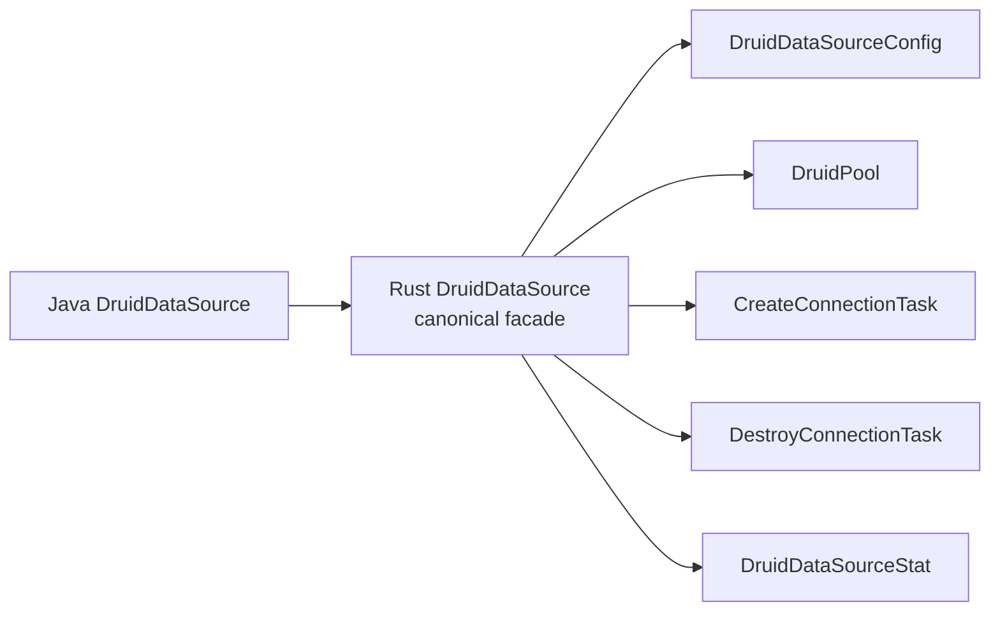

# Druid 1.2.28 → druid-rust 对象名称一致性检查

> 名称检查服务于迁移可追溯性，不要求所有 Java 类型机械复制成 Rust struct。直接迁移对象保留 canonical 名称；合并、拆分、适配和协议替换必须显式登记，不能用任意新名称掩盖语义缺口。连接层目标命名见[连接抽象与驱动适配架构](./5、连接抽象与驱动适配架构.md)。

## 1. 检查基线

| 项目 | 值 |
| :--- | :--- |
| Java 基线 | Druid 1.2.28，commit `33824c3dec1612711f9bb4e409319bcab2e4cd0e` |
| Java core 主源码 | 1,644 个 `.java` |
| Java 全仓主源码 | 1,719 个 `.java` |
| Rust 迁移批次基线 | commit `38620666a570bd5dbbf15a0dd86a3caea9e92c32` |
| Rust 源码 | CodeGraph 当前索引 103 个 `.rs`；布局审计扫描 74 个生产对象文件 |
| Rust 公开类型 | 83 个（`crates/*/src` 的公开 struct/enum/trait/type） |
| 布局审计 | `scanned=74 errors=0 warnings=0 allowed=0 semantic_parity_proven=false` |
| 检查日期 | 2026-07-28 |

旧文档所称“142 个计划完全匹配”不代表实际对象存在，已废止。本检查只报告当前源码证据；计划对象在创建后才进入实现统计。

## 2. 名称规范

| Java | Rust | 规则 |
| :--- | :--- | :--- |
| `DruidDataSource` | `DruidDataSource` / `druid_data_source.rs` | 直接迁移保留类型语义名 |
| `JdbcSqlStat` | `JdbcSqlStat` / `jdbc_sql_stat.rs` | `Jdbc` 是源对象身份，不随意删除 |
| `SQLUtils` | `SqlUtils` / `sql_utils.rs` | acronym 按 Rust 风格规范化 |
| `JDBC4ValidConnectionChecker` | `Jdbc4ValidConnectionChecker` | 数字与 acronym 保留语义 |
| `PGExceptionSorter` | `PgExceptionSorter` | acronym 规范化 |
| `MySqlExceptionSorter` | `MySqlExceptionSorter` | Java 已使用 MySql |
| `DruidXADataSource` | `DruidXaDataSource` | acronym 规范化 |
| `DruidDataSourceC3P0Adapter` | `DruidDataSourceC3p0Adapter` | 数字保留，字母按 Rust PascalCase 规范化 |
| `getConnection` | `get_connection` | 方法 snake_case，语义词不删减 |
| `maxActive` | `max_active` | 字段 snake_case |

允许省略 `Druid`/`Jdbc` 前缀的仅限明显的 Rust 内部实现对象；它不能代替 canonical 迁移 facade。`java.sql.Connection`、`java.sql.Driver` 等平台标准不属于 Druid canonical 对象，因此不机械保留 Java 类型名；其 Rust 目标使用能表达边界的 `PhysicalConnection`、`PhysicalConnectionFactory`，并在平台依赖映射表中追踪。

## 3. 文件组织检查

1. 每个 Java 直接迁移对象对应一个 `.rs` 文件。
2. 内部 Builder 可与主对象同文件；独立 Java Builder 仍需独立账目。
3. `mod.rs`、`lib.rs` 只做声明和 `pub use`。
4. Java 最后一级子包映射到同语义 Rust 目录。
5. 生产代码禁止 wildcard import。
6. 每个迁移对象与公开方法均有中文 doc 注释并注明 Java FQCN/方法。
7. `MERGE` 的每个 Java 对象必须在 enum variant 或 compatibility type 注释中单独出现。

## 4. 当前 canonical 名称审计

### 4.1 名称已保留但语义仍需验收

| Java 对象 | 当前 Rust 类型/文件 | 名称 | 语义状态 |
| :--- | :--- | :--- | :--- |
| `WallConfig` | `WallConfig` / `wall_config.rs` | 通过 | PARTIAL |
| `StatFilter` | `StatFilter` / `stat_filter.rs` | 通过 | PARTIAL |
| `ExceptionSorter` | `ExceptionSorter` / `exception_sorter.rs` | 通过 | PARTIAL |
| `MySqlExceptionSorter` | `MySqlExceptionSorter` / 合并文件 | 类型通过、文件失败 | PARTIAL |
| `ValidConnectionChecker` | `ValidConnectionChecker` / `valid_connection_checker.rs` | 通过 | PARTIAL |
| `[Rust internal] PhysicalConnectionFactory` | `PhysicalConnectionFactory` / `physical_connection_factory.rs` | canonical 名称已收敛；旧 `ConnectionFactory` 仅兼容重导出 | 通过；deprecated alias 待 C8 删除 |
| `DruidConnectionHolder` | `DruidConnectionHolder` / `druid_connection_holder.rs` | 通过；旧 `ConnectionHolder` 仅兼容重导出 | PARTIAL：PS cache 主链已落地；listener/trace、连接变量和运行时密码版本失效待补 |
| `PreparedStatementHolder` | `PreparedStatementHolder` / `prepared_statement_holder.rs` | 通过 | PARTIAL：字段/计数迁移完成，Oracle 驱动行为待补 |
| `PreparedStatementPool` | `PreparedStatementPool` / `prepared_statement_pool.rs` | 通过 | PARTIAL：LRU/容量/share/清理/统计完成，Oracle/listener/trace 待补 |
| `DruidPooledPreparedStatement` | `DruidPooledPreparedStatement` / `druid_pooled_prepared_statement.rs` | 通过 | PARTIAL：缓存与执行主链完成，setter/batch/result-set trace 待补 |
| `DruidPooledCallableStatement` | `DruidPooledCallableStatement` / `druid_pooled_callable_statement.rs` | 通过 | Java 构造器之外 115 个方法均有 Rust 同语义入口，另有 5 个生命周期/扩展方法；真实存储过程 Adapter 和 ResultSet trace 仍为 PARTIAL |
| `PoolConfig` | `PoolConfig` / `config.rs` | Rust 内部名 | PARTIAL |

名称合格不代表迁移完成。例如 `WallConfig` 有约 46 个字段，但当前规则引擎只读取其中一部分。

### 4.2 当前应迁名或增加 canonical facade

| Java canonical 对象 | 当前 Rust 对象 | 问题 | 目标 |
| :--- | :--- | :--- | :--- |
| `DruidDataSource` | `DruidPool` | 对外迁移身份丢失 | 新增 `DruidDataSource` facade，`DruidPool` 降为 engine |
| `DruidAbstractDataSource` | `PoolConfig`、`PoolInnerConfig` | 字段分散且无源对象入口 | `DruidDataSourceConfig` + 映射 ADR |
| `DruidPooledConnection` | `DruidPooledConnection`；`PooledConnection` 仅兼容重导出 | 名称已合并；回收主序列已迁移，statement/schema/fatal 分支仍待补 | 保持唯一 canonical 实现 |
| `—（JDBC 平台能力）` | `PhysicalConnection`；`Connection` 仅兼容重导出 | 对外/对内身份已拆开 | 保持内部最小 SPI |
| `—（物理创建能力）` | `PhysicalConnectionFactory`；`ConnectionFactory` 仅兼容重导出 | native factory 与 external pool 已拆开 | C8 删除旧 alias |
| `—（DataSource 来源职责）` | core `Pool`；实现为 `DruidPool` / `SqlxBb8Pool` / `SqlxDeadpoolPool` | 类型边界已可见，canonical `DruidDataSource` facade 待建 | facade 配置只选择一个 `Pool` |
| `—（close/recycle 所有权）` | `DruidPooledConnection` 内部三参数 `FnOnce` + `ConnectionRecycleDisposition`；external 使用 `PhysicalConnectionLease` | exactly-once 与显式 rollback/reset/testOnReturn/处置顺序已有契约 | P2 补 statement/schema/fatal、受监管销毁和 shutdown |
| `WallProvider` | `Wall` | Provider 生命周期/cache/SPI 不可见 | `WallProvider` facade，`WallEngine` 内部 |
| `WallCheckResult` | `Result<Vec<WallViolation>, _>` | 结果对象字段丢失 | `WallCheckResult` |
| `JdbcSqlStat` | `MergedSqlStat` | 名称只表达 merge，丢失统计对象身份 | `JdbcSqlStat`；merger 内部化 |
| `JdbcDataSourceStat` | `StatsCollector` | 多源对象混合 | 拆出 `JdbcDataSourceStat` |
| `HighAvailableDataSource` | `DynamicDataSource` | canonical HA 行为不可见 | `HighAvailableDataSource` facade |
| `DataSourceSelector` | `LoadBalancer` | 选择契约被泛化 | canonical trait + balancer adapter |
| `RandomDataSourceSelector` | `RandomBalancer` | 源对象不可追溯 | canonical selector |
| `StatementExecuteType` | `StatementType` | 语义词被缩短 | `StatementExecuteType` |
| `PoolableWrapper` | `Wrapper` | poolable 约束丢失 | canonical trait 或显式 MERGE |
| `SQLUtils` | 无 | 公共兼容入口缺失 | `SqlUtils` |
| `DbType` | 无 | 方言身份缺失 | `DbType` |

### 4.3 当前不存在但旧文档误标已完成的对象

| 对象 | 应有文件 | 当前 |
| :--- | :--- | :--- |
| `FilterChainImpl` | `filter_chain_impl.rs` | MISSING |
| `FilterManager` | `filter_manager.rs` | MISSING |
| `WallFilter` | `wall_filter.rs` | MISSING |
| `DruidDataSourceStatValue` | `druid_data_source_stat_value.rs` | MISSING |
| `JdbcSqlStatValue` | `jdbc_sql_stat_value.rs` | MISSING |
| `DruidStatService` | `druid_stat_service.rs` | MISSING |
| `DruidDataSourceStatManager` | `druid_data_source_stat_manager.rs` | MISSING |
| `StatViewServlet` 的协议替代 | `stat_view_router.rs` | MISSING |
| `EvictionRunner`/维护任务 | 对应明确 Java 任务对象的文件 | MISSING |
| `LeakDetector` | `leak_detector.rs` | MISSING |

不存在的文件或类型必须标 `MISSING`，不能用路线图中的目标路径标 `DONE`。

## 5. 非一对一名称登记

### 5.1 MERGE

```text
Java FQCN A ─┐
Java FQCN B ─┼─> RustType::VariantA / VariantB
Java FQCN C ─┘
```

要求：

- 每个源对象有稳定对象 ID；
- variant 名尽量保留 canonical token；
- 每个 variant 有独立 doc 注释和差分用例；
- 合并后的 Rust 文件不能同时定义无关 Java 对象。

适合的例子是多个 violation 实现合并为 `WallViolation` enum，不适合把所有 vendor checker 堆进一个文件。

### 5.2 SPLIT



要求 facade 保留源对象的公开行为，内部对象使用 Rust 风格名称并注明承载的 Java 方法。

### 5.3 ADAPTER/PROTOCOL

Java API 名称可以不直接暴露，但登记必须包含三层：

| 层 | 示例 |
| :--- | :--- |
| 源对象 | `StatViewServlet` |
| Rust 协议对象 | `StatViewRouter` |
| 等价结果 | 路由、JSON、静态资源、登录、allow/deny IP、reset |

仅写“JMX → metrics”“Spring → config”“JDBC → sqlx”不合格，因为这没有说明属性、动作和错误如何对应。

## 6. 当前 Rust-only 名称检查

| Rust 对象 | 来源 | 是否允许 | 约束 |
| :--- | :--- | :--- | :--- |
| `DruidPool`、`PoolInner` | `DruidDataSource` 内部调度 | 允许 | 不替代 canonical facade |
| `PoolConfigBuilder`、`DruidPoolBuilder` | datasource setters/factory | 允许但需去重 | 字段契约唯一来源 |
| `PhysicalConnection` | JDBC 平台连接能力 | 允许且要求迁名 | 内部最小 SPI，不与 `DruidPooledConnection` 竞争公开身份 |
| `PhysicalCallableStatement` | JDBC CallableStatement 平台能力 | 允许 | 最小驱动句柄 SPI；不支持能力必须显式报错 |
| `CallableInputParameter`、`CallableOutputValue`、`CallableCalendar`、`CallableParameter`、`CallableOutParameter` | CallableStatement 参数/返回值重载 | 允许 | 保留 setter/返回类型、Calendar、index/name/sqlType/scale/typeName/LOB/Reader 精确长度，不冒充 Druid 对象 |
| `JdbcBlob`、`PhysicalBlob`、`JdbcInputStream`、`JdbcOutputStream` | JDBC Blob / Java IO 平台资源 | 允许 | 完整资源句柄 SPI，不冒充 Druid `BlobProxy`，不静默物化 |
| `JdbcClob`、`PhysicalClob`、`JdbcNClob`、`PhysicalNClob` | JDBC Clob/NClob 平台资源 | 允许 | Clob 13 方法、NClob 继承身份；不冒充 Druid Proxy |
| `JdbcReader`、`JdbcWriter`、`JavaString` | Java Reader/Writer/String 平台资源 | 允许 | UTF-16 无损边界与共享资源生命周期 |
| `PhysicalConnectionFactory` | driver 创建能力 | 允许且要求迁名 | 只创建 raw connection，不从外部 pool acquire |
| `ConnectionProvider` | datasource acquire 来源选择 | 允许 | native/bridge 单选，返回统一 lease |
| `ConnectionLease`、`LeaseReturner` | close/recycle 所有权 | 允许 | exactly-once return，失败可监控 |
| `ConnectionDefaults` | `DruidConnectionHolder` 默认状态字段和 `reset()` | 允许 | 已作为 canonical holder 的内部值对象；不能替代 PS cache 等剩余职责 |
| `ConnectionRecycleDisposition` | `DruidDataSource.recycle` 的最终分支 | 允许 | 仅承载 reusable/discard/recycle-error 处置 |
| `ToastyConnectionFactory`、`ToastyConnectionAdapter` | Rust 内置标准数据源 | 允许 | 已归 `druid::toasty`；不冒充 Java 对象，不持有 Toasty pool |
| `SqlxConnectionAdapter`、`RbdcConnectionAdapter` | Rust driver 生态 | 允许 | 归 `druid-wrapper` 扩展，实现 `PhysicalConnection` contract |
| `SqlxBb8Pool`、`SqlxDeadpoolPool`、`PhysicalConnectionLease` | 外部池 bridge | 允许 | 实现 core `Pool` contract，禁止进入 native idle queue |
| `ExecContext` | Proxy/Filter 参数集合 | 允许 | 不得丢参数、数据源、时间、fingerprint |
| `BeforeFilter`、`AfterFilter`、`ExtendedFilter` | `Filter` 拆分 | 允许 | hook 覆盖率 100% |
| `SqlMerger`、`ParameterizedSql` | parameterized visitor/stat key | 允许 | P4 后基于兼容 AST |
| `DataSourceGroup`、`SqlHint` | HA/selector | 允许 | 绑定具体 Java 对象与契约 |
| `AdminState` | admin/service 状态 | 允许 | 不把状态对象当作完整 Router |

## 7. 方法名称与语义一致性

| Java 方法 | Rust canonical 方法 | 当前判断 |
| :--- | :--- | :--- |
| `init()` | `init().await` | MISSING |
| `getConnection()` | `get_connection().await` | 当前只有 `get()`，需 facade |
| `getConnectionDirect()` | `get_connection_direct().await` | MISSING |
| `recycle()` | `DruidPooledConnection::close().await` + `recycle()` / provider return | PARTIAL：显式 close 已完成 rollback/reset/testOnReturn/处置；同步 recycle/Drop 对脏连接直接淘汰 |
| `prepareCall(String)` | `prepare_call().await` | PARTIAL：入口、完整 key、缓存和标量 callable wrapper 已迁移；真实 Adapter 待补 |
| `prepareCall(String,int,int,int)` | `prepare_call_with_holdability().await` | PARTIAL：`Precall2` 全字段 key 已验证 |
| `prepareCall(String,int,int)` | `prepare_call_with_result_set().await` | PARTIAL：`Precall3` 全字段 key 已验证 |
| `setNull(String,int[,String])` | `set_named_null*` + `CallableInputParameter::Null` | PARTIAL：重载参数无损；真实 driver 待验收 |
| `setObject(String,Object[,int[,int]])` | `set_named_object*` + `CallableInputParameter::Object` | PARTIAL：`targetSqlType/scale` 无损；真实 driver 待验收 |
| `set/get BigDecimal` | `set_named_big_decimal` / `get_*_big_decimal*` | PARTIAL：任意精度与 scale 无损；真实 driver 待验收 |
| `set/get Date/Time/Timestamp(...[,Calendar])` | 同名 snake_case API + `CallableCalendarArgument` | PARTIAL：Calendar 三态与纳秒时间无损；真实 driver 待验收 |
| `getBlob(int/String)` / `setBlob(String,Blob/InputStream[,long])` | `get*_blob` / `set_named_blob*` + 资源 SPI | PARTIAL：5 个自有入口、对象身份、null/length/流不预读已测；真实 callable driver 待验收 |
| `getClob/getNClob(int/String)` / `setClob/setNClob(String,对象/Reader[,long])` | `get/set_named_*clob*` + 资源 SPI | PARTIAL：对象、null、Reader、index/name、long 重载已测；真实 callable driver 待验收 |
| `get/setCharacterStream` / `get/setNCharacterStream` | 同语义 snake_case API + `JdbcCharacterLength` | PARTIAL：无长度、int、long descriptor 与 Reader 不预读已测；真实 callable driver 待验收 |
| `getByte/getShort/getFloat(int/String)` | `get_*` + `get_named_*` → `PhysicalCallableStatement` | PARTIAL：测试驱动已验证；真实 driver 待验收 |
| `discardConnection()` | `discard_connection()` | PARTIAL |
| `testConnectionInternal()` | `test_connection_internal().await` | MISSING |
| `shrink()` / `shrink(boolean)` / `shrink(boolean, boolean)` | `shrink().await` / `shrink_check_time(bool).await` / `shrink_with_options(bool, bool).await` | PARTIAL：显式维护入口和主分支已迁移；后台 DestroyTask 与失败后补池待补 |
| `removeAbandoned()` | `remove_abandoned().await` | MISSING |
| `fill()` | `fill().await` | MISSING |
| `restart()` | `restart().await` | MISSING |
| `parseStatements()` | `parse_statements()` | MISSING |
| `toSQLString()` | `to_sql_string()` | MISSING |
| `parameterize()` | `parameterize()` | PARTIAL，算法不等价 |
| `check()` | `check()` | PARTIAL |
| `clearProviderCache()` | `clear_provider_cache()` | MISSING |
| `DruidConnectionHolder#reset()` | `DruidConnectionHolder::reset()`（内部委托 `ConnectionDefaults::reset()`） | PARTIAL：属性与 warnings 顺序、MySQL-family initSchema 恢复及 schema 变化清 cache 已迁移；listener/statement trace 未完成 |

`get()`、`close()`/Drop 等惯用 Rust API 可以作为便捷别名，但迁移 facade 应提供含义清晰、可追溯的 canonical 方法。

## 8. 原“142 个计划匹配”清单恢复与重新分类

原文宣称有 142 个计划匹配对象，但实际明确列出的五组清单只有 72 行，而且多行目标类型或文件并不存在。以下保留全部显式清单，并把“计划完成”改成“当前名称状态”。

### 8.1 连接池与 HA 原计划对象（30 个）

| Java 对象 | 原计划文件 | 当前名称状态 | 修订目标 |
| :--- | :--- | :--- | :--- |
| `DruidDataSource` | `druid_pool.rs` | RENAME | `DruidDataSource` / `druid_data_source.rs` |
| `DruidAbstractDataSource` | `config.rs` | SPLIT/RENAME | `DruidDataSourceConfig` + ADR |
| `DruidConnectionHolder` | `druid_connection_holder.rs` | MATCH/PARTIAL | canonical 类型和文件及 PS cache 主链已落实；继续补 listener/trace、变量与动态版本失效 |
| `DruidPooledConnection` | `druid_pooled_connection.rs` | MATCH/PARTIAL | 唯一实现已合并；完整 Java 状态机继续迁移 |
| `DruidDataSourceStatLogger` | `collector.rs` | MISSING | 独立同名文件 |
| `DruidDataSourceStatLoggerAdapter` | `collector.rs` | MISSING | 独立同名文件 |
| `DruidDataSourceStatLoggerImpl` | `collector.rs` | MISSING | tracing 实现 |
| `DruidDataSourceStatValue` | `pool_state.rs` | MISSING | 独立快照 |
| `ExceptionSorter` | `exception_sorter.rs` | MATCH/PARTIAL | 语义差分 |
| `ValidConnectionChecker` | `valid_connection_checker.rs` | MATCH/PARTIAL | 语义差分 |
| `ValidConnectionCheckerAdapter` | 合并文件 | MISSING | 独立文件 |
| `JDBC4ValidConnectionChecker` | 合并文件 | MISSING | `Jdbc4ValidConnectionChecker` |
| `PoolableWrapper` | `wrapper.rs` | RENAME | canonical trait |
| `WrapperAdapter` | `wrapper.rs` | MISSING | 独立文件 |
| `PreparedStatementHolder` | `statement_cache.rs` | MATCH/PARTIAL | 已纠正为独立 `prepared_statement_holder.rs` |
| `PreparedStatementPool` | `statement_cache.rs` | MATCH/PARTIAL | 已纠正为独立 `prepared_statement_pool.rs` |
| `HighAvailableDataSource` | `dynamic_datasource.rs` | RENAME | canonical facade |
| `DataSourceSelector` | `load_balancer.rs` | RENAME | canonical trait |
| `DataSourceSelectorEnum` | `load_balancer.rs` | MISSING | 同名 enum |
| `NamedDataSourceSelector` | `load_balancer.rs` | MISSING | 同名对象 |
| `RandomDataSourceSelector` | `random.rs` | RENAME | canonical selector |
| `RandomDataSourceValidateFilter` | `load_balancer.rs` | MISSING | 同名对象 |
| `StickyRandomDataSourceSelector` | `load_balancer.rs` | MISSING | 同名对象 |
| `PoolUpdater` | `registry.rs` | MISSING | 同名对象 |
| `OracleExceptionSorter` | 合并文件 | MISSING | 独立文件 |
| `MySqlExceptionSorter` | 合并文件 | TYPE MATCH/FILE FAIL | 独立文件 |
| `PGExceptionSorter` | 合并文件 | ACRONYM/FILE FAIL | `PgExceptionSorter` 独立文件 |
| `DB2ExceptionSorter` | 合并文件 | MISSING | `Db2ExceptionSorter` |
| `OracleValidConnectionChecker` | 合并文件 | MISSING | 独立文件 |
| `MySqlValidConnectionChecker` | 合并文件 | MISSING | 独立文件 |

### 8.2 Filter 原计划对象（8 个）

| Java 对象 | 原计划文件 | 当前名称状态 | 修订目标 |
| :--- | :--- | :--- | :--- |
| `Filter` | `filter.rs` | SPLIT/PARTIAL | canonical 账目绑定三个 trait |
| `FilterChain` | `filter_chain.rs` | MATCH/PARTIAL | 完整 chain |
| `FilterChainImpl` | `filter_chain.rs` | MISSING | `filter_chain_impl.rs` |
| `FilterManager` | `filter_manager.rs` | MISSING | 同名对象 |
| `StatFilter` | `stat_filter.rs` | MATCH/PARTIAL | 修复真实调用链 |
| `WallFilter` | `wall_filter.rs` | MISSING | 同名对象 |
| `LogFilter` | `log_filter.rs` | MISSING | tracing backend |
| `CounterFilter` | `counter.rs` | MISSING | 同名对象 |

### 8.3 Wall 原计划对象（15 个）

| Java 对象 | 原计划文件 | 当前名称状态 | 修订目标 |
| :--- | :--- | :--- | :--- |
| `WallProvider` | `wall.rs` | RENAME/PARTIAL | `WallProvider` facade |
| `WallConfig` | `wall_config.rs` | MATCH/PARTIAL | 字段行为全接线 |
| `WallVisitor` | `wall.rs` | MISSING | 独立 visitor |
| `WallVisitorBase` | `wall.rs` | MISSING | compatibility base |
| `WallCheckResult` | `wall_violation.rs` | MISSING | 独立结果对象 |
| `Violation`（原表误写 `WallViolation`） | `wall_violation.rs` | MERGE/PARTIAL | `WallViolation` enum variants |
| `WallSqlStat` | `wall_stat.rs` | MISSING | 独立文件 |
| `WallSqlStatValue` | `wall_stat.rs` | MISSING | 独立文件 |
| `WallTableStat` | `wall_stat.rs` | MISSING | 独立文件 |
| `WallTableStatValue` | `wall_stat.rs` | MISSING | 独立文件 |
| `WallFunctionStat` | `wall_stat.rs` | MISSING | 独立文件 |
| `WallFunctionStatValue` | `wall_stat.rs` | MISSING | 独立文件 |
| `WallDenyStat` | `wall_stat.rs` | MISSING | 独立文件 |
| `WallUpdateCheckHandler` | `wall_config.rs` | MISSING | 独立文件 |
| `WallUpdateCheckItem` | `wall_config.rs` | MISSING | 独立文件 |

### 8.4 Stat 原计划对象（12 个）

| Java 对象 | 原计划文件 | 当前名称状态 | 修订目标 |
| :--- | :--- | :--- | :--- |
| `JdbcSqlStat` | `merge.rs` | RENAME/PARTIAL | canonical 对象 |
| `JdbcSqlStatValue` | `merge.rs` | MISSING | 独立快照 |
| `JdbcDataSourceStat` | `collector.rs` | RENAME/PARTIAL | canonical 对象 |
| `JdbcConnectionStat` | `collector.rs` | MISSING | 独立对象 |
| `JdbcStatementStat` | `collector.rs` | MISSING | 独立对象 |
| `JdbcResultSetStat` | `collector.rs` | MISSING | 独立对象 |
| `JdbcStatManager` | `collector.rs` | MISSING | 独立对象 |
| `DruidStatService` | `api_sql.rs` | MISSING | service/protocol 对象 |
| `DruidDataSourceStatManager` | `registry.rs` | MISSING | canonical manager |
| `DruidStatManagerFacade` | `registry.rs` | MISSING | canonical facade |
| `DataSourceMonitorable` | `pool.rs` | MISSING | canonical trait |
| `TableStat` | `table_stat.rs` | MISSING | 独立对象 |

### 8.5 管理端原计划对象（7 个）

| Java 对象 | 原计划文件 | 当前名称状态 | 修订目标 |
| :--- | :--- | :--- | :--- |
| `StatViewServlet` | `router.rs` | PROTOCOL/MISSING | `StatViewRouter` |
| `MonitorViewServlet` | `router.rs` | PROTOCOL/MISSING | Router/页面契约 |
| `MonitorStatService` | `api_datasource.rs` | PROTOCOL/MISSING | service |
| `MonitorProperties` | `config.rs` | PROTOCOL/MISSING | typed config |
| `ServiceNode` | `registry.rs` | MISSING | 独立模型 |
| `DataSourceResult` | `response.rs` | MISSING | response 模型 |
| `SqlListResult` | `response.rs` | MISSING | response 模型 |

结论：原表列出的 72 行可以作为首批 canonical 名称 backlog，但不能推导出“142 个匹配”，也不能代表 1,719 个对象的完整登记。

## 9. 原“Java 有、Rust 无”分类的修订

| 原分类 | 原数量/说法 | 修订结论 |
| :--- | :--- | :--- |
| SQL parser | 1,268 个“不需要迁移” | 全部进入对象账本；可映射到 type/variant/adapter |
| JDBC Proxy | 36 个“不需要迁移” | 迁移为 async proxy/context/driver adapter |
| Mock | 22 个“不需要迁移” | 登记为 `TEST_ADAPTER` fixture |
| Support/Spring | 105 个“不需要迁移” | 迁移业务结果到 Axum/Tower/config/tracing |
| XA | 4 个“不需要迁移” | 迁移 2PC 状态机与 capability error |
| HA/ZooKeeper | 监听对象“不需要迁移” | 迁移到 Registry/Watcher SPI |
| MBean | 42 个接口“不需要迁移” | 映射 OpenMetrics descriptor + admin operation |

对象可以没有同名公开 Rust struct，但不能没有目标对象、协议结果和验收契约。

## 10. 自动检查设计

### 8.1 输入

- Java CodeGraph 类型清单：FQCN、kind、source path、public methods；
- Rust CodeGraph 类型清单：crate、type、source path、public methods；
- 对象账本：mapping kind、canonical target、ADR、status。

### 8.2 规范化

```text
Java type PascalCase -> Rust type PascalCase（acronym: SQL→Sql, JDBC→Jdbc, XA→Xa, PG→Pg）
Java source FooBar.java -> Rust source foo_bar.rs
Java method lowerCamel -> Rust method snake_case
```

### 8.3 CI 失败条件

1. Java 基线对象未登记；
2. `DIRECT` 对象没有 canonical Rust 类型或文件；
3. `MERGE/SPLIT/ADAPTER/PROTOCOL` 缺 ADR 或契约 ID；
4. 同一 Rust 文件定义多个无关迁移对象；
5. `mod.rs/lib.rs` 定义业务对象；
6. 公开方法缺中文来源注释；
7. 生产代码存在 wildcard import、`todo!()`、`unimplemented!()` 或“not yet implemented”；
8. 文档标 `DONE` 但路径/类型/测试不存在。

建议检查命令：

```bash
rg --files core/src/main/java -g '*.java'
rg --files crates -g '*.rs'
rg -n '^pub (struct|enum|trait|type) ' crates -g '*.rs'
rg -n 'todo!|unimplemented!|not yet implemented|use .+::\\*' crates -g '*.rs'
cargo +stable test --workspace
cargo +stable clippy --workspace --all-targets -- -D warnings
```

## 11. 通过标准

命名一致性不是追求 1,719 个 Rust struct，而是实现三项 100%：

- Java 对象登记率 100%；
- `DIRECT` canonical 名称合规率 100%；
- 非一对一映射的 ADR、目标对象和语义契约绑定率 100%。

在此之前，不得使用“对象名称一致”“核心逻辑 100%”等结论。

---

文档版本：v2.0

基线日期：2026-07-28

状态：名称审计基线
