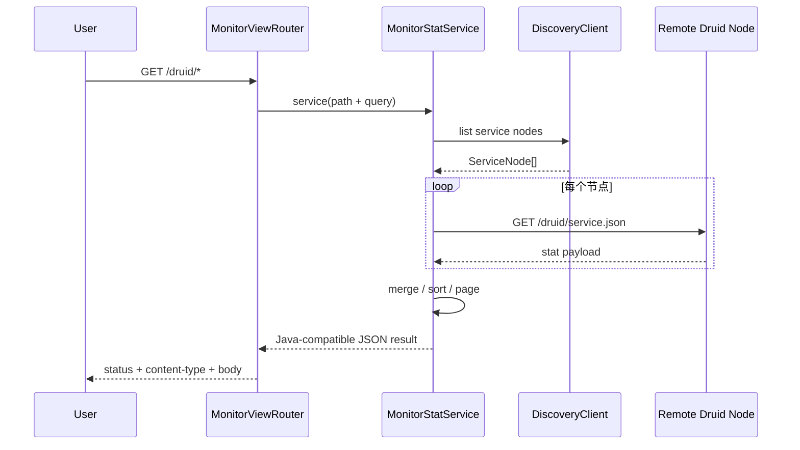

# druid-admin 模块迁移实施计划

> **For agentic workers:** REQUIRED SUB-SKILL: Use superpowers:subagent-driven-development (recommended) or superpowers:executing-plans to implement this plan task-by-task. Steps use checkbox (`- [ ]`) syntax for tracking.

**Goal:** 将 Java druid-admin 模块的 13 个生产 Java 对象、静态资源和监控 SQL 完整迁移到 Rust `crates/druid-admin`，实现服务发现、远端 Druid Stat 聚合、DTO、排序/分页、Servlet 路由、静态资源和错误 JSON 语义的完整迁移。

**Architecture:** `crates/druid-admin` 是独立产品 crate，提供管理面服务。使用 Topcoat 作为外层 server，Axum 作为 Java Servlet 协议路由，kube-rs 作为 K8s 服务发现 Adapter，prost 作为可选二进制快照协议。`druid-admin` 只消费 `druid` 暴露的统计协议，不反向绑定 ORM。

**Tech Stack:**
- Axum 0.8.9（路由/handler/middleware）
- axum-valid 0.25.0（参数校验）
- Tokio 1.53.1（async runtime）
- tokio-metrics 0.5.1（管理指标）
- Topcoat 0.5.0（外层 server/压缩/路由）
- prost 0.14.4（可选二进制协议）

---

## 对象状态总览

| 维度 | Java | Rust 当前 | 状态 |
| :--- | :--- | :--- | :--- |
| 生产对象 | 13 | 13/13 canonical 对象均有独立 Rust 文件；另有明确登记的 Rust Adapter | IMPLEMENTED_UNVERIFIED |
| HTTP 入口 | Spring Boot + Undertow + Servlet | Topcoat + Axum Router/Tower | IMPLEMENTED_UNVERIFIED |
| 参数校验 | Servlet 参数解析 | axum-valid Form/Query + Java raw URL parser | IMPLEMENTED_UNVERIFIED |
| 服务发现 | K8s + Spring Cloud DiscoveryClient | DiscoveryClient SPI + kube-rs Adapter + static Adapter | IMPLEMENTED_UNVERIFIED |
| 聚合服务 | MonitorStatService 518 行 | URL 分派/发现/远端请求/合并/排序/分页/降级 | IMPLEMENTED_UNVERIFIED |
| DTO | 6 个顶层 DTO 及内部 Bean | 6/6 serde DTO；ServiceNode 同时支持 prost | IMPLEMENTED_UNVERIFIED |
| 静态资源 | 完整 Druid monitor UI | HTML/CSS/JS 25/25 原文件迁入 | IMPLEMENTED_UNVERIFIED |
| 监控 SQL | 8 个 MySQL DDL 模板 | resources/support/monitor/mysql/*.sql 8/8 | IMPLEMENTED_UNVERIFIED |

---

## 代码结构

```
crates/druid-admin/
  src/
    bin/         -- 可执行入口
    config/      -- 配置对象
    driver/      -- 服务发现驱动
    model/       -- DTO 与数据模型
    service/     -- 聚合服务逻辑
    servlet/     -- Axum Router/handler
    util/        -- 工具函数
```

共 52 个 .rs 文件。

---

## 阶段总览

| Stage | 内容 | 验收 | 状态 |
|-------|------|------|------|
| A0 | 13 对象账本、路由/DTO/资源清单 | 文件与资源分母冻结 | IMPLEMENTED_UNVERIFIED |
| A1 | DTO 与 Java JSON 结果 | serde snapshot 对照 Java | IMPLEMENTED_UNVERIFIED |
| A2 | MonitorProperties/ServiceNode | 默认值、配置优先级、prost round-trip | IMPLEMENTED_UNVERIFIED |
| A3 | HttpClient 与 DiscoveryClient SPI | timeout/error/取消 | IMPLEMENTED_UNVERIFIED |
| A4 | kube-rs 与注册中心 SPI | fixture + 集成环境 | IMPLEMENTED_UNVERIFIED |
| A5 | MonitorStatService | 聚合、排序、分页、参数、错误 | IMPLEMENTED_UNVERIFIED |
| A6 | Topcoat + Axum 替代 Servlet | 路由/状态码/内容类型差分 | IMPLEMENTED_UNVERIFIED |
| A7 | 原 UI 25 份资源与 8 份监控 SQL | 源文件逐字节/忽略空白对照已完成 | IMPLEMENTED_UNVERIFIED |
| A8 | tracing/metrics/login/session | 鉴权、SSRF、敏感数据、链路 | IMPLEMENTED_UNVERIFIED |
| A9 | 统一验证 | Java fixture + Tower + HTTP 故障 + workspace coverage | TODO |

---

## Stage A0 — 对象账本与资源清单

**目标：** 冻结 13 个 Java 对象分母、路由/DTO/资源清单。

- [x] **Step 1:** 13 个 Java 对象均有独立 Rust 文件或显式 ADAPTER 决策 — **DONE**
- [x] **Step 2:** 路由/DTO/资源清单冻结 — **DONE**

**出口门禁：** 文件与资源分母冻结。

---

## Stage A1 — DTO 与 Java JSON 结果

**目标：** 确保 Rust DTO 的 serde 序列化结果与 Java JSON 一致。

- [ ] **Step 1:** DataSourceDTO/SqlDTO/WallDTO/WebDTO/ConnectionDTO 对照 Java JSON
- [ ] **Step 2:** serde snapshot 测试
- [ ] **Step 3:** 空值/默认值/排序字段差异记录

**出口门禁：** serde snapshot 对照 Java。

---

## Stage A2 — MonitorProperties/ServiceNode

**目标：** 迁移配置默认值、优先级和 prost round-trip。

- [ ] **Step 1:** MonitorProperties 全字段默认值与 Java 对照
- [ ] **Step 2:** 配置优先级（env > file > default）
- [ ] **Step 3:** ServiceNode prost 序列化/反序列化 round-trip

**出口门禁：** 默认值、配置优先级、prost round-trip 通过。

---

## Stage A3 — HttpClient 与 DiscoveryClient SPI

**目标：** 迁移远端 Druid 节点 HTTP 请求和超时/错误/取消语义。

- [ ] **Step 1:** HttpClient timeout/error/取消语义
- [ ] **Step 2:** DiscoveryClient SPI trait 定义
- [ ] **Step 3:** 错误分类（网络失败/部分节点失败/空发现结果）

**出口门禁：** timeout/error/取消 通过。

---

## Stage A4 — kube-rs 与注册中心 SPI

**目标：** 迁移 K8s 服务发现和外部注册中心适配。

- [ ] **Step 1:** kube-rs Adapter fixture 测试
- [ ] **Step 2:** 集成环境测试
- [ ] **Step 3:** static Adapter（手动节点列表）

**出口门禁：** fixture + 集成环境 通过。

---

## Stage A5 — MonitorStatService

**目标：** 迁移聚合、排序、分页、参数和错误处理。

- [ ] **Step 1:** URL 分派逻辑
- [ ] **Step 2:** 远端节点并发请求与合并
- [ ] **Step 3:** 排序/分页/降级策略
- [ ] **Step 4:** 非法参数错误处理

**出口门禁：** 聚合、排序、分页、参数、错误 通过。

---

## Stage A6 — Topcoat + Axum 替代 Servlet

**目标：** 迁移路由、状态码、内容类型语义。

- [ ] **Step 1:** Axum Router 完整路由映射
- [ ] **Step 2:** 状态码/内容类型与 Java Servlet 差分
- [ ] **Step 3:** Tower middleware 接入

**出口门禁：** 路由/状态码/内容类型差分 通过。

---

## Stage A7 — 原 UI 资源与监控 SQL

**目标：** 确保静态资源和 SQL 模板不丢失。

- [x] **Step 1:** HTML/CSS/JS 25/25 原文件迁入 — **DONE**
- [x] **Step 2:** MySQL 监控 SQL 8/8 — **DONE**
- [ ] **Step 3:** 运行路由统一验证

**出口门禁：** 源文件逐字节/忽略空白对照已完成；运行路由待统一验证。

---

## Stage A8 — tracing/metrics/login/session

**目标：** 迁移鉴权、SSRF、敏感数据和链路追踪。

- [ ] **Step 1:** 认证与 allow/deny IP
- [ ] **Step 2:** SSRF 防护
- [ ] **Step 3:** 敏感数据脱敏
- [ ] **Step 4:** tracing 链路接入

**出口门禁：** 鉴权、SSRF、敏感数据、链路 通过。

---

## Stage A9 — 统一验证

**目标：** Java fixture + Tower + HTTP 故障 + workspace coverage。

- [ ] **Step 1:** Java fixture 对照测试
- [ ] **Step 2:** Tower ServiceExt 真实请求测试
- [ ] **Step 3:** HTTP 故障注入测试
- [ ] **Step 4:** workspace coverage 门禁

**出口门禁：** Java fixture + Tower + HTTP 故障 + workspace coverage 全部通过。

---

## 关键调用序列



---

## 验收门禁

- 13/13 Java 对象有独立 Rust 文件或显式 ADAPTER 决策
- 所有公开路径、参数名、默认排序、分页和 result code 快照一致
- 静态资源和 SQL 模板不丢失
- 网络失败、部分节点失败、空发现结果、非法参数均有差分用例
- Axum router 使用真实 `tower::ServiceExt` 请求，不测试静态 endpoint 字符串
- `cargo check -p druid-admin --all-targets` 只构成 V1 编译证据

---

文档版本：v3.0 (superpowers plan format)

基线日期：2026-08-12

状态：IMPLEMENTED_UNVERIFIED（A0-A8 生产代码已完成首轮整批迁移，统一验证尚未执行）
