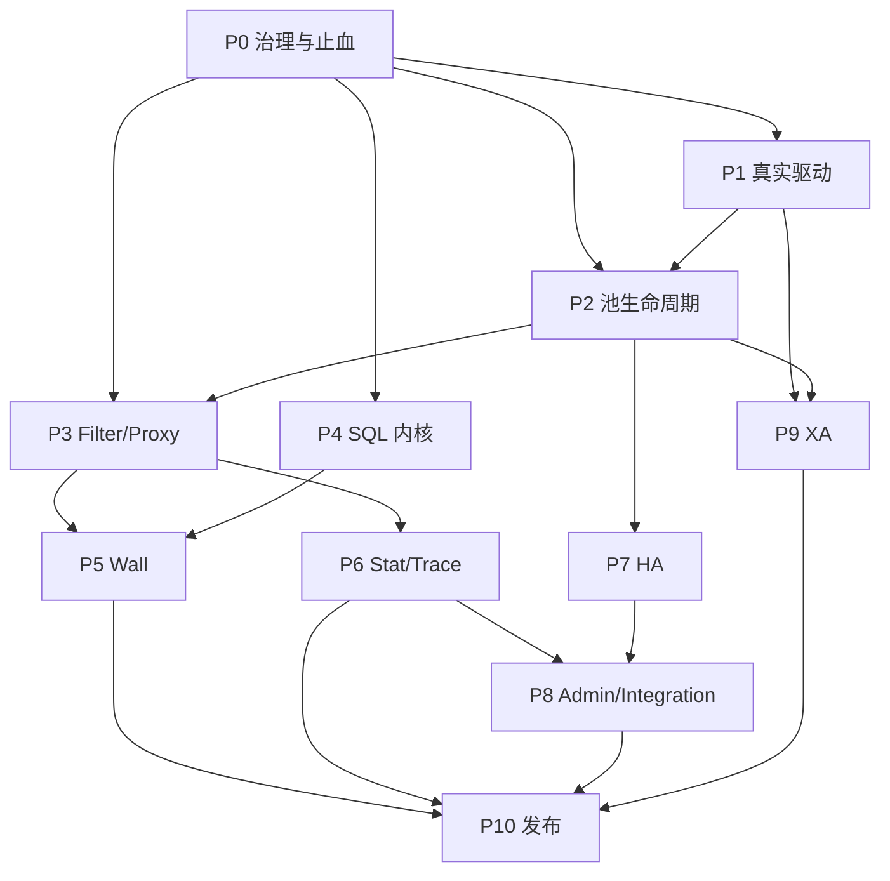

# 跨模块迁移总路线图

> **For agentic workers:** REQUIRED SUB-SKILL: Use superpowers:subagent-driven-development (recommended) or superpowers:executing-plans to implement this plan task-by-task. Steps use checkbox (`- [ ]`) syntax for tracking.

**Goal:** 将 Java Druid 1.2.28 的功能语义完整迁移到 Rust druid-rust 三个产品模块（druid、druid-admin、druid-wrapper），实现语义完成率 100%、对象可追溯率 100%、命名合规率 100%，最终发布 `1.0-semantic-parity`。

**Architecture:** 3-module workspace 架构。`druid` 是核心模块，包含 Java core 全部语义（连接池、SQL/Wall/Stat/HA、Toasty 内置实现）；`druid-wrapper` 提供可选数据库 Adapter 和外部池适配（SQLx/RBDC/bb8/deadpool）；`druid-admin` 提供管理、监控和协议适配（Axum Router、OpenMetrics）。三模块通过 `PhysicalConnection` SPI 解耦，native pool 与 external pool bridge 二选一成为单次租约的 Provider，禁止池中池。

**Tech Stack:**
- Rust 1.97.1 (MSRV 1.95)，Toasty 0.9，SQLx 0.8，RBDC 4.9
- bb8、deadpool（外部连接池 bridge）
- Axum 0.8.9、Topcoat 0.5.0（管理面）
- sqlparser-rs（SQL 解析内核）
- tokio、tracing、ArcSwap、Prometheus

---

## 冻结基线

| 项目 | 冻结值 | 核验方式 |
| :--- | :--- | :--- |
| Java 源仓库 | `/Users/wandl/workspaces/workspace-github/druid` | 本地 Git |
| Java 版本 | `1.2.28` | tag `1.2.28` |
| Java 提交 | `33824c3dec1612711f9bb4e409319bcab2e4cd0e` | `git rev-parse HEAD` |
| Java 主源码 | core 1,644 个 `.java`；全仓 1,719 个 | `rg --files` |
| Rust 源仓库 | `/Users/wandl/workspaces/workspace-github-easy-4-rust/druid-rust` | 本地 Git |
| Rust 产品模块（当前源码） | `druid`、`druid-admin`、`druid-wrapper` | workspace member |
| Rust 产品模块（已批准目标） | `druid-core`、`druid`（facade）、`druid-wrapper`、`druid-metrics`、`druid-admin` | ADR-CRATE-001 |
| Rust 迁移基线提交 | `194fec5e4351ab562ca1708383e80f320ecc1f83` | `git rev-parse HEAD` |
| Rust 工具链 | MSRV 1.95，默认 1.97.1 | `cargo check --workspace` |
| Rust 当前规模 | druid 368 .rs，druid-admin 52 .rs，druid-wrapper 108 .rs | 2026-08-12 源码扫描 |

---

## 阶段总览

| Stage | 目标 | 退出门禁 | 状态 |
|-------|------|----------|------|
| P0 | 迁移治理与当前正确性止血 | workspace 三 crate；默认工具链全绿；取还连接计数守恒；Filter before/after 执行 | DONE |
| P1 | 驱动 SPI 与真实数据库适配 | adapter 不含固定"未实现"；真实数据库 connect/exec/fetch/transaction/close 契约 | PARTIAL |
| P2 | 连接池生命周期完整迁移 | 并发压力下容量不越界、无丢连接、无双重归还；Java pool fixture 差分通过 | PARTIAL |
| P3 | Filter、Proxy 与执行事件模型 | 每个 Java hook 有事件映射；顺序、短路、异常、上下文差分通过 | PARTIAL |
| P4 | SQL 内核与方言兼容层 | Druid SQL 测试语料按方言差分；parse→AST→output 达 100% | PARTIAL |
| P5 | Wall 防火墙 | 每个 WallConfig 字段有开/关两组行为测试；Java/Rust 放行/拒绝一致 | PARTIAL |
| P6 | 统计、追踪与日志 | 固定时钟与并发场景下 Java/Rust 快照逐字段一致 | PARTIAL |
| P7 | HA、动态数据源与恢复 | 故障注入下无跨事务切换、无连接泄漏 | PARTIAL |
| P8 | 管理、监控与框架集成 | 端点 schema、权限、reset 动作与 Java 基线对照 | PARTIAL |
| P9 | XA、分布式事务与高级兼容 | 支持适配器完成 2PC 故障注入 | TODO |
| P10 | 全量差分、性能与生产发布 | `1.0-semantic-parity` 发布检查全部通过 | TODO |

---

## 阶段依赖



P4 可以与 P1/P2 并行，但 Wall 必须等待 SQL 兼容层稳定；P10 不接受以时间换范围。

---

## Stage P0 — 迁移治理与当前正确性止血

**目标：** 建立可信基线，修复会让后续验收失真的基础缺陷。

- [x] **Step 1:** 将 workspace 产品边界收敛为三个 crate（druid、druid-admin、druid-wrapper），按职责物理迁入 `druid/src/*` 与 `druid-wrapper/src/*` — **DONE**
- [x] **Step 2:** 固定可构建 Rust MSRV/lockfile，CI 执行 fmt、clippy、test、doc、audit — **DONE**
- [x] **Step 3:** 修复 B-01（DruidPool 空 return callback）、B-02（run_after_filter 未 await）、B-03（fetch 绕过 Filter）、B-04（after context 丢失参数）— **DONE**
- [x] **Step 4:** 修复 B-07（扩容判断非原子预留）— **DONE**：CAS 原子容量预留
- [x] **Step 5:** 修复 B-10（工具链固定 Rust 1.75.0）— **DONE**：MSRV 1.95，默认 1.97.1
- [x] **Step 6:** 建立对象总账、语义契约 ID、命名检查和差分测试目录 — **DONE**（1,644 对象分母已冻结；语义契约 ID 嵌入测试命名；差分测试目录已建立）
- [ ] **Step 7:** 为 Java oracle 提供可重复运行的 fixture runner — **IMPLEMENTED_UNVERIFIED**（`./mvnw -pl core -DskipTests=false test` 可执行；无独立自动化 fixture runner 脚本）

**出口门禁：** workspace 仅剩三 crate；默认工具链全绿；所有取还连接路径计数守恒；Filter before/after 对 exec/fetch/错误路径都执行一次。

---

## Stage P1 — 驱动 SPI 与真实数据库适配

**目标：** 把 JDBC 的"获得物理连接并执行数据库操作"迁移为真实 Rust 能力。

- [ ] **Step 1:** 建立对象安全、异步、最小化的 `PhysicalConnection` SPI — **PARTIAL**
- [x] **Step 2:** 在 `druid::toasty` 内实现 Toasty 内置标准 raw adapter — **DONE**（SQLite 已证，多数据库 PARTIAL）
- [ ] **Step 3:** `druid_wrapper::sqlx` 与 `druid_wrapper::rbdc` 提供 direct adapter — **PARTIAL**
- [ ] **Step 4:** bb8/deadpool 改为 `ExternalPoolProvider` bridge — **PARTIAL**
- [ ] **Step 5:** 所有 adapter 完成连接创建/租借、验证、错误分类、状态复位和关闭/归还 — **PARTIAL**
- [ ] **Step 6:** 对齐 Connection/Statement/PreparedStatement/ResultSet/metadata/LOB/事务结果语义 — **PARTIAL**
- [ ] **Step 7:** 建立 PostgreSQL、MySQL、SQLite 容器测试 — **PARTIAL**（SQLite 已有真实测试；PG/MySQL 容器测试待建立）

**出口门禁：** adapter 不含固定"未实现"返回；真实数据库完成 connect/exec/fetch/transaction/cancel/timeout/close 契约；native/bridge 均只返回 `DruidPooledConnection`。

---

## Stage P2 — 连接池生命周期完整迁移

**目标：** 迁移 DruidDataSource/DruidAbstractDataSource/DruidConnectionHolder/DruidPooledConnection 完整状态机。

- [ ] **Step 1:** 初始化、创建/销毁任务、公平/非公平等待、超时、失败退避、容量预留 — **IMPLEMENTED_UNVERIFIED**
- [ ] **Step 2:** min_idle/initial_size/max_active/max_wait/keepAlive/驱逐和物理寿命 — **PARTIAL**
- [ ] **Step 3:** borrow/return 校验、rollback、状态 reset、schema 恢复、fatal error、discard — **PARTIAL**
- [ ] **Step 4:** removeAbandoned、使用次数、密码版本、PS cache、关闭/禁用重启/fill — **PARTIAL**（removeAbandoned/密码版本/creator-destroy worker 已实现；PS cache/关闭重启待验证）
- [x] **Step 5:** vendor checker/sorter 的数据库错误矩阵 — **DONE**（sorter 对象族 10/10 通过）

**出口门禁：** 并发压力下容量不越界、无丢连接、无双重归还；Java pool fixture 差分通过。

### P2 已完成切片摘要

| 切片 | 日期 | 范围 | 测试数 | 覆盖率(Regions) |
|------|------|------|--------|----------------|
| P2-R1 | 2026-07-28 | 连接创建与回收语义 | Java 21 + Rust 31 | — |
| P2-R3 | 2026-07-28 | PreparedStatement cache 主语义 | Java 21 + Rust 14 | — |
| P2-R4 | 2026-07-28 | CallableStatement 标量语义 | Java 101 + Rust 6 | — |

---

## Stage P3 — Filter、Proxy 与执行事件模型

**目标：** 迁移 Druid FilterChain 的职责链语义。

- [ ] **Step 1:** 连接/statement/prepared/callable/result set/LOB/metadata 事件 — **PARTIAL**（185 个 ResultSet Filter 调用已迁移）
- [ ] **Step 2:** Filter 初始化、销毁、排序、别名加载、短路、异常传播和反向 after 顺序 — **PARTIAL**
- [ ] **Step 3:** Proxy 属性、参数、执行类型、事务信息在 async context 中完整传播 — **PARTIAL**
- [ ] **Step 4:** 迁移 ConfigFilter/LogFilter/EncodingConvertFilter 业务结果 — **IMPLEMENTED_UNVERIFIED**

**出口门禁：** 每个 Java Filter hook 在对象账本中有事件映射；顺序、短路、异常、上下文差分通过。

---

## Stage P4 — SQL 内核与方言兼容层

**目标：** 完整迁移 Druid SQL 对外语义。

- [ ] **Step 1:** DbType/Lexer token/位置/注释/ParserFeature/多语句与 EOF 规则 — **IMPLEMENTED_UNVERIFIED**
- [ ] **Step 2:** SQLStatementParser/AST 类型族/Parent/Attribute 元数据 — **PARTIAL**
- [ ] **Step 3:** Visitor/output visitor/format/parameterize/restore/fingerprint — **TODO**
- [ ] **Step 4:** schema repository/表列解析/SQL transform/builder — **TODO**
- [ ] **Step 5:** 对每个方言建立能力矩阵（原生支持/扩展 parser/兼容 AST/需 fork） — **TODO**

**出口门禁：** Druid SQL 测试语料按方言差分；parse→AST→output、parameterize、visitor 结果达 100%。

---

## Stage P5 — Wall 防火墙

**目标：** 在 P4 兼容 AST 上迁移 WallProvider/WallVisitor/Filter 全部安全语义。

- [ ] **Step 1:** 所有 WallConfig 默认值、allow/deny、恒真条件、变量、函数、schema、tenant — **PARTIAL**
- [ ] **Step 2:** 各数据库 WallProvider、SPI 注册、缓存、统计、异常码 — **PARTIAL**
- [ ] **Step 3:** WallFilter 接入所有 SQL 执行入口 — **PARTIAL**

**出口门禁：** 每个 WallConfig 字段至少有开/关两组行为测试；Java/Rust 放行/拒绝/错误码/统计一致。

---

## Stage P6 — 统计、追踪与日志

**目标：** 迁移 Jdbc*Stat/StatFilter/DruidStatManager 统计口径。

- [ ] **Step 1:** 执行次数/错误/运行中/并发峰值、耗时分布、慢 SQL — **PARTIAL**
- [ ] **Step 2:** SQL 参数化合并、最大值 CAS、reset、快照与排序 — **IMPLEMENTED_UNVERIFIED**
- [ ] **Step 3:** JMX 映射为 OpenMetrics/admin API/tracing — **PARTIAL**

**出口门禁：** 固定时钟与并发场景下 Java/Rust 快照逐字段一致；高并发不丢计数。

---

## Stage P7 — HA、动态数据源与恢复

**目标：** 迁移 HighAvailableDataSource 及节点选择、粘性、验证和恢复语义。

- [ ] **Step 1:** named/random/sticky selector、读写路由、故障摘除、恢复探测 — **PARTIAL**
- [ ] **Step 2:** ZooKeeper/File node listener 业务结果迁移为可插拔 Registry/Watcher SPI — **PARTIAL**
- [ ] **Step 3:** 热切换时事务粘性、旧池排空、配置版本和回滚 — **TODO**

**出口门禁：** 故障注入下无跨事务切换、无连接泄漏；节点事件和选择序列可重放。

---

## Stage P8 — 管理、监控与框架集成

**目标：** 迁移 support/starter/admin 模块运维结果。

- [ ] **Step 1:** Axum Router、静态资源、datasource/sql/wall/web/session API — **IMPLEMENTED_UNVERIFIED**
- [ ] **Step 2:** Spring Boot starter 配置绑定结果迁移为 Rust config + feature + layer — **TODO**
- [ ] **Step 3:** Servlet/WebStatFilter 请求/URI/session 统计迁移为 Tower middleware — **TODO**
- [ ] **Step 4:** JNDI/FactoryBean/MBean 映射为显式 builder/registry/admin protocol — **TODO**

**出口门禁：** 端点 schema、权限、reset 动作和指标与 Java 基线对照。

---

## Stage P9 — XA、分布式事务与高级兼容

**目标：** 迁移 XA/两阶段提交行为。

- [x] **Step 1:** DruidXADataSource/XAConnection/XAResource 状态机 — **DONE**（`core/xa.rs` 1125 行：Xid 对齐 javax.transaction.xa.Xid；XaTransactionState 9 状态机；XaResource async trait；flags 常量；97 测试 + xa_demo.rs 示例）
- [ ] **Step 2:** Rust TransactionManager SPI 与数据库适配器能力探测 — **PARTIAL**（协议层状态机已完成；真实 MySQL/PG XA 驱动适配待实现）
- [x] **Step 3:** prepare/commit/rollback/recover/heuristic error/超时/幂等 — **DONE**（XaTransactionState 状态机覆盖全部转换路径；非法转换拒绝+超时+审计轨迹）

**出口门禁：** 支持适配器完成 2PC 故障注入；不支持的数据库明确返回能力错误。

---

## Stage P10 — 全量差分、性能与生产发布

- [ ] **Step 1:** 对象总账和语义契约 100% 关闭 — **TODO**
- [ ] **Step 2:** 混沌测试、loom 并发模型、长稳、泄漏、背压、取消安全 — **TODO**
- [ ] **Step 3:** 与 Java Druid 同配置的吞吐、P99、内存和连接恢复基准 — **TODO**
- [ ] **Step 4:** SemVer、迁移指南、兼容矩阵、SLO、告警、回滚和发布签名 — **TODO**

**出口门禁：** `1.0-semantic-parity` 发布检查全部通过。

---

## "完整迁移"定义

完成度按语义契约计算，不按 Rust 文件数或代码行数计算：

```text
语义完成率 = 已通过差分验收的语义契约数 / 基线语义契约总数
对象可追溯率 = 已登记 Java 对象数 / Java 基线对象总数
命名合规率 = 通过命名检查的迁移对象数 / 已落地迁移对象数
```

发布 `1.0-semantic-parity` 的硬条件：
1. 语义完成率 100%，对象可追溯率 100%
2. Java 的成功结果、失败类型、状态变化、副作用、统计口径和安全判断均有 Rust 对应契约
3. 非一对一迁移必须有 MERGE/SPLIT/ADAPTER/PROTOCOL 决策并绑定测试
4. 外部库只能承载实现，不能替代验收
5. 不允许以"Java/JDBC/Spring/JMX 特有"为由静默删除能力
6. `todo!()`、`unimplemented!()`、空函数体、固定返回"未实现"均计为未迁移

---

## 当前阻断基线状态

| ID | 证据 | 当前 | 处置阶段 |
|----|------|------|----------|
| B-01 | DruidPool 空 return callback | CLOSED | P0 |
| B-02 | run_after_filter 未 await | CLOSED | P0 |
| B-03 | fetch 绕过 Filter | CLOSED | P0 |
| B-04 | after context 丢失参数 | CLOSED | P0 |
| B-05 | adapter 固定返回"未实现" | CLOSED | P1 |
| B-06 | min_idle 等配置未闭环 | PARTIAL | P2 |
| B-07 | 扩容判断非原子预留 | CLOSED | P2 |
| B-08 | WallConfig 字段未被规则引擎读取 | OPEN | P5 |
| B-09 | admin 无 Axum Router | OPEN | P8 |
| B-10 | 工具链固定 Rust 1.75.0 | CLOSED | P0 |

---

## 当前覆盖率基线（2026-08-12）

| 指标 | 覆盖 | 已覆盖/总量 |
| :--- | ---: | ---: |
| Regions | ~90% | 待重新生成 |
| Functions | ~92% | 待重新生成 |
| Lines | ~93% | 待重新生成 |

全仓 100% 覆盖率门禁保持未关闭。

---

## 覆盖率切片历史摘要

| 切片 | 日期 | 范围 | 测试数 | Regions | Functions | Lines |
|------|------|------|--------|---------|-----------|-------|
| C3-R5 | 2026-07-28 | Callable Clob/NClob | workspace 428 | 87.25% | 89.96% | 90.22% |
| C1-R2 | — | WrapperAdapter/PoolableWrapper | workspace — | 86.95% | 89.64% | 89.84% |
| C3-R7 | — | Prepared/Callable Wrapper 统一 | workspace — | 87.21% | 89.71% | 89.95% |
| C2-R8 | — | ExceptionSorter 平台异常 | workspace — | 87.43% | 89.94% | 90.10% |
| C2-R9 | — | Oracle/Phoenix/Mock sorter | workspace — | 87.65% | 90.31% | 90.34% |
| C2-R10 | — | 全 Connection 操作异常入口 | workspace 451 | 87.80% | 91.33% | 90.49% |
| C2-R11 | — | PS 关闭清理异常 | workspace 453 | 87.82% | 91.42% | 90.52% |
| C2-R12 | — | 普通 Statement 对象边界 | workspace 458 | 88.14% | 91.93% | 90.91% |
| C2-R13 | — | ResultSet 只读游标 | workspace 464 | 85.37% | 88.86% | 87.82% |
| C2-R14 | — | ResultSet 强类型值 | workspace 473 | 83.69% | 87.22% | 86.73% |
| C2-R15 | — | ResultSet 资源 getter | workspace 470 | 84.15% | 87.76% | 87.37% |
| C2-R16 | — | ResultSet LOB 流式 update | workspace 470 | 84.38% | 87.96% | 87.70% |
| C2-R17 | — | ResultSet 标量/流 update | workspace 473 | 84.66% | 88.18% | 88.14% |
| C2-R18 | — | typed getObject | workspace 477 | 84.21% | 87.82% | 87.87% |
| C2-R19 | — | ResultSetMetaData 标准列 | workspace 478 | 84.33% | 88.01% | 88.05% |
| C2-R20 | — | ResultSetMetaData 物理身份 | workspace 479 | 84.35% | 88.02% | 87.98% |
| C2-R21 | — | JdbcResultSetStat 独立对象 | workspace 481 | 84.51% | 88.17% | 88.04% |
| C2-R22 | — | ResultSet FilterChain/StatFilter | workspace 485 | 84.78% | 88.46% | 88.23% |
| C2-R23 | — | StatFilterContext/Listener | workspace 488 | 84.98% | 88.67% | 88.37% |
| C2-R24 | — | ListenerAdapter/SQL 事件 | workspace 489 | 85.09% | 88.70% | 88.45% |
| C2-R25 | — | Statement batch Filter/统计 | workspace 491 | 85.21% | 88.80% | 88.54% |
| C2-R26 | — | PS 参数快照 batch | workspace 494 | 85.31% | 88.82% | 88.64% |
| C2-R27 | — | Statement generic execute | workspace 497 | 85.64% | 88.96% | 88.92% |
| C2-R28 | — | PS generic execute | workspace 500 | 85.94% | 89.15% | 89.24% |
| C2-R29 | — | 四类 JDBC SQLWarning | workspace 506 | 86.21% | 89.42% | 89.49% |
| C2-R30 | — | SQLx/RBDC warning Adapter | workspace 507 | 86.25% | 89.53% | 89.61% |
| C2-R31 | — | ResultSet#getStatement Prepared | workspace 510 | 86.44% | 89.79% | 89.76% |
| C2-R32 | — | ResultSet#getStatement Callable | workspace 512 | 86.45% | 89.73% | 89.74% |
| C2-R33 | — | PS setter 持久绑定 | workspace 515 | 86.84% | 90.00% | 90.21% |
| C2-R34 | — | PS 继承属性与缓存回收 | workspace 517 | 86.49% | 89.25% | 89.83% |
| C2-R35 | — | Prepared 资源 setter/batch | workspace 518 | 85.92% | 88.48% | 89.25% |
| C2-R39 | — | ResultSet 默认能力 | workspace 530 | 86.77% | 89.74% | 90.39% |
| C2-R40 | — | ResultSet 标量 getter 重载 | workspace 534 | 89.41% | 91.61% | 92.53% |
| C2-R41 | — | 物理 ResultSet 贯通 | workspace 534 | 89.11% | 91.55% | 92.33% |
| C2-R42 | — | ResultSet 18 标量 FilterChain | workspace 538 | 89.23% | 91.68% | 92.42% |
| C2-R43 | — | ResultSet Decimal/Temporal FC | workspace 539 | 89.41% | 91.82% | 92.57% |
| C2-R44 | — | ResultSet Object 六重载 FC | workspace 540 | 89.53% | 91.91% | 92.66% |
| C2-R45 | — | ResultSet Stream/Resource 26 FC | workspace 542 | 89.61% | 91.89% | 92.55% |
| C2-R46 | — | ResultSet Nav/Property 26 FC | workspace 544 | 89.71% | 92.00% | 92.60% |
| C2-R47 | — | ResultSet NString 重载 FC | workspace 545 | 89.73% | 92.02% | 92.61% |
| C2-R48 | — | ResultSet Metadata FC | workspace 546 | 89.74% | 92.03% | 92.62% |
| C2-R49 | — | ResultSet Statement 动态 FC | workspace 547 | 89.81% | 92.14% | 92.69% |
| C2-R50 | — | ResultSet Row-Mutation FC | workspace 549 | 89.82% | 92.16% | 92.70% |
| C2-R51 | — | ResultSet 基础列 Update FC | workspace 551 | 89.90% | 92.20% | 92.78% |
| C2-R52 | — | ResultSet updateObject FC | workspace 553 | 89.96% | 92.24% | 92.85% |
| C2-R53 | — | ResultSet 资源 Update FC | workspace 555 | 89.92% | 92.18% | 92.82% |
| C2-R54 | — | ResultSet LOB Stream Update FC | workspace 557 | 89.97% | 92.20% | 92.88% |
| C2-R55 | — | ResultSet Stream Update FC | workspace 559 | 90.11% | 92.26% | 93.05% |
| C2-R56 | — | ResultSet updateNString FC | workspace 561 | 90.10% | 92.24% | 93.03% |
| C2-R57 | — | FilterAdapter 默认适配 | workspace 563 | 90.10% | 92.26% | 93.04% |
| C2-R58 | — | FilterEventAdapter 事件模板 | workspace 568 | 90.12% | 92.34% | 93.06% |
| C2-R59 | — | FilterManager alias/工厂 | workspace 573 | 90.24% | 92.41% | 93.13% |

---

## 风险与控制

| 风险 | 控制 |
| :--- | :--- |
| sqlparser-rs 方言覆盖不足 | 逐方言矩阵；扩展或 fork |
| async Drop 无法执行异步 reset | 显式 close().await；Drop 仅复用干净连接 |
| Filter 事件压缩导致信息损失 | 以 Java hook 清单驱动事件模型 |
| 外部池 adapter 与 Druid 池职责重叠 | native-pool 与 bridge 两种模式分别验收 |
| JMX/Spring/JDBC 形态不同 | PROTOCOL/ADAPTER 决策 |
| 测试多但只验证当前实现 | Java oracle 差分用例为完成门禁 |
| 文档再次漂移 | CI 校验路径、类型、状态和契约 ID |

---

文档版本：v3.0 (superpowers plan format)

基线日期：2026-08-12

状态：迁移执行基线
