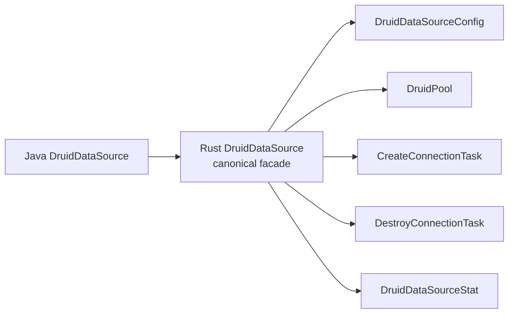

# 对象名称一致性审计聚合规格

> 日期：2026-08-12  来源：聚合 3 模块 × 对象名称一致性检查

## druid 模块

> 检查日期：2026-07-30
> Java baseline：`33824c3dec1612711f9bb4e409319bcab2e4cd0e`
> Rust baseline：`2c7bf3bea6f9e94f4583a85794df519c4435a425` + 当前 dirty migration worktree
> 文档状态：`PARTIAL`

### 基线

| 项目 | 数值 |
| :--- | ---: |
| Java core 生产对象 | 1,644 |
| Rust `druid` 模块入口 | `crates/druid/src/lib.rs` |
| Rust 内部 core/pool/sql/stats/dynamic 源码 | 已归 `crates/druid/src/*` |
| Rust 内置 Toasty 源码 | 已归 `crates/druid/src/toasty` |
| 语义状态 | PARTIAL |

文件数不等于完成率；只有 Java 对象逐项进入对象账本并关闭方法契约才计为完成。
来源审计也不等于同名类型生成：SLF4J、Log4j、Log4j2、Commons Logging、
Logback、JMX MBean 等 JVM 专属对象只登记为 `NOT_APPLICABLE/EXCLUDED`，
不参与 Rust 名称一致性缺口、应实现对象数或完成率计算。Rust 日志 API 统一使用
`tracing`，只迁移 Druid 的事件时机、级别、字段、过滤和脱敏语义。

### 命名规则

| Java | Rust |
| :--- | :--- |
| `DruidPooledConnection` | `DruidPooledConnection` / `druid_pooled_connection.rs` |
| `PreparedStatementPool` | `PreparedStatementPool` / `prepared_statement_pool.rs` |
| `SQLUtils` | `SqlUtils` / `sql_utils.rs` |
| `JDBC4ValidConnectionChecker` | `Jdbc4ValidConnectionChecker` |
| `prepareCall` | `prepare_call` |
| `maxActive` | `max_active` |

### 已保留 canonical 名称

| Java 对象 | Rust | 名称 | 语义 |
| :--- | :--- | :--- | :--- |
| `DruidConnectionHolder` | 同名独立文件 | PASS | PARTIAL |
| `DruidPooledConnection` | 同名独立文件 | PASS | PARTIAL |
| `PoolableWrapper` | 同名独立文件 | PASS | DONE（对象本身的 unwrap/isWrapperFor 分支） |
| `WrapperAdapter` | 同名独立文件 | PASS | DONE |
| `PreparedStatementHolder` | 同名独立文件 | PASS | PARTIAL |
| `PreparedStatementPool` | 同名独立文件 | PASS | PARTIAL |
| `DruidPooledPreparedStatement` | 同名独立文件；同文件 `DruidPooledPreparedStatementHandle` 是 Rust 共享身份表示 | PASS | PARTIAL：48 个 JDBC setter 重载、持久参数槽、绑定执行、generic execute、有序描述符 batch、顺序多结果、generated keys、getter fatal sorter、继承 SQLWarning/Statement 属性、五属性关闭恢复、共享 ResultSet trace 与 Prepared 动态身份已落；canonical query 直接包装物理 ResultSet；Toasty/SQLx SQLite 资源执行与 RBDC 严格 SPI 已接，多数据库待补 |
| `PreparedInputParameter` | Rust 支撑对象；独立 `prepared_input_parameter.rs` | PASS | 不冒充 Java 对象；集中表达 Java setter overload 的输入联合类型；`RustValue` 明确标识原 Rust 显式 batch 扩展 |
| `ToastyPreparedStatement` | Toasty 平台 Adapter 对象；独立 `toasty_prepared_statement.rs` | PASS | 不冒充 Druid Java 对象；填补 Toasty raw SQL 没有独立 PreparedStatement 参数槽的差异，在物理 setter 时点物化并保存驱动值 |
| `DruidPooledCallableStatement` | 同名独立文件；同文件 `DruidPooledCallableStatementHandle` 表示 ResultSet 返回的同一共享对象 | PASS | Java 本类 116 个公开声明及继承结果入口均可追踪；callable/Prepared/raw unwrap、强生命周期和关闭级联已验证；真实存储过程 driver 证据仍是 PARTIAL |
| `DruidPooledStatement` | 同名独立文件 | PASS | PARTIAL：canonical 对象、三种创建入口、query/update、JDBC `int[]` batch/部分失败、四种 execute、顺序多结果、generated keys、SQLWarning、属性/close/unwrap 与 ResultSet trace 已落；SQLx/RBDC Connection warning Adapter 已闭合，原生多结果待补 |
| `DruidPooledResultSet` | 同名独立文件 | PASS | PARTIAL：完整 getter/update/metadata/Wrapper 基础上，next/close/warning、18 个标量 getter、16 个 decimal/temporal getter、六个 plain/map/typed object、26 个 stream/resource getter、26 个 navigation/property 调用、两条 NString、getMetaData、getStatement、七个 row-mutation、28 个基础列 update setter、四个 `updateObject` 重载、14 个资源对象 setter、12 个 LOB stream/Reader setter、22 个 ASCII/Binary/Character/NCharacter stream setter及两个 NString setter 同步 Filter around-chain；`ResultSetStatement` 保留普通/Prepared/Callable 动态身份，row-mutation、基础/object/resource/LOB/stream/NString setter 保留默认末端、全方法短路、参数身份、共享游标、错误分类和 capability error，`JdbcOpaqueObject` 可恢复 vendor 具体对象；`is_closed_with_connection` 与内部 `is_closed` 职责分离；StatFilter、custom typed object 单次物理读取、默认 SPI 精确能力错误及 185 个 ResultSet 精确委托已验证，ResultSet update setter Filter 子域已闭合；Statement/PreparedStatement canonical query 保留同一物理 ResultSet，SQLx SQLite 与 RBDC SPI driver label 已测；Toasty eager/raw SQL alias 缺失、RBDC 空结果 descriptor、嵌套 ResultSet/Clob object 自动代理、SQL read length、custom conversion、streaming 与多数据库待补 |
| `FilterAdapter` | 同名独立 `filter_adapter.rs` | PASS | PARTIAL：Java 491 个公开方法；生命周期/属性配置默认空语义、精确自身 Wrapper、SQL before/after 与当前 185 个 ResultSet hook 默认继续链已由三账本和真实 Toasty SQLite 验证；未迁移调用族不能因对象文件存在而计作完成 |
| `FilterEventAdapter` | 同名独立 `filter_event_adapter.rs` | PASS | PARTIAL：物理 connect 已进入直接/后台 creator 并保留真实 ID、正向 before 与反向 after；dataSource get 已为有位置 around-chain；当前调用链可承载的 create/prepare/call、execute/query/update/batch、error 与 ResultSet open 已迁移；`FilterEventListener` 是 Rust 对 protected override 的组合式承载，不冒充额外 Java 对象。StatementProxy/具体 DataSource 身份、downstream-before 局部错误展开及完整 Java 错误矩阵仍开放 |
| `FilterManager` | 同名独立 `filter_manager.rs` | PASS | PARTIAL：Java bundled alias、properties 后者覆盖、UTF-16 名称边界、加载/缺失/构造失败及类名去重已迁移；显式工厂、Factory `setFilters` 与 inventory AutoLoad 已装配。JVM 自动 ClassLoader 扫描及未迁移 alias 行为保持开放 |
| `WallConfig` | 同名独立文件 | PASS | PARTIAL/IMPLEMENTED_UNVERIFIED：Java 字段/默认值、内置规则目录、updateCheckColumns、动态 handler 与 doPrivilegedAllow 已接；部分字段规则仍开放 |
| `StatFilter` | 同名独立文件 | PASS | PARTIAL：SQL execute/update、普通与 PreparedStatement generic execute、普通与 PreparedStatement batch、活动事务 commit/rollback、ResultSet、pool get/release 与真实 physical connect/close 已接；LOB 与统一差分待补 |

### 需要 canonical facade/迁名

| Java 对象 | 当前 Rust | 问题 | 目标 |
| :--- | :--- | :--- | :--- |
| Java `/core` artifact | 唯一 `druid` crate | PASS | 已归并到 `crates/druid/src/*` |
| `DruidDataSource` | `DruidDataSource` facade + `DruidPool` engine | canonical 名称和文件已建立；fatal 状态与 resetStatEnable/resetCount 仍由同一 datasource engine 持有，没有拆出伪 Java 对象 | 继续关闭 `restart(Properties)`、完整字段、XA 与统一证据 |
| `DruidAbstractDataSource` | `PoolConfig`/`PoolInnerConfig`/`DruidPoolBuilder` | 有规划的 SPLIT；配置运行主链已建立 | 继续补剩余字段并保持映射表 |
| `JdbcSqlStat` | `MergedSqlStat` | 名称丢失 | canonical `JdbcSqlStat` |
| `JdbcDataSourceStat` | `JdbcDataSourceStat` / `jdbc_data_source_stat.rs`；`StatsCollector` 是兼容 type alias | canonical 对象已恢复；分层字段仍 PARTIAL | 继续关闭完整字段和统一差分，最终删除误导性 alias |
| `HighAvailableDataSource` | `dynamic/high_available_data_source.rs` / `HighAvailableDataSource` | canonical 名称与基本 HA facade 已恢复；PARTIAL/IMPLEMENTED_UNVERIFIED | 继续补 node/update/recovery/close |
| `SQLUtils` | `sql/sql_utils.rs` / `SqlUtils` | canonical 名称已恢复 | PARTIAL：parse/单语句/format/parameterize 与显式方言选择已落；Java 全 overload、AST/Visitor/输出细节仍缺 |
| `DbType` | `sql/db_type.rs` / `DbType` | canonical 名称已恢复；语义为 PARTIAL/IMPLEMENTED_UNVERIFIED | 全枚举 Java 差分后升级；log4jdbc 明确 NOT_APPLICABLE |

### Rust 平台适配名称

这些对象允许没有 Java Druid 同名对象，但必须登记来源：

| Rust 对象 | 来源 | 判断 |
| :--- | :--- | :--- |
| `PhysicalConnection` | `java.sql.Connection` | 合法内部 SPI |
| `DruidError::BatchUpdateException` | `java.sql.BatchUpdateException` | 合法平台错误映射；保留部分 `int[]` 与原始 cause，不冒充 Druid 自有对象 |
| `PhysicalStatement` | `java.sql.Statement` | 合法内部 SPI；属性/批次/生命周期与 SQL 执行连接职责分离 |
| `PhysicalResultSet`/`RowSetResultSet` | `java.sql.ResultSet` | 合法内部 SPI 与 eager Adapter；canonical Statement/PreparedStatement 必须持有 `Arc<dyn PhysicalResultSet>`，不得用 `Vec<Row>` 冒充完整 ResultSet；未支持的方法保留逐方法精确 operation，typed object 保持一次底层读取和底层错误优先级；plain/map/typed object 及 String/Boolean/Long/Int/Short/Byte/Double/Float/Bytes 均保留 index/label 独立物理重载 |
| `ResultSetUpdate` | `java.sql.ResultSet#updateXxx` 重载族 | 合法 Rust 平台描述符；独立文件保留 setter 类型、null、流句柄及 int/long/未指定长度身份，不计作 Java 对象迁移数 |
| `ResultSetMetaData` | `java.sql.ResultSetMetaData` | canonical 双后端平台对象；Java 标准 getter、physical 逐调用错误时机及 Wrapper 身份已闭合，真实 driver descriptor 供给另行验收 |
| `ResultSetStatement` | `java.sql.ResultSet#getStatement()` 返回的 `Statement` 动态对象 | 合法 ADAPTER；独立文件中的三分支拥有型共享句柄，保留普通/Prepared/Callable 身份及同一生命周期，不冒充新的 Java 对象 |
| `PhysicalResultSetMetaData` | `java.sql.ResultSetMetaData` driver 实例 | 合法内部 SPI；独立文件保存真实 metadata 对象身份，每个 getter 必须逐次委托，不得 eager snapshot |
| `ResultSetColumnMeta`/`ResultSetColumnType`/`ResultSetNullability` | `ResultSetMetaData` 单列返回字段与 `java.sql.Types`/可空常量 | 合法独立 Rust descriptor；不得把 unknown nullability 压成 bool，也不得猜 schema/table/catalog |
| `PhysicalPreparedStatement` | `java.sql.PreparedStatement` | 合法内部 SPI |
| `PhysicalCallableStatement` | `java.sql.CallableStatement` | 合法内部 SPI |
| `ToastyConnectionFactory` | Toasty `Driver` | 合法内置标准实现；每次创建 raw connection，不持有 Toasty pool |
| `ToastyConnectionAdapter` | Toasty `Connection` | 合法内置 Adapter；源码必须位于 `druid::toasty` 并随 `druid` 发布 |
| `CallableInputParameter` | `CallableStatement` 命名 setter 重载 | 合法内部 SPI；保留 setter 身份及 sqlType/typeName/scale |
| `JdbcObject`（兼容 alias `CallableOutputValue`） | JDBC `getObject/updateObject` 通用值域 | canonical 平台对象；保留标量、Decimal、日期时间、资源与 vendor custom 身份，不再以 Callable 专属名称定义实现 |
| `JdbcTargetType`（兼容 alias `CallableTargetType`） | JDBC typed `getObject(..., Class<T>)` | canonical 平台目标类型；保留标准目标与 vendor 类名 |
| `JdbcTypeMap`（兼容 alias `CallableTypeMap`） | JDBC `Map<String, Class<?>>` | canonical 平台类型映射；ResultSet/Callable/Array/Ref 共用 |
| `JdbcOpaqueObject`/`PhysicalJdbcOpaqueObject` | JDBC vendor custom `Object` | 合法平台 Adapter；保留 `Arc` 引用身份、类名和受控 downcast |
| `JdbcCalendar`/`JdbcCalendarArgument`（兼容别名 `CallableCalendar*`） | `java.util.Calendar` 日期时间重载 | 合法 canonical 内部 SPI；保留时区和重载/null 身份，Callable 与 ResultSet 共用 |
| `JdbcBlob`/`PhysicalBlob` | `java.sql.Blob` | 合法平台 Adapter；11 个 JDBC 操作，不计入 Druid 对象分母 |
| `JdbcClob`/`PhysicalClob` | `java.sql.Clob` | 合法平台 Adapter；13 个 JDBC 操作，不计入 Druid 对象分母 |
| `JdbcNClob`/`PhysicalNClob` | `java.sql.NClob` | 合法平台 Adapter；保留 `NClob extends Clob` 身份 |
| `RdbcString` | `java.lang.String` | 合法平台值对象；用 UTF-16 code unit 无损保留 surrogate |
| `RdbcReader`/`RdbcWriter` | `java.io.Reader/Writer` | 合法平台 Adapter；共享游标/关闭状态，不静默物化 |
| `RdbcInputStream`/`RdbcOutputStream` | `java.io.InputStream/OutputStream` | 合法平台 Adapter；共享游标与关闭状态，不得用 Vec 代替资源句柄 |
| `SqlxConnectionAdapter` | Rust SQLx 生态 | 归 `druid-wrapper`，可选扩展 |
| `RbdcConnectionAdapter` | Rust RBDC 生态 | 归 `druid-wrapper`，可选扩展 |

名称和归属结论：`Toasty*` 是 Rust 平台标准实现名称，不冒充 Java Druid 对象；
`Sqlx*`/`Rbdc*` 是扩展名称。三者都只能实现 `PhysicalConnection` 边界，不能
取代 `DruidPooledConnection`。

模块名称结论：这里只允许 `druid`、`druid-admin`、`druid-wrapper` 三个产品
模块。`druid-core`、`druid-pool`、`druid-toasty` 等名称只能标注历史归并来源，
不能出现在最终公共包名、发布清单或完成度统计中。

### 方法名称检查

| Java 方法 | Rust canonical | 当前 |
| :--- | :--- | :--- |
| `getConnection()` | `get_connection().await` | facade 待补；engine 有 `get()` |
| `prepareStatement(...)` | `prepare_statement*().await` | PARTIAL |
| `prepareCall(...)` | `prepare_call*().await` | PARTIAL |
| `createStatement(...)` | `create_statement*().await` | PARTIAL：三个创建重载及查询 ResultSet trace 已迁移，Statement 剩余多结果/generated keys 待补 |
| `next()/previous()/close()` | `DruidPooledResultSet::next/previous/close_with_connection` | PARTIAL：next/close 的 Filter position 游标、短路、错误展开、成功计数、fetch peak、显式/Statement 级联关闭已一致；previous Filter 待接 |
| `getObject(int/String, Class<T>)` | `object_typed/object_typed_by_label` + `JdbcTargetType` | 已下沉真实 SPI；SQLite 标量 index conversion、资源分派、custom unsupported 与 index/label 目标身份已验证；Toasty 真实 label metadata 待补 |
| `getObject(int/String, Map<String,Class<?>>)` | `object_with_type_map/object_by_label_with_type_map` | index/label 与可空 Map 原样委托，参数身份及真实 SQLite unsupported/异常计数已闭合 |
| `getString/getBoolean/getByte/getShort/getInt/getLong/getFloat/getDouble/getBytes` | 同语义 snake_case API | PARTIAL：index/label 基础族已落；LOB/Array/Ref 等方法族待补 |
| `getAsciiStream/getUnicodeStream/getBinaryStream/getCharacterStream/getNCharacterStream` | 同语义 snake_case API | index/label getter 已落，eager Adapter 返回共享状态资源句柄；ASCII/Binary/Character/NCharacter update 的无长度/int/long 合法重载已闭合 |
| `Connection/Statement/PreparedStatement/ResultSet#getWarnings/clearWarnings` | 各池化 facade 的 `warnings/clear_warnings` | 四类对象均已落结构化 warning 与可改写/短路的 Filter around-chain；Connection getter 不进 sorter、clear 进入 sorter 的非对称时机已验证；Toasty/SQLx SQLite 与 RBDC 公开 SPI Adapter 已闭合 |
| `ResultSet#getCursorName/getMetaData` | `cursor_name/meta_data` | 已落完整 JDBC metadata getter、physical 逐调用错误时机及 Wrapper 身份；Toasty 真实 driver label/origin/type descriptor 供给待补 |
| `getRef/getBlob/getClob/getArray/getURL/getRowId/getNClob/getSQLXML(int/String)` | `reference/blob/clob/array/url/row_id/n_clob/sql_xml` + `*_by_label` | 16 个重载名称与 index/label 身份已闭合；真实 SQLite 明确 unsupported |
| `updateObject(int/String,Object[,scaleOrLength])` | `update_object*` / `update_object_by_label*` | 四重载名称和参数维度独立保留；Filter 可观察 plain/scaleOrLength 与 index/label，SQL NULL、负 scale 和 `JdbcOpaqueObject` vendor 具体身份已验证 |
| `updateRef/updateBlob/updateClob/updateArray/updateRowId/updateNClob/updateSQLXML(int/String,对象)` | `update_*` + `update_*_by_label` | 14 个对象型重载、Java null、RowId 值和精确 FilterChain 名称均已闭合；链内拥有型资源 Clone 保持共享物理句柄，末端才转回借用 |
| `updateBlob(InputStream)`、`updateClob/updateNClob(Reader)` | `update_*_stream/reader*` | index/label、无长度/long 长度共 12 重载名称一一对应；四层 Filter 精确入口已闭合，拥有型 Clone 共享游标/关闭状态，默认链不预读，原始 long 不校正 |
| `setNull(String,int[,String])` | `set_named_null*` | 名称/参数已一致；真实 driver 未验证 |
| `setObject(String,Object[,int[,int]])` | `set_named_object*` | 三重载元数据已保留；真实 driver 未验证 |
| `getByte/getShort/getFloat(int/String)` | `get_byte/get_short/get_float` 与 `get_named_*` | 已落物理 SPI；真实 driver 未验证 |
| `set/get BigDecimal` | `set_named_big_decimal` / `get_*_big_decimal*` | Callable setter/getter 与 ResultSet 四重载保留强类型及 scale；Toasty/SQLx/RBDC SQLite 边界已验证 |
| `set/get Date/Time/Timestamp(...[,Calendar])` | 同名 snake_case API + `JdbcCalendarArgument` | Calendar 三态及纳秒时间已保留；ResultSet 12 个重载的 raw SPI 参数身份和三个 Adapter 边界已验证 |
| `getClob/getNClob(int/String)` | `get_clob/get_named_clob/get_n_clob/get_named_n_clob` | 名称和 index/name 重载一致；资源 SPI 已测，真实 callable driver 未验证 |
| `setClob/setNClob(String,对象/Reader[,long])` | `set_named_clob*` / `set_named_n_clob*` | 对象、null、Reader 和长度重载身份已保留 |
| `get/setCharacterStream`、`get/setNCharacterStream` | 同语义 snake_case API | `Reader` 资源及 `int/long/unspecified` 长度重载已保留 |
| `recycle()` | `close().await` / `recycle()` | PARTIAL |
| `shrink(...)` | `shrink().await` / `shrink_check_time(bool).await` / `shrink_with_options(bool, bool).await` | PARTIAL/IMPLEMENTED_UNVERIFIED |
| `removeAbandoned()` | `remove_abandoned()` | IMPLEMENTED_UNVERIFIED：同步扫描 weak active lease、running 跳过与超时失效 |

名称检查通过不代表语义完成；本模块仍未达到 1,644/1,644。

### 非一对一名称登记

#### MERGE

```text
Java FQCN A ─┐
Java FQCN B ─┼─> RustType::VariantA / VariantB
Java FQCN C ─┘
```

要求：

- 每个源对象有稳定对象 ID；
- variant 名尽量保留 canonical token；
- 每个 variant 有独立 doc 注释和差分用例；
- 合并后的 Rust 文件不能同时定义无关 Java 对象。

适合的例子是多个 violation 实现合并为 `WallViolation` enum，不适合把所有 vendor checker 堆进一个文件。

#### SPLIT



要求 facade 保留源对象的公开行为，内部对象使用 Rust 风格名称并注明承载的 Java 方法。

#### ADAPTER/PROTOCOL

Java API 名称可以不直接暴露，但登记必须包含三层：

| 层 | 示例 |
| :--- | :--- |
| 源对象 | `StatViewServlet` |
| Rust 协议对象 | `StatViewRouter` |
| 等价结果 | 路由、JSON、静态资源、登录、allow/deny IP、reset |

仅写"JMX → metrics""Spring → config""JDBC → sqlx"不合格，因为这没有说明属性、动作和错误如何对应。

### 当前 Rust-only 名称检查

| Rust 对象 | 来源 | 是否允许 | 约束 |
| :--- | :--- | :--- | :--- |
| `DruidPool`、`PoolInner` | `DruidDataSource` 内部调度 | 允许 | 不替代 canonical facade |
| `PoolConfigBuilder`、`DruidPoolBuilder` | datasource setters/factory | 允许但需去重 | 字段契约唯一来源 |
| `PhysicalConnection` | JDBC 平台连接能力 | 允许且要求迁名 | 内部最小 SPI，不与 `DruidPooledConnection` 竞争公开身份 |
| `PhysicalCallableStatement` | JDBC CallableStatement 平台能力 | 允许 | 最小驱动句柄 SPI；不支持能力必须显式报错 |
| `CallableInputParameter`、`JdbcObject`（兼容 alias `CallableOutputValue`）、`JdbcCalendar`（兼容 alias `CallableCalendar`）、`CallableParameter`、`CallableOutParameter` | CallableStatement 参数/返回值重载 | 允许 | canonical 通用平台对象使用 `Jdbc*` 名称；保留 setter/返回类型、Calendar、index/name/sqlType/scale/typeName/LOB/Reader 精确长度，不冒充 Druid 对象 |
| `JdbcBlob`、`PhysicalBlob`、`RdbcInputStream`、`RdbcOutputStream` | JDBC Blob / Java IO 平台资源 | 允许 | 完整资源句柄 SPI，不冒充 Druid `BlobProxy`，不静默物化 |
| `ClobProxy` | `core/clob_proxy.rs` / `ClobProxy` | MATCH/PARTIAL | canonical Druid trait，额外保留 connection ID 与 raw Clob；Connection create 与 ResultSet 包装均生产该身份 |
| `ClobProxyImpl` | `core/clob_proxy_impl.rs` / `ClobProxyImpl` | MATCH/PARTIAL/IMPLEMENTED_UNVERIFIED | 13 个 Java Clob 操作逐项走 FilterChain，`DruidPooledConnection#create_clob` 返回该对象 |
| `NClobProxy` | `core/n_clob_proxy.rs` / `NClobProxy` | MATCH/PARTIAL | 保留 `NClob extends Clob` 代理身份；Connection create 与 ResultSet 包装均生产该身份 |
| `NClobProxyImpl` | `core/n_clob_proxy_impl.rs` / `NClobProxyImpl` | MATCH/PARTIAL/IMPLEMENTED_UNVERIFIED | 复用同一 Clob proxy/filter/raw 生命周期，`DruidPooledConnection#create_n_clob` 返回该对象 |
| `BlobProxy` / `BlobProxyImpl` | 无 | NOT_APPLICABLE/EXCLUDED | Java baseline 无此 Druid 对象；旧对照表误写已纠正 |
| `JdbcClob`、`PhysicalClob`、`JdbcNClob`、`PhysicalNClob` | JDBC Clob/NClob 平台资源 | 允许 | Clob 13 方法、NClob 继承身份；不冒充 Druid Proxy |
| `RdbcReader`、`RdbcWriter`、`RdbcString` | Java Reader/Writer/String 平台资源 | 允许 | UTF-16 无损边界与共享资源生命周期 |
| `PhysicalConnectionFactory` | driver 创建能力 | 允许且要求迁名 | 只创建 raw connection，不从外部 pool acquire |
| `ConnectionProvider` | datasource acquire 来源选择 | 允许 | native/bridge 单选，返回统一 lease |
| `ConnectionLease`、`LeaseReturner` | close/recycle 所有权 | 允许 | exactly-once return，失败可监控 |
| `ConnectionDefaults` | `DruidConnectionHolder` 默认状态字段和 `reset()` | 允许 | 已作为 canonical holder 的内部值对象；不能替代 PS cache 等剩余职责 |
| `ConnectionRecycleDisposition` | `DruidDataSource.recycle` 的最终分支 | 允许 | 仅承载 reusable/discard/recycle-error 处置 |
| `ToastyConnectionFactory`、`ToastyConnectionAdapter` | Rust 内置标准数据源 | 允许 | 已归 `druid::toasty`；不冒充 Java 对象，不持有 Toasty pool |
| `ExecContext` | Proxy/Filter 参数集合 | 允许 | 不得丢参数、数据源、时间、fingerprint |
| `BeforeFilter`、`AfterFilter`、`ExtendedFilter` | `Filter` 拆分 | 允许 | hook 覆盖率 100% |
| `SqlMerger`、`ParameterizedSql` | parameterized visitor/stat key | 允许 | P4 后基于兼容 AST |
| `DataSourceGroup`、`SqlHint` | HA/selector | 允许 | 绑定具体 Java 对象与契约 |

---

## druid-admin 模块

### 汇总

| 维度 | Java | Rust |
| :--- | ---: | ---: |
| 生产对象 | 13 | 13 个 canonical 对象 + Rust Adapter |
| canonical 类型名称匹配 | 13 | 13 |
| canonical 文件名符合 snake_case | 13 | 13 |
| 待统一语义验证 | 13 | 13 |

### 目标名称

| Java | Rust 类型 | Rust 文件 | 当前 |
| :--- | :--- | :--- | :--- |
| `DruidAdminApplication` | `DruidAdminApplication` | `druid_admin_application.rs` | MATCH/UNVERIFIED |
| `MonitorProperties` | `MonitorProperties` | `config/monitor_properties.rs` | MATCH/UNVERIFIED |
| `ServiceNode` | `ServiceNode` | `model/service_node.rs` | MATCH/UNVERIFIED |
| `ConnectionResult` | `ConnectionResult` | `model/dto/connection_result.rs` | MATCH/UNVERIFIED |
| `DataSourceResult` | `DataSourceResult` | `model/dto/data_source_result.rs` | MATCH/UNVERIFIED |
| `SqlDetailResult` | `SqlDetailResult` | `model/dto/sql_detail_result.rs` | MATCH/UNVERIFIED |
| `SqlListResult` | `SqlListResult` | `model/dto/sql_list_result.rs` | MATCH/UNVERIFIED |
| `WallResult` | `WallResult` | `model/dto/wall_result.rs` | MATCH/UNVERIFIED |
| `WebResult` | `WebResult` | `model/dto/web_result.rs` | MATCH/UNVERIFIED |
| `K8sDiscoveryClient` | `K8sDiscoveryClient` | `service/k8s_discovery_client.rs` | MATCH/ADAPTER/UNVERIFIED |
| `MonitorStatService` | `MonitorStatService` | `service/monitor_stat_service.rs` | MATCH/UNVERIFIED |
| `MonitorViewServlet` | `MonitorViewServlet` | `servlet/monitor_view_servlet.rs` | MATCH/PROTOCOL/UNVERIFIED |
| `HttpUtil` | `HttpUtil` | `util/http_util.rs` | MATCH/ADAPTER/UNVERIFIED |

### 非一对一登记

| Java 对象 | 决策 | 原因 | 等价结果 |
| :--- | :--- | :--- | :--- |
| `DruidAdminApplication` | SPLIT | Rust library 与 binary 分离 | Router builder + optional main |
| `MonitorViewServlet` | PROTOCOL | Servlet 容器替换为 Topcoat + Axum | 相同路径、内容、状态和功能性资源 |
| `HttpUtil` | ADAPTER | Java HTTP client 替换为 reqwest | 相同 GET/200/JSON 结果，Rust 保留 typed error |
| Spring DiscoveryClient | ADAPTER | Rust 无统一 Spring Cloud | `DiscoveryClient` trait + registry adapters |

### 当前命名问题

- `AdminState` 是允许的 Rust-only Router state，源码已有来源与边界说明；
- `endpoint_list()` 不是 Java 对象，只保留早期门面兼容，真实 Axum Router 已落地；
- `lib.rs` 只保留模块声明与 `pub use`；
- 6 个 Java DTO 均有独立 `.rs` 文件，内部 `ContentBean` 按规则与主对象同文件；
- Rust Adapter 也各自独立成文件，没有 `compat.rs` 集中充数。

当前 canonical 对象名称一致性为 13/13；这只是静态名称证据，不等于
Java/Rust 语义 `PASS`。

### Rust-only 名称检查

| Rust 对象 | 来源 | 是否允许 | 约束 |
| :--- | :--- | :--- | :--- |
| `AdminState` | admin/service 状态 | 允许 | 不把状态对象当作完整 Router |

### 管理端原计划对象（7 个）

| Java 对象 | 原计划文件 | 当前名称状态 | 修订目标 |
| :--- | :--- | :--- | :--- |
| `StatViewServlet` | `router.rs` | OUT_OF_MODULE | 属于 Java core support/http，不计入本模块 13 对象 |
| `MonitorViewServlet` | `router.rs` | MATCH/PROTOCOL/UNVERIFIED | `monitor_view_servlet.rs` |
| `MonitorStatService` | `api_datasource.rs` | MATCH/UNVERIFIED | `monitor_stat_service.rs` |
| `MonitorProperties` | `config.rs` | MATCH/UNVERIFIED | `monitor_properties.rs` |
| `ServiceNode` | `registry.rs` | MATCH/UNVERIFIED | 独立模型 |
| `DataSourceResult` | `response.rs` | MATCH/UNVERIFIED | 独立 response 模型 |
| `SqlListResult` | `response.rs` | MATCH/UNVERIFIED | 独立 response 模型 |

结论：原表列出的 72 行可以作为首批 canonical 名称 backlog，但不能推导出"142 个匹配"，也不能代表 1,719 个对象的完整登记。

---

## druid-wrapper 模块

> Java SHA：`33824c3dec1612711f9bb4e409319bcab2e4cd0e`
> Rust HEAD：`2c7bf3bea6f9e94f4583a85794df519c4435a425`（含当前未提交工作树审计）
> 最后审计：2026-07-30；文档状态：PARTIAL/IMPLEMENTED_UNVERIFIED

### 基线

| 维度 | Java wrapper | Rust wrapper |
| :--- | ---: | ---: |
| 生产对象 | 13 | 扩展/支持对象 14（SQLx 4、RBDC 4、共享 Prepared 支持 2、外部池 4） |
| 一对一同名 | 0 | 0 |
| 非一对一登记 | 13 | 已按 ADAPTER/PROTOCOL 初始登记 |

这里不要求 Rust 冒充 Java 包名 `org.apache.commons.dbcp` 或
`com.mchange.v2.c3p0`，但必须保留配置和运行结果语义。

`ToastyConnectionFactory`/`ToastyConnectionAdapter` 不计入本模块对象数：
它们属于 `druid` 的内置标准数据源实现。wrapper 只管理可选 direct adapter
和 external pool provider。

### Rust canonical 名称

| Rust 类型 | 文件 | 名称检查 | 角色 |
| :--- | :--- | :--- | :--- |
| `SqlxConnectionAdapter` | `sqlx_connection_adapter.rs` | PASS | direct；含 SQLWarning 无链/clear/关闭状态，以及 parameter-aware Prepared query/update/generic/batch |
| `SqlxDatabaseMetaData` | `sqlx_database_meta_data.rs` | PASS/PARTIAL | physical metadata；名称明确限定 SQLx Adapter，借用现有连接，160/173 方法已有 SQLite 实现；不冒充 Java JDBC driver |
| `SqlxConnectionFactory` | `sqlx_connection_factory.rs` | PASS | native factory |
| `SqlxPreparedStatement` | `sqlx_prepared_statement.rs` | PASS | physical statement；独立参数槽在 setter 时点物化 SQLx 可绑定值，batch 保存物理值快照，不把资源逻辑塞回 pooled facade |
| `RbdcConnectionAdapter` | `rbdc_connection_adapter.rs` | PASS | direct；含 SQLWarning 无链/clear/丢弃状态语义 |
| `RbdcDatabaseMetaData` | `rbdc_database_meta_data.rs` | PASS/PARTIAL | physical metadata；名称明确限定 RBDC Adapter，当前只报告公开 SPI 可证明能力 |
| `RbdcConnectionFactory` | `rbdc_connection_factory.rs` | PASS | native factory |
| `RbdcPreparedStatement` | `rbdc_prepared_statement.rs` | PASS | physical prepared；名称与职责一致，承载 Blob/Clob/NClob/SQLXML/Object setter 与 batch，不再以通用 SQL token 充当 RBDC 物理对象 |
| `PreparedParameterMaterializer` | `prepared_parameter_materializer.rs` | PASS | RUST_ONLY support；名称明确限定 Prepared 参数物化，不冒充 JDBC/Druid 对象 |
| `PreparedParameterState` | `prepared_parameter_state.rs` | PASS | RUST_ONLY support；仅保存 1-based 槽位与 batch 快照 |
| `SqlxBb8ConnectionManager` | `sqlx_bb8_connection_manager.rs` | PASS | external manager |
| `SqlxBb8Pool` | `sqlx_bb8_pool.rs` | PASS | external provider |
| `SqlxDeadpoolConnectionManager` | `sqlx_deadpool_connection_manager.rs` | PASS | external manager |
| `SqlxDeadpoolPool` | `sqlx_deadpool_pool.rs` | PASS | external provider |

### 待增加兼容对象

| Java 对象族 | Rust canonical 目标 | 当前 |
| :--- | :--- | :--- |
| DBCP/DBCP2 Factory | `WrapperDataSourceFactory` | MISSING |
| DBCP Managed DataSource | `ManagedWrapperPool` | MISSING |
| MBean interfaces | `WrapperPoolState` + admin protocol | MISSING |
| `ProxoolConstants` | `ProxoolConfigKey` | MISSING |
| `ProxoolDataSource` | `ProxoolDataSourceAdapter` | MISSING |

### 禁止的命名/架构

- 不再使用 `SqlxBb8Adapter`/`SqlxDeadpoolAdapter` 作为 factory 名称；
- external pool 对象必须以 `Pool`/`Manager` 命名，不能实现 `PhysicalConnectionFactory`；
- `druid-wrapper` 只定义具名内部模块，不使用 wildcard import，也不以子 crate 代替归并；
- direct Adapter 名称不能隐藏是否持有 pool；
- 禁止在 wrapper 再创建 `ToastyConnectionAdapter` 别名或二次 facade；内置实现只能从 `druid::toasty` 获取；
- Java wrapper 配置映射对象必须独立文件，不能堆进 `lib.rs`。

名称边界已建立，但 Java 13 个兼容对象的语义尚未完成。

### Connection 标准方法映射

| Java 标准方法 | Rust 扩展 Adapter 方法 | 名称 | 语义 |
| :--- | :--- | :--- | :--- |
| `Connection#getWarnings()` | `PhysicalConnection::warnings()` | PASS | SQLx/RBDC 存活连接返回 `None`，不把未暴露的 warning 伪造成结构化内容 |
| `Connection#clearWarnings()` | `PhysicalConnection::clear_warnings()` | PASS | SQLx/RBDC 存活连接成功；关闭或丢弃后返回 `ConnectionDiscarded` |

### Rust-only 名称检查

| Rust 对象 | 来源 | 是否允许 | 约束 |
| :--- | :--- | :--- | :--- |
| `SqlxConnectionAdapter`、`RbdcConnectionAdapter` | Rust driver 生态 | 允许 | 归 `druid-wrapper` 扩展，实现 `PhysicalConnection` contract |
| `SqlxBb8Pool`、`SqlxDeadpoolPool`、`PhysicalConnectionLease` | 外部池 bridge | 允许 | 实现 core `Pool` contract，禁止进入 native idle queue |
