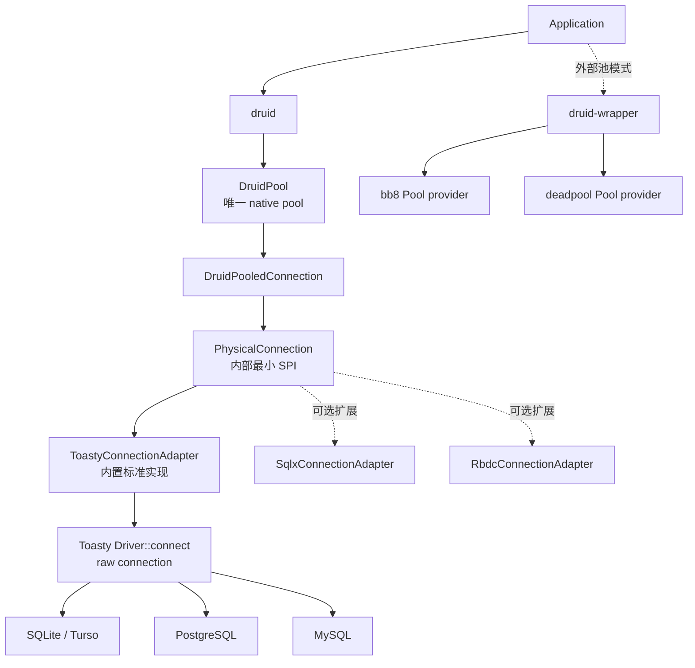

# Toasty 内置数据源标准实现规格

> 日期：2026-08-12  来源：原 docs/druid/Toasty-内置数据源标准实现.md

决策日期：2026-07-28
冻结版本：Toasty `0.9.0`
决策：Toasty 是 `druid-rust` 内置数据源的标准实现；SQLx、RBDC、bb8、
deadpool 等保持为 `druid-wrapper` 扩展。

## 1. 决策含义

"内置标准实现"不是把 Druid 改造成 Toasty ORM，也不是让两个连接池互相嵌套。
它表示：

1. `PhysicalConnection` 仍是 Druid 内部唯一、稳定、且不泄漏第三方类型的 SPI；
2. `druid::toasty` 是 `druid` 内部默认 `PhysicalConnectionFactory` 实现；
3. Adapter 直接调用 Toasty 的 `Driver::connect` 获取一条 raw connection；
4. 不创建 `toasty::Db`，因此 Toasty 自带 pool 不进入 Druid native pool；
5. SQLx/RBDC 是可选 direct adapter；bb8/deadpool 是外部 pool provider，不是
   `DruidPool` 的物理连接工厂。



源码已位于 `crates/druid/src/toasty/`，feature 也由 `druid` 统一暴露。原
`crates/druid-toasty/` 已删除，不形成第四个产品模块或独立发布物。

关键所有权关系只有一条：

```text
DruidPooledConnection
└── PhysicalConnection
    ├── ToastyConnectionAdapter       # 内置、默认、raw connection
    ├── SqlxConnectionAdapter         # wrapper 扩展
    └── RbdcConnectionAdapter         # wrapper 扩展
```

## 2. Toasty 0.9 官方能力结论

| 能力 | Toasty 0.9 结论 | Druid 使用方式 |
| :--- | :--- | :--- |
| Model | `#[derive(toasty::Model)]` 生成 CRUD、查询和关系 API | 可供上层业务使用，不进入 Druid pool SPI |
| 数据库 | SQLite/Turso、PostgreSQL、MySQL、DynamoDB | SQL driver 可接 `PhysicalConnection` |
| Raw SQL | `RawSql` + `RawSqlRet::{None,Infer,Types}` | `exec/fetch` 标准入口 |
| Driver SPI | `Driver`、`Connection`、`Capability` | 内置 Adapter 的真实边界 |
| 连接池 | `toasty::Db` 内部持有 pool | Druid Adapter 禁止使用，避免 pool-in-pool |
| 事务 | commit/rollback、保存点、隔离级别、只读和模式 | 映射到 `PhysicalConnection` 能力 |
| Schema | model schema、`push_schema`、CLI migration | ORM 能力；Druid raw SQL 使用空 app schema |
| Backend capability | placeholder、返回值、schema mutation 等显式能力 | 后续多数据库 capability gate 的依据 |

官方资料：

- [GitHub tokio-rs/toasty](https://github.com/tokio-rs/toasty)
- [Toasty 0.9.0 API](https://docs.rs/toasty/0.9.0/toasty/)
- [Toasty Guide](https://tokio-rs.github.io/toasty/nightly/guide/)
- [Database setup](https://tokio-rs.github.io/toasty/nightly/guide/database-setup.html)
- [Transactions](https://tokio-rs.github.io/toasty/nightly/guide/transactions.html)
- [Schema management](https://tokio-rs.github.io/toasty/nightly/guide/schema-management.html)
- [Raw SQL](https://docs.rs/toasty/0.9.0/toasty/sql/index.html)
- [Capability](https://docs.rs/toasty/0.9.0/toasty/struct.Capability.html)

相关 crates：

| crate | 角色 |
| :--- | :--- |
| `toasty` | 用户 API、连接选择、ORM 执行入口 |
| `toasty-core` | Driver/Connection/Capability/Operation/Schema 核心协议 |
| `toasty-macros` | Model derive |
| `toasty-sql` | SQL lowering、序列化与迁移 SQL |
| `toasty-cli` | schema/migration 命令行 |
| `toasty-driver-sqlite` | SQLite raw driver |
| `toasty-driver-turso` | Turso driver |
| `toasty-driver-postgresql` | PostgreSQL driver |
| `toasty-driver-mysql` | MySQL driver |
| `toasty-driver-dynamodb` | 非 SQL driver；Druid 不启用、不纳入支持范围 |

## 3. 对象级映射

| Java/JDBC 角色 | Druid Rust 对象 | Toasty 对象 | 迁移规则 |
| :--- | :--- | :--- | :--- |
| `DruidDataSource#createPhysicalConnection` | `ToastyConnectionFactory` | `Driver` | 每次创建一条未池化连接 |
| JDBC driver `Connection` | `ToastyConnectionAdapter` | `Box<dyn Connection>` | 不暴露 Toasty 类型 |
| `Connection#prepareStatement` | `ToastyPreparedStatement: PhysicalPreparedStatement` | raw SQL 执行路径 | Druid holder 管逻辑 LRU；物理句柄在 setter 阶段物化并保存 Toasty 参数值 |
| `Statement#executeUpdate` | `ExecResult` | `RawSqlRet::None` / `Rows::Count` | 保留 affected rows；SQLite 补取 last row id |
| `Statement#executeQuery` | `Vec<Row>` | `RawSqlRet::Infer` / record stream | 当前保持 eager Druid contract |
| JDBC transaction | `begin/commit/rollback` | `Transaction` operation | 状态只在真实操作成功后变化 |
| JDBC savepoint | `Savepoint` | Toasty savepoint operation | 名称先做 ASCII identifier 校验 |
| `Connection#isValid` | `ping` | `Connection::ping` / `is_valid` | factory create/validate 双门禁 |
| fatal connection | `ConnectionDiscarded` | `Error::is_connection_lost` | 进入 Druid discard 主链 |

`java.sql.Connection` 是 Java 标准平台接口，不是 Druid 自身对象。Rust 标准库没有
数据库连接标准接口，因此 `PhysicalConnection` 承担最小平台 SPI；Toasty 是该 SPI
的内置标准实现，不能反向污染 Druid 的公共领域对象。

## 4. 语义边界

### 4.1 已落地

| 语义 | 当前实现 |
| :--- | :--- |
| URL driver selection | `ToastyConnectionFactory::new` 使用 Toasty `Connect` |
| 非 SQL driver | 明确拒绝，不把 DynamoDB 冒充 SQL/JDBC |
| raw connection | 直接 `Driver::connect`，无 Toasty pool |
| DDL/DML/query | `RawSql` 真实执行 |
| 参数 | NULL/BOOL/I64/F64/TEXT/BLOB typed binding；Prepared stream/reader/LOB/URL/RowId/null 在物理 setter 阶段转换 |
| 行值 | NULL/整数/浮点/文本/字节映射 |
| generated key | SQLite 同连接读取 `last_insert_rowid()` |
| PreparedStatement | Druid 完整 key/LRU + `ToastyPreparedStatement` 参数槽；Filter 保留原 setter 描述符，execute/batch 不二次读取资源 |
| 事务 | begin/commit/rollback/setAutoCommit |
| 保存点 | anonymous/named/rollback/release |
| 生命周期 | ping/validate/close/discard |
| SQLite isolation | 只接受 JDBC `SERIALIZABLE(8)` |
| SQLite read-only | 明确 unsupported，不只改内存标志 |

### 4.2 必须如实保留的 SQLite 差异

Toasty `RawSqlRet::Infer` 按 SQLite runtime storage class 解码。SQLite 的
`BOOLEAN` 实际存储为 INTEGER，所以 raw query 返回 `Value::Int(0/1)`；只有携带
明确 Toasty model type 的查询才能按 Bool 解码。Druid raw SQL 层不得伪造类型。

`sqlite::memory:` 每次创建连接都会得到独立数据库。Toasty SQLite driver 声明
`max_connections = 1`；Toasty 0.9 的 `db::Connect` wrapper 未向外委托这个值，
`ToastyConnectionFactory` 会从 URL 恢复单连接约束，防止错误配置。

### 4.3 尚未关闭的门禁

| 门禁 | 状态 |
| :--- | :--- |
| `cargo check -p druid --all-features` | DONE：SQLite/PostgreSQL/MySQL/Turso/DynamoDB feature 图编译通过 |
| 物理归并到 `druid/src/toasty`，并由 `druid` 默认 feature 启用 | DONE |
| PostgreSQL 真实 container contract | TODO |
| MySQL 真实 container contract | TODO |
| Turso 真实服务/本地 contract | TODO |
| vendor SQLState/transient/fatal 分类 | TODO |
| PostgreSQL/MySQL generated keys 精确重载 | TODO |
| SQLite DECIMAL/DATE/TIME/TIMESTAMP 强类型参数与结果 | DONE：声明类型恢复 + 真实 SQLite contract |
| SQLite Prepared 资源参数 | DONE：ASCII/Binary/Character/NCharacter/Blob/Clob/NClob/URL/RowId/null，含 setter 错误时点、显式长度、剩余游标与有序 batch |
| SQLx/RBDC Prepared 资源参数 | TODO |
| streaming ResultSet/cancel/timeout/完整 metadata | TODO |
| Toasty ORM model 与 Druid Filter/Stat 事件统一 | TODO |

因此"内置标准实现已建立"不等于多数据库和整个 Java Druid 已迁移完成。

## 5. Feature 与发布边界

feature 全部由唯一 `druid` crate 暴露，`sqlite` 默认启用，其他 driver
按 feature 增量启用：

| feature | Toasty driver | Druid 定位 |
| :--- | :--- | :--- |
| `sqlite`（default） | SQLite | 内置默认、CI 真实门禁 |
| `postgresql` | PostgreSQL | 内置可选，待 container gate |
| `mysql` | MySQL | 内置可选，待 container gate |
| `turso` | Turso | 内置可选，待服务 gate |

DynamoDB 等非 SQL driver 不对外提供 Druid feature；URL 防御性拒绝仍保留。

Toasty 0.9 的 MSRV 是 Rust 1.95。工作区 `rust-version` 升为 1.95，
`rust-toolchain.toml` 使用 1.97.1 执行 fmt/clippy/test/coverage。

## 6. SQLite native library 兼容补丁

Cargo 同一依赖图不能同时链接两个版本的 `libsqlite3-sys`。当前 SQLx 0.8 与
`rusqlite 0.32.1` 都使用 `libsqlite3-sys 0.30.1`，而 Toasty 0.9 官方 SQLite
driver 依赖 `rusqlite 0.40`。为了保留 SQLx 扩展兼容面：

1. `[patch.crates-io]` 指向 `vendor/toasty-driver-sqlite`；
2. vendor 逻辑来自官方 `toasty-driver-sqlite 0.9.0`；
3. 仅把 `rusqlite` 依赖约束改为 API 兼容的 `0.32.1`；
4. 真实 SQLite contract、全扩展回归和 clippy 是补丁门禁；
5. 当 Toasty/SQLx 上游统一 `libsqlite3-sys` 后删除 vendor patch。

该补丁必须作为显式技术债存在，不能藏在 lockfile 中。

## 7. 从《Spring-组件替换约定》继承的组件选择

| 能力 | 选择 | 在 druid-rust 中的落点 |
| :--- | :--- | :--- |
| 主 ORM/数据访问 | Toasty 0.9 | 内置标准 Driver/Connection；上层可用 Model API |
| raw SQL 扩展 | SQLx | `druid-wrapper` 可选 direct adapter |
| Java/MyBatis 风格扩展 | RBDC/Rbatis | `druid-wrapper` 可选 direct adapter |
| 外部连接池 | bb8/deadpool | `Pool` provider；禁止嵌入 `DruidPool` |
| SQL parser/Wall | sqlparser-rs + Druid extension | `druid::sql` |
| 缓存 | Moka | SQL 解析/元数据等缓存；PS LRU 保留 Druid 语义 |
| 日志与追踪 | tracing | Filter/driver/管理链路统一 span |
| 指标 | metrics + Prometheus exporter | `druid::stats`/`druid-admin` |
| 配置序列化 | serde/serde_json/toml | typed config，禁止泄漏第三方配置对象 |
| async runtime | Tokio + async-trait | pool maintenance、driver async SPI |
| 集成测试 | testcontainers | PostgreSQL/MySQL 后续真实门禁 |

选择遵守 Mode A/Mode C：Druid 用 trait 稳定抽象，用 feature/plugin 提供多实现。
第三方具体类型不得出现在 `druid` 公共领域 API 中。

## 8. 验收证据

```bash
cargo test -p druid --test toasty_connection_adapter_test
cargo test -p druid --test sqlite_core_semantics_test
cargo test -p druid-wrapper
cargo test --workspace
cargo clippy --workspace --all-targets --all-features
```

`toasty_connection_adapter_test` 使用真实 SQLite，覆盖：

- factory metadata、create/validate/ping/close；
- DDL、DML、query 和六类 `Value` 参数；
- affected rows 与 `last_insert_rowid()`；
- prepared execute/close；
- Prepared stream/reader/LOB/URL/RowId/null 的 setter 时点物化、query/update/
  generic execute、Filter 描述符与两组 batch 顺序；Java xerial SQLite JShell
  同时作为 binary stream 显式长度、提前 EOF、负长度的行为基准；
- begin/commit/rollback/setAutoCommit；
- named savepoint、rollback-to、release；
- SQLite isolation/read-only 的真实能力边界；
- discard 后拒绝继续执行；
- 真实 SQLite 语法错误映射为结构化 `SqlException`；Toasty 0.9 未公开的
  vendor code/SQLState 保持未知，不按消息猜测；
- 未知 URL scheme 不回退。

2026-07-29 三模块归并后实测结果：

- `cargo test --workspace --all-targets`：518/518 通过；
- Toasty 内置/核心/扩展的 21 个真实 SQLite 用例通过；
- `cargo check -p druid --all-features` 通过，证明全部可选 driver 的
  feature 边界可组合编译；该结果不替代 PostgreSQL/MySQL/Turso 的真实语义门禁；
- `cargo metadata` 只包含 `druid`、`druid-wrapper`、`druid-admin`；
- 普通 clippy 退出码为 0，但仓库既存 pedantic warnings 尚未清零，不能写成
  `-D warnings` 已通过；
- cargo-llvm-cov：Regions 85.92%、Functions 88.48%、Lines 89.25%，距离
  100% 仍是明确开放债务，不能因本切片通过而标记整体迁移完成。
