# Druid 1.2.28 → druid-rust 功能语义完整迁移总路线图

> 本文是迁移执行基线，不是架构借鉴清单。迁移目标是 Druid 1.2.28 的功能语义完整落地到 Rust；实现不要求逐类照抄，但任何合并、拆分、适配或协议替换都必须可追溯、可测试、可验收。

## 1. 冻结基线

| 项目 | 冻结值 | 核验方式 |
| :--- | :--- | :--- |
| Java 源仓库 | `/Users/wandl/workspaces/workspace-github/druid` | 本地 Git + 源码逐调用核验；仓库无 `.codegraph/`，未伪称 CodeGraph 已运行 |
| Java 版本 | `1.2.28` | tag `1.2.28` |
| Java 提交 | `33824c3dec1612711f9bb4e409319bcab2e4cd0e` | `git rev-parse HEAD` |
| Java 主源码 | core 1,644 个 `.java`；全仓主源码 1,719 个 `.java` | `rg --files -g '**/src/main/java/**/*.java'` |
| Rust 源仓库 | `/Users/wandl/workspaces/workspace-github-easy-4-rust/druid-rust` | 本地 Git + 源码/测试/覆盖率核验；仓库无 `.codegraph/` |
| Rust 产品模块 | 仅 `druid`、`druid-admin`、`druid-wrapper` 三个 | workspace member、发布清单与文档导航一致性检查 |
| Rust 迁移批次基线提交 | `194fec5e4351ab562ca1708383e80f320ecc1f83` | 当前连续迁移工作树修改前 `git rev-parse HEAD` |
| Rust 当前规模 | 布局审计扫描 137 个生产对象文件，0 error/0 warning | 2026-07-29 源码扫描；两个仓库均无 `.codegraph/`，未伪称 CodeGraph 已运行 |
| 本批次测试 | Java Prepared/Filter 目标用例 10/10，既有扩展 oracle 100/100；三 crate Rust workspace 534/534；Toasty/SQLx 真实 SQLite、RBDC 严格 SPI、隔离真实 `rbdc-sqlite` 参数绑定、ResultSet 默认能力/物理标量 getter 及 Statement/PreparedStatement 物理 ResultSet 标签贯通均通过 | 2026-07-29 实测 |
| Rust 工具链 | Toasty 0.9 要求 MSRV 1.95；workspace `rust-version=1.95`，默认工具链 1.97.1 | `cargo check --workspace --all-targets` |

基线升级必须新建差异批次：先对 Java 新提交运行 CodeGraph 影响分析，再把
新增或变更对象写入所属模块的对象与语义账本：
[`druid`](./druid/迁移路线图.md)、
[`druid-admin`](./druid-admin/迁移路线图.md) 或
[`druid-wrapper`](./druid-wrapper/迁移路线图.md)。连接层的约束、对象边界和
时序以[连接抽象与驱动适配架构](./连接抽象与驱动适配架构.md)为准。

## 2. “完整迁移”的定义

完成度按语义契约计算，不按 Rust 文件数或代码行数计算：

```text
语义完成率 = 已通过差分验收的语义契约数 / 基线语义契约总数
对象可追溯率 = 已登记 Java 对象数 / Java 基线对象总数
命名合规率 = 通过命名检查的迁移对象数 / 已落地迁移对象数
```

发布 `1.0-semantic-parity` 的硬条件：

1. 语义完成率为 100%，对象可追溯率为 100%。
2. Java 的成功结果、失败类型、状态变化、副作用、统计口径和安全判断均有 Rust 对应契约。
3. 非一对一迁移必须有 `MERGE`、`SPLIT`、`ADAPTER` 或 `PROTOCOL` 决策，并绑定测试。
4. 外部库只能承载实现，不能替代验收。使用 `sqlparser-rs` 仍需逐项证明 Druid 的方言、AST、输出、参数化、Visitor 和 Wall 语义。
5. 不允许以“Java/JDBC/Spring/JMX 特有”为由静默删除能力。应迁移为 Rust 生态中的等价结果；确实无意义的运行时机制需以 ADR 说明其业务结果如何被保留。
6. `todo!()`、`unimplemented!()`、空函数体、固定返回“未实现”均计为未迁移。

## 3. 非一对一迁移的合法形态

| 形态 | 含义 | 示例 | 验收要求 |
| :--- | :--- | :--- | :--- |
| `DIRECT` | 一个 Java 对象对应一个 Rust 对象 | `WallConfig` → `WallConfig` | 名称、字段默认值、方法语义差分通过 |
| `MERGE` | 多个 Java 对象由一个 Rust 枚举/组件承载 | 多个 `Violation` 实现 → `WallViolation` | 每个源对象都有独立枚举分支和用例 |
| `SPLIT` | 一个 Java 对象拆成多个 Rust 组件 | `DruidDataSource` → facade + pool engine + maintenance tasks | 对外行为由 canonical facade 汇总 |
| `ADAPTER` | Java 平台对象映射到 Rust 外部能力 | JDBC Connection → `PhysicalConnection` SPI + Toasty 内置实现 + SQLx/RBDC 扩展 | 真实数据库契约测试，不接受 mock-only |
| `PROTOCOL` | 管理/集成协议替换，业务结果不变 | JMX → OpenMetrics + admin API | 指标、管理动作、权限、错误语义逐项对应 |
| `RUST_ONLY` | Rust 为实现迁移新增的内部对象 | `IdleQueue`、`SqlAstAdapter` | 必须标明承载哪些 Java 语义，不得成为逃逸层 |

`sqlparser-rs`、Tokio、Axum、Prometheus、ArcSwap 都是迁移实现材料，不是“不迁移”的理由。

## 4. 目标架构

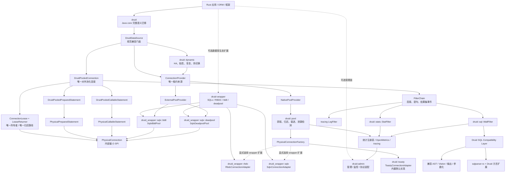

原则是“外部兼容面稳定、内部实现 Rust 化”。`DruidDataSource`、`DruidPooledConnection`、`WallProvider`、`JdbcSqlStat` 等关键迁移对象保留可识别名称；调度器、队列、任务等内部对象可使用更符合 Rust 的名称。`DruidPooledConnection` 是唯一公开连接对象，`PhysicalConnection` 是内部最小 SPI；native pool 与外部池 bridge 只能二选一成为单次租约的 Provider，禁止池中池。详细设计见[连接抽象与驱动适配架构](./连接抽象与驱动适配架构.md)。

这里的“模块”是产品、发布和依赖治理边界，不是 facade 名称。代码只有
`druid`、`druid-admin`、`druid-wrapper` 三个产品 crate：

| 产品模块 | 内部目录 | 归口能力 |
| :--- | :--- | :--- |
| `druid` | `src/core`、`src/pool`、`src/sql`、`src/stats`、`src/dynamic`、`src/toasty` | Java `/core` 全部语义、连接池、SQL/Wall/Stat/HA，以及默认 Toasty 实现 |
| `druid-wrapper` | `src/sqlx`、`src/sqlx/bb8`、`src/sqlx/deadpool`、`src/rbdc` | 对各种数据库操作实现、驱动和外部连接池的封装 |
| `druid-admin` | 按 Java `druid-admin` 对象包组织 | 管理、监控、认证、API 与协议替换 |

原 `druid-core`、`druid-pool`、`druid-sql`、`druid-stats`、
`druid-dynamic`、`druid-toasty`、`druid-sqlx`、`druid-rbdc`、
`druid-sqlx-bb8`、`druid-sqlx-deadpool` 已物理归并并删除。
`cargo metadata` 只返回三个 workspace member。

## 5. 当前基线结论

当前代码不是占位仓库，但也未达到语义闭环。CodeGraph 与源码核验得到以下阻断项：

| ID | 证据 | 影响 | 处置阶段 |
| :--- | :--- | :--- | :--- |
| B-01 | `DruidPool` 转为 `dyn Pool` 时使用空 return callback | `DynamicDataSource` 路径连接不归还，计数泄漏 | P0 |
| B-02 | `run_after_filter` 调用 async future 未 `.await` | 后置 Filter、SQL 统计实际不执行 | P0 |
| B-03 | `fetch()` 绕过 Filter | 查询不经过 Wall/Stat/Log | P0 |
| B-04 | after context 丢失参数、数据源名、开始时间和 fingerprint | 统计与审计数据错误 | P0 |
| B-05 | 三个 adapter 的 `create()` 固定返回“not yet implemented”，且 bb8/deadpool 被误建模为物理连接工厂 | 无真实数据库连接能力，补实现后还可能形成池中池 | P1 |
| B-06 | `min_idle`、`max_lifetime`、`idle_timeout`、`test_on_borrow` 等配置未闭环 | 与 Druid 池行为不一致 | P2 |
| B-07 | 扩容判断与 `total_count.fetch_add` 非原子预留 | 并发时可能突破 `max_active` | P2 |
| B-08 | `WallConfig` 多数字段未被规则引擎读取，`Wall` 未接入 Filter | 配置看似存在但无行为 | P5 |
| B-09 | admin 只有状态对象和 endpoint 字符串，无 Axum Router | 无监控管理面 | P8 |
| B-10 | 工具链固定 Rust 1.75.0 与当前依赖不兼容 | 默认构建不可复现 | P0 |

上表是制定路线图时的阻断基线，保留用于追踪缺陷来源。2026-07-28 当前关闭情况如下：

| 基线项 | 当前 | 证据 |
| :--- | :--- | :--- |
| B-01 | CLOSED | `Pool` 直接返回 canonical `DruidPooledConnection`，已删除空 callback 转换；Dynamic route 归还计数测试通过 |
| B-02 | CLOSED | after future 已显式 `.await` |
| B-03 | CLOSED | fetch 与 exec 共用 Filter before/after 主链 |
| B-04 | CLOSED | before/after 复用同一个 `ExecContext`，保留 params/dataSource/start/fingerprint |
| B-05 | CLOSED（能力矩阵继续 P1） | Toasty 内置 raw adapter 已接通；SQLx/RBDC 归 wrapper direct 扩展；bb8/deadpool 已改为 external `Pool` bridge |
| B-07 | CLOSED | CAS 原子容量预留，32 并发 gated contract 下 `max_open=2` 只创建 2 个物理连接 |
| B-06 | PARTIAL | `initialSize/minIdle/fill`、后台维护、三类 validation、keepAlive 失败回填、removeAbandoned、创建重试/退避、maxWaitThreadCount 及取消安全已接；公平等待、fatalError shrink、活跃租约强制 shutdown 和统一差分仍开放 |
| B-08、B-09 | OPEN | 按原阶段继续迁移，不因连接主干完成而提前关闭 |
| B-10 | CLOSED | Toasty 0.9 将 workspace MSRV 提升到 1.95，`rust-toolchain.toml` 使用 1.97.1；默认工具链可完整检查 |

测试数量不能抵消上述阻断项。测试必须从“覆盖 Rust 自己写出的行为”升级为“以 Java Druid 为 oracle 的差分测试”。

## 6. 分阶段路线图

### P0：迁移治理与当前正确性止血

目标：建立可信基线，并修复会让后续验收失真的基础缺陷。

- 已将 workspace 的产品边界收敛为三个 crate，并把分散实现按职责物理迁入
  `druid/src/*` 与 `druid-wrapper/src/*`。
- 固定可构建 Rust MSRV/lockfile，CI 执行 fmt、clippy、test、doc、audit。
- 修复 B-01～B-04、B-07；把旧 pooled 实现收敛为唯一公开的 `DruidPooledConnection`，归还权固化为内部 `FnOnce`，外部池租约使用 `PhysicalConnectionLease`。
- 建立对象总账、语义契约 ID、命名检查和差分测试目录。
- 为 Java oracle 提供可重复运行的 fixture runner。

出口门禁：workspace 产品 crate 仅剩 `druid`、`druid-admin`、
`druid-wrapper`；不存在用重导出掩盖的过渡子 crate；默认工具链全绿；所有取还连接
路径计数守恒；Filter before/after 对 `exec`、`fetch`、错误路径都执行一次。

### P1：驱动 SPI 与真实数据库适配

目标：把 JDBC 的“获得物理连接并执行数据库操作”迁移为真实 Rust 能力，同时维持 Druid 对外池化连接语义。

- 建立对象安全、异步、最小化的 `PhysicalConnection` SPI，以及 native 专用 `PhysicalConnectionFactory`、统一 `Pool` Provider、external 专用 `PhysicalConnectionLease` 和 `DruidPooledConnection` 内部唯一 returner。
- 在 `druid::toasty` 内实现不携带 pool 的 Toasty 内置标准 raw adapter；不使用
  `toasty::Db`。
- `druid_wrapper::sqlx` 与 `druid_wrapper::rbdc` 提供 direct adapter；
  bb8/deadpool 位于同一 wrapper crate 的内部模块。
- 把 bb8、deadpool 从 `ConnectionFactory` 改为 `ExternalPoolProvider` bridge；同一数据源禁止再叠加 native pool。
- 所有 direct/bridge adapter 完成连接创建或租借、验证、错误分类、状态复位和关闭/归还。
- 对齐 Connection、Statement、PreparedStatement、ResultSet、metadata、LOB 和事务结果语义。
- 建立 PostgreSQL、MySQL、SQLite 容器测试；方言能力扩展时追加对应数据库。

出口门禁：adapter 不含固定“未实现”返回；真实数据库完成 connect/exec/fetch/transaction/cancel/timeout/close 契约；native/bridge 均只返回 `DruidPooledConnection`，且每个租约恰好归还一次。

### P2：连接池生命周期完整迁移

目标：迁移 `DruidDataSource`、`DruidAbstractDataSource`、`DruidConnectionHolder`、`DruidPooledConnection` 的完整状态机。

- 初始化、创建/销毁任务、公平/非公平等待、超时、失败退避、容量预留。
- `min_idle`、`initial_size`、`max_active`、`max_wait`、keepAlive、驱逐和物理寿命。
- borrow/return 校验、rollback、状态 reset、schema 恢复、fatal error、discard。
- removeAbandoned、使用次数、密码版本、PS cache、关闭/禁用/重启/fill。
- vendor checker/sorter 的数据库错误矩阵。

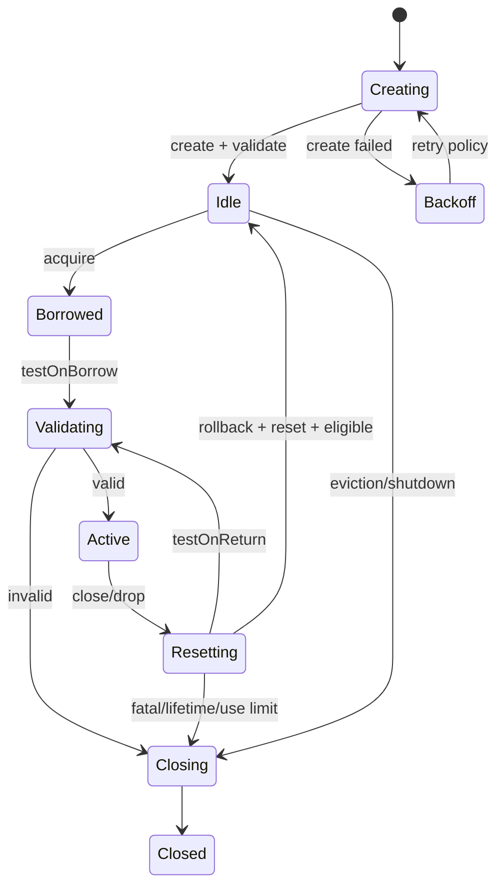

出口门禁：并发压力下容量不越界、无丢连接、无双重归还；Java pool fixture 的状态和计数差分通过。

#### P2-R1：连接创建与回收语义切片（2026-07-28）

本切片不是 P2 整体完成，只关闭以下可独立验收的主链：

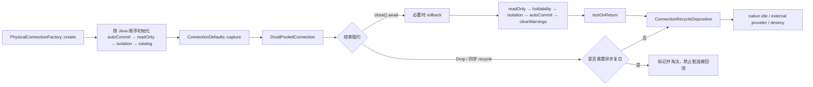

已验证：

- Java 已执行并通过 10 个创建/回收目标用例；PreparedStatement 切片又执行
  `DruidConnectionHolderTest4`、两组 `PreparedStatementKeyTest`、
  `PSCacheTest3`、`DruidDataSourceTest_clearCache`，共 21 个测试方法，作为
  缓存键、懒初始化、access-order LRU 与清理语义 oracle；
- Rust `recycle_semantics_test` 12 个契约覆盖初始化顺序、ODPS 跳过 autoCommit、初始化失败清理、rollback/reset 顺序、readOnly 分支、回收错误计数、`testOnReturn`、最大使用次数、隔离级别保留、脏连接 Drop、canonical holder 往返和 MySQL-family schema 策略；
- Rust `druid_connection_holder_test` 6 个契约验证物理连接所有权、默认状态复位、时间/useCount/版本、schema 恢复、discard 与 take-once；`maintenance_semantics_test` 5 个契约验证 minIdle 边界、Java phyTimeout、归还超时淘汰、keepAlive 顺序及失败计数；PreparedStatement 新增 core 6 个缓存契约、pool 6 个集成契约（含跨租约拒绝）、SQLx 2 个真实 SQLite prepared 契约及 RBDC prepared token 契约；
- bb8/deadpool 各增加显式事务 close 复用与脏事务 Drop 替换契约，真实 SQLite adapter 下共 4 个 bridge 回收用例通过；
- 显式异步 `close` 对齐 Java 主链；Rust `Drop` 无法 `.await`，因此脏连接或要求 return validation 的连接直接淘汰，这是防止事务状态泄漏的 Rust 安全扩展。

仍未关闭：CallableStatement 的完整 JDBC 方法族和真实驱动能力、JDBC `setXxx`
参数状态与 batch、Oracle implicit cache 驱动调用、statement
trace/listener/result-set 清理、密码/配置版本动态失效、fatal sorter 全矩阵、
后台 creator/destroy task、keepAlive 失败后的 minIdle 回填、removeAbandoned、
受监管异步销毁与 shutdown 排空。CallableStatement 已完成的标量切片见
P2-R4，不能据此把整个对象标为完成。

#### P2-R3：PreparedStatement cache 主语义切片（2026-07-28）

本切片把缓存归属固定在 canonical holder 内，而不是让 adapter 或公开连接再建一层池：

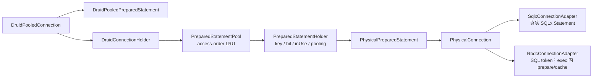

已关闭的主分支包括：九种 Java method type 与六种 `prepareStatement` key
构造、全部 equality 字段、非共享 in-use 返回、共享复用、hit/miss、惰性缓存创建、
access-order LRU、容量淘汰、clear、MySQL schema 变化清 cache、执行异常移除、
fetch row peak 以及数据源级 prepared/cache 统计。SQLx SQLite 已直接通过真实
`Statement::query()` 执行已 prepare 句柄；RBDC 因公开 SPI 在 `exec` 内 prepare，
使用完整 Druid key 区分的 SQL token。

本切片状态仍是 `PARTIAL`：`prepareCall` 三个对外入口及标量 Callable 子集已由
P2-R4 接通；普通 PreparedStatement 的参数 setter/batch、statement 属性恢复、
result-set trace、statement event listener、Oracle implicit cache 的真实驱动
enter/exit 以及 PostgreSQL/MySQL 真实数据库矩阵尚未完成。

#### P2-R4：CallableStatement 标量语义切片（2026-07-28）

本切片按“Druid 池化对象与驱动能力分层”迁移，不把 SQLx/RBDC 冒充成 JDBC：

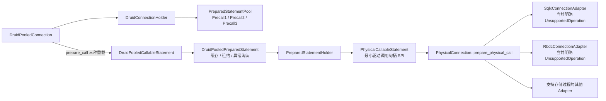

已迁移：

- `prepareCall(String)`、`prepareCall(String,int,int,int)`、
  `prepareCall(String,int,int)` 分别使用 `Precall1/2/3` 完整缓存键；
- `DruidPooledCallableStatement` 复用 prepared 的逻辑关闭、连接租约、缓存命中、
  异常删除、执行/查询和统计；
- 六种 `registerOutParameter` 重载，以及按索引/名称读取标量
  `object/string/boolean/byte/short/int/long/float/double/bytes`、`wasNull`；
- Java 116 个 Callable 公开声明已冻结为构造器 + 115 个方法；Rust 115 个同语义
  方法入口已闭合，另有 5 个 Rust 生命周期/扩展方法；真实 driver 证据仍开放；
- `CallableInputParameter` 保留命名 IN 的具体 setter 身份，`setNull` 的
  `sqlType/typeName` 与 `setObject` 的 `targetSqlType/scale` 不再丢失；
- 命名 IN 参数的 `null/boolean/byte/short/int/long/float/double/string/
  nstring/bytes/object` 标量设置；
- BigDecimal 使用 `bigdecimal::BigDecimal` 保留任意精度与 scale；Date/Time/
  Timestamp 使用 `chrono` 强类型，并以 `CallableCalendarArgument` 区分无
  Calendar 重载、显式 null 和实际时区标识；
- `CallableOutputValue` 保留标量、Decimal、Date、Time、Timestamp、Blob、Clob、
  NClob 与字符 Reader 的返回类型，不用 String/Bytes 冒充；
- Java `PoolableCallableStatementTest` 与 `ConnectionTest4` 共 101/101 通过；
  Rust core 2/2 与 pool 2/2 通过三种 key、委托、缓存复用、强类型转换、
  Calendar 调用账本、错误淘汰和非 callable 句柄拒绝。

新增 Blob 资源切片以 `JdbcBlob + PhysicalBlob` 表达完整 11 方法 SPI，
`JdbcInputStream/JdbcOutputStream` 保留共享游标和关闭状态；5 个 Callable Blob
入口区分对象/流/null/未指定长度/显式 long，池化层不预读流。该切片通过 Java
101/101、Rust core Blob 2/2、pool Callable 2/2；SQLite 真实 BLOB 路径通过但
没有存储过程，因此仍不是 Callable E7。

新增 Clob/NClob/字符流资源切片以 `JdbcClob + PhysicalClob`、
`JdbcNClob + PhysicalNClob`、`JdbcReader/JdbcWriter` 表达平台资源，
`JavaString` 以 UTF-16 code unit 无损保存 Java String。19 个 Callable 入口
保留对象/Reader/null、index/name 以及无长度/`int`/`long` 长度重载；池化层
不预读 Reader，负长度不改写。`PhysicalClob` 的 13 个 JDBC 操作、Reader/
Writer 共享游标或关闭状态和异常路径均有 Rust 契约测试；Java 101/101、Rust
core 2/2、pool 2/2 通过，但 SQLite 无存储过程，因此仍不是 Callable E7。

对象整体仍为 `PARTIAL`，因为 Java 对象还包含 URL、Ref/Array、
RowId/SQLXML、其余二进制流、map/typed `getObject`、ResultSet
包装/trace、unwrap 等完整方法族；SQLx 与当前 RBDC 公共接口也没有
统一 CallableStatement 标准，两个 Adapter 必须继续显式返回
`UnsupportedOperation`，直到具体数据库驱动提供真实且通过契约测试的实现。

### P3：Filter、Proxy 与执行事件模型

目标：迁移 Druid FilterChain 的职责链语义，而非仅保留两个粗粒度 hook。

- 连接、statement、prepared/callable statement、result set、LOB、metadata 事件。
- Filter 初始化、销毁、排序、别名加载、短路、异常传播和反向 after 顺序。
- Proxy 属性、参数、执行类型、事务信息在 async context 中完整传播。
- 迁移 ConfigFilter、LogFilter、EncodingConvertFilter 的业务结果；实现方式可为 SecretProvider、tracing layer、driver codec。

出口门禁：每个 Java Filter hook 在对象账本中有事件映射；顺序、短路、异常、上下文差分通过。

### P4：SQL 内核与方言兼容层

目标：完整迁移 Druid SQL 的对外语义。`sqlparser-rs` 作为内核之一，不作为范围豁免。

- `DbType`、Lexer token/位置/注释、ParserFeature、多语句与 EOF 规则。
- `SQLStatementParser`、AST 类型族、Parent/Attribute 元数据、clone/equality。
- Visitor、output visitor、format、parameterize、restore、fingerprint、PagerUtils。
- schema repository、表/列解析、SQL transform/builder。
- 对 Druid 1.2.28 支持的每个方言建立能力矩阵：原生支持、扩展 parser、兼容 AST、需 fork 四种落点。

出口门禁：Druid SQL 测试语料按方言差分；parse→AST→output、parameterize、visitor 结果达到 100% 已登记契约。

### P5：Wall 防火墙

目标：在 P4 的兼容 AST 上迁移 WallProvider/Visitor/Filter 全部安全语义。

- 所有 WallConfig 默认值、allow/deny、恒真条件、变量、函数、schema、tenant、白名单。
- 各数据库 WallProvider、SPI 注册、缓存、统计、异常码、log/throw 策略。
- WallFilter 接入所有 SQL 执行入口，包括 batch、fetch、prepared 和错误路径。

出口门禁：每个 WallConfig 字段至少有开/关两组行为测试；Java/Rust 对同一 SQL 的放行、拒绝、错误码和统计一致。

### P6：统计、追踪与日志

目标：迁移 `Jdbc*Stat`、StatFilter、DruidStatManager 的统计口径。

- 执行次数/错误/运行中/并发峰值、耗时分布、慢 SQL、更新行/读取行、事务。
- SQL 参数化合并、最大值 CAS、reset、快照与排序。
- JMX 管理结果映射为 OpenMetrics、admin API 和 tracing；保留指标语义及 reset 操作。

出口门禁：固定时钟与并发场景下 Java/Rust 快照逐字段一致；高并发不丢计数。

### P7：HA、动态数据源与恢复

目标：迁移 HighAvailableDataSource 及节点选择、粘性、验证和恢复语义。

- named/random/sticky selector、读写路由、故障摘除、恢复探测。
- ZooKeeper/File node listener 的业务结果迁移为可插拔 Registry/Watcher SPI。
- 热切换时事务粘性、旧池排空、配置版本和回滚。

出口门禁：故障注入下无跨事务切换、无连接泄漏；节点事件和选择序列可重放。

### P8：管理、监控与框架集成

目标：迁移 support、starter、admin 模块提供的运维结果。

- Axum Router、静态资源、datasource/sql/wall/web/session API、认证和 allow/deny IP。
- Spring Boot starter 的配置绑定/自动装配结果迁移为 Rust config + feature + layer。
- Servlet/WebStatFilter 的请求、URI、session 统计迁移为 Tower middleware。
- JNDI/FactoryBean/MBean 映射为显式 builder、registry、admin protocol。

出口门禁：端点 schema、权限、reset 动作和指标与 Java 基线对照；不得只有 endpoint 名称。

### P9：XA、分布式事务与高级兼容

目标：迁移 XA/两阶段提交的行为，不因 Java API 形态不同而删除。

- `DruidXADataSource`、XAConnection/XAResource 状态机。
- Rust TransactionManager SPI 与数据库适配器能力探测。
- prepare/commit/rollback/recover、heuristic error、超时和幂等。

出口门禁：支持适配器完成 2PC 故障注入；不支持的数据库明确返回能力错误而非静默降级。

### P10：全量差分、性能与生产发布

- 对象总账和语义契约 100% 关闭。
- 混沌测试、loom 并发模型、长稳、泄漏、背压、取消安全。
- 与 Java Druid 同配置的吞吐、P99、内存和连接恢复基准。
- SemVer、迁移指南、兼容矩阵、SLO、告警、回滚和发布签名。

出口门禁：`1.0-semantic-parity` 发布检查全部通过。

## 7. 阶段依赖

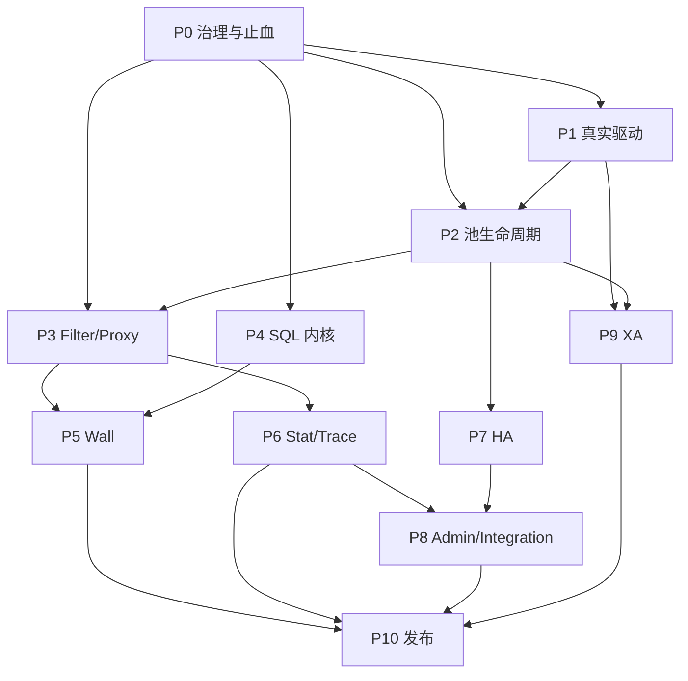

P4 可以与 P1/P2 并行，但 Wall 必须等待 SQL 兼容层稳定；P10 不接受以时间换范围。

## 8. 阶段目标文件与工作量明细

以下表格保留原始 S1～S8 计划的文件粒度和工作量，用于排期参考；名称与范围已按完整语义迁移修订。工作量是初始估算，P0 完成差分语料和对象总账后必须重新估算，不能以估算到期为理由缩减范围。

### 8.1 Core SPI 与兼容类型（原 S1，初估 3 天）

| Rust 文件 | Java 来源 | 当前证据 | 修订目标 | 原估算 |
| :--- | :--- | :--- | :--- | :---: |
| `physical_connection.rs` | `java.sql.Connection` 平台能力映射 | 当前为宽泛 `connection.rs`/`Connection` trait，PARTIAL | 改为内部对象安全最小 SPI；补齐状态、事务、metadata、cancel | 0.5 天 |
| `driver.rs` | `java.sql.Driver`、`DruidDriver` | 已有 trait，adapter 未连通 | 完成 driver registry 与真实连接 | 0.25 天 |
| `pool.rs` | `javax.sql.DataSource`、`ManagedDataSource` | 已有 `Pool` trait，归还路径有缺陷 | 保留基础 SPI；canonical facade 与 pool engine 都归 `druid` 内部 | 0.5 天 |
| `druid_connection_holder.rs` | `DruidConnectionHolder` | canonical 对象已真实持有物理连接、默认状态、时间、useCount、schema 策略、密码版本快照和惰性 `PreparedStatementPool`；旧 `ConnectionHolder` 仅兼容重导出 | 继续迁移 listener/trace、连接变量、动态版本失效及 callable/result-set 协作 | 0.5 天 |
| `druid_pooled_connection.rs` | `DruidPooledConnection` | 唯一实现并独占 `DruidConnectionHolder`；显式 close、prepare/cache/Wrapper、受监管 native 脏 Drop 及 23 条物理连接错误路径的 sorter→fatal→holder/物理 Adapter discard 已接通 | 继续迁移 Statement 全操作、listener/trace/统计与 external shutdown | 0.5 天 |
| `physical_connection_lease.rs` + `ConnectionRecycleDisposition` + `DruidPooledConnection` 内部 returner | `DruidPooledConnection.close/recycle` 所有权语义 | exactly-once、显式异步回收、脏 Drop 淘汰及每池 `ConnectionCloseWorker` 已接 | 补 active lease 强制 shutdown 和 external 真实驱动矩阵 | 0.5 天 |
| `connection_provider.rs` | `DruidDataSource.getConnection` 底层来源 | 当前 native pool/adapter 边界混杂 | 统一 native/bridge 获取入口，禁止池中池 | 0.25 天 |
| `filter.rs` | `Filter` | 已拆成三个 trait | 补齐 100+ hook 的事件映射 | 0.5 天 |
| `filter_chain.rs`、`filter_chain_impl.rs` | `FilterChain`、`FilterChainImpl` | 只有简化 chain | 分文件实现动态游标和反向 after | 0.5 天 |
| `physical_connection_factory.rs` | 物理连接创建 | canonical trait 与 SQLx/RBDC 实现已存在 | 仅服务 native pool；继续补 inventory/registry | 0.25 天 |
| `error.rs` | SQLException 与 Druid 异常层级 | 已有 `DruidError` | 补齐错误码、source 和 context | 0.25 天 |
| `value.rs`、`jdbc_parameter.rs` | JDBC 类型与参数对象 | 只有通用 `Value` | 参数类型、null、LOB、OUT 参数 | 0.25 天 |
| `pool_state.rs` | MBean/Stat 快照 | 已有简化快照 | 字段逐项对齐 | 0.25 天 |
| `config.rs` | `DruidAbstractDataSource` 配置 | 字段子集 | 默认值、别名、校验全量对齐 | 0.25 天 |
| `exception_sorter/*.rs` | `ExceptionSorter` vendor 对象 | trait + `SqlException` + Java 全部 11 个 vendor/abstract 对象已独立实现；Java vendor 23/23、Oracle 异常全族 53/53、Rust sorter 10/10、全 Connection 路径及真实 SQLite fatal-discard 已验证 | sorter 对象与已公开 Connection 操作 DONE；继续补 Statement 全操作、listener/统计和多数据库 Adapter 字段矩阵 | 0.25 天 |
| `valid_connection_checker/*.rs` | checker 对象族 | 只有 Ping checker | vendor checker 全量迁移 | 0.25 天 |
| `wrapper_adapter.rs`、`poolable_wrapper.rs` | `WrapperAdapter`、`PoolableWrapper` | 两个 canonical 对象已独立实现，null/self/raw/statement/proxy 委托顺序通过 Java/Rust 差分，真实 SQLite 可解包 `PhysicalConnection` 与 SQLx Adapter | 对象语义 DONE；生产 `WrapperProxy/Impl` 仍按独立账目迁移 | 0.25 天 |

原验收“编译通过 + 每个 trait 一个 mock”保留为最低门槛，修订后的出口是：公开方法契约、错误和状态均完成 Java 差分。

### 8.2 Native Pool 调度器（原 S2，初估 5 天）

| Rust 文件 | Java 来源 | 当前证据 | 修订目标 | 原估算 |
| :--- | :--- | :--- | :--- | :---: |
| `druid_data_source.rs` | `DruidDataSource` | 当前只有 `DruidPool` | canonical facade 汇总全部公开行为 | 1 天 |
| `pool_inner.rs` | holder 数组、pooling/active 计数 | 已有队列和基础计数 | 原子容量、等待公平性、取消安全 | 1 天 |
| `druid_data_source_builder.rs` | factory + properties + setter | 当前有两个 builder | 去重、属性兼容和校验 | 0.5 天 |
| `destroy_connection_task.rs` | `DestroyConnectionThread/Task` | 无 | 驱逐、keepAlive、minIdle、关闭 | 0.5 天 |
| `create_connection_task.rs` | `CreateConnectionThread/Task` | 无 | 创建、退避、failFast、补池 | 0.5 天 |
| `remove_abandoned_task.rs` | `removeAbandoned` | 无 | 活跃连接追踪、超时与栈 | 0.5 天 |
| `prepared_statement_pool.rs` | `PreparedStatementPool` | 已实现 access-order LRU、容量、in-use/share、清理和统计并通过 Java `PSCacheTest3` 等价序列 | 补 Oracle 驱动隐式缓存、listener/trace 和并发/真实数据库矩阵 | 0.5 天 |
| `idle_queue.rs` | `DruidConnectionHolder[]` | 逻辑内嵌 `VecDeque` | 独立内部队列，验证顺序与时间 | 0.5 天 |

原验收“10,000 次 acquire/release 无泄漏”继续保留，并增加 loom 容量守恒、异步取消、不同 `Pool` 调用入口和长稳验收。

### 8.3 SQL 兼容层与 Wall（原 S3，原估 5 天，修订后需拆分重估）

| Rust 文件/目录 | Java 来源 | 修订目标 | 原估算 |
| :--- | :--- | :--- | :---: |
| `sql_utils.rs` | `SQLUtils` | 保留 parse/format/parameterize 公共入口 | 0.5 天 |
| `parser/` | `SQLParserUtils`、parser 对象族 | sqlparser-rs adapter + 方言扩展/fork | 原 0.5 天，需重估 |
| `ast/` | `SQLObject`、expr/statement 对象族 | compatibility AST 和 metadata | 原 1 天，需重估 |
| `visitor/` | Visitor、output、parameterized visitor | 完整 visit/endVisit/output 语义 | 新增范围 |
| `repository/`、`builder/` | SchemaRepository、SQLBuilder | schema resolve 与 AST transform | 新增范围 |
| `wall_config.rs` | `WallConfig` | 全字段默认值与行为接线 | 0.5 天 |
| `wall_provider.rs` | `WallProvider` | cache、SPI、统计、white/black list | 1 天 |
| `wall_filter.rs` | `WallFilter` | 接入 exec/fetch/batch/prepared 全路径 | 新增范围 |
| `wall_violation.rs` | Violation 对象族 | 每个源对象独立 variant/错误码 | 0.25 天 |
| `wall_rule/` | WallVisitor/Utils 与方言规则 | 各配置开关和方言 visitor | 0.5 天 |
| `parameterize.rs` | `SQLASTParameterizedVisitor` | AST 参数化、参数列表、merge | 0.5 天 |
| `fingerprint.rs` | `JdbcSqlStat` SQL key | 与 Java key 差分 | 0.25 天 |
| `injection_detector.rs` | Wall 注入规则 | AST 级注入检测 | 0.5 天 |

原 S3 只验收三条 DDL/DML 规则，现保留为冒烟用例；阶段完成必须覆盖 SQL 1,268 个对象账目与全部 Wall 配置契约。

### 8.4 Stat 与可观测性（原 S4，初估 4 天）

| Rust 文件 | Java 来源 | 当前证据 | 修订目标 | 原估算 |
| :--- | :--- | :--- | :--- | :---: |
| `jdbc_data_source_stat.rs` | `JdbcDataSourceStat` | `StatsCollector` 子集 | canonical 数据源统计 | 1 天 |
| `jdbc_sql_stat.rs` | `JdbcSqlStat` | `MergedSqlStat` 子集 | 全字段、running、rows、事务、reset | 1 天 |
| `histogram.rs` | hold/execute histogram | 无 | 桶边界和快照 | 0.5 天 |
| `druid_stat_service.rs` | `DruidStatService` | 无 | admin JSON + OpenMetrics | 0.5 天 |
| `slow_sql.rs` | `slowSqlMillis` | collector 中有阈值 | 参数、错误和日志语义 | 0.5 天 |
| `merge_stat_filter.rs` | `MergeStatFilter` | 独立对象强制 merge，普通 `StatFilter` 保留 raw SQL；alias 已进入生产装配，状态 `IMPLEMENTED_UNVERIFIED` | 最终统一 Java 对照与真实 SQLite 验证 | 0.5 天 |
| `jdbc_connection_stat.rs`、`jdbc_statement_stat.rs`、`jdbc_result_set_stat.rs` | 分层统计 | 无 | 分层计数与快照 | 新增范围 |

### 8.5 Dynamic/HA（原 S5，初估 3 天）

| Rust 文件 | Java 来源 | 当前证据 | 修订目标 | 原估算 |
| :--- | :--- | :--- | :--- | :---: |
| `high_available_data_source.rs` | `HighAvailableDataSource` | `DynamicDataSource` 子集 | canonical facade、排空和回滚 | 1 天 |
| `data_source_group.rs` | HA 节点组 | 已有 | 版本、健康与连接排空 | 0.5 天 |
| `data_source_selector.rs` | selector SPI | 当前 `LoadBalancer` | canonical trait | 0.25 天 |
| `random_data_source_selector.rs` | 随机选择 | 当前 `RandomBalancer` | 健康、权重和恢复 | 0.5 天 |
| `round_robin_data_source_selector.rs` | Rust 扩展 | 已有 round-robin | 明确 RUST_ONLY | 0.25 天 |
| `sticky_random_data_source_selector.rs` | 粘性随机 | 无 | task-local 事务粘性 | 0.25 天 |
| `registry/`、`pool_updater.rs` | NodeListener/PoolUpdater | 无 | watcher、热更新与回滚 | 0.5 天 |

原“切换期间 1,000 RPS 错误率 < 1%”保留，并增加事务不跨节点、旧池排空和故障恢复事件序列。

### 8.6 Adapter（原 S6，保留原估算并按模式重估）

| 当前模块内目录 | 已删除的原 crate | 模式 | Java 语义 | 当前证据 | 后续处置 |
| :--- | :--- | :--- | :--- | :--- | :--- |
| `druid-wrapper/src/sqlx` | `druid-sqlx` | Native direct | Driver/Connection/Statement/ResultSet | SQLite 真实 connect/exec/fetch/transaction/savepoint 通过 | 补 PostgreSQL/MySQL、cancel/metadata/LOB |
| `druid-wrapper/src/rbdc` | `druid-rbdc` | Native direct | Driver/Connection/Statement/ResultSet | 已实现真实 RBDC trait adapter/factory；契约测试通过 | 补真实数据库 driver 矩阵 |
| `druid-wrapper/src/sqlx/deadpool` | `druid-sqlx-deadpool` | External bridge | 外部池租约兼容 | `SqlxDeadpoolPool` 直接实现 core `Pool`，Object 归还 deadpool | 补 broken lease/状态映射 |
| `druid-wrapper/src/sqlx/bb8` | `druid-sqlx-bb8` | External bridge | 外部池租约兼容 | `SqlxBb8Pool` 直接实现 core `Pool`，owned lease 归还 bb8 | 补 broken lease/状态映射 |

以上四组实现都属于唯一 `druid-wrapper`，不是四个产品模块。原验收 Postgres
`SELECT 1` 和 Wall 拦截保留，但所有 adapter 都要完成真实数据库矩阵，不能只验收
任意一个。direct adapter 执行 `PhysicalConnectionContract`；bridge adapter 执行
`ConnectionProviderContract` 和 exactly-once return，不得把外部 pool 对象塞入
native idle queue。

### 8.7 Admin 与集成（原 S7，初估 3 天）

| Rust 文件 | Java 来源 | 当前证据 | 修订目标 | 原估算 |
| :--- | :--- | :--- | :--- | :---: |
| `router.rs` | `StatViewServlet` URL 映射 | 无 Router | Axum Router、认证和 IP 规则 | 0.5 天 |
| `api_datasource.rs` | datasource JSON | 无 | schema 与 reset 动作 | 0.5 天 |
| `api_sql.rs` | SQL top/slow JSON | 无 | 查询、排序和分页 | 0.5 天 |
| `api_wall.rs` | Wall JSON | 无 | provider/stat/config | 0.25 天 |
| `api_active.rs` | active connection JSON | 无 | 连接信息和脱敏 | 0.25 天 |
| `prom_exporter.rs` | JMX/StatService 指标 | 无 | OpenMetrics 字段映射 | 0.5 天 |
| `index_html.rs` | `ResourceServlet` | 无 | 静态资源和安全头 | 0.5 天 |
| `web_stat_layer.rs` | `WebStatFilter` | 无 | URI/session/request 统计 | 新增范围 |
| `starter_config.rs` | Spring starter 配置 | 无 | serde 配置、features 与自动装配结果 | 新增范围 |

### 8.8 文档与注释（原 S8，初估 2 天）

- 所有对象头部中文 doc 注释，包含 Java FQCN、职责和映射形态。
- 所有公开方法保留 Java Javadoc 语义并写明参数、返回和错误。
- `lib.rs/mod.rs` 只做模块文档、声明和重导出。
- README、API、配置、错误、指标和兼容矩阵同步更新。
- 四份迁移文档由 CI 校验对象路径、契约 ID 和状态。

## 9. 工程、文件和测试规范

### 9.1 命名规则

| 项目 | 规范 |
| :--- | :--- |
| 目录/文件名 | snake_case，如 `druid_data_source.rs`、`wall_config.rs` |
| 直接迁移类型 | PascalCase 且保留 canonical 名，如 `DruidDataSource` |
| Rust 内部类型 | PascalCase，可使用 `PoolInner`、`IdleQueue` |
| 方法名 | snake_case，如 `get_connection`、`check_valid` |
| 参数名 | 与 Java 语义一致并转 snake_case，如 `max_active` |

### 9.2 文件模板

```rust
//! 连接池公开门面。
//!
//! 对应 Java: com.alibaba.druid.pool.DruidDataSource

/// Druid 数据源公开门面。
///
/// 负责初始化、获取/归还、维护、统计和关闭连接池。
/// 对应 Java: com.alibaba.druid.pool.DruidDataSource
pub struct DruidDataSource {
    /// Rust 化的内部调度引擎。
    engine: DruidPool,
}

impl DruidDataSource {
    /// 获取一个池化连接。
    ///
    /// 对应 Java: DruidDataSource#getConnection。
    pub async fn get_connection(&self) -> Result<DruidPooledConnection, DruidError> {
        self.engine.get_connection().await
    }
}
```

### 9.3 测试规范

- 保留原规范：每个核心 trait 至少一个 mock 实现测试。
- 保留原冒烟：Wall 覆盖 DROP/TRUNCATE/UPDATE/DELETE 无 WHERE。
- 保留原压力：池调度器覆盖 10,000 次 acquire/release。
- 保留原集成：适配器至少覆盖真实 PostgreSQL；修订为所有受支持 adapter 均覆盖。
- 新增 Java oracle：任何 `DONE/PASS` 必须有 Druid 1.2.28 差分证据。
- 新增并发与取消：loom、压力、长稳和故障注入。

## 10. SQL 迁移策略：保留原选型，修正范围结论

原文选择 `sqlparser-rs` 的技术方向保留，但“SQL parser 不移植”的结论废止。正确口径是：使用 `sqlparser-rs` 作为解析内核，对 Druid SQL 的公共 API 和语义做兼容迁移。

| 维度 | Druid SQL parser | sqlparser-rs | druid-rust 迁移责任 |
| :--- | :--- | :--- | :--- |
| 文件/对象 | 1,268 个 Java 文件 | 单一 Rust crate | 每个 Java 对象登记到 type/variant/adapter |
| 方言 | Druid 1.2.28 方言集合 | 上游支持子集 | 缺失方言扩展或 fork，禁止静默 Generic |
| AST | 72 expr + 283 statement 等 | enum AST | compatibility AST/metadata 保留源语义 |
| Visitor | visit/endVisit/output/parameterize | 上游遍历能力不同 | 自建兼容 Visitor |
| schema/builder | Druid repository/builder | 不完整 | 单独迁移，不能删掉 |

### 10.1 原映射关系的修订

| Druid Java SQL | 原计划 | 修订后的迁移落点 |
| :--- | :--- | :--- |
| `SQLStatementParser.parseStatement()` | `Parser::parse_sql()` | `SqlStatementParser` facade → sqlparser/扩展 |
| `SQLExprParser` | 不暴露 | `SqlExprParser` compatibility facade |
| `SQLASTVisitor.visit(stmt)` | 遍历 `Statement` | `SqlAstVisitor`，保持 visit/endVisit |
| `SQLASTOutputVisitor` | “不需要” | `SqlAstOutputVisitor`，对齐格式化输出 |
| `SchemaStatVisitor` | “不实现” | `SchemaStatVisitor`/repository 迁移 |
| `SQLBuilder` | “不实现” | AST builder/transform 模块 |
| `ExportParameterVisitor` | `Parameterizer` | compatibility parameterizer + 参数序列 |
| `WallProvider.check(sql)` | `Wall::check` | `WallProvider` facade + 方言 visitor |

### 10.2 方言能力分级

| 级别 | 条件 | 处理 |
| :--- | :--- | :--- |
| L1 原生等价 | 上游 AST/输出与 Java 差分一致 | 直接 adapter |
| L2 可扩展 | 上游允许 dialect/parser hook | 扩展实现 |
| L3 需兼容 AST | 上游 AST 表达不足 | sidecar/compatibility node |
| L4 需 fork | token/parser 无扩展点 | 维护受控 fork |

## 11. Filter 迁移策略：保留事件明细，不再假定两个 hook 足够

原文将 100+ hook 精简为 before/after 的方向保留为内部抽象，但所有 JDBC 事件必须显式映射。

| Druid Java hook | Rust 事件/方法 | 当前 | 完成条件 |
| :--- | :--- | :--- | :--- |
| `connection_prepareStatement` | `StatementEvent::PrepareStatement` + before | 事件存在，接线不全 | SQL/参数/连接身份完整 |
| `statement_executeQuery` | before + driver + after | `exec` 部分存在 | after 必须 await 且 exactly-once |
| `resultSet_next/close` | `ResultSetEvent` | enum 存在，未接驱动 | 行数和持有时间统计 |
| `connection_setAutoCommit` | `ConnectionEvent::SetAutoCommit` | enum 存在 | 代理状态与 Filter 顺序 |
| `connection_commit/rollback` | connection event | enum 存在 | 事务状态和错误 |
| lifecycle `init/destroy` | async lifecycle | 默认方法存在 | manager 顺序和错误 |

### 11.1 内置 Filter 保留清单

| Java Filter | Rust 目标 | 当前 |
| :--- | :--- | :--- |
| `StatFilter` | `druid_stats::StatFilter` | PARTIAL：当前已接 execute/update/batch/事务/ResultSet 链；pool/physical/LOB 等 hook 待补 |
| `WallFilter` | `druid_sql::WallFilter` | PARTIAL：独立对象和内置 alias 工厂已落位；完整 hook/配置/方言待补 |
| `LogFilter` / Java 日志框架 alias / MBean 合同 | tracing-backed `LogFilter` | PARTIAL：Java backend 类名仅作配置 alias，MBean 合同合并为管理 API；不在 Rust 复刻 Log4j/SLF4J；proxy id、结果列、动态 level 与 executable SQL 精确格式待补 |
| `CounterFilter` | 不迁移 | NOT_IN_JAVA_PRODUCTION_BASELINE：Java 仅存在同名测试，实际测试 `StatFilter` |
| `MergeStatFilter` | 独立 canonical 对象 | IMPLEMENTED_UNVERIFIED：强制 merge 与 alias 已落位，最终统一验证待做 |
| `ConfigFilter` | `ConfigFilter` + `SecretProvider` | MISSING |
| `EncodingConvertFilter` | driver codec filter | PARTIAL/IMPLEMENTED_UNVERIFIED：对象/结果转换已落位，SQL/参数生产接线待补 |
| `MySQL8DateTimeSqlTypeFilter` | MySQL adapter filter | PARTIAL/IMPLEMENTED_UNVERIFIED：值/metadata 与 alias 工厂已落位，真实 MySQL 8 fixture 待补 |

## 12. 每阶段统一交付物

每个阶段必须同时提交：

1. 对象表状态变更，包含 Java FQCN、Rust 类型/文件、映射形态和 ADR。
2. 语义契约及 Java fixture、Rust 测试、差分报告。
3. 中文对象/公开方法 doc 注释，注明 Java 来源。
4. API/配置/错误/指标兼容说明。
5. 性能与并发证据；涉及安全规则时增加拒绝用例。
6. CodeGraph 影响分析和无孤立公开对象检查。

## 13. 风险与控制

| 风险 | 控制 |
| :--- | :--- |
| `sqlparser-rs` 方言覆盖不足 | 建立逐方言矩阵；扩展或 fork；不能降级成 GenericDialect 后宣称完成 |
| async Drop 无法执行异步 reset | 显式 `close().await` 执行完整回收；Drop 仅复用干净连接，脏连接通过每池唯一受监管 `ConnectionCloseWorker` 淘汰；active lease 强制 shutdown 仍开放 |
| Filter 事件压缩导致信息损失 | 以 Java hook 清单驱动事件模型，不以当前 trait 反推需求 |
| 外部池 adapter 与 Druid 自研池职责重叠 | 明确 native-pool 与 bridge 两种模式，分别验收计数和生命周期 |
| JMX/Spring/JDBC 形态不同 | 迁移可观察结果和管理能力，使用 PROTOCOL/ADAPTER 决策 |
| 测试多但只验证当前实现 | Java oracle 差分用例为完成门禁，普通覆盖率仅作辅助 |
| 文档再次漂移 | CI 校验路径、类型、状态和契约 ID；代码变更必须同步四份文档 |

## 14. 预期成果与完成判定

| 维度 | 当前证据 | `1.0-semantic-parity` 目标 |
| :--- | :--- | :--- |
| Rust 源码 | 当前 CodeGraph 索引 103 个 `.rs`；布局审计扫描 74 个生产对象文件 | 数量不设 KPI，对象追溯率 100% |
| 连接池 | acquire/release、holder 往返、显式 shrink/phyTimeout/keepAlive 主干已验证；后台维护任务与若干分支仍开放 | Druid 生命周期契约 100% |
| Filter | exec/fetch 共用 before/after 主链；完整 Java hook 面仍未迁移 | 全 hook 事件映射与内置 Filter |
| Wall | 小组规则可运行 | 全配置、方言、cache、stat、tenant |
| Stat | 基础 merge/collector | Java 快照逐字段一致 |
| Dynamic | ArcSwap 基础切换 | HA/粘性/恢复/排空完整 |
| Admin | 只有状态和端点字符串 | Router、页面、API、认证、IP、metrics |
| Adapter | SQLx/RBDC direct 与 bb8/deadpool bridge 已接通；真实数据库与能力矩阵不完整 | 真实数据库矩阵 |
| SQL | Wall 内直接使用 sqlparser 子集 | Druid SQL 公共语义完整迁移 |
| 对标度 | 不得用测试数推断 | 语义契约和对象账本均 100% |

“代码能编译”“有同名 struct”“用了功能相近的 crate”都不等于迁移完成。只有对象可追溯、语义契约差分通过、命名检查通过、真实集成与生产门禁通过，才能把状态标记为 `DONE`。

## 15. 覆盖率记录（保留原文信息并修订处置）

### 15.1 Trait 默认方法与源码行归属

原文记录 `connection.rs` 的 trait 默认方法、`ConnState::default()` 和 `ConnectionExt` 默认方法在 `cargo-llvm-cov` 中可能落到定义行而非具体 impl。该信息保留，但需在固定工具链上复测；行号会随源码变化，不能永久引用旧行号。

处置规则：

- 若执行证据存在而源码行仍显示未覆盖，记录为 `COVERAGE_TOOL_EXCEPTION`；
- 该异常只影响行覆盖统计，不豁免对应 Java 语义契约；
- `SparseConnExt` 等 mock 只能证明 trait 默认路径，不能替代真实驱动验收。

### 15.2 Adapter 原 21 行“豁免”

| 原 Crate | 原记录 | 当前事实 | 修订处置 |
| :--- | :---: | :--- | :--- |
| `druid-rbdc` | 7 行未覆盖 | 固定未实现已删除；真实 RBDC trait 契约已接通 | 不豁免，继续补真实数据库与全分支覆盖 |
| `druid-sqlx-bb8` | 7 行未覆盖 | factory 角色已删除；bridge acquire/timeout/execute/return 已测 | 不豁免，继续补 broken lease 与全分支覆盖 |
| `druid-sqlx-deadpool` | 7 行未覆盖 | factory 角色已删除；bridge acquire/timeout/execute/return/shutdown 已测 | 不豁免，继续补 recycle error 与全分支覆盖 |

原文“薄包装、无需真实测试”的结论撤销。direct adapter 是物理能力入口，必须覆盖 create/validate/execute/close/error；bridge adapter 是租约入口，必须覆盖 acquire/validate/execute/return/error。

### 15.3 原分支覆盖缺口

| 文件/分支 | 原说明 | 修订要求 |
| :--- | :--- | :--- |
| `druid/src/core/pooled_connection.rs` 无 filter 分支 | 测试执行但 llvm-cov 仍标缺口 | 复测并同时验证有/无 chain 的行为 |
| `druid/src/stats/merge.rs` CAS retry | 并发测试已执行 | 用确定性并发或 loom 保留证据 |

覆盖工具例外不得命名为 `JAVA_ONLY_EXEMPT`，因为它与 Java 对象迁移范围无关。

### 15.4 2026-07-28 本批次实测

以下是 C3-R5 在 Rust 1.88.0 上的历史覆盖率快照；引入 Toasty 0.9 后当前门禁
工具链为 Rust 1.97.1，必须重新生成覆盖率，不能把历史数值当作当前结果：

| 指标 | 覆盖 | 已覆盖/总量 |
| :--- | ---: | ---: |
| Regions | 87.25% | 6,111 / 7,004 |
| Functions | 89.96% | 905 / 1,006 |
| Lines | 90.22% | 5,334 / 5,912 |

本批次 `PreparedStatementKey` 与 `PreparedStatementCacheStats` 行覆盖为 100%；
`PreparedStatementHolder` 87.78%、`PreparedStatementPool` 88.80%、
`DruidPooledPreparedStatement` 77.03%；Callable 新对象中
`CallableParameter` 100%、`CallableOutParameter` 90.00%、
`JdbcBlob`、`JdbcClob`、`JdbcNClob`、`JdbcReader`、`JdbcWriter`、
`JavaString` 行/函数/Regions 100%，`JdbcInputStream/JdbcOutputStream` 行覆盖
98.67%/98.63%，`DruidPooledCallableStatement` 94.44%。新增真实实现
扩大了统计分母；整体 Regions 与 Lines 相比上一快照提升，但仍不能被解释为达到覆盖门禁。
全工作区仍未达到 100%，主要缺口集中在 `DruidPooledConnection` 可选分支、
SQLx Any/PostgreSQL/MySQL、RBDC 错误/类型分支、prepared close/error 属性恢复及
完整 CallableStatement 方法族、真实 callable adapter 和 pool 销毁边界；覆盖率
门禁保持未关闭。

### 15.5 2026-07-29 当前覆盖率基线

在 Rust 1.97.1、`cargo-llvm-cov 0.8.7` 上运行
`cargo llvm-cov --workspace --summary-only`：

| 指标 | 覆盖 | 已覆盖/总量 |
| :--- | ---: | ---: |
| Regions | 86.66% | 6,911 / 7,975 |
| Functions | 89.42% | 1,057 / 1,182 |
| Lines | 89.64% | 6,100 / 6,805 |

该结果是本切片实现前冻结的基线；仍有 705 行未覆盖，100% 门禁明确未关闭。

### 15.6 C1-R2 实现后覆盖率

再次运行同一 workspace 命令：

| 指标 | 覆盖 | 已覆盖/总量 |
| :--- | ---: | ---: |
| Regions | 86.95% | 7,099 / 8,164 |
| Functions | 89.64% | 1,082 / 1,207 |
| Lines | 89.84% | 6,236 / 6,941 |

`wrapper.rs`、`wrapper_adapter.rs`、`poolable_wrapper.rs` 的 Regions、
Functions、Lines 均为 100%。全仓仍有 705 行未覆盖，因此 C9 和全局 100%
门禁继续保持未关闭。

### 15.7 C3-R7 实现后覆盖率

Prepared/Callable 统一使用平台 `Wrapper` 协议并删除 Rust-only 自造解包枚举后，
再次运行同一 workspace 命令：

| 指标 | 覆盖 | 已覆盖/总量 |
| :--- | ---: | ---: |
| Regions | 87.21% | 7,170 / 8,222 |
| Functions | 89.71% | 1,090 / 1,215 |
| Lines | 89.95% | 6,283 / 6,985 |

`wrapper.rs`、`wrapper_adapter.rs`、`poolable_wrapper.rs` 的 Regions、
Functions、Lines 均为 100%。全仓未覆盖行由 705 降为 702；该增量不能替代
全仓 100% 验收，C9 和全局覆盖率门禁继续保持未关闭。

### 15.8 C2-R8 实现后覆盖率

将 `ExceptionSorter` 输入改为无损 `SqlException`，并把 MySQL、PG、Null、
DB2、Informix、Sybase 六个 Java 对象拆到独立文件后，再次运行同一 workspace
命令：

| 指标 | 覆盖 | 已覆盖/总量 |
| :--- | ---: | ---: |
| Regions | 87.43% | 7,315 / 8,367 |
| Functions | 89.94% | 1,117 / 1,242 |
| Lines | 90.10% | 6,392 / 7,094 |

`sql_exception.rs`、`my_sql_exception_sorter.rs`、
`pg_exception_sorter.rs`、`null_exception_sorter.rs`、
`db2_exception_sorter.rs`、`informix_exception_sorter.rs`、
`sybase_exception_sorter.rs` 的
Regions/Functions/Lines 均为 100%。新增实现没有增加未覆盖行，全仓仍缺
702 行；C9 和全局覆盖率门禁继续保持未关闭。

### 15.9 C2-R9 实现后覆盖率

剩余 Oracle/OceanBase/Phoenix/Mock sorter、Java `instanceof` 类型链、
`DruidError::SqlException`、SQLx 结构化数据库错误和
`DruidPooledConnection` fatal-discard 主链完成后，执行 workspace 全目标
覆盖率并用同名 Oracle 配置环境变量补充构造配置分支：

| 指标 | 覆盖 | 已覆盖/总量 |
| :--- | ---: | ---: |
| Regions | 87.65% | 7,657 / 8,736 |
| Functions | 90.31% | 1,156 / 1,280 |
| Lines | 90.34% | 6,661 / 7,373 |

`abstract_oracle_exception_sorter.rs`、`mock_exception_sorter.rs`、
`phoenix_exception_sorter.rs`、`sql_exception.rs` 的三项覆盖均为 100%；
Oracle/OceanBase 文件 Functions/Lines 为 100%，Regions 分别为
98.46%/98.67%。全仓仍缺 712 行，不能把 sorter 对象族的完成状态扩大为
整个 druid 迁移或全仓覆盖率完成。

### 15.10 C2-R10 实现后覆盖率

将 23 条 `PhysicalConnection` 操作统一接入 `classify_result`，并把 Toasty
`DriverOperationFailed` 与 RBDC 公开错误边界映射为结构化 `SqlException`
后，执行 `cargo llvm-cov --workspace --all-targets --summary-only`：

| 指标 | 覆盖 | 已覆盖/总量 |
| :--- | ---: | ---: |
| Regions | 87.80% | 7,707 / 8,778 |
| Functions | 91.33% | 1,170 / 1,281 |
| Lines | 90.49% | 6,687 / 7,390 |

全工作区 451/451 通过；Java Oracle 异常全族 53/53 通过。全仓仍缺 703 行，
且 SQLx 多数据库分支、RBDC 真实 driver、Statement 全操作、listener 与统计
尚未闭合，因此 C9 和全局 100% 覆盖率门禁保持未关闭。

### 15.11 C2-R11 实现后覆盖率

补齐 PreparedStatement 缓存归还前 `clearParameters`/`clearBatch` 两条 fatal
异常路径后，再次执行全 workspace 覆盖率：

| 指标 | 覆盖 | 已覆盖/总量 |
| :--- | ---: | ---: |
| Regions | 87.82% | 7,737 / 8,810 |
| Functions | 91.42% | 1,172 / 1,282 |
| Lines | 90.52% | 6,713 / 7,416 |

全工作区 453/453 通过，未覆盖行仍为 703。新增代码被语义测试覆盖，但
`DruidPooledStatement`、ResultSet、listener/统计、多数据库分支和既有
clippy `-D warnings` 债务仍未闭合，不能关闭全局门禁。

### 15.12 C2-R12 普通 Statement 实现后覆盖率

建立独立 `PhysicalStatement` SPI、canonical `DruidPooledStatement` 与
`DruidPooledConnection#createStatement` 三个重载后，再次执行全 workspace
覆盖率：

| 指标 | 覆盖 | 已覆盖/总量 |
| :--- | ---: | ---: |
| Regions | 88.14% | 8,342 / 9,465 |
| Functions | 91.93% | 1,265 / 1,376 |
| Lines | 90.91% | 7,250 / 7,975 |

全工作区 458/458 通过；Java `ConnectionTest4` 与两个 recycle 类合计 35/35
通过；Rust 普通 Statement 的真实 Toasty SQLite、属性、关闭和跨租约测试
5/5 通过。新增 `physical_statement.rs` 行覆盖 100%，
`druid_pooled_statement.rs` 行覆盖 100%。

未覆盖行增至 725，是因为本切片新增了完整对象与 SPI，而不是删减未覆盖逻辑
来美化百分比。Java `execute` 多结果族、`DruidPooledResultSet` trace、
SQLWarning、Filter statement 事件、listener/统计和多数据库分支仍未闭合，
全局 100% 门禁保持未关闭。

### 15.13 C2-R13 池化 ResultSet 只读主链实现后覆盖率

建立 canonical `DruidPooledResultSet`、`PhysicalResultSet` 与
`RowSetResultSet`，并接通 `DruidPooledStatement#executeQuery` 的同 Statement
身份、结果集 trace、显式/级联关闭及 fetch peak 回写后，再次执行全 workspace
覆盖率：

| 指标 | 覆盖 | 已覆盖/总量 |
| :--- | ---: | ---: |
| Regions | 85.37% | 9,624 / 11,273 |
| Functions | 88.86% | 1,436 / 1,616 |
| Lines | 87.82% | 8,221 / 9,361 |

全 workspace 464/464 通过；Java `DruidPooledResultSetTest` 4/4 与
`ResultSetTest2` 36/36 通过；Rust ResultSet 6/6，包含真实 Toasty
SQLite/游标/类型/流/错误/生命周期。布局审计为
`scanned=102 errors=0 warnings=0 allowed=0 semantic_parity_proven=false`。

未覆盖行增至 1,140，原因是新增完整 ResultSet SPI 能力边界及明确
unsupported 默认分支，而不是删除未覆盖逻辑。当前只闭合只读游标、基础类型
与流 getter、NULL/fetch/type、warning/metadata、unwrap、错误路由、同租约和
trace；scalar/stream update、LOB/Array/Ref/RowId/SQLXML、Calendar/Map、
完整 metadata、Filter/统计以及 Statement 多结果/generated keys 仍开放，
因此对象、C3 和全局 100% 门禁继续保持 `PARTIAL`。

### 15.14 C2-R14 ResultSet 强类型与 Adapter 边界实现后覆盖率

冻结 Java `DruidPooledResultSet` 的 BigDecimal/Date/Time/Timestamp 共 16 个
重载后，Rust 已以 `bigdecimal`、`chrono` 与 canonical
`JdbcCalendarArgument` 保留类型、scale 及 Calendar 三态，并完成 Toasty
SQLite、SQLx SQLite、RBDC 三个 Adapter 的参数/结果边界。Toasty vendor
compatibility patch 的强类型分支不再包含 `todo!` 或生产 panic fallback。

| 指标 | 覆盖 | 已覆盖/总量 |
| :--- | ---: | ---: |
| Regions | 83.69% | 10,092 / 12,059 |
| Functions | 87.22% | 1,474 / 1,690 |
| Lines | 86.73% | 8,629 / 9,949 |

Java 三组 ResultSet oracle 54/54；Rust ResultSet 9/9、Toasty 5/5、SQLx
SQLite 5/5、RBDC 5/5，全 workspace 通过。布局审计为
`scanned=118 errors=0 warnings=0 allowed=0 semantic_parity_proven=false`。
标准 clippy 通过；`-D warnings` 仍有 317 项既有 pedantic 债务。新增真实
Adapter 分支使未覆盖行变为 1,320；整体 100% 未达到，LOB/Array/Ref/
RowId/SQLXML/URL、update 方法、Filter/统计与多数据库真实矩阵继续开放。

### 15.15 C2-R15 ResultSet 资源对象重载实现后覆盖率

`DruidPooledResultSet` 新增 Ref/Blob/Clob/Array/URL/RowId/NClob/SQLXML
index/label 16 个 getter，以及除 URL 外七类资源的对象型 index/label 14 个
update 重载。Java null、index/label 与资源句柄身份原样下沉；真实 Toasty
SQLite 对不支持的资源句柄和可更新游标能力返回结构化 unsupported，并验证
错误后游标仍可继续使用。

| 指标 | 覆盖 | 已覆盖/总量 |
| :--- | ---: | ---: |
| Regions | 84.15% | 10,528 / 12,511 |
| Functions | 87.76% | 1,548 / 1,764 |
| Lines | 87.37% | 9,133 / 10,453 |

全 workspace 470/470 通过；Java 三组 ResultSet oracle 54/54。当前仍缺
1,320 行，Reader/InputStream LOB update、scalar/stream update、Map、
完整 metadata、Filter/统计与多数据库真实能力矩阵未闭合，因此 100% 门禁
继续保持未完成。

### 15.16 C2-R16 ResultSet LOB 流式 update 后覆盖率

新增 Blob InputStream、Clob/NClob Reader 的 index/label 与无长度/long 长度
12 个重载；流对象、null 与长度重载身份原样下沉，真实 SQLite 对不可更新
游标明确返回 unsupported。

| 指标 | 覆盖 | 已覆盖/总量 |
| :--- | ---: | ---: |
| Regions | 84.38% | 10,714 / 12,697 |
| Functions | 87.96% | 1,578 / 1,794 |
| Lines | 87.70% | 9,415 / 10,735 |

全 workspace 470/470 通过，未覆盖行仍为 1,320。scalar/character/binary
stream update、Map、完整 metadata、Filter/统计和多数据库矩阵继续开放。

### 15.17 C2-R17 ResultSet 标量/流 update 与 Map getObject 后覆盖率

新增并逐一验证 56 个标量/流 update 重载与 2 个 Map getObject 重载。
`ResultSetUpdate` 保留 setter、null、流句柄及未指定/int/long 长度身份；真实
Toasty SQLite 的 58 个不可更新/不支持入口全部经过 Statement/Connection
异常路径，之后同一游标仍能读取下一行。

| 指标 | 覆盖 | 已覆盖/总量 |
| :--- | ---: | ---: |
| Regions | 84.66% | 10,958 / 12,943 |
| Functions | 88.18% | 1,612 / 1,828 |
| Lines | 88.14% | 9,808 / 11,128 |

Java ResultSet oracle 54/54、Rust ResultSet 12/12、全 workspace 473/473
通过；布局审计 `scanned=119 errors=0 warnings=0 allowed=0`。未覆盖行仍为
1,320；完整 metadata、typed getObject 真实转换、Filter/统计、streaming
、vendor custom updateObject 与多数据库矩阵继续开放，不能宣称 100%。

### 15.18 C2-R18 typed getObject 与 JDBC Object 平台对象后覆盖率

`getObject(int/String, Class<T>)` 已从固定 unsupported 改为真实
`PhysicalResultSet` SPI。canonical 平台对象统一为 `JdbcObject`、
`JdbcTargetType`、`JdbcTypeMap`；原 `Callable*` 名称只保留兼容 alias。
`JdbcOpaqueObject`/`PhysicalJdbcOpaqueObject` 使 `updateObject` 和 vendor
custom typed object 能保留引用身份、类名与受控 downcast。默认实现覆盖标准
标量、SQL NULL 及八种 JDBC 资源 getter 分派。

真实 Toasty SQLite 已验证 13 个标准标量目标、NULL、越界错误与 custom
unsupported；label 目标身份由 raw SPI probe 验证。由于 Toasty 当前 fetch
结果不保留列标签元数据，真实 SQLite label typed integration 仍公开为缺口。

| 指标 | 覆盖 | 已覆盖/总量 |
| :--- | ---: | ---: |
| Regions | 84.21% | 11,180 / 13,277 |
| Functions | 87.82% | 1,636 / 1,863 |
| Lines | 87.87% | 9,930 / 11,301 |

Java ResultSet oracle 54/54、Rust ResultSet 16/16、全 workspace 477/477
通过；普通 Clippy 退出码 0，严格 `-D warnings` 仍有 324 个全仓既有 lint
债务。布局审计 `scanned=120 errors=0 warnings=0 allowed=0`。未覆盖行
1,371；完整 metadata、真实 label metadata、Filter/统计、streaming 和多
数据库矩阵继续开放，不能宣称 100%。

### 15.19 C2-R19 ResultSetMetaData 标准列契约后覆盖率

`ResultSetMetaData` 已从 label/type/nullable 三字段子集扩展为 Java 标准列
getter 契约。新增独立 `ResultSetColumnType`、`ResultSetNullability`、
`ResultSetColumnMeta`，保留 JDBC Types、class/type name、origin、shape、
三态可空性和读写标志；1-based 越界继续返回结构化参数错误。

Toasty 0.9 的 `Response` 没有公开列名/origin descriptor，所以 unknown 字段
保持空值或零，不从 SQL 文本猜测。关闭的是 metadata 对象和方法语义，不是
真实驱动 metadata 供给。

| 指标 | 覆盖 | 已覆盖/总量 |
| :--- | ---: | ---: |
| Regions | 84.33% | 11,395 / 13,512 |
| Functions | 88.01% | 1,666 / 1,893 |
| Lines | 88.05% | 10,101 / 11,472 |

Rust ResultSet 17/17、全 workspace 478/478、普通 Clippy 退出码 0；布局审计
`scanned=123 errors=0 warnings=0 allowed=0`。三个新 descriptor 文件行覆盖
100%，`ResultSetMetaData` 方法行覆盖 100%；全仓仍有 1,371 行未覆盖，
真实 label/origin metadata、metadata Wrapper、Filter/统计、streaming 和
多数据库矩阵继续开放。

### 15.20 C2-R20 ResultSetMetaData 物理身份与错误时机后覆盖率

CodeGraph 复核 Java `DruidPooledResultSet#getMetaData()` 后确认，其返回的是
driver metadata 原对象，而不是池层复制的列快照。新增独立
`PhysicalResultSetMetaData` SPI；canonical `ResultSetMetaData` 现在同时支持
eager descriptor 和 physical handle。物理后端的全部标准 getter 逐次委托，
因此 driver 错误保留在对应 getter 的调用时刻；Wrapper 可识别 self、
physical SPI 和 concrete driver metadata。

| 指标 | 覆盖 | 已覆盖/总量 |
| :--- | ---: | ---: |
| Regions | 84.35% | 11,560 / 13,705 |
| Functions | 88.02% | 1,675 / 1,903 |
| Lines | 87.98% | 10,207 / 11,602 |

Java ResultSet oracle 54/54、Rust ResultSet 18/18、全 workspace 479/479、
普通 Clippy 退出码 0；布局审计
`scanned=124 errors=0 warnings=0 allowed=0 semantic_parity_proven=false`。
全仓仍有 1,395 行未覆盖。Toasty 0.9 未公开列名/origin descriptor，真实
SQLite 仍使用 eager 运行时 metadata；真实 descriptor 供给、Filter/统计、
streaming、多数据库矩阵和覆盖率 100% 继续开放。

### 15.21 C2-R21 JdbcResultSetStat 独立对象后覆盖率

新增同名独立 `JdbcResultSetStat`，迁移 Java 的 opening/open/error、
alive nano total/max/min、last open/error、fetch row 和 close counter，
包括 CAS 并发峰值及 reset 作用域。Java 中 `reset()` 不清零当前
`openingCount`，且正存活时间不会把初始为 0 的 `aliveNanoMin` 更新为正数；
Rust 逐项保留，不以“修 bug”为由改变源语义。

| 指标 | 覆盖 | 已覆盖/总量 |
| :--- | ---: | ---: |
| Regions | 84.51% | 11,765 / 13,922 |
| Functions | 88.17% | 1,700 / 1,928 |
| Lines | 88.04% | 10,341 / 11,746 |

Java 原类状态序列 oracle 1/1、Rust 对象测试 2/2、全 workspace 481/481、
普通 Clippy 退出码 0；布局审计
`scanned=125 errors=0 warnings=0 allowed=0 semantic_parity_proven=false`。
全仓仍有 1,405 行未覆盖；`StatFilter`/`ResultSetProxy` 接线、SQL 级统计、
管理面和覆盖率 100% 尚未完成。

### 15.22 C2-R22 ResultSet FilterChain 与 StatFilter 纵向链后覆盖率

新增 `ResultSetFilter`、`ResultSetFilterChain`、`ResultSetFilterContext`，
按 Java `ResultSetProxyImpl#createChain/reset` 保留每次调用从 position 0
开始、注册顺序进入、逆序退出、短路与错误展开。连接把同一 FilterChain 传入
Statement/ResultSet，显式关闭和 Statement trace 级联关闭均经过该链。

`StatFilter` 已接 ResultSet open/close：open 调用 `beforeOpen` 并设置构造
时刻；close 在物理关闭前提交 hold/fetch/close，因此下游失败不回滚这些统计；
代理 closeCount 只在成功后增加。Java 当前未调用
`JdbcResultSetStat#error()`，Rust 同样不虚构该副作用。

| 指标 | 覆盖 | 已覆盖/总量 |
| :--- | ---: | ---: |
| Regions | 84.78% | 11,967 / 14,116 |
| Functions | 88.46% | 1,732 / 1,958 |
| Lines | 88.23% | 10,480 / 11,878 |

Java pool/ResultSet/LogFilter/StatFilter oracle 95/95；Rust 新链路 4/4、全
workspace 485/485、普通 Clippy 退出码 0；布局审计
`scanned=128 errors=0 warnings=0 allowed=0 semantic_parity_proven=false`。
三个新增 ResultSet Filter 文件和 `StatFilter` 的行/函数/Regions 均为
100%，全仓仍有 1,398 行未覆盖。其余 ResultSet Filter 方法族、SQL 级
read length/hold 分桶、`StatFilterContext`、完整 `FilterChainImpl`、
多数据库和全仓 100% 继续开放。

### 15.23 C2-R23 StatFilterContext / Listener 与 ResultSet 全局事件

新增同名独立 `StatFilterContext` 和 `StatFilterContextListener`。context 保留
进程单例、重复注册、首次删除、注册顺序及首错中止；写入采用 COW 替换。
特别按 Java 原码的 `size()/get(i)` 下标循环保留“回调内追加 listener 参与
当前轮”的行为，而不是误实现为固定 iterator 快照。

`StatFilter` 已把 ResultSet open/fetch/close 接入全局 context。open listener
异常通过池化 Statement API 原样传播；close 的全局统计、listener fetch、
物理关闭、listener close 时序及失败边界均由真实 Toasty SQLite 验证。

Java 既有 oracle 95/95，JShell listener oracle 3/3；Rust context 3/3、全
workspace 488/488、普通 Clippy 退出码 0；布局审计
`scanned=130 errors=0 warnings=0 allowed=0 semantic_parity_proven=false`。

| 指标 | 覆盖 | 已覆盖/总量 |
| :--- | ---: | ---: |
| Regions | 84.98% | 12,151 / 14,299 |
| Functions | 88.67% | 1,769 / 1,995 |
| Lines | 88.37% | 10,615 / 12,012 |

`StatFilterContextListenerAdapter` 及非 ResultSet 事件的生产接线仍缺；完整
`FilterChainImpl`、多数据库矩阵和覆盖率 100% 继续开放，整体状态保持
`PARTIAL`。

### 15.24 C2-R24 ListenerAdapter 与 SQL/事务全局事件时序

新增独立 `StatFilterContextListenerAdapter`，显式实现 Java 的 14 个空回调；
`ExecContext` 现携带事务态与 query/update 类型。`StatFilter` 已按 Java 顺序
接入 SQL execute before、update count、execute after，以及活动事务的
commit/rollback 全局事件。统一 `FilterChain::add_filter` 避免同一 Filter
漏注册 SQL、connection 或 ResultSet hook，after 首错按逆序传播。

真实 SQLite 已验证：before 失败时物理 SQL 未发生；after 失败时 SQL 已发生；
commit/rollback listener 失败时对应物理事务操作已完成；保存点 rollback 不
发送全局 rollback。Java Maven oracle 97/97，MockDriver JShell SQL/事务顺序
oracle 通过；Rust workspace 489/489，普通 Clippy exit 0、格式检查通过。
布局审计：
`scanned=131 errors=0 warnings=0 allowed=0 semantic_parity_proven=false`。

| 指标 | 覆盖 | 已覆盖/总量 |
| :--- | ---: | ---: |
| Regions | 85.09% | 12,250 / 14,396 |
| Functions | 88.70% | 1,789 / 2,017 |
| Lines | 88.45% | 10,704 / 12,102 |

Adapter 行/函数/Regions 为 100%。batch 单事件及 `int[]`、generic execute、
pool/physical/LOB 事件、无活动事务 rollback 边界、完整 `FilterChainImpl`、
多数据库矩阵和全仓覆盖率 100% 继续开放，整体保持 `PARTIAL`。

### 15.25 C2-R25 普通 Statement batch 精确 Filter/统计语义

普通 Statement batch 已从“逐条调用普通 exec”纠正为一个 Java 风格调用边界：
`BatchExecContext` 保存 SQL 列表和 `"\n;\n"` 合并文本，Filter 只进入/退出
一次。`PhysicalConnection::exec_batch` 返回 JDBC `Vec<i32>`；
`DruidError::BatchUpdateException` 保存部分计数和原始 cause，并继续参与
fatal sorter。

`StatFilter` 成功时逐项分发 update count；成功 batch 严格保留 Java
`lastExecuteSql=null`，失败时使用合并 SQL 和 `BatchUpdateException`。
多元素/单元素 `getUpdateCount`、批次保留、batch count/size total 及 after
listener 覆盖已经发生的物理副作用均由真实 SQLite 验证。

Java Maven oracle 100/100，MockDriver JShell `[1,-2]`、partial `[1]` 和完整
事件序列通过；Rust workspace 491/491，普通 Clippy exit 0、格式和 diff 检查
通过。布局审计：
`scanned=131 errors=0 warnings=0 allowed=0 semantic_parity_proven=false`。

| 指标 | 覆盖 | 已覆盖/总量 |
| :--- | ---: | ---: |
| Regions | 85.21% | 12,385 / 14,534 |
| Functions | 88.80% | 1,807 / 2,035 |
| Lines | 88.54% | 10,804 / 12,203 |

PreparedStatement 参数 batch、driver 原生 batch 多数据库矩阵、generic
execute、pool/physical/LOB、完整 `FilterChainImpl` 和全仓覆盖率 100%
继续开放，整体保持 `PARTIAL`。

### 15.26 C2-R26 PreparedStatement 参数快照 batch

PreparedStatement batch 现已形成独立于普通 Statement SQL 列表 batch 的
精确路径：

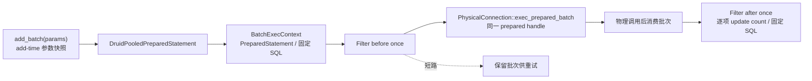

该路径保留 Java 的非直觉细节：`clearParameters` 不修改已入批快照；
PreparedStatementProxy 的 `batchSqlList` 为空，所以 StatFilter batch size
为 0；PreparedStatement 成功 after SQL 为固定预编译 SQL，而普通 Statement
成功 after SQL 为 `null`。默认物理 SPI 顺序执行并保留部分更新计数，
Adapter 可覆盖为原生批处理。

Java Druid+xerial SQLite oracle 得到 success `[1,1]`、repeat `[]`、失败后
repeat `[]`、stat size `0:0` 及固定 SQL 事件；Prepared/Filter Maven 10/10。
Rust workspace 494/494，真实 Toasty SQLite 覆盖快照、消费、部分失败、
before 重试和 StatFilter 时序；普通 Clippy、格式与 diff 检查通过。

| 指标 | 覆盖 | 已覆盖/总量 |
| :--- | ---: | ---: |
| Regions | 85.31% | 12,544 / 14,704 |
| Functions | 88.82% | 1,819 / 2,048 |
| Lines | 88.64% | 10,920 / 12,320 |

原生多数据库 prepared batch、`-2/-3`/驱动错误矩阵、JDBC setter 状态、
generic execute、完整 FilterChainImpl 以及全仓覆盖率 100% 仍未关闭。

### 15.27 C2-R27 普通 Statement generic execute

普通 Statement 已具备四种 generic execute 入口、有序多结果游标、当前
ResultSet/update count getter、`getMoreResults` 和 generated keys：

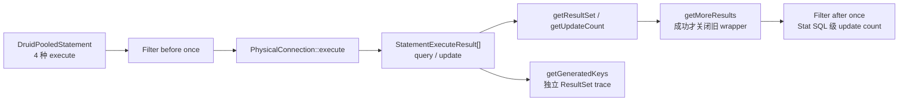

Toasty SQLite 的 `RawSqlRet::Infer` 由 driver prepared statement 元数据区分
query/update，并返回真实 `last_insert_rowid`；列索引/列名生成键选择明确为
unsupported，与 xerial SQLite 一致。Java Maven 42/42 及 JShell 运行时
oracle 通过；Rust workspace 497/497，真实 SQLite 覆盖 SELECT、INSERT、
generated keys、错误推进，mock 覆盖 query → update → query 顺序多结果。

| 指标 | 覆盖 | 已覆盖/总量 |
| :--- | ---: | ---: |
| Regions | 85.64% | 12,920 / 15,087 |
| Functions | 88.96% | 1,853 / 2,083 |
| Lines | 88.92% | 11,213 / 12,610 |

普通 Clippy 退出码 0（既有 warnings 未清零），格式和布局检查通过。
PreparedStatement generic execute、SQLWarning、SQLx/RBDC 原生多结果/
generated-key 矩阵、完整 FilterChainImpl 和全仓覆盖率 100% 继续开放。

### 15.28 C2-R28 PreparedStatement generic execute

PreparedStatement 已在三层职责边界中完成 generic execute 迁移：

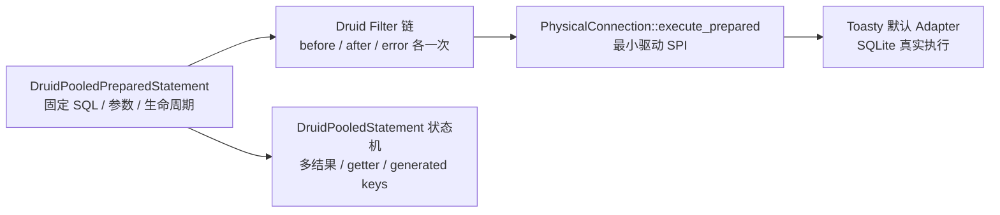

该实现不是另建旁路：PreparedStatement 共享 Statement 的当前结果、多结果推进、
ResultSet trace、异常分类和关闭语义，同时保留 PreparedStatement 固定 SQL、
参数与物理 handle。生成键模式由 `PreparedStatementKey` 映射为
`StatementGeneratedKeys`；Toasty SQLite 的 plain/auto/index/name 四条路径
均返回真实 rowid。Java xerial SQLite 特有的 Prepared 列索引/列名可接受性
也已保留，没有套用普通 Statement 的 unsupported 结果。

CodeGraph 调用链、Java Maven 46/46 和 Druid+xerial SQLite oracle 共同验证
Filter/Stat、getter 错误时机、成功推进关闭旧 wrapper、失败推进保留旧 wrapper。
Rust 全工作区共执行 500/500 个测试，真实 SQLite 与 mock 多结果均通过。

| 指标 | 覆盖 | 已覆盖/总量 |
| :--- | ---: | ---: |
| Regions | 85.94% | 13,266 / 15,436 |
| Functions | 89.15% | 1,882 / 2,111 |
| Lines | 89.24% | 11,469 / 12,852 |

普通 Clippy 退出码 0（既有 warnings 未清零），格式、diff 和布局检查通过。
Prepared ResultSet 的动态具体 statement 身份、SQLWarning、多数据库原生
多结果/generated-key 矩阵、完整 FilterChainImpl 和全仓覆盖率 100% 仍开放，
整体保持 `PARTIAL`。

### 15.29 C2-R29 四类 JDBC 对象 SQLWarning

SQLWarning 已按 `DruidPooledConnection → PhysicalConnection` 的分层思想，
同时迁入 Connection、Statement、PreparedStatement 和 ResultSet；Toasty 是
`druid` 默认内置实现，SQLx/RBDC 仍是 `druid-wrapper` 的扩展 Adapter：

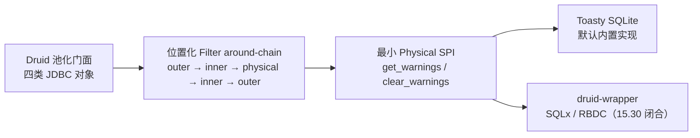

迁移保留 Java 的非对称异常语义：Connection getter 不走
`handleException`，Connection clear 会进入 sorter；Statement、
PreparedStatement 与 ResultSet 的 getter/clear 都会分类异常。Filter 可短路
物理调用，也可在返回时改写 warning 链；每次 API 调用都从 position 0 开始。

验收证据包括 CodeGraph Java/Rust 调用链、Druid + xerial SQLite 四类对象
oracle、Java Maven 120/120，以及 Rust workspace 506/506 个测试。真实 Toasty
SQLite 和 mock Filter/fatal sorter 均通过。

| 指标 | 覆盖 | 已覆盖/总量 |
| :--- | ---: | ---: |
| Regions | 86.21% | 13,598 / 15,774 |
| Functions | 89.42% | 1,943 / 2,173 |
| Lines | 89.49% | 11,762 / 13,144 |

本切片当时开放的 SQLx/RBDC Connection warning Adapter 已由 15.30 闭合，
Prepared ResultSet 动态身份已由 15.31 闭合；剩余 Filter 方法族及全仓覆盖率
100% 仍开放，整体保持 `PARTIAL`。

### 15.30 C2-R30 SQLx/RBDC warning Adapter

`druid-wrapper` 的 SQLx/RBDC direct Adapter 已实现
`PhysicalConnection::warnings/clear_warnings`。两种上游公开 SPI 都不提供 JDBC
warning 链，因此只对存活连接返回 `None`/clear 成功，并严格拒绝关闭或丢弃连接：

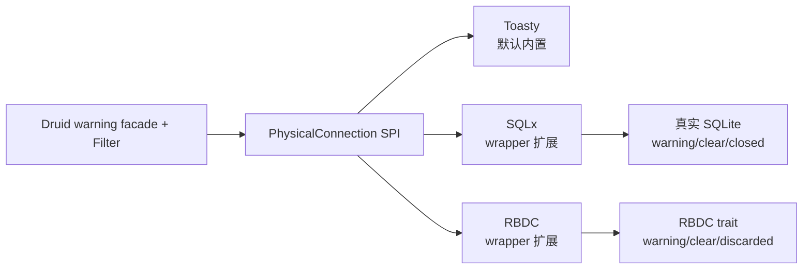

SQLx 真实 SQLite 5/5、RBDC 合同 6/6、全 workspace 507/507 通过；普通
Clippy、格式和布局门禁通过，布局为
`scanned=131 errors=0 warnings=0 semantic_parity_proven=false`。

| 指标 | 覆盖 | 已覆盖/总量 |
| :--- | ---: | ---: |
| Regions | 86.25% | 13,612 / 15,782 |
| Functions | 89.53% | 1,949 / 2,177 |
| Lines | 89.61% | 11,786 / 13,152 |

RBDC 真实 SQLite driver、多数据库 Statement/PreparedStatement 原生结果矩阵、
剩余 Filter 方法族和全仓覆盖率 100% 仍开放，整体保持 `PARTIAL`。

### 15.31 C2-R31 Prepared ResultSet 的同一对象身份

`DruidPooledPreparedStatement` 已从仅由外层对象拥有生命周期，调整为由原对象
和 ResultSet 返回句柄共同拥有同一 shared lifecycle：

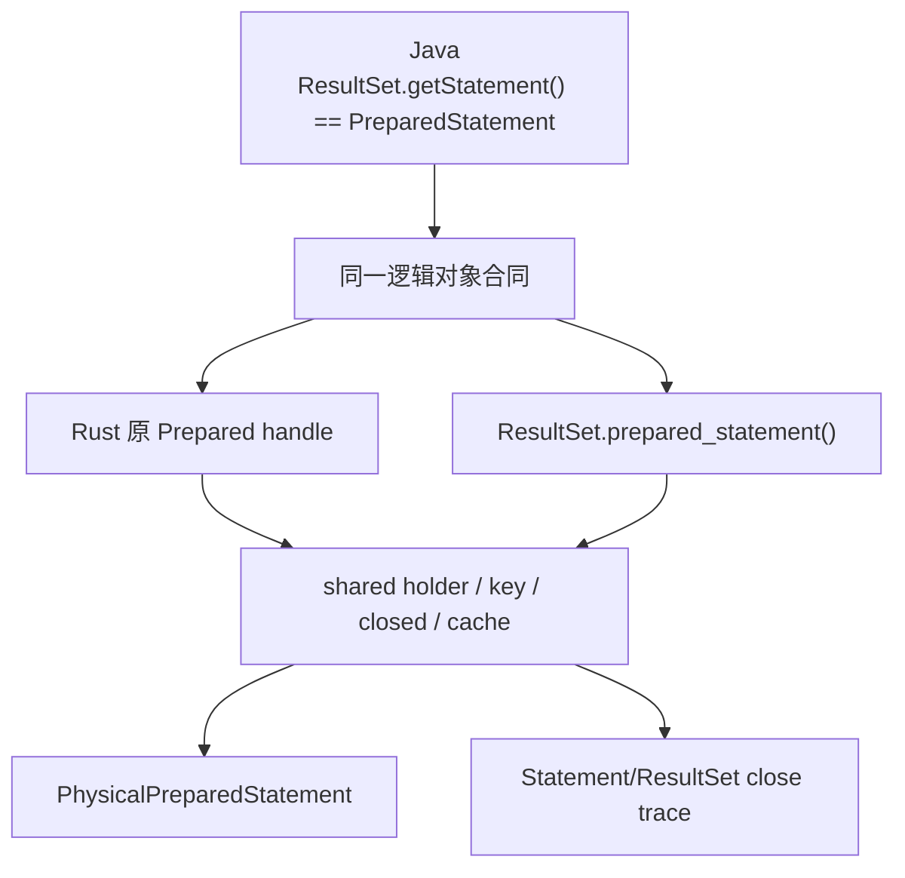

该设计不是复制 PreparedStatement 快照：`is_same_statement` 比较共享对象身份，
key、物理 unwrap、closed、exception/fetch counters 和缓存归还均来自同一状态；
ResultSet 强引用也阻止原变量 Drop 后提前回收。普通 Statement 不暴露 Prepared
身份。

Java Druid+xerial SQLite oracle 四项均为 true；Rust Toasty SQLite 覆盖 query、
generic current、generated keys、Drop 延迟和关闭级联。全 workspace 510/510，
普通 Clippy、格式和布局门禁通过。

| 指标 | 覆盖 | 已覆盖/总量 |
| :--- | ---: | ---: |
| Regions | 86.44% | 13,772 / 15,933 |
| Functions | 89.79% | 1,971 / 2,195 |
| Lines | 89.76% | 11,939 / 13,301 |

CallableStatement ResultSet 动态身份由 C2-R32 闭合；JDBC setter/完整属性、
多数据库原生矩阵、剩余 Filter 方法族和全仓覆盖率 100% 仍开放，整体保持
`PARTIAL`。

### 15.32 C2-R32 Callable ResultSet 的子类型身份

Java callable 对象通过继承的 PreparedStatement 结果路径把动态 `this` 传入
`DruidPooledResultSet`。Rust 新增同文件共享身份句柄，保留这一子类型关系：

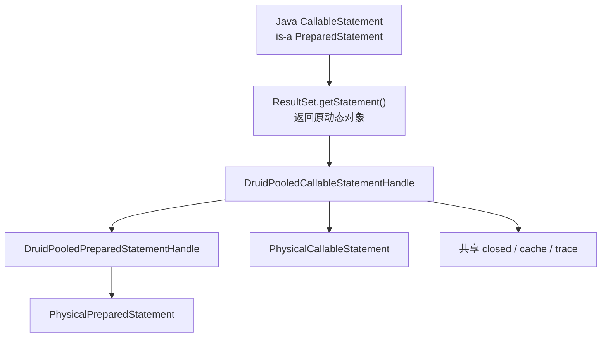

query、generic current 和 generated-keys 结果集均可恢复 callable 身份，同时仍
暴露 Prepared 继承视图；raw concrete unwrap、原变量 Drop 后存活、从结果集关闭
语句及关闭级联均由同一共享状态承担。SQLite 没有 CallableStatement/存储过程
能力，本项不伪造 SQLite 成功案例；Java CodeGraph 继承调用链作为 oracle，
Rust callable 物理 SPI 测试双验证可观察行为。

定向测试 4/4 + 16/16 + 18/18、全 workspace 512/512、普通 Clippy、格式和
布局门禁均通过。

| 指标 | 覆盖 | 已覆盖/总量 |
| :--- | ---: | ---: |
| Regions | 86.45% | 13,887 / 16,063 |
| Functions | 89.73% | 1,992 / 2,220 |
| Lines | 89.74% | 12,050 / 13,428 |

真实 PostgreSQL/MySQL 存储过程、JDBC setter/完整属性、多数据库原生矩阵、
剩余 Filter 方法族和全仓覆盖率 100% 仍开放，整体保持 `PARTIAL`。

### 15.33 C2-R33 PreparedStatement setter 与绑定状态

PreparedStatement 参数已从“每次执行传入 `Vec<Value>`”扩展为与 JDBC 一致的
statement 持久状态，同时保留 Rust 驱动适配边界：

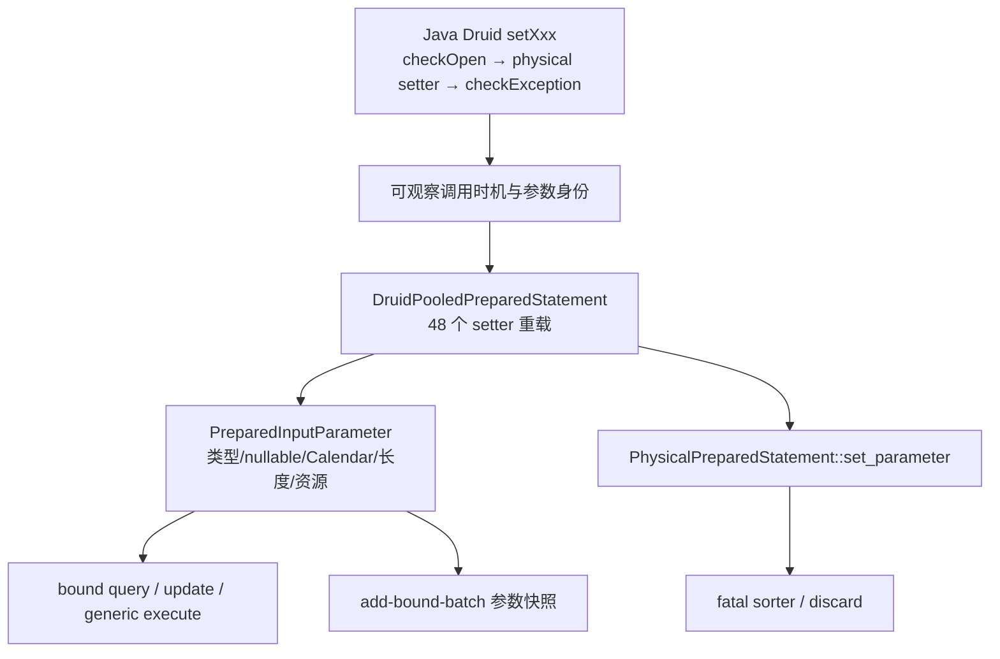

这一结构没有把 `java.sql.PreparedStatement` 误当成 Rust 标准库对象：
`DruidPooledPreparedStatement` 仍是对外池化对象，
`PhysicalPreparedStatement` 是内部最小 SPI，`PreparedInputParameter` 是
跨 Toasty/SQLx/RBDC Adapter 的参数描述协议。标量可进入现有 `Value` 执行路径；
LOB、stream、Reader 和其他 JDBC 资源保留原句柄且不预读，在 Adapter 未实现前
返回明确 unsupported，而不是降级成错误类型。

真实 Toasty SQLite 定向测试覆盖 15 类标量/null、覆盖写、clear、参数空洞、
query/update/generic execute 和 batch 快照；故障 SPI 验证 setter 时点的
fatal-discard。SQLite BOOLEAN/NUMERIC 的存储归一化与 setter 描述符状态分开断言。

全 workspace 515/515、普通 Clippy、格式和布局门禁通过；布局为
`scanned=132 errors=0 warnings=0 allowed=0 semantic_parity_proven=false`。

| 指标 | 覆盖 | 已覆盖/总量 |
| :--- | ---: | ---: |
| Regions | 86.84% | 14,402 / 16,584 |
| Functions | 90.00% | 2,052 / 2,280 |
| Lines | 90.21% | 12,720 / 14,100 |

本批新增 `PreparedInputParameter` 的 Regions/Functions/Lines 均为 100%。

`SEM-CONN-005` 仍为 `PARTIAL`，下一步是 Adapter 原生资源绑定和多数据库矩阵，
不是继续增加并列 crate 或旁路数据源。

### 15.34 C2-R34 PreparedStatement 继承属性与关闭恢复

PreparedStatement 的 Statement 基类已改为真实 prepared handle 的逻辑视图，
不再由无关的 `SqlTextStatement` 伪造。`PhysicalPreparedStatement` 暴露继承
属性，内部 bridge 只管理基类逻辑关闭，holder/pool 仍独占物理关闭权。

池化 wrapper 构造时独立读取 maxFieldSize、maxRows、queryTimeout、
fetchDirection、fetchSize；setter 在物理调用前更新 current；关闭按相同固定
顺序只恢复变化项。首个恢复错误会中止后续恢复以及 clear/cache，并增加
exceptionCount；重试成功后仍删除异常句柄。该时序由故障注入逐事件断言，真实
Toasty SQLite 则验证属性转发、poolable/closeOnCompletion、缓存恢复及恢复后的
真实查询。

全 workspace 517/517、普通 Clippy、格式和布局门禁通过；普通 Clippy 仍有既存
pedantic warnings，不等同于严格 `-D warnings`。布局为
`scanned=133 errors=0 warnings=0 allowed=0 semantic_parity_proven=false`。

| 指标 | 覆盖 | 已覆盖/总量 |
| :--- | ---: | ---: |
| Regions | 86.49% | 14,864 / 17,186 |
| Functions | 89.25% | 2,126 / 2,382 |
| Lines | 89.83% | 13,145 / 14,633 |

`SEM-CONN-015` 的属性/恢复生命周期已关闭；资源参数原生执行、无连接 close 的
sorter、多数据库 generic/batch 和全仓覆盖率 100% 继续开放。

### 15.35 C2-R35 Prepared 资源参数物理 setter 与 batch

资源参数不再停在描述符层。`ToastyPreparedStatement` 作为内置 Adapter 的真实
物理句柄，在 `set_parameter` 内完成 stream/reader/LOB/URL/RowId/null 转换并
保存驱动值；setter 失败先经连接 ExceptionSorter，逻辑槽位不会被错误提交。
执行阶段继续把完整 `PreparedInputParameter` 交给 Filter，但 Toasty 取物理句柄
中已保存的值，不会二次读取资源。

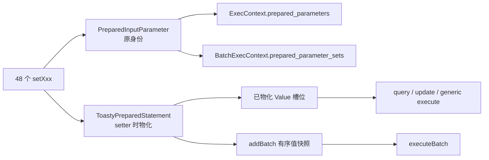

Java xerial SQLite JShell 确认 binary stream 的显式长度、提前 EOF、负长度均在
setter 边界发生。真实 Toasty SQLite 覆盖九类非标量资源家族、null、
query/update/generic execute、有序两批、Filter 描述符及剩余游标。

全 workspace 518/518；布局
`scanned=134 errors=0 warnings=0 allowed=0 semantic_parity_proven=false`；
普通 Clippy 退出 0，但仍有既存 pedantic warnings。覆盖率为 Regions 85.92%
（15,569/18,121）、Functions 88.48%（2,190/2,475）、Lines 89.25%
（13,670/15,316）。`ToastyPreparedStatement` 的 Functions/Lines 为 100%，
Regions 为 97.45%，未把编译器分支计数伪写成 100%。

`SEM-CONN-016` 仅对 Toasty SQLite 关闭；SQLx/RBDC 资源绑定、多数据库真实矩阵
和覆盖率 100% 未关闭。

### 15.36 C2-R36 SQLx Prepared 资源参数与 generic execute

`druid-wrapper` 的 `SqlxPreparedStatement` 已按与内置 Toasty 相同的物理边界
保存 1-based 参数槽和 batch 值快照。资源读取发生在
`PhysicalPreparedStatement::set_parameter`，逻辑 wrapper 与 Filter 继续保留
完整 `PreparedInputParameter`，没有把 SQLx 类型泄漏到 `druid`。

SQLx Adapter 新增 parameter-aware update/query/generic/batch。generic execute
使用真实 SQLx statement columns metadata 判定查询或更新；资源 batch 从
物理句柄取得 add-time 值快照，保持顺序并返回 JDBC 部分计数错误模型。

真实 SQLx SQLite 验证 binary/character、URL、RowId、Blob/Clob/NClob
stream/reader、负长度、提前 EOF、剩余游标、query/update/generic SELECT、
ResultSet 生命周期、两批顺序和 Filter descriptor sets。

全 workspace 519/519；普通 Clippy 退出 0，既存 pedantic warnings 未清零；
布局 `scanned=134 errors=0 warnings=0 allowed=0
semantic_parity_proven=false`。覆盖率为 Regions 85.21%（15,788/18,528）、
Functions 87.83%（2,216/2,523）、Lines 88.55%（13,841/15,631）。

本切片把 `SEM-CONN-016` 扩展为 Toasty/SQLx SQLite PASS；SQLx Any、
PostgreSQL/MySQL、RBDC 资源对象和全仓覆盖率 100% 仍开放。

### 15.37 C2-R37 RBDC Prepared 参数槽与真实 SQLite 驱动预言机

RBDC 不再只保存 SQL token。新增 `RbdcPreparedStatement`，并把 SQLx/RBDC
共用的 setter 时点资源转换和参数/batch 状态分别收敛为
`PreparedParameterMaterializer`、`PreparedParameterState`。RBDC Adapter 现在从
物理句柄取得连续参数值和 `addBatch` 时的值快照，执行 parameter-aware
query/update/batch；Filter 仍收到原始 `PreparedInputParameter` 描述符。

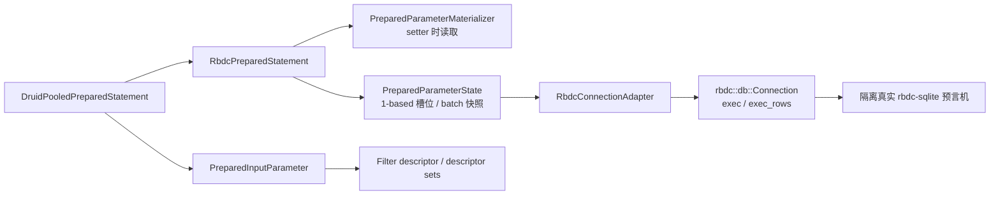

主 workspace 的严格 RBDC SPI fixture 验证提前 EOF/负长度在 setter 报错、
Binary/Character/URL/RowId、query/update、两批 Blob/Clob/NClob
stream/reader 的值和顺序。另一个隔离 Cargo 工程使用
`rbdc-sqlite 4.9.5` + SQLite 内存库真实插入并回读 BLOB/TEXT/URL/RowId。
两段证据不能合并冒充单条端到端测试：主 workspace 无法同时解析 SQLx/Toasty
现用版本和 `rbdc-sqlite` 的不同 `libsqlite3-sys`，因为二者都声明
`links = "sqlite3"`。

全 workspace 525/525；普通 Clippy 退出 0但既存 pedantic warnings 未清零；
布局 `scanned=137 errors=0 warnings=0 allowed=0
semantic_parity_proven=false`。覆盖率为 Regions 85.90%（16,292/18,966）、
Functions 88.34%（2,273/2,573）、Lines 89.10%（14,235/15,977）。
`PreparedParameterState` 与 `RbdcPreparedStatement` 的 Functions/Lines 均为
100%；公共物化器 Lines 为 81.85%，未覆盖的 LOB/SQLXML 错误分支继续开放。

`SEM-CONN-016` 的 RBDC setter/参数/batch SPI 合同和真实 RBDC SQLite 值合同已
分别通过；RBDC Adapter + 真实 SQLite 的单进程端到端链、generic execute
结果判型、SQLx Any/PostgreSQL/MySQL 及全仓覆盖率 100% 仍未关闭。

### 15.38 C2-R38 RBDC LOB/SQLXML/Object setter 完整资源边界

继续对照 Java `DruidPooledPreparedStatement` 的
`checkOpen → stmt.setXxx → checkException`，RBDC 严格 SPI 新增 Blob、Clob、
NClob、SQLXML 直接 setter 以及同一资源经 `setObject` 的动态分派测试。超出
JDBC `int` 长度、SQLXML 驱动读取失败、非法 UTF-16、非法 ASCII、Ref/Array
unsupported 均在 setter 返回；成功路径一次执行精确核对 12 个 BLOB/TEXT 参数。

全 workspace 526/526；RBDC Adapter 合同 8/8；普通 Clippy 退出 0但既存
pedantic warnings 未清零；布局仍为
`scanned=137 errors=0 warnings=0 allowed=0
semantic_parity_proven=false`。覆盖率提升为 Regions 86.26%
（16,360/18,966）、Functions 88.50%（2,277/2,573）、Lines 89.38%
（14,281/15,977）。`PreparedParameterMaterializer` Functions 为 100%、
Lines 98.22%（276/281）、Regions 94.74%；剩余 5 行为 LLVM 源映射中的
编译器分支区域，未写成 100%。

### 15.39 C2-R39 ResultSet 默认能力与 typed object 单次读取

逐行对照 Java `DruidPooledResultSet#getObject(int, Class<T>)` 后确认：一次公开
调用只能执行一次底层 `ResultSet#getObject`，不能为了判断 custom target
预读一遍再委托第二遍。Rust `PhysicalResultSet::object_as(Custom)` 保持单次
`value(column_index)` 读取；新增带原子计数的物理探针锁定该调用次数。

同时用只实现最小 `value/close` 的 `SparsePhysicalResultSet` 逐项调用
`PhysicalResultSet` 默认方法，冻结以下语义：

- 导航能力默认返回各自精确的 `UnsupportedOperation.operation`，不折叠为
  一个笼统错误；
- typed object 先保留列索引/底层读取错误，只有读取成功后才报告 custom target
  不支持；
- fetch、cursor、metadata、warning、update 等属性族保持各自能力名称，便于
  Adapter 和上层异常分类按 Java 调用点追踪。

全 workspace 530/530；普通 `cargo clippy --workspace --all-targets` 退出 0，
既存 pedantic warnings 未清零；严格 `-D warnings` 因全仓既有 418 项告警失败，
没有冒充严格门禁通过。布局为
`scanned=137 errors=0 warnings=0 allowed=0
semantic_parity_proven=false`。

| 指标 | 覆盖 | 已覆盖/总量 |
| :--- | ---: | ---: |
| Regions | 86.77% | 16,456 / 18,966 |
| Functions | 89.74% | 2,309 / 2,573 |
| Lines | 90.39% | 14,441 / 15,977 |

`jdbc_result_set.rs` Lines 为 87.05%（1,015/1,166），未覆盖行由 311 降至
151；`druid_pooled_result_set.rs` Lines 为 88.90%（1,674/1,883）。
真实 driver custom target conversion、其余 Filter 方法族、streaming、
多数据库矩阵及全仓 100% 覆盖率继续保持开放。

### 15.40 C2-R40 ResultSet 标量 getter 物理重载委托

继续逐方法对照 Java `DruidPooledResultSet`。Java 的 `getObject(String)`、
`getString/getBoolean/getLong/getInt/getShort/getByte/getDouble/getFloat/getBytes`
全部在各自 `try` 块内直接调用 raw `ResultSet` 的同名 index/label 重载，再由
`checkException` 处理错误。此前 Rust 在池化门面先读取通用 `Value` 后自行转换，
会改变三类外部行为：

1. label 重载退化为 `findColumn + index getter`，丢失驱动原生标签规则；
2. vendor 自定义标量转换无法覆盖；
3. 门面转换错误发生在物理调用已分类之后，不进入同一 Statement 异常计数。

本切片在 `PhysicalResultSet` 增加上述 19 条精确重载（含
`value_by_label`），`DruidPooledResultSet` 改为只做 open/lease 检查、同名物理
委托与 `classify`。基于 `Value` 的 eager Adapter 继续由 SPI 默认方法完成 JDBC
NULL 和标准转换，不把默认实现强加给真实 driver。

证据包括：

- 自定义物理探针不实现 `value/findColumn`，仅实现 19 条 getter 重载；池化门面
  逐条得到探针专属返回值，证明没有隐式降级；
- label getter 的物理 `DriverError` 进入 Statement exception count；
- `RowSetResultSet` 覆盖 NULL、bool/int/float/decimal/string/bytes/日期时间、
  窄化溢出、非法 UTF-8、非法数值、非法日期时间和两种 timestamp 格式；
- 所有 `Value`→binary/character stream 分支均执行，真实 Toasty SQLite 原有
  getter 合同继续通过。

全 workspace 534/534；普通 Clippy 退出 0，严格 `-D warnings` 仍未关闭；布局
`scanned=137 errors=0 warnings=0 allowed=0
semantic_parity_proven=false`。

| 指标 | 覆盖 | 已覆盖/总量 |
| :--- | ---: | ---: |
| Regions | 89.41% | 17,072 / 19,095 |
| Functions | 91.61% | 2,369 / 2,586 |
| Lines | 92.53% | 14,817 / 16,014 |

`druid_pooled_result_set.rs` Lines 为 99.73%（1,836/1,841），
`jdbc_result_set.rs` Lines 为 98.63%（1,228/1,245）。PostgreSQL/MySQL/Turso、
SQLx/RBDC 真实 ResultSet 标量重载和 vendor custom conversion 仍待独立矩阵，
因此 `CORE-CONN-005` 与全仓覆盖率门禁保持 `PARTIAL`。

### 15.41 C2-R41 Statement/PreparedStatement 物理 ResultSet 贯通

继续对照 Java `DruidPooledStatement#executeQuery`、
`DruidPooledPreparedStatement#executeQuery` 与 `getResultSet`：池化门面包装的
必须是驱动返回的同一个 ResultSet，而不是先拍平成 rows 后重建的对象。

本切片把 `PhysicalConnection::fetch_result_set`、
`fetch_prepared_result_set` 和
`fetch_prepared_parameters_result_set` 贯穿 lease、Filter、Statement 共享状态与
Prepared wrapper。Filter 的 query after 仍只执行一次；物理 ResultSet 未被 eager
消费，因此 `row_count` 如实保持未知，而不是伪造行数。

Adapter 证据：

- SQLx 真实 SQLite 普通与 prepared query 保留 alias label；两条路径都使用
  原生 prepared handle，因此普通 Statement 的零行查询也保留 descriptor；
- RBDC 严格 SPI 从 driver `Row::meta_data()` 取得并保留列名；
- Toasty 由于 raw SQL 返回 eager values，仍明确适配为 `RowSetResultSet`，但
  descriptor 参数仍通过 `ToastyPreparedStatement` 在 setter 边界物化；
- 默认 SPI 和 `PhysicalConnectionLease` 均有 prepared ResultSet 回退/透明委托
  合同。

全 workspace 534/534；普通 Clippy 退出 0，pedantic 告警债务未清零；布局
`scanned=137 errors=0 warnings=0 allowed=0
semantic_parity_proven=false`。

| 指标 | 覆盖 | 已覆盖/总量 |
| :--- | ---: | ---: |
| Regions | 89.11% | 17,460 / 19,594 |
| Functions | 91.55% | 2,405 / 2,627 |
| Lines | 92.33% | 15,105 / 16,360 |

RBDC 的零行 descriptor、Toasty streaming、真实多数据库及全仓 100% 覆盖率
仍未完成，所以该切片只关闭“canonical query 不再丢失已有物理
ResultSet/label”的子语义，不关闭 `CORE-CONN-005`。

### 15.42 C2-R42 ResultSet 标量 getter FilterChain

继续按 Java `FilterChain`/`FilterChainImpl` 公开签名迁移，而不是在 Rust
池化门面直接读取物理列。String/Boolean/Byte/Short/Int/Long/Float/Double/Bytes
的 index/label 共 18 条 getter 已贯穿：

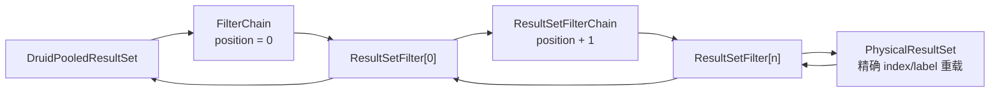

调用链保留注册顺序进入、逆序返回改写、短路不触达物理对象和错误展开。
池化门面在 Filter 或物理 getter 失败时均执行同一 Statement/Connection
异常分类。真实 Toasty SQLite、精确重载物理探针、两层 wrapping Filter 和全
18 重载 short-circuit Filter 均已通过。

验收结果：

- workspace 538/538；
- 普通 Clippy 退出 0，既有 pedantic warning 未伪装为清零；
- 布局 `scanned=137 errors=0 warnings=0 allowed=0
  semantic_parity_proven=false`；
- 三个模块语义表的 `CORE/ADMIN/WRAP/SEM` ID 共 217 行、217 个唯一 ID、
  0 重复；包含全局 `SEM-NFR-*` 后，当前 `SEM-*` 为 153 个唯一 ID，旧
  `docs/migration` 的 143 个 ID 遗漏 0；
- `docs/migration` 不存在，所有新增结论直接归并到
  `docs/druid` 与总路线图。

| 指标 | 覆盖 | 已覆盖/总量 |
| :--- | ---: | ---: |
| Regions | 89.23% | 17,678 / 19,812 |
| Functions | 91.68% | 2,447 / 2,669 |
| Lines | 92.42% | 15,291 / 16,546 |

`CORE-FLT-007` / `SEM-FLT-024` 已关闭。ResultSet 的
object/decimal/temporal/stream/resource/update 等 Filter 方法族、canonical
`FilterChainImpl`、真实多数据库和覆盖率 100% 仍开放，不提升整个
`CORE-CONN-005`。

### 15.43 C2-R43 ResultSet Decimal/Temporal FilterChain

冻结并迁移 Java ResultSet BigDecimal 四重载，以及 Date/Time/Timestamp 各四
重载，共 16 条精确 Filter 方法。Rust 调用路径保持：

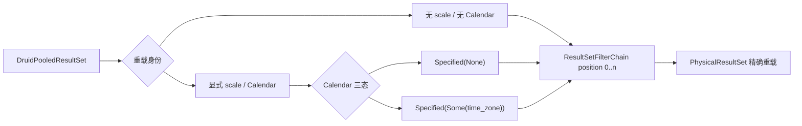

默认继续链、全短路改写、scale/Calendar 参数身份、错误分类和真实 Toasty
SQLite 强类型读取均已通过。Toasty eager raw-SQL alias 丢失被如实保留为已知
缺口；label Filter 重载由物理探针与参数日志验证，没有把 index 测试扩大解释。

验收：

- workspace 539/539；
- Clippy 退出 0；
- 布局 137 文件、0 error、0 warning；
- Regions 89.41%（18,011/20,145）；
- Functions 91.82%（2,491/2,713）；
- Lines 92.57%（15,632/16,887）；
- `docs/migration` 保持不存在。

`CORE-FLT-008` / `SEM-FLT-025` 已关闭；Filter 总体、`CORE-CONN-005` 与
全仓 100% 门禁保持 `PARTIAL`。

### 15.44 C2-R44 ResultSet Object 六重载 FilterChain

Java plain/map/typed × index/label 六条 `getObject` 重载已经完整穿过
`DruidPooledResultSet` 的同步 Filter around-chain：

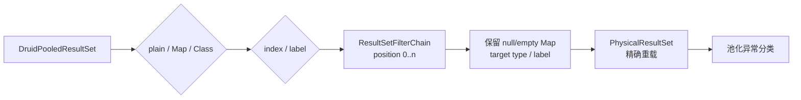

默认委托、短路改写、Map/目标类型身份、标签重载和 Filter 错误分类均有
Rust 本地证据；真实 Toasty SQLite 验证 plain object 与 typed Long 的 host
路径。测试账本明确将 Java 源码追踪标为 `V0_STATIC`、Rust 义务标为
`V1_RUST_LOCAL`、SQLite 集成标为 `V5_HOST`，没有把镜像式源码对照冒充
golden/live differential。

验收为 workspace 540/540、Clippy 退出 0、布局 137 文件且 0 error/0 warning；
覆盖率 Regions 89.53%（18,248/20,382）、Functions 91.91%
（2,521/2,743）、Lines 92.66%（15,851/17,106）。测试审计盘点 Java core
475 个方法、Rust druid 502 个函数、144 个需人工复核信号。

`CORE-FLT-009` / `SEM-FLT-026` 已关闭；嵌套 ResultSet/Clob 自动代理、
其余 ResultSet Filter 方法族、canonical `FilterChainImpl`、多数据库和全仓
100% 覆盖率仍为 `PARTIAL`。

---

文档版本：v2.0

基线日期：2026-07-28

状态：迁移执行基线
