# druid-rust 架构设计文档

> **文档目的**：定义 druid-rust 的架构目标、边界、组件职责、运行主链、
> 数据与协议、安全与可靠性、部署运维及演进约束，使设计、开发、测试、
> 发布和运维使用同一套可验证架构合同。
>
> **架构版本**：V1.0.0-DESIGN<br>
> **文档状态**：草案<br>
> **负责人**：druid-rust maintainers<br>
> **最后更新**：2026-07-27

> **文件名约束**：本文档遵守 `full-stack-doc` v3.0 架构文件名约定，文件名
> 为 `<Stem>-Architecture.zh_CN.md`，根架构文档一份，版本与文档树通过软链
> 引用：`doc/8、druid-rust-Architecture.zh_CN.md` 与
> `doc/V1/3、druid-rust-V1-Architecture.zh_CN.md` 均为指向本文档的入口。

## 目录

1. 文档控制与阅读指南
2. 执行摘要
3. 业务背景、架构驱动与约束
4. 范围、边界与外部上下文
5. 当前态、目标态与差距
6. 架构原则与关键决策
7. 总体架构与分层
8. 组件、模块与依赖
9. 运行时、进程与并发模型
10. 核心业务与系统主链
11. 状态机、生命周期与任务模型
12. 数据、状态与一致性
13. 接口、协议与互操作
14. 配置、特性开关与秘密
15. 安全、隐私与信任边界
16. 可靠性、失败与恢复
17. 性能、容量与资源预算
18. 部署、升级与回滚
19. 可观测性、运维与诊断
20. 扩展、插件与生态边界
21. 兼容、迁移与演进
22. 测试、验证与架构验收
23. 风险、技术债与实施路线
24. 附录
25. 示意代码集

---

## 1. 文档控制与阅读指南

### 1.1 文档信息

| 字段 | 内容 |
| :--- | :--- |
| 系统/项目 | druid-rust |
| 架构版本 | V1.0.0-DESIGN |
| 适用代码版本 | `dev` 分支 HEAD（占位骨架） |
| 适用部署形态 | 嵌入宿主进程（库）；`druid-admin` 提供独立 HTTP 服务 |
| 负责人 | druid-rust maintainers |
| 评审人 | 待定（首次评审前不填） |
| 状态 | 草案 |
| 事实核验日期 | 2026-07-27 |

### 1.2 读者与阅读路径

| 读者 | 优先章节 | 期望获得 |
| :--- | :--- | :--- |
| 产品与业务 | 2–5、10、23 | 系统价值、范围、主链与路线 |
| 开发者 | 6–14、20–22 | 模块边界、接口、状态、扩展合同 |
| 测试 | 10–17、21–22 | 主链、失败、性能、验收矩阵 |
| 安全 | 4、13–16、20 | 信任边界、威胁、秘密、恢复 |
| 运维/SRE | 16–19、21–23 | SLO、部署、观测、回滚、风险 |

### 1.3 实现状态标签

| 标签 | 定义 | 必需证据 |
| :--- | :--- | :--- |
| `[已实现]` | 当前代码与部署存在，可验证 | 源码、测试、运行或发布证据 |
| `[部分实现]` | 有骨架或局部闭环 | 已完成与缺失清单 |
| `[设计目标]` | 目标架构，尚未落地 | ADR、计划与退出条件 |
| `[实验性]` | 可运行但不承诺稳定 | 限制、开关、回退方式 |
| `[非目标]` | 明确不由本系统承担 | 责任归属或替代方案 |

`druid-rust` 当前对绝大多数能力使用 `[设计目标]` 标签；没有任何能力
使用 `[已实现]`。这一文档整体上是一份"目标合同"，而非"现状记录"。

### 1.4 关联文档

| 文档 | 责任边界 | 链接 |
| :--- | :--- | :--- |
| 产品级规划 | 命名、品牌、术语、市场、可行性、技术方案、版本、领域、视觉、功能菜单 | [`doc/`](doc/) |
| 版本级规划 | V1 调研、需求、架构、功能、PRD、菜单、UI | [`doc/V1/`](doc/V1/) |
| README（双语） | 仓库入口门面 | [`README.md`](README.md) / [`README.zh-CN.md`](README.zh-CN.md) |
| 工作区根 | Cargo 骨架与工具链 | [`Cargo.toml`](Cargo.toml) / [`rust-toolchain.toml`](rust-toolchain.toml) |

---

## 2. 执行摘要

### 2.1 一句话架构

**druid-rust 是一个面向 Rust 后端服务的数据库连接治理中间件，通过
`druid-core` 的 `Connection` / `Pool` / `Filter` 契约把任意 driver 生态
(`sqlx`、`rbdc` 等) 的连接对象纳入统一的池化、过滤、统计、动态切换
与可观测框架；它不持有数据库协议实现，只在 `Connection` 这一稳定拦截
点之上做横切关注。**

### 2.2 一眼看懂

```text
下游应用 / Web 框架 / 后台 worker
        │ cargo add druid-core + 适配器
        ▼
┌──────────────────────────────────────────────────────────────────┐
│ druid-rust                                                       │
│ 入口层       druid-core 的 Connection trait / PoolBuilder        │
│ 应用编排层   druid-pool（DruidPool + PooledConnection + 泄漏检测）│
│ 核心层       druid-sql（参数化、Wall、指纹）                     │
│              druid-stats（SQL 合并 + 百分位 + Prometheus）       │
│              druid-dynamic（ArcSwap 多数据源 + 读写分离）        │
│ 适配层       druid-rbdc / druid-sqlx-deadpool / druid-sqlx-bb8   │
│ 治理面       druid-admin（axum：/druid/admin/* + /metrics）      │
└──────────────────────────────────────────────────────────────────┘
        │ Prometheus / OpenTelemetry / 日志
        ▼
调用方 / 下游 / 运维与治理系统
```

### 2.3 核心结论

| 维度 | 架构结论 | 状态 | 证据 |
| :--- | :--- | :--- | :--- |
| 主体 | 围绕 `druid_core::Connection` trait 构建横切层 | 已确认 | `Cargo.toml` §workspace.dependencies |
| 分层 | 5 个领域 crate + 3 个适配器 + 1 个治理面 | 已确认 | `Cargo.toml` members |
| 核心主链 | `Pool::get → FilterChain::before → Connection::exec → FilterChain::after → Drop 归还` | 设计目标 | §10 |
| 数据 | 池内存活连接、`druid-stats` 直方图、`druid-dynamic` 注册表 | 设计目标 | §12 |
| 安全 | 默认拒绝 `DROP`/`TRUNCATE`；Wall 与参数化绑定 | 设计目标 | §15 |
| 部署 | 嵌入式库 + `druid-admin` 独立进程 | 设计目标 | §18 |
| 最大风险 | API 漂移导致横切层失效 | 待处理 | §23 R-001 |

### 2.4 架构质量属性优先级

| 优先级 | 质量属性 | 可验证目标 | 取舍 |
| :---: | :--- | :--- | :--- |
| P0 | 正确性/安全性 | Wall 阻断非法 SQL；过滤器链不丢事件 | 可牺牲部分吞吐 |
| P0 | 可恢复性 | `PooledConnection::drop` 必定归还连接 | 增加状态与审计成本 |
| P1 | 性能 | 热获取 < 200ns（设计目标） | 不破坏正确性 |
| P1 | 可扩展性 | 通过适配器接入新 driver 而不动 core | 控制抽象复杂度 |
| P2 | 资源 | 内存上限由 `max_open * per-conn` 估算 | 按部署档位裁剪 |

---

## 3. 业务背景、架构驱动与约束

### 3.1 背景与问题

| 当前问题 | 影响 | 根因 | 架构响应 |
| :--- | :--- | :--- | :--- |
| Rust 后端缺少开箱即用的连接治理层 | 用户必须自行组合 sqlx + 自写监控 + 自写池 | 生态以底层 driver / ORM 为主 | 提供 `druid-core` 统一拦截点 |
| 没有动态数据源切换原语 | 多租户 SaaS 切库需要侵入业务代码 | 无 `ArcSwap`-based 路由抽象 | `druid-dynamic` 暴露 `DynamicDataSource` |
| SQL 防火墙普遍缺失 | 误执行 `DROP TABLE` 只能依赖权限控制 | Wall 是 Druid Java 的强项 | `druid-sql` 提供基于 sqlparser-rs 的 AST 规则 |
| 没有 SQL 合并视角的统计 | 慢 SQL、Top SQL 只能临时拼脚本 | 缺少参数化 + 指纹层 | `druid-stats` 提供 `SqlMerger` |

### 3.2 架构驱动

| 驱动 | 类型 | 强度 | 来源 | 决策影响 |
| :--- | :---: | :---: | :--- | :--- |
| 横切层不侵入业务 | 业务 | P0 | `doc/1` §3 边界 | trait 在 `druid-core`，业务层不感知过滤器链 |
| 兼容 sqlx / deadpool / bb8 / rbdc | 兼容 | P0 | `doc/5` §3 | 适配器三个并立 |
| 安全默认 | 安全 | P0 | `doc/4` §4 | Wall 默认 deny `DROP`/`TRUNCATE` |
| MSRV 1.75 | 技术 | P1 | `rust-toolchain.toml` | 锁 sqlparser 0.52、sqlx 0.8 兼容线 |
| 不重写数据库协议 | 平台 | P0 | ADR-001 | 不与 `rbdc-pg / rbdc-mysql` 重复 |

### 3.3 硬约束

| ID | 硬约束 | 验证方式 | 违反后处理 |
| :--- | :--- | :--- | :--- |
| `C-001` | `druid-core` 不得依赖 driver、parser 或 async runtime | `cargo metadata` / `cargo tree` | 阻止合入 |
| `C-002` | 所有 crate 默认 `publish = false` 直到 Phase 1 关闭 | `Cargo.toml` `publish = false` | 移除占位后重新评审 |
| `C-003` | 公共 API 不得包含 `unsafe` | workspace lint `unsafe_code = "forbid"` | 阻止合入 |
| `C-004` | 解析走 sqlparser-rs AST，不走正则 | ADR-002 / `doc/5` §3 | ADR 反转后才允许正则路径 |

### 3.4 假设与待确认

| ID | 假设/TBD | 影响 | 验证计划 | 截止 | 负责人 |
| :--- | :--- | :--- | :--- | :--- | :--- |
| `A-001` | sqlparser-rs 0.52 AST 在 `?` 占位符上的稳定性足以支撑参数化 | 高 | Phase 1 端到端 | Phase 1 退出 | maintainers |
| `A-002` | `ArcSwap::store` + `load` 的延迟低于 `RwLock<Arc<T>>` 写读路径 | 中 | 基准 | Phase 3 | maintainers |
| `A-003` | `druid-stats` 的直方图基数受 `moka` 容量约束即可 | 中 | 配置 review | Phase 2 | maintainers |
| `A-004` | V1 不提供 Web UI，仅暴露 JSON API | 低 | `doc/9` 视觉 DNA | V1 | maintainers |

---

## 4. 范围、边界与外部上下文

### 4.1 系统负责与不负责

| 系统负责 | 系统不负责 | 外部责任方 |
| :--- | :--- | :--- |
| 连接池与归还语义 | SQL 生成 | 宿主应用 / ORM |
| Filter 链与 Wall 规则 | 数据库 Schema 迁移 | sqlx-cli / refinery |
| SQL 合并统计 | Prometheus 自身的部署 | Prometheus Operator |
| 动态数据源切换 | 数据库访问权限与凭据 | 数据库 IAM / Vault |
| `/druid/admin` JSON API | 鉴权与多租户隔离 | 宿主 Web 框架 |

### 4.2 系统上下文

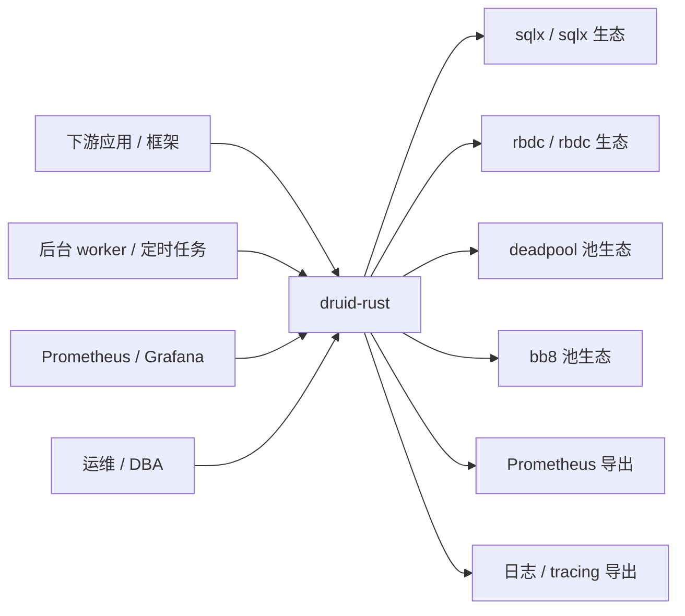

### 4.3 外部依赖清单

| 依赖 | 用途 | 协议 | 关键 SLA | 失败影响 | 降级/替代 | 责任方 |
| :--- | :--- | :--- | :--- | :--- | :--- | :--- |
| `sqlx` 0.8 | 异步 SQL | `tokio` + DB 协议 | 上游发布节奏 | 中 | 退而使用 `deadpool`/无 sqlx 路径 | sqlx maintainers |
| `deadpool` 0.12 | 池调度 | `tokio` runtime | 兼容 tokio 1.x | 中 | 退而使用 `bb8` | deadpool maintainers |
| `bb8` 0.8 | 池调度 | `tokio` runtime | 兼容 tokio 1.x | 中 | 退而使用 `deadpool` | bb8 maintainers |
| `rbdc` 4 | 协议抽象 + 6 DB 支持 | 自有 wire protocol | 与 `rbatis` 同源 | 中 | 退而不接 `druid-rbdc` | rbatis maintainers |
| `sqlparser-rs` 0.52 | SQL AST | n/a | 项目节奏 | 高 | 锁版本升级 | Apache DataFusion |
| `axum` 0.7 | HTTP 端点 | HTTP/1.1、HTTP/2 | 与 tokio 1 同步 | 低 | 不暴露 admin | tokio-rs |

### 4.4 信任与管理边界

```text
Untrusted            Controlled                Trusted
应用代码 ──► Pool 边界 ──► Connection 边界 ──► 数据库
              (druid-pool)   (driver adapter)
                   │              │
              配额/超时      参数化/Wall
```

`druid-pool` 是不可信的应用代码与可信的数据库 driver 之间的唯一边界。
所有横切关注（Wall、Stat、SlowSQL、Tracing）都挂在这个边界上。

---

## 5. 当前态、目标态与差距

### 5.1 当前真实架构

仓库当前**只**包含占位骨架：根 `Cargo.toml`、9 个 `crates/<name>` 子 crate
各含一个 `src/lib.rs`、一份 `README.md` / `README.zh-CN.md`、一份本架构
文档、`doc/` 目录的 17 篇产品/版本文档。所有 crate 通过
`cargo check --workspace`。

| 能力 | 当前实现 | 完成度 | 已知限制 | 证据 |
| :--- | :--- | :---: | :--- | :--- |
| Workspace 编译 | 占位 crate | 100% | 无公共 API | `cargo check --workspace` |
| 文档基线 | 10 root + 7 V1 + 架构 + 双语 README | 100% | 均为设计蓝图 | `doc/`、`README*.md` |
| trait 契约 | 未导出 | 0% | — | `crates/druid-core/src/lib.rs` |
| 连接池 | 未实现 | 0% | — | `crates/druid-pool/src/lib.rs` |
| sqlparser 适配 | 未实现 | 0% | — | `crates/druid-sql/src/lib.rs` |
| 适配器 | 未实现 | 0% | — | 三个 adapter crate |
| 治理面 | 未实现 | 0% | — | `crates/druid-admin/src/lib.rs` |

### 5.2 目标架构

| 目标能力 | 目标组件 | 预期合同 | 前置条件 | 验收 |
| :--- | :--- | :--- | :--- | :--- |
| `Connection` trait | `druid-core` | 见 §8 | 0 | 编译 + trait 测试 |
| HikariCP 风格池 | `druid-pool` | 见 §9 | `druid-core` | 单元 + 泄漏检测 |
| Wall 规则 | `druid-sql` | `WallConfig` + AST 遍历 | `druid-core` | 集成测试 |
| SQL 合并 | `druid-stats` | `SqlMerger` 指纹 + 直方图 | `druid-sql` | 单元 + 合并率 |
| 动态数据源 | `druid-dynamic` | `ArcSwap` + `SqlHint` | `druid-pool` | 切换不丢请求 |
| sqlx 适配 | 两个 sqlx-* crate | `ConnectionFactory` | `druid-core` + `druid-pool` | 集成测试 |
| rbdc 适配 | `druid-rbdc` | `ConnectionFactory` | `druid-core` + `druid-pool` + `rbdc` | 集成测试 |
| `/druid/admin` | `druid-admin` | axum router + JSON | 所有领域 crate | 端到端 |

### 5.3 差距矩阵

| 差距 | 当前 | 目标 | 优先级 | 阶段 | 回退 |
| :--- | :--- | :--- | :---: | :--- | :--- |
| trait 未声明 | 占位 | 见 §8 | P0 | Phase 1 | 删除占位 |
| 池未实现 | 占位 | HikariCP 风格 | P0 | Phase 1 | `deadpool`/`bb8` 直用 |
| Wall 未实现 | 占位 | AST 规则 | P0 | Phase 1 | 临时手工拦截 |
| 适配器未实现 | 占位 | 见 §8 | P0 | Phase 2 | 文档说明跳过 |
| 多数据源未实现 | 占位 | `ArcSwap` | P0 | Phase 3 | 应用层 `Mutex<Arc<>>` |
| 治理面未实现 | 占位 | axum | P1 | Phase 3 | 不暴露 |


---

## 6. 架构原则与关键决策

### 6.1 架构原则

| 原则 | 含义 | 工程规则 | 反例 |
| :--- | :--- | :--- | :--- |
| 主链优先 | 核心主体不被横切设施替代 | 主请求路径保持清晰 | Wall 成为业务主语 |
| 边界明确 | 合同与实现分离 | Core 不依赖 Adapter | 基础层反向依赖入口 |
| 默认安全 | 失败时拒绝或安全降级 | Wall 默认 deny `DROP`/`TRUNCATE` | 默认放行 |
| 可恢复 | 状态变化可重放或补偿 | `Drop` 归还连接、过滤器异常吞掉 | 静默丢失 |
| 证据驱动 | 声明由测试和运行证明 | 状态标签与证据链接 | 用路线图代替实现 |

### 6.2 关键决策摘要

| ADR | 决策 | 选择理由 | 被拒绝方案 | 反转条件 | 状态 |
| :--- | :--- | :--- | :--- | :--- | :--- |
| `ADR-001` | 不依赖 sqlx 作为唯一 driver；保留三个适配器（rbdc / sqlx-deadpool / sqlx-bb8） | 不同项目已有不同 driver 选型，单一锁定会逼走用户 | 强制走 `sqlx + deadpool` | 出现必须统一的强证据 | 已确认 |
| `ADR-002` | SQL 解析走 sqlparser-rs AST，不走正则 | 正则在边界 SQL 上不可靠；AST 给出"白名单 + 黑名单 + 子查询深度"的统一表达 | regex crate 字符串匹配 | sqlparser-rs 维护停滞且无替代 | 已确认 |
| `ADR-003` | 横切层（Filter / Stats / Dynamic）作为装饰器挂在 `Connection` 上 | Connection 是稳定拦截点；任何 driver 适配器必须实现该 trait | AOP 字节码注入（无 Rust 等价） | 出现不可拦截场景 | 已确认 |
| `ADR-004` | 多数据源切换走 `arc-swap` lock-free | 切换期间请求不阻塞、不半切换 | `RwLock<Arc<T>>` / `Mutex<Option<T>>` | 出现必须阻塞的切换（如事务内） | 已确认 |
| `ADR-005` | 不实现 Druid Java 的 SQL 注入正则检测 | 正则不可靠；sqlparser-rs 已能做 AST 层检查 | regex crate | 永不反转（语义层面） | 已确认 |
| `ADR-006` | 监控导出走 Prometheus 文本格式，不内置 OpenTelemetry | OTel exporter 体积与配置面过大；先解决 80% 场景 | 同时内置 OTel | 出现必须 OTel 的强约束 | 已确认 |

### 6.3 决策流程

```text
Architecture driver
  → alternatives
  → trade-off and experiment
  → ADR
  → implementation contract
  → automated acceptance
```

任何 ADR 反转需在 `doc/5、druid-rust-技术方案与路线.md` 中显式记录。

---

## 7. 总体架构与分层

### 7.1 逻辑分层

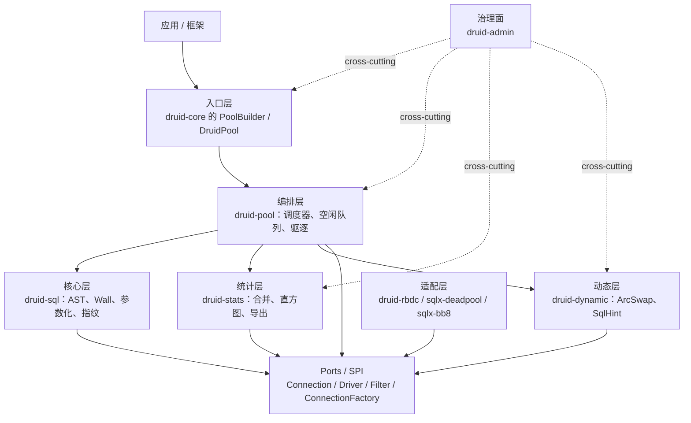

### 7.2 平面或子系统划分

| 平面/子系统 | 负责 | 不负责 | 关键组件 | 对外合同 |
| :--- | :--- | :--- | :--- | :--- |
| 控制面 | 注册表、热切换、治理 | 每个请求的执行 | `druid-dynamic`、`druid-admin` | `SqlHint`、`/druid/admin/*` |
| 数据/执行面 | 请求、SQL 执行、统计 | 治理决策 | `druid-pool`、`druid-sql`、`druid-stats` | `Pool::get()` |
| 适配面 | driver 协议封装 | 横切关注 | 三个 adapter crate | `ConnectionFactory` |
| 管理/观测面 | 状态、诊断、监控 | 修改业务语义 | `druid-admin` | `/metrics`、`/druid/api/*` |

### 7.3 依赖方向

- 高层策略依赖抽象合同，不依赖具体适配器。
- 外部系统通过端口（`ConnectionFactory`）进入，不直接修改核心状态。
- 横切能力通过明确的装饰器（`BeforeFilter` / `AfterFilter`）接入。
- 禁止循环依赖、隐式全局状态、跨边界共享可变对象。
- 每条例外必须有 ADR、限制和移除计划。

---

## 8. 组件、模块与依赖

### 8.1 组件清单

| 组件 | 类型 | 职责 | 输入 | 输出 | 状态 | 所有者 |
| :--- | :--- | :--- | :--- | :--- | :--- | :--- |
| `druid-core` | 核心 | trait 契约 | 无 | trait | `[设计目标]` | maintainers |
| `druid-sql` | 核心 | AST 解析、Wall、参数化 | SQL 文本 | `ParsedStmt` / 拒绝 | `[设计目标]` | maintainers |
| `druid-pool` | 编排 | 池调度、归还、泄漏 | `ConnectionFactory` | `PooledConnection` | `[设计目标]` | maintainers |
| `druid-stats` | 统计 | SQL 合并、直方图、Prometheus | SQL + 参数 | 指标 / 报告 | `[设计目标]` | maintainers |
| `druid-dynamic` | 治理 | 多数据源、读写分离、负载均衡 | 多个 pool | 路由 `PooledConnection` | `[设计目标]` | maintainers |
| `druid-rbdc` | 适配 | 封装 `rbdc::Connection` | URL + driver | `ConnectionFactory` | `[设计目标]` | maintainers |
| `druid-sqlx-deadpool` | 适配 | 封装 `sqlx` + `deadpool` | URL + driver | `ConnectionFactory` | `[设计目标]` | maintainers |
| `druid-sqlx-bb8` | 适配 | 封装 `sqlx` + `bb8` | URL + driver | `ConnectionFactory` | `[设计目标]` | maintainers |
| `druid-admin` | 治理 | axum HTTP | registry 句柄 | JSON + `/metrics` | `[设计目标]` | maintainers |

### 8.2 依赖图

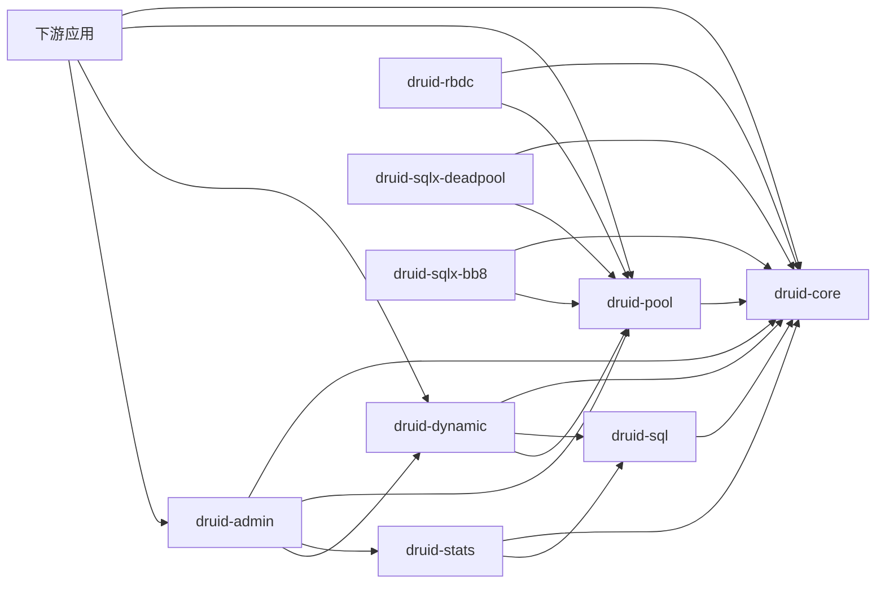

### 8.3 组件合同模板

对每个关键组件填写（当前占位，组件落地后由各自 crate 文档承担）：

| 字段 | 内容 |
| :--- | :--- |
| 组件名 | 见 §8.1 |
| 单一职责 | 一句话定义 |
| 所有输入 | API / events / files / config |
| 所有输出 | results / events / state |
| 拥有状态 | state 与 authority |
| 并发模型 | thread / task / event loop |
| 失败语义 | errors / retry / recovery |
| 资源边界 | CPU / memory / connection |
| 扩展点 | port / SPI / hook |
| 验收证据 | tests / traces |

### 8.4 仓库/工程结构

```text
druid-rust/
├── Cargo.toml
├── rust-toolchain.toml
├── README.md / README.zh-CN.md
├── druid-rust-Architecture.zh_CN.md
├── crates/
│   ├── druid-core/
│   ├── druid-sql/
│   ├── druid-pool/
│   ├── druid-stats/
│   ├── druid-dynamic/
│   ├── druid-rbdc/
│   ├── druid-sqlx-deadpool/
│   ├── druid-sqlx-bb8/
│   └── druid-admin/
└── doc/
    ├── 1..10、druid-rust-…md
    └── V1/1..7、druid-rust-…md
```

目录树由 `cargo new --lib` 与 `mkdir -p` 创建并已 `cargo check` 通过。

---

## 9. 运行时、进程与并发模型

### 9.1 运行单元

| 单元 | 数量/伸缩 | 生命周期 | 并发模型 | 状态归属 | 隔离方式 |
| :--- | :--- | :--- | :--- | :--- | :--- |
| 宿主进程 | 1+（与应用同进程） | 应用生命周期 | `tokio` runtime | 应用所有 | 进程边界 |
| `druid-pool` 调度器 | 1 per pool | pool 生命周期 | async + `parking_lot::Mutex` | pool | 应用内单例 |
| `PooledConnection` | ≤ `max_open` | `Drop` 归还 | 由调度器驱动 | pool 持有 | Drop 语义 |
| `druid-dynamic` | 1 | 应用生命周期 | `ArcSwap::load/store` | 注册表 + 当前组 | 不可变 `Arc` |
| `druid-admin` | 1（独立 HTTP） | axum graceful shutdown | `tokio` task per request | 仅 registry 引用 | 端口隔离 |

### 9.2 调度与并发

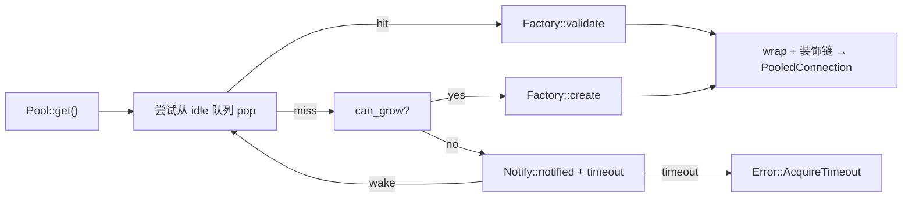

约束：

- 队列满策略：阻塞 + `tokio::time::timeout`，不允许无界等待。
- 取消：`tokio::select!` 由调用方决定；内部 `notify` 不携带取消。
- 上下文传播：tracing span 通过 `PooledConnection::span()` 注入。
- 共享状态：`parking_lot::Mutex<VecDeque<IdleConn>>` + `tokio::sync::Notify`。
- 关闭：`Drop` 链触发 `factory.close`；`druid-admin` 用 axum
  `with_graceful_shutdown`。

### 9.3 并发不变量

| 不变量 | 风险 | 强制机制 | 测试 |
| :--- | :--- | :--- | :--- |
| `PooledConnection::drop` 必须归还连接 | 连接泄漏 | `Drop` 实现 + 计数器 | 压测 + 持有时长断言 |
| `ArcSwap` 切换期间不会出现"半态" | 跨版本请求 | `ArcSwap::store` 原子 | 切换风暴测试 |
| 过滤器异常不阻塞主链 | 单个 filter 抛错导致后续 SQL 被吞 | 每个 filter `catch_unwind` | chaos 测试 |
| Wall 拒绝的 SQL 不进入 `Connection::exec` | 绕过 | 在 `before_execute` 阶段短路 | 集成测试 |

---

## 10. 核心业务与系统主链

### 10.1 主成功路径

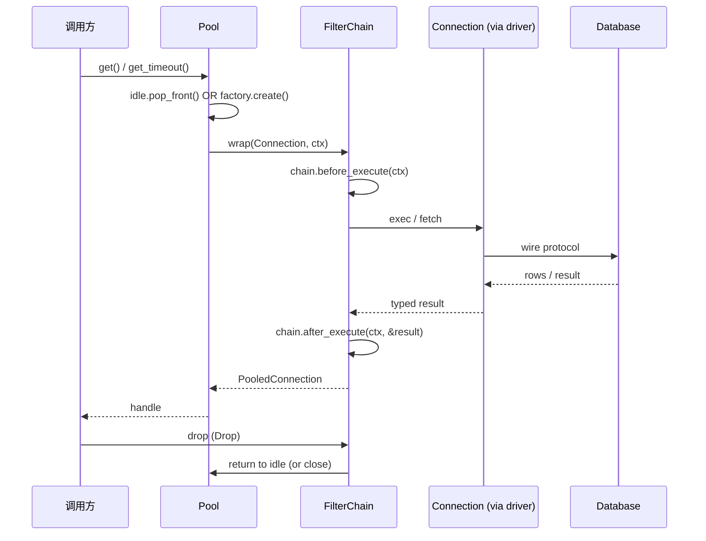

### 10.2 主链步骤表

| 步骤 | 组件 | 输入 | 处理 | 输出 | 超时 | 失败动作 |
| :---: | :--- | :--- | :--- | :--- | :--- | :--- |
| 1 | `druid-pool` | `get()` | 空闲队列 / 创建 | `PooledConnection` | 来自 `acquire_timeout` | `Error::AcquireTimeout` |
| 2 | `FilterChain` | SQL + params | `before_execute` 短路 | 进入下一步 / 拒绝 | 每个 filter ≤ 1ms | 抛 `Error::WallViolation` |
| 3 | `Connection::exec` | SQL + params | driver 协议调用 | `ExecResult` / `Vec<Row>` | 由 driver 决定 | 透传 `Result::Err` |
| 4 | `FilterChain` | `Result` | `after_execute` 反向遍历 | 透传 + 统计 | 每个 filter ≤ 1ms | filter 错误吞掉 |
| 5 | `Drop` | handle | 归还 / 关闭 | 无 | 无 | 强制 close |

### 10.3 异常路径

- 输入非法：`druid-sql` 解析失败 → `Error::SqlParse`。
- 未授权：宿主应用层负责（druid-rust 不参与）。
- 依赖超时：driver 返回 `Error::Timeout` → `FilterChain::after` 记录
  慢 SQL 指标。
- 部分成功：事务边界由 `begin/commit/rollback` 显式管理。
- 重复请求：druid-rust 不做去重；幂等由宿主业务保证。
- 取消：`tokio::select!` 取消后驱动方法返回 `Error::Cancelled`，drop 仍
  归还。
- 节点重启：`Drop` 链触发 `factory.close`，避免半挂连接。
- 状态冲突：池内部 `IdleConn` 状态机由 `try_transition` CAS 保护。

### 10.4 多流模型

| 流 | 方向 | 主体 | 状态变化 | 回复/ACK |
| :--- | :--- | :--- | :--- | :--- |
| 同步请求流 | 应用 → pool → driver | `PooledConnection` | 即时事务 | `Result` |
| 控制流 | 控制面 → pool | 配置 / 热切换 | 版本化 | `ArcSwap` 立即生效 |
| 观测流 | pool → Prometheus | 指标 / 日志 | 只追加 | `text/plain; version=0.0.4` |
| 治理流 | `/druid/admin` → registry | HTTP | 即时 | JSON |

---

## 11. 状态机、生命周期与任务模型

### 11.1 核心状态机

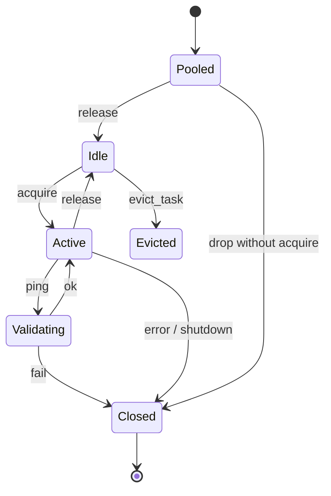

### 11.2 状态转换表

| 当前状态 | 事件 | 守卫条件 | 动作 | 新状态 | 幂等语义 |
| :--- | :--- | :--- | :--- | :--- | :--- |
| Pooled | acquire | pool 非满 | 进入 Active | Active | 重复 acquire 拿到不同连接 |
| Active | release | 未取消 | 重新入队 | Idle | 重复 release 丢弃第二次 |
| Idle | ping | `test_while_idle` | 验证 + 保留 | Idle | 验证失败 → Closed |
| Idle | evict | `idle > max_idle` | 关闭 | Closed | 无 |
| Closed | drop | n/a | noop | Closed | 幂等 |

### 11.3 生命周期

| 阶段 | 责任 | 外部可见状态 | 失败处理 |
| :--- | :--- | :--- | :--- |
| 构造 | `PoolBuilder::build()` 预热可选 | `starting` | `factory.create` 失败 → `Error::PoolInit` |
| 运行 | 接收请求、维护 idle | `ready` | 单连接失败隔离 |
| 排空 | 关闭入口、等待 in_use 归零 | `draining` | deadline 后强制关闭 |
| 停止 | `Drop` → `factory.close` | `stopped` | 幂等关闭 |

---

## 12. 数据、状态与一致性

### 12.1 数据分类与权威来源

| 数据 | 权威来源 | 读写方 | 生命周期 | 敏感级别 | 备份/清理 |
| :--- | :--- | :--- | :--- | :--- | :--- |
| 连接对象 | driver adapter | `druid-pool` | 应用周期 | 高 | `Drop` 关闭 |
| 空闲队列 | `druid-pool` | 调度器 | pool 周期 | 低 | 进程退出清理 |
| SQL 指纹表 | `druid-stats` | filter chain | TTL 可配 | 低 | moka 自动过期 |
| 数据源注册表 | `druid-dynamic` | 应用 + `druid-admin` | 进程周期 | 中 | 重启即清 |
| 指标快照 | `druid-stats` | Prometheus 抓取 | 30s 间隔 | 低 | 进程退出清 |

### 12.2 数据模型

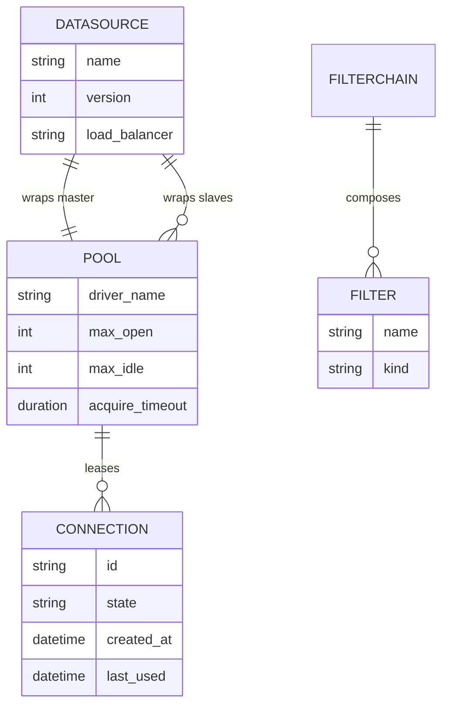

### 12.3 一致性与事务

| 场景 | 一致性要求 | 机制 | 冲突处理 | 补偿 |
| :--- | :--- | :--- | :--- | :--- |
| `PooledConnection` 借用与归还 | 强一致 | `Drop` + `parking_lot::Mutex` | 双归还 → noop | 无 |
| 数据源切换 | 强一致 | `ArcSwap::store` | 旧引用继续服务直到归零 | 无 |
| 过滤器链事件 | 至少不丢 | 每个 filter 独立调用 | filter panic → `catch_unwind` | 记录 |
| 指标聚合 | 最终一致 | `moka` TTL + Prometheus 抓取 | 过期被回收 | 无 |

---

## 13. 接口、协议与互操作

### 13.1 接口清单

| 接口 | 提供方 | 使用方 | 协议 | 版本 | 认证 | 稳定性 |
| :--- | :--- | :--- | :--- | :--- | :--- | :--- |
| `trait Connection` | `druid-core` | 应用 + 适配器 | Rust trait | v0 | n/a | 设计目标 |
| `trait Pool` | `druid-core` | 应用 | Rust trait | v0 | n/a | 设计目标 |
| `trait ConnectionFactory` | `druid-core` | 适配器 | Rust trait | v0 | n/a | 设计目标 |
| `BeforeFilter` / `AfterFilter` | `druid-core` | 应用 | Rust trait | v0 | n/a | 设计目标 |
| `/druid/admin/*` | `druid-admin` | 运维 | HTTP/JSON | v0 | 接入层负责 | 设计目标 |
| `/metrics` | `druid-admin` | Prometheus | text/plain | v0 | n/a | 设计目标 |

### 13.2 标准消息信封（监控 API 示例）

```json
{
  "id": "ds-main",
  "kind": "DataSourceInfo",
  "driver": "postgres",
  "state": {
    "max_open": 20,
    "in_use": 3,
    "idle": 17,
    "waits": 0
  },
  "fetchedAt": "2026-07-27T12:00:00Z"
}
```

### 13.3 协议语义

- HTTP/JSON：版本协商通过 URL 路径 `/druid/api/<v>`，未指定即 v0。
- Prometheus：标准文本格式，标签基数受 `druid-stats::MergeConfig` 限制。
- Rust trait：内部 crate 间通过 Rust 版本（`rust-version = "1.75"`）保证
  ABI 与 API 兼容。

### 13.4 错误合同

| 错误码 | 分类 | 是否重试 | 调用方动作 | 是否告警 |
| :--- | :--- | :---: | :--- | :---: |
| `AcquireTimeout` | 资源 | 条件重试 | 退避后重试 | 是 |
| `PoolInit` | 启动 | 否 | 检查 URL / 凭据 | 是 |
| `SqlParse` | 输入 | 否 | 修正 SQL | 否 |
| `WallViolation` | 安全 | 否 | 移除危险语句 | 是 |
| `DriverError` | 依赖 | 视情况 | 用 correlation ID | 视错误 |

---

## 14. 配置、特性开关与秘密

### 14.1 配置来源与优先级

```text
Runtime override
  > environment / secret reference
  > deployment profile
  > configuration file
  > safe default
```

### 14.2 配置分层

| 层 | 内容 | 所有者 | 是否热更新 | 失败行为 |
| :--- | :--- | :--- | :---: | :--- |
| 全局 | 安全基线、Wall 默认 | 平台 | 否 | fail fast |
| 环境 | endpoint、容量 | 运维 | 否 | 启动失败 |
| 租户 | 数据源路由、配额 | 业务管理员 | 是（`druid-dynamic`） | 单租户拒绝 |
| 实例 | 本机资源 | 节点 | 重启 | 节点不可用 |

### 14.3 配置合同（示例）

```toml
[druid]
max_open           = 20
max_idle           = 4
acquire_timeout_ms = 3000
test_while_idle    = true
slow_sql_ms        = 500

[druid.sql]
deny_drop_table    = true
deny_truncate      = true
update_where       = "required"
delete_where       = "required"

[druid.dynamic]
switch_strategy    = "lock-free"
load_balancer      = "round_robin"

[druid.admin]
bind               = "0.0.0.0:8080"
```

### 14.4 Feature flag

| Flag | 默认 | 风险 | 作用域 | 退出条件 | 清理日期 |
| :--- | :---: | :--- | :--- | :--- | :--- |
| `druid-sql/postgres-dialect` | off | 低 | 进程 | 灰度 2 周 | 待定 |
| `druid-sqlx-deadpool/postgres` | off | 中 | 进程 | 灰度 4 周 | 待定 |
| `druid-admin/tls` | off | 中 | 进程 | 灰度 4 周 | 待定 |

---

## 15. 安全、隐私与信任边界

### 15.1 威胁模型

| 资产 | 威胁主体 | 威胁 | 影响 | 防护 | 残余风险 |
| :--- | :--- | :--- | :--- | :--- | :--- |
| 数据库凭据 | 外部 / 内部 | 泄漏、滥用 | 极高 | SecretRef / 最小权限 / 轮换 | 中 |
| 数据库表 | 应用 bug | `DROP TABLE` 误执行 | 极高 | Wall 默认 deny + `update_where` | 低 |
| 池内连接 | 内部 | 泄漏（忘记 `Drop`） | 高 | `Drop` 强归还 + 持有时长告警 | 中 |
| 监控端点 | 外部 | 越权读指标 | 中 | 接入层鉴权（druid-rust 不内置） | 中 |
| Prometheus 标签 | 内部 | 高基数 OOM | 中 | `MergeConfig` 容量 + 标签白名单 | 低 |

### 15.2 零信任处理链


### 15.3 身份与权限

- 数据库身份：由驱动配置决定；druid-rust 不持有。
- 治理端身份：由宿主 Web 框架或反向代理提供；druid-admin 不内置 auth。
- 内部 trait：默认要求 `Send + Sync`；不暴露 `unsafe`。

### 15.4 秘密与加密

- 凭据不进入代码、配置样例、日志、指标、追踪。
- 传输加密依赖 driver 的 TLS 配置；druid-rust 不重复包装。
- 静态加密仅 SQLite adapter 由驱动决定（不在 V1 范围）。

### 15.5 隔离

| 边界 | 隔离机制 | 可共享 | 禁止共享 | 验证 |
| :--- | :--- | :--- | :--- | :--- |
| 池之间 | URL / driver | 配置 | 共享连接 | 集成测试 |
| filter 之间 | 调用链 | span | 共享可变状态 | 单元测试 |
| 数据源之间 | `ArcSwap` | 注册表 | 跨组连接 | 切换测试 |

### 15.6 隐私与审计

- 日志中禁止打印 SQL 字面量参数值（仅打印指纹）。
- 指标标签不含 PII；唯一标签为 `data_source` 与 `sql_fingerprint`。
- 漏洞披露渠道将在首次发布前建立。

---

## 16. 可靠性、失败与恢复

### 16.1 SLO 与恢复目标

| 指标 | 目标 | 测量窗口 | 降级阈值 | 责任方 |
| :--- | :--- | :--- | :--- | :--- |
| 可用性 | `≥ 99.9%`（应用级） | 30d | n/a | 宿主应用 |
| P95 池获取 | `< 1ms`（设计目标） | 5m | `> 10ms` 告警 | maintainers |
| RTO | `< 5min`（应用级） | incident | n/a | 宿主应用 |
| RPO | `0`（无状态） | incident | n/a | maintainers |

### 16.2 失败模式

| 失败 | 检测 | 局部影响 | 系统行为 | 恢复 | 数据风险 |
| :--- | :--- | :--- | :--- | :--- | :--- |
| 单连接错误 | driver 返回 Err | 单请求 | 关闭该连接 + 重试一次 | 自动 | 无 |
| 池满 | `acquire_timeout` | 单请求 | 返回 `AcquireTimeout` | 上层退避 | 无 |
| 数据源不可用 | `factory.create` 失败 | 数据源 | 上层路由降级 | 切换 / 告警 | 无 |
| 过滤器异常 | panic | 单 SQL | 吞掉 + 记录 | 应用继续 | 监控缺失 |
| 进程退出 | 操作系统 | 全局 | 连接被 OS 关闭 | 重启 | 无（无状态） |

### 16.3 重试、幂等与退避

- 仅在 driver 明确返回"可重试"错误时上层才重试；druid-rust 不内置重试。
- 事务由 `begin/commit/rollback` 显式管理；druid-rust 不做隐式补偿。
- 过滤器 `after_execute` 失败必须 `catch_unwind` 吞掉，不影响主链。

### 16.4 降级、熔断与隔离舱

| 能力 | 正常 | 降级 | 触发 | 恢复条件 |
| :--- | :--- | :--- | :--- | :--- |
| 池获取 | 阻塞 + 超时 | 立即返回 `AcquireTimeout` | `in_use == max_open` | 有空闲 |
| 数据源 | 主库 + 备库 | 只读备库 | 主库 `ping` 失败 | 主库恢复 |
| Wall | 拦截 | 放行（告警） | 解析失败 | 解析器修复 |

### 16.5 灾难恢复

druid-rust 是无状态库，DR 由宿主应用负责。本节给出对宿主的最小建议：

```text
detect → isolate → drain pool → restart process → re-resolve data source
```

---

## 17. 性能、容量与资源预算

### 17.1 工作负载模型

| 场景 | 并发/频率 | 载荷 | 状态规模 | 峰值特征 |
| :--- | :--- | :--- | :--- | :--- |
| Web 请求同步查询 | `max_open` 并发 | < 1KB SQL | 池内连接数 | 突发 |
| 后台 worker | 长连接复用 | 大结果集 | 池内连接数 | 持续 |
| 多租户切换 | 偶发 | 整组配置 | `DataSourceGroup` | 罕见 |

### 17.2 性能预算（设计目标，未测量）

| 阶段 | P50 | P95 | P99 | 超时 | 预算来源 |
| :--- | :---: | :---: | :---: | :---: | :--- |
| 池获取（热） | 100ns | 200ns | 1µs | n/a | 借鉴 `deadpool` 实测 |
| 解析 + 参数化 | 10µs | 30µs | 100µs | n/a | sqlparser 0.52 实测 |
| Wall 检查 | 5µs | 20µs | 100µs | n/a | sqlparser AST walk |
| 过滤器链合计 | 20µs | 100µs | 500µs | n/a | 上限取应用级 SLO |
| driver 执行 | 视 SQL | 视 SQL | 视 SQL | driver | 业务 SLO |

### 17.3 容量公式

```text
required_concurrency ≈ peak_qps × p95_service_time_seconds
queue_budget = burst_rate × tolerated_burst_duration
memory_budget ≈ baseline + active_conns × per_conn + stats_fingerprints × per_fp
```

### 17.4 资源档位（设计目标）

| Profile | CPU | 内存 | 连接数 | 启用能力 | 裁剪能力 |
| :--- | :--- | :--- | :--- | :--- | :--- |
| lite | 应用同进程 | < 10MB 开销 | `max_open=8` | core | 多数据源 |
| server | 应用同进程 | < 50MB 开销 | `max_open=64` | 全量 | 无 |
| cluster | 同 server | 同 server | `max_open=256` | 全量 | 无 |

---

## 18. 部署、升级与回滚

### 18.1 部署拓扑

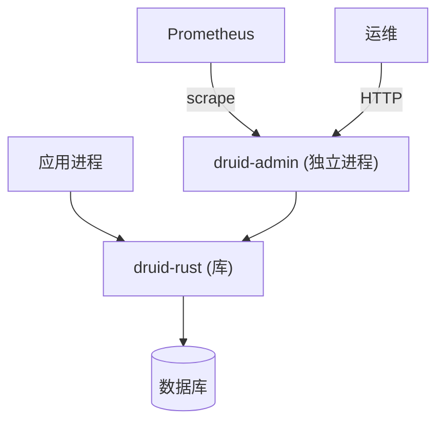

### 18.2 部署形态

| 形态 | 组件 | 适用 | 可用性 | 复杂度 | 限制 |
| :--- | :--- | :--- | :--- | :--- | :--- |
| 嵌入式 | 库 + 业务 | 应用 | 跟随业务 | 低 | 进程崩溃 = 重启 |
| 治理面独立 | 库 + `druid-admin` | 生产 | 中 | 中 | admin 端口需保护 |

### 18.3 启动与自检

```text
load config → validate schema → build factory → open N connections (warmup)
→ register handlers → readiness=true
```

启动报告至少包括：版本、`profile`、启用的 adapter、Wall 默认、数据源
注册表大小。**不输出**任何凭据或参数字面量。

### 18.4 升级与回滚

| 变更 | 策略 | 向前兼容 | 回滚条件 | 数据限制 |
| :--- | :--- | :--- | :--- | :--- |
| trait 签名 | minor / major | SemVer | CI 拒绝破坏变更 | 适配器需同步升级 |
| Wall 规则 | minor | 是 | 配置可回退 | 无 |
| `/druid/admin` 路径 | major | v0/v1 共存窗口 | 旧客户端清空 | URL 兼容 |
| 数据源配置 | 热切换 | 是 | `ArcSwap` 立即 | 无 |

---

## 19. 可观测性、运维与诊断

### 19.1 观测模型

| 信号 | 必需字段 | 用途 | 基数/隐私约束 |
| :--- | :--- | :--- | :--- |
| 日志 | time、level、component、trace_id、error_code | 排障 | 不打印 SQL 参数值 |
| 指标 | `druid_pool_*`、`druid_sql_*`、`druid_filter_*` | 容量 + 性能 | 标签 `data_source`、`sql_fingerprint` |
| 追踪 | span per `exec` | 主链定位 | 敏感属性脱敏 |
| 审计 | 无（由宿主负责） | 治理追责 | — |

### 19.2 健康与就绪

| 检查 | 含义 | 失败影响 | 是否摘流量 |
| :--- | :--- | :--- | :---: |
| liveness | 进程能继续运行 | 重启 | 是 |
| readiness | 池可服务 | 暂停流量 | 是 |
| dependency | 数据源 ping | 降级或拒绝 | 视能力 |
| self-check | 配置 / Wall 规则 / schema | 人工处理 | 否 |

### 19.3 告警与 Runbook（设计目标）

| 告警 | 条件 | 级别 | 首个动作 | Runbook |
| :--- | :--- | :--- | :--- | :--- |
| `druid_pool_in_use == max_open` 持续 5min | 高负载 | P2 | 检查慢 SQL | 待定 |
| `druid_sql_wall_violations` 突增 | Wall 触发 | P2 | 检查调用方 | 待定 |
| `druid_dynamic_switch_latency_us > 1000` | 切换慢 | P3 | 检查注册表大小 | 待定 |
| `druid_filter_after_execute_errors` > 0 | filter panic | P1 | 拉日志 | 待定 |

### 19.4 运维命令合同

```text
GET  /druid/api/datasources      → list + state
GET  /druid/api/sql/top?limit=N  → top slow SQL
GET  /druid/api/sql/slow         → slow SQL since T
GET  /druid/api/wall             → recent violations
GET  /druid/api/active           → active connections (no PII)
GET  /metrics                    → Prometheus text format
```

所有响应均为 JSON，无内部凭据；`/metrics` 为 Prometheus 标准文本格式。

---

## 20. 扩展、插件与生态边界

### 20.1 扩展点

| 扩展点 | 合同 | 生命周期 | 权限 | 隔离 | 兼容策略 |
| :--- | :--- | :--- | :--- | :--- | :--- |
| `ConnectionFactory` | trait | 应用构建 | 默认无 | 应用进程 | SemVer |
| `BeforeFilter` / `AfterFilter` | trait | pool 构建 | 默认无 | filter 链 | SemVer |
| `LoadBalancer`（dynamic） | trait | 注册 | 默认无 | 数据源 | SemVer |
| `WallConfig` | 配置结构 | pool 构建 | 默认可 deny | n/a | 配置 schema |

### 20.2 加载与调用链

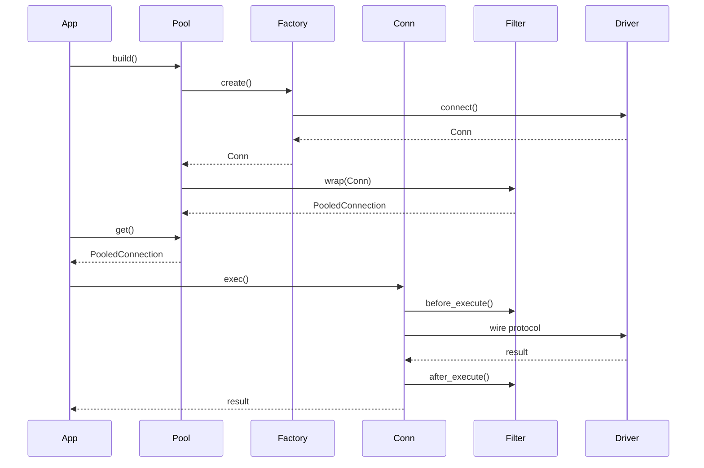

### 20.3 扩展治理

- 发现：编译期 `dyn` 注册；无运行时反射。
- 清单：每个 adapter 单独 crate，名字见 `Cargo.toml` members。
- 版本协商：依赖锁定在 `[workspace.dependencies]`，升级走 `cargo update`。
- 隔离：所有扩展运行在宿主进程；不在 V1 范围提供 WASM / 进程隔离。
- 资源配额：`max_open` 由宿主控制；druid-rust 不强制。
- 供应链：`cargo audit` + `cargo deny` 在 §13 列出的计划门禁中。

---

## 21. 兼容、迁移与演进

### 21.1 兼容矩阵

| druid-rust 版本 | API | 配置 | 数据 | 插件 | 状态 |
| :--- | :--- | :--- | :--- | :--- | :--- |
| V1.0.0-DESIGN | 设计目标 | 设计目标 | n/a | n/a | 草案 |

### 21.2 兼容合同

- 源码兼容：通过 trait + 适配器；`druid-core` 升级走 SemVer。
- 协议兼容：`/druid/admin` URL 路径版本化；`/metrics` 走 Prometheus 标准。
- 数据兼容：druid-rust 不持久化业务数据；指标由 Prometheus 持有。
- 行为兼容：Wall 默认 deny 列表在 major 版本前不变。

### 21.3 迁移流程


### 21.4 弃用与演进

| 旧合同 | 新合同 | 弃用版本 | 移除版本 | 自动迁移 | 用户动作 |
| :--- | :--- | :--- | :--- | :---: | :--- |
| （暂无） | — | — | — | — | — |

---

## 22. 测试、验证与架构验收

### 22.1 证据金字塔

| 层 | 验证对象 | 示例 |
| :--- | :--- | :--- |
| 静态 | 依赖方向、unsafe、配置 | `cargo check`、`cargo clippy -D warnings` |
| 单元/属性 | trait 不变量、Wall 规则 | `cargo test` |
| 契约 | `ConnectionFactory` API | trait test |
| 集成 | driver + pool 真实路径 | testcontainers |
| 系统/E2E | `/druid/admin` | curl smoke |
| 混沌 | filter panic、连接泄漏 | chaos test |
| 性能 | 池获取、Wall 检查 | bench |

### 22.2 架构验收矩阵（设计目标）

| 架构声明 | 验收用例 | 环境 | 通过条件 | 证据 |
| :--- | :--- | :--- | :--- | :--- |
| `druid-core` 零外部依赖 | `cargo tree -p druid-core` | CI | 不含 driver / parser | report |
| `unsafe_code = forbid` | `cargo clippy` | CI | 零警告 | report |
| Wall 阻断 `DROP TABLE` | 集成测试 | CI | `Err(WallViolation)` | report |
| `PooledConnection::drop` 归还 | 压测 | CI | 计数器归零 | report |
| `ArcSwap` 切换不丢请求 | 切换风暴 | CI | 错误率 < 阈值 | report |

### 22.3 架构一致性检查

- 图中的组件在源码或 Cargo manifest 中存在或明确标 `[设计目标]`。
- 配置键、协议字段、模块名与未来实现保持一致（命名收敛中）。
- 所有主链都有成功、失败、超时、取消、恢复路径。
- 部署拓扑与运行依赖一致（库 + 可选独立进程）。
- 双语 README 与本架构文档的术语、版本、能力状态一致。

---

## 23. 风险、技术债与实施路线

### 23.1 风险登记

| ID | 风险 | 概率 | 影响 | 触发信号 | 缓解 | 负责人 |
| :--- | :--- | :---: | :---: | :--- | :--- | :--- |
| `R-001` | API 漂移导致横切层失效 | 中 | 高 | 适配器 trait 升级 | 严格 SemVer + ADR | maintainers |
| `R-002` | sqlparser-rs 破坏性升级 | 中 | 高 | 新版本无法编译 | 锁版本 + 适配层 | maintainers |
| `R-003` | 上游 sqlx / deadpool / bb8 重大变更 | 中 | 中 | CI 失败 | workspace 锁定 + 适配器隔离 | maintainers |
| `R-004` | Wall 误杀合法 SQL | 中 | 中 | 单元测试失败 | 白名单 + dry-run 模式 | maintainers |
| `R-005` | ArcSwap 在事务内切换导致跨版本读 | 低 | 高 | 集成测试 | 切换前排空事务 | maintainers |
| `R-006` | 指标高基数 OOM | 低 | 中 | Prometheus 报警 | 容量 + 标签白名单 | maintainers |
| `R-007` | `rbdc` 维护停滞 | 中 | 中 | release 频率下降 | 退而不接 `druid-rbdc` | maintainers |

### 23.2 技术债

| 债 | 当前代价 | 目标 | 偿还阶段 | 退出条件 |
| :--- | :--- | :--- | :--- | :--- |
| 无 CI / 无 benchmark | 设计与实现脱钩 | §13 / §14 门禁 | Phase 1 | CI 通过 |
| 无 trait 测试 | 横切层不变量无证 | 单元测试 | Phase 1 | 通过覆盖率门 |
| 无 SQL 合并率统计 | 统计层无法验证 | 合并率 ≥ 90% | Phase 2 | 基准报告 |

### 23.3 实施路线

| 阶段 | 架构交付物 | 退出条件 | 依赖 | 回退 |
| :--- | :--- | :--- | :--- | :--- |
| Phase 0 | 占位骨架 + 设计文档（当前） | `cargo check --workspace` 通过 | toolchain | 删除骨架 |
| Phase 1 | `druid-core` + `druid-sql` + `druid-pool` + mock driver | `SELECT 1` 端到端；Wall 拦截 `DROP TABLE` | Phase 0 | 退回 `deadpool` 直用 |
| Phase 2 | `druid-stats` + 三个 adapter | Prometheus 导出可用；任一 adapter 冒烟通过 | Phase 1 | 跳过对应 adapter |
| Phase 3 | `druid-dynamic` + `druid-admin` | 热切换 demo；JSON API 可用 | Phase 2 | 不暴露 admin |

### 23.4 架构完成定义

- [ ] 当前态与目标态可区分（本文 §5）。
- [ ] 边界、模块、状态与数据所有者明确（§4、§7、§8、§12）。
- [ ] 核心主链与异常恢复有图、有表、有测试（§10、§11、§22）。
- [ ] 安全、性能、可靠性与运维目标可测（§15、§16、§17、§19）。
- [ ] 接口、配置、插件与迁移合同有版本策略（§14、§20、§21）。
- [ ] ADR、风险、技术债与路线有负责人与退出条件（§6、§23）。

---

## 24. 附录

### 附录 A：术语表

| 术语 | 定义 | 禁止混用 |
| :--- | :--- | :--- |
| `Connection` | `druid-core` 暴露的 trait，是所有横切层的拦截点 | `db::Connection`、`sqlx::Connection` |
| `Driver` | 与数据库协议无关的"驱动抽象" | `sqlx::Pool`、`deadpool::Pool` |
| `Pool` | trait，由 `druid-pool` 实现 | `r2d2::Pool` |
| `Filter` | 横切关注单元；拆分为 `BeforeFilter` 与 `AfterFilter` | 拦截器、AOP 字节码 |
| `Wall` | SQL 防火墙；走 sqlparser-rs AST | regex 注入检测 |
| `SqlMerger` | 把 SQL 字面量参数化后取指纹，作为统计 key | 字符串模板 |
| `DynamicDataSource` | `druid-dynamic` 的多数据源入口 | `MultiDbConfig` |
| `ArcSwap` | lock-free 的 `Arc<T>` 替换原语 | `RwLock<Arc<T>>` |
| `ConnectionFactory` | 适配器实现该 trait，向 pool 提供新连接 | 自定义 trait |
| `PooledConnection` | RAII 句柄，`Drop` 自动归还 | `Mutex<Connection>` |

### 附录 B：ADR 模板

```markdown
# ADR-NNN：决策标题

- 状态：提议 / 已批准 / 已废弃
- 日期：YYYY-MM-DD
- 决策者：角色

## 上下文
## 架构驱动与约束
## 候选方案
## 决策
## 正向与负向后果
## 验证方式
## 反转条件
```

### 附录 C：接口/协议合同模板

| 字段 | 内容 |
| :--- | :--- |
| 名称与版本 | `druid_core::Connection / v0` |
| 提供方/使用方 | `druid-core` / 应用 + 适配器 |
| 输入/输出 Schema | trait 方法签名 |
| 认证与授权 | n/a |
| 超时/重试/幂等 | 由 driver 决定 |
| 错误与恢复 | `druid_core::Error` + `Result` |
| 兼容窗口 | 与 `druid-core` SemVer 对齐 |
| 契约测试 | trait test |

### 附录 D：修订历史

| 版本 | 日期 | 变更 | 作者 | 评审 |
| :--- | :--- | :--- | :--- | :--- |
| V1.0.0-DESIGN | 2026-07-27 | 初始架构基线（设计阶段） | druid-rust maintainers | 待评审 |

---

## 25. 示意代码集

> **重要声明**：本节所有 Mermaid 图与 Rust 代码片段均为 `[设计草图]`，
> 仅用于传达架构意图。crate 名、模块路径、trait 签名、配置键与
> 错误枚举在 Phase 1 落地前都可能调整。**不要**将这些片段复制到生产
> 代码或对外 API 文档。

### 25.1 整体组件装配（一个画面看清全部 crate 的接线）

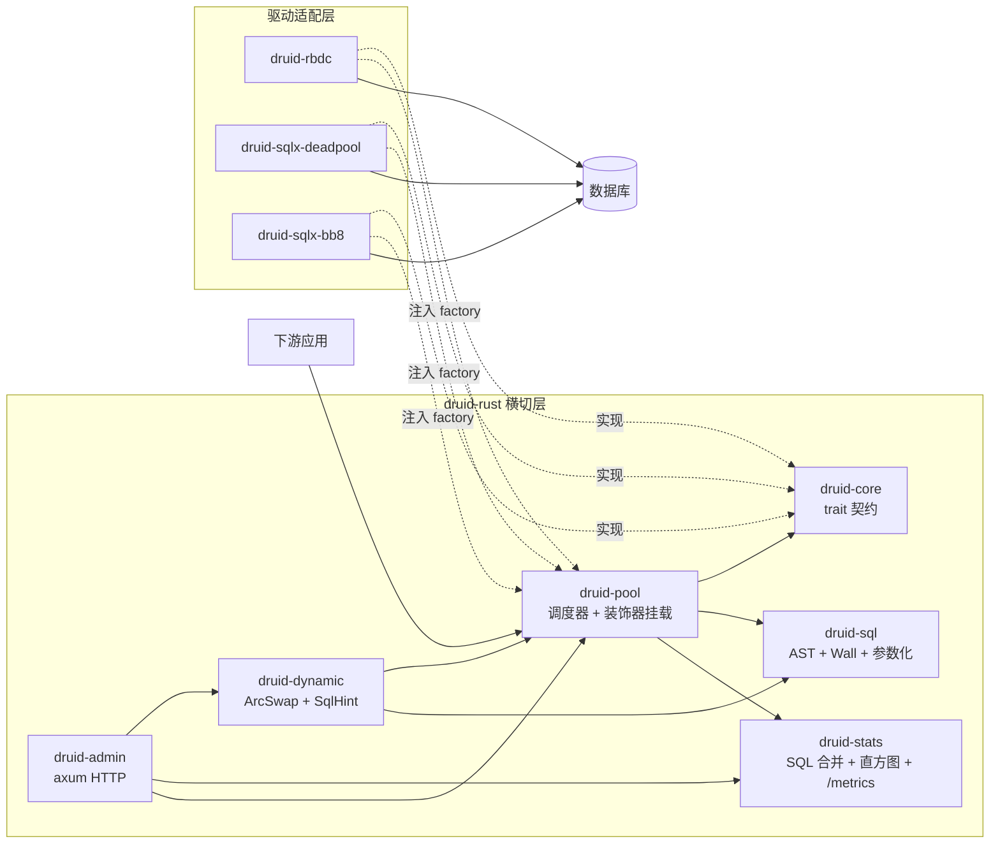

### 25.2 装饰器挂载时序图（druid-rust 的核心拦截机制）

> 设计意图：druid-rust **不修改**底层 pool，只在 pool 返回的 connection 上
> 套一层 `DecoratedConnection`，filter 链就挂在这层。

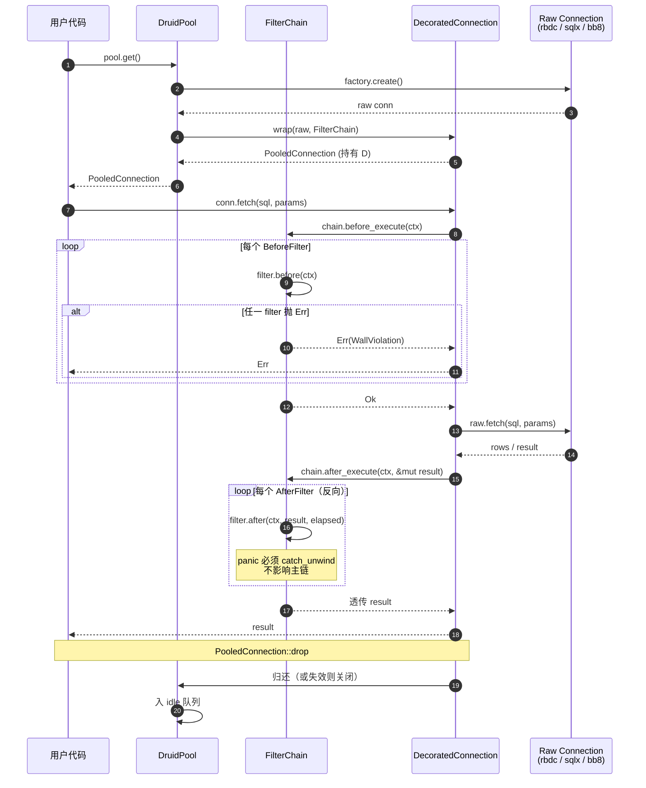

### 25.3 ArcSwap 热切换时序图（V3 能力）

> 设计意图：`ArcSwap::store` 是原子操作，旧 `Arc<DataSourceGroup>` 在
> 引用计数归零前不会被释放，因此**切换期间不会出现"半态"**。

```mermaid
sequenceDiagram
    autonumber
    participant Ops as 运维 / 配置中心
    participant D as DynamicDataSource
    participant AS as ArcSwap&lt;DataSourceGroup&gt;
    participant New as 新 Pool
    participant Old as 旧 Pool
    participant App as 应用请求

    Ops->>D: switch("main_v2")
    D->>New: build_pool(cfg_v2) + warmup()
    New-->>D: ready
    D->>AS: store(Arc::new(new_group))
    Note over AS: 此刻 store 是原子的<br/>旧 group 不会被同时看到

    par 并发请求 A
        App->>D: route(SqlHint::Write)
        D->>AS: load()
        AS-->>D: Arc&lt;new_group&gt;
        D->>New: master.get()
        New-->>App: PooledConnection
    and 并发请求 B
        App->>D: route(SqlHint::Write)
        D->>AS: load()
        AS-->>D: Arc&lt;new_group&gt;
        D->>New: master.get()
        New-->>App: PooledConnection
    end

    Note over Old: 旧 group 的 Arc 引用计数 = 0<br/>自动 drop，旧 pool 的连接<br/>在归还时正常关闭
```

### 25.4 Wall 拦截流程图（V1 核心安全能力）

> 设计意图：Wall 在 `BeforeFilter` 阶段执行，**SQL 不进入 `Connection::exec`**
> 即被拒绝，避免污染执行路径。

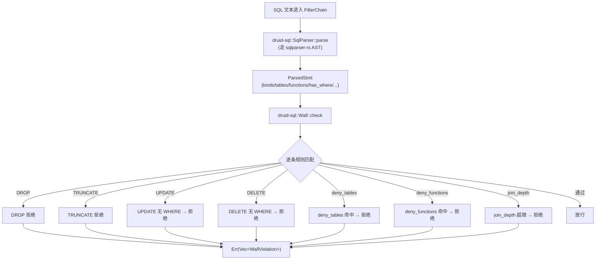

### 25.5 SQL 合并与指纹（V2 统计核心）

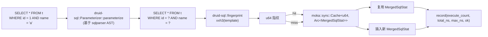

### 25.6 Filter panic 隔离（`catch_unwind` 边界）

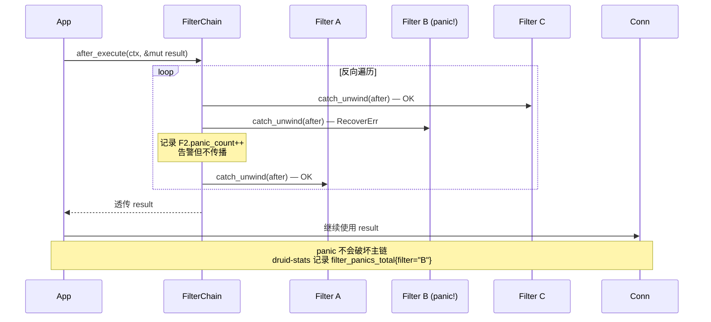

### 25.7 Rust 示意代码集（每个模块一段）

> 以下 6 段均标 `[设计草图]`，签名与 crate 路径随时可能变化。

#### 25.7.1 `druid-core` 入口（trait 契约）

```rust
// [设计草图] — crates/druid-core/src/lib.rs
#![forbid(unsafe_code)]

use std::future::Future;
use std::pin::Pin;

pub type BoxFuture<'a, T> = Pin<Box<dyn Future<Output = T> + Send + 'a>>;

pub mod error;
pub mod value;
pub mod pool;
pub mod connection;
pub mod filter;

pub use error::Error;
pub use value::Value;
pub use connection::{Connection, Row, ExecResult};
pub use pool::{Pool, PooledConnection, PoolState, ConnectionFactory};
pub use filter::{BeforeFilter, AfterFilter, ExecContext};
```

#### 25.7.2 `druid-sql` AST 适配层

```rust
// [设计草图] — crates/druid-sql/src/ast/mod.rs
use sqlparser::{dialect::Dialect, parser::Parser, ast::Statement};

pub enum StmtKind {
    Select,
    Insert,
    Update { has_where: bool },
    Delete { has_where: bool },
    Create, Alter, Drop, Truncate,
    Other(String),
}

pub struct ParsedStmt {
    pub kind: StmtKind,
    pub tables: Vec<String>,
    pub functions: Vec<String>,
    pub has_where: bool,
    pub join_depth: u32,
    pub is_read_only: bool,
}

pub struct SqlParser { dialect: Box<dyn Dialect> }

impl SqlParser {
    pub fn new(driver: &str) -> Self { /* 按 driver 选方言 */ Self { /* */ } }
    pub fn parse(&self, sql: &str) -> Result<Vec<ParsedStmt>, ParseError> {
        let ast = Parser::parse_sql(&*self.dialect, sql)?;
        Ok(ast.iter().map(convert_statement).collect())
    }
}

fn convert_statement(stmt: &Statement) -> ParsedStmt { /* sqlparser AST → ParsedStmt */ unimplemented!() }
```

#### 25.7.3 `druid-pool` 装饰器挂载

```rust
// [设计草图] — crates/druid-pool/src/inner.rs
use std::time::{Duration, Instant};
use parking_lot::Mutex;
use tokio::sync::Notify;
use druid_core::{BoxFuture, Connection, ConnectionFactory, Error, PooledConnection};

pub struct PoolInner {
    factory: Box<dyn ConnectionFactory>,
    idle: Mutex<VecDeque<IdleConn>>,
    waiter: Notify,
    config: PoolConfig,
}

impl PoolInner {
    pub async fn acquire(&self, timeout: Duration) -> Result<PooledConnection, Error> {
        let deadline = Instant::now() + timeout;
        loop {
            if let Some(mut conn) = self.idle.lock().pop_front() {
                if self.factory.validate(&mut conn).await.is_ok() {
                    return Ok(self.wrap(conn));
                }
                continue;
            }
            if self.can_grow() {
                match self.factory.create().await {
                    Ok(c) => return Ok(self.wrap(c)),
                    Err(_) if !self.idle.lock().is_empty() => continue,
                    Err(e) => return Err(e),
                }
            }
            match tokio::time::timeout_at(deadline.into(), self.waiter.notified()).await {
                Ok(_) => continue,
                Err(_) => return Err(Error::AcquireTimeout),
            }
        }
    }

    fn wrap(&self, conn: Box<dyn Connection>) -> PooledConnection {
        // 关键：挂上 FilterChain + ConnectionHolder + 泄漏检测
        PooledConnection::new(conn, self.config.clone(), /* filter_chain */)
    }
}
```

#### 25.7.4 `druid-stats` SQL 合并

```rust
// [设计草图] — crates/druid-stats/src/merge.rs
use std::sync::Arc;
use std::time::Duration;
use moka::sync::Cache;
use druid_sql::{fingerprint::fingerprint, parameterize::Parameterizer};
use druid_core::Value;

pub struct SqlMerger {
    parameterizer: Parameterizer,
    cache: Cache<u64, Arc<MergedSqlStat>>,
}

impl SqlMerger {
    pub fn record(&self, sql: &str, _params: &[Value], elapsed: Duration, ok: bool) {
        let tmpl = match self.parameterizer.parameterize(sql) {
            Ok(p) => p.template,
            Err(_) => sql.to_string(),
        };
        let fp = fingerprint(&tmpl);
        let stat = self.cache.get_with(fp, || Arc::new(MergedSqlStat::new(tmpl, fp)));
        stat.record(elapsed, ok);
    }
}

pub struct MergedSqlStat {
    pub sql: String,
    pub fingerprint: u64,
    pub execute_count: AtomicU64,
    pub total_time_ns: AtomicU64,
    pub max_time_ns: AtomicU64,
    pub error_count: AtomicU64,
    pub histogram: Histogram,
}
```

#### 25.7.5 `druid-dynamic` 多数据源

```rust
// [设计草图] — crates/druid-dynamic/src/lib.rs
use std::sync::Arc;
use arc_swap::ArcSwap;
use dashmap::DashMap;
use druid_core::{Error, Pool, PooledConnection};

pub enum SqlHint { Read, Write, Auto(&'static str) }

pub struct DataSourceGroup {
    pub master: Arc<dyn Pool>,
    pub slaves: Vec<Arc<dyn Pool>>,
    pub load_balancer: Arc<dyn LoadBalancer>,
}

pub struct DynamicDataSource {
    current: ArcSwap<DataSourceGroup>,
    registry: DashMap<&'static str, DataSourceConfig>,
}

impl DynamicDataSource {
    pub async fn route(&self, hint: SqlHint) -> Result<PooledConnection, Error> {
        let g = self.current.load();   // lock-free
        match hint {
            SqlHint::Write => g.master.get().await,
            SqlHint::Read  => g.load_balancer.pick(&g.slaves).get().await,
            SqlHint::Auto(_) => Err(Error::NotSupported("Auto hint deferred to V3+")), // 占位
        }
    }

    pub async fn switch(&self, name: &'static str) -> Result<(), Error> {
        let cfg = self.registry.get(name).ok_or(Error::NotFound)?.clone();
        let new_pool = cfg.build_pool().await?;
        new_pool.warmup().await?;
        self.current.store(Arc::new(DataSourceGroup {
            master: new_pool,
            slaves: vec![],
            load_balancer: Arc::new(RoundRobin),
        }));
        Ok(())
    }
}
```

#### 25.7.6 `druid-admin` axum 路由

```rust
// [设计草图] — crates/druid-admin/src/lib.rs
use std::sync::Arc;
use axum::{routing::get, Router, Json, extract::State};

#[derive(Clone)]
pub struct AdminState {
    pub dynamic: Arc<DynamicDataSource>,
    pub stats: Arc<Vec<Arc<StatsCollector>>>,
}

pub fn router(state: AdminState) -> Router {
    Router::new()
        .route("/druid/index.html",       get(index_html))
        .route("/druid/api/datasources",  get(list_datasources))
        .route("/druid/api/sql/top",      get(top_sql))
        .route("/druid/api/sql/slow",     get(slow_sql))
        .route("/druid/api/wall",         get(wall_log))
        .route("/druid/api/active",       get(active_connections))
        .route("/metrics",                get(prom_exporter))
        .with_state(state)
}

async fn list_datasources(State(s): State<AdminState>) -> Json<Value> {
    Json(serde_json::json!({ "sources": s.dynamic.snapshot() }))
}
```

### 25.8 与 Cargo crate 的对应关系

| 本节示意代码 | 对应 crate | 对应 manifest |
| :--- | :--- | :--- |
| §25.7.1 | `druid-core` | `[dependencies] 暂无` |
| §25.7.2 | `druid-sql` | `sqlparser`、`druid-core` |
| §25.7.3 | `druid-pool` | `tokio`、`parking_lot`、`druid-core` |
| §25.7.4 | `druid-stats` | `moka`、`druid-sql`、`druid-core` |
| §25.7.5 | `druid-dynamic` | `arc-swap`、`dashmap`、`druid-pool` |
| §25.7.6 | `druid-admin` | `axum`、`druid-dynamic`、`druid-stats` |

### 25.9 引用关系图（示意代码之间的依赖）

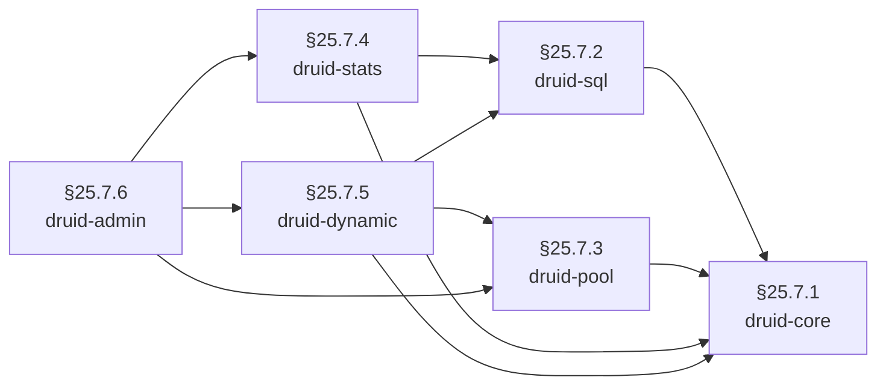

---

**文档版本**：V1.0.0-DESIGN<br>
**最后更新**：2026-07-27<br>
**文档状态**：草案